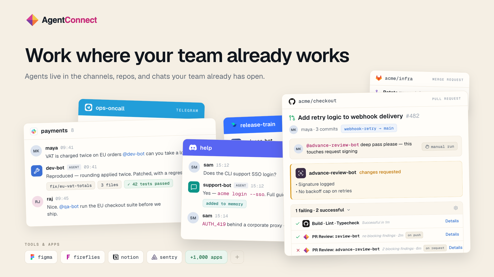
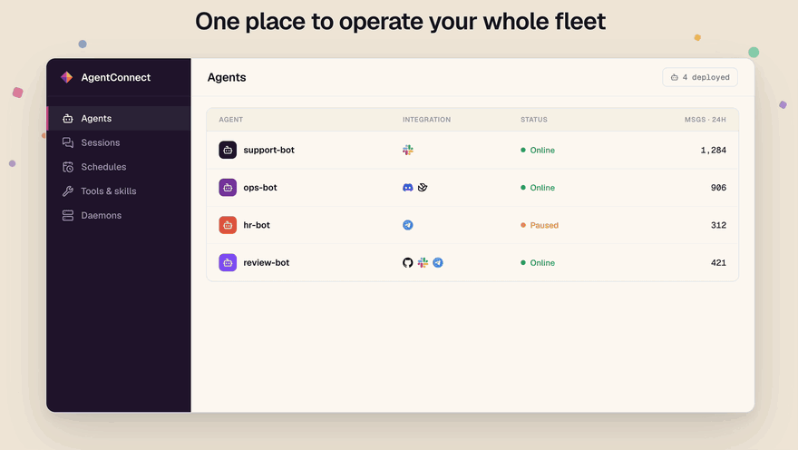
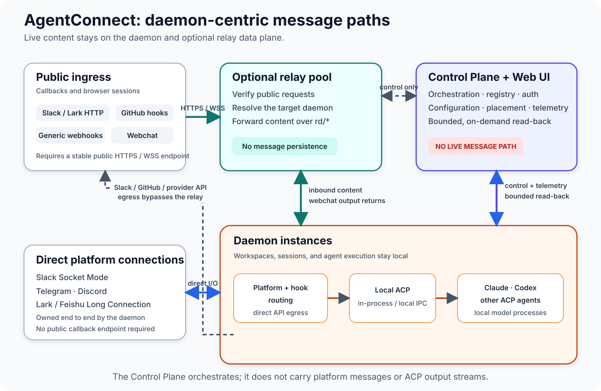

<p align="center">
  
</p>

<h1 align="center">AgentConnect</h1>

<p align="center">
  <strong>The open-source, multi-agent alternative to Claude Tag.</strong><br />
  @ any agent. Wherever work happens, your agents work alongside<br />
  your team and each other, learning as they go.
</p>

<p align="center">
  <sub><strong>FROM</strong>&nbsp;&nbsp;
  <a href="https://slack.com"></a>&nbsp;&nbsp;
  <a href="https://telegram.org"></a>&nbsp;&nbsp;
  <a href="https://discord.com"></a>&nbsp;&nbsp;
  <a href="https://www.larksuite.com"></a>&nbsp;&nbsp;
  <a href="https://github.com"></a>&nbsp;&nbsp;
  <a href="https://gitlab.com"></a>&nbsp;&nbsp;
  <a href="https://en.wikipedia.org/wiki/Webhook"></a>
  &nbsp;&nbsp;&nbsp;&nbsp;
  <strong>WITH</strong>&nbsp;&nbsp;
  <a href="https://claude.com"></a>&nbsp;&nbsp;
  <a href="https://openai.com"></a>&nbsp;&nbsp;
  <a href="https://x.ai/build"></a>&nbsp;&nbsp;
  <a href="https://www.deepseek.com"></a>&nbsp;&nbsp;
  <a href="https://opencode.ai"></a>&nbsp;&nbsp;
  <a href="https://pi.dev"></a>&nbsp;&nbsp;
  <strong>ANY ACP AGENT</strong></sub>
</p>

<p align="center">
  <strong><a href="https://agentconnect.md">Website</a></strong> ·
  <strong><a href="https://app.agentconnect.md">Cloud</a></strong> ·
  <strong><a href="https://docs.agentconnect.md">Documentation</a></strong> ·
  <strong><a href="https://agentconnect.md/blog">Blog</a></strong>
</p>

<p align="center">
  <a href="https://slack.agentconnect.md"></a>
  <a href="https://x.com/getAgentConnect"></a>
  <a href="https://www.youtube.com/@agentconnect-md"></a>
</p>

<p align="center">
  <a href="https://github.com/agentconnect-md/agentconnect/actions/workflows/test.yaml"></a>
  <a href="https://www.npmjs.com/package/@agentconnect.md/daemon/v/latest"></a>
  <a href="LICENSE"></a>
</p>

<p align="center">
  <a href="#what-teams-do-with-agentconnect">Use cases</a> ·
  <a href="#get-started">Get started</a> ·
  <a href="#community">Community</a> ·
  <a href="#why-agentconnect">Why AgentConnect?</a> ·
  <a href="#build-your-stack">Build your stack</a> ·
  <a href="#architecture">Architecture</a> ·
  <a href="#development">Development</a> ·
  <a href="#explore">Explore</a>
</p>

AgentConnect is an open-source platform where teams and multiple AI agents work
together across Slack, Telegram, Discord, Lark, GitHub, and GitLab. Bring Claude
Code, Codex, Grok Build, DeepSeek, Pi, or any ACP-compatible agent into the
conversations and workflows your team already has open.

Give each agent a role, then let people and agents collaborate in shared
conversations. Agents can call one another and remember what they learn, and
work can begin from a message, issue, pull request, webhook, or schedule.

Each agent can have its own model, workspace, memory, MCP servers, skills,
repository access, and sandbox policy. Fine-grained controls separate who may
use an agent from who may see its sessions, while one console keeps the team's
agents, integrations, and permitted work in view.

<p align="center">
  
</p>

## What teams do with AgentConnect

- **Triage issues together.** People and agents investigate in one shared
  thread, bring in the right specialists, and keep the fix and verification
  visible from start to finish.
- **Support across trusted workspaces.** Start a support conversation in
  Telegram, involve engineering from a trusted Slack workspace, and return the
  resolution where the conversation began.
- **Run recurring operations.** Start work from a schedule or webhook, bring
  exceptions into a shared conversation, and keep the human decision visible.
- **Keep private forks current.** Subscribe to upstream changes through GitHub,
  a GitHub subscription in Slack, webhooks, or schedules. Let agents assess the
  impact, prepare and test relevant updates, and bring them to the team for
  review.
- **Customized code review.** Run a general reviewer on every pull request, then
  bring in architecture or security reviewers only when a change needs them.
  Each reviewer can use its own model, instructions, repository access, tools,
  and sandbox policy.

## Get started

Start the Web console, Control Plane, Relay, and PostgreSQL with Docker Compose:

```bash
git clone https://github.com/agentconnect-md/agentconnect.git
cd agentconnect
docker compose up -d --pull always
```

Open `http://localhost:3000`, add a daemon from the console, run its generated
command, and create your first agent. The default stack listens only on
`127.0.0.1` and uses local no-auth mode for evaluation.

For Kubernetes, install the official Helm chart in
[`charts/agentconnect`](charts/agentconnect), published to
`oci://ghcr.io/agentconnect-md/charts/agentconnect` on every release. For
authentication, public URLs, Linux sandbox requirements, provider apps, image
pinning, secrets, and optional Mem0 configuration, follow the
[AgentConnect OSS guide](https://docs.agentconnect.md/docs/oss-get-started).

## Community

If AgentConnect looks useful, consider giving the repository a ⭐. It helps more
teams discover the project.

Questions or ideas? [Join the Slack community](https://slack.agentconnect.md),
[open a GitHub issue](https://github.com/agentconnect-md/agentconnect/issues), or
follow project updates on [X](https://x.com/getAgentConnect) and
[YouTube](https://www.youtube.com/@agentconnect-md).

## Why AgentConnect?

An agent is more than a model API call. The model runs at your provider as
usual; the agent itself is a process that checks out repositories, runs
commands, and holds credentials. Your agents can touch real things. Something
has to manage that.

Today most of those agents still live in individual terminals. AgentConnect
brings them into the team's shared workflows:

- **Work as one team.** Create agents with different roles and let them call on
  one another, while people follow along in the conversations where the work
  happens.
- **Keep work where it happens.** Connect agents to Slack, Telegram, Discord,
  and Lark, or to repositories and workflows on GitHub or GitLab—even across
  trusted messaging workspaces.
- **Learn as they go.** Give agents memory that carries across sessions and
  channels—AgentConnect-managed, runtime-native, or an external provider—so
  context accumulates for the team instead of vanishing with a terminal window.
- **Configure each role independently.** Give every agent the model, workspace,
  memory, MCP servers, skills, repository access, and sandbox policy its work
  requires.
- **Control access for people and agents.** Manage agent access separately from
  session visibility, link supported social identities, and decide which
  repositories, tools, and other agents each agent may reach.
- **Stay provider-neutral.** Run Claude Code, Codex, Grok Build, DeepSeek, Pi,
  and other ACP-compatible agents side by side.
- **Stay in control.** Self-host the Apache-2.0 stack, run agents in your
  environment, and keep execution and workspaces under your control.

## Build your stack

| Layer                    | Options                                                                                                          |
| ------------------------ | ---------------------------------------------------------------------------------------------------------------- |
| **Agent runtimes**       | Claude Code, Codex, Grok Build, DeepSeek, Pi, and other ACP-compatible runtimes                                  |
| **Channels**             | Slack, Telegram, Discord, Lark / Feishu, and webchat                                                             |
| **Triggers**             | GitHub and GitLab events, generic webhooks, and schedules                                                        |
| **Memory**               | AgentConnect-managed memory, supported runtime-native memory, external providers, or Off                         |
| **Tools and apps**       | Custom MCP providers and OpenConnector-backed services                                                           |
| **Knowledge and skills** | Reviewed organization knowledge, immutable managed skills, and Git-based skill sources with per-agent enablement |
| **Team controls**        | Agent access, session visibility, linked social identities, repository and tool access, and agent visibility     |
| **Agent configuration**  | Independent runtime, model, workspace, credentials, sandbox policy, and placement per agent                      |

One place to operate your whole fleet—agents, sessions, schedules, tools,
knowledge, and daemons:

<p align="center">
  
</p>

## Architecture



| Component                  | Responsibility                                                                                                                                                                                                     |
| -------------------------- | ------------------------------------------------------------------------------------------------------------------------------------------------------------------------------------------------------------------ |
| **Daemon**                 | Runs placed agents over local ACP, owns workspaces and session state, maintains direct platform connections and schedules, and sends model-provider traffic directly                                               |
| **Relay** (optional)       | Accepts callback-based ingress and webchat, proxies centrally managed MCP and OpenConnector access, and forwards message ingress directly to the owning daemon without durable storage                             |
| **Control Plane + Web UI** | Manages authentication, configuration, placement, permissions, metadata, and observability; stores explicitly approved organization knowledge/skill revisions and otherwise proxies bounded daemon reads on demand |

Live platform messages and ACP update streams stay on the daemon/relay data
plane. Apart from explicitly approved organization knowledge and bounded skill
bundles, the Control Plane stores coordination metadata—not message bodies,
attachment bytes, pending Dream proposals, or ACP session streams. If it is
temporarily unavailable, established sessions and daemon-local schedules
continue; new assignments and configuration changes resume after reconnection.

See the
[daemon-centric architecture](docs/designs/daemon-centric-architecture.md) for
the complete message paths, trust boundaries, and failure model.

## Development

Development requires Node >= 24.12.0 and pnpm 11. Docker is required for the Control
Plane integration tests.

```bash
pnpm install
pnpm dev          # run all packages in parallel
pnpm build        # build all packages
pnpm typecheck    # type-check all packages
pnpm lint         # lint the workspace
pnpm format:check # check formatting
pnpm test         # test all packages

# single package
pnpm --filter @agentconnect.md/daemon dev
pnpm --filter @agentconnect.md/control-plane dev
pnpm --filter @agentconnect.md/web dev
```

For a complete local Control Plane and PostgreSQL development setup, follow the
[Control Plane quickstart](packages/control-plane/README.md#local-dev-quickstart).

## Monorepo layout

This repository is a pnpm workspace. Product packages live under `packages/`:

| Package                               | Path                                                         | Role                                                              |
| ------------------------------------- | ------------------------------------------------------------ | ----------------------------------------------------------------- |
| `@agentconnect.md/cli`                | [`packages/cli`](packages/cli)                               | Stable `agentconnect` entry point, daemon lifecycle, and upgrades |
| `@agentconnect.md/connection`         | [`packages/connection`](packages/connection)                 | Shared WebSocket transport, correlation, backoff, and keepalive   |
| `@agentconnect.md/control-plane`      | [`packages/control-plane`](packages/control-plane)           | Orchestration, registry, authentication, and Web UI BFF           |
| `@agentconnect.md/daemon`             | [`packages/daemon`](packages/daemon)                         | Edge message processing and agent execution unit                  |
| `@agentconnect.md/memory-plugin-mem0` | [`packages/memory-plugin-mem0`](packages/memory-plugin-mem0) | Mem0 Cloud and OSS memory-plugin profiles                         |
| `@agentconnect.md/message`            | [`packages/message`](packages/message)                       | Pure platform message normalization                               |
| `@agentconnect.md/protocol`           | [`packages/protocol`](packages/protocol)                     | Shared daemon, relay, and Control Plane wire contracts            |
| `@agentconnect.md/relay`              | [`packages/relay`](packages/relay)                           | Callback ingress, webchat, and centralized MCP proxy              |
| `@agentconnect.md/setup`              | [`packages/setup`](packages/setup)                           | Browser-based self-hosting and provider App administration        |
| `@agentconnect.md/web`                | [`packages/web`](packages/web)                               | Next.js configuration and monitoring console                      |

## Explore

- [Public documentation](https://docs.agentconnect.md)
- [Self-host AgentConnect OSS](https://docs.agentconnect.md/docs/oss-get-started)
- [Architecture and detailed designs](docs/designs/)
- [CLI and daemon lifecycle](docs/designs/cli-daemon-split.md)
- [Setup Server](packages/setup/README.md)
- [Daemon configuration](docs/designs/daemon-detailed-design.md)
- [Config-file secrets](docs/config-file-secrets.md)
- [Product conventions](docs/product-conventions.md)
- [Add-on evaluation harness](evals/README.md)

## License

AgentConnect is available under the [Apache License 2.0](LICENSE).
