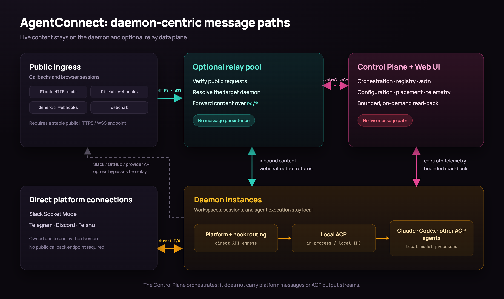

<p align="center">
  
</p>

<h1 align="center">AgentConnect</h1>

<p align="center">
  <strong>Run AI coding agents where your code and credentials live, then connect them everywhere your team works.</strong>
</p>

<p align="center">
  <a href="https://github.com/agentconnect-md/agentconnect/actions/workflows/test.yaml"></a>
  <a href="https://www.npmjs.com/package/@agentconnect.md/daemon/v/latest"></a>
  <a href="https://www.npmjs.com/package/@agentconnect.md/daemon/v/rc"></a>
  <a href="LICENSE"></a>
</p>

<p align="center">
  <a href="#why-agentconnect">Why AgentConnect?</a> ·
  <a href="#get-started">Get started</a> ·
  <a href="#architecture">Architecture</a> ·
  <a href="#explore">Explore</a>
</p>

AgentConnect is an open-source, daemon-centric platform for operating AI coding
agents across your own infrastructure. Claude, Codex, and other ACP-compatible
runtimes can participate in Slack, Telegram, Discord, Feishu, webchat, GitHub
events, webhooks, and scheduled tasks.

The execution daemon stays beside the agent and its workspace. The Control Plane
coordinates the fleet but never handles the live message path, so established
sessions keep running when it is temporarily unavailable.

## Why AgentConnect?

Built for teams that want a shared agent platform without moving execution or
workspace access into a hosted runtime:

- **Keep execution local.** Workspaces, agent processes, direct platform
  connections, and model-provider traffic stay on daemon hosts you control.
  Public callback ingress terminates on the optional relay you operate.
- **Operate agents as a fleet.** Configure runtimes, workspaces, integrations,
  secrets, schedules, and sessions from one Web console.
- **Preserve data boundaries.** The Control Plane stores orchestration metadata,
  not message bodies, attachment bytes, or ACP session streams.
- **Connect the tools you already use.** Bring agents into chat, webchat, GitHub
  events, generic webhooks, and scheduled workflows.
- **Choose the right memory model.** Use managed, native, external, or disabled
  persistent memory per agent.
- **Let agents collaborate safely.** Directional discovery and call policies
  control which agents can delegate work to one another.

## Get started

Pick the path that matches what you want to do.

### Self-host locally

Start the Web console, Control Plane, Relay, and PostgreSQL with Docker Compose:

```bash
git clone https://github.com/agentconnect-md/agentconnect.git
cd agentconnect
docker compose up -d --pull always
```

Open `http://localhost:3000`. The default stack listens only on `127.0.0.1`,
uses no-auth mode, and adds no sample agents or sessions.

The daemon is intentionally not part of the Compose stack: it runs on each agent
host beside that host's workspaces and credentials. Use the Web console to
provision a daemon after the stack is ready.

To override the image version, ports, secrets, public URLs, or optional Logto
and GitHub App configuration, load the provided environment file explicitly:

```bash
cp compose.env.example compose.env
docker compose --env-file compose.env up -d --pull always
```

### Develop from source

Development requires Node >= 24 and pnpm 11. Docker is also required for the
Control Plane integration tests.

```bash
pnpm install
pnpm dev       # run all packages in parallel
pnpm build     # build all packages
pnpm typecheck # type-check all packages
pnpm lint      # lint the workspace
pnpm test      # test all packages

# single package
pnpm --filter @agentconnect.md/daemon dev
pnpm --filter @agentconnect.md/control-plane dev
pnpm --filter @agentconnect.md/web dev
```

For a complete local Control Plane and Postgres development setup, follow the
[Control Plane quickstart](packages/control-plane/README.md#local-dev-quickstart).

## Connect your stack

AgentConnect uses ACP at the runtime boundary and connects agents to the systems
where work already happens.

| Surface           | Supported options                                                                   |
| ----------------- | ----------------------------------------------------------------------------------- |
| Agent runtimes    | Claude, Codex, and other ACP-compatible runtimes                                    |
| Team channels     | Slack, Telegram, Discord, Feishu, and webchat                                       |
| Event sources     | GitHub events, generic webhooks, and scheduled tasks                                |
| Persistent memory | Managed AgentConnect memory, runtime-native memory, external providers, or disabled |
| Collaboration     | Directional agent discovery and policy-controlled delegation                        |

## Architecture



| Component                  | Responsibility                                                                                                                          |
| -------------------------- | --------------------------------------------------------------------------------------------------------------------------------------- |
| **Daemon**                 | Runs agents, owns local ACP sessions and workspaces, connects direct platform bots, and sends provider API traffic                      |
| **Relay** (optional)       | Accepts Slack and Feishu HTTP callbacks, GitHub and generic webhooks, and webchat traffic, then routes it directly to the owning daemon |
| **Control Plane + Web UI** | Manages authentication, configuration, placement, metadata, and observability                                                           |

The Control Plane does not persist message bodies, ACP update streams, or
attachment bytes. Authorized console reads are proxied from the owning daemon on
demand. See the
[daemon-centric architecture](docs/designs/daemon-centric-architecture.md) for
the complete trust boundaries and failure model.

## Explore

- [Product conventions](docs/product-conventions.md)
- [Architecture and detailed designs](docs/designs/)
- [CLI and daemon lifecycle](docs/designs/cli-daemon-split.md)
- [Daemon configuration](docs/designs/daemon-detailed-design.md)
- [Config-file secrets](docs/config-file-secrets.md)
- [Add-on evaluation harness](evals/README.md)

## Monorepo layout

This repository is a pnpm workspace with eight packages:

| Package                               | Path                                                         | Role                                                              |
| ------------------------------------- | ------------------------------------------------------------ | ----------------------------------------------------------------- |
| `@agentconnect.md/cli`                | [`packages/cli`](packages/cli)                               | Stable `agentconnect` entry point, daemon lifecycle, and upgrades |
| `@agentconnect.md/connection`         | [`packages/connection`](packages/connection)                 | Shared WebSocket transport, correlation, backoff, and keepalive   |
| `@agentconnect.md/control-plane`      | [`packages/control-plane`](packages/control-plane)           | Orchestration, registry, authentication, and Web UI BFF           |
| `@agentconnect.md/daemon`             | [`packages/daemon`](packages/daemon)                         | Edge message processing and agent execution unit                  |
| `@agentconnect.md/memory-plugin-mem0` | [`packages/memory-plugin-mem0`](packages/memory-plugin-mem0) | Mem0 Cloud and OSS memory-plugin profiles                         |
| `@agentconnect.md/protocol`           | [`packages/protocol`](packages/protocol)                     | Shared daemon, relay, and Control Plane wire contracts            |
| `@agentconnect.md/relay`              | [`packages/relay`](packages/relay)                           | HTTP bot, webhook, GitHub, and webchat ingress                    |
| `@agentconnect.md/web`                | [`packages/web`](packages/web)                               | Next.js configuration and monitoring console                      |

## Evaluate AgentConnect add-ons

Credential-free contracts and the configured Promptfoo memory/collaboration treatment matrix live in [`evals/`](evals/README.md). The suite measures paired add-on effects and raw-ACP harness neutrality; it does not combine underlying harness capability into an AgentConnect score.

## Native ACP runtimes outside the registry

The daemon includes a reviewed fallback catalog for ACP harnesses that ship a
native ACP command but may be absent from the public registry:

| Runtime          | Command           | Initialized-state signal                                       | Memory modes      |
| ---------------- | ----------------- | -------------------------------------------------------------- | ----------------- |
| Hermes Agent     | `hermes acp`      | `$HERMES_HOME` or `~/.hermes`                                  | `managed`, `none` |
| Open Interpreter | `interpreter acp` | `$INTERPRETER_HOME` or `~/.openinterpreter`                    | `managed`, `none` |
| Kiro CLI         | `kiro-cli acp`    | `$KIRO_HOME` or `~/.kiro`                                      | `managed`, `none` |
| Maki             | `maki acp`        | XDG `maki` config/data/state directories or `~/.maki`          | `managed` only    |
| ZeroClaw         | `zeroclaw acp`    | `$ZEROCLAW_CONFIG_DIR`, `$ZEROCLAW_DATA_DIR`, or `~/.zeroclaw` | `managed`, `none` |
| Oh My Pi         | `omp acp`         | `$PI_CODING_AGENT_DIR` or `~/.omp/agent`                       | `managed`, `none` |

Runtime definitions resolve in `curated < usable registry/cache < explicit user`
order. A curated winner is not advertised or launched merely because its binary
exists: the daemon also requires initialized local state and runs a disposable
`initialize + session/new` ACP probe with a private HOME, no MCP servers, and
permission/elicitation requests denied. Registry-backed and explicit user
definitions retain their existing behavior.

The probe copies only reviewed credential/config files into its disposable
home; sessions, history, memory, logs, caches, extensions, and MCP configuration
stay behind. Probe failures are local and sanitized. Maki is intentionally
`managed`-only because its bundled persistent-memory plugin has no reliable,
non-overridable per-process off switch; selecting `none`, `native`, or an
external sole-store provider fails closed.

## Docker & Kubernetes credentials

Agents can receive whole tool config files through write-only `*_DATA`
secrets: `DOCKER_CONFIG_DATA` (a Docker `config.json`) and `KUBECONFIG_DATA`
(a kubeconfig). At agent start the daemon materializes each value as a private
mode-0600 file and points the tool's standard env var (`DOCKER_CONFIG`,
`KUBECONFIG`) at it, so `docker`, `kubectl`, `helm`, `helmfile` and anything
else that honors those variables works unchanged — the raw value never enters
the agent's environment. See
[`docs/config-file-secrets.md`](docs/config-file-secrets.md) for setup and
security details.

## In-conversation commands

While talking to an agent in a thread you can control its run with short commands.
They are handled by the daemon and never sent to the agent itself.

| Command            | Alias on Slack | Effect                                                               |
| ------------------ | -------------- | -------------------------------------------------------------------- |
| `/stop`, `/cancel` | `!stop`        | Interrupt the agent's current turn.                                  |
| `/queue <message>` | `!queue …`     | Hold `<message>` and send it automatically once the agent goes idle. |

On Slack use the `!` alias — Slack reserves `/…` for its own slash commands, so the
bot never receives `/stop`. Commands respect the same routing and `allowedUserIds`
rules as normal messages, and work even when the Control Plane is offline. See
[`docs/designs/daemon-detailed-design.md`](docs/designs/daemon-detailed-design.md) §8.8.

## License

AgentConnect is available under the [Apache License 2.0](LICENSE).
