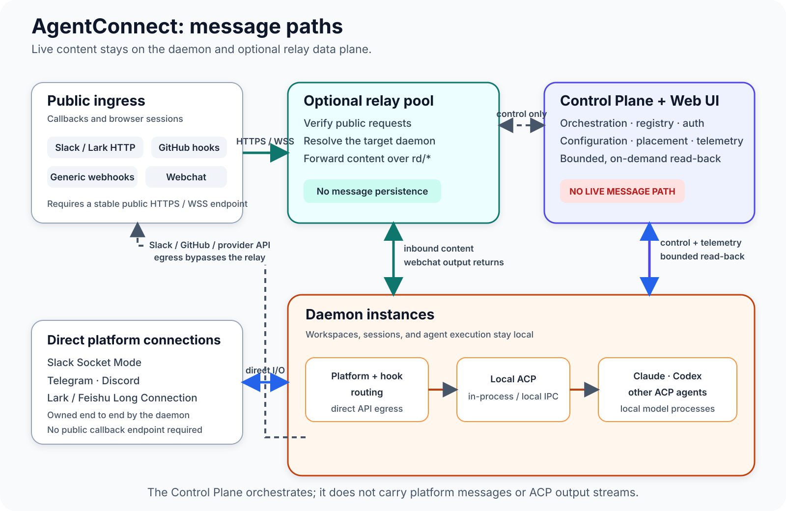

# Architecture Design: Messaging and Agent Execution

> Status: Implemented (current architecture) — the architecture described here has been implemented in `packages/{message,protocol,daemon,control-plane,relay}` and serves as the upstream anchor for the detailed design documents
> Scope: A new system that bridges messaging platforms (such as Slack and Telegram) to AI coding agents
> Keywords: control-plane/data-plane separation, daemon-owned platform integrations, daemon-owned ACP, deployment modes, operator trust, optional sandboxing, daemon visibility

---

## 1. Background and Motivation

The system connects user requests from messaging platforms such as Slack and Telegram to AI agents such as Claude and Codex running across multiple daemon instances, then returns the results.

The central design question is: **should message ingestion and processing live
centrally, or on the execution nodes?** This design keeps routing and execution on
the daemon. Direct integrations terminate there; callbacks that require a stable
public endpoint terminate at an optional relay and are forwarded straight to the
owning daemon. The Control Plane remains responsible only for orchestration.

The direct consequences are:

- The center is not on the hot path of any user message.
- The agent's driver protocol (ACP) is **owned by the daemon and never crosses the Control Plane**: self-hosted, over a local connection with no network hop; in the pool, over one in-cluster dial to the sandbox pod (§3.1).
- Each daemon is a self-contained "message processing + agent execution" unit that can scale and tolerate failures independently.

**The daemon is a role in the data plane, not a deployment location.** Where it
runs is a separate choice, and the two modes in §3.1 differ in who operates the
host, where durable state lives, and how the agent runtime is launched. Claims
below that hold in only one mode are marked; everything unmarked holds in both.

---

## 2. Goals and Non-Goals

### Goals

- Keep the Control Plane off the messaging hot path. The control connection
  carries orchestration and telemetry plus bounded, authorized, on-demand reads
  of daemon-local data for the Web UI; those reads are not persisted by the
  Control Plane.
- Keep direct platform integrations and agent execution owned by the daemon,
  using the relay only for ingress that requires a stable public callback or
  browser endpoint.
- Allow daemons to scale horizontally and independently, so one daemon failure does not affect other daemons.
- Run multiple agents on one daemon, with a separate ACP adapter for each agent type.
- Allow established sessions to continue sending, receiving, and executing on their daemons while the Control Plane is temporarily unavailable (degraded availability).

### Non-Goals

- This design does not introduce a message queue or event bus. Either may be an evolution path for future high-throughput scenarios.
- This design does not change the protocol between agents and models; all agents use ACP.
- This design does not solve strongly consistent coordination across daemons. See the open questions in §13.

---

## 3. Architecture Overview



The equivalent ASCII representation below makes the same design easier to diff
and search.

```
 Public callbacks and browsers                    Control Plane + Web UI
 Slack HTTP · Lark / Feishu HTTP · GitHub · generic hooks · webchat   (control only)
                 │ HTTPS / WSS                         │
                 ▼                                     │ routes + config
        ┌─────────────────────┐                        │
        │ optional relay pool │◀───────────────────────┘
        └──────────┬──────────┘
                   │ rd/* content; webchat output returns
                   ▼
 Direct platforms ┌──────────────────────────────────────────┐
 Slack Socket  ◀─▶│ daemon instances                         │◀── CP WebSocket
 Telegram          │ platform + hook routing                  │    control,
 Discord           │              │ daemon ACP                │    telemetry,
 Lark / Feishu     │              ▼                           │    bounded reads
 Long Connection   │       Claude / Codex / ACP agents        │
                   └──────────────────────────────────────────┘
                      └─ direct Slack/GitHub/provider API egress
```

### Components

| Component             | Role                                                                                                                                                                                                                                                              |
| --------------------- | ----------------------------------------------------------------------------------------------------------------------------------------------------------------------------------------------------------------------------------------------------------------- |
| **Control Plane**     | Orchestration, scheduling, scaling, Web UI, and registry; does not handle live platform message traffic or integrate with platforms                                                                                                                               |
| **daemon**            | Direct platform integration, relay-delivered routing, and agent runtime; a self-contained message-processing and execution unit                                                                                                                                   |
| **relay**             | Optional public ingress plane: Slack and Lark / Feishu HTTP callbacks, GitHub and generic webhooks, and webchat pass through the relay pool to daemons; daemons still send ordinary provider API traffic directly. See [shared-bot-relay.md](shared-bot-relay.md) |
| **Platform adapters** | `slack-adapter`, `telegram-adapter`, Discord, Lark / Feishu, and others; handle platform I/O and message normalization                                                                                                                                            |
| **ACP adapters**      | `claude-agent-acp` and `codex-acp`; implement ACP and drive the model runtime the daemon owns                                                                                                                                                                     |
| **Agent instances**   | Claude and Codex model processes                                                                                                                                                                                                                                  |

### 3.1 Deployment modes

The separation above is the invariant. How a daemon is hosted is not, and the
two supported modes differ enough that a claim about one is often false about
the other:

|                       | **Self-hosted daemon**                                         | **Managed daemon pool**                                                                |
| --------------------- | -------------------------------------------------------------- | -------------------------------------------------------------------------------------- |
| Who operates the host | The organization                                               | The install                                                                            |
| Process lifecycle     | Started by its operator (`agentconnect up`, or a service unit) | Pool members of one Kubernetes Deployment, governed by the Control Plane's duty ledger |
| Ownership             | The daemon belongs to one organization                         | An install-wide member takes duty for many organizations                               |
| Durable store         | Daemon-local SQLite                                            | One install-level PostgreSQL data plane shared by every member                         |
| Agent runtime         | A child process on the daemon host, over stdio                 | A sandbox pod the daemon dials directly, carrying the same ACP stream                  |
| Host credentials      | The operator's own, on their machine                           | Deployment-supplied and session-scoped; no operator sits at the host                   |

AgentConnect Cloud runs the second mode; the first is what an OSS or
bring-your-own-machine deployment runs. Both dial out to the same Control Plane
over the same control WebSocket, and in neither does live message content or an
ACP update stream cross the Control Plane. Everything in §5 through §8 and §10
through §11 is about that shared data plane and holds in both.

The mode-specific designs are
[k8s-daemon-pool.md](k8s-daemon-pool.md) (duty ledger, membership, placement),
[cloud-data-plane-postgres.md](cloud-data-plane-postgres.md) (the shared durable
store), and [cluster-spawn-and-shim.md](cluster-spawn-and-shim.md) (sandbox-pod
spawn and the in-sandbox shim).

---

## 4. Component Details

### 4.1 Control Plane

Its responsibilities are deliberately narrow:

- **Orchestration, scheduling, and scaling**: decide which daemon hosts each workspace or session, and start, stop, and assign agents on a daemon according to load. Daemons always establish the connection outbound to the CP, which never dials in. Who runs the daemon process depends on the mode (§3.1): a self-hosted operator starts it themselves, while a pool member is started by the install's Deployment and takes duty through the Control Plane's ledger.
- **Registry/Auth**: daemon registration and health, routing policies, and authentication policies.
- **Web UI**: configuration, editing, and runtime monitoring.

**Explicitly excluded**: it does not connect to Slack or Telegram, receive platform messages, or participate in the message loop. Even when the Control Plane is temporarily unavailable, **established sessions continue sending, receiving, and executing on their daemons** (degraded availability).

### 4.2 daemon

A daemon is a **self-contained message-processing + agent-execution unit**:

- It owns direct platform connections such as Slack Socket Mode, Lark / Feishu
  Long Connection, and Telegram, and receives pre-addressed Slack and
  Lark / Feishu HTTP, hook, and webchat items from the relay.
- It routes and dispatches messages itself, then drives the agent over
  **daemon-owned ACP** — local IPC to a child process self-hosted, one dial to
  the sandbox pod in the pool (§3.1). Neither shape involves the Control Plane.
- It maintains one WebSocket to the Control Plane for control/telemetry and
  correlated, bounded read-back requests made by authorized Web UI callers.
  Those reads are transient and do not put live platform traffic or ACP output
  streams on the CP path.

### 4.3 Platform Adapters (`slack-adapter`, `telegram-adapter`, etc.)

- Wire-level normalized message schemas live in `@agentconnect.md/protocol`.
  Pure Slack, Lark, Telegram, and Discord normalization lives in
  `@agentconnect.md/message` and depends on that contract; direct daemon ingress
  and optional relay ingress can share it without pulling in SDK clients,
  routing, or I/O.
- Handle platform connections, authentication, message sending and receiving, rich-text and attachment normalization, and inbound/outbound mapping.
- Hold platform credentials. See §9, Security.
- Produce normalized internal messages and pass them through the daemon's local routing layer to the agent.

### 4.4 ACP Adapters (`claude-agent-acp`, `codex-acp`)

- Implement ACP and provide the entry point to an agent.
- Receive ACP calls **from the owning daemon**: an in-process call, local IPC, or a local socket self-hosted; one in-cluster dial to the sandbox pod in the pool (§3.1).
- Start and drive the corresponding model process (Claude or Codex) — a child process on the daemon host self-hosted, the sandbox pod's runtime in the pool. Either way the daemon owns the ACP session and no ACP traffic crosses the Control Plane.

---

## 5. Connections and Protocols

### 5.1 Platform ↔ daemon: Direct or Relay-Assisted Ingress

- Dedicated-bot ingress connects directly to the daemon.
- Slack and Lark / Feishu HTTP callbacks, GitHub and generic webhooks, and webchat ingress enter through the relay pool, which forwards the normalized request to the owning daemon.
- Outbound platform traffic is sent directly by the daemon.
- Neither ingress model puts the Control Plane on the message hot path. See [shared-bot-relay.md](shared-bot-relay.md).

### 5.2 Control Plane ↔ daemon: WebSocket (Control and Bounded Read-Back)

- The daemon initiates a WebSocket connection to the Control Plane.
- **Allowed payloads**: registration, heartbeats and health, orchestration
  commands, status and metrics reports, and correlated requests that proxy
  bounded daemon-local session, tool-body, memory, or workspace data to an
  authorized Web UI caller without persistence.
- **Excluded payloads**: live ACP update streams and platform ingress or reply
  traffic. Those messaging paths stay on the daemon or relay data plane.

### 5.3 Daemon → agent: ACP

- **ACP is daemon-owned, never a Control Plane protocol.** A platform adapter's
  call reaches the ACP adapter without leaving the data plane. That is the part
  that defines the architecture.
- Self-hosted, the call is **in-process or local IPC**, with no network hop.
- In the pool, the runtime lives in a sandbox pod and the daemon dials it
  directly — one in-cluster hop, still no Control Plane in between. See
  [cluster-spawn-and-shim.md](cluster-spawn-and-shim.md).

---

## 6. Key Data Flows

### 6.1 Inbound Message Lifecycle

```
Direct:
  Slack Socket Mode / Telegram / Discord / Lark / Feishu
    ↔ daemon direct adapter
    → daemon routing → [daemon-owned ACP] → agent

Relay-assisted:
  Slack HTTP · Lark / Feishu HTTP · GitHub · generic webhook · webchat
    → optional relay → rd/* → owning daemon
    → daemon routing → [daemon-owned ACP] → agent
    → direct Slack/GitHub/provider API egress, or webchat output via the relay
```

The Control Plane is not part of either live content path. It supplies control-plane
configuration and authorization metadata, but platform messages and ACP output do not
traverse it.

### 6.2 Orchestration Flow (Decoupled from Messages)

```
daemon ←→ Control Plane (WebSocket)
  - daemon registration + heartbeat + capability report (supported platforms/agents)
  - Control Plane commands: session assignment, agent start/stop, configuration, scaling
  - daemon reports: runtime status, usage, health
```

Orchestration happens on the control plane and **never blocks or enters** the path of a user message.

---

## 7. Orchestration Model

The Control Plane achieves "orchestration without touching messages" over the control WebSocket:

- **Session ownership**: decide which daemon is responsible for a workspace or session. The daemon then takes over that session's platform traffic itself.
- **Agent lifecycle**: instruct a daemon to start or stop a particular type of agent (Claude or Codex).
- **Scaling and placement**: make agent- and session-level placement and scaling decisions from the load and health reported by daemons. It does not start or stop daemon processes.
- **Degraded semantics**: if the Control Plane is unavailable, daemons keep existing sessions running. New-session assignment and scaling pause, then catch up after recovery.

---

## 8. Multiple Agents and Multiple Daemons

- **Multiple agents per daemon**: one daemon runs multiple agents concurrently, each driven by an independent ACP adapter (`claude-agent-acp` or `codex-acp`).
- **Multiple daemons**: every daemon has the same topology and platform-integration capabilities; the Control Plane orchestrates how they share sessions and load.
- **Horizontal scaling**: adding a daemon adds throughput. With no central hot path, scaling is approximately linear.

---

## 9. Security, Trust, and Credential Management

### 9.1 Execution trust model

This subsection is the normative trust model for daemon execution. Feature-specific
designs must not silently strengthen it. It is written for the self-hosted mode,
where a person holds the operator role. In the managed pool no such person
exists: the install is the operator, no agent is operator-trusted, and the
sandbox pod is the boundary rather than an option — see
[cluster-spawn-and-shim.md](cluster-spawn-and-shim.md).

A **daemon operator** is the person who controls the host, the daemon OS account,
the daemon process, and its connection credential. This is an operational role, not
an organization RBAC role. The organization trusts that operator to decide which
agents may execute on the machine and what host access those agents may receive.

An agent that runs without the AgentConnect OS sandbox is **operator-trusted code**,
not a hostile tenant that is expected to be isolated from the daemon user. Its ACP
runtime, model-authored tools, and child processes have the ambient authority of the
daemon OS account, including access to same-user host resources and daemon state.
AgentConnect should discourage this mode for unknown or untrusted workloads, but it
must remain supported when an operator deliberately trusts the agent or is using a
disposable test environment.

The operator has three independent controls:

| Control                                                                         | Trust consequence                                                                                                                                                                               |
| ------------------------------------------------------------------------------- | ----------------------------------------------------------------------------------------------------------------------------------------------------------------------------------------------- |
| Restrict [daemon visibility](resource-visibility.md) to selected people         | Limits which organization members can discover, select, or manage the daemon as a placement target; selecting only the operator makes it private to them. It does not create process isolation. |
| Enable **Run in sandbox** on an agent                                           | Treats that agent as untrusted relative to the host and confines its runtime when the daemon supports the sandbox.                                                                              |
| Start the daemon with `--require-sandbox` or set `security.requireSandbox=true` | Requires every agent on that daemon to run sandboxed and fails closed when the host cannot enforce it.                                                                                          |

A host without a supported sandbox remains usable for operator-trusted agents unless
the operator explicitly enabled the daemon-wide requirement. The daemon and console
must report the missing capability clearly; they must never describe an unsandboxed
runtime as confined.

Daemon visibility and runtime isolation are orthogonal. An operator who shares a
daemon without requiring sandboxing is choosing to trust the authorized members and
agents placed there. An operator who does not want that trust relationship must keep
the daemon restricted, require sandboxing for the whole daemon, or both.

**Implementation invariant:** a feature must not turn optional agent sandboxing into
an implicit daemon-wide requirement merely because it stores mutable state under the
daemon OS user or because the organization has multiple members. Integrity against an
unsandboxed same-user agent is outside the isolation guarantee by design: the operator
has declared that agent trusted. Feature-specific helpers may retain their own narrow
isolation boundaries; only explicit operator policy may require every ordinary ACP
host to run sandboxed.

### 9.2 Credentials and cross-workspace isolation

> Platform credentials are distributed across edge nodes, making this the part of the architecture that needs the most careful design.

- **Credential delivery**: the Control Plane persists managed integration
  credentials through the configured `SecretCipher`; the stored representation
  depends on the runtime-configured cipher. It sends assigned values to
  daemons or relays through `integration/*` control frames over encrypted
  transport. A daemon holds assigned integration configuration in memory and
  re-converges it after reconnect; CP credentials are never written to
  `agent.json`. Credential values must never be logged. The
  protocol separately reserves lease-based `secrets/*` frames for
  secret-manager references.
- **Least privilege**: a daemon receives credentials only for the workspaces and platforms for which it is responsible.
- **Control-plane authentication**: long-lived, revocable opaque API keys authenticate daemon, user, relay, and OAuth principals. The Control Plane stores only an HMAC lookup value, validates keys during authentication, and supports rotation and revocation. These credentials are independent of machine scope-attestation capabilities. See [daemon-api-key-auth.md](daemon-api-key-auth.md).
- **Isolation**: AgentConnect scopes sessions and credentials to their assigned
  agents and workspaces. The OS sandbox supplies the process boundary for agents
  that are not trusted with the daemon user's ambient authority. Unsandboxed agents
  share that trust domain by operator choice. Requirements for stronger isolation
  can use separate daemon users, machines, or daemons.

---

## 10. Observability

- **Challenge**: messages do not pass through the center, weakening centralized observability.
- **Mitigation**: daemons emit metrics and traces through the configured
  OpenTelemetry path. Session milestones, usage summaries, health, and
  capability facts use the control WebSocket; credential and message content
  are excluded from telemetry.
- **Tracing**: inject a trace ID into normalized messages and carry it through the platform adapter, the ACP hop, and the agent for end-to-end tracing.

---

## 11. Failures and Recovery

| Failure                | Impact                                      | Behavior                                                                                                                                                                                                                                                                                      |
| ---------------------- | ------------------------------------------- | --------------------------------------------------------------------------------------------------------------------------------------------------------------------------------------------------------------------------------------------------------------------------------------------- |
| Control Plane outage   | Orchestration pauses                        | **Existing sessions continue on their daemons**; new assignments and scaling pause, then catch up after recovery                                                                                                                                                                              |
| One daemon fails       | Sessions owned by that daemon are disrupted | The failure domain is isolated; the Control Plane detects the failure and reassigns sessions to another daemon                                                                                                                                                                                |
| Platform adapter fails | Traffic for that platform is affected       | The daemon reconnects or retries itself and reports an alert                                                                                                                                                                                                                                  |
| Agent runtime crashes  | One agent task fails                        | The daemon reclaims the exited host and the next message re-spawns the runtime: a new child process self-hosted, a new process inside the agent's existing sandbox in the pool. A fresh sandbox generation happens only when the pod or its channel was lost, not on an ordinary runtime exit |

---

## 12. Advantages and Drawbacks

### Advantages

- **No central hot path**: messages do not pass through the Control Plane, so the center is neither a throughput bottleneck nor a single point of failure.
- **Low latency**: the message loop stays inside the daemon and its ACP call is local or one in-cluster hop, never a round trip through a center.
- **Strong failure isolation**: one daemon failure affects only its sessions, producing a small blast radius.
- **Near-linear scaling**: adding daemons adds throughput without a central bottleneck.
- **Degradable control plane**: established sessions keep running while the Control Plane is unavailable.
- **Proximity deployment**: daemons can run near their users or platforms to reduce cross-region latency.

### Drawbacks

- **Distributed credentials**: platform credentials move to each daemon, complicating management and rotation, expanding the security surface, and creating a strong dependency on secret management.
- **Heavier daemons**: platform integration, local routing, and agent execution all reside in the daemon, increasing operational, deployment, and upgrade complexity.
- **Weaker centralized observability**: because messages do not pass through the center, additional reporting and end-to-end tracing are required.
- **Difficult cross-daemon coordination**: agents on different daemons cannot collaborate directly and need either the platform or another channel as an intermediary.
- **Complex session rebalancing**: sessions have daemon affinity, so load migration and rebalancing require a lossless migration mechanism.

---

## 13. Open Questions and Future Work

1. **Session affinity and routing tables**: how should the Control Plane routing table coordinate with local daemon routing? How can session migration (rebalancing) avoid disruption?
2. **High-throughput evolution**: introduce a Gateway + Message Bus between daemons and the Control Plane, fully separating the control and data planes, as an upgrade path for higher-throughput and multi-tenant scenarios.
