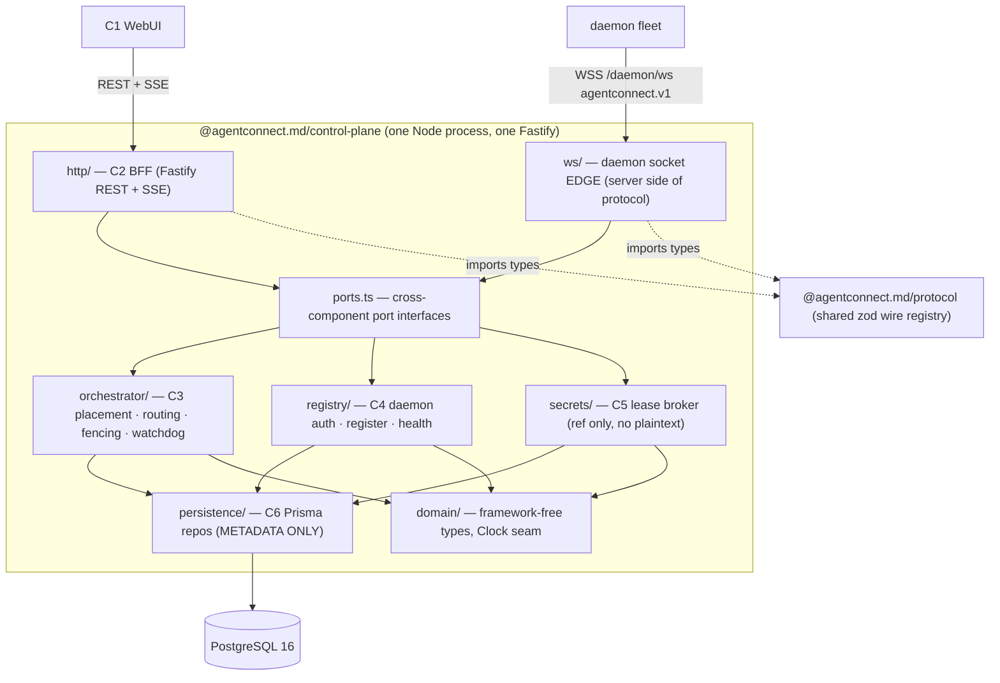
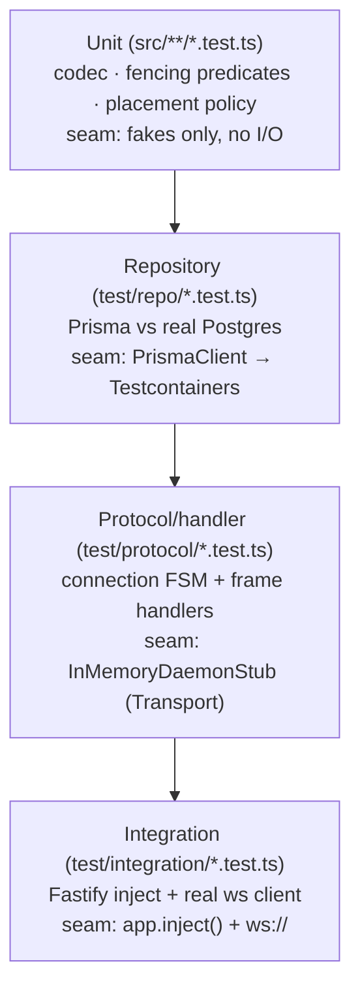

# AgentConnect Control Plane — Implementation Design

> **Status:** Implemented architecture · **Owner:** AgentConnect team
>
> **Reading note:** this is an architecture and implementation-design reference,
> not an exhaustive inventory of the current source tree. The source under
> `packages/control-plane/src/` and the registry in
> `packages/protocol/src/frame.ts` are authoritative for exact filenames,
> frames, and behavior. Examples below document the intended seams and
> invariants.
>
> **Scope.** This document describes the AgentConnect **Control Plane (CP)**,
> including the server side of the daemon↔CP WebSocket protocol. The CP stores
> **only control-plane metadata** in PostgreSQL via Prisma — never
> `NormalizedMessage.text`, ACP `session/update` streams, or attachment bytes
> (those stay daemon-local). Components expose injected seams for repositories,
> transport, and time so fencing and lifecycle behavior can be tested
> deterministically.

---

## 1. Overview & component map

The Control Plane uses the **C1 WebUI / C2 API-BFF / C3 Orchestrator / C4
Registry & Auth / C5 Secrets / C6 Persistence / C7 Observability** component
model. **C2-C5 run together** inside one `@agentconnect.md/control-plane` Node
process: a single Fastify instance serves the BFF REST surface and hosts the
daemon WebSocket endpoint, sharing one port and one Postgres connection. C1 is a
separate frontend consuming C2; C7 is cross-cutting.

Nothing crosses a component boundary except through a typed port, and C3 never
imports `fastify`, `ws`, or `@prisma/client` directly. The shared zod
`protocol` package is the wire source of truth for every registered frame and
the `sessionEpoch`/`launchId` fencing fields consumed by both edges.



**Frame → component routing** (what answers what, per protocol §3–§9):

| Frame group                                                      | Edge handler (`ws/handlers/`)                       | Service (port)                                        |
| ---------------------------------------------------------------- | --------------------------------------------------- | ----------------------------------------------------- |
| `auth` → `auth/ok`                                               | `auth.ts`                                           | `DaemonAuth` (C4) + `EpochService` (C3)               |
| `register` → `register/ok`                                       | `register.ts`                                       | `DaemonRegistry` (C4) + `Orchestrator.reconcile` (C3) |
| `heartbeat`                                                      | `heartbeat.ts`                                      | `DaemonRegistry` + `Watchdog` (C4/C3)                 |
| `event/session`, runtime, channel, and usage facts               | `event-session.ts`, `daemon-runtimes.ts`, and peers | registry and persistence ports                        |
| hook barriers, reports, and GitHub review authorization          | `hook-start.ts`, `hook-report.ts`, review handlers  | hook/review services and repositories                 |
| Git credentials                                                  | `gitcred.ts`                                        | repository authorization and credential service       |
| C→D control (`route/assign`, lifecycle, cron, roster, config, …) | issued by `orchestrator/outbound.ts`                | `Orchestrator` (C3)                                   |
| `*_ack` / `error` responses to CP-issued requests                | `correlator.ts`                                     | resolves or rejects the issuing call                  |

---

## 2. Component architecture & module layout

### 2.1 Two edges, four services, one composition root

`http/` and `ws/` are the **two transport edges**; they translate transport ⇄ domain and call services through `ports.ts`. The four services (`orchestrator/` C3, `registry/` C4, `secrets/` C5) depend **only** on ports and on `persistence/ports.ts` — never on a transport library or Prisma. `domain/` has zero internal dependencies. `persistence/` is the **only** importer of `@prisma/client`. This layering is review-enforced now and later locked by an ESLint `no-restricted-imports` rule.

```
packages/control-plane/src/
├── index.ts                  # thin bootstrap: loadConfig → buildContainer → listen → attach ws → graceful shutdown
├── app.ts                    # buildApp(deps): assembles Fastify + ws + services for prod AND tests (one graph)
├── config/
│   └── env.ts                # zod-validated process.env → AppConfig (fail-fast on boot)
├── container.ts              # composition root: manual DI, wires repos→services→edges
│
├── http/                     # ─── C2: API / BFF (Fastify) ───────────────────────────
│   ├── server.ts             # buildHttpServer(deps): Fastify instance, plugins, error mapper
│   ├── plugins/
│   │   ├── auth.ts           # humanAuth preHandler (OIDC/JWT real | devAuth stub by config) — §5.6
│   │   └── zod.ts            # fastify-type-provider-zod
│   ├── routes/
│   │   ├── health.ts         # GET /health   (the existing handler moves here)
│   │   ├── agents.ts         # CRUD /agents, PATCH spec (name/description/model/runtime/caps), /agents/:id/integrations
│   │   ├── daemons.ts        # GET /daemons (liveness), /daemons/capabilities, /daemons/:id, POST /daemons/token
│   │   ├── keys.ts           # POST/GET /daemons/:id/keys, DELETE /daemons/:id/keys/:keyRowId (mint/list/revoke)
│   │   ├── sessions.ts       # GET /sessions, /sessions/:id  (metadata only)
│   │   ├── crons.ts          # CRUD /crons
│   │   └── stream.ts         # GET /stream (SSE) — relays event/session to the WebUI
│   └── dto/                  # request/response zod schemas (NOT the wire protocol)
│
├── ws/                       # ─── daemon↔CP socket EDGE (server side of protocol) ────
│   ├── gateway.ts            # createDaemonWsServer(app, deps): ws.Server(noServer) on app.server upgrade
│   ├── connection.ts         # DaemonConnection — per-socket lifecycle actor + FSM
│   ├── registry.ts           # ConnectionRegistry — daemonId/sessionKey → live conn index
│   ├── codec.ts              # decodeEnvelope/buildEnvelope: zod validation at the edge
│   ├── correlator.ts         # ReqRep — id→pending map, REQ timeout/retransmit (Clock-driven)
│   ├── transport.ts          # Transport interface (WsTransport | InMemoryDaemonStub seam)
│   └── handlers/
│       ├── index.ts          # FrameRouter: type → handler dispatch table
│       ├── auth.ts           # auth → auth/ok   (epoch mint, resume verdict)
│       ├── register.ts       # register → register/ok  (reconcile snapshot + drop set)
│       ├── heartbeat.ts      # heartbeat  (watchdog feed)
│       ├── event-session.ts  # event/session metadata convergence
│       ├── runtime-profile.ts
│       ├── hook-start.ts     # hook metadata barrier
│       ├── hook-report.ts    # durable hook completion report
│       └── gitcred.ts        # repository-scoped credential requests
│
├── orchestrator/             # ─── C3: placement · routing table · fencing · scale ────
│   ├── placement.ts          # Placement: pick daemon for a sessionKey; reconcile; rebalance
│   ├── outbound.ts           # ControlSender: issues epoch/launch-fenced C→D frames
│   ├── fencing.ts            # checkEpoch/checkLaunch — pure predicates
│   ├── watchdog.ts           # missed-heartbeat → freeze → reassignGrace → rebalance (Clock)
│   └── epoch.ts              # epoch and routing-fence helpers
│
├── registry/                 # ─── C4: daemon register / health / token ───────────────
│   ├── registryService.ts    # implements DaemonRegistry
│   ├── authService.ts        # implements DaemonAuth: verify API key (findByHash of HMAC), mint epoch
│   └── apiKey.ts             # ApiKey mint/parse/fingerprint/verifyAgainst (HMAC+pepper, CRC, constant-time)
│
├── secrets/                  # ─── C5: secrets proxy (lease broker, NO plaintext) ─────
│   ├── secretsBroker.ts      # lease-reference service
│   ├── cipher.ts             # shared secret-storage transform seam
│   ├── vault-transit.ts      # Vault Transit implementation
│   └── providers/
│       ├── provider.ts       # SecretsProvider port (Vault/KMS abstraction)
│       └── memory.ts         # in-memory provider for dev/tests (fake refs + ttl)
│
├── persistence/              # ─── C6: Postgres via Prisma — METADATA ONLY ────────────
│   ├── prisma.ts             # PrismaClient singleton + withTx(fn) helper
│   ├── ports.ts              # repository port interfaces (consumed by services)
│   └── repositories/         # the ONLY place @prisma/client is imported
│       ├── daemon.repo.ts        # DaemonRepo
│       ├── agent.repo.ts         # AgentRepo
│       ├── assignment.repo.ts    # AssignmentRepo  ← rebalance/fencing hot spot
│       ├── session.repo.ts       # SessionRepo (milestones, NO bodies)
│       ├── launch.repo.ts        # LaunchRepo (launchId fence)
│       ├── secret-lease.repo.ts  # SecretLeaseRepo
│       ├── cron.repo.ts          # CronRepo
│       ├── runtime-profile.repo.ts
│       └── audit.repo.ts         # AuditRepo
│
├── domain/                   # framework-free types & invariants shared across C2–C5
│   ├── ids.ts                # branded DaemonId, AgentId, SessionEpoch, LaunchId
│   ├── sessionKey.ts         # SessionKey + canonical string `${platform}:${channel}:${thread ?? "-"}`
│   ├── clock.ts              # Clock port (now()/setTimeout/clearTimeout) — THE time seam
│   └── errors.ts             # ProtocolError ↔ ErrorFrame.code mapping
│
└── ports.ts                  # re-exports cross-component ports (C2↔C3↔C4↔C5 seams)
```

`src/index.ts` is the thin bootstrap, `app.ts` is the assembly factory used by
production and tests, and `/health` lives in `http/routes/health.ts`.

Repository implementations live in **`persistence/repositories/*.repo.ts`**
with port interfaces in **`persistence/ports.ts`**. Fencing primitives live in
**`orchestrator/`** (`epoch.ts`, `fencing.ts`, `outbound.ts`), not in `ws/`, so
the orchestration core remains transport-free.

### 2.2 The shared `protocol` is a workspace package — `packages/protocol/`

The zod wire schemas live in the first-party workspace package
**`@agentconnect.md/protocol` at `packages/protocol/`**. The daemon and Control
Plane import the same `z.infer` types and discriminated union through
`workspace:*`.

`packages/protocol/src/frames/` groups the schemas by protocol domain.
`packages/protocol/src/frame.ts` owns the complete `FRAME_SCHEMAS` registry and
frame-type union, while `packages/protocol/src/index.ts` exports the schemas and
inferred types consumed by both edges.

`ws/codec.ts` validates every inbound payload against `FRAME_SCHEMAS[type]`; an unknown `type` → `ErrorFrame{code:"UNKNOWN_FRAME"}` (a REP, **not** a close — forward-compat, protocol §1). `FRAME_TOO_LARGE` is enforced by `maxPayload: 256*1024` on the `ws.Server` plus a defensive length check.

### 2.3 Cross-component ports (`src/ports.ts`)

Services implement these; edges and other services consume only the interface.
`DaemonChannel` is the firewall between transport and brain: C3 issues
epoch/launch-fenced control requests without knowing that a WebSocket exists,
and tests inject an in-memory transport.

```ts
// src/domain/clock.ts — injection seam for watchdog and lifecycle tests
export interface Clock {
  now(): number // epoch millis
  setTimeout(fn: () => void, ms: number): TimerHandle
  clearTimeout(h: TimerHandle): void
}
```

```ts
// src/ports.ts
import type {
  AuthReq,
  AuthOk,
  RegisterReq,
  RegisterOk,
  Heartbeat,
  RouteAssign,
  AgentLaunched,
  DrainDone,
  SecretsRequest,
  SecretsGrant,
  EventSession,
  FactsRuntimeProfile
} from '@agentconnect.md/protocol'
import type { DaemonId, AgentId, SessionEpoch, LaunchId } from './domain/ids.js'
import type { SessionKey } from './domain/sessionKey.js'

/** What the WS edge can do TO a connected daemon. Implemented by ws/connection.ts.
 *  The Orchestrator holds a registry of these and never touches `ws`. The in-memory
 *  daemon stub replaces this in tests. */
export interface DaemonChannel {
  readonly daemonId: DaemonId
  readonly sessionEpoch: SessionEpoch
  request<TReply>(type: string, payload: unknown, ext?: ControlExtInput): Promise<TReply>
  send(type: string, payload: unknown, ext?: ControlExtInput): void // fire-and-forget EVT
  close(code: number, reason: string): void
}
export interface ControlExtInput {
  epoch?: SessionEpoch
  agentId?: AgentId
  launchId?: LaunchId
}

/** C3 — Orchestrator. The brain. No transport/DB imports; Clock-injected. */
export interface Orchestrator {
  reconcile(daemonId: DaemonId, req: RegisterReq, ch: DaemonChannel): Promise<RegisterOk>
  placeSession(key: SessionKey, agentId: AgentId, workspaceId: string): Promise<DaemonId>
  onLaunched(daemonId: DaemonId, ev: AgentLaunched): void
  onDrained(daemonId: DaemonId, done: DrainDone): void
  onHeartbeat(daemonId: DaemonId, hb: Heartbeat): void
  onDaemonUnreachable(daemonId: DaemonId): void // watchdog → freeze, reassign after grace
}

/** C4 — Registry & Auth. */
export interface DaemonAuth {
  // Verify the API key (ApiKeyRepo.findByHash(HMAC(secret, pepper)) + revoked/expiry +
  // principalType==='daemon'). Verify-first, mints the next monotonic epoch ONLY on success.
  authenticate(req: AuthReq, ctx: ClientCtx): Promise<AuthResult>
}
// Key minting/rotation is ApiKeyRepo.create via the onboarding + `POST /daemons/:id/keys` routes
// (no JWT issue/rotate on this port).
// ApiKeyRepo port (persistence/ports.ts): create / findByHash (indexed) /
// touchLastUsed (throttled) / revoke / listForDaemon / listForOrg. Key-management routes:
// POST /daemons/:id/keys (mint — overlap rotation for connected daemons, "Regenerate" for
// offline ones: revokes the prior key), GET /daemons/:id/keys (no secret),
// DELETE /daemons/:id/keys/:keyRowId (revoke), DELETE /daemons/:id (remove a daemon + its keys).
// New AuditKind: api_key_create/rotate/revoke.
export type AuthResult =
  { ok: true; daemonId: DaemonId; okFrame: AuthOk } | { ok: false; closeCode: 4401 | 4409; reason: string }
export interface ClientCtx {
  remoteAddr: string
  subprotocol: string
}

export interface DaemonRegistry {
  upsertOnRegister(daemonId: DaemonId, req: RegisterReq): Promise<void>
  recordHeartbeat(daemonId: DaemonId, hb: Heartbeat): Promise<void>
  recordRuntimeProfile(daemonId: DaemonId, f: FactsRuntimeProfile): Promise<void>
  markUnreachable(daemonId: DaemonId): Promise<void>
  list(): Promise<DaemonView[]> // read model for GET /daemons (C2)
}

/** C5 — Secrets proxy. Lease broker only. NEVER returns plaintext — only a ref. */
export interface SecretsBroker {
  request(daemonId: DaemonId, req: SecretsRequest): Promise<SecretsGrant>
  renew(daemonId: DaemonId, leaseId: string): Promise<SecretsGrant>
  revoke(leaseId: string, reason: string): Promise<void> // → C→D secrets/revoke EVT
}

/** Dashboard feed; C2's SSE route subscribes. */
export interface SessionEventSink {
  publish(daemonId: DaemonId, ev: EventSession): void
  subscribe(cb: (ev: EventSession) => void): () => void
}
```

### 2.4 Config & composition root

`config/env.ts` parses `process.env` through zod — fail-fast on boot, mirroring the daemon's "validate config or refuse to start" discipline.

`DATABASE_URL` and `API_KEY_PEPPER` are required. Transport, lifecycle,
authentication, encryption, and feature settings are validated in the same
schema; `config/env.ts` is the authoritative config surface.

**Manual composition root — no DI framework.** `buildApp({ prisma, clock?,
secretsProvider?, ... })` in `app.ts` delegates to `container.ts`, constructs the
graph bottom-up, and returns `{ http, mountWs, shutdown }`. Explicit wiring keeps
dependencies replaceable in tests. **Tests never call `index.ts`**; integration
tests call `buildApp` with their Testcontainers-backed `PrismaClient` and
optional fake clock/providers.

`container.ts` constructs repositories, services, registries, senders, and
transport edges bottom-up. `index.ts` remains a thin bootstrap:
`loadConfig()` → `buildApp()` → listen/mount → install signal handlers →
`shutdown()`.

---

## 3. Persistence (C6) — PostgreSQL / Prisma schema

The Persistence layer is the **single source of truth for control-plane metadata**: the daemon fleet, the routing/assignment table, session milestones, secret leases, cron definitions, and the audit feed. It is **strictly metadata-only** — there is no `text`/`content`/`messages` column anywhere; the raw `session/update` stream and `NormalizedMessage.text` live only in the daemon's `state/local.sqlite` (body-locality invariant, protocol §11). Every column is control state, a fencing token, a digest, or an opaque reference.

**Storage:** PostgreSQL ≥ 15 (CI/tests pin **16**), accessed exclusively through Prisma. Schema at `packages/control-plane/prisma/schema.prisma`; the generated client is consumed only behind the repository seam in `persistence/repositories/*.repo.ts`, never imported by C3/C4/C5 handlers.

### 3.1 Datasource, generator, conventions

```prisma
// packages/control-plane/prisma/schema.prisma
generator client { provider = "prisma-client-js" }
datasource db    { provider = "postgresql"; url = env("DATABASE_URL") }
```

Prisma uses the `prisma-client` generator, emits TypeScript into
`src/generated/prisma`, and receives its connection through the
`@prisma/adapter-pg` driver adapter and `prisma.config.ts`.

- **PKs** are application-minted CUIDs (`@id @default(cuid())`) **except** where the protocol hands us an externally-meaningful UUID (`daemonId`, `agentId`, `leaseId`, `cronId`, `launchId`, `sessionId`) — stored as the wire value in a `@db.Uuid` column so reconcile keys on the exact identifier the daemon holds.
- All timestamps `@db.Timestamptz(6)`; rows carry `createdAt`/`updatedAt`.
- Fencing counters (`sessionEpoch`, `routingEpoch`) are `BigInt @db.BigInt` —
  monotonic, never reused, and allocated by the persistence layer inside the
  same transaction as the state change they fence (see §3.13). They are **not**
  Postgres `SEQUENCE` objects, so tests can inject deterministic values.
- JSON blobs are `Json @db.JsonB` for indexability. `@@map`/`@map` give snake_case table/column names; models stay PascalCase.

### 3.2 Tenancy axis — `Org` / `User` / `Membership`

The WebUI authorization axis uses `Org`, `User`, and `Membership`. The daemon
WebSocket admits only daemon API keys; user, OAuth, and relay principals fail
that handshake. Human REST requests authenticate through OIDC/JWT, a personal
user key, or an OAuth access token. The resolved user and key-bound organization
then pass through membership, role, scope, and resource-visibility checks
([daemon-api-key-auth.md](daemon-api-key-auth.md) §8).

```prisma
model Org {
  id        String   @id @default(cuid())
  name      String
  slug      String   @unique
  createdAt DateTime @default(now()) @db.Timestamptz(6)
  updatedAt DateTime @updatedAt @db.Timestamptz(6)
  members Membership[]; daemons Daemon[]; agents Agent[]; crons CronDef[]
  @@map("org")
}
model User {
  id          String  @id @default(cuid())
  email       String  @unique
  displayName String?
  oidcSubject String? @unique                      // OIDC `sub` → user
  createdAt   DateTime @default(now()) @db.Timestamptz(6)
  memberships Membership[]
  @@map("app_user")
}
enum OrgRole { owner; admin; member; viewer }
model Membership {
  id     String  @id @default(cuid())
  orgId  String
  userId String
  role   OrgRole @default(member)
  org    Org  @relation(fields: [orgId], references: [id], onDelete: Cascade)
  user   User @relation(fields: [userId], references: [id], onDelete: Cascade)
  @@unique([orgId, userId]); @@index([userId]); @@map("membership")
}
```

### 3.3 `Daemon` — fleet registry & fencing root

C4. One row per install. It holds the **`sessionEpoch` fencing root**
(protocol §3.1), capabilities (§3.3), liveness for the watchdog (§2.2), and
credential **references** (never plaintext). Onboarding inserts the row in
`provisioned` status with `sessionEpoch = 0`; successful authentication bumps
the epoch, registration records host/capability facts, heartbeat updates
liveness, and lifecycle commands update the daemon status. API keys are revoked
or regenerated explicitly through key-management routes, and removing a daemon
removes its keys.

```prisma
enum DaemonStatus { provisioned; authenticating; ready; draining; unreachable; disabled }
enum HealthState  { ok; degraded }

model Daemon {
  id             String       @id @db.Uuid                         // AuthReq.daemonId (wire UUID)
  orgId          String
  host           String?                                            // RegisterReq.host (display)
  agentVersion   String?
  machineId      String?      @db.Uuid                              // 🅼 AuthReq.machineId (scope-attestation; stored, stub-enforced)
  tokenFp        String?                                            // `id` of the authenticating ApiKey (audit) — repurposed; `tokenRef` dropped as dead
  attestationFp  String?                                            // 🅼 last accepted attestation digest
  apiKeys        ApiKey[]                                           // revocable control-channel credentials (FK onDelete: SetNull)
  capabilities   Json         @default("{}") @db.JsonB              // {platforms[],runtimes[],acp,features[]}
  maxAgents      Int          @default(0)
  // ── fencing root ──
  sessionEpoch   BigInt       @default(0) @db.BigInt                // bumped each successful (re)auth
  routingEpoch   BigInt       @default(0) @db.BigInt                // version of THIS daemon's assignment set
  // liveness / watchdog
  status         DaemonStatus @default(provisioned)
  health         HealthState  @default(ok)
  load           Json?        @db.JsonB                             // Heartbeat.load {cpu,mem,agents}
  activeSessions Int          @default(0)
  degradedScopes String[]     @default([])                          // Heartbeat.degradedScopes
  lastSeenAt     DateTime?    @db.Timestamptz(6)                    // drives watchdog
  unreachableAt  DateTime?    @db.Timestamptz(6)                    // reassignGrace clock origin
  createdAt      DateTime     @default(now()) @db.Timestamptz(6)
  updatedAt      DateTime     @updatedAt @db.Timestamptz(6)
  org            Org          @relation(fields: [orgId], references: [id], onDelete: Restrict)
  agents Agent[]; assignments Assignment[]; leases SecretLease[]; launches AgentLaunch[]; runtimeProfiles RuntimeProfile[]; apiKeys ApiKey[]
  @@index([orgId]); @@index([status]); @@index([lastSeenAt]); @@map("daemon")
}
```

### 3.3a `ApiKey` — revocable control-channel credential

C4. One hash-only credential table serves daemon, personal-user, relay, and
OAuth principals through a `principalType` discriminator (full design:
[daemon-api-key-auth.md](daemon-api-key-auth.md)). Authentication uses a unique
`hash` point lookup (`HMAC-SHA256(secret, pepper)`); plaintext is shown exactly
once at mint and never persisted. Onboarding, rotation, revocation, OAuth token
issuance, and throttled `lastUsedAt` updates share this primitive.

```prisma
enum PrincipalType {
  daemon
  user
  relay
  oauth
}

model ApiKey {
  id              String        @id @default(cuid())
  principalType   PrincipalType
  orgId           String?                                             // null only for infrastructure relay keys
  daemonId        String?       @db.Uuid                              // set iff principalType=daemon
  userId          String?                                            // set for user and oauth principals
  hash            String        @unique                               // HMAC-SHA256(secret, pepper) hex — NEVER plaintext; the unique lookup key
  displayTail     String                                             // "…a2b1" (non-secret)
  name            String?
  scopes          String[]      @default([])                          // OAuth keys carry granted mcp:* scopes
  createdByUserId String?
  oauthGrantId    String?                                            // set iff principalType=oauth
  createdAt       DateTime      @default(now()) @db.Timestamptz(6)
  lastUsedAt      DateTime?     @db.Timestamptz(6)                    // throttled write on auth
  expiresAt       DateTime?     @db.Timestamptz(6)                    // optional for long-lived principals; required by mint policy for user/oauth
  revokedAt       DateTime?     @db.Timestamptz(6)                    // kill switch — checked on every auth
  revokedReason   String?
  org    Org?    @relation(fields: [orgId],    references: [id], onDelete: Cascade)
  daemon Daemon? @relation(fields: [daemonId], references: [id], onDelete: Cascade)
  user   User?   @relation(fields: [userId],   references: [id], onDelete: Cascade)
  @@index([daemonId]); @@index([userId]); @@index([orgId, revokedAt]);
  @@index([oauthGrantId]); @@map("api_key")
}
```

### 3.4 `RuntimeProfile` — observed runtime capabilities

C4. Sink for `facts/runtime-profile` (§7.3) so placement knows model/context-window/ACP coverage without probing.

```prisma
enum AcpSupport { full; partial; none }
model RuntimeProfile {
  id            String     @id @default(cuid())
  daemonId      String     @db.Uuid
  runtime       String                                              // "claude" / "codex"
  version       String
  models        String[]   @default([])
  contextWindow Int?
  acpSupport    AcpSupport @default(none)
  toolCalling   Boolean    @default(false)
  observedAt    DateTime   @default(now()) @db.Timestamptz(6)
  daemon        Daemon     @relation(fields: [daemonId], references: [id], onDelete: Cascade)
  @@unique([daemonId, runtime]); @@map("runtime_profile")
}
```

### 3.5 Workspace fields on `Agent`

Workspace configuration is an inline `Agent` block with `scratch` and `github`
modes. GitHub mode carries the repository, branch, optional `agentDir`, and
access level; the daemon generates local paths. Multiple agents may target the
same repository while using different agent directories. The Control Plane
stores configuration metadata only, never workspace file contents.

### 3.6 `Agent` — agent definition & capability pin

C6 + C4. The logical agent (`agent : channel : machine = 1 : N : 1`). Pins runtime, home workspace, owning daemon, and the **capability set** that becomes the per-launch scope pin (§8.1).

```prisma
enum AgentStatus { active; inactive; paused }
model Agent {
  id               String      @id @db.Uuid                        // wire UUID across route/*, agent/*, event/session
  orgId            String
  name             String
  description      String?                                          // system-prompt seed → AgentLaunch.spec.description (the prompt)
  runtime          String                                          // must be in Daemon.capabilities.runtimes
  status           AgentStatus @default(inactive)
  daemonId         String?     @db.Uuid                            // 1 agent : 1 machine (null until placed)
  workspaceMode    WorkspaceMode @default(scratch)
  gitRepo          String?
  gitBranch        String?       @default("main")
  agentDir         String?
  gitAccess        GitAccess      @default(write)
  capabilities     String[]    @default([])                        // → AgentLaunch.activeCapabilities
  permissions      Json        @default("{}") @db.JsonB            // {policy:"ask",autoApprove:[...]}
  runtimeOverrides Json?       @db.JsonB                           // {model, env[...]}
  createdAt        DateTime    @default(now()) @db.Timestamptz(6)
  updatedAt        DateTime    @updatedAt @db.Timestamptz(6)
  org       Org        @relation(fields: [orgId], references: [id], onDelete: Cascade)
  daemon    Daemon?    @relation(fields: [daemonId], references: [id], onDelete: SetNull)
  assignments Assignment[]; launches AgentLaunch[]; sessions SessionMeta[]; crons CronDef[]
  @@index([orgId]); @@index([daemonId]); @@map("agent")
}
```

### 3.7 `Assignment` — the routing table (session ownership + fencing)

C3 Orchestrator. The authoritative routing table: which `(platform, channel, thread)` session belongs to which agent on which daemon. This is the table `register/ok.assignments[]` is built from and that `sessionEpoch`/`routingEpoch` protect.

`thread` is nullable (channel-root). Because Postgres treats `NULL` as distinct in unique indexes — which would let a channel-root and a thread assignment collide — we store a **`threadKey` generated column** (`COALESCE(thread,'')`) and put a **partial unique index** on it. This enforces the design invariant: **at most one active daemon serves a session** (protocol §5.3).

```prisma
enum Platform        { slack; telegram; discord; feishu }
enum AssignmentState { active; draining; released; frozen }   // released = drain/done (reassignable under NEW epoch)

model Assignment {
  id            String          @id @default(cuid())
  platform      Platform
  channel       String
  thread        String?
  threadKey     String          @default("")                  // generated col added in migration SQL (§3.13)
  agentId       String          @db.Uuid
  daemonId      String?         @db.Uuid                      // null while released/unplaced
  workspaceId   String                                           // opaque scope id; equals agentId
  // ── fencing ──
  assignedEpoch BigInt          @db.BigInt                    // Daemon.sessionEpoch at assign time (ControlExt.epoch)
  routingEpoch  BigInt          @db.BigInt                    // table version this row reflects
  state         AssignmentState @default(active)
  bindRules     Json            @default("[]") @db.JsonB      // RouteAssign.bindRules[]
  releasedAt    DateTime?       @db.Timestamptz(6)
  createdAt     DateTime        @default(now()) @db.Timestamptz(6)
  updatedAt     DateTime        @updatedAt @db.Timestamptz(6)
  agent     Agent      @relation(fields: [agentId], references: [id], onDelete: Cascade)
  daemon    Daemon?    @relation(fields: [daemonId], references: [id], onDelete: SetNull)
  @@index([daemonId, state])                                  // register/ok reconcile: active set for a daemon
  @@index([agentId]); @@index([platform, channel, threadKey]); @@map("assignment")
}
```

> The `threadKey` generated column and partial unique index `UNIQUE (platform, channel, thread_key) WHERE state IN ('active','draining','frozen')` are not expressible in Prisma's DSL — they are hand-edited into the migration SQL (§3.13). A `released` row is excluded from the constraint, so reassigning after `drain/done` never trips it.

### 3.8 `SessionMeta` — converged session milestones (NO bodies)

C6 + dashboard. One row per ACP session (`thread = session`). Stores **only the converged milestone state** from `event/session` (phase, link, summary) and the `launchId` tie — **never the message stream**. Written by `event/session` (advance `phase` per `start→(plan↔problem)*→end`) and `agent/activity`; read by `GET /sessions`.

```prisma
enum SessionPhase  { start; plan; problem; end }
enum ActivityState { thinking; tool_call; awaiting_permission; idle }
model SessionMeta {
  id             String        @id @db.Uuid                   // EventSession.sessionId (wire UUID)
  agentId        String        @db.Uuid
  launchId       String        @db.Uuid                       // ties session to its launch (§4.4)
  platform       Platform?                                    // denormalized sessionKey echo for dashboard filters
  channel        String?
  thread         String?
  phase          SessionPhase  @default(start)
  link           String?                                      // deep-link (NOT a body)
  summary        String?       @db.Text                       // short milestone text (NOT the stream)
  activityState  ActivityState @default(idle)
  lastActivityAt DateTime?     @db.Timestamptz(6)
  startedAt      DateTime      @default(now()) @db.Timestamptz(6)
  endedAt        DateTime?     @db.Timestamptz(6)
  updatedAt      DateTime      @updatedAt @db.Timestamptz(6)
  agent  Agent        @relation(fields: [agentId], references: [id], onDelete: Cascade)
  launch AgentLaunch? @relation(fields: [launchId], references: [id], onDelete: SetNull)
  @@index([agentId, startedAt]); @@index([platform, channel]); @@index([launchId]); @@map("session_meta")
}
```

> Body-locality is enforced **structurally**: there is no `text`/`content`/`messages` column. `summary`/`link` are control metadata the daemon already converged (D6).

### 3.9 `AgentLaunch` — launch fencing

C3. `AgentLaunch` is one row per running agent instance (§4.4): the **`launchId` fence** and the **active-capability pin** the daemon enforces (§8.1). The CP stamps the _current_ launch's `launchId` on agent-scoped frames; an old `launchId` → `STALE_LAUNCH`.

```prisma
enum LaunchMode   { long_lived; per_turn }
enum LaunchStatus { launching; running; stopped; crashed }
model AgentLaunch {
  id                 String       @id @db.Uuid                // AgentLaunched.launchId (the fence value)
  agentId            String       @db.Uuid
  daemonId           String       @db.Uuid
  runtime            String
  mode               LaunchMode   @default(long_lived)
  acpSessionId       String?                                  // set iff long-lived ACP session
  activeCapabilities String[]     @default([])                // capability pin (AgentCapabilities.active)
  status             LaunchStatus @default(launching)
  launchEpoch        BigInt       @db.BigInt                  // sessionEpoch the launch was issued under
  startedAt          DateTime?    @db.Timestamptz(6)
  stoppedAt          DateTime?    @db.Timestamptz(6)
  createdAt          DateTime     @default(now()) @db.Timestamptz(6)
  agent  Agent  @relation(fields: [agentId], references: [id], onDelete: Cascade)
  daemon Daemon @relation(fields: [daemonId], references: [id], onDelete: Cascade)
  sessions SessionMeta[]
  @@index([agentId, status]); @@index([daemonId]); @@map("agent_launch")
}
```

### 3.10 `SecretLease` — lease metadata (NO plaintext)

C5. The lease seam holds **Vault/KMS references and TTL metadata only** — never
secret plaintext. Current per-agent secret rows use the configured
`SecretCipher`: ciphertext with an encrypting provider, or the identity
representation when encryption is disabled. The lease model remains
metadata-only.

```prisma
enum LeaseStatus { active; expired; revoked }
model SecretLease {
  id               String      @id @db.Uuid                   // SecretsGrant.leaseId
  daemonId         String      @db.Uuid
  scopePlatform    Platform
  scopeWorkspaceId String      @db.Uuid                       // SecretsGrant.scope.workspaceId
  ref              String                                     // Vault/KMS path/handle — NOT the secret
  ttlSec           Int
  renewBeforeSec   Int         @default(60)
  status           LeaseStatus @default(active)
  issuedAt         DateTime    @default(now()) @db.Timestamptz(6)
  renewedAt        DateTime?   @db.Timestamptz(6)
  expiresAt        DateTime    @db.Timestamptz(6)             // issuedAt+ttl; advanced on renew
  revokedReason    String?
  daemon Daemon @relation(fields: [daemonId], references: [id], onDelete: Cascade)
  @@index([daemonId, status]); @@index([status, expiresAt]); @@map("secret_lease")
}
```

### 3.11 `CronDef` — cron definitions

C6 + C3. A cron periodically triggers **one agent** with a synthetic prompt (`trigger`). The CP owns the **definition**; the daemon owns firing + authoritative last-run (for missed-fire compensation). `lastRunAt` here is advisory. Written by WebUI CRUD (`agentId` **required at the API**; `targetChannel` optional — absent ⇒ headless fire); pushed via `cron/upsert` to the **owning agent's daemon** (same placement scope as integrations) and per-daemon `register/ok.crons[]`; removed via `cron/remove`. `agentId` is nullable in storage only because agent deletion `SetNull`s it — an orphaned cron is inert (never pushed) until re-assigned.

```prisma
model CronDef {
  id             String   @id @db.Uuid                        // CronUpsert.cronId
  orgId          String
  agentId        String?  @db.Uuid                            // required at API; null only via agent-delete SetNull (inert)
  schedule       String                                       // croner expr interpreted in timezone
  timezone       String                                       // required IANA timezone resolved by CP
  targetPlatform Platform @default(slack)
  targetChannel  String?                                      // CronUpsert.target.channel; null ⇒ headless fire
  trigger        String   @db.Text                            // synthetic trigger text (control metadata)
  enabled        Boolean  @default(true)
  lastRunAt      DateTime? @db.Timestamptz(6)                 // advisory; daemon authoritative
  createdAt      DateTime @default(now()) @db.Timestamptz(6)
  updatedAt      DateTime @updatedAt @db.Timestamptz(6)
  org   Org    @relation(fields: [orgId], references: [id], onDelete: Cascade)
  agent Agent? @relation(fields: [agentId], references: [id], onDelete: SetNull)
  @@index([orgId]); @@index([agentId]); @@map("cron_def")
}
```

### 3.12 `AuditEvent` — audit log / events feed

C6 + C7. Append-only feed of control-plane actions and notable daemon-reported signals (scope-denials, drains, reassignments, lease revokes). **Metadata only** — `details` is a small JSONB of identifiers, never bodies. `agent/scope-denied` (§8.1) and `error` frames (§9) are first-class rows.

```prisma
enum AuditKind {
  daemon_auth; daemon_register; daemon_unreachable; route_assign; route_release; drain;
  agent_launch; agent_stop; scope_denied; secret_grant; secret_revoke; cron_change; protocol_error
}
model AuditEvent {
  id          BigInt    @id @default(autoincrement()) @db.BigInt
  orgId       String?
  kind        AuditKind
  daemonId    String?   @db.Uuid
  agentId     String?   @db.Uuid
  sessionId   String?   @db.Uuid
  actorUserId String?                                         // set when action came from WebUI
  frameType   String?                                         // "route/assign", "error", …
  frameCorr   String?   @db.Uuid                              // Envelope.id / corr (tracing)
  message     String?   @db.Text                              // redacted, human-readable
  details     Json?     @db.JsonB                             // structured redacted details
  createdAt   DateTime  @default(now()) @db.Timestamptz(6)
  @@index([orgId, createdAt]); @@index([daemonId, createdAt]); @@index([kind, createdAt]); @@map("audit_event")
}
```

### 3.13 Migration strategy & fencing-counter allocation

- **Tooling:** `prisma migrate dev` in development; `prisma migrate deploy` in CI/prod. Migrations committed and reviewed.
- **Raw-SQL escape hatches** (DSL can't express) live in hand-edited migration SQL:
  1. `ALTER TABLE assignment ADD COLUMN thread_key text GENERATED ALWAYS AS (COALESCE(thread,'')) STORED;` (drop the Prisma `@default("")` placeholder in the same migration).
  2. `CREATE UNIQUE INDEX assignment_session_active_uq ON assignment (platform, channel, thread_key) WHERE state IN ('active','draining','frozen');`
- **No-auth bootstrap:** Control Plane startup idempotently ensures one default `Org` + owner `User` when OIDC is disabled, so single-tenant installs have FK anchors. `prisma/seed.ts` reuses the same operation for the test harness and explicit maintenance.
- **Fencing-counter allocation:** `sessionEpoch` and `routingEpoch` are bumped
  inside the **same transaction** as the state change they fence, via
  `UPDATE … RETURNING` (`prisma.$transaction`). This keeps "bump epoch on
  reauth" and "issue assignment under that epoch" atomic, closing the
  stale-double-serve gap at the storage layer.

### 3.14 Repository ports (the Red-Green seam)

Handlers depend on repository **interfaces** in `persistence/ports.ts`, never on
`PrismaClient`. The ports cover daemon registration and liveness, assignments,
sessions, launches, integrations, hooks, credentials, memory connections,
usage, and audit data. Implementations live only in
`persistence/repositories/`.

---

## 4. Daemon WS endpoint & orchestrator wiring

This is the server side of `daemon-cp-ws-protocol.md`. The CP terminates the
daemon WSS, runs a per-connection lifecycle actor, dispatches frames from the
shared registry, and drives C3 placement against the C6 routing table. Live
message ingress, replies, and prompting stay daemon-local or on the relay data
plane. The same socket also carries correlated, bounded session/tool-body/
memory/workspace read-back for authorized BFF requests; the CP proxies those
responses without persisting their content.

### 4.1 Mount: raw `ws.Server` on the Fastify HTTP server

The daemon gateway uses a raw **`ws.Server({ noServer: true })`** attached to
Fastify's underlying `http.Server` through the `upgrade` event. This keeps the
long-lived connection lifecycle and subprotocol negotiation in the daemon
socket edge while REST and WebSocket traffic share one process and listener.

```ts
// src/ws/gateway.ts
import { WebSocketServer } from 'ws'
import type { FastifyInstance } from 'fastify'

export function createDaemonWsServer(app: FastifyInstance, deps: DaemonWsDeps): WebSocketServer {
  const wss = new WebSocketServer({ noServer: true, maxPayload: 256 * 1024 }) // §1 size cap → close 1009
  app.server.on('upgrade', (req, socket, head) => {
    if (new URL(req.url!, 'http://example.test').pathname !== deps.config.WS_PATH) return // let Fastify handle others
    const offered = (req.headers['sec-websocket-protocol'] ?? '').split(',').map((s) => s.trim())
    if (!offered.includes('agentconnect.v1')) {
      socket.write('HTTP/1.1 400\r\n\r\n')
      socket.destroy()
      return
    } // 4400 intent
    wss.handleUpgrade(req, socket, head, (raw) => wss.emit('connection', raw, req))
  })
  wss.on('connection', (raw) => new DaemonConnection(new WsTransport(raw), deps).start())
  return wss
}
```

`index.ts` calls `createDaemonWsServer(app, deps)` after `app.listen` resolves (so `app.server` exists). Tests never touch HTTP — see the transport seam.

### 4.2 Transport seam (the no-real-socket boundary)

Every byte in/out of a connection goes through `Transport`. The actor depends only on this interface, so a test injects an in-memory pair and drives the protocol with zero sockets.

```ts
// src/ws/transport.ts
export interface Transport {
  send(text: string): void // one JSON envelope per call
  onMessage(cb: (text: string) => void): void
  onClose(cb: (code: number, reason: string) => void): void
  close(code: number, reason: string): void
  readonly subprotocol: string
}
export class WsTransport implements Transport {
  /* wraps ws.WebSocket */
}

// test/fakes/daemon-stub.ts — the in-memory daemon
export class InMemoryDaemonStub implements Transport {
  sent: AnyFrame[] = [] // C→D frames (assert on these)
  inject(frame: AnyFrame): void // simulate D→C
  async expectFrame(type: string): Promise<AnyFrame> // await next outbound of type
  reply(toId: string, type: string, payload: unknown): void // craft a corr'd REP
}
```

### 4.3 Connection registry (derived in-memory index)

`ConnectionRegistry` is the index the orchestrator queries to place sessions and the watchdog walks to find stale daemons. It is **derived state** — authoritative routing lives in C6 — but it is what every hot lookup hits. Map key everywhere is `sessionKeyStr = ${platform}:${channel}:${thread ?? "-"}` (`domain/sessionKey.ts`).

```ts
// src/ws/registry.ts
export interface DaemonConnState {
  daemonId: string
  conn: DaemonConnection
  sessionEpoch: number // current fencing epoch (bumped each auth)
  state: LifecycleState
  capabilities: RegisterReq['capabilities']
  maxAgents: number
  load: { cpu: number; mem: number; agents: number }
  health: 'ok' | 'degraded'
  lastBeatAt: number // clock.now() of last heartbeat OR pong
  reachable: boolean
  assignments: Set<string> // sessionKeyStr owned by this daemon
  launches: Map<string, { launchId: string; acpSessionId?: string; runtime: string }> // agentId → launch
}
export type LifecycleState = 'CONNECTING' | 'AUTHENTICATING' | 'REGISTERING' | 'READY' | 'DRAINING' | 'CLOSED'
export class ConnectionRegistry {
  add(s: DaemonConnState): void
  get(id: string): DaemonConnState | undefined
  ownerOf(key: SessionKey): DaemonConnState | undefined
  bindSession(key: SessionKey, daemonId: string): void
  releaseSession(key: SessionKey): void
  remove(id: string): void
  reachableDaemons(): DaemonConnState[] // placement candidate pool
  staleSince(deadline: number): DaemonConnState[] // lastBeatAt < deadline — watchdog
}
```

### 4.4 Connection lifecycle state machine

`DaemonConnection` owns the `LifecycleState`, gates which frames are legal (protocol §2.1: before READY only `auth`/`register`; anything else → `error PROTOCOL_STATE`), and routes legal inbound frames to handlers. Every C→D control frame is issued **only** when `state === READY`.

```mermaid
stateDiagram-v2
  [*] --> CONNECTING
  CONNECTING --> AUTHENTICATING : socket open, subprotocol ok
  AUTHENTICATING --> REGISTERING : auth → auth/ok (epoch minted)
  AUTHENTICATING --> CLOSED : bad token → close 4401
  REGISTERING --> READY : register → register/ok (reconcile snapshot)
  READY --> DRAINING : daemon/drain issued
  READY --> CLOSED : socket drop (registry marks unreachable; watchdog grace)
  DRAINING --> CLOSED : drain/done or deadline
  CLOSED --> [*]
```



```ts
// src/ws/connection.ts
export class DaemonConnection implements DaemonChannel {
  state: LifecycleState = 'CONNECTING'
  daemonId?: string
  private correlator = new ReqRep(this.deps.clock, this.deps.config.ACK_TIMEOUT_MS)
  constructor(
    private transport: Transport,
    private deps: DaemonWsDeps
  ) {}

  start(): void {
    this.state = 'AUTHENTICATING'
    this.transport.onMessage((t) => this.onText(t))
    this.transport.onClose((c, r) => this.onClose(c, r))
  }
  private onText(text: string): void {
    const decoded = decodeEnvelope(text)
    if (!decoded.ok) return this.sendError(decoded.id, 'BAD_PAYLOAD', decoded.msg, false)
    const { frame } = decoded
    if (frame.corr) return this.correlator.settle(frame) // REP to a CP-issued REQ
    if (!this.isLegalInState(frame.type))
      // §2.1 gate
      return this.sendError(frame.id, 'PROTOCOL_STATE', `${frame.type} illegal in ${this.state}`, false)
    void this.deps.router.dispatch(frame, this)
  }
  request<T>(type: string, payload: unknown, ext?: ControlExtInput): Promise<T> {
    return this.correlator.send(buildEnvelope(type, payload, ext), (e) => this.transport.send(encode(e)))
  }
  send(type: string, payload: unknown, ext?: ControlExtInput): void {
    this.transport.send(encode(buildEnvelope(type, payload, ext)))
  }
  replyTo(req: AnyFrame, type: string, payload: unknown): void {
    this.transport.send(encode({ ...buildEnvelope(type, payload), corr: req.id }))
  }
  sendError(corr: string, code: ErrorCode, message: string, retryable: boolean, details?: object): void
}
```

### 4.5 Envelope codec, correlation, retransmit

```ts
// src/ws/codec.ts
export function decodeEnvelope(text: string): { ok: true; frame: AnyFrame } | { ok: false; id: string; msg: string } {
  let json: unknown
  try {
    json = JSON.parse(text)
  } catch {
    return { ok: false, id: NIL_UUID, msg: 'invalid json' }
  }
  const env = Envelope.safeParse(json)
  if (!env.success) return { ok: false, id: (json as any)?.id ?? NIL_UUID, msg: env.error.message }
  const schema = FRAME_SCHEMAS[env.data.type]
  if (!schema) return { ok: false, id: env.data.id, msg: 'UNKNOWN_FRAME' } // → error UNKNOWN_FRAME (not close)
  const p = schema.safeParse(env.data.payload)
  if (!p.success) return { ok: false, id: env.data.id, msg: p.error.message }
  return { ok: true, frame: { ...env.data, payload: p.data } as AnyFrame }
}
```

`ReqRep` (`src/ws/correlator.ts`) holds an `id → pending` map and retransmits
the **same encoded request with the same `id`** on timeout, up to `maxTries`.
Because the timer comes from `Clock`, retries are deterministic.
`settle(rep)` resolves on a correlated response or rejects with
`ProtocolError` on an `error` frame.

### 4.6 Inbound dispatch (D→C) — `auth` and `register`

`FrameRouter.dispatch` is a flat `type → handler` table; handlers are
`(frame, conn, deps) => Promise<void>` with side effects through injected
repositories, registries, and clocks. Correlated responses are caught by
`correlator.settle` **before** dispatch.

```ts
// src/ws/handlers/auth.ts
export const handleAuth: Handler = async (f, conn, d) => {
  if (!isFrame('auth')(f)) return
  const verdict = await d.auth.authenticate(f.payload, {
    remoteAddr: conn.remoteAddr,
    subprotocol: conn.transport.subprotocol
  })
  if (!verdict.ok) return conn.close(verdict.closeCode, verdict.reason)
  conn.daemonId = verdict.daemonId
  conn.sessionEpoch = verdict.okFrame.sessionEpoch
  conn.state = 'REGISTERING'
  const prev = d.connReg.get(verdict.daemonId)
  if (prev && prev.conn !== conn) {
    prev.conn.close(CloseCode.EPOCH_CONFLICT, 'superseded by a newer connection')
  }
  d.connReg.add({
    daemonId: verdict.daemonId,
    conn,
    sessionEpoch: verdict.okFrame.sessionEpoch,
    state: 'REGISTERING',
    maxAgents: 0,
    load: { cpu: 0, mem: 0, agents: 0 },
    health: 'ok',
    lastBeatAt: d.clock.now(),
    reachable: true,
    assignments: new Set(),
    launches: new Map()
  })
  conn.replyTo(f, 'auth/ok', verdict.okFrame)
}
```

`DaemonAuth.authenticate` verifies the API key through an HMAC-SHA256 hash
point lookup with `API_KEY_PEPPER` (see §5.6(a)), then asks
`EpochService.bumpSessionEpoch(daemonId)` for the next **monotonic** epoch,
persisted so it survives CP restart. The resulting `sessionEpoch` is the global
fencing token (§3.1): every later C→D control frame carries it in
`ControlExt.epoch`. A frame from a pre-reconnect view (`epoch < current`) is
rejected with `STALE_EPOCH`, causing reconciliation.

```ts
// src/ws/handlers/register.ts  — the convergence point. CP WINS all conflicts (§3.3).
export const handleRegister: Handler = async (f, conn, d) => {
  const req = RegisterReq.parse(f.payload)
  const did = conn.daemonId!
  await d.registry.upsertOnRegister(did, req)
  const snap = await d.orchestrator.reconcile(did, req, conn) // ← core C3 call
  // snap = { routingEpoch, assignments: RouteAssign[], crons, leases, drop:{ assignments[], crons[] } }
  for (const a of snap.assignments) d.connReg.bindSession(a.sessionKey, did)
  conn.state = 'READY' // CP may now issue control
  conn.replyTo(f, 'register/ok', snap)
}
```

`Orchestrator.reconcile` (in `orchestrator/placement.ts`): load C6 rows `WHERE daemon_id = did` → desired `assignments`/`crons`/`leases`; `drop = localState − desired`; re-issue the **same** `routingEpoch` if nothing changed (reconnect is convergence, not replay).

`handleHeartbeat` updates `load`/`health`/`degradedScopes` in the registry and feeds the watchdog (`lastBeatAt = clock.now()`); the WS-level `pong` also calls `watchdog.beat(daemonId)`.

### 4.7 Outbound control (C→D) — `ControlSender` (the single fencing site)

Fenced control frames carry
`ControlExt { epoch, agentId?, launchId? }`. `ControlSender` is the single place
that stamps those fields and records launch baselines. It issues routing,
lifecycle, cron, roster, and configuration controls; message prompting remains
on the daemon's ingress path.

### 4.8 Fencing details — epoch / launchId

- **sessionEpoch** — minted in `EpochService.bumpSessionEpoch` (monotonic per daemon, persisted), stamped by `ControlSender`. The daemon enforces `epoch < current ⇒ STALE_EPOCH`; the CP treats a `STALE_EPOCH` error REP as "my view is stale → re-run reconcile" (`Placement.onStaleEpoch`).
- **launchId** (`LaunchRepo`) — the daemon **mints** a new `launchId` on every
  (re)start and reports it via `agent/launched`; the CP **stamps** the current
  `launchId` on agent-scoped frames. A frame for a dead launch →
  `STALE_LAUNCH`; `Placement.onStaleLaunch` refreshes `currentLaunch` before
  retrying an applicable control (§4.4).

### 4.9 Watchdog: missed heartbeats → freeze → reassignGrace → rebalance

Two-phase exactly per §2.2/§7. **Freeze** on `3×HEARTBEAT_SEC` of missed pongs+heartbeats (surface in dashboard, no reassignment), then **rebalance** only after `REASSIGN_GRACE_SEC`. Combined with `sessionEpoch` fencing this guarantees no two daemons serve one session across the gap. All timing is `Clock`-driven → fully testable by advancing the fake clock.

```ts
// src/orchestrator/watchdog.ts
export class Watchdog {
  constructor(
    private registry: ConnectionRegistry,
    private clock: Clock,
    private orch: Orchestrator,
    private cfg: AppConfig
  ) {}
  beat(daemonId: string): void {
    this.registry.get(daemonId)!.lastBeatAt = this.clock.now()
    this.arm(daemonId)
  }
  private arm(daemonId: string): void {
    this.clear(daemonId)
    this.timers.set(
      daemonId,
      this.clock.setTimeout(() => this.onMiss(daemonId), this.cfg.HEARTBEAT_SEC * this.cfg.MISSED_BEATS * 1000)
    )
  }
  private onMiss(daemonId: string): void {
    const c = this.registry.get(daemonId)
    if (!c) return
    c.reachable = false
    this.orch.onDaemonUnreachable(daemonId) // FREEZE assignments — do NOT reassign yet
    this.clock.setTimeout(() => {
      if (!this.registry.get(daemonId)?.reachable)
        // still gone after grace
        void (this.orch as OrchestratorService).rebalanceFrom(daemonId)
    }, this.cfg.REASSIGN_GRACE_SEC * 1000)
  }
}
```

### 4.10 Degrade / local-autonomy reconnect resync

On socket drop (`onClose`), the CP freezes assignments, marks the daemon
unreachable, and starts the watchdog grace period. The daemon keeps serving
from its local cache while the CP withholds reassignment. On reconnect,
`AuthReq.resume = { lastEpoch }`; an accepted resume retains the current view,
while a rejected resume falls back to a full `register` reconciliation.
`rebalanceFrom` assigns released sessions only after `drain/done` or the
deadline, preventing a double-assignment window.

### 4.11 Placement — the only reader/writer of the routing table

`Placement` owns assignment selection, affinity, freezing, reconciliation, and
rebalance. It considers only reachable READY daemons that satisfy capacity and
eligibility, bumps the routing epoch for a new assignment, persists the
assignment, and then sends the epoch-fenced `route/assign`. Stale epoch or
launch responses cause reconciliation against the current persisted state.

---

## 5. Testing strategy

### 5.1 Runner: Vitest in the pnpm workspace

Vitest runs two projects:

- **unit** — co-located `src/**/*.test.ts`, `test/**/*.unit.test.ts`, and
  `test/protocol/fencing.test.ts`; pure logic with no Docker.
- **integration** — `test/**/*.test.ts`; real Prisma repositories, Fastify
  injection, and WebSocket handlers against Postgres.

The integration worker count is controlled by `INTEGRATION_TEST_WORKERS`
(default 4), with file parallelism enabled and a 120-second hook timeout.
`pnpm test` runs `test:unit` followed by `test:int`.

### 5.2 Postgres harness — **Testcontainers** (`@testcontainers/postgresql`)

Global setup starts one `postgres:16-alpine` container, applies committed
migrations, and seeds a base database. It clones one database per Vitest pool;
`test/setup.db.ts` points each worker at its own clone and truncates application
tables before each test. This exercises Postgres-only invariants such as partial
indexes, generated columns, `BigInt` epochs, `ON CONFLICT`, and cascades.

### 5.3 Test layering (four layers, four seams)



The main seams are `Transport`/`InMemoryDaemonStub`, `Clock`/`FakeClock`,
repository interfaces, and recording event sinks. Unit tests exercise
lifecycle, dispatch, fencing, launch IDs, reconciliation, watchdog behavior,
and reconnect logic without a real socket or database; repository and
integration tests use real Postgres.

### 5.4 Fakes & fixtures (`packages/control-plane/test/`)

- `fakes/fake-clock.ts` provides deterministic timer advancement.
- `fakes/daemon-stub.ts` drives daemon protocol tests in memory.
- `fakes/build-app.ts`, `build-http.ts`, and `build-ws.ts` assemble scoped test
  graphs.
- `fixtures/seed.ts` provides tenancy and resource fixtures for real-DB tests.

### 5.5 CI / local green

Node 24.12.0 or newer and pnpm 11 are required. `pnpm test:unit` is the no-Docker inner
loop; `pnpm test:int` starts Testcontainers. Root `pnpm test` fans out through
the workspace.

### 5.6 Auth axes

The protocol has **two independent identity planes**, kept separate in code:

- **(a) Daemon API key — C4, on the critical path (`auth` is the first frame).** The long-lived, revocable **API key** is the daemon credential (full design: [daemon-api-key-auth.md](daemon-api-key-auth.md)). `registry/apiKey.ts` does `mint/parse/hash`: a **bare** opaque token `<secret><crc>` (no prefix, no role), hashed at rest as `HMAC-SHA256(secret, API_KEY_PEPPER)` and looked up by that unique `hash` (CRC rejects garbage offline before any DB hit). `DaemonAuthService.authenticate` runs the API-key path, then mints the next epoch. Bad/unknown/bad-secret/**revoked**/**expired**/user-key-on-WS → close `4401` (no auto-retry); DB/persistence error → `1011` (retryable); resume epoch conflict → `4409`. Rotation/revocation are authenticated C2 ops (`POST`/`GET`/`DELETE /daemons/:id/keys…`). **Machine identity (`machineId`/attestation, 🅼) is a separate, stubbed scope-attestation credential** (`sk_machine_*` namespace, NOT the auth key): the field is parsed/stored; `secrets/providers/` exposes `signScopeAttestation()` that throws `NOT_IMPLEMENTED` until that decision lands.
- **(b) Human auth (WebUI) — C2.** `http/plugins/auth.ts` exports
  `humanAuth`: when `OIDC_ISSUER` is configured it verifies bearer JWTs against
  issuer discovery/JWKS; when unset, `devAuth` injects a development principal
  and logs a warning. Dot-free personal and OAuth API keys use the same
  pre-handler and resolve to a key-bound user and organization. This axis never
  authenticates the daemon WebSocket.
