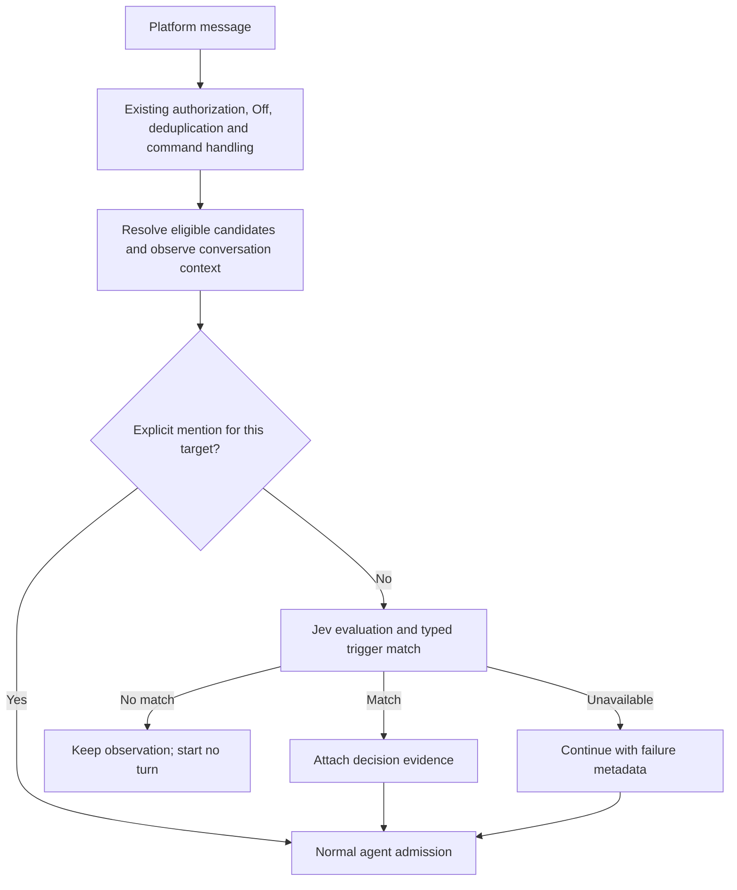

# Decision-Based Message Triggers

> Status: Proposed — design only; no runtime behavior is implemented by this document.
> Scope: typed decisions for ordinary inbound chat messages, initially using TypeSafe Jev.
> Primary implementation areas: protocol, control-plane, daemon, relay, and web.

## 1. Behavior and scope

A conversation configured **By decision** observes ordinary messages and starts an
agent turn only when a typed answer matches the configured triggers. The decision
can use recent conversation history even when no agent session has started.

An explicit, authorized **@-mention directly activates the addressed agent** without
calling the decision provider. Off, visibility restrictions, `!stop`, control-command
handling, and existing routing safeguards retain their precedence. Decision matching
never grants permission or selects a different agent.

The first use cases are a moderator that wakes for suspected abuse and a support
agent that wakes for selected categories or levels of customer frustration. The
ordinary agent performs any deletion, ban, hand-off, or reply through its existing
permissions and available tools. A decision evaluation creates no ACP session or
turn of its own.

This adds a decision provider and an inbound consumer. Agent execution continues
through the existing runtimes. An optional evaluation tool inside a running agent
is a separate consumer of the same provider; it does not implement the inbound
trigger. Tool-approval hooks, outbound checks, automatic agent selection, multiple
questions per definition, expression/script editors, and workflow composition are
outside the first version. AI-assisted configuration can later author the same
definition through the management API.

The existing behavior in [product conventions](../product-conventions.md) remains
the implemented baseline until the feature lands. This proposal extends the
conversation trigger choices while preserving [activation parity](activation-parity.md)
and the independent [session mode](channel-session-mode.md).

## 2. Definition and trigger editor

A **Decision** is an organization-owned, reusable resource containing a name,
provider reference, one typed question, and its trigger selection. Identity and
revision are assigned by the service. It contains no agent or channel selector;
those belong to its conversation binding.

Reuse the [resource visibility policy](resource-visibility.md) for access and editing.
Binding requires permission to configure the target integration and use the Decision;
the definition, provider, and target must belong to the same organization. Editing a
shared definition affects its bindings, which the editor lists before publication.

The editor accepts a structured question and derives the trigger controls from its
type and criteria. Users do not supply a sample answer or write an expression.

| Question  | Trigger control                                                                 | Matching rule                                                    | Example trigger data                                       |
| --------- | ------------------------------------------------------------------------------- | ---------------------------------------------------------------- | ---------------------------------------------------------- |
| `choice`  | One checkbox per criteria key, initially all checked                            | Returned `choice` is in the checked set                          | `{ "type": "choice", "values": ["billing", "technical"] }` |
| `boolean` | Yes / No checkboxes, initially both checked                                     | Convert the probability to a Boolean, then match the checked set | `{ "type": "boolean", "values": [false] }`                 |
| `score`   | Greater than or equal to / Less than selector and a continuous threshold slider | Compare the returned score directly with the threshold           | `{ "type": "score", "operator": "gte", "value": 2 }`       |

For a choice with `billing`, `technical`, and `sales`, unchecking `sales` skips
sales messages while the other two answers activate the same configured agent.
These labels are classification results, not agent routing destinations. Checking
every result makes the decision an annotation: every valid answer activates the
agent. Checking none skips every successfully evaluated ordinary message; explicit
mentions still activate it.

The host uses `boolean`; the Jev adapter maps this to `noul`. A probability of
`0.5` or greater means Yes; a lower probability means No. This is a fixed V1
conversion, including the tie, not a claim that the answer is certainly correct.
For `score`, N ordered criteria define the range `0..N-1`. A score is a weighted
value and may be fractional. Four levels therefore produce a `0..3` slider;
`gte 2` includes exactly 2, and `lt 2` excludes it. The initial score control is
`gte 0`, which matches every valid score.

Probability distributions and confidence remain in the evidence supplied to the
agent. V1 does not add confidence controls or silently override the selected
triggers based on confidence. Boolean answers have no separate confidence field.

For example, a moderator's definition can be:

```json
{
  "name": "Repeated violations",
  "providerId": "decision-provider-example",
  "question": {
    "type": "boolean",
    "instructions": "Using history and currentMessage, is the sender of currentMessage repeatedly violating the community rules and showing behavior that warrants a ban?",
    "criteria": {
      "true": "A recurring pattern of abusive or prohibited messages from this sender, interpreted in context.",
      "false": "An isolated mistake, an ordinary disagreement, quoted abuse, or no recurring violation visible in the available history."
    }
  },
  "trigger": { "type": "boolean", "values": [true] }
}
```

This is deliberately a semantic judgment of recurring behavior. It does not require
an exact counter or a fixed number of violations within a precise time interval.
The author puts the community's substantive rules in the question's instructions
and criteria. A different question could instead ask whether the latest message is
spam, or classify the support topic.

Save-time validation checks the question schema, matching trigger type, choice
membership, and finite score threshold within the declared range. Editing criteria
requires an explicitly valid trigger selection; obsolete choice keys are rejected
instead of silently retained or remapped. Question and trigger changes publish as
one revision. A bound definition cannot be deleted until its bindings are removed.

The editor also offers **Try with an example**: supply a sample current message and
optional history, then see the typed answer and **Would trigger / Would skip**. It
uses the same provider and matcher as live evaluation, performs no agent activation
or platform action, and keeps sample content on the daemon data plane. Missing
credentials and evaluation failures appear separately from a non-matching answer.

## 3. Binding and activation

Decisions have a central management page. The primary setup flow remains on an
agent's integration conversation row: select **By decision**, then choose or create
a Decision. One conversation binding references one Decision in V1. Creation from
that flow saves the reusable resource and then binds it; opening central management
first is optional.

The initial surface is channels and group conversations that already expose
Off / Mention / Any message. Binary 1:1 DM controls, webchat, code-host hooks, cron,
and direct agent calls keep their current behavior.

Classic integrations keep the reference beside their per-conversation trigger.
Shared bots replicate the effective Decision reference with the existing
bot-conversation trigger across membership rows, preserving the existing owner
selection and owner-change restrictions. The effective policy must agree from
every sibling row; the Decision does not become a second owner selector.

For ordinary human messages, By decision supplies the same candidate routes as
Any message and then filters activation on the daemon. Thread affinity does not
bypass the filter. Existing participant fan-out remains per target, including mute,
visibility, provenance, and delivery deduplication. A denied decision does not make
the router try an unrelated fallback agent. For mentions, only the addressed
target gets the direct-activation bypass; other implicit candidates remain gated.
Control commands are intercepted before evaluation and cannot be swallowed by it.
Explicit mentions keep their existing ability to clear a thread's `!stop` mute;
a decision match cannot clear that mute.

Verified agent-authored platform messages keep the existing collaboration ladder,
call policy, hop budget, and loop guards. V1 decision-trigger subscriptions do not
introduce new automatic activations from bot messages. Eligible conversational
replies can still contribute context; platform echoes, tool output, status cards,
and other presentation chrome do not.



Relay ingress must forward By decision candidates even before a session exists.
CP distributes eligibility and routing metadata; the relay forwards message content
directly to the owning daemons. Evaluation runs on the daemon, never on the relay or
CP. The pure
`activation-policy` package may represent candidate selection but performs no
provider I/O. Both primary and participant deliveries must pass the same daemon
decision seam; inserting a check only before the primary dispatch is insufficient.

## 4. Context independent of agent activation

### Observation window

The daemon maintains a bounded, durable observation window for enabled Decision
conversations. Its scope is the organization, physical bot/transport, and platform
conversation; thread/topic identifiers stay on individual messages. It is not keyed
by an ACP session or by `msg.thread ?? msg.msgId`, which would separate successive
top-level group messages and lose the pattern a moderator needs to see.

Append a normalized conversational observation before judging it. A skipped message
remains available to later evaluations, including when no agent has ever activated
in the conversation. An A/B/C sequence can therefore evaluate A, then A+B, then
A+B+C while starting its first agent turn only at C. Stable platform message IDs
deduplicate deliveries. Preserve sender identity, event time, thread/topic identity,
text and available quote context so repeated conduct can be attributed to the
correct participant.

Observation is enabled by the conversation binding, independently of whether a
particular message currently has an unmuted activation target. A thread mute stops
activation while the enabled window can still accumulate context. Off stops this
additional observation as well as activation.

Use a bounded window in the existing daemon store, with SQLite and PostgreSQL
implementations. The initial limits are the newest 100 messages within 24 hours,
with a separate 8,000-input-token evaluation budget. These are tunable limits, not a
promise to observe every violation in that period. Pruning applies even if every
message is skipped. Stopping observation by disabling the binding allows its window
to expire; removing the integration or organization deletes the associated window.
No message bodies are stored in CP metadata.

Current `recordObservedInbound` is conditional on a recent, initializing, or running
session, so it cannot alone provide this window. Add explicit Decision observation
without broadening history collection for conversations that did not enable it.
Reuse normalized-message and store infrastructure, but keep the rolling window's
retention separate from user-visible session transcript retention.

### Evaluation state

Construct a structured state containing:

- `currentMessage`: the one message being evaluated, including its sender and ID;
- `history`: the retained prior conversation observations in chronological order;
- `conversation`: relevant channel description or topic, when available;
- `context`: whether history is partial and whether older entries were omitted.

History ends before the current observation in the daemon's ingestion order. A
short serialized append-and-snapshot step per conversation provides a stable cut;
the network request does not hold that append lock. The current message occurs once,
outside `history`. Out-of-order platform arrivals are reported as observed history,
not as proof of a complete chronological archive.

Trim the oldest history entries to fit the budget, preserving the current message
and the question. Oversized current input or unsupported content yields
`unavailable`; it must not silently become a negative answer. Jev currently accepts
text only. Existing text/caption/quote metadata may describe an attachment, but an
unread image or audio clip is not represented as content the model inspected.

The window contains only content visible within the bound conversation. It never
imports another room, a private agent-to-agent exchange, tool output, or a runtime's
hidden reasoning. It is conversation evidence, not an export of a runtime's full
or compacted context. A daemon restart reloads the retained window; moving to a
daemon without that store starts with explicitly partial history. A shared data
store can preserve the window across ownership changes. Provider history lookup is
not a prerequisite, so platforms without a history API remain usable.

### Supplying an activated agent

On a match, the ordinary delivery includes the triggering message plus decision
evidence: definition ID/revision, question and criteria, typed answer, actual model
version, and the evaluated message ID. The question explains what the result means;
the answer is evidence and does not grant action authority.

Supply retained conversation context the agent has not received through its normal
prompt history, deduplicated by stable message IDs. Mark prior observations as
background conversation rather than new commands. Do not append the complete Jev
request and then append the same chat history again. In particular, the first
activation after several skips must carry the relevant preceding observations.

Recording in the Decision window alone does not create a session, move an agent's
delivery cursor, or initiate regeneration. Existing live-session observations keep
the behavior defined by [turn-final context refresh](turn-final-context-refresh.md).
`skip` means no new turn for this delivery; it neither cancels a running turn nor
makes the conversation invisible to an already-running agent.

## 5. Provider execution and failure behavior

The host contract uses `boolean`, `choice`, and `score`; the Jev adapter alone
translates provider vocabulary. It validates returned answer type, declared choice
membership, probability values, and score bounds before matching. A successful
answer and `unavailable` are separate outcomes.

The daemon owns request deadlines, cancellation, bounded concurrency, and provider
health. A request carries the Decision revision, evaluation purpose, and cancellation
signal. SDK retries must fit within that deadline. Saturation, timeout, invalid
responses, missing credentials, and unsupported input produce `unavailable`.

V1 uses **continue on evaluation failure** for an otherwise eligible ordinary
message. Include the failure category without inventing an answer or reusing an
earlier message's answer. In By decision mode this means ordinary candidates can
activate during a provider outage, subject to existing admission and capacity
limits. This tradeoff preserves handling at the cost of more agent turns; surface
it when enabling the feature. Off, access denial, removed bindings, and stale
ownership are not provider failures and never take this continuation path.

Bind evaluation to the message identity, Decision revision, and current target
ownership/configuration. Recheck current admission fences after the provider call
and before dispatch so a late result cannot revive a removed or disabled binding.
Concurrent evaluations must enter the existing delivery-ordering mechanism before
provider I/O, so a faster result for B cannot admit B ahead of pending A. A skipped
or failed evaluation settles its place without blocking the conversation forever.
Record the evaluated result with its delivery identity so transport retries and
admission replay reuse a settled decision rather than creating another turn.

Keep credentials in the existing encrypted secret infrastructure and distribute
them only to authorized daemon-side consumers. Configuring a provider alone does
not start observation or spending; binding a Decision explicitly enables evaluation
of that conversation's ordinary messages. A provider credential does not need to be
injected into the agent runtime. Endpoint configuration can accommodate a gateway
without changing Decision semantics.

Record model version, rule revision, latency, usage, match/skip/failure, and a message
reference on the daemon. Detailed question, answer, and history remain data-plane
records or bounded authorized reads; CP telemetry is body-free. Pin a model version
for reproducible validation instead of assuming an alias never changes.

## 6. Implementation sequence and acceptance

1. **Contract and provider:** shared question/trigger schemas, pure matching, a Jev
   adapter, secret references, deadline handling, and example evaluation.
2. **Configuration:** organization-scoped Decision CRUD and conversation references,
   existing editor authorization, atomic revision projection to daemons, shared-bot
   replication, and the type-derived Console controls. New REST routes carry the
   standard OpenAPI metadata; admin tooling uses the same configuration contract.
   Reject activation of this mode on a route with unsupported daemon or relay
   capabilities; an older consumer must not interpret it as unfiltered Any message.
3. **Consumer and context:** durable bounded observation independent of sessions,
   candidate forwarding through relay, shared daemon evaluation/admission, evidence
   delivery, and matching behavior over direct and relay ingress.
4. **End-to-end use case:** validate a moderator or support agent with representative
   conversations. If the demonstration deletes or bans, expose the required
   platform action through the normal tool contract and verify its permissions;
   the current Telegram deletion primitive alone does not provide an agent-facing
   moderation tool.

Focused acceptance scenarios should prove:

- Choice checkboxes, Boolean `0.5` boundary, and fractional Score comparisons match
  the editor, including all/none selections and criteria edits.
- A and B can be skipped before any session exists, yet C is evaluated with their
  context and the same sender's recurring conduct can trigger the first turn.
- Explicit mentions bypass Jev; ordinary messages, including thread follow-ups,
  are evaluated; Off and existing authorization/mute rules retain precedence.
- Direct and relay ingress agree, including primary/participant paths and duplicate
  delivery, and an ownership/configuration change during evaluation is respected.
- Provider failure continues only eligible deliveries, while delayed responses do
  not reorder or duplicate turns. Window pruning and restart behavior remain bounded.
- The agent receives the question, answer, and missing context once; a skipped
  message creates no turn or session-list entry of its own.

Before enabling the feature for real traffic, measure skipped-turn savings, missed
actionable messages, provider latency, and peak message rate on representative
content. Semantic judgments such as repeated violations need contextual samples;
an exact counting benchmark is not a prerequisite. Concurrency limits belong to
this host's measured budget, not to another application's defaults.

## References

- [TypeSafe API](https://docs.typesafe.ai/api): question and answer shapes.
- [Confidence](https://docs.typesafe.ai/confidence): probabilities and answer confidence.
- [Models](https://docs.typesafe.ai/models): supported input, budgets, and model versions.
- [Jev limitations](https://docs.typesafe.ai/model-jaggedness/jev-1.13): contextual evaluation considerations.
