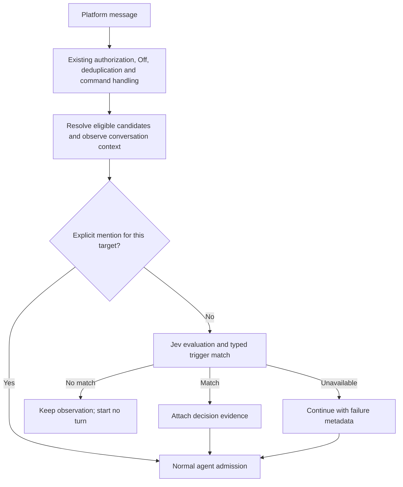
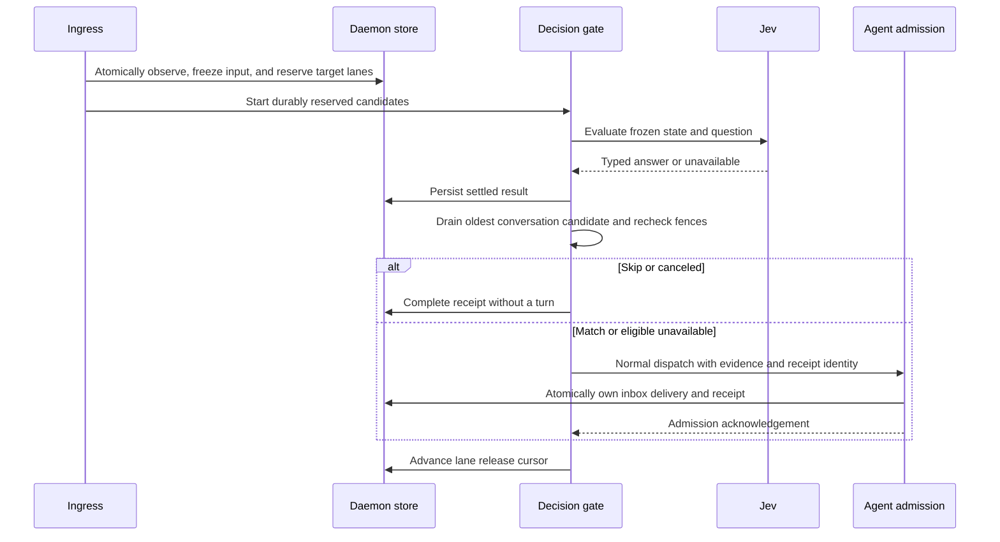

# Decision-Based Message Triggers

> Status: Proposed — design only; no runtime behavior is implemented by this document.
> Scope: typed decisions for ordinary inbound chat messages, initially using TypeSafe Jev.
> Primary implementation areas: protocol, control-plane, daemon, relay, and web.

Sections 1–5 define product behavior. Sections 6–9 specify the proposed contracts,
persistence, delivery lifecycle, and Console flow. Section 10 maps that design to
the existing code and implementation milestones. New names and defaults below are
implementation proposals, not APIs that already exist.

## 1. Behavior and scope

A conversation configured **By decision** observes ordinary messages and starts an
agent turn only when a typed answer matches the configured triggers. The decision
can use recent conversation history even when no agent session has started.

An explicit, authorized **@-mention directly activates the addressed agent** without
calling the decision provider. Off, visibility restrictions, `!stop`, control-command
handling, and existing routing safeguards retain their precedence. Decision matching
never grants permission or selects a different agent.

The first use cases are a moderator that wakes for suspected abuse and a support
agent that wakes for selected categories or levels of customer frustration. The
ordinary agent performs any deletion, ban, hand-off, or reply through its existing
permissions and available tools. A decision evaluation creates no ACP session or
turn of its own.

This adds a decision provider and an inbound consumer. Agent execution continues
through the existing runtimes. An optional evaluation tool inside a running agent
is a separate consumer of the same provider; it does not implement the inbound
trigger. Tool-approval hooks, outbound checks, automatic agent selection, multiple
questions per definition, expression/script editors, and workflow composition are
outside the first version. AI-assisted configuration can later author the same
definition through the management API.

The existing behavior in [product conventions](../product-conventions.md) remains
the implemented baseline until the feature lands. This proposal extends the
conversation trigger choices while preserving [activation parity](activation-parity.md)
and the independent [session mode](channel-session-mode.md).

## 2. Definition and trigger editor

A **Decision** is an organization-owned, reusable resource containing a name,
provider reference, selected model, one typed question, and its trigger selection.
The provider owns the connection and credentials; each Decision chooses the model
to use through that connection. Two Decisions can therefore share a provider while
using different models. It contains no agent or channel selector; those belong to
its conversation binding.

Reuse the [resource visibility policy](resource-visibility.md) for access and editing.
Binding requires permission to configure the target integration and use the Decision;
the definition, provider, and target must belong to the same organization. Editing a
shared definition affects its bindings, which the editor lists before publication.

The editor accepts a structured question and derives the trigger controls from its
type and criteria. Users do not supply a sample answer or write an expression.

| Question  | Trigger control                                                                 | Matching rule                                                    | Example trigger data                                       |
| --------- | ------------------------------------------------------------------------------- | ---------------------------------------------------------------- | ---------------------------------------------------------- |
| `choice`  | One checkbox per criteria key, initially all checked                            | Returned `choice` is in the checked set                          | `{ "type": "choice", "values": ["billing", "technical"] }` |
| `boolean` | Yes / No checkboxes, initially both checked                                     | Convert the probability to a Boolean, then match the checked set | `{ "type": "boolean", "values": [false] }`                 |
| `score`   | Greater than or equal to / Less than selector and a continuous threshold slider | Compare the returned score directly with the threshold           | `{ "type": "score", "operator": "gte", "value": 2 }`       |

For a choice with `billing`, `technical`, and `sales`, unchecking `sales` skips
sales messages while the other two answers activate the same configured agent.
These labels are classification results, not agent routing destinations. Checking
every result makes the decision an annotation: every valid answer activates the
agent. Checking none skips every successfully evaluated ordinary message; explicit
mentions still activate it.

The host uses `boolean`; the Jev adapter maps this to `noul`. A probability of
`0.5` or greater means Yes; a lower probability means No. This is a fixed V1
conversion, including the tie, not a claim that the answer is certainly correct.
For `score`, N ordered criteria define the range `0..N-1`. A score is a weighted
value and may be fractional. Four levels therefore produce a `0..3` slider;
`gte 2` includes exactly 2, and `lt 2` excludes it. The initial score control is
`gte 0`, which matches every valid score.

Probability distributions and confidence remain in the evidence supplied to the
agent. V1 does not add confidence controls or silently override the selected
triggers based on confidence. Boolean answers have no separate confidence field.

For example, a moderator's definition can be:

```json
{
  "name": "Repeated violations",
  "providerId": "00000000-0000-4000-8000-000000000001",
  "model": "jev-1.13.0",
  "question": {
    "type": "boolean",
    "instructions": "Using history and currentMessage, is the sender of currentMessage repeatedly violating the community rules and showing behavior that warrants a ban?",
    "criteria": {
      "true": "A recurring pattern of abusive or prohibited messages from this sender, interpreted in context.",
      "false": "An isolated mistake, an ordinary disagreement, quoted abuse, or no recurring violation visible in the available history."
    }
  },
  "trigger": { "type": "boolean", "values": [true] }
}
```

This is deliberately a semantic judgment of recurring behavior. It does not require
an exact counter or a fixed number of violations within a precise time interval.
The author puts the community's substantive rules in the question's instructions
and criteria. A different question could instead ask whether the latest message is
spam, or classify the support topic.

Save-time validation checks the question schema, matching trigger type, choice
membership, and finite score threshold within the declared range. Editing criteria
requires an explicitly valid trigger selection; obsolete choice keys are rejected
instead of silently retained or remapped. Model, question, and trigger changes save
atomically. A bound definition cannot be deleted until its bindings are removed.

The editor also offers **Try with an example**: supply a sample current message and
optional history, then see the typed answer and **Would trigger / Would skip**. It
uses the same provider and matcher as live evaluation, performs no agent activation
or platform action, and keeps sample content on the daemon data plane. Missing
credentials and evaluation failures appear separately from a non-matching answer.

## 3. Binding and activation

Decisions have a central management page. The primary setup flow remains on an
agent's integration conversation row: select **By decision**, then choose or create
a Decision. One conversation binding references one Decision in V1. Creation from
that flow saves the reusable resource and then binds it; opening central management
first is optional.

The initial surface is channels and group conversations that already expose
Off / Mention / Any message. Binary 1:1 DM controls, webchat, code-host hooks, cron,
and direct agent calls keep their current behavior.

Classic integrations keep the reference beside their per-conversation trigger.
Shared bots replicate the effective Decision reference with the existing
bot-conversation trigger across membership rows, preserving the existing owner
selection and owner-change restrictions. The effective policy must agree from
every sibling row; the Decision does not become a second owner selector.

For ordinary human messages, By decision supplies the same candidate routes as
Any message and then filters activation on the daemon. Thread affinity does not
bypass the filter. Existing participant fan-out remains per target, including mute,
visibility, provenance, and delivery deduplication. A denied decision does not make
the router try an unrelated fallback agent. For mentions, only the addressed
target gets the direct-activation bypass; other implicit candidates remain gated.
Control commands are intercepted before evaluation and cannot be swallowed by it.
Explicit mentions keep their existing ability to clear a thread's `!stop` mute;
a decision match cannot clear that mute.

Verified agent-authored platform messages keep the existing collaboration ladder,
call policy, hop budget, and loop guards. V1 decision-trigger subscriptions do not
introduce new automatic activations from bot messages. Eligible conversational
replies can still contribute context; platform echoes, tool output, status cards,
and other presentation chrome do not.



Relay ingress must forward By decision candidates even before a session exists.
CP distributes eligibility and routing metadata; the relay forwards message content
directly to the owning daemons. Evaluation runs on the daemon, never on the relay or
CP. The pure
`activation-policy` package may represent candidate selection but performs no
provider I/O. Both primary and participant deliveries must pass the same daemon
decision seam; inserting a check only before the primary dispatch is insufficient.

## 4. Context independent of agent activation

### Observation window

The daemon maintains a bounded, durable observation window for enabled Decision
conversations. Its scope is the organization, physical bot/transport, and platform
conversation; thread/topic identifiers stay on individual messages. It is not keyed
by an ACP session or by `msg.thread ?? msg.msgId`, which would separate successive
top-level group messages and lose the pattern a moderator needs to see.

Append a normalized conversational observation before judging it. A skipped message
remains available to later evaluations, including when no agent has ever activated
in the conversation. An A/B/C sequence can therefore evaluate A, then A+B, then
A+B+C while starting its first agent turn only at C. Stable platform message IDs
deduplicate deliveries. Preserve sender identity, event time, thread/topic identity,
text and available quote context so repeated conduct can be attributed to the
correct participant.

Observation is enabled by the conversation binding, independently of whether a
particular message currently has an unmuted activation target. A thread mute stops
activation while the enabled window can still accumulate context. Off stops this
additional observation as well as activation.

Use a bounded window in the existing daemon store, with SQLite and PostgreSQL
implementations. The initial limits are the newest 100 messages within 24 hours,
with a separate 8,000-input-token evaluation budget. These are tunable limits, not a
promise to observe every violation in that period. Pruning applies even if every
message is skipped. Stopping observation by disabling the binding allows its window
to expire; removing the integration or organization deletes the associated window.
No message bodies are stored in CP metadata.

Current `recordObservedInbound` is conditional on a recent, initializing, or running
session, so it cannot alone provide this window. Add explicit Decision observation
without broadening history collection for conversations that did not enable it.
Reuse normalized-message and store infrastructure, but keep the rolling window's
retention separate from user-visible session transcript retention.

### Evaluation state

Construct a structured state containing:

- `currentMessage`: the one message being evaluated, including its sender and ID;
- `history`: the retained prior conversation observations in chronological order;
- `conversation`: relevant channel description or topic, when available;
- `context`: whether history is partial and whether older entries were omitted.

History ends before the current observation in the daemon's ingestion order. A
short serialized append-and-snapshot step per conversation provides a stable cut;
the network request does not hold that append lock. The current message occurs once,
outside `history`. Out-of-order platform arrivals are reported as observed history,
not as proof of a complete chronological archive.

Trim the oldest history entries to fit the budget, preserving the current message
and the question. Oversized current input or unsupported content yields
`unavailable`; it must not silently become a negative answer. Jev currently accepts
text only. Existing text/caption/quote metadata may describe an attachment, but an
unread image or audio clip is not represented as content the model inspected.

The window contains only content visible within the bound conversation. It never
imports another room, a private agent-to-agent exchange, tool output, or a runtime's
hidden reasoning. It is conversation evidence, not an export of a runtime's full
or compacted context. A daemon restart reloads the retained window; moving to a
daemon without that store starts with explicitly partial history. A shared data
store can preserve the window across ownership changes. Provider history lookup is
not a prerequisite, so platforms without a history API remain usable.

### Supplying an activated agent

On a match, the ordinary delivery includes the triggering message plus decision
evidence: definition ID, the evaluated question and criteria, typed answer, actual
model version, and the evaluated message ID. The question explains what the result
means; the answer is evidence and does not grant action authority.

Supply retained conversation context the agent has not received through its normal
prompt history, deduplicated by stable message IDs. Mark prior observations as
background conversation rather than new commands. Do not append the complete Jev
request and then append the same chat history again. In particular, the first
activation after several skips must carry the relevant preceding observations.

Recording in the Decision window alone does not create a session, move an agent's
delivery cursor, or initiate regeneration. Existing live-session observations keep
the behavior defined by [turn-final context refresh](turn-final-context-refresh.md).
`skip` means no new turn for this delivery; it neither cancels a running turn nor
makes the conversation invisible to an already-running agent.

## 5. Provider execution and failure behavior

The host contract uses `boolean`, `choice`, and `score`; the Jev adapter alone
translates provider vocabulary. It validates returned answer type, declared choice
membership, probability values, and score bounds before matching. A successful
answer and `unavailable` are separate outcomes.

The daemon owns request deadlines, cancellation, bounded concurrency, and provider
health. An evaluation captures the Decision configuration, selected model, purpose,
and cancellation signal. SDK retries must fit within that deadline. Saturation,
timeout, invalid responses, missing credentials, and unsupported input produce
`unavailable`.

V1 uses **continue on evaluation failure** for an otherwise eligible ordinary
message. Include the failure category without inventing an answer or reusing an
earlier message's answer. In By decision mode this means ordinary candidates can
activate during a provider outage, subject to existing admission and capacity
limits. This tradeoff preserves handling at the cost of more agent turns; surface
it when enabling the feature. Off, access denial, removed bindings, and stale
ownership are not provider failures and never take this continuation path.

Bind evaluation to the message identity, frozen Decision configuration, and current
target ownership. Recheck the locally applied configuration and existing admission
fences after the provider call and before dispatch so a late result cannot revive
a binding the daemon has removed or disabled.
Reserve a durable place per conversation and target before provider I/O, then
release eligible messages into existing dispatch in ingestion order. A faster
result for B cannot admit B ahead of pending A, even when both are top-level
messages that would create different sessions. A skipped or failed evaluation
settles its place without blocking the conversation forever; §8 specifies the boundary.
Record the evaluated result with its delivery identity so transport retries and
admission replay reuse a settled decision rather than creating another turn.

Keep credentials in the existing encrypted secret infrastructure and distribute
them only to authorized daemon-side consumers. Configuring a provider alone does
not start observation or spending; binding a Decision explicitly enables evaluation
of that conversation's ordinary messages. A provider credential does not need to be
injected into the agent runtime. Endpoint configuration can accommodate a gateway
without changing Decision semantics.

Record requested and actual model IDs, the evaluated rule snapshot, latency, usage,
match/skip/failure, and a message reference on the daemon. Evaluation inputs, answers,
and history remain data-plane records or bounded authorized reads; CP telemetry is
body-free. Saved definitions
are configuration and may live in CP. Each Decision pins its selected model version
for reproducible validation; changing that selection is an ordinary Decision edit.

## 6. Configuration contracts and persistence

### 6.1 Typed definition

Keep the host schema in a new protocol leaf module, `decision.ts`. The Console,
CP validation, daemon matcher, and preview all consume it. V1 supports plain text
instructions and rubric descriptions; the larger set of JSON shapes accepted by
the provider is not required for the first editor.

```ts
type DecisionRule =
  | {
      question: { type: 'choice'; instructions: string; criteria: Record<string, string> }
      trigger: { type: 'choice'; values: string[] }
    }
  | {
      question: { type: 'boolean'; instructions: string; criteria: { true: string; false: string } }
      trigger: { type: 'boolean'; values: boolean[] }
    }
  | {
      question: { type: 'score'; instructions: string; criteria: string[] }
      trigger: { type: 'score'; operator: 'gte' | 'lt'; value: number }
    }

type DecisionDraft = DecisionRule & { name: string; providerId: string; model: string }
type DecisionDefinition = DecisionDraft & { id: string; orgId: string }
```

The actual Zod schema enforces the relationship between `question` and `trigger`,
not just two independent unions. Storage/DTOs also carry the standard resource
visibility, creator, and timestamp fields; they are omitted from this sketch.

Proposed save-time limits:

| Field                      | Validation                                                                                     |
| -------------------------- | ---------------------------------------------------------------------------------------------- |
| Name                       | Nonempty after trimming, at most 120 characters                                                |
| Instructions and criteria  | Nonempty strings; complete question at most 16 KiB encoded as UTF-8 JSON                       |
| Choice criteria            | 2–32 distinct nonempty keys; keys at most 64 characters                                        |
| Choice / Boolean selection | Unique values, all belonging to the question; an empty set is valid                            |
| Score criteria             | 2–10 ordered descriptions; reordering changes their numeric meaning                            |
| Score threshold            | Finite number in `0..criteria.length - 1`; no rounding before matching                         |
| Provider                   | Existing, visible, same-organization provider usable by the binding's execution scope          |
| Model                      | Supported model ID for the selected provider kind and question type; required on each Decision |

The Choice limit of 32 is an editor limit. The Score range follows the provider's
current supported rubric size. Validate edited definitions as a whole: renaming a
selected key, removing a score level, or switching question type requires an
explicitly valid replacement trigger. Do not silently clamp a threshold or select
new outcomes. This validation also applies to API writes.

V1 uses ordinary resource updates: save the complete editable definition atomically,
with the last successful write taking effect. Keep standard `createdAt` / `updatedAt`
audit fields; they are not edit preconditions. Do not add `revision`,
`expectedRevision`, binding versions, or a separate integration snapshot version
for this feature. Cron, MCP provider, and conversation settings do not have a common
optimistic-edit contract today. A shared resource revision/history scheme can be
designed for those resources together later. Existing internal AgentSpec delivery
versions and ownership fences remain in use; they serve a different purpose.

The model selector reads a small host-maintained list of supported model IDs, labels,
and question types from provider metadata. V1 offers **Jev 1.13** (`jev-1.13.0`),
including when it is the only option. The exact ID is stored on the Decision and
sent to the provider; there is no implicit provider-wide model or automatic switch
to a newer model. The ID and response model reporting follow the
[TypeSafe model contract](https://docs.typesafe.ai/models).

Additional supported models extend that list and the adapter's validation as needed.
A provider with a different API gets its own adapter behind the same typed decision
contract. Neither change requires moving the model field or changing conversation
bindings. This list is selection metadata, not a new model resource or a runtime
plugin framework. Changing provider requires a compatible explicit model selection;
keep the question and trigger in the draft and report incompatibilities before Save.

### 6.2 CP records

| Record                   | Proposed fields / responsibility                                                                                                |
| ------------------------ | ------------------------------------------------------------------------------------------------------------------------------- |
| `DecisionProvider`       | `id`, `orgId`, `name`, `kind: typesafe`, `baseUrl`, normal visibility/ownership and timestamp fields                            |
| `DecisionProviderSecret` | Provider ID and encrypted API key, accessed only through a secret-store port; excluded from list/detail queries                 |
| `Decision`               | `id`, `orgId`, `name`, `providerId`, `model`, `question` JSON, `trigger` JSON, normal visibility/ownership and timestamp fields |
| `IntegrationChannel`     | Add `decision` to `ChannelTrigger` and nullable `decisionId`; retain ordinary channel updates                                   |

The binding invariant is `trigger == decision` if and only if `decisionId != null`.
Writing Off / Mention / Any clears the reference atomically. An owner or session-mode
change preserves the selected Decision, while canceling affected pending evaluations
when the daemon applies the updated configuration.

Shared-bot updates lock the effective conversation and write the same trigger,
Decision reference and session mode to its active sibling rows
in one transaction. Reconciliation and adding a sibling copy those fields together.
Owner removal preserves the conversation's Decision when ownership converges, just
as it preserves its trigger today. Deleting an unused sibling must not purge a
window still used by another binding of that physical bot.

Deleting a bound Decision returns `409` with a permission-filtered usage summary.
Deleting a provider referenced by a Decision likewise returns `409`. Use ordinary
resource authorization for CRUD, and check both the integration and effective
shared-bot owner when binding. Visibility changes revalidate affected bindings;
revoked access disables their execution and is never a provider failure. A binding
is an execution delegation, not a way for its viewers to read an otherwise hidden
definition or key. Do not rely on the original editor remaining signed in.

Reuse the existing `SecretCipher` and secret-store discipline. Key replacement is
write-only; a DTO returns only
`credentialConfigured`, never a masked prefix or the key. A configured provider
does not appear in the conversational runtime/model picker. Usage belongs to a
separate Decision category, without attributing it to an ACP turn that never ran.

### 6.3 Management and preview API

Routes below are relative to the existing organization-scoped `/api/v1` API. They
use existing authentication, resource visibility, error DTOs, and OpenAPI metadata.

| Method and route                              | Input / result                                                                                                                              |
| --------------------------------------------- | ------------------------------------------------------------------------------------------------------------------------------------------- |
| `GET /decision-providers`                     | Visible provider metadata, supported model choices, and credential availability                                                             |
| `POST /decision-providers`                    | Name, kind, endpoint, optional write-only `apiKey`; returns metadata                                                                        |
| `PATCH /decision-providers/:id`               | Editable connection fields and optional replacement key; provider kind is fixed at creation                                                 |
| `DELETE /decision-providers/:id`              | Refuse while referenced                                                                                                                     |
| `GET /decisions`                              | Visible definitions, answer type, provider/model labels, and visible binding count                                                          |
| `GET /decisions/:id`                          | Definition, including selected model, and permission-filtered bindings                                                                      |
| `POST /decisions`                             | `DecisionDraft`; returns the saved definition                                                                                               |
| `PATCH /decisions/:id`                        | Complete `DecisionDraft`; atomic replacement with ordinary last-write-wins semantics                                                        |
| `DELETE /decisions/:id`                       | Refuse while bound                                                                                                                          |
| `PATCH /integrations/:id/channels/:channelId` | Extend the existing route with `trigger: decision` and `decisionId`                                                                         |
| `POST /decisions/preview`                     | Unsaved draft or saved definition ID, sample state, and an authorized execution daemon; returns an evaluation without binding or activation |

For example, selecting a saved Decision updates a conversation with:

```json
{
  "trigger": "decision",
  "decisionId": "00000000-0000-4000-8000-000000000002"
}
```

Omitted binding fields in an unrelated channel PATCH remain unchanged. A Decision
selection without `trigger: decision`, or `trigger: decision` without a usable
reference, is rejected. Return the selected Decision's ID and name when visible,
plus deployment readiness in the channel DTO.

Use `400` for an invalid definition or unsupported conversation kind, `404` for a
missing/invisible resource, `403` for a visible resource the caller cannot edit,
and `409` for reference or consumer-capability conflicts. Offline preview
execution returns `503`; a completed provider attempt can instead return a typed
`unavailable` result. Preview must never label that result **Would skip**.

The preview request accepts either an `integrationId` to resolve its current daemon
or an explicit authorized `daemonId`, not both. CP can proxy the bounded sample
request over a scoped daemon RPC, as an interactive BFF operation. It does not
persist or log sample content. The daemon uses the same state builder, adapter,
validator, and matcher as live traffic, but no observation write, delivery receipt,
session creation, platform acknowledgement, or action. A disconnected daemon does
not cause the CP to call Jev itself.

## 7. Configuration delivery and provider adapter

### 7.1 One resolved snapshot

Extend `IntegrationSpec.core` with a complete Decision bundle.
The bundle contains channel bindings, their resolved
definitions, and the referenced provider configurations. Resolve it when projecting
the integration; do not fetch the definition from CP on each message.

```ts
type DecisionBundle = {
  bindings: Array<{ channel: string; decisionId: string }>
  definitions: DecisionDefinition[]
  providers: Array<{
    id: string
    kind: 'typesafe'
    baseUrl: string
    apiKey: string
  }>
}
```

This is a secret-bearing daemon projection, never a public DTO or relay payload.
Definitions/providers are deduplicated within the bundle. An empty bundle clears
previous bindings; missing data must not resurrect an older definition. The daemon
validates the complete bundle before replacing it and cancels pending work whose
admission-relevant binding, definition, selected model, or provider connection changed.
Use the same projection for hot updates, reconnect snapshots, and agent moves.
Decrypted credentials follow the existing integration-secret lifetime and logging
rules and are never written into the agent's prompt or runtime environment.

After definition, provider, or binding changes commit, the existing configuration
convergence paths rebuild and push complete bundles to affected integrations. Reuse
their existing parent-spec and ownership fences where present; do not add an
independent Decision or integration revision domain. Each evaluation retains the
configuration it used, and admission compares its relevant fields with the currently
applied bundle (§8.3), rather than comparing resource version numbers.

Delivery has the existing integration configuration's eventual-convergence semantics.
A disconnected daemon may continue using its last valid snapshot; the UI reports
**Pending sync** until application is confirmed. A successful CP save is not proof
that every consumer has applied it. Local rechecks cannot detect unseen CP edits,
and V1 does not add a cross-consumer guarantee against out-of-order configuration
delivery. General configuration ordering and concurrent-editor protection belong
to a shared resource design if introduced later.

Add an explicit `decision` candidate kind to `BindMatch` and the pure routing
contracts. It has Any-message candidate semantics for human messages, while the
daemon resolves the question from the channel binding. It does not introduce an
implicit bot-to-bot activation rung. Do not represent the mode solely as `auto`
plus an optional field that an old reader can silently strip.

Advertise a `decision-trigger-v1` capability on both daemon and relay connections.
Binding and placement require all consumers on that route to support it. On a
later downgrade, hold the affected route unavailable and surface the mismatch;
do not publish an unfiltered Any route. Existing non-Decision conversations continue
to work. Update or explicitly reject management clients that cannot preserve the
new trigger value; replacing an unknown value with Mention is not a valid fallback.

### 7.2 Relay candidates and observation-only delivery

Extend `rc/bot-assign` / `rc/routes` with channel-scoped observation destinations
for enabled Decisions, alongside the candidate routes. Destinations are current
integration/agent/daemon identities, not question text or credentials.

For each normalized message the relay forwards to the union of ordinary candidate
destinations and observation destinations. A destination selected only for context
receives an explicit observation-only disposition on `rd/msg`; the daemon must not
interpret it as an activation. When both apply, send one envelope for that target.
Shared daemon storage deduplicates the observation across sibling deliveries.

For a Decision candidate, carry the selected `decisionId` alongside existing target
and ownership coordinates. The daemon requires a matching enabled local binding
and its complete definition/provider before considering activation. A missing
bundle or different Decision ID is **Pending sync** or stale delivery, never a
provider error that falls open. An edit to the same Decision ID uses the daemon's
currently applied configuration; this identity check is not a version handshake.

This is needed when nobody is mentioned, a message names another participant, or
the daemon has muted the target: later judgments still need those messages. Off,
loss of conversation access, and removal withdraw the relevant observation
destination. Relay forwarding is bounded by the existing ingress/backpressure
rules; dropped/offline intervals mark the context partial rather than claiming
complete history. Evaluation remains entirely on the destination daemon.

### 7.3 Jev request and normalized result

The adapter sends one question under a fixed `decision` key to
`POST /v1/systemone`, authenticated with the selected provider's API key. The
request is `{ model: decision.model, state, questions: { decision: providerQuestion } }`; only
Boolean needs its type translated to `noul`. No freeform parsing or extra LLM call
is required. These provider fields follow the [TypeSafe API](https://docs.typesafe.ai/api).

```ts
type DecisionAnswer =
  | { type: 'boolean'; value: boolean; probability: number }
  | { type: 'choice'; value: string; probabilities: Record<string, number>; confidence: number }
  | { type: 'score'; value: number; probabilities: number[]; confidence: number }

type DecisionEvaluation =
  | {
      status: 'answered'
      answer: DecisionAnswer
      matched: boolean
      model: string
      usage: { inputTokens: number; outputTokens: number }
    }
  | {
      status: 'unavailable'
      reason: 'timeout' | 'capacity' | 'credentials' | 'provider' | 'invalid_response' | 'unsupported_input'
    }
```

Normalize the provider's answer into `value`, retaining its distribution for
evidence. Validate the expected key/type, finite values, exact choice/level domain,
probabilities in `[0,1]` summing to 1 within `1e-5`, and confidence in `[0,1]` when
the type carries it. Preserve returned values; do not repair an invalid distribution
or round a score into a different trigger. Model identity and usage are metadata,
not part of the trigger expression. A legitimate low-confidence answer is still
matched by the user's selected rule.

Initial host limits are **5 seconds for the decision stage**, **4 active requests per provider**,
**16 active per daemon**, and **64 total queued evaluations per daemon**. The deadline
starts at reservation, including local queue time and network I/O, and excludes
agent execution. These are starting defaults for
measurement, not provider guarantees; enforce a small per-provider queue share so
one busy provider cannot consume the entire queue. Do not hold a database transaction
or conversation lock while awaiting a slot or response.

The gate also respects the existing ingress/admission backlog caps. Once those are
full, reject or backpressure new deliveries; fail-open is not permission to grow an
unbounded queue of agent turns.

Allow at most one transient retry inside the original deadline, honoring a usable
`Retry-After` and otherwise adding bounded backoff. Invalid credentials, invalid
input, or an invalid answer are not retried. Cancellation aborts the HTTP request
and releases its slot in `finally`. A revoked binding or shutdown is a cancellation,
not a fail-open provider error. A bounded auth-failure backoff avoids one doomed
network call per message; applying replacement credentials resets it immediately.

## 8. Observation storage and delivery lifecycle

### 8.1 Data-plane records

Implement the window through the existing `LocalStore` / `StoreDatabase` abstraction
and migrations for both SQLite and PostgreSQL. Do not create another SQLite file
that a pooled daemon cannot share.

| Record                  | Identity and retained data                                                                                                                                               |
| ----------------------- | ------------------------------------------------------------------------------------------------------------------------------------------------------------------------ |
| `decision_conversation` | `(orgId, transportScope, platform, channelId)`; next ingestion sequence, observation start, last pruning time, known gap markers                                         |
| `decision_observation`  | Conversation key + stable platform post ID; ingestion sequence, sender, event/arrival times, thread/topic, text/quote/caption, truncation marker                         |
| `decision_lane`         | Conversation key + target agent; durable release cursor and current ownership fence; independent of ACP session and Decision configuration                               |
| `decision_delivery`     | Conversation key + normalized event ID/tag + target agent; lane sequence, owner fence, deadline, frozen configuration/input/result, terminal disposition; no credentials |

The conversation key uses the existing bot-qualified `transportScope`; an
unqualified channel ID is insufficient. No observation key contains an ACP session
ID. The delivery key is target-specific but does **not** include the Decision
configuration: editing a definition must not cause a retried old delivery to activate
again. Distinguish the stable post ID used for history from an event tag used by
normalization to distinguish a routable closing edit.

Assign ingestion order on entry to a per-conversation mailbox, before asynchronous
snapshot work can overtake another arrival. An `observeAndReserve` store operation
appends the observation, freezes the input, and stages all selected target deliveries
under a short transaction. Reserve primary and participant targets together, before
awaiting any target's provider result. Observation-only traffic stages no delivery.
PostgreSQL needs a database-level lock or atomic sequence update, not only a
process-local mutex. Return a stable sequence cut and immutable input snapshot.
A duplicate reads its receipt instead of taking a newer snapshot with later messages.

Keep the newest 100 observations younger than 24 hours by arrival time; preserve
the platform event time as a separate field. Cap retained text/quote/caption at
16 KiB per observation and mark truncation. The current message is never evaluated
from a truncated preview: if it cannot fit, return `unsupported_input`. Later
history may include the explicitly marked partial observation. Exclude attachment
bytes and tool/status output. Edits/deletions only affect future snapshots when an
adapter exposes them; they do not rerun a settled Decision or undo an action.

Prune on append and periodically while idle. Keep detailed frozen input/results for
at most the newest 20 terminal evaluations per conversation/target, for at most
24 hours, so skipped decisions can be inspected. Strip older bodies promptly and
retain only minimal deduplication/result metadata for seven days. Pending work has
a deadline and cannot pin content indefinitely. The seven-day retry horizon is not
a permanent history guarantee. Removing an integration purges its target receipts
and deletes a shared window only once no authorized binding still uses it;
organization removal purges
all of its records.

### 8.2 The actual state seen by Jev

For a third message, a frozen input might look like this. IDs are opaque examples;
the model compares sender IDs, not display names, when attributing repeated conduct.

```json
{
  "currentMessage": {
    "id": "message-c",
    "sender": { "id": "member-7", "name": "Example member" },
    "text": "You are all idiots. I will keep posting this here.",
    "threadId": null
  },
  "history": [
    { "id": "message-a", "sender": { "id": "member-7" }, "text": "Everyone here is stupid." },
    { "id": "message-b", "sender": { "id": "member-2" }, "text": "Please stop insulting people." }
  ],
  "conversation": { "name": "Community support", "topic": "Product questions and feedback" },
  "context": {
    "partial": true,
    "reasons": ["observation_started_after_conversation"],
    "omittedMessages": 0,
    "snapshotSequence": 3
  }
}
```

Production observations also retain timestamps and available quote/thread metadata.
No agent-generated summary is needed to collect this context. `omittedMessages`
counts known local removals only, never an invented count of unseen platform history.
The supplied state is conversation data; instructions come from the saved question.

Build the input in this order: preserve the question and current message, add the
conversation metadata, then include the newest history that fits and present it
oldest-first. The 8,000-token budget is the target for the whole request, including
the question and serialization. Use a verified provider-compatible counter when
available; otherwise report the estimate as such and additionally cap serialized
input at 32 KiB. A character-count heuristic is not a model-token guarantee, and a
provider input-limit rejection still follows `unsupported_input`, never **No**.
Known gaps, retention trimming, and byte/token trimming make `context.partial` true.

| Arrival    | Input                    | Illustrative result | Agent effect                               |
| ---------- | ------------------------ | ------------------- | ------------------------------------------ |
| A          | Current A, empty history | No                  | Store A; no session                        |
| B          | History A, current B     | No                  | Store B; no session                        |
| C          | History A/B, current C   | Yes                 | Admit C and supply A/B as background       |
| Retry of C | Reuse C's receipt        | Same settled result | No second turn                             |
| D after C  | History A/B/C, current D | Evaluate normally   | Use the configured session mode if matched |

These are illustrative semantic answers, not guaranteed outputs for those strings.
Cross-thread history within the same channel is intentional for moderation. Preserve
thread IDs so a question can distinguish separate conversations. There is no
cross-channel history, exact violation counter, or retrieval of an ACP memory dump.

### 8.3 Ordering, admission, and recovery

Introduce one daemon `DecisionGate` used by direct ingress, primary/participant
delivery, and relay IM delivery. It reserves a durable slot before starting provider
I/O. The lane key is **organization + transport scope + platform conversation +
target agent**, independent of `thread`, `msgId`, session mode, and Decision configuration.
This is essential in the default `createNew` mode: two top-level messages have
different session keys, so the current per-session dispatch queue cannot order them.
Different conversations or agents have independent lanes.

The reservation belongs before the existing dispatch admission chain and live-turn
steering. Release ready results in order into ordinary `dispatch`, waiting for its
admission acknowledgement, not for the whole agent turn to finish. Otherwise a
running agent could never be steered until its previous turn ended. Do not simply
await Jev before calling `dispatch`, which permits reordering, or reuse
`admissionWait` unchanged, which already operates on an admitted entry.

Provider work may complete out of order. A lane drains only its oldest unreleased
candidate: skip/cancel advances the durable cursor immediately; match/unavailable
advances it after inbox admission or a terminal admission rejection. Claim and
advance the lane under the existing target-ownership fence. Release database locks
before provider or dispatch I/O, then condition the subsequent write on the same
owner/candidate. Recovery consults the inbox receipt before advancing or replaying
that candidate. Reserving slots only in memory would lose this order on restart.



The lifecycle is `reserved → evaluating → settled → skipped | admitted | canceled`;
an explicit mention goes directly from reserved to settled without a model request.
It joins the same lane when an earlier delivery is pending, so it can wait for that
bounded earlier decision, never for another conversation or an entire prior turn.
Control commands remain outside this wait: `!stop` must be able to cancel pending
candidates immediately, with its existing target/thread scope.

Freeze the Decision ID, provider ID/kind/endpoint, requested model, question, trigger,
binding, and session mode with the candidate, excluding credentials. Applying a
relevant configuration change cancels affected pending candidates; immediately
before admission, compare those fields against the current local configuration and
recheck existing ownership/access/stop fences. A rename alone need not cancel work.
Recovery uses the same stored comparison before releasing a pending candidate as
unavailable. The retained snapshot also explains a historical answer after an edit;
it is evaluation evidence, not a new resource revision or edit-conflict mechanism.

| Event                                                                                                 | Required handling                                                                                              |
| ----------------------------------------------------------------------------------------------------- | -------------------------------------------------------------------------------------------------------------- |
| Valid answer, selected outcome                                                                        | Persist result, recheck gates, enter normal admission                                                          |
| Valid answer, unselected outcome                                                                      | Settle as skipped; release slot; create no session/inbox turn                                                  |
| Timeout, overload, invalid provider result                                                            | Persist unavailable; continue only if current admission gates still permit it                                  |
| Relevant definition, model, provider, binding, or session-mode change applied locally; ownership lost | Cancel the old candidate; do not reinterpret its answer with the new rule or fall open                         |
| Off, access revoked, agent paused, `!stop`, loop protection                                           | Cancel/suppress; never classify as provider failure                                                            |
| Duplicate while evaluating                                                                            | Join the existing evaluation; no second provider request in this process                                       |
| Duplicate after settlement                                                                            | Reuse the terminal delivery disposition; no new turn                                                           |
| Process restarts with a pending evaluation                                                            | Recheck ownership/configuration; recover as unavailable without automatically issuing a fresh provider request |
| Process restarts after successful inbox admission                                                     | Existing inbox replay owns execution; the gate cannot create another delivery                                  |
| Observation/receipt persistence fails                                                                 | Do not claim durable acceptance or dispatch untracked work; use existing ingress retry/rejection behavior      |

Decision cancellation leaves the observation available to later messages. Direct
ingress can only recover events it durably received; this feature does not promise
platform replay across a crash before persistence. Relay acceptance must follow the
durable delivery reservation, so a crash after ACK does not discard pending work.

Extend the existing inbox/receipt transaction to couple a matched Decision receipt
to ordinary queue admission. A crash between recording an answer and owning the
inbox must recover that same delivery. Live-turn steering needs the same receipt
discipline before injecting input, with a durable attempt/acknowledgement marker.
Recovery of an attempted but unacknowledged injection marks it ambiguous and does
not automatically inject it again without runtime delivery-ID deduplication. This
can leave that message unhandled and must be visible in the delivery result.
Do not promise exactly-once external model billing or platform actions from
this local receipt—an HTTP response or action can be lost after it took effect.

Pending snapshots belong only to the current owner. On a move, use the established
ownership fence; a new owner may recover a durable pending delivery from the shared
store, while an old owner's late response is discarded. A move without the same
store begins with partial history and cannot recover rows it does not possess.

### 8.4 Supplying evidence without duplicating chat history

Attach a daemon-local `decisionEvidence` envelope to the admitted delivery. It holds
the evaluated definition ID, question/criteria and trigger snapshot, typed result or
failure category, requested/actual model and usage, snapshot cut, partial-context
flags, and IDs of supplied observations. It is not a
new `NormalizedMessage.trigger` value: a Decision is an admission condition, while
the existing trigger field still describes the incoming message's source.

At prompt assembly, subtract stable message IDs already delivered to this target
session through its normal history path, not all messages observed by the daemon.
Include remaining observations once under **Background conversation**, followed by
the current message and a compact **Decision evidence** block. Persist supplied IDs
with the admitted input so retries/restart use the same prompt; never advance the
normal delivery cursor for a skipped message. Explicit mentions also receive missing
retained background when available, but carry no fabricated Jev answer.

A **Yes** to repeated violations requests an agent turn; it does not automatically
ban anyone. The agent receives the question and relevant conversation, determines
what action is appropriate, and uses separately authorized moderation tools.

## 9. Console interaction and operational visibility

### 9.1 Create and bind

The Decisions list shows name, question type, provider/model, and binding count.
The editor has Name, Provider, **Model**, Question type, Instructions, Criteria, and
**Trigger when**. Boolean has two rubric text fields; Choice has editable keyed
rows; Score has ordered levels labeled `0..N-1`. Changing type or criteria previews
the resulting trigger controls and requires a valid selection before Save.

```text
Decision: Support triage
Provider: TypeSafe connection
Model: Jev 1.13 (jev-1.13.0)
Question type: Choice
Instructions: Which support topic best describes currentMessage in context?

Criteria                       Trigger when
billing    Payments...         [x] billing
technical  Bugs...             [x] technical
sales      Pricing...          [ ] sales

Recent conversation history is included automatically.
Explicit mentions always activate the addressed agent.

[Try with an example]                                [Save]
```

Show Model on the Decision editor even while Jev is the only supported choice.
Provider settings contain the name, endpoint, and API key; they do not choose a
shared model. Selecting another model preserves a compatible question and trigger,
marks any preview stale, and takes effect for all bindings after Save and sync.
Do not reuse the agent's conversational runtime/model picker for this field.

For Score, show the operator, slider with rubric labels, and a numeric input; the
input permits fractional thresholds and changes the same stored number. For
Boolean, display Yes/No labels, not the provider word `noul`. Show **All answers
trigger** or **No successful answers trigger** beside all/none selections, with the
provider-failure continuation behavior explained in the binding editor.

On the integration channel row, choosing **By decision** opens a picker with
**Create Decision**. Selection and save update the trigger/reference together;
cancel leaves the previous setting intact. A newly created definition remains
available if binding subsequently fails, and the error offers retry rather than
silently creating a second definition. The row displays **By decision · Support
triage** and a link to edit it. Editing a reused definition shows the affected
visible bindings before the same Save action; no extra approval workflow is needed.

Shared-bot rows identify that the effective conversation configuration is shared.
Owner and session mode remain separate controls. Group conversations expose this
flow; binary DM rows do not. Use the existing platform channel semantics to decide
where the option appears, instead of adding platform-name branches to the component.

### 9.2 Try, inspect, and diagnose

Preview accepts a current message plus optional ordered sample messages with sender
IDs. The result panel displays the typed answer, selected trigger, **Would trigger /
Would skip**, actual model, elapsed time, and whether input was trimmed. The example
does not become retained conversation history. Editing the draft marks the displayed
preview stale until rerun.

The first operational view is a bounded recent-evaluations panel reached from the
binding: timestamp, message reference, Decision name, matched/skipped/unavailable/
canceled, requested/actual model, and latency. Detailed reads show the evaluated
configuration snapshot, so an edited definition does not relabel an old answer.
These question/answer/context reads are authorized daemon BFF reads; opening the
panel does not copy them to CP storage. Apply the
bound conversation's existing audience checks in addition to Decision visibility.
An expired detailed snapshot displays **Details expired**, not a reconstruction
using the latest question or newer channel history. Providers and
bindings show **Ready**, **Pending sync**, **Credentials unavailable**, **Provider unavailable**, or
**Unsupported daemon/relay** as applicable. An offline daemon may make recent
details unavailable without making the saved definition disappear.

Emit separate counters for evaluated, matched, skipped, unavailable by reason,
canceled, explicit-mention bypass, provider latency, queue wait, and input usage.
Do not use message IDs or channel names as metric labels. Only metadata crosses to
CP telemetry. Provider outages appear in the Console and rate-limited logs, not as
one chat warning per ordinary message. A skipped message produces no typing marker,
reaction, new session-list entry, or runtime startup; normal acknowledgements begin
only once a delivery actually reaches agent admission.

## 10. Implementation sequence and acceptance

### 10.1 Change map

These are existing seams to extend, not a request to create a parallel integration
framework. New daemon files can live under `src/decisions/` with one adapter, state
builder, matcher, and gate; a plugin registry is unnecessary for one provider.

| Area                  | Existing seam and concrete change                                                                                                                                              |
| --------------------- | ------------------------------------------------------------------------------------------------------------------------------------------------------------------------------ |
| Shared contract       | Add `protocol/src/decision.ts`; extend `frames/integration.ts`, `frames/relay-cp.ts`, `frames/relay-daemon.ts`, capability constants, and their consuming schemas              |
| Pure routing          | Extend `activation-policy/src/index.ts` and daemon `router/routing-rule.ts` with the explicit Decision candidate kind; preserve bot-author policy                              |
| CP persistence        | Prisma models/migration, repository ports and implementations, encrypted provider secret store, atomic definition/model saves and binding replication                          |
| CP API/projection     | `http/dto/index.ts`, `http/routes/integrations.ts`, new Decision routes; `orchestrator/placement.ts`, `integrationPush.ts`, and `httpBot.ts` project/converge complete bundles |
| Daemon ingress        | `daemon.ts` direct `onInboundOutcome`, participant fan-out, and relay `handleRelayIm` use one gate before dispatch/steering; `recordObservedInbound` stays session-scoped      |
| Data-plane durability | `store/local-store.ts`, `store/store-database.ts`, and PostgreSQL migrations gain observation/receipt operations and atomic inbox handoff                                      |
| Relay                 | `bot-arbitration.ts`, shared-bot assignments, and IM forwarding carry both activation candidates and observation-only destinations                                             |
| Prompt construction   | Supply missing background plus decision evidence through ordinary admitted input and inbox replay, with stable message-ID deduplication                                        |
| Console               | `IntegrationChannelList.tsx`, existing API/store channel updates, new Decisions editor/list and provider configuration; shared schemas and i18n strings                        |

### 10.2 Delivery milestones

1. **Contract and provider:** shared question/trigger schemas, pure matching, a Jev
   adapter, secret references, deadline handling, and example evaluation.
2. **Configuration:** organization-scoped Decision CRUD and conversation references,
   existing editor authorization, complete configuration projection to daemons, shared-bot
   replication, and the type-derived Console controls. New REST routes carry the
   standard OpenAPI metadata; admin tooling uses the same configuration contract.
   Reject activation of this mode on a route with unsupported daemon or relay
   capabilities; an older consumer must not interpret it as unfiltered Any message.
3. **Consumer and context:** durable bounded observation independent of sessions,
   candidate forwarding through relay, shared daemon evaluation/admission, evidence
   delivery, and matching behavior over direct and relay ingress.
4. **End-to-end use case:** validate a moderator or support agent with representative
   conversations. If the demonstration deletes or bans, expose the required
   platform action through the normal tool contract and verify its permissions;
   the current Telegram deletion primitive alone does not provide an agent-facing
   moderation tool.

### 10.3 Acceptance evidence

Use a controllable provider fake for delivery/ordering cases; real Jev samples are
for judgment quality and latency, not deterministic queue correctness. Exercise both
store backends where transactions, restart, or competing owners are the behavior
under test. Prefer these focused scenarios over tests mirroring every helper.

| Scenario                         | Evidence required                                                                                                                                                                                        |
| -------------------------------- | -------------------------------------------------------------------------------------------------------------------------------------------------------------------------------------------------------- |
| Typed controls                   | Choice membership, Boolean `0.5`, fractional Score boundaries, all/none selections, and edited criteria agree between UI, preview, and daemon                                                            |
| Model selection                  | The saved Decision model reaches preview/live requests; two Decisions sharing a provider retain independent selections; incompatible provider/model/type combinations are rejected                       |
| Ordinary resource edits          | Create/edit/bind needs no expected revision; question, model, and trigger save atomically; later successful edits take effect without a new conflict protocol                                            |
| Context before the first session | Skip A/B, match C; C sees A/B exactly once, correctly attributed, and only C creates an agent session                                                                                                    |
| Top-level arrival ordering       | With `createNew`, reserve distinct top-level A/B before provider I/O; finish B first; B cannot enter dispatch until A has skipped or received its admission ACK                                          |
| Ordering survives restart        | Restart with A pending and B settled; reload the lane and process A's recovery before releasing B; a different channel remains independent                                                               |
| Explicit mention and commands    | Mention creates zero Jev calls; ordinary thread replies are gated; `!stop` can suppress pending work without waiting for Jev                                                                             |
| Direct and relay parity          | Primary, participant, and observation-only paths retain the same context; a single delivery cannot bypass the gate through fan-out                                                                       |
| Configuration during evaluation  | Apply a changed rule/model/provider or disabled binding locally, or revoke ownership while a request waits; its old result cannot activate or fall open; an unseen CP edit follows normal sync semantics |
| Durable handoff                  | Crash after settling an answer and after writing inbox admission; replay produces one admission, with missing background and evidence preserved                                                          |
| Provider failure and load        | Timeout/auth/invalid output continue only eligible deliveries; cancellation does not; deadlines release lanes and bounded queues apply backpressure                                                      |
| Retention and isolation          | Idle pruning removes expired content, shared sibling removal preserves still-used history, and another organization/bot/conversation cannot read the window                                              |
| Preview and diagnostics          | Try writes no observation or session; unavailable differs from skip; changed drafts and expired details are labeled correctly                                                                            |
| Rolling compatibility            | An old daemon/relay cannot receive a silently unfiltered route; unsupported bindings/placements are rejected visibly                                                                                     |

### 10.4 Rollout and remaining implementation work

Apply additive CP/data-plane migrations first. Existing conversations retain their
current trigger/session mode and collect no additional history. Deploy consumers
and advertise their capability before allowing the first Decision binding. A user
can stop evaluation with Off or switch back to an existing trigger; do not roll
back schema columns while they still contain active references.

Before enabling the feature for real traffic, measure skipped-turn savings, missed
actionable messages, provider latency, and peak message rate on representative
content. Semantic judgments such as repeated violations need contextual samples;
an exact counting benchmark is not a prerequisite. Concurrency limits belong to
this host's measured budget, not to another application's defaults.

## References

- [TypeSafe API](https://docs.typesafe.ai/api): question and answer shapes.
- [Confidence](https://docs.typesafe.ai/confidence): probabilities and answer confidence.
- [Models](https://docs.typesafe.ai/models): supported input, budgets, and model versions.
- [Jev limitations](https://docs.typesafe.ai/model-jaggedness/jev-1.13): contextual evaluation considerations.
