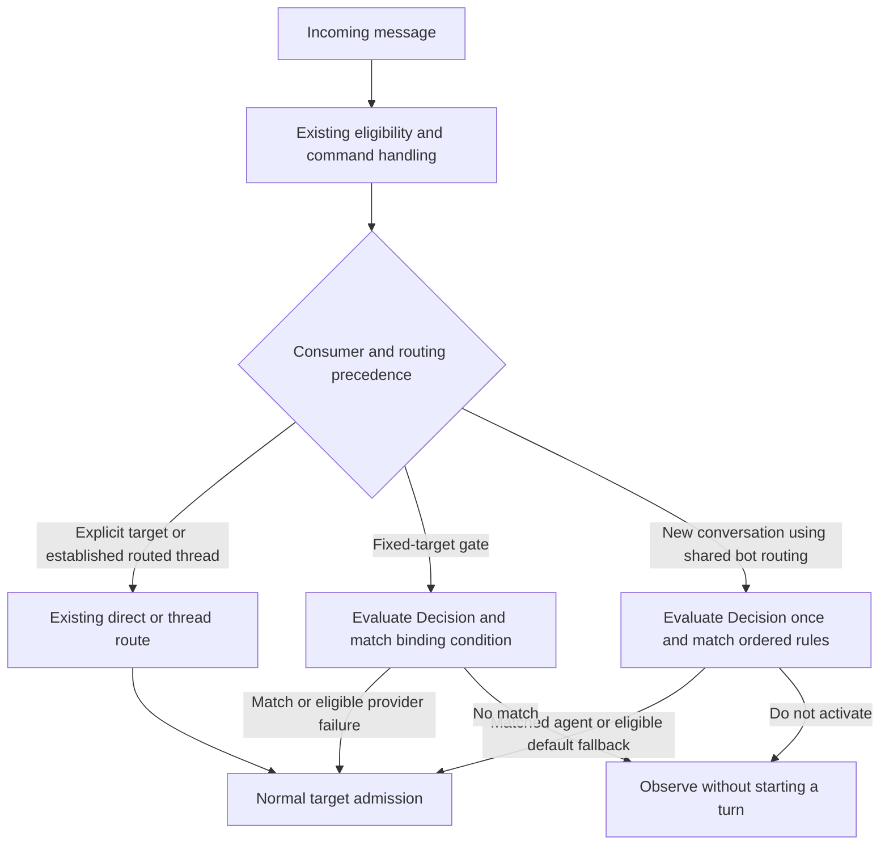
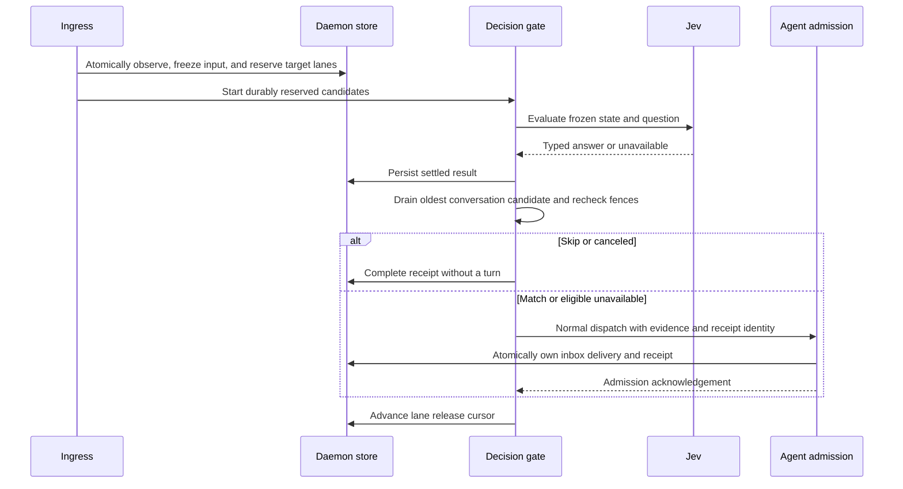

# Decisions

> Status: Proposed — design only; no runtime behavior is implemented by this document.
> Scope: reusable typed judgments, initially using TypeSafe Jev.
> Delivery: Stage 1 adds the Decision resource and fixed-target activation; Stage 2 adds shared-bot routing.
> Primary implementation areas: protocol, control-plane, daemon, relay, and web.

Sections 1–5 define product behavior. Sections 6–9 specify the proposed contracts,
persistence, delivery lifecycle, and Console flow. Section 10 maps that design to
the existing code and implementation milestones. Section 11 records possible future
uses without specifying their implementation. New names and defaults below are
implementation proposals, not APIs that already exist.

## 1. Purpose and delivery stages

A **Decision** evaluates supplied context against a question and returns a typed
answer: Boolean, Choice, or Score. It is a reusable judgment resource, independent
of the action taken with its answer. A consumer supplies the evaluation state and
decides how to use the result; the Decision does not own a trigger, workflow, or
target agent.

The first two consumers are delivered separately:

| Stage   | Scope                                                                                                                                                              | Completion boundary                                                                          |
| ------- | ------------------------------------------------------------------------------------------------------------------------------------------------------------------ | -------------------------------------------------------------------------------------------- |
| Stage 1 | Decision/provider management, selected model, typed evaluation and preview, plus a fixed-target **By decision** activation gate with retained conversation context | A channel decides whether to activate its already-bound agent; no automatic target selection |
| Stage 2 | Shared Bot → Configuration → Routing, ordered answer-to-agent rules, channel scope, routing previews, and selection/admission coordination                         | A new conversation selects one connected agent; established threads keep their current agent |

Stage 1 can ship independently. Shared-bot schemas, APIs, UI, and runtime behavior
below are the **Stage 2 design**, not Stage 1 release requirements. Completing a
Stage 2 prototype does not promote that capability into Stage 1.

These consumers do not exhaust what Decisions can support. An agent tool, workflow
step, or another feature may later evaluate the same resource with its own context
and result handling. Add that consumer at its owning feature; do not add its action
or target fields to the Decision. Those later consumers have no delivery commitment
in this document. The chat state and observation window below are the input contract
for the two planned chat consumers, not a universal restriction on Decision inputs.

An explicit, authorized **@-mention directly activates the addressed agent** without
calling the decision provider. Off, visibility restrictions, `!stop`, control-command
handling, and existing routing safeguards retain their precedence. Decision matching
never grants permission. Shared-bot routing selects a primary agent for a new
conversation; established threads keep their current agent.

The first use cases are a moderator that wakes for suspected abuse and a support
agent that wakes for selected categories or levels of customer frustration. The
ordinary agent performs any deletion, ban, hand-off, or reply through its existing
permissions and available tools. A decision evaluation creates no ACP session or
turn of its own.

Agent execution continues through the existing runtimes. Tool-approval hooks,
outbound checks, multi-target broadcast actions, multiple questions per definition,
expression/script editors, and workflow composition are outside these two stages.
AI-assisted configuration can later author the same definition through the
management API.

The existing behavior in [product conventions](../product-conventions.md) remains
the implemented baseline until the feature lands. This proposal extends the
conversation trigger choices while preserving [activation parity](activation-parity.md)
and the independent [session mode](channel-session-mode.md).

## 2. Reusable judgment and its consumers

A **Decision** is an organization-owned resource containing a name, provider
reference, selected model, and one typed question. The provider owns connection
credentials; each Decision selects a model and defines what its answer means.
A Decision contains neither `Trigger when` nor a target agent. Any supported
consumer can reuse its typed answer; fixed-target gates and shared-bot routing are
the initial integrations, not the resource's complete set of possible uses.

Reuse the [resource visibility policy](resource-visibility.md). The Decision,
provider, and consumer must belong to the same organization. Editing a reused
question shows its visible consumers and affects future evaluations for all of them.
Changing the model is an ordinary Decision edit, not a provider-wide setting.

The editor contains Name, Provider, Model, Question type, Instructions, and Criteria.
Choice criteria are keyed descriptions; Boolean criteria describe Yes and No;
Score criteria are ordered descriptions with values `0..N-1`. Users define the
answer domain here and configure what to do with an answer at the consumer.

For example, a moderator's Decision can be:

```json
{
  "name": "Repeated violations",
  "providerId": "00000000-0000-4000-8000-000000000001",
  "model": "jev-1.13.0",
  "question": {
    "type": "boolean",
    "instructions": "Using history and currentMessage, is the sender of currentMessage repeatedly violating the community rules and showing behavior that warrants a ban?",
    "criteria": {
      "true": "A recurring pattern of abusive or prohibited messages from this sender, interpreted in context.",
      "false": "An isolated mistake, an ordinary disagreement, quoted abuse, or no recurring violation visible in the available history."
    }
  }
}
```

This is a semantic judgment of recurring behavior. It does not require an exact
counter or a fixed number of violations within a precise interval. The consumer
might activate a moderator on Yes, route Yes to a specialist, or use the answer
in another supported flow without duplicating the Decision.

Consumer editors derive their condition controls from the selected Decision:

| Question  | Condition control                                                         | Matching rule                                          |
| --------- | ------------------------------------------------------------------------- | ------------------------------------------------------ |
| `choice`  | One checkbox per criteria key                                             | The returned key belongs to the selected set           |
| `boolean` | Yes / No checkboxes                                                       | The normalized Boolean belongs to the selected set     |
| `score`   | Greater than or equal to / Less than, a labeled slider, and decimal input | Compare the returned score directly with the threshold |

For a fixed-target gate, Choice and Boolean start with all answers selected; Score
starts at `gte 0`. All answers selected activates the same agent for every successful
evaluation. An empty selection skips every successful answer; explicit mentions and
provider-failure continuation retain their separate semantics.

The Jev adapter maps host `boolean` to `noul`: probability `>= 0.5` becomes Yes,
including the tie. Score values may be fractional. Four levels define `0..3`, so
`gte 2` includes 2 and `lt 2` excludes it. Retain probability/confidence evidence;
there is no confidence gate or expression editor in this design.

Validate a Decision independently, then validate each consumer's conditions against
its answer schema. A criteria edit may invalidate consumers: show the affected
visible bindings before Save and mark incompatible consumers **Needs review** after
saving. Disable their Decision execution until repaired, distribute that disabled
state, and never silently remap a key or clamp a threshold. Model/question changes
save atomically; consumer changes have their own atomic save. A Decision still in
use cannot be deleted.

**Try with an example** in the Decision editor returns the typed answer, actual
model, latency, and input-trimming information. It has no **Would trigger** verdict
because no consumer has been selected. Binding and routing previews add that
consumer's condition/action result (§9). Examples create no session or platform action.

## 3. Consumer ownership, scope, and activation

### 3.1 Stage 1: fixed-target activation

On an integration's conversation row, **By decision** can reference a Decision and
its `Trigger when` condition. The target remains the agent selected by the existing
binding. One conversation has one effective consumer; it cannot apply a gate and a
shared-bot router independently to the same primary delivery.

The initial surfaces are group conversations that already expose Off / Mention /
Any message. Binary 1:1 DM controls, webchat, code-host hooks, cron, and direct agent
calls retain their existing behavior. A gate evaluates ordinary eligible messages,
including replies in an existing thread. A negative answer never chooses another
agent or clears a `!stop` mute.

### 3.2 Stage 2: shared-bot routing

**Shared Bot → Configuration → Routing** owns the Decision reference, ordered
answer-to-agent rules, and an Otherwise action. Channel selection defines where
that bot-owned configuration applies; the mappings are not owned by an individual
agent or copied into each agent's settings. Targets must be usable agents already
connected to the same bot. One matched rule selects one agent, not a fan-out.

All rules in Stage 2 share one channel scope and one Decision. The first
matching rule wins. Choice can group several keys; Boolean selects Yes/No; Score
uses the same `gte` / `lt` controls as gates. Each action is **Route to agent** or
**Do not activate**. Otherwise is **Use default agent** or **Do not activate**.
The existing scoped default agent, falling back to the bot default under the
normal routing rules, is shown by name for the selected channel.

For example, one evaluation of Support category can route billing to Billing agent,
technical to Technical agent, and sales to Sales agent. Score rules `gte 3` followed
by `gte 2` send 3 to Escalation agent and 2.6 to Support agent. Reordering those
rules changes which one wins and must be visible in the editor and preview.

The routing precedence is:

1. Existing authorization, Off, control commands, stops, and loop safeguards.
2. An explicit authorized agent selection or @-mention uses direct routing.
3. An established thread continues its current agent and existing participant rules.
4. A new, unaddressed conversation in a channel using shared-bot routing is evaluated
   once; its result selects one primary target or no activation.
5. A channel outside that scope uses its existing routing policy.

The current conversation default is the Otherwise/error fallback, not a reason to
skip the Decision for a new conversation. Existing thread affinity is checked
before a new Decision request. Explicit mentions and continuing threads do not
receive a fabricated Decision answer. In append mode, an established conversation
session follows this same continuity rule until that affinity is retired normally.

Scope changes are explicit configuration writes. Applying routing to a selected,
already-enabled group channel sets its effective trigger to **By decision** with a
shared-bot consumer reference. Off channels remain Off and require their existing
enable action first. Removing a channel requires selecting its replacement trigger
and, when applicable, default agent in that save. Existing thread ownership is not
rewritten by changes to future routing. Pausing the bot's routing stops new implicit
conversation activations under that consumer; mentions and continuing threads keep
their existing behavior. The editor explains this before Save.

Shared-bot channel rows show the effective policy and link to the bot configuration.
They must not offer a competing per-agent mapping editor. Trigger, consumer reference,
and session mode still converge across sibling membership rows. Routing selects the
new conversation's agent without changing the channel's configured default owner.

### 3.3 Common admission behavior

The two chat consumers preserve existing target authorization, capacity,
provenance, mute, and delivery deduplication. Decision output never grants permission. Verified
agent-authored messages retain the collaboration ladder and hop/loop guards; this
feature adds no automatic bot-to-bot activation rung. Eligible conversational
replies may contribute context; echoes, tool output, and status cards do not.

A router's selected target becoming unavailable is **Target unavailable**. Do not
silently choose another agent. A provider error is different: an otherwise eligible
delivery follows the existing default route, with failure metadata. Invalid or
paused configuration, revoked access, and a removed target do not use that fallback.



The daemon data plane owns evaluation and retained content. CP distributes only
configuration and ownership metadata; neither CP nor the relay calls the model.
The pure activation-policy package performs no provider I/O. The existing-target
gate path is detailed in §§7–8; shared-bot selection also requires the pre-target
coordination boundary in §7.4. The UI contracts in §9 cover both consumers fully.

## 4. Chat context independent of agent activation

This section defines context assembly for the planned chat consumers. The reusable
Decision evaluates the state it receives; it does not itself subscribe to channels
or require every future consumer to use chat history.

### Observation window

The daemon maintains a bounded, durable observation window for enabled Decision
conversations. Its scope is the organization, physical bot/transport, and platform
conversation; thread/topic identifiers stay on individual messages. It is not keyed
by an ACP session or by `msg.thread ?? msg.msgId`, which would separate successive
top-level group messages and lose the pattern a moderator needs to see.

Append a normalized conversational observation before judging it. A skipped message
remains available to later evaluations, including when no agent has ever activated
in the conversation. An A/B/C sequence can therefore evaluate A, then A+B, then
A+B+C while starting its first agent turn only at C. Stable platform message IDs
deduplicate deliveries. Preserve sender identity, event time, thread/topic identity,
text and available quote context so repeated conduct can be attributed to the
correct participant.

Observation is enabled by the conversation binding, independently of whether a
particular message currently has an unmuted activation target. A thread mute stops
activation while the enabled window can still accumulate context. Off stops this
additional observation as well as activation.

Use a bounded window in the existing daemon store, with SQLite and PostgreSQL
implementations. The initial limits are the newest 100 messages within 24 hours,
with a separate 8,000-input-token evaluation budget. These are tunable limits, not a
promise to observe every violation in that period. Pruning applies even if every
message is skipped. Stopping observation by disabling the binding allows its window
to expire; removing the integration or organization deletes the associated window.
No message bodies are stored in CP metadata.

Current `recordObservedInbound` is conditional on a recent, initializing, or running
session, so it cannot alone provide this window. Add explicit Decision observation
without broadening history collection for conversations that did not enable it.
Reuse normalized-message and store infrastructure, but keep the rolling window's
retention separate from user-visible session transcript retention.

### Evaluation state

Construct a structured state containing:

- `currentMessage`: the one message being evaluated, including its sender and ID;
- `history`: the retained prior conversation observations in chronological order;
- `conversation`: relevant channel description or topic, when available;
- `context`: whether history is partial and whether older entries were omitted.

History ends before the current observation in the daemon's ingestion order. A
short serialized append-and-snapshot step per conversation provides a stable cut;
the network request does not hold that append lock. The current message occurs once,
outside `history`. Out-of-order platform arrivals are reported as observed history,
not as proof of a complete chronological archive.

Trim the oldest history entries to fit the budget, preserving the current message
and the question. Oversized current input or unsupported content yields
`unavailable`; it must not silently become a negative answer. Jev currently accepts
text only. Existing text/caption/quote metadata may describe an attachment, but an
unread image or audio clip is not represented as content the model inspected.

The window contains only content visible within the bound conversation. It never
imports another room, a private agent-to-agent exchange, tool output, or a runtime's
hidden reasoning. It is conversation evidence, not an export of a runtime's full
or compacted context. A daemon restart reloads the retained window; moving to a
daemon without that store starts with explicitly partial history. A shared data
store can preserve the window across ownership changes. Provider history lookup is
not a prerequisite, so platforms without a history API remain usable.

### Supplying an activated agent

On a match, the ordinary delivery includes the triggering message plus decision
evidence: definition ID, the evaluated question and criteria, typed answer, actual
model version, and the evaluated message ID. The question explains what the result
means; the answer is evidence and does not grant action authority.

Supply retained conversation context the agent has not received through its normal
prompt history, deduplicated by stable message IDs. Mark prior observations as
background conversation rather than new commands. Do not append the complete Jev
request and then append the same chat history again. In particular, the first
activation after several skips must carry the relevant preceding observations.

Recording in the Decision window alone does not create a session, move an agent's
delivery cursor, or initiate regeneration. Existing live-session observations keep
the behavior defined by [turn-final context refresh](turn-final-context-refresh.md).
`skip` means no new turn for this delivery; it neither cancels a running turn nor
makes the conversation invisible to an already-running agent.

## 5. Provider execution and failure behavior

The host contract uses `boolean`, `choice`, and `score`; the Jev adapter alone
translates provider vocabulary. It validates returned answer type, declared choice
membership, probability values, and score bounds before matching. A successful
answer and `unavailable` are separate outcomes.

The daemon owns request deadlines, cancellation, bounded concurrency, and provider
health. An evaluation captures the Decision configuration, selected model, purpose,
and cancellation signal. SDK retries must fit within that deadline. Saturation,
timeout, invalid responses, missing credentials, and unsupported input produce
`unavailable`.

Failure handling belongs to the consumer. The two planned chat consumers use
**continue on evaluation failure** for an otherwise eligible ordinary message.
Include the failure category without inventing an answer or reusing an
earlier message's answer. A gate keeps its bound target; a router uses the existing
eligible default route. Ordinary candidates can activate during a provider outage,
subject to existing admission and capacity limits. This tradeoff preserves handling
at the cost of more agent turns; surface it when enabling the feature. Off, access
denial, removed bindings, and stale ownership are not provider failures and never
take this continuation path. The reusable evaluator returns `unavailable`; it does
not mandate fallback activation for future consumers.

Bind evaluation to the message identity, frozen Decision/consumer configuration,
and current consumer ownership. Recheck the locally applied configuration and
existing admission fences after the provider call and before dispatch so a late
result cannot revive a binding the daemon has removed or disabled.
A gate reserves a durable place per conversation and target before provider I/O;
a router reserves a bot/conversation selection slot (§7.4). Release eligible
messages into existing dispatch in ingestion order. A faster result for B cannot
admit B ahead of pending A, even when both are top-level
messages that would create different sessions. A skipped or failed evaluation
settles its place without blocking the conversation forever; §8 specifies the boundary.
Record the evaluated result with its delivery identity so transport retries and
admission replay reuse a settled decision rather than creating another turn.

Keep credentials in the existing encrypted secret infrastructure and distribute
them only to authorized daemon-side consumers. Configuring a provider alone does
not start observation or spending; binding a Decision explicitly enables evaluation
of that conversation's ordinary messages. A provider credential does not need to be
injected into the agent runtime. Endpoint configuration can accommodate a gateway
without changing Decision semantics.

Record requested and actual model IDs, the evaluated rule snapshot, latency, usage,
match/skip/failure, and a message reference on the daemon. Evaluation inputs, answers,
and history remain data-plane records or bounded authorized reads; CP telemetry is
body-free. Saved definitions are configuration and may live in CP. Each Decision
pins its selected model version for reproducible validation; changing that selection
is an ordinary Decision edit.

## 6. Configuration contracts and persistence

### 6.1 Definition, condition, and consumer

Keep the shared schemas in a protocol leaf module, `decision.ts`. The Console,
CP, daemon, and previews share question validation and a pure condition matcher.
The provider adapter returns an answer; it does not decide whether a consumer matched.

```ts
type DecisionQuestion =
  | { type: 'choice'; instructions: string; criteria: Record<string, string> }
  | { type: 'boolean'; instructions: string; criteria: { true: string; false: string } }
  | { type: 'score'; instructions: string; criteria: string[] }

type DecisionCondition =
  | { type: 'choice'; values: string[] }
  | { type: 'boolean'; values: boolean[] }
  | { type: 'score'; operator: 'gte' | 'lt'; value: number }

type DecisionDraft = {
  name: string
  providerId: string
  model: string
  question: DecisionQuestion
}
type DecisionDefinition = DecisionDraft & { id: string; orgId: string }

type ChannelDecisionBinding =
  { type: 'gate'; decisionId: string; when: DecisionCondition } | { type: 'shared_bot_routing' }

type RoutingAction = { type: 'agent'; agentId: string } | { type: 'skip' }

type SharedBotDecisionRouting = {
  enabled: boolean
  decisionId: string
  rules: Array<{ id: string; when: DecisionCondition; action: RoutingAction }>
  otherwise: { type: 'default_agent' } | { type: 'skip' }
}
```

`DecisionDraft` is the reusable resource contract. `ChannelDecisionBinding` is
specific to the channel consumer, not an exhaustive registry of Decision uses.
Stage 1 implements its `gate` member. The `shared_bot_routing` member,
`RoutingAction`, and `SharedBotDecisionRouting` are Stage 2 additions; do not require
or expose them to ship Stage 1.

The enclosing integration identifies the bot for `shared_bot_routing`; it cannot
name another bot. The bot owns one routing configuration. Rule IDs identify rows
in editing and evidence, not resource versions; array order defines priority.
Channel bindings define its scope, so there is no second independently editable
channel list inside each rule. Storage/DTOs also carry standard resource visibility,
creator, and timestamp fields omitted here.

Validate every condition against the referenced question's type, key set, and
score range. The Decision itself has no condition field.

| Field                      | Validation                                                                              |
| -------------------------- | --------------------------------------------------------------------------------------- |
| Name                       | Nonempty after trimming, at most 120 characters                                         |
| Instructions / criteria    | Nonempty text; complete question at most 16 KiB of UTF-8 JSON                           |
| Choice criteria            | 2–32 distinct nonempty keys, each at most 64 characters                                 |
| Boolean / Choice condition | Unique declared values; a gate may select none, a routing rule must select at least one |
| Score criteria / condition | 2–10 ordered levels; finite threshold in `0..N-1`, including decimals                   |
| Provider / model           | Visible same-organization provider and a supported model/question-type combination      |
| Routing rules              | At most 32 ordered rules with unique row IDs; every action complete                     |
| Routing target             | Usable member of this shared bot; membership and authorization rechecked at admission   |
| Routing channels           | Supported group channels belonging to this bot, edited under their existing permissions |

Overlap is resolved by first match and surfaced in the editor. Completely shadowed
rules receive a warning; the preview shows which earlier rule wins. Empty routing
lists use Otherwise for every successful evaluation and say so explicitly.

Criteria edits revalidate all consumers. An invalidated consumer is projected as
disabled with **Needs review**, preserving its saved condition for repair. It must
not keep executing an older valid definition, become Any message, or be mistaken
for a provider failure. If a removed agent was a saved routing target, preserve a
non-executable missing-target reference for the same repair flow.

Save a complete editable resource atomically with the last successful write taking
effect. Keep `createdAt` / `updatedAt` as audit fields, not edit preconditions.
Do not add `revision`, `expectedRevision`, binding versions, or an independent
integration snapshot version. Cron, MCP provider, and conversation settings have no
common optimistic-edit contract today; a common scheme can be designed later.
Existing AgentSpec delivery versions and ownership fences remain in use.

The model selector reads supported IDs, labels, and question types from provider
metadata. Stage 1 offers **Jev 1.13** (`jev-1.13.0`), visible even as the only option.
Persist this selection on the Decision and send it unchanged. The response's actual
model is recorded separately, following the [TypeSafe model contract](https://docs.typesafe.ai/models).
Additional models extend that metadata and their adapter validation; a different
provider API gets an adapter behind the same typed-answer contract. There is no
automatic model upgrade or separate model resource.

### 6.2 CP records and atomic changes

| Record                         | Proposed fields / responsibility                                                                        |
| ------------------------------ | ------------------------------------------------------------------------------------------------------- |
| `DecisionProvider`             | ID, organization, name, `kind: typesafe`, endpoint, normal ownership/visibility/timestamps              |
| `DecisionProviderSecret`       | Encrypted API key behind the secret-store port; never returned by list/detail                           |
| `Decision`                     | ID, organization, name, provider ID, model, question JSON, normal ownership/visibility/timestamps       |
| `IntegrationChannel`           | Add `decision` trigger and nullable `decisionBinding` JSON                                              |
| `BotDecisionRouting` (Stage 2) | Bot ID as unique owner, organization, enabled, Decision ID, ordered rules, Otherwise, normal timestamps |

The binding invariant is `trigger == decision` exactly when `decisionBinding` is
present. Off / Mention / Any clears that reference atomically. A shared-bot route
reference resolves through its bot's record; it never duplicates that record's rules.
Sibling rows replicate the effective trigger, binding, and session mode under the
existing conversation lock. Adding/removing a sibling preserves still-used history
and the bot-owned routing configuration.

In Stage 2, the shared-bot Save operation writes the complete routing record and
scope changes in one transaction. Additions explicitly select By decision on already-enabled
channels. Removals supply their replacement trigger/default-agent settings, using
existing validation. Off channels cannot be enabled by a routing save. A channel
cannot have both a gate and a router; changing consumers replaces the whole binding.
Preserve existing thread affinity when any of these settings change.

Require both bot configuration authority and permission to configure every affected
channel, use the Decision/provider, and select each target. The binding is execution
delegation, not access to otherwise hidden definitions or keys. Revalidate revoked
access and member removal; do not rely on the original editor remaining signed in.
Usage summaries and target pickers must not disclose inaccessible resource names.

Deleting a used Decision or provider returns `409` with a permission-filtered usage
summary. Reuse `SecretCipher`; key updates are write-only and DTOs return only
`credentialConfigured`. Credentials never enter the conversational runtime.
Evaluation usage is its own category rather than a fabricated ACP turn.

### 6.3 Management and preview API

These proposed routes extend the organization-scoped `/api/v1` API with normal
authentication, visibility, error DTOs, and OpenAPI metadata. The bot routing routes
are Stage 2; the resource and gate routes are Stage 1. Usage lists identify the
consumer kind without restricting the reusable resource to gates and routers.

| Method and route                                              | Input / result                                                                           |
| ------------------------------------------------------------- | ---------------------------------------------------------------------------------------- |
| `GET /decision-providers`                                     | Visible connections, supported models, credential availability                           |
| `POST /decision-providers`                                    | Name, kind, endpoint, optional write-only key                                            |
| `PATCH /decision-providers/:id`                               | Editable connection fields and optional replacement key; kind fixed                      |
| `DELETE /decision-providers/:id`                              | Refuse while referenced                                                                  |
| `GET /decisions`                                              | Visible definitions, model/type, visible consumer counts                                 |
| `GET /decisions/:id`                                          | Definition and visible consumer usages                                                   |
| `POST /decisions`                                             | DecisionDraft                                                                            |
| `PATCH /decisions/:id`                                        | Complete DecisionDraft, atomically saved                                                 |
| `DELETE /decisions/:id`                                       | Refuse while used                                                                        |
| `PATCH /integrations/:id/channels/:channelId`                 | Trigger and complete decisionBinding                                                     |
| `GET /bots/:id/decision-routing` (Stage 2)                    | Bot-owned routing configuration, effective channel scope, readiness                      |
| `PUT /bots/:id/decision-routing` (Stage 2)                    | Complete configuration plus explicit channel additions/removals and replacement settings |
| `POST /decisions/preview`                                     | Draft/ID and sample state; typed answer only                                             |
| `POST /integrations/:id/channels/:channelId/decision-preview` | Gate draft and sample state; answer plus match/skip                                      |
| `POST /bots/:id/decision-routing/preview` (Stage 2)           | Routing draft, channel and sample context; precedence outcome or answer/rule/target      |

For example, a fixed-target binding selects its own condition:

```json
{
  "trigger": "decision",
  "decisionBinding": {
    "type": "gate",
    "decisionId": "00000000-0000-4000-8000-000000000002",
    "when": { "type": "boolean", "values": [true] }
  }
}
```

Omitted binding fields in an unrelated channel PATCH remain unchanged. Supplying a
Decision binding without the decision trigger, or vice versa, is invalid. Return
the effective consumer and visible Decision/bot label, with deployment readiness.

Use `400` for invalid inputs/conversation kinds, `404` for missing/invisible resources,
`403` for visible resources the caller cannot edit, and `409` for reference or
consumer-capability conflicts. Offline preview execution returns `503`; a completed
provider attempt can return `unavailable`, never **Would skip**.

Previews resolve an authorized daemon from the integration/bot, or explicitly select
an authorized daemon for a standalone Decision. CP may proxy bounded sample content
over a scoped BFF RPC without storing/logging it. Use the live state builder, adapter,
and, where applicable, consumer matcher. Write no observations/receipts, create no sessions, and perform
no platform actions. A disconnected daemon does not make CP call Jev itself.

## 7. Configuration delivery and provider adapter

### 7.1 One resolved snapshot

Extend `IntegrationSpec.core` with a complete Decision bundle.
The bundle contains channel bindings, their resolved
definitions, and the referenced provider configurations. Resolve it when projecting
the integration; do not fetch the definition from CP on each message.
Stage 1 carries gates only; the optional `sharedBotRouting` projection is Stage 2.

```ts
type DecisionBundle = {
  bindings: Array<{
    channel: string
    consumer: ChannelDecisionBinding
    enabled: boolean
    disabledReason?: 'needs_review' | 'access_revoked'
  }>
  sharedBotRouting?: { botId: string; config: SharedBotDecisionRouting }
  definitions: DecisionDefinition[]
  providers: Array<{
    id: string
    kind: 'typesafe'
    baseUrl: string
    apiKey: string
  }>
}
```

This is a secret-bearing daemon projection, never a public DTO or relay payload.
In Stage 2, only the designated evaluation host receives the shared-bot routing
bundle and its provider credentials. Relay and target daemons receive only the
routing metadata or bounded evidence needed for their role (§7.4); membership in
the bot alone does not grant access to the provider key.
Definitions/providers are deduplicated within the bundle. An empty bundle clears
previous bindings; missing data must not resurrect an older definition. The daemon
validates the complete bundle before replacing it and cancels pending work whose
admission-relevant binding, definition, selected model, provider, or routing config
changed. Invalidated consumers arrive explicitly disabled, so validation must not
leave an older active rule in place after an accepted criteria change.
Use the same projection for hot updates, reconnect snapshots, and agent moves.
Decrypted credentials follow the existing integration-secret lifetime and logging
rules and are never written into the agent's prompt or runtime environment.

After definition, provider, or binding changes commit, the existing configuration
convergence paths rebuild and push complete bundles to affected integrations. Reuse
their existing parent-spec and ownership fences where present; do not add an
independent Decision or integration revision domain. Each evaluation retains the
configuration it used, and admission compares its relevant fields with the currently
applied bundle (§8.3), rather than comparing resource version numbers.

Delivery has the existing integration configuration's eventual-convergence semantics.
A disconnected daemon may continue using its last valid snapshot; the UI reports
**Pending sync** until application is confirmed. A successful CP save is not proof
that every consumer has applied it. Local rechecks cannot detect unseen CP edits,
and neither stage adds a cross-consumer guarantee against out-of-order configuration
delivery. General configuration ordering and concurrent-editor protection belong
to a shared resource design if introduced later.

Add an explicit `decision` candidate kind to `BindMatch` and the pure routing
contracts. It has Any-message candidate semantics for human messages, while the
daemon resolves the question from the channel binding. It does not introduce an
implicit bot-to-bot activation rung. Do not represent the mode solely as `auto`
plus an optional field that an old reader can silently strip.

Advertise `decision-trigger-v1` for Stage 1 gates and `decision-routing-v1` for
Stage 2 shared-bot selection on both daemon and relay connections. A Stage 1
installation does not advertise or accept the routing capability.
Binding and placement require all consumers on that route to support it. On a
later downgrade, hold the affected route unavailable and surface the mismatch;
do not publish an unfiltered Any route. Existing non-Decision conversations continue
to work. Update or explicitly reject management clients that cannot preserve the
new trigger value; replacing an unknown value with Mention is not a valid fallback.

### 7.2 Relay candidates and observation-only delivery

Extend `rc/bot-assign` / `rc/routes` with channel-scoped observation destinations
for enabled Decisions, alongside the candidate routes. Destinations are current
integration/agent/daemon identities, not question text or credentials.

For each normalized message the relay forwards to the union of ordinary candidate
destinations and observation destinations. A destination selected only for context
receives an explicit observation-only disposition on `rd/msg`; the daemon must not
interpret it as an activation. When both apply, send one envelope for that target.
Shared daemon storage deduplicates the observation across sibling deliveries.

For a fixed-target Decision candidate, carry the selected `decisionId` alongside existing target
and ownership coordinates. The daemon requires a matching enabled local binding
and its complete definition/provider before considering activation. A missing
bundle or different Decision ID is **Pending sync** or stale delivery, never a
provider error that falls open. An edit to the same Decision ID uses the daemon's
currently applied configuration; this identity check is not a version handshake.

This is needed when nobody is mentioned, a message names another participant, or
the daemon has muted the target: later judgments still need those messages. Off,
loss of conversation access, and removal withdraw the relevant observation
destination. Relay forwarding is bounded by the existing ingress/backpressure
rules; dropped/offline intervals mark the context partial rather than claiming
complete history. Evaluation remains entirely on the destination daemon.

### 7.3 Jev request and normalized result

The adapter sends one question under a fixed `decision` key to
`POST /v1/systemone`, authenticated with the selected provider's API key. The
request is `{ model: decision.model, state, questions: { decision: providerQuestion } }`; only
Boolean needs its type translated to `noul`. No freeform parsing or extra LLM call
is required. These provider fields follow the [TypeSafe API](https://docs.typesafe.ai/api).

```ts
type DecisionAnswer =
  | { type: 'boolean'; value: boolean; probability: number }
  | { type: 'choice'; value: string; probabilities: Record<string, number>; confidence: number }
  | { type: 'score'; value: number; probabilities: number[]; confidence: number }

type DecisionEvaluation =
  | {
      status: 'answered'
      answer: DecisionAnswer
      model: string
      usage: { inputTokens: number; outputTokens: number }
    }
  | {
      status: 'unavailable'
      reason: 'timeout' | 'capacity' | 'credentials' | 'provider' | 'invalid_response' | 'unsupported_input'
    }
```

Normalize the provider's answer into `value`, retaining its distribution for
evidence. Validate the expected key/type, finite values, exact choice/level domain,
probabilities in `[0,1]` summing to 1 within `1e-5`, and confidence in `[0,1]` when
the type carries it. Preserve returned values; do not repair an invalid distribution
or round a score into a different trigger. Model identity and usage are metadata,
not part of the trigger expression. A legitimate low-confidence answer is still
passed to the consumer matcher without a hidden confidence override.

Initial host limits are **5 seconds for the decision stage**, **4 active requests per provider**,
**16 active per daemon**, and **64 total queued evaluations per daemon**. The deadline
starts at reservation, including local queue time and network I/O, and excludes
agent execution. These are starting defaults for
measurement, not provider guarantees; enforce a small per-provider queue share so
one busy provider cannot consume the entire queue. Do not hold a database transaction
or conversation lock while awaiting a slot or response.

The gate also respects the existing ingress/admission backlog caps. Once those are
full, reject or backpressure new deliveries; fail-open is not permission to grow an
unbounded queue of agent turns.

Allow at most one transient retry inside the original deadline, honoring a usable
`Retry-After` and otherwise adding bounded backoff. Invalid credentials, invalid
input, or an invalid answer are not retried. Cancellation aborts the HTTP request
and releases its slot in `finally`. A revoked binding or shutdown is a cancellation,
not a fail-open provider error. A bounded auth-failure backoff avoids one doomed
network call per message; applying replacement credentials resets it immediately.

### 7.4 Stage 2: shared-bot selection before target admission

Routing cannot be implemented by calling every candidate agent's gate: it must
evaluate once before selecting the primary target. The existing relay routing ladder
first handles explicit selection and established thread affinity. A By decision
route for a new conversation instead forwards to one designated daemon-side
evaluation host, without creating an ACP session. CP and relay remain model-free.

Use the bot default agent's placed daemon as the initial evaluation host, with
ownership and readiness projected through the existing control paths. A default
or placement change replaces that assignment under existing ownership fences;
the old host's pending results cannot dispatch. This host is an internal execution
detail, not a new user-facing agent or a configurable model runner. Missing host
capability/readiness prevents activation of this configuration.

Continue forwarding authorized observation-only traffic to the evaluation host
when an explicit mention or existing thread bypasses classification, so later new
conversations can still use recent context. Deduplicate by stable message identity;
this path neither evaluates nor admits a turn and stops when observation is disabled.

The evaluation host owns the bot/conversation observation window and a durable
selection lane keyed by organization, bot transport scope, platform, and channel.
Its receipt is keyed by normalized event identity before the target is known.
Freeze the Decision and routing configuration there, settle one rule/Otherwise
selection, and persist the selected agent or skip. Retries reuse that selection;
a changed rule or failed target must not reclassify the same delivery to another agent.

Release selection slots in ingestion order. Follow-ups to a root awaiting its first
admission wait for that root's affinity result; they do not independently race to
select a second agent. Recheck explicit selection, affinity, configuration, and
access at release. Once the root is admitted, follow-ups use ordinary thread routing.
Skipped/terminally rejected roots release their slot without pinning an agent.

If selection chooses an agent on another daemon, send the selected delivery and its
bounded evidence directly over the relay/data-plane transport. Persist forwarding
disposition and use the normal delivery identity for target-side deduplication and
admission acknowledgement. Never send the provider key with that handoff, invoke a
second Decision at the target, or route message content through CP. The target
rechecks its current bot membership, ownership, authorization, pause/stop, and capacity.
Only successful admission establishes thread affinity; skipping creates no session.

Keep route-selection receipts separate from the target-specific gate/inbox receipts
in §8. A cross-daemon crash must recover the recorded selected target and its
admission receipt before retrying. Preserve the same bounded evidence retention
and input limits; moving to a host without the observation store marks history partial.
An unavailable evaluation host uses existing ingress backpressure/recovery; it is
not permission to run the same classification independently on every member.

Implementation must extend bot assignment, relay/daemon selection-result and
forwarding contracts, durable selection receipts, and final admission acknowledgements
together. The finalized configuration/UI does not imply that today's per-target
gate or existing relay owner selection already provides this behavior.

## 8. Observation storage and delivery lifecycle

This section specifies the Stage 1 gate lifecycle. Stage 2 reuses its observation
and evidence rules, with separate pre-target selection receipts as described in §7.4.

### 8.1 Data-plane records

Implement the window through the existing `LocalStore` / `StoreDatabase` abstraction
and migrations for both SQLite and PostgreSQL. Do not create another SQLite file
that a pooled daemon cannot share.

| Record                  | Identity and retained data                                                                                                                                               |
| ----------------------- | ------------------------------------------------------------------------------------------------------------------------------------------------------------------------ |
| `decision_conversation` | `(orgId, transportScope, platform, channelId)`; next ingestion sequence, observation start, last pruning time, known gap markers                                         |
| `decision_observation`  | Conversation key + stable platform post ID; ingestion sequence, sender, event/arrival times, thread/topic, text/quote/caption, truncation marker                         |
| `decision_lane`         | Conversation key + target agent; durable release cursor and current ownership fence; independent of ACP session and Decision configuration                               |
| `decision_delivery`     | Conversation key + normalized event ID/tag + target agent; lane sequence, owner fence, deadline, frozen configuration/input/result, terminal disposition; no credentials |

The conversation key uses the existing bot-qualified `transportScope`; an
unqualified channel ID is insufficient. No observation key contains an ACP session
ID. The delivery key is target-specific but does **not** include the Decision
configuration: editing a definition must not cause a retried old delivery to activate
again. Distinguish the stable post ID used for history from an event tag used by
normalization to distinguish a routable closing edit.

Assign ingestion order on entry to a per-conversation mailbox, before asynchronous
snapshot work can overtake another arrival. An `observeAndReserve` store operation
appends the observation, freezes the input, and stages all selected target deliveries
under a short transaction. Reserve primary and participant targets together, before
awaiting any target's provider result. Observation-only traffic stages no delivery.
PostgreSQL needs a database-level lock or atomic sequence update, not only a
process-local mutex. Return a stable sequence cut and immutable input snapshot.
A duplicate reads its receipt instead of taking a newer snapshot with later messages.

Keep the newest 100 observations younger than 24 hours by arrival time; preserve
the platform event time as a separate field. Cap retained text/quote/caption at
16 KiB per observation and mark truncation. The current message is never evaluated
from a truncated preview: if it cannot fit, return `unsupported_input`. Later
history may include the explicitly marked partial observation. Exclude attachment
bytes and tool/status output. Edits/deletions only affect future snapshots when an
adapter exposes them; they do not rerun a settled Decision or undo an action.

Prune on append and periodically while idle. Keep detailed frozen input/results for
at most the newest 20 terminal evaluations per conversation/target, for at most
24 hours, so skipped decisions can be inspected. Strip older bodies promptly and
retain only minimal deduplication/result metadata for seven days. Pending work has
a deadline and cannot pin content indefinitely. The seven-day retry horizon is not
a permanent history guarantee. Removing an integration purges its target receipts
and deletes a shared window only once no authorized binding still uses it;
organization removal purges
all of its records.

### 8.2 The actual state seen by Jev

For a third message, a frozen input might look like this. IDs are opaque examples;
the model compares sender IDs, not display names, when attributing repeated conduct.

```json
{
  "currentMessage": {
    "id": "message-c",
    "sender": { "id": "member-7", "name": "Example member" },
    "text": "You are all idiots. I will keep posting this here.",
    "threadId": null
  },
  "history": [
    { "id": "message-a", "sender": { "id": "member-7" }, "text": "Everyone here is stupid." },
    { "id": "message-b", "sender": { "id": "member-2" }, "text": "Please stop insulting people." }
  ],
  "conversation": { "name": "Community support", "topic": "Product questions and feedback" },
  "context": {
    "partial": true,
    "reasons": ["observation_started_after_conversation"],
    "omittedMessages": 0,
    "snapshotSequence": 3
  }
}
```

Production observations also retain timestamps and available quote/thread metadata.
No agent-generated summary is needed to collect this context. `omittedMessages`
counts known local removals only, never an invented count of unseen platform history.
The supplied state is conversation data; instructions come from the saved question.

Build the input in this order: preserve the question and current message, add the
conversation metadata, then include the newest history that fits and present it
oldest-first. The 8,000-token budget is the target for the whole request, including
the question and serialization. Use a verified provider-compatible counter when
available; otherwise report the estimate as such and additionally cap serialized
input at 32 KiB. A character-count heuristic is not a model-token guarantee, and a
provider input-limit rejection still follows `unsupported_input`, never **No**.
Known gaps, retention trimming, and byte/token trimming make `context.partial` true.

| Arrival    | Input                    | Illustrative result | Agent effect                               |
| ---------- | ------------------------ | ------------------- | ------------------------------------------ |
| A          | Current A, empty history | No                  | Store A; no session                        |
| B          | History A, current B     | No                  | Store B; no session                        |
| C          | History A/B, current C   | Yes                 | Admit C and supply A/B as background       |
| Retry of C | Reuse C's receipt        | Same settled result | No second turn                             |
| D after C  | History A/B/C, current D | Evaluate normally   | Use the configured session mode if matched |

These are illustrative semantic answers, not guaranteed outputs for those strings.
Cross-thread history within the same channel is intentional for moderation. Preserve
thread IDs so a question can distinguish separate conversations. There is no
cross-channel history, exact violation counter, or retrieval of an ACP memory dump.

### 8.3 Ordering, admission, and recovery

For fixed-target consumers, introduce one daemon `DecisionGate` used by direct
ingress, primary/participant delivery, and relay IM delivery. It reserves a durable slot before starting provider
I/O. The lane key is **organization + transport scope + platform conversation +
target agent**, independent of `thread`, `msgId`, session mode, and Decision configuration.
This is essential in the default `createNew` mode: two top-level messages have
different session keys, so the current per-session dispatch queue cannot order them.
Different conversations or agents have independent lanes.

The reservation belongs before the existing dispatch admission chain and live-turn
steering. Release ready results in order into ordinary `dispatch`, waiting for its
admission acknowledgement, not for the whole agent turn to finish. Otherwise a
running agent could never be steered until its previous turn ended. Do not simply
await Jev before calling `dispatch`, which permits reordering, or reuse
`admissionWait` unchanged, which already operates on an admitted entry.

Provider work may complete out of order. A lane drains only its oldest unreleased
candidate: skip/cancel advances the durable cursor immediately; match/unavailable
advances it after inbox admission or a terminal admission rejection. Claim and
advance the lane under the existing target-ownership fence. Release database locks
before provider or dispatch I/O, then condition the subsequent write on the same
owner/candidate. Recovery consults the inbox receipt before advancing or replaying
that candidate. Reserving slots only in memory would lose this order on restart.



The lifecycle is `reserved → evaluating → settled → skipped | admitted | canceled`;
an explicit mention goes directly from reserved to settled without a model request.
It joins the same lane when an earlier delivery is pending, so it can wait for that
bounded earlier decision, never for another conversation or an entire prior turn.
Control commands remain outside this wait: `!stop` must be able to cancel pending
candidates immediately, with its existing target/thread scope.

Freeze the Decision ID, provider ID/kind/endpoint, requested model, question, condition,
binding, and session mode with the candidate, excluding credentials. Applying a
relevant configuration change cancels affected pending candidates; immediately
before admission, compare those fields against the current local configuration and
recheck existing ownership/access/stop fences. A rename alone need not cancel work.
Recovery uses the same stored comparison before releasing a pending candidate as
unavailable. The retained snapshot also explains a historical answer after an edit;
it is evaluation evidence, not a new resource revision or edit-conflict mechanism.

| Event                                                                                                 | Required handling                                                                                              |
| ----------------------------------------------------------------------------------------------------- | -------------------------------------------------------------------------------------------------------------- |
| Valid answer, selected outcome                                                                        | Persist result, recheck gates, enter normal admission                                                          |
| Valid answer, unselected outcome                                                                      | Settle as skipped; release slot; create no session/inbox turn                                                  |
| Timeout, overload, invalid provider result                                                            | Persist unavailable; continue only if current admission gates still permit it                                  |
| Relevant definition, model, provider, binding, or session-mode change applied locally; ownership lost | Cancel the old candidate; do not reinterpret its answer with the new rule or fall open                         |
| Off, access revoked, agent paused, `!stop`, loop protection                                           | Cancel/suppress; never classify as provider failure                                                            |
| Duplicate while evaluating                                                                            | Join the existing evaluation; no second provider request in this process                                       |
| Duplicate after settlement                                                                            | Reuse the terminal delivery disposition; no new turn                                                           |
| Process restarts with a pending evaluation                                                            | Recheck ownership/configuration; recover as unavailable without automatically issuing a fresh provider request |
| Process restarts after successful inbox admission                                                     | Existing inbox replay owns execution; the gate cannot create another delivery                                  |
| Observation/receipt persistence fails                                                                 | Do not claim durable acceptance or dispatch untracked work; use existing ingress retry/rejection behavior      |

Decision cancellation leaves the observation available to later messages. Direct
ingress can only recover events it durably received; this feature does not promise
platform replay across a crash before persistence. Relay acceptance must follow the
durable delivery reservation, so a crash after ACK does not discard pending work.

Extend the existing inbox/receipt transaction to couple a matched Decision receipt
to ordinary queue admission. A crash between recording an answer and owning the
inbox must recover that same delivery. Live-turn steering needs the same receipt
discipline before injecting input, with a durable attempt/acknowledgement marker.
Recovery of an attempted but unacknowledged injection marks it ambiguous and does
not automatically inject it again without runtime delivery-ID deduplication. This
can leave that message unhandled and must be visible in the delivery result.
Do not promise exactly-once external model billing or platform actions from
this local receipt—an HTTP response or action can be lost after it took effect.

Pending snapshots belong only to the current owner. On a move, use the established
ownership fence; a new owner may recover a durable pending delivery from the shared
store, while an old owner's late response is discarded. A move without the same
store begins with partial history and cannot recover rows it does not possess.

### 8.4 Supplying evidence without duplicating chat history

Attach a daemon-local `decisionEvidence` envelope to the admitted delivery. It holds
the evaluated definition ID, question/criteria and consumer snapshot, typed result or
failure category, requested/actual model and usage, snapshot cut, partial-context
flags, and IDs of supplied observations. It is not a
new `NormalizedMessage.trigger` value: a Decision supplies admission/routing evidence, while
the existing trigger field still describes the incoming message's source.

At prompt assembly, subtract stable message IDs already delivered to this target
session through its normal history path, not all messages observed by the daemon.
Include remaining observations once under **Background conversation**, followed by
the current message and a compact **Decision evidence** block. Persist supplied IDs
with the admitted input so retries/restart use the same prompt; never advance the
normal delivery cursor for a skipped message. Explicit mentions also receive missing
retained background when available, but carry no fabricated Jev answer.

A **Yes** to repeated violations requests an agent turn; it does not automatically
ban anyone. The agent receives the question and relevant conversation, determines
what action is appropriate, and uses separately authorized moderation tools.

## 9. Console interaction and operational visibility

### 9.1 Stage 1: Decision editor and fixed-target binding

The Decisions list shows Name, Question type, Provider / Model, Used by, and Updated.
Used by labels each consumer's kind and links only to visible consumers; shared-bot
routing appears when Stage 2 is available. The editor contains Name, Provider,
**Model**, Question type, Instructions, and Criteria. Boolean has Yes/No rubric
fields; Choice has keyed descriptions; Score
has ordered levels labeled `0..N-1`. Trigger conditions and target agents belong
in consumer editors.

Model remains visible with one available choice: Jev 1.13 (`jev-1.13.0`). Provider
settings manage the connection name, endpoint, and write-only key. Reuse the Console's
normal resource editor, permissions, Create / Save / Delete, and audit timestamps.
There is no version-publishing flow or agent runtime picker.

An integration's fixed-target binding offers **By decision → Decision → Trigger when**,
followed by **Activates: [existing target]**. Inline Create Decision returns to this
binding form. Saving replaces Decision selection and condition together; Cancel
restores the saved binding. Keep a successfully created Decision if binding fails,
and let Retry reuse it. The same consumer may be edited from its visible usage link.

Choice/Boolean use checkboxes, initially all checked; Score uses a comparator,
rubric-labeled slider, and decimal input for the same value, initially `gte 0`.
Show **All answers trigger** or **No successful answers trigger** where applicable.
Changing the Decision/type revalidates the current condition; it does not silently
reselect answers. A shared-bot-routed channel instead shows **Managed by [bot] routing**
with a link to its configuration, avoiding a second mapping editor on an agent page.

### 9.2 Stage 2: Shared Bot → Configuration → Routing

Stage 2 has a complete configuration flow, including its interactive design.
Keep the runtime entry unavailable until Stage 2 is implemented. Enter through
Integrations → shared bot, retain the bot identity, connected-agent roster, and
existing default-agent settings, and open Routing under Configuration. A Decision
usage link lands at this same page.

Use the existing Console surface, with the following reading and tab order:

| Region     | Content / interaction                                                                                                  |
| ---------- | ---------------------------------------------------------------------------------------------------------------------- |
| Header     | Bot identity, Configuration / Routing location, saved readiness, Recent evaluations                                    |
| Enablement | Enabled switch; pausing explains the effect on new implicit conversations while preserving mentions/continuing threads |
| Decision   | Picker, type/model summary, View/Edit, inline Create Decision                                                          |
| Channels   | Searchable multiselect of this bot's eligible group channels; Off rows disabled with an enable-settings link           |
| Rules      | Numbered When / Then rows, Add rule, Move up / Move down, Remove                                                       |
| Otherwise  | Fixed final row: Use default agent or Do not activate                                                                  |
| Footer     | Test routing, Cancel, Save; dirty, saving, success and retry states                                                    |

One scope applies to the whole rule list. Selecting channels explicitly applies
By decision to those enabled conversations on Save. Show the affected channel names
and count; Off channels stay Off. Removing a channel opens its replacement
trigger/default-agent fields inline before the same Save. Do not silently restore
an assumed old policy. Scope summaries link to the bot's conversation settings.

```text
Shared Bot: Support bot                 Configuration / Routing
Routing                                Enabled

Decision      Support category          Choice · Jev 1.13       [Edit]
Channels      #support  #customer-help   [Manage channels]

Rules — first match wins
1  When billing     → Route to Billing agent       [Up] [Down] [Remove]
2  When technical   → Route to Technical agent     [Up] [Down] [Remove]
3  When sales       → Route to Sales agent         [Up] [Down] [Remove]
[Add rule]

Otherwise   Use default agent
            #support: Support agent · #customer-help: Help agent

Explicit mentions go directly to the addressed agent.
Existing threads continue with their current agent.
Recent conversation history is included automatically.

[Test routing]                                      [Cancel] [Save]
```

When opens controls derived from the Decision: keyed checkboxes, Yes/No, or the
score comparator/slider/decimal input. Then selects **Route to agent** plus a
same-bot target, or **Do not activate**. Show the agent's ordinary identity and
availability, not a generic model icon. Provide keyboard-operable move controls;
dragging may be additional convenience, never the only way to set priority.

Array order is observable product behavior. Show duplicate/fully shadowed conditions
beside the affected row and identify the earlier winning row. A routing condition
cannot be empty. Show a required-target error when Route to agent has no selection.
Otherwise remains last, cannot be removed, and displays the resolved default for
each affected channel rather than inventing a bot-wide agent when scoped defaults differ.

New configurations start as an unsaved draft. Save validates and commits the
configuration and scope together, then displays the returned saved state. Reopening
reads that state; Cancel restores it. A failed Save retains edits and offers Retry.
The prototype must model those transitions rather than changing only its button text.

### 9.3 Previews with the correct consumer

For the initial chat examples, input is Current message and optional ordered
Conversation history with sender IDs. Routing also chooses a channel and a sample situation: new conversation,
explicit mention, or established thread. These are preview inputs, not runtime
policy switches. Draft edits make prior results stale until rerun.

| Surface / situation          | Result shown                                                                                                                  |
| ---------------------------- | ----------------------------------------------------------------------------------------------------------------------------- |
| Decision Try                 | Typed answer, requested/actual model, latency, context-trimming information                                                   |
| Gate Try                     | Answer → selected condition → Would trigger / Would skip and the existing target                                              |
| Routing, rule match          | Answer → Matched rule N → Would route to agent or Would not activate                                                          |
| Routing, no rule match       | Answer → Otherwise → the resolved default agent or Would not activate                                                         |
| Explicit agent mention       | Bypassed — explicit mention → addressed agent; no Decision answer/usage                                                       |
| Existing thread (routing)    | Bypassed — continuing thread → current agent; no Decision answer/usage                                                        |
| Off / outside scope / paused | Not applied with the precise reason; no fabricated evaluation                                                                 |
| Provider failure             | Evaluation unavailable; separately identify eligible continuation to the gate's bound target or the router's existing default |
| Selected target unavailable  | Target unavailable; no silent alternative recipient                                                                           |

Examples must exercise the actual draft condition/action state. A prototype may use
a clearly identified sample answer source; it must not hardcode a target independently
of the rules. Include Choice billing/technical/sales, Boolean Yes/No, and Score
`2.6` / `3` against ordered `gte 3`, `gte 2` rules. Preview never activates a real
agent, writes retained conversation history, or performs moderation.

### 9.4 Readiness, errors, and recovery

Normal state is **Ready**, without an error banner. Represent these states with
specific messages and actions; a prototype-only state menu can demonstrate them.

| State                      | Presentation / recovery                                                            |
| -------------------------- | ---------------------------------------------------------------------------------- |
| Empty / disabled           | Explain routing and offer configuration; paused rules remain editable              |
| Loading / saving           | Preserve layout and draft; prevent duplicate submission                            |
| No connected usable agents | Link to connect an agent; target-dependent Save remains invalid                    |
| Missing credentials        | Link to the selected provider's credential settings                                |
| Provider unavailable       | Explain the consumer's eligible continuation, offer Retry preview / Check provider |
| Removed target             | Preserve its row as Target removed; require replacement or Do not activate         |
| Temporary target outage    | Show Target unavailable; retain selection, offer Refresh; no reroute               |
| Criteria/type change       | Needs review on affected consumers; link to invalid rows and the Decision          |
| Missing required fields    | Row/field errors; Save disabled until valid                                        |
| Save failed                | Keep draft and newly created Decision; Retry the same configuration                |
| Pending sync               | Saved configuration remains visible; distinguish saved from applied                |
| Read-only / denied         | Explain existing access limits; disabled editing, no hidden resource names         |
| Unsupported daemon/relay   | Configuration cannot be activated; explain required support                        |
| Details expired            | Preserve summary; do not reconstruct using newer definitions/history               |

Changing a reused Decision shows visible affected bot/channel usages before saving.
Invalidated conditions are preserved for repair and disabled operationally. The UI
must not show them as Ready or silently expand their matching set. A provider/model
change preserves compatible conditions and invalidates preview results.

### 9.5 Recent evaluations and evidence

Open Recent evaluations from a gate binding or Shared Bot Routing. The routing list
shows Time, Channel, Decision answer, Matched rule / Otherwise, Target, Outcome, and
Latency. Separate **Routed**, **Skipped**, **Fallback**, **Bypassed**, **Unavailable**,
and **Canceled**. Gate records use Triggered/Skipped instead of inventing a routing
step. Provider-failure fallback is not a successful rule match. If the fallback
target is unavailable, the outcome is Unavailable rather than Routed/Fallback.

Details display the evaluated Decision and consumer snapshots, input/history,
requested/actual model, and the selected action. Bypass records contain the routing
reason without model usage. Reads are bounded authorized daemon BFF operations with
the conversation's audience checks; CP never persists those bodies. Expired snapshots
say **Details expired**. Editing a definition cannot relabel a historical result.

Emit separate evaluation/match/skip/failure/bypass/latency/usage counters, without
message IDs or channel names as metric labels. Provider outages surface in the
Console and rate-limited logs rather than one chat warning per ordinary message.
Skipped messages cause no typing marker, reaction, runtime startup, or new session.

### 9.6 Responsive behavior and UI completion

Use the existing Console design tokens and components. At **≤768px**, render rules
as ordered cards with When, Then, move, and remove controls; keep all core actions
without a horizontally scrolling desktop table. Show preview/evaluation details in
the existing mobile sheet/page pattern. Preserve keyboard focus and visible labels.

A finished Stage 2 prototype must demonstrate entry from Integrations, Choice mappings to
three connected agents, Save and reopen, Cancel restoring the saved configuration,
inline creation plus failed-save retry, rule reorder, fractional Score boundaries,
Otherwise, provider failure, removed target, mentions, continuing threads, and
channel scope. Verify the same core form on mobile. Configuration and preview are
interactive designs; their completion does not claim that runtime routing is shipped.

## 10. Implementation sequence and acceptance

### 10.1 Change map

These are existing seams to extend, not a request to create a parallel integration
framework. New daemon files can live under `src/decisions/` with a provider adapter,
state builder, matcher, and consumer execution. A plugin registry is unnecessary for
one provider. Implement only the stage being delivered.

| Area                  | Stage 1                                                                                                          | Stage 2 additions                                                                     |
| --------------------- | ---------------------------------------------------------------------------------------------------------------- | ------------------------------------------------------------------------------------- |
| Shared contract       | `protocol/src/decision.ts`, typed question/result and gate binding, integration/relay frames, trigger capability | Bot routing schema, selection-result/handoff frames, routing capability               |
| Pure routing          | Explicit Decision candidate in `activation-policy` and daemon routing, preserving bot-author policy              | Pre-target bot selection after explicit selection and thread affinity                 |
| CP persistence        | Decision/provider resources, encrypted secrets, gate references, consumer invalidation                           | `BotDecisionRouting`, atomic routing/scope saves and target authorization             |
| CP API/projection     | Decision/gate APIs and complete bundles through existing placement/integration convergence                       | Bot routing APIs and one evaluation-host assignment                                   |
| Daemon ingress        | Direct/relay candidates use a gate before dispatch; existing session observation stays session-scoped            | Evaluate once before selecting the primary target                                     |
| Data-plane durability | Bounded observations, fixed-target receipts, ordered replay-safe admission in both store backends                | Durable bot selection receipts and cross-daemon admission handoff                     |
| Relay                 | Activation candidates and observation-only destinations                                                          | Selected-target forwarding and root-admission/thread-affinity coordination            |
| Prompt construction   | Missing background plus Decision evidence, deduplicated by stable message IDs                                    | Carry the same bounded evidence to the selected target                                |
| Console               | Decision/provider management, binding conditions, answer/gate previews and evaluation details                    | Shared Bot Configuration → Routing, scoped channel links and routing previews/details |

### 10.2 Delivery stages

**Stage 1 — reusable Decisions and the first consumer**

1. Implement question/result validation, per-Decision model selection, the Jev
   adapter, provider secrets, deadlines, and standalone evaluation/preview.
2. Add Decision CRUD, fixed-target conditions, ordinary resource saves, authorized
   usage links, and complete configuration projection. REST routes carry standard
   OpenAPI metadata; admin tooling uses the same resource/consumer contracts.
3. Add bounded observation independent of sessions, direct/relay candidate handling,
   durable evaluation ordering, admission, and evidence delivery. Require
   `decision-trigger-v1` before enabling a gate.
4. Complete the Decision editor and gate flow, including context-before-first-session,
   explicit mention, cancellation, provider failure, and a representative support or
   moderator example. Stage 1 acceptance does not require any shared-bot router.

**Stage 2 — shared-bot multi-agent routing**

1. Add the bot-owned routing record, ordered conditions/actions, explicit channel
   scope updates, same-bot target checks, and the complete configuration UI in §9.2.
2. Add one evaluation host per bot, durable selection receipts, cross-daemon handoff,
   and admission-based thread affinity as one coherent runtime change (§7.4).
3. Complete routing previews, diagnostics, failure/recovery states, and the Stage 2
   acceptance cases below. Require `decision-routing-v1` throughout the route
   before exposing live routing; Stage 1 support alone is insufficient.

Both stages reuse the same Decision resource and provider adapter. Future consumers
can reuse that foundation without depending on chat activation or routing mechanics.
They own their context and result handling. If a demonstration deletes or bans, it must expose
the action through the normal tool contract and verify permissions; the current
Telegram deletion primitive alone is not an agent-facing moderation tool.

### 10.3 Acceptance evidence

Use a controllable provider fake for delivery/ordering cases; real Jev samples are
for judgment quality and latency, not deterministic queue correctness. Exercise both
store backends where transactions, restart, or competing owners are the behavior
under test. Prefer these focused scenarios over tests mirroring every helper.

**Stage 1 and shared foundations**

| Scenario                         | Evidence required                                                                                                                                   |
| -------------------------------- | --------------------------------------------------------------------------------------------------------------------------------------------------- |
| Resource independence            | A Decision saves and previews without a binding or target; consumer conditions/actions never become definition fields                               |
| Typed controls                   | Choice membership, Boolean `0.5`, fractional Score boundaries, all/none selections, and edited criteria agree between UI, preview, and daemon       |
| Model selection                  | The saved model reaches preview/live requests; Decisions sharing a provider retain independent selections; unsupported combinations are rejected    |
| Ordinary resource edits          | Create/edit/bind needs no expected revision; each resource saves atomically; failed binding Save retains an inline-created Decision                 |
| Context before the first session | Skip A/B, match C; C sees A/B exactly once, correctly attributed, and only C creates an agent session                                               |
| Top-level arrival ordering       | With `createNew`, reserve top-level A/B before provider I/O; finish B first; B waits until A skips or receives its admission ACK                    |
| Ordering survives restart        | Restart with A pending and B settled; recover A before releasing B; a different channel remains independent                                         |
| Explicit mention and commands    | Mention creates zero Jev calls; ordinary fixed-target thread replies remain gated; `!stop` suppresses pending work without waiting for Jev          |
| Criteria changes                 | Incompatible consumers are preserved for repair but disabled; compatible consumers survive; historical evidence keeps its original criteria         |
| Direct and relay parity          | Primary, participant, and observation-only paths retain context; fan-out cannot bypass a gate                                                       |
| Configuration during evaluation  | Locally changed configuration or revoked ownership prevents a late activation/fail-open result; unseen CP edits follow normal convergence           |
| Durable handoff                  | Crashes after settled evaluation or inbox admission recover one admission with background/evidence preserved                                        |
| Provider failure and load        | Timeout/auth/invalid output continue only eligible deliveries; cancellation does not; deadlines release lanes and bounded queues apply backpressure |
| Retention and isolation          | Idle pruning expires content; sibling removal preserves still-used history; other organizations/bots/conversations cannot read the window           |
| Preview and diagnostics          | Try writes no observation/session; unavailable differs from skip; stale previews and expired details are labeled                                    |
| Rolling compatibility            | Unsupported routes are visibly rejected; an old consumer cannot interpret By decision as unfiltered Any; Stage 1 does not expose routing            |

**Stage 2 additions**

| Scenario                    | Evidence required                                                                                                                                                         |
| --------------------------- | ------------------------------------------------------------------------------------------------------------------------------------------------------------------------- |
| Conversation continuity     | Existing threads retain their agent without evaluation; new conversations run the router; early follow-ups wait for root admission/affinity                               |
| Ordered rules and Otherwise | Choice/Boolean sets and Score 2.6/3 select the first match; reordering changes precedence; uncovered answers use Otherwise; one primary target at most                    |
| Target boundaries           | Only authorized connected agents are selectable; unavailable/removed targets never silently reroute; provider failure uses only an eligible default                       |
| Scope and saves             | Routing/scope save together; Off stays Off; scope removal requires replacement settings; Cancel/reopen restore saved values; failed-save Retry preserves drafts           |
| Cross-daemon selection      | Evaluate once; crash/retry retains the selected target; destination deduplicates and checks admission; provider keys stay on the evaluator and message bodies stay off CP |
| Completed UI flow           | Integrations entry, Choice/Boolean/Score editing, rule reorder, preview, readiness/recovery, evaluation snapshots, and ≤768px rule cards all work                         |

The shared-foundation checks also apply when Stage 2 reuses or changes those paths;
Stage 2-specific evidence is not a release gate for Stage 1.

### 10.4 Rollout and remaining implementation work

Roll out each stage independently, starting with its additive CP/data-plane migrations
and capable consumers, then its live configuration surfaces. Stage 1 does not create
or enable routing records, routing APIs, or automatic agent selection. Stage 2 must
not become live merely because its prototype or configuration schema is complete.
Existing conversations keep their trigger/session mode and collect no additional
history until explicitly configured. Off or another existing trigger stops evaluation;
do not roll back schema columns while they contain active references.

Before enabling real traffic in each stage, measure skipped-turn savings, missed
actionable messages, provider latency, and peak message rate on representative
content. Semantic judgments such as repeated violations need contextual samples;
an exact counting benchmark is not a prerequisite. Concurrency limits belong to
this host's measured budget, not to another application's defaults.

## 11. Future possibilities

These are exploratory uses of the same Decision resource, outside Stage 1 and
Stage 2. They have no committed delivery order, configuration, API, or execution design.

| Possible consumer                  | Potential judgment                                                                                      |
| ---------------------------------- | ------------------------------------------------------------------------------------------------------- |
| Webhooks and code-host events      | Whether an event contains an actionable request, repeated feedback, or ordinary discussion              |
| Memory distillation                | Whether a completed conversation contains durable information worth extracting                          |
| Scheduled tasks and monitoring     | Whether a result represents a meaningful change worth notifying the user about                          |
| Organization knowledge suggestions | Whether an insight is useful to one agent or worth proposing for broader team reuse                     |
| Final-answer context refresh       | Whether newly arrived conversation changes materially affect a pending answer                           |
| Tool-approval assistance           | Whether a proposed operation raises concerns about risk or alignment with the user's task               |
| Agent-invoked evaluation           | Letting a running agent reuse a maintained Decision instead of restating the judgment in its own prompt |

Future consumers would retain their own context, result handling, permissions, and
failure behavior. A judgment would not replace existing authorization or required
human approval.

## References

- [TypeSafe API](https://docs.typesafe.ai/api): question and answer shapes.
- [Confidence](https://docs.typesafe.ai/confidence): probabilities and answer confidence.
- [Models](https://docs.typesafe.ai/models): supported input, budgets, and model versions.
- [Jev limitations](https://docs.typesafe.ai/model-jaggedness/jev-1.13): contextual evaluation considerations.
