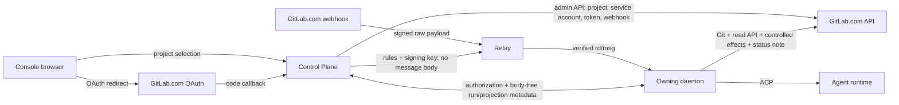

# GitLab.com Integration

> Status: **Implemented** — the Section 22 M0–M8 spine is merged; that
> section records the deliberate leftovers.
>
> Platform assumptions last verified: **2026-07-28**
>
> Codebase alignment last revised: **2026-08-23**
>
> Scope: **GitLab.com Free and Premium**. GitLab Self-Managed, GitLab
> Dedicated, and Ultimate-only capabilities are outside the v1 support
> contract.

This design adds GitLab.com as a first-class code-host provider with semantic
parity to AgentConnect's current GitHub integration. The user experience is a
single OAuth authorization followed by project selection. Internally, OAuth is
only the administration identity: normal agent and webhook execution uses
per-agent service accounts, managed project webhooks, and purpose-separated
credentials.

The central architectural invariant does not change: the Control Plane is not
on the webhook message hot path. GitLab sends a signed webhook to the relay,
the relay verifies and routes it directly to the owning daemon, and the daemon
runs the agent. The Control Plane stores and transports only configuration,
authorization facts, secrets, and body-free run metadata.

## 1. Decision Summary

1. Support **GitLab.com only** in v1. Do not add a configurable host, custom
   certificate handling, version negotiation, or administrator APIs for
   self-managed instances.
2. Use the OAuth authorization-code flow with PKCE and the `api` scope for
   project discovery and installation administration. OAuth access and refresh
   tokens stay encrypted in the Control Plane and never reach a relay, daemon,
   agent process, repository, or diagnostic bundle.
3. Provision **one service account per agent per top-level group**. It is the
   stable, non-human GitLab identity for that agent's comments, reviews,
   approvals, and Git operations; its display name is the agent's name, so
   each agent is its own visible GitLab actor. It does not consume a billable
   seat. v1 shipped one shared account per project binding; M8 replaced it
   outright.
4. Create three service-account personal access tokens with separate purposes:
   a read token, a Git-write token, and an API-effect token. The broad `api`
   token is available only to trusted broker code and never enters the agent
   environment.
5. Install and reconcile one **project webhook** for the union of enabled
   AgentConnect hooks in that project. Use a GitLab signing token and verify the
   Standard Webhooks HMAC over the raw body at the relay.
6. Reuse the existing repository authorization, hook fencing, per-thread
   session, ordinary-reply, formal-review, and durable run-projection
   semantics through a provider adapter. Do not build an unrelated second
   automation stack. GitLab makes the code-host seam a two-implementer seam,
   and Section 6.5 defines the per-host provider contract extracted from the
   GitHub implementation at that moment — deliberately narrower than the
   chat-platform module contracts.
7. Represent run state on a merge request with one bot-authored, updatable
   status note. Do not use commit statuses by default because they create or
   mutate pipeline jobs, and do not depend on Ultimate-only external status
   checks.
8. Treat parity as **product-semantic parity**, not identical provider UI or
   API names. Provider constraints and Free/Premium differences must be
   visible rather than silently approximated.

## 2. Goals

1. Connect a GitLab.com account with one browser redirect, browse accessible
   projects, and select a project without copying a personal access token.
2. Materialize private GitLab workspaces and additional repositories with the
   same `read`, `comment`, and `write` authorization model used for GitHub.
3. Support issues, merge requests, conversation comments, diff comments, and
   pushes as hook sources, including created, updated, and mention-only modes.
4. Preserve numeric, rename-stable project identity and per-thread session
   continuity.
5. Publish exactly one ordinary final reply or one formal review for a
   numbered hook turn, with the same mutual-exclusion rule as GitHub.
6. Support formal review outcomes equivalent to comment, request changes, and
   approve, including single-line and multi-line diff comments.
7. Publish durable queued, running, completed, failed, skipped, superseded,
   and interrupted run state, and support an authorized re-request on the
   current merge-request revision.
8. Automatically install, repair, rotate, and remove AgentConnect-owned
   webhooks and service-account credentials.
9. Keep user OAuth credentials, webhook signing keys, and service-account
   credentials out of normal DTOs, logs, agent prompts, and persistent daemon
   state.
10. Preserve existing GitHub behavior throughout a rolling deployment.

## 3. Non-Goals

- GitLab Self-Managed, GitLab Dedicated, custom GitLab hosts, custom TLS roots,
  or version-specific compatibility branches.
- Ultimate-only external status checks, security approval policies, or other
  Ultimate-only APIs.
- Group webhooks. Project webhooks are available on both Free and Premium and
  give each binding an independent lifecycle and signing key.
- Project access tokens. They require Premium on GitLab.com; service
  accounts provide a common Free/Premium path.
- Creating or modifying customer approval rules, protected branches,
  `CODEOWNERS`, merge checks, CI configuration, or subscription tier.
- Bot-to-bot triggering on GitLab: one agent's contribution never wakes
  another agent (Section 12.1 vetoes every bound agent account). Opening that
  deliberately would mirror the chat-platform bot-to-bot decision and gets its
  own change.
- Exposing a broad service-account `api` token through `GITLAB_TOKEN`, a
  `glab` configuration file, an environment snapshot, or a general token
  vending tool.
- Perfect parity with arbitrary `gh` commands. The parity target is the
  supported AgentConnect integration surface, implemented through Git
  credentials, read-only provider access, and controlled effect brokers.
- Required code-review gates beyond the currently delivered GitHub product
  contract.

## 4. Product Parity Contract

The target is the current supported GitHub behavior, not reserved or future
GitHub modes.

| AgentConnect capability                | GitLab.com implementation                                                              | Parity                                                                                         |
| -------------------------------------- | -------------------------------------------------------------------------------------- | ---------------------------------------------------------------------------------------------- |
| Browser connection                     | OAuth authorization code + PKCE                                                        | Equivalent                                                                                     |
| Repository discovery                   | Paginated OAuth project search, keyed by numeric project ID                            | Equivalent                                                                                     |
| Stable bot identity                    | Per-agent service account                                                              | Equivalent; each agent is a distinct GitLab user, agent-scoped rather than installation-scoped |
| Private clone/fetch/pull               | HTTPS credential helper using the read token                                           | Equivalent                                                                                     |
| Push                                   | HTTPS credential helper using the Git-write token                                      | Equivalent, subject to GitLab branch permissions                                               |
| Additional repository grants           | Provider-qualified `read`, `comment`, or `write` authorization                         | Equivalent                                                                                     |
| Issue and merge-request reads          | Read-only `glab` wrapper or provider read tools                                        | Equivalent                                                                                     |
| Controlled comments and mutations      | Daemon-owned effect broker                                                             | Equivalent                                                                                     |
| Managed event ingress                  | Automatically reconciled project webhook                                               | Equivalent                                                                                     |
| Created, updated, mention-only cadence | GitLab issue, merge-request, note, and push event mapping                              | Equivalent                                                                                     |
| Collaborator gate                      | Live target-project membership check; Developer or higher                              | Stricter than GitHub, whose gate now accepts the triage role                                   |
| External merge-request gate            | Target-project membership or explicit Developer-or-higher request                      | Stricter than GitHub; no workflow-approval start path                                          |
| Bot-authored merge requests            | Same-project service-account MR revisions enter review                                 | Equivalent to GitHub's internal-CI lane                                                        |
| Per-thread sessions                    | Numeric project ID + subject kind + IID                                                | Equivalent                                                                                     |
| Ordinary final reply                   | One service-account note                                                               | Equivalent                                                                                     |
| Inline formal review                   | Draft Notes API + bulk publish                                                         | Equivalent                                                                                     |
| Approve                                | Bulk-published review plus SHA-fenced approval API call                                | Equivalent unless policy requires interactive reauthentication                                 |
| Request changes                        | Human-requested bot reviewer, then `reviewer_state=requested_changes`                  | Equivalent on Premium once requested; advisory on Free                                         |
| Informational run state                | One updated merge-request status note                                                  | Semantically equivalent; not a native Check                                                    |
| Re-request                             | Re-request the agent's service-account reviewer, authorized mention, or Console re-run | Equivalent; the Console re-run replaces the native Check button                                |
| Required run gate                      | Not in the current GitHub delivery contract                                            | Not introduced                                                                                 |
| Session merge-request panel and merges | Not in GitLab v1                                                                       | Deliberately absent; merges are Control-Plane-direct writes                                    |

Ordinary final replies and formal reviews remain mutually exclusive. The
status note is a separate daemon-owned projection and may coexist with either.

## 5. GitLab Tier Contract

The core path deliberately uses only features common to Free and Premium.

| Capability                                     | Free                                        | Premium                                       | Design consequence                                                                             |
| ---------------------------------------------- | ------------------------------------------- | --------------------------------------------- | ---------------------------------------------------------------------------------------------- |
| Service accounts                               | Supported                                   | Supported                                     | Common bot identity, created in the top-level group                                            |
| Service-account seats                          | Non-billable                                | Non-billable                                  | No regular user is required                                                                    |
| Service-account quantity                       | Up to 100 per top-level group on GitLab.com | Unlimited                                     | Surface the quota error; accounts are per agent per top-level group and empty ones are retired |
| Project webhooks                               | Supported                                   | Supported                                     | Always use project webhooks                                                                    |
| Draft review notes                             | Supported                                   | Supported                                     | Common inline-review transport                                                                 |
| Approval API                                   | Supported; approval is optional             | Supported; approval rules may be required     | Approval action works on both                                                                  |
| Request changes                                | Visible but non-blocking                    | Can block merging                             | Show the effective behavior                                                                    |
| Multiple reviewers and required approval rules | Limited                                     | Supported                                     | AgentConnect never mutates the reviewer list                                                   |
| Approval reauthentication                      | Project setting may disable bot approval    | Project/group policy may disable bot approval | Detect and report; never borrow a human credential                                             |
| Group webhooks                                 | Not used                                    | Available                                     | No Premium-only branch in v1                                                                   |
| Project access tokens on GitLab.com            | Not available                               | Available                                     | Do not use                                                                                     |
| External status checks                         | Not available                               | Not available                                 | Ultimate-only; do not use                                                                      |

An Ultimate namespace can use the Premium-compatible path, but Ultimate-only
behavior is neither required nor separately certified.

GitLab.com may require the top-level group Owner to complete identity
verification before a service account can be created. A failed provision must
surface that prerequisite without falling back to a regular user account.

## 6. Architecture and Trust Boundaries



### 6.1 Control Plane

The Control Plane owns:

- OAuth application configuration and OAuth connection lifecycle;
- organization/project bindings and numeric GitLab identities;
- encrypted OAuth, webhook, and service-account credentials;
- service-account and webhook reconciliation;
- repository authorization and action-time policy decisions;
- body-free hook run and desired/observed status-note projection metadata; and
- feature negotiation and daemon/relay assignment.

The Control Plane does not receive or persist issue bodies, merge-request
bodies, note bodies, diff comments, agent replies, or review text. It stores
and sends only the fixed projection fields and fences described in Section 16;
it never calls the GitLab Notes API or writes into a merge-request
conversation.

### 6.2 Relay

The relay owns public webhook ingress. It:

- receives the raw request under a bounded body limit;
- selects the candidate project binding from minimal untrusted JSON;
- verifies the signing-token HMAC and timestamp before full decoding;
- maps `webhook-id` to the stable downstream delivery identity without owning
  authoritative deduplication;
- applies provider-specific event, bot, mention, and collaborator gates;
- routes the bounded, explicitly untrusted context directly to the owning
  daemon; and
- reports only delivery metadata to the Control Plane.

The signing token is sent only to relays. It is never sent to a daemon.

### 6.3 Daemon

The daemon owns:

- workspace materialization and host-scoped Git credential injection;
- read-only GitLab CLI/API access for the agent;
- the ordinary final-answer poster;
- the single status-note projection writer;
- controlled issue, merge-request, pipeline, and formal-review effects;
- exact active-turn and revision fencing; and
- prompt fencing for untrusted GitLab content.

The daemon holds granted credentials in memory only and purges them on lease
expiry, project authorization changes, agent moves, disconnect, or credential
epoch changes. It does not write GitLab tokens to `agent.json`, repository
configuration, shell profiles, or `glab` configuration.

### 6.4 Agent Runtime

The agent may receive:

- a repository-scoped read or Git-write credential indirectly through the
  hidden Git credential helper;
- a read-only API token indirectly for one `glab` invocation; and
- structured tools whose targets are supplied by trusted daemon state.

The agent never receives the OAuth token, webhook signing token, or API-effect
token. Targets for a hook reply or formal review are not model-controlled tool
arguments.

### 6.5 Code-Host Modules, Not Platform Modules

GitLab turns the code-host seam into a two-implementer seam, and that is the
moment it earns its own provider contract — extracted from the working GitHub
implementation while the GitLab implementation is written against it, never
speculatively before. Code hosts still do not adopt the four-contract
chat-platform module shape: they have no bot connection, no chat ingress, no
read port, and no wizard identity. What the two providers share is narrower,
and each surface below enters the contract only because both implement it:

| Host          | Contract surface                                                                           | A code-host module owns                                                                                                                                                                        |
| ------------- | ------------------------------------------------------------------------------------------ | ---------------------------------------------------------------------------------------------------------------------------------------------------------------------------------------------- |
| daemon        | turn-final surface (published), review adapter, credential/CLI profile, hook normalization | final poster, formal-review publication steps, Git credential host rules, read-only CLI shim, session-key recompute and transport-scope pin, maintenance-event handling                        |
| relay         | code-host ingress module behind a shared pipeline skeleton                                 | signature scheme, event-to-semantic-event mapping, veto and gate table, membership-authorization request construction, delivery-key extraction                                                 |
| control plane | code-host provider                                                                         | repository identity refresh, membership authorization, credential minting, provisioning/reconciliation loops, projection write strategy, provider routes at the org and public-callback scopes |
| web           | thin code-host module                                                                      | connect entry, project-picker source, binding status fragments, mark                                                                                                                           |

The daemon already runs the first slice: the GitHub final poster implements
the published Layer-2 turn-final surface, registered per provider, which is
what removed the hardcoded GitHub case from the dispatch path. GitLab extends
the same pattern everywhere: core reads a provider off `CodeHostRepository`,
a frame's discriminated member, or a registry entry — never a provider-name
comparison in core code. There is no code-host manifest: unlike chat
platforms, code hosts have no pre-dispatch capability reads, so every
behavioral difference is a contract member or strategy function in one host.
Directory conventions follow each host's existing ones — the daemon's
surfaces live in per-provider `platforms/<id>/` directories (GitHub's
turn-final surface already does), relay ingress modules move under
`hooks/<id>/` behind the shared verification-and-dispatch skeleton, and the
Control Plane gains a per-provider directory beside the GitHub one behind one
contract file.

Three things deliberately stay outside the contract because the providers
genuinely diverge: the bot identity and claim lifecycle (a GitHub App
installation versus per-agent service accounts over a per-project claim;
Section 8.1 keeps the claims separate), webhook-secret distribution (one deployment-wide App secret versus
a per-binding signing token in the compiled rule), and GitHub-only product
surfaces (the workflow-approval start path and the session merge-request
panel, both explicitly scoped out elsewhere). Forcing any of these behind one
interface would be guessing at an abstraction from two data points that
disagree.

## 7. Identity and Credential Model

### 7.1 OAuth Is the Administration Identity

The deployment registers one GitLab.com OAuth application. A human connects it
to an AgentConnect organization with the `api` scope. That scope is broad, so
the server constrains its use:

- project discovery;
- current-user and current-project permission checks;
- service-account creation or recovery in a project's top-level group;
- service-account PAT creation, rotation, and revocation;
- project webhook creation, repair, test, and deletion; and
- cleanup during project disconnect.

Every administration request names a selected, organization-owned numeric
project binding; agent-account administration is authorized through the
bindings that consume the account. There is no generic authenticated proxy. The OAuth bearer is
never returned by an API or forwarded over a WebSocket.

An organization may have multiple user connections. Each project binding
records the connection currently responsible for administration. A different
Maintainer or Owner may explicitly take over that responsibility. Removing or
revoking the human connection does not silently transfer its authority.

### 7.2 Agent Service Accounts Are the Runtime Identity

The runtime identity is **one group service account per (organization, agent,
top-level group)**. Each agent has its own GitLab face: the account's display
name is the agent's name, every note, review, approval, and push the agent
makes is authored by its own account, and requesting review from a bot means a
specific agent.

Two reasons drive per-agent rather than per-project identity. Agents are the
product's personas — on Slack, Telegram, and Discord each agent is its own bot
identity, and a thread answered by an account named after the agent reads as
the agent the user configured, where a shared project bot reads as
infrastructure with attribution buried in a footer. Structurally, GitLab's
review bulk-publish operates on all pending drafts of the authenticated user
on a merge request, so with one shared account two agents reviewing the same
merge request could consume each other's drafts; per-agent accounts remove
that cross-agent hazard at the provider itself (Section 15.1).

The account is per top-level group because GitLab group service accounts can
be invited only to the group where they were created or to its descendant
subgroups and projects — membership cannot cross the top-level boundary. An
agent whose authorized projects span two top-level groups therefore holds one
account in each; in the common case this is exactly one account per agent.

The account:

- has the username `<agentSlug>-<agentId12>-<root36>`: the agent's name
  slugged to lower-case `[a-z0-9-]` and capped at 20 characters, the first
  twelve hex characters of the agent id, and the top-level group id in base
  36 — for example `gitlab-pilot-5b350c0aeba7-2bmzez`. GitLab.com usernames
  are one global namespace, so the suffixes carry the uniqueness: 48 bits of
  agent identity put an accidental collision among even millions of accounts
  below one in a billion, and the root component is what lets one agent own
  an account in each root it spans. The slug is readable in `@`-completion
  and is taken at creation; it is not re-derived on rename, because the
  row's numeric user id is the durable key. The derivation is a recovery
  marker only for an account the database does not know yet, and recovery
  never adopts by name alone. Before the provider request is sent, the
  account row records the creation attempt — its id, the moment it opened,
  and the set of service-account user ids this top-level group held at that
  moment — so the window survives lease or process loss. After an ambiguous
  or interrupted create, the account is claimed only when it is listed among
  this top-level group's own service accounts and its user id is absent from
  that recorded set. Absence from the snapshot is what dates the account: it
  did not exist when the window opened, which is the predicate a
  creation-time comparison would have expressed. GitLab's service-account
  API reports no creation time — list, create, and update return only the
  id, username, name, and email — so the snapshot is read from the same
  responses the claim is later evaluated against, and no clock-skew
  allowance is needed. Both reads must exhaust the paginated listing rather
  than stop at its first page: the predicate is sound only when an account
  missing from the snapshot is genuinely new instead of merely further down
  the pages, and a Premium root is not bounded by the Free tier's hundred
  accounts. A 24-hour bound closes a window left open by a dead process, so
  a stale one cannot claim indefinitely. A username already taken by
  anything that window does not cover is a foreign account, and the row
  fails provisioning with a translated `username_taken` reason rather than
  adopting it. On resolution the numeric user id and the closed window
  commit in one write, the first durable step and ahead of every cosmetic
  pass, so a process exit during username or display-name convergence cannot
  orphan the account;
- carries the agent's display name, sanitized as the earlier `<project>-bot`
  derivation sanitized and without any suffix; on agent rename the next
  provisioning convergence updates it, and a refused rename is cosmetic and
  never degrades credentials;
- wears the agent's icon as its avatar: the same rendered PNG the chat
  platforms receive, uploaded through the account's own `api` token with
  GitLab's current-user avatar endpoint, converged on provisioning and on
  icon change under the account lease. Like the display name it is cosmetic:
  a refused or unsupported upload never degrades credentials;
- cannot sign in through the GitLab UI and does not consume a licensed seat;
  and
- is assigned the Developer role by default. GitLab branch rules, approval
  eligibility, author/committer restrictions, and protected-resource rules
  still apply; AgentConnect never raises the role automatically to bypass
  project policy.

Membership follows the agent's authorization, not the account's existence.
Binding a project to an agent — through a workspace or a hook — ensures the
account exists in that project's top-level group and adds it as a project
member at the role the workspace `gitAccess` clamp derives. Removing the
agent's last consumer on a project removes the membership; an account left
with no bound project in its top-level group is retired rather than kept warm;
deleting the agent retires all of its accounts (Section 19.4). The project
binding remains the per-project resource: it owns the webhook, the signing
key, the desired-event union, and the deployment-global claim, while identity
lives on the per-agent account rows and a membership join (Section 8.2).

Because one account is consumed by every binding its agent has in that root,
account and PAT lifecycle mutations get one owner: creation, recovery,
rotation, display-name sync, and retirement all run under an account-level
owner-token lease compare-and-swapped on the account row, and the row records
the connection currently administering the account with the same explicit
takeover and reconnect semantics bindings have. A binding's project-scoped
lease continues to own only membership and webhook work. Because membership
writers never take the account lease, retirement cannot rely on rechecking
emptiness under a lock the competing writer does not hold; the account row
carries a lifecycle generation instead. A membership insert commits only
against the current `active` generation of the account row, while retirement,
under the account lease, compare-and-swaps that row from `active` to
`retiring` in the same transaction that verifies the membership set is empty.
The database serializes the two: a bind that loses the race sees `retiring`,
waits out the retirement, and re-provisions a fresh account generation. A
deterministic username and database uniqueness deduplicate names — they do
not serialize ambiguous provider-side mutations, which is what the lease and
the generation fence exist for.

GitLab.com allows 100 service accounts per top-level group, so the population is
agents-with-projects per root. A refused creation lands the account row in a
`service_account_quota` provisioning failure the Console translates
actionably; existing credentials are untouched.

Within one AgentConnect deployment, a GitLab project may have only one active
project binding. A second organization must use an explicit ownership transfer
after the first binding is released. This matches the existing one-organization
claim over a GitHub App installation and prevents two tenants from managing
competing bots, credentials, and webhooks in the same project. The
deployment-global claim in Section 8.1 enforces this invariant before any
provider mutation; an organization-scoped repository row is not itself an
ownership claim.

v1 shipped one Project Service Account per project binding, shared by every
agent on the project. M8 replaced it outright and carried nothing forward:
the binding's account columns are gone, and a binding that predates the
change converges like any binding whose account is missing — its hooks and
credential grants stay disabled until it is `ready` again, exactly as during
first provisioning. The per-project accounts left behind on GitLab are
orphans an operator removes, not managed state, and no code path ever runs
both identity models. On the wire the veto set and the rule's account
identity are additive optional members under the Section 17.3 discipline; a
relay that predates them vetoes only the single ID its rule names, which is
why the relay change shipped before the Control Plane began naming agent
accounts.

### 7.3 Three Credential Purposes

| Purpose     | Service-account PAT scopes    | Consumer                                                                                               | Agent-visible                       |
| ----------- | ----------------------------- | ------------------------------------------------------------------------------------------------------ | ----------------------------------- |
| `read`      | `read_api`, `read_repository` | Git helper for clone/fetch and read-only provider wrapper                                              | Only per invocation/helper response |
| `git_write` | `write_repository`            | Git helper for push                                                                                    | Only per Git operation              |
| `effect`    | `api`                         | Trusted daemon broker for external effects; Control Plane broker for allowlisted metadata/policy reads | Never                               |

The separation matters because a service-account personal access token with
`api` can perform broad API operations within the project and can also access
Git over HTTPS. A `write_repository` token, by contrast, supports Git push but
does not authenticate API requests. A write-capable workspace therefore does
not imply a broad API bearer in the agent environment.

Every service-account PAT creation, including a replacement, sends an explicit
ISO `expires_at`. The v1 policy is 90 calendar days from creation in UTC. It is
finite even when a top-level group has disabled GitLab's service-account token
expiration requirement; AgentConnect never relies on the provider default.

Before a returned token can be sealed or activated, the response must identify
the expected service account, exact scopes, active token, and requested
non-null expiry date. A null, later, or otherwise mismatched expiry is
out-of-policy. The reconciler immediately revokes that returned token by ID,
records any ambiguous revocation as restricted cleanup debt, and fails closed;
the token is never granted to a daemon. AgentConnect grants remain shorter
**authorization/cache leases** and expire locally even while the finite PAT is
still provider-valid.

### 7.4 Rotation

Each credential has an external token ID, expiration date, purpose, and local
credential epoch. Before expiry, the reconciler:

1. creates a replacement PAT with the same purpose, scopes, and an explicit new
   90-day `expires_at`, then validates the returned expiry and identity;
2. seals it before making it active in application state;
3. atomically switches the active credential record and increments its epoch;
4. broadcasts invalidation so daemon caches purge the old value; and
5. revokes the old PAT.

Creating a replacement before revocation avoids the immediate outage caused by
GitLab's rotate-in-place behavior. If OAuth administration is unavailable,
the Console warns before expiry and runtime continues only until the existing
credential expires. The rotated population is per-agent accounts, so rotation
fan-out scales with agents and the top-level groups they span rather than with
projects; each rotation runs under the account's mutation lease (Section 7.2),
never under a binding's.

Webhook signing-key rotation uses a different overlap:

1. generate and seal the next signing key;
2. distribute both current and next verification keys to every eligible relay;
3. update the GitLab project webhook to the next key;
4. trigger or observe one successfully verified delivery using the next key;
5. promote it and remove the old relay key.

GitLab sends with only the configured key, so the overlap belongs at the
receiver. Rotation never falls back to the weaker plain-text secret-token
header.

## 8. Resource Model

The implementation should introduce one narrow provider-neutral repository
reference rather than duplicate GitHub authorization and hook logic.

### 8.1 `CodeHostRepository`

`CodeHostRepository` is organization-scoped metadata:

- internal UUID;
- provider: `github | gitlab`;
- provider numeric repository/project ID;
- current display path;
- canonical HTTPS clone URL;
- default branch; and
- optional provider-binding reference.

Its unique identity is `(orgId, provider, externalId)`. Display paths and clone
URLs are mutable hints. Authorization, hook matching, and run effects use the
provider-qualified numeric identity.

That uniqueness is only the organization-scoped catalog identity. A separate
`CodeHostRepositoryClaim` is deployment-scoped and has a unique
`(provider, externalId)` key plus owning organization, binding, claim
generation, and lifecycle state (`provisioning`, `active`, `transferring`, or
`cleanup_pending`). It contains no path, content, or credential. GitLab v1
acquires this row transactionally before provisioning; the existing GitHub
installation claim remains unchanged until a separate migration.

Existing GitHub workspace, `AgentRepoAuthorization`, and `HookDef.repoId`
references migrate to this resource without changing behavior. During rolling
compatibility, legacy GitHub fields remain readable; new GitLab resources
require the new negotiated feature and never fall back to an unqualified
numeric ID.

### 8.2 GitLab-Specific Resources

| Resource                  | Non-secret contents                                                                                                                                                                                                                                                 |
| ------------------------- | ------------------------------------------------------------------------------------------------------------------------------------------------------------------------------------------------------------------------------------------------------------------- |
| `GitlabConnection`        | org, AgentConnect user, GitLab user ID/username, granted scopes, access expiry, state, token version, refresh lease, last sync                                                                                                                                      |
| `GitlabProjectBinding`    | org, numeric project ID, current path, installer connection, webhook ID, desired event hash, credential epoch, lifecycle state                                                                                                                                      |
| `GitlabAgentAccount`      | org, agent, top-level group ID, numeric user ID, username, display-name and icon fingerprints, creation-attempt id/open time/known-account snapshot, credential epoch, administering connection, mutation-lease owner/expiry, lifecycle generation, lifecycle state |
| `GitlabAccountMembership` | account, account generation, binding, role, membership state                                                                                                                                                                                                        |
| `GitlabProjectCredential` | issuing account, purpose, external token ID, scopes, provider expiry, active generation                                                                                                                                                                             |
| `GitlabReviewPublication` | binding, MR IID, service-account user ID, active attempt, lease owner/expiry, monotonic fence, phase, head SHA, external draft/note IDs, normalized outcome                                                                                                         |
| `GitlabWebhookSecret`     | binding relation only in normal reads                                                                                                                                                                                                                               |
| `GitlabConnectionSecret`  | connection relation only in normal reads                                                                                                                                                                                                                            |

`GitlabProjectCredential` stores its sealed token value behind a dedicated
secret-store port. `GitlabWebhookSecret` stores the sealed signing token.
`GitlabConnectionSecret` stores sealed OAuth access and refresh tokens. None is
joined by list/get DTO queries.

`GitlabReviewPublication` has a unique key of
`(bindingId, mergeRequestIid, serviceAccountUserId)`; per-agent accounts make
the last component differ per agent, so two agents reviewing one merge request
hold independent coordinators. It is a durable
publication coordinator, not a content ledger: it stores no review body,
inline-comment body, diff, or prompt. Attempt records keep only signed-marker
digests and provider IDs needed to reconcile effects. Its publication phases
are `idle`, `preparing`, `publishing`, `reconciling`, `ambiguous_locked`, and
`published`; an abandoned attempt must reconcile or delete its marked drafts
before the row can return to `idle`.

Suggested project-binding states are:

- `provisioning`;
- `ready`;
- `admin_degraded` — runtime identity still works, but OAuth repair is needed;
- `runtime_degraded` — service account, role, or credentials no longer satisfy
  runtime requirements; and
- `cleanup_pending` — local authority is disabled, but external cleanup still
  needs a Maintainer or Owner connection.

Do not collapse these states into one generic connected boolean.
`GitlabAgentAccount` reuses the same lifecycle vocabulary and Console
translations, plus a `service_account_quota` provisioning-failure reason when
the top-level group's account quota refuses a creation.

### 8.3 Existing Agent and Hook Resources

- An agent workspace and each `AgentRepoAuthorization` reference a
  `CodeHostRepository`.
- `AgentRepoAuthorization` carries the provider beside its numeric id, and its
  uniqueness is `(agent, provider, repository)`. The reference converged on the
  catalog through a provider column rather than a foreign key, for the same
  readers-first reason `HookDef` did: the two hosts number their repositories
  independently, so a bare numeric id stopped being an identity the moment
  GitLab grants existed, and every reader that matched on it — the mint gates,
  the workspace-collision checks, the Checks ledger — is qualified by provider.
  An absent provider means `github`, which is what every row predating GitLab
  is.
  A pre-GitLab daemon strips the unknown provider key, so a two-segment project
  path would read there as an `owner/repo` GitHub entry; the §17.3 projection
  gate therefore reads the assembled additional-repository list as well as the
  workspace arm, and withholds such a spec from a daemon that has not advertised
  `gitlab-com-v1`.
- `RepoAccess` remains `read | comment | write`. On GitLab the tier derives the
  account's project role exactly as a workspace does: `write` earns Developer,
  and `read` and `comment` both earn Reporter, since a note is a read-level
  action there.
- Authorizing a project makes the agent a **consumer** of it (§7.2), so the
  write runs the same inline account/membership ensure the workspace and hook
  writes run, under the same binding lease, and revoking converges the
  membership away. The consumer query that computes the desired membership set
  counts grants alongside workspaces and enabled hooks; without that, the next
  convergence would unbind the membership the grant had just bound.
- A code-host hook references a `CodeHostRepository` and a provider
  discriminator. Common cadence, labels, session, review, reporting, revision,
  placement, and output-target fields stay on `HookDef`.
- GitLab-only connection, account, credential, and webhook state stays on
  `GitlabProjectBinding` and `GitlabAgentAccount`, not in nullable columns on
  `HookDef`.
- Creating a hook never creates a general repository grant. The watched project
  must already be the workspace repository or an explicit additional
  authorization, enforced on create and on a binding-changing edit with a 409
  that names the fix; hooks predating the check keep firing, exactly as the
  GitHub precedent grandfathers its own. Without the check the trigger plane
  outruns the credential plane: the hook fires, the review's exact checkout can
  obtain no credential, and the agent posts a note saying it could not review.

## 9. OAuth Flow and Correctness

The visible flow can be one link while still enforcing the complete OAuth
lifecycle.

### 9.1 Start

`POST /api/v1/orgs/:orgId/gitlab/oauth/start`:

1. authenticates the AgentConnect user and organization;
2. generates a random, single-use state nonce, PKCE verifier, and S256
   challenge;
3. stores a short-lived state row bound to the organization, user, browser
   session hash, exact return path, and sealed verifier;
4. returns or redirects to GitLab.com's authorization endpoint with the exact
   registered callback, `response_type=code`, `scope=api`, state, and PKCE
   challenge.

For a reconnect or takeover already bound to a known top-level namespace, the
server also supplies GitLab's `root_namespace_id`. The client cannot provide an
unverified namespace ID. This lets GitLab apply the intended group SAML context
without making the initial general connection depend on a guessed namespace.

State is opaque. It must not contain raw organization IDs, user IDs, return
URLs, or reusable bearer claims.

### 9.2 Callback

The callback:

1. consumes the state row exactly once;
2. verifies expiry, browser binding, user, organization, and allowlisted return
   path;
3. exchanges the code with the stored PKCE verifier;
4. fetches the authenticated GitLab user from the API;
5. seals the access and refresh tokens before persistence;
6. upserts only the matching user's organization connection; and
7. redirects to the stored local return path with a non-sensitive result code.

Callback errors and logs never include the code, state value, token response,
or upstream response body.

### 9.3 Refresh Rotation

GitLab OAuth access tokens normally expire after two hours. Refreshing
invalidates both the old access token and the old refresh token and returns a
new pair. This creates a distributed single-writer requirement:

1. one process claims a short refresh lease for the connection;
2. it decrypts the current pair and performs one refresh request;
3. it seals both returned tokens and commits them with a token-version CAS;
4. other callers reload the committed version instead of refreshing the old
   pair; and
5. the lease is released or expires after a crash.

An ambiguous refresh timeout is not blindly retried because the old refresh
token might already be invalid. Mark the connection `reauth_required` and ask
the user to reconnect. Existing service accounts continue runtime
operations while their credentials remain valid; only administration is
degraded.

### 9.4 Disconnect and User Removal

Disconnecting a user OAuth connection revokes the OAuth grant when possible
and removes the sealed token pair. Project bindings are not deleted
implicitly. Bindings assigned to that connection become `admin_degraded` and
can be taken over by another current Maintainer or Owner.

Takeover is offered wherever administration is actually stuck — a released,
reauth-required, or removed connection, or a binding degraded under its current
one — and a `cleanup_pending` binding is reassigned without being reprovisioned,
so its interrupted removal can finish under the new account (Section 19.4).

The retained row is history, not a permanent fixture: once a disconnected
connection administers no project binding at all, deleting it again removes
the row, and that removal is refused while any binding is still assigned to
it.

Removing the AgentConnect user from the organization follows the same rule.
Their OAuth authority must not survive organization membership.

## 10. Project Provisioning and Reconciliation

Project setup is a resumable external-resource saga, not one database
transaction.

### 10.1 Project Selection

The project picker searches the connected user's accessible GitLab.com
projects with server-side pagination. The client submits only the selected
numeric project ID and connection ID. The server re-fetches the project and
requires:

- the same GitLab.com host;
- a current project;
- Maintainer or Owner access for managed installation;
- organization ownership of the selected OAuth connection; and
- a canonical HTTPS clone URL.

Projects below Maintainer may appear as visible but not installable, with the
required role stated explicitly. Maintainer or Owner is the user's current
effective project membership, including inherited and invited-group access,
with the same active-state and expiry validation defined in Section 12.2.

### 10.2 Desired-State Provisioning

After the read-only project and permission checks, the Control Plane opens one
database transaction that inserts the deployment-global
`CodeHostRepositoryClaim`, creates the organization-scoped repository and
binding rows, and attaches the claim to that binding. The claim's unique
`(provider, externalId)` key selects one winner. A uniqueness loser returns
`project_already_claimed` and may not begin any external mutation. Every
provisioning step checks the owning binding and claim generation.

The reconciler converges these steps:

1. refresh `CodeHostRepository` by numeric project ID;
2. for each agent consuming the binding, find that agent's deterministically
   named account in the project's top-level group or create it under the
   account's mutation lease (Section 7.2);
3. ensure each such account is a project member at the role the binding
   requires;
4. create or recover the `read`, `git_write`, and `effect` PATs per account,
   under the same account lease;
5. seal each returned value and persist its external token ID and expiry;
6. if at least one enabled GitLab hook exists, create or reconcile the project
   webhook and signing token;
7. test a newly created or explicitly repaired webhook within GitLab's rate
   limit;
8. mark the binding ready and broadcast the new desired configuration.

External names include a stable, non-secret binding marker and purpose. After
an ambiguous create response, reconciliation lists resources by that marker:

- an unrecorded PAT whose plaintext cannot be recovered is revoked and
  recreated;
- an existing service account is reused;
- an existing webhook is updated with the locally stored signing token and
  tested; and
- foreign service accounts, PATs, and webhooks are never adopted by name alone.

The reconciler also refreshes the current project path by numeric ID, detects
role or service-account membership drift, checks PAT expiry, and repairs the
union of desired webhook events.

The claim remains held through `provisioning`, `ready`, degraded states, and
`cleanup_pending`. It can be released only when the operation ledger proves
that no provider mutation began or a current Maintainer/Owner connection has
verified that every managed webhook, PAT, and service account is absent. Local
disablement, elapsed time, a failed cleanup, or an administrator assertion
without provider verification never releases it.

A cross-organization ownership transfer locks this same claim row, changes it
to `transferring`, and increments its generation before disabling the old
binding. The transfer saga definitively removes the old binding's external
credentials, webhook, and managed account memberships — retiring accounts left
with no bound project in their top-level group — before atomically moving the
claim to the new organization and allowing fresh provisioning. A crash or
ambiguous cleanup keeps the claim in `transferring` or `cleanup_pending`; it
cannot be stolen or independently re-created by a competing binding.

### 10.3 Webhook Ownership

There is at most one AgentConnect-managed project webhook per project binding.
Its enabled event flags are the union of all enabled GitLab hooks in that
project. Removing or disabling a hook can narrow the union; deleting the final
hook removes the managed webhook but leaves workspace credentials intact.

Ownership requires both the stored GitLab webhook ID and the stable
AgentConnect marker. Reconciliation must not modify another integration's
webhook that happens to use a similar URL.

## 11. Webhook Ingress

### 11.1 Installation

The Control Plane generates a 32-byte signing key, encodes it in GitLab's
`whsec_<base64>` form, seals it, and creates the project webhook through the
OAuth administration connection. The URL is derived from deployment
configuration, for example:

```text
https://relay.example.com/webhooks/gitlab
```

The managed webhook enables only the union required by active hooks:

- issue events;
- merge-request events;
- note events; and
- push events.

SSL verification is always enabled. Secret-token-only
`X-Gitlab-Token` authentication is not the steady-state path.

### 11.2 Verification

The relay:

1. enforces HTTPS deployment configuration and a 1 MiB raw-body limit;
2. parses only enough bounded JSON to obtain the numeric project ID;
3. looks up the current relay assignment and signing token for that project;
4. requires `webhook-id`, `webhook-timestamp`, and `webhook-signature`;
5. rejects timestamps outside the configured replay window;
6. constructs `"{webhook-id}.{webhook-timestamp}.{raw-body}"`;
7. strips the `whsec_` prefix, base64-decodes the signing key, and accepts any
   timing-safe matching `v1` signature from the space-separated signature
   list; and
8. only then fully decodes and matches the payload.

`webhook-id` is the delivery key and remains stable across retries. The relay
has no database and does not own authoritative deduplication. It preserves
fan-out to every matching AgentConnect hook and emits the same `deliveryKey`
and `${hookId}:${deliveryKey}` message ID on each provider retry. The daemon's
durable `(sessionKey, msgId)` inbox absorbs the repeated turn, and the Control
Plane's unique `(hookId, deliveryKey)` `HookRun` absorbs repeated delivery
reports. An optional relay-local cache may suppress obvious same-process
repeats, but correctness never depends on it and a retry landing on another
relay remains safe.

GitHub additionally runs a Control-Plane redelivery reconciliation sweep that
asks the provider to redeliver GUIDs that never produced a `HookRun` after a
relay-pool outage. GitLab v1 deliberately scopes that sweep out: provider
retries remain the only lost-delivery recovery, and a GitLab counterpart
(per-hook events plus the resend API) is revisited only if the pilot shows
real loss.

Verified unmatched deliveries return success without starting an agent.
Invalid signatures, stale timestamps, unknown projects, and malformed bodies
have indistinguishable public failures and never disclose whether a project is
connected.

### 11.3 Compiled Rule

The Control Plane sends each relay the compiled rule, extending the existing
`rc/hook-assign` shape:

- hook, agent, and dispatch-daemon identifiers;
- the existing config snapshot: the configuration and dispatch revisions plus
  the review, reporting, and gate policy modes, and the session mode;
- provider `gitlab` with the numeric project ID as the match key;
- current project path for display only;
- the hook agent's account numeric user ID and username, plus the veto set of
  every account user ID bound to the project (Section 12.1) as an additive
  optional field;
- event patterns, comment families, and mention mode; and
- the project signing token inline in the rule, exactly as the generic
  webhook's HMAC secret rides today, fetched from the hook secret store at
  compile time.

The project ID, not path, is the match key. The relay cannot invent a rule,
placement, or revision.

## 12. Event Mapping and Routing

Stored code-host patterns remain provider-neutral. The GitLab adapter maps:

| Product family                     | GitLab webhook source                  |
| ---------------------------------- | -------------------------------------- |
| `issues:*`                         | Issue Hook actions                     |
| `merge_request:*`                  | Merge Request Hook actions             |
| issue conversation comment         | Note Hook with an issue subject        |
| merge-request conversation comment | Note Hook with a merge-request subject |
| merge-request diff comment         | Note Hook with a diff-note position    |
| `push:*`                           | Push Hook                              |

The Console keeps the same cadence:

- **created**: issue or merge request opened; later authorized explicit mention
  remains additive;
- **updated**: opened plus supported substantive updates, new source commits,
  and selected comment families; and
- **mention only**: authored text must mention the assigned agent name or the
  hook agent's service-account username.

Close, reopen, pure edit noise, and draft/ready toggles follow the existing
GitHub vetoes unless a future product decision changes both providers: a draft
merge request triggers and receives formal reviews exactly like an open one,
while the draft/ready transition itself is lifecycle noise and never a new
turn. Merge-request source revision, reviewer re-request, and label changes
are normalized to the existing semantic events. Close is not only a veto:
GitLab MR-merged, issue-closed, and deleted events map to the existing
relay-authored maintenance-delivery family (the GitLab counterpart of the
`github-thread-worktree-cleanup-v2` daemon capability), so the daemon cleans
up per-thread session worktrees without opening a model turn; without this
mapping GitLab session worktrees leak.

### 12.1 Loop Prevention

Reject an event when its author ID is any service-account user ID bound to
the project. The compiled rule carries that veto set, so one agent's replies,
reviews, and status updates can never trigger another agent's hook —
accidental bot-to-bot stays off while the bot's own merge requests remain
reviewable through one deliberate exception, scoped to the rule's own
identity: a same-project merge-request revision authored by the account this
rule itself names still enters review, matching GitHub's internal-CI lane
where the App's own same-repository pull requests are reviewed. Every other
member of the veto set stays vetoed even for merge-request revisions, so one
agent's merge request never wakes a sibling agent's hook. Notes authored by
any bound account and system-generated notes carrying AgentConnect status or
attempt markers are always rejected. A relay that predates the veto set
vetoes only the single ID its rule names, which is why the relay change
shipped before the Control Plane began naming agent accounts.

### 12.2 Collaborator and External-Merge-Request Gate

Neither provider trusts webhook-carried relationship labels: GitHub's
`author_association` is display metadata only, and every numbered-thread event
is live-authorized through the relay-to-Control-Plane metadata-only
authorization seam GitHub already uses. GitLab implements the same seam
through the new provider-neutral frame in Section 17.2, differing only in
sending numeric user and project IDs instead of logins and a repository path.
For comments, issue and merge-request lifecycle events, and external merge
requests, the relay sends only project ID, hook fences, and sender/author
numeric user ID to the Control Plane; only pushes, the binding's own
same-project merge-request revisions, and the relay-authored
maintenance-delivery family (Section 12) stay relay-trusted. Maintenance
deliveries carry cleanup-only work and never open a model turn, so they bypass
the actor gate exactly as GitHub's cleanup branch does today — an unavailable
membership lookup or a low-role closing actor must not leave a session
worktree behind. The Control Plane
performs a current target-project membership lookup
with the project effect identity using
`GET /projects/:id/members/all/:user_id`, or a semantic equivalent that includes
direct, ancestor-group, and invited-group membership and returns the highest
effective access level. It accepts only the requested numeric user ID with
`state=active`, `expires_at` absent or later than the current UTC date, and
`access_level >= 30`. Awaiting, expired, lower, missing, ambiguous, or
unavailable membership fails closed. The lookup never carries authored text.
Developer (`access_level >= 30`) is a recorded divergence: GitHub's trigger
gate now accepts its triage role, a trusted non-committer, but GitLab's
Reporter role lacks the merge-request authority that rationale assumes, so
GitLab keeps the stricter bar.

A merge request from an untrusted source author does not start automatically.
A current member passing the same Developer-or-higher gate may explicitly
request it through:

- a mention in the merge-request thread;
- assignment or re-request of an agent's service account as reviewer; or
- an authorized Console action.

GitHub additionally starts an external review when a maintainer approves the
pull request's workflow run; GitLab's Free/Premium project-webhook surface has
no equivalent signed signal, so that fourth start path is deliberately absent.

Each path revalidates membership and the complete hook/revision fence before a
generation starts.

### 12.3 Session Affinity and Prompt Boundary

GitLab hooks always use `perThread`. A rename-stable key is derived from:

```text
issue or merge request: gitlab:<numeric-project-id>:<issue-or-merge-request>:<iid>
push:                   gitlab:<numeric-project-id>:push:<ref>
```

Issue and merge-request events require a positive numeric IID and the exact
subject discriminator. Standalone push events instead require the non-empty
canonical Git ref from the signed payload, such as `refs/heads/main`. Missing
or wrong-branch identity is rejected before constructing `RdMsgHook`; the
adapter never substitutes `undefined`, a display path, or a delivery ID into a
session key.

The daemon session key has five dimensions — platform, channel, thread, agent,
and transport scope. A GitLab turn pins `transportScope =
gitlab:<numeric-project-id>`, mirroring the existing `github:<repoId>` pin:
channel-scoped memory and transcript keys derive from channel plus transport
scope, never thread, so re-pointing a mutable hook at another project cannot
carry the old project's channel-scoped state forward.

The trusted `gitlab` member on `RdMsgHook` is also the daemon normalization
discriminator. Before generic session-key fallback, `splitSessionKey()` must
recompute and validate the key from that metadata, then map a headless GitLab
turn to:

```text
channel = <hook-id>
thread  = <complete provider-qualified session key>
```

The complete thread value is opaque to the daemon; it is not split on colons.
`msgId` remains the delivery identity and transcript ordering suffix, never a
thread fallback. Consequently, different webhook IDs delivered to one hook for
one MR or ref resolve to the same durable ACP session, while different IIDs,
subject kinds, projects, or refs remain disjoint. A daemon without this mapping
cannot advertise `gitlab-com-v1` and cannot receive a GitLab assignment.

Turn admission runs through the provider-neutral hook-admission seam extracted
from the GitHub implementation at the moment GitLab became its second
implementer (Section 6.5). The lane is (hook, project, MR IID). Within one lane
the newest relay-fired head supersedes queued turns and preempts an active
older-head turn with the normalized `superseded` outcome. `merge_request:opened`
and `merge_request:synchronize` establish a head; a reviewer request and the
console re-run are instead pinned to the head already current, so a burst of
them collapses onto the newest delivery and contests that head alone. Preemption
reuses GitHub's criterion unchanged — a newer head, or an explicit re-run of the
active turn's own head — and adds no GitLab-specific rule. Issue deliveries carry
no revision and never contend, exactly as GitHub's do not.

Note deliveries on one merge request coalesce into a single batched turn under
the same three gates GitHub uses: a maximum comment count, a quiet window since
the last note, and a maximum wait since the batch opened. GitLab's Note Hook
carries no durable review identifier, so the merge request itself is the batch
key and the timing gates bound the batch. This deliberately revises the earlier
position, which refused batching for want of that identifier: the identifier
decides only which notes belong together, and one merge request within one short
window is a better answer than a turn per note. Two consequences of the missing
identifier are accepted rather than approximated — notes from different authors
inside one window join one batch, and the batch is answered by one ordinary note
instead of per-thread replies, because GitLab has no equivalent of GitHub's
per-thread batched reply tool. A sealed GitLab batch therefore keeps its ordinary
reply target and publishes exactly one note, preserving the Section 14.1
single-writer contract; only GitHub's batch withdraws that target in favour of
its tool. Issue notes keep one turn each.

An interrupted review attempt still follows Section 15.1's fail-closed
publication ownership rules: a preempted generation's head fence classifies it
`not_submitted` and releases the publication lease rather than holding it.

The relay sends only bounded excerpts. The daemon wraps them in the same
explicit untrusted-content boundary used for GitHub. The agent reads current
project, subject, discussion, diff, and pipeline state through the authorized
read path when more context is needed.

## 13. Repository Authorization and Git Access

### 13.1 Authorization

The existing authorization meanings remain:

| Access    | GitLab behavior                                                                                     |
| --------- | --------------------------------------------------------------------------------------------------- |
| `read`    | clone/fetch and read-only project, issue, merge-request, discussion, diff, and pipeline access      |
| `comment` | `read` plus controlled issue/MR comments and formal `COMMENT`; no push, approve, or request changes |
| `write`   | `read` plus Git push, controlled mutations, pipeline actions, and full configured review policy     |

Workspace `gitAccess` remains `read | write`. The daemon-owned ordinary hook
poster is authorized by the enabled hook, not by an agent-visible general
grant. This preserves the existing behavior where a read-only workspace can
return one final comment without receiving a write credential.

An agent therefore has **two** credential authorities on GitLab, as it does on
GitHub: its workspace project, and any project it holds an explicit additional
authorization on. The grant's own tier is that project's ceiling — a write
workspace does not widen it — and a project that is neither is a denial, never
a fallback onto the workspace. A named project is asked for by its numeric id,
because the grant echo the consumer verifies is keyed on that identity: an ask
carrying only a display path would be answered with the workspace grant and
then correctly rejected by the daemon.

A rename reaches both places the project's path is replicated into. The binding
and the catalog converge on the numeric id, and so must every gitlab workspace's
clone URL AND every explicit authorization's display path — the latter is what
the daemon maps a named project back to its numeric id with. Leaving a grant
stale orphans the new path, and an ask under the old one is answered with the
binding's new path and then correctly rejected by the consumer's echo check.
Both writes join one configuration-ordering domain and bump each affected
agent's revision exactly once, so a spec never carries half a rename.

One half is deliberately not built yet: an authorized additional GitLab project
receives credentials but is not materialized as a secondary workspace root. The
existing root layout is `owner/repo` and clones from github.com, which a
namespaced GitLab path cannot express and a GitLab project must not be fetched
from. Until that layout is provider-aware, GitLab entries are skipped when
roots are built rather than cloned from the wrong host.

Every broker request is re-resolved by:

1. the requesting daemon currently serving the agent — its placement target or
   a live duty lease, resolved through the placement resolver;
2. provider-qualified numeric repository identity;
3. workspace or explicit authorization;
4. requested capability under the access clamp;
5. active project binding, service-account membership, and credential epoch;
6. current hook/action fence when applicable.

### 13.2 HTTPS Credential Helper

Managed GitLab workspaces use HTTPS only. The existing hidden credential-helper
path becomes provider-aware:

- the helper accepts `gitlab.com` only for a GitLab grant;
- subgroup paths of arbitrary depth are preserved;
- `useHttpPath=true` prevents a token for one project from satisfying another;
- the grant echoes provider, numeric project ID, canonical path, username,
  access, credential epoch, and local lease TTL;
- the consumer verifies every echoed field before returning the password; and
- the token never appears in argv, a remote URL, `.git/config`, or a shell
  environment snapshot.

Credential injection must cover all three existing paths:

1. clone-time `GIT_CONFIG_*`;
2. long-lived agent-session host configuration; and
3. repository-local helper configuration.

Each path resets inherited helpers for `https://gitlab.com` before installing
the daemon helper, preventing fallback to a developer's personal credentials.

The managed feature allows only the exact `https://gitlab.com` origin. An
operator-supplied `workspaceGitAllowedOrigins` remains authoritative; the
feature readiness check must explain when that explicit policy excludes
GitLab.com rather than silently widening it.

### 13.3 Read-Only Provider CLI

Core GitLab support does not depend on a separately installed CLI. The daemon
provides bounded read operations for project, issue, merge-request, discussion,
diff, and pipeline source-of-truth data.

When `glab` is installed, a hidden wrapper additionally resolves the target
project using explicit repository arguments, environment, and the current
remote in provider-defined precedence. It requests the binding's `read`
credential for that invocation and starts the real CLI with a read-only token.
It refuses an unbound or unauthorized project.

Mutating CLI commands do not receive the effect token and fail at GitLab.
This is deliberately stricter than the GitHub precedent, whose CLI wrapper
serves a capability-clamped write-capable token so `gh issue comment` works.
Supported mutations use structured broker tools so the target and authorization
cannot be changed by prompt content. A user-supplied GitLab token wins over the
managed wrapper and is outside the managed credential guarantee, matching the
existing `GH_TOKEN` pass-through, which is silent today; a warning would be new
behavior and should land on both providers together.

## 14. Output Ownership

### 14.1 Ordinary Final Reply

The GitLab final poster follows the current single-writer contract:

1. collect ACP output in daemon memory;
2. wait for the turn and tools to finish;
3. choose the authoritative final-answer message;
4. obtain an action-time, purpose-bound effect lease;
5. post one issue or merge-request note as the acting agent's service
   account; and
6. report only note ID, target IDs, outcome, and normalized error code.

It never publishes commentary, progress, tool output, an incomplete answer, or
a second fallback after an ambiguous write. Retry once only after a definite
authentication rejection and a credential-epoch refresh.

The poster is the second implementer of the published Layer-2
`TurnFinalSurface` shape, after GitHub, and reuses the durable single-publish
barrier: the turn's publish state (`not_started`, `in_flight`, `settled`) is
recorded around the public POST, so a daemon restart cannot replay an ordinary
reply whose write was already in flight.

### 14.2 Controlled Non-Review Effects

Provider-neutral structured operations cover the currently supported
integration surface:

- create or update an issue/MR comment;
- read and reply to a discussion;
- create or update a merge request where the repository grant permits it;
- inspect pipelines and jobs; and
- retry or cancel a pipeline/job when `write` authority permits it.

Each operation has an allowlisted endpoint and method. The broker does not
expose an arbitrary path, GraphQL query, request body, or bearer token.

This broker surface is new machinery, not an existing seam: today's GitHub
equivalents are the capability-clamped CLI token plus exactly two structured
tools (`submitGithubReview` and `replyGithubReviewThreads`). GitLab builds the
provider-neutral surface first; migrating GitHub onto it is separate work.

## 15. Formal Merge-Request Reviews

The agent calls a structured review tool. Today that tool is
`submitGithubReview`; this design promotes it to a provider-routed
`submitCodeReview` with an unchanged argument schema, keeping the GitHub name
as an alias while the model-facing hook prompt text migrates. The target
project, merge-request IID, base/head revision, hook, and policy come from
daemon-private active-turn state, not tool input.

The common input schema remains:

```ts
submitCodeReview({
  event: 'COMMENT' | 'REQUEST_CHANGES' | 'APPROVE',
  verdict: 'pass' | 'fail' | 'neutral',
  body: string,
  comments?: Array<{
    path: string,
    body: string,
    line: number,
    side: 'LEFT' | 'RIGHT',
    startLine?: number,
    startSide?: 'LEFT' | 'RIGHT'
  }>
})
```

`COMMENT` accepts `pass`, `fail`, or `neutral`.
`REQUEST_CHANGES` requires `fail`, and `APPROVE` requires `pass`; contradictory
pairs are rejected before any provider effect.

`COMMENT` and `APPROVE` neither require nor create a reviewer record.
`REQUEST_CHANGES` requires the acting agent's service account to be a current
reviewer. AgentConnect never assigns itself: GitLab's REST reviewer update replaces the
list, and GraphQL `APPEND` also snapshots, unions, and replaces the complete
list, so either can lose a concurrent human assignment. The MR author or another
authorized user must request or re-request the service account through GitLab's
native reviewer control. Until then, active-turn policy omits
`REQUEST_CHANGES`, the adapter rejects a stale invocation before any review
draft, and advisory `COMMENT + fail` remains available.

The GitLab adapter:

1. synchronously reserves one review attempt for the active turn;
2. acquires the durable publication lease for
   `(project, MR IID, service-account user)` and receives its monotonic fence;
3. asks the Control Plane to authorize the exact hook, project, IID, event,
   policy, configuration/dispatch revisions, and current placement;
4. reconciles every pending draft owned by the service account on that merge
   request, as described below;
5. re-fetches the current merge request and rejects a changed head;
6. reads the service account's current record from
   `GET /projects/:id/merge_requests/:iid/reviewers`;
7. for `REQUEST_CHANGES` only, requires that reviewer record or returns
   `reviewer_assignment_required` before drafts;
8. creates regular and diff draft notes with the exact diff refs, putting a
   signed hidden attempt-and-ordinal marker in every draft and recording each
   returned draft ID;
9. re-lists drafts and verifies that the current attempt owns the complete set;
10. immediately before publication, re-reads reviewer state; if the service
    account has been removed from a `REQUEST_CHANGES` attempt, deletes the
    current attempt's drafts and returns `reviewer_assignment_required`;
11. bulk-publishes the drafts with a summary, signed hidden attempt marker, and
    the event-specific reviewer-state parameter below;
12. re-reads the reviewers endpoint and the merge request's refreshed
    `detailed_merge_status`; a missing or mismatched reviewer record after
    `REQUEST_CHANGES` is an unknown, potentially blocking provider effect on
    Premium, not evidence of an advisory-only outcome; and
13. for `APPROVE`, only after the unchanged-state postcondition holds, waits
    until
    `detailed_merge_status` is neither `checking` nor `approvals_syncing` and the
    merge-request diff has a non-null `patch_id_sha`, and calls the approval
    endpoint with the exact head SHA, then requires the service-account user ID
    in the approval readback's `approved_by` set for that head.

Reviewer-state mapping is:

| Input                               | `bulk_publish.reviewer_state` | Required postcondition                                                 |
| ----------------------------------- | ----------------------------- | ---------------------------------------------------------------------- |
| `COMMENT` + `pass`/`neutral`/`fail` | omit                          | reviewer record remains absent or state is unchanged                   |
| `REQUEST_CHANGES` + `fail`          | `requested_changes`           | state is `requested_changes`; otherwise classify the effect as unknown |
| `APPROVE` + `pass`                  | omit                          | reviewer record remains absent or state is unchanged                   |

Approval is deliberately a separate call because GitLab's review publication
does not record a formal approval and the approval API provides the required
SHA fence. The API requires an eligible approver, not prior reviewer
assignment. A passing `COMMENT` is still commentary and never supersedes a
prior change request; only the explicit `APPROVE` operation can record that
passing transition. Therefore no `COMMENT`, and no pre-approval publication,
can clear an existing `requested_changes`.

### 15.1 Publication Serialization and Orphan Recovery

GitLab's bulk-publish endpoint publishes every pending draft on the merge
request that belongs to the authenticated user. It has no attempt identifier.
Per-agent accounts remove cross-agent contention at the provider — two agents
reviewing one merge request act as two GitLab users with disjoint draft sets —
but within one account the endpoint still cannot name an attempt, so the
publication lease remains a correctness boundary serializing that account's
own concurrent and crash-replayed attempts.

The lease and attempt phase live in the Control Plane database. Acquisition is
compare-and-swap, increments the fence, and permits only one owner across
agents and daemons. Every draft create/delete and bulk-publish operation
requires a durable single-use operation record bound to the current attempt,
fence, method, target, and operation ordinal. Before the outbound request, the
trusted daemon broker atomically moves that record from `issued` to
`request_started`. It then records the deterministic response or
`response_ambiguous`. Review content still travels directly from the daemon to
GitLab, so the Control Plane sees only metadata. The broker and its HTTP client
disable automatic retries for these non-idempotent review mutations. One
`request_started` record permits exactly one outbound provider request.

The fence prevents a stale broker from obtaining another operation record, but
it is not presented as a GitLab-side fence. In particular, checking or starting
an operation record does not make an outbound request revocable: the broker
could pause immediately afterward. Consequently, elapsed time, a disconnected
daemon, an expired lease, and absence of a marker after a convergence window
are never sufficient to transfer publication authority once an operation
record has been issued.

The coordinator may transfer ownership only when:

- no provider-mutation operation record was issued for the attempt;
- the same live broker durably returns every issued record as unused before
  any request starts;
- every started request has a deterministic response and its provider effect
  has been reconciled; or
- a previously ambiguous request is positively identified by its signed
  provider marker and fully reconciled.

Otherwise the row moves to `ambiguous_locked` and retains the old attempt
indefinitely. No new review attempt may create drafts or publish under that
service account on the merge request. Recovery waits for the old broker to
report a definite outcome or for positive provider evidence; a timeout-based
or operator “force unlock” is deliberately absent. This fail-closed state can
make one merge request's automated reviews unavailable, but it cannot let an
old request consume a newer attempt's drafts.

While holding the lease, the owner lists all service-account drafts on the
merge request before creating any new draft:

- a draft with a valid signed marker for the same attempt is recovered by its
  ordinal and recorded provider ID;
- drafts for an expired, definitively unpublished attempt are deleted
  individually, with read-after-ambiguous-delete, before a new attempt starts;
- a prior attempt whose publish result is uncertain is reconciled against both
  pending drafts and published notes by its signed marker; and
- an unmarked draft, an invalid marker, an unknown attempt, or a cleanup result
  that remains uncertain fails closed as `review_reconciliation_required`.

Immediately before bulk publish, the broker renews the lease, verifies the
head and fence again, and re-lists drafts. Bulk publish is allowed only when
every pending draft has the current signed attempt marker and the expected
ordinal set is exact. The coordinator remains owned until publication,
reviewer state, and any approval outcome are durably classified. If the
publish operation becomes ambiguous, it remains owned even when the lease
expires. This prevents crash-left drafts of the same account from being published
under the wrong verdict.

### 15.2 Partial and Ambiguous Effects

GitLab note APIs do not offer an idempotency key. Every review summary carries
a signed hidden marker derived from the random attempt ID. Each draft also
carries its attempt-and-ordinal marker so an ambiguous create can be recovered
without guessing from its text. On an ambiguous publish, the daemon retains
publication ownership and searches the target merge request for that exact
summary marker:

- found: record the external IDs and do not publish again;
- a deterministic provider rejection, or an operation record durably returned
  unused by the same broker before `request_started`: classify as
  `not_submitted`, from which the same attempt may retry while it still owns
  the lease; and
- no marker after the bounded observation window, even with the complete
  marked draft set still pending: classify as `ambiguous_locked`, suppress the
  ordinary fallback, and keep new publication blocked indefinitely.

If review comments publish but approval deterministically fails, a public
effect already exists. Record a submitted comment review with
`approval_not_recorded`; do not publish an ordinary fallback. A later approval
retry must revalidate the same head and attempt marker.

The same public-effect rule applies when `bulk_publish` returns `204` but the
required reviewer-state readback is missing, unavailable, or mismatched. Do not
repeat bulk publication, do not publish an ordinary fallback, and do not call
the approval endpoint.

For `COMMENT` or `APPROVE`, record `review_state_not_recorded` or
`review_state_changed_unexpectedly`. For `REQUEST_CHANGES`, reviewer absence is
not evidence that the state transition failed: GitLab persists the
requested-changes merge block separately from the reviewer assignment, and a
concurrent removal can race after that record is created. Request a merge-status
recheck and read `detailed_merge_status` after it leaves `checking` and
`approvals_syncing`:

- `requested_changes` confirms that the merge request is currently blocked,
  but does not by itself attribute the block to this attempt; record
  `requested_changes_block_observed`;
- any other, unavailable, or unstable value does not prove absence because
  another mergeability reason can mask it; record
  `requested_changes_state_ambiguous`; and
- on Premium, the first result is surfaced as currently blocking and the second
  as potentially blocking until GitLab's native merge widget shows the change
  request removed, approved, or bypassed. On Free, the state is still unknown
  but the tier contract makes it non-blocking.

Publication success and reviewer absence are therefore both insufficient to
claim that GitLab did or did not record the requested state transition.

Review bodies and inline comments stay relay/daemon-to-GitLab. The Control
Plane stores attempt ID, external IDs, event, verdict, head SHA, and normalized
state only.

### 15.3 Tier Semantics

- On Free, `APPROVE` records an optional approval without requiring reviewer
  assignment. `REQUEST_CHANGES` is available only while the service account is
  a current reviewer, records reviewer state, and does not block merging.
  Otherwise AgentConnect exposes `COMMENT + fail` as the advisory outcome.
- On Premium, existing approval rules may make approval required, and request
  changes can block merging until addressed or bypassed under project policy,
  but only after a user requests or re-requests the service account through
  GitLab's native reviewer control. AgentConnect never edits the reviewer list.
- If project or group policy requires interactive password or SAML
  reauthentication for approval, the non-interactive service account cannot
  satisfy it. Mark `APPROVE` unavailable for that binding while keeping
  comment and request-changes review outcomes available. Never ask for or reuse
  a human approval credential.
- Author, committer, and eligible-approver rules can also reject the service
  account. This is especially relevant when the same account pushed the source
  branch. Report the current policy denial; never weaken project policy or
  substitute the installing user's identity.
- AgentConnect reports the observed outcome. It never claims that a Free
  change request is blocking and never changes approval rules to manufacture
  that behavior.

## 16. Informational Run Projection

GitLab Free and Premium have no direct equivalent of a GitHub Check Run.
AgentConnect uses one service-account note per
`(hook, project, merge-request IID, head SHA, projection epoch)`. Hooks are
per-agent, so a merge request watched by N agents carries N status notes, each
authored by its agent's own account — deliberate, because one shared note
cannot attribute N runs, and bounded by the agents a maintainer pointed at the
project.

The note contains only fixed control information:

- queued, running, completed, failed, skipped, superseded, or interrupted
  state — superseded when a newer head preempted the generation, interrupted
  when a handover terminalized it, the note then naming the authorized
  re-request paths;
- agent display name;
- current revision abbreviation;
- timestamps and a bounded normalized reason;
- a Console session/run link when available; and
- a hidden stable projection marker.

The link is an ordinary authenticated Console URL and never contains a bearer
token, webhook secret, or capability query parameter.

The Control Plane records the desired projection generation and sends its
fixed fields plus the hook, project, MR, head, placement, and credential fences
to the owning daemon. The daemon renders and updates the same note in place
through its trusted effect broker, then reports only the observed note ID,
generation, normalized result, and timestamps. It never copies agent output,
review text, issue/MR content, logs, or tool bodies into the projection.

The daemon is the only GitLab Notes API writer for this surface. The Control
Plane never posts or updates the note, and an offline daemon leaves the desired
projection pending rather than creating a second provider egress path.

The durable projection ports the existing generation, lease, pending-intent,
write-marker, tombstone, and out-of-order completion rules from the
Control-Plane-owned GitHub Checks writer. Moving the writer to the daemon is a
deliberate inversion — GitHub Checks are a dedicated body-free status API the
Control Plane writes itself, while a GitLab status note lives in the
merge-request conversation that Section 6.1 keeps the Control Plane out of —
and it is why daemon loss leaves this projection pending where a GitHub Check
would not stall. If a create/update
response is ambiguous, the owning daemon lists notes and reconciles by the
hidden marker before retrying. Projection ownership may move only when no
provider mutation is in flight or every started mutation has a deterministic,
reconciled outcome. An ambiguous mutation remains fail-closed on the old
writer; daemon loss or lease expiry alone cannot authorize another writer.

### 16.1 Re-request

A new generation may start only for the current head and current enabled hook
after an authorized:

- reviewer request or re-request targeting the hook agent's service account;
- explicit mention passing the same Developer-or-higher gate; or
- Console "Run again" action — a new surface this design adds (route in
  Section 18.2), replacing the native Check-button re-run GitLab lacks.

The requester is checked live and all hook, placement, project, head, and
projection fences are revalidated. A stale status note cannot authorize a new
turn.

### 16.2 Why Not Commit Statuses or External Status Checks

GitLab commit statuses are represented as external CI jobs. Posting one can
append to an existing pipeline or create a new external pipeline, and
concurrent pipelines can make placement ambiguous. That is materially
different from an informational agent-run projection.

External status checks are Ultimate-only and pending checks automatically fail
after two minutes. They are outside the Free/Premium contract.

The note projection therefore provides the current informational parity
without changing CI or merge policy. A future native transport must be an
explicit, mutually exclusive mode with its own acceptance tests.

## 17. Protocol and Compatibility

### 17.1 Provider-Qualified Git Credentials

The credential protocol gains a negotiated v2 form:

- request: provider, agent, repository identity, access, reason, and purpose;
- grant: provider, numeric repository identity, canonical path, username,
  token, access, credential epoch, provider expiry for observability, and
  local lease TTL.

Existing absent-provider frames continue to mean GitHub v1. A daemon may not
request GitLab credentials until the Control Plane advertises
`gitcred-provider-v2`, and a consumer must reject a grant whose provider or
numeric project ID differs from the request. This prevents an older server
from stripping new fields and returning a workspace credential for the wrong
provider.

### 17.2 Hook and Review Frames

Provider-specific trusted metadata is a discriminated union:

- GitHub keeps its existing repository, installation, PR, and SHA fields;
- GitLab carries numeric project ID, current path, current webhook ID, and a
  discriminated target: issue/MR subject kind plus IID and applicable
  source-project, base/head, draft, and reviewer facts, or a standalone push
  ref.

`RcHookAssign` and `RdMsgHook` gain `gitlab` members, and so do the other
frames that carry provider metadata today: `hook/start` (whose `github` member
is currently required and becomes a one-of), `hook/report` (whose
`publishedComment` gains a provider-neutral counterpart reporting a note ID),
and `rc/run-report`. Common configuration and dispatch fields remain
unchanged. Membership checks use a new metadata-only provider-neutral
authorization frame alongside the existing `rc/github-comment-authz`, which is
strict and GitHub-shaped and therefore cannot be extended in place. Formal
review authorization/result frames become provider-neutral while preserving
the existing GitHub frame until every active daemon supports the replacement.

Every new GitLab daemon-to-Control-Plane frame is organization-scoped under
the existing frame-organization gate: it must carry the envelope organization
on an install-wide connection, its typed replies echo that organization, and
none joins the install-wide frame set.

The GitLab member is trusted, signature-verified metadata and includes the
numeric project ID plus the discriminated subject/IID or push ref needed to
recompute the complete session key. Daemon normalization uses that
discriminator for the explicit `channel=hookId`, `thread=sessionKey` mapping in
Section 12.3; it never infers GitLab identity from model-visible context.

Status projection adds a body-free desired/result frame pair. The desired
frame carries only fixed state, timestamps, normalized reason, identifiers,
link, generation, and the complete placement/effect fence. The result returns
the provider note ID, observed generation, normalized outcome, and timestamps.
Neither frame can carry an agent reply, review body, issue/MR text, or arbitrary
Markdown.

### 17.3 Feature Negotiation

New capabilities are gated by explicit features, including:

- `gitlab-com-v1`;
- `gitcred-provider-v2`;
- `gitcred-github-v2` — the Control Plane accepts an explicitly github-qualified
  credential request and echoes the provider back, so the daemon verifies a GitHub
  grant the same way it verifies every other provider's. Absent, GitHub requests keep
  the implicit pre-v2 shape, which the Control Plane accepts indefinitely;
- `codehost-review-v1`; and
- `codehost-note-projection-v1`.

The Console permits a GitLab hook only when its selected daemon and every live
relay eligible to receive public ingress advertise the required features.
Mixed versions fail closed for GitLab while GitHub and generic webhooks
continue normally.

Fail-closed gating extends to snapshot projection, not only hook creation. The
daemon reads Control-Plane-authored frames tolerantly, so additive fields are
rolling-safe, but new enum or union values are not: one GitLab-shaped
workspace mode or Git-credential value inside `register/ok` or `agent/upsert`
makes the entire frame undecodable on a pre-GitLab daemon, killing its GitHub
work too. The Control Plane must therefore never place an agent whose
workspace or authorization references a GitLab repository onto a daemon that
has not advertised `gitlab-com-v1`, and must never include a GitLab-shaped
spec in a snapshot sent to one.

## 18. Console and REST Surface

### 18.1 Console

The Connections page manages the connection and the health of what it
administers — the shape the GitHub card already has. It shows:

- connected GitLab username and GitLab.com host;
- OAuth state: connected, reconnect required, or disconnected;
- the organization's bots, one row per AGENT — its icon and name linking to
  that agent's page, then a chip for each top-level group it reaches, which is
  itself the link to the account's GitLab profile there, followed by that
  account's health. The generated username is not shown: it is long, and
  unreadable beside a name people actually read, so it lives in the chip's
  tooltip and accessible label instead. An account cannot cross a top-level
  group, so an agent spanning two owns two accounts; that is one bot with two
  faces, not two bots, and the row reads that way. A healthy account is named
  and not badged — only trouble and departure are worth saying;
- per-bot actions in the same compact controls the messaging rows use: repair,
  which re-runs convergence on each project the bot holds, and taking that
  administration over, offered only where it has actually been lost — the
  administering connection disconnected or removed, or a removal waiting for an
  account to finish it. Each project's request stands alone, so a batch that
  half-lands re-reads the authoritative state either way and says how many
  landed rather than reporting one failure over stale rows;
- no project rows under a bot. A project is managed where it is used, on the
  agent that uses it, so listing every healthy project here only repeats what
  that page already owns. A binding's own health is a separate axis from its
  bots' — every account can be ready while the project is degraded or its
  webhook has failed — so the row carries a count of the projects it holds that
  need attention, and reveals those with their repair and take-over. A bot whose
  projects are all healthy says nothing. An account's own repair instruction is
  rendered text, never a hover tooltip: it has to survive a touch screen;
- a final group for managed projects no bot holds, which is the one place they
  can be reached at all: a binding outlives its last consumer, still owning the
  webhook and the deployment-global claim, so it keeps its state, its webhook
  state, and its repair, removal, and take-over. Webhook state appears only
  where it needs attention — repairing or failed. A healthy webhook, and one
  that a project with no trigger never needed, show nothing at all: not wanting
  ingress is a resting state, not a condition to report;
- credential expiry and rotation warning without token values; and
- actions to reconnect, disconnect, or remove a released connection.

The agent detail page carries no GitLab identity surface at all. Its
integration row names the project the way every platform's row names its
subject, and the Workspace tab's source line names the project and the access
the agent holds on it — nothing about the bot, exactly as a GitHub workspace
names nothing there. The bot roster lives on the Connections page alone.
Account names derive from agents; there is no new required input.

Webhook setup is automatic. The UI may show the desired endpoint and last
verification result for diagnosis, but v1 does not make a manually copied
secret a second source of truth.

Choosing a project happens where the project is used, not on that page: the
hook wizard and the agent workspace and additional-repository pickers list the
connection's Maintainer-or-Owner projects merged with the ones already added,
and picking one that is not added yet runs the Section 10.2 provisioning saga
inline before the selection lands. The additional-repository picker chooses the
code host first and then a repository or a project, because a grant is
provider-qualified; it offers the same tiers on both hosts and says project,
merge request, and pipeline on the GitLab side. A project the agent already
holds — as its workspace, or through an existing grant — is named as taken
rather than offered again.

Because a trigger may only watch a project the agent already holds (§8.3), the
trigger wizard says so where the pick is rather than letting the create reach
the same refusal from the server, and names the two ways to satisfy it. Hook
configuration retains the existing family, cadence, review, reporting, and
output controls. Premium-only
effective behavior is described where relevant; the UI does not imply that
Free request changes block merges.

User-facing copy says GitLab, connection, project, webhook, and bot. It does
not expose internal Control Plane or relay terminology.

Two Console decisions are explicit. The hook run surface gains a "Run again"
action (Section 16.1) because GitLab offers no native Check button. The
session merge-request panel — the dock pull-request surface with Auto-fix,
Merge-when-ready, and direct merge that GitHub sessions have today — is scoped
out of GitLab v1: its merge actions are Control-Plane-direct provider
mutations, which the Section 7.3 credential model deliberately does not budget
for.

### 18.2 REST

The proposed authenticated routes are:

```text
POST   /api/v1/orgs/:orgId/gitlab/oauth/start
GET    /api/v1/gitlab/oauth/callback
GET    /api/v1/orgs/:orgId/gitlab/connections
DELETE /api/v1/orgs/:orgId/gitlab/connections/:connectionId
GET    /api/v1/orgs/:orgId/gitlab/connections/:connectionId/projects
POST   /api/v1/orgs/:orgId/gitlab/projects
POST   /api/v1/orgs/:orgId/gitlab/projects/:bindingId/repair
POST   /api/v1/orgs/:orgId/gitlab/projects/:bindingId/transfer
DELETE /api/v1/orgs/:orgId/gitlab/projects/:bindingId
POST   /api/v1/orgs/:orgId/hooks/:hookId/rerun
```

Authenticated routes are organization-scoped under `/orgs/:orgId`, matching
the existing tenancy convention where cross-organization access reads as 404;
only the OAuth callback sits at the version root, mirrored at the public `/v1`
alias like the GitHub setup callback. The re-run route is the Console entry
point from Section 16.1.

Project list routes return metadata only. Create/repair routes return
provisioning state and non-secret external identifiers. They never return OAuth
tokens, PAT values, signing tokens, or token hashes.

Existing agent repository-authorization and hook routes gain a provider-aware
repository reference rather than GitLab-only copies. On
`POST /orgs/:orgId/agents/:agentId/repos` that reference is a `provider` field
whose GitHub arm names `owner/repo` and whose GitLab arm names the numeric
project id, since a namespaced project path is not `owner/repo` shaped and the
client supplies no facts (§10.1). The field is optional and means `github` when
absent, so the published body stays valid. Every new or changed route
must include OpenAPI tags, summary, description, and a unique operation ID.

### 18.3 Deployment Configuration

The feature is enabled only when the deployment supplies:

- a GitLab OAuth application ID and secret;
- an exact HTTPS OAuth callback URL; and
- the existing public relay origin used to derive the webhook URL.

Like the other provider Apps, these live in the typed Setup-Server deployment
document: the application ID is a deployment configuration value, the client
secret is a write-only deployment secret sealed by the configured cipher, and
both are projected into process configuration at boot. Plain
`GITLAB_CLIENT_ID` / `GITLAB_CLIENT_SECRET` environment variables remain only
the no-document fallback, mirroring the GitHub App credentials. The document
entry and `GITLAB_BASE_URL` carry the instance the application is registered on
(Section 24.1); absent means GitLab.com, so a deployment that never sets it is
configured exactly as before. The Web UI learns availability from the
authenticated API instead of a build-time public environment flag.

## 19. Failure, Recovery, and Removal

### 19.1 Control Plane Unavailable

- Existing webhook assignments continue routing relay-to-daemon.
- Local agent work and ACP sessions continue.
- Cached GitLab grants work only until their local lease expires.
- New remote Git/API operations, ordinary replies, and formal reviews fail
  closed after lease expiry because the daemon cannot reauthorize them.
- The daemon retains body-free report outbox entries for later reconciliation.

This is the same bounded degradation model as GitHub credentials, with a
shorter application lease over a longer-lived provider PAT.

### 19.2 OAuth Unavailable

An expired, revoked, or ambiguously refreshed OAuth connection marks its
projects `admin_degraded`. Existing service-account runtime credentials and
already installed webhooks continue. Provisioning, rotation, webhook repair,
and external cleanup wait for a Maintainer or Owner to reconnect or take over.

### 19.3 Runtime Drift

If the service account is removed, blocked, loses Developer membership, or its
tokens expire:

- increment the credential epoch and purge daemon grants;
- stop new external effects;
- keep inbound delivery metadata but fail the turn with a normalized
  integration reason; and
- show `runtime_degraded` with the exact repair category.

Do not fall back to the human OAuth token for runtime.

An agent move or daemon replacement terminalizes an accepted run with the
normalized agent-handover reason GitHub reports today, so the status note
reaches a retryable terminal state naming the authorized re-request paths. A
handover never transfers an ambiguous review attempt; Section 15.1's ownership
rules still hold.

### 19.4 Disconnect

Disconnecting a project immediately:

1. disables its hooks and new credential grants;
2. increments credential and dispatch epochs;
3. tombstones active status projections to a non-passing terminal state;
4. purges relay assignments and daemon caches; and
5. begins external cleanup with a current Maintainer/Owner OAuth connection.

External cleanup deletes the managed webhook and removes the affected
accounts' project memberships. PATs are per account, not per membership, so a
single project's disconnect leaves them valid while the account still serves
another bound project in its top-level group. Only an account left with no
bound project is retired — under the account's mutation lease, its row
compare-and-swapped from `active` to `retiring` in the transaction that
verifies no membership remains (Section 7.2) — its managed PATs revoked and
the account deleted,
after an explicit warning that GitLab retains its prior contributions under
GitLab's account-deletion rules. Deleting an agent retires all of that agent's accounts through the same
verified-external-cleanup discipline; lost administration authority degrades
the account rows to `cleanup_pending` with the same reconnect-or-transfer
exits.

GitLab removes a user asynchronously, so the run that asks for the deletion
cannot witness it: an account still listed immediately after an accepted delete
is a deletion in flight, not a refusal. That run records `deletion_pending` and
returns; a background retirement sweep re-reads the top-level group's
service-account listing on a bounded cadence and closes the retirement out on
the absence the paragraph above requires. The sweep re-drives the whole
retirement rather than only observing it, so a run that failed part-way — an
unconfirmed revocation, a refused delete — is finished rather than stranded,
and a row never leaves the sweep's worklist by failing differently. A project
removal that stopped on a pending deletion keeps its claim and completes once
the sweep proves the account gone. Because that removal detaches every
membership before any deletion settles, and a project may have one account per
agent, the obligation is recorded on the account rows themselves — in the same
transaction as the detach that creates it, before any provider write — so the
claim releases only when no retirement still names that removal, never when
merely the first of several has finished.

A retirement in progress is not a retirement that ended: a consumer arriving
while one is still `retiring` waits rather than reviving that row, which could
adopt a user id GitLab is about to remove and mint credentials that die with it.
The lifecycle itself is the signal — never the latest failure reason, which a
later attempt overwrites — and a finished retirement deletes its row, so any
surviving one is by definition still owed work. The sweep removes it once the
user is gone, and the next attempt provisions a genuinely fresh account, which
is what the generation fence means by re-provisioning after the wait.

The `active`→`retiring` transition happens in the same transaction that detaches
the last membership and records the obligation, before any provider call, so a
crash anywhere after it still leaves a row both worklists select.

If external cleanup cannot complete, retain a sealed, access-restricted
tombstone only for bounded cleanup retries and mark `cleanup_pending`. Local
authority remains disabled. The Console provides the exact GitLab resources
an administrator must remove if cleanup is abandoned. The deployment-global
project claim remains held until current provider reads verify that cleanup is
complete; `cleanup_pending` never frees the project for another organization.

## 20. Security Analysis

| Threat                                            | Control                                                                                                                                                             |
| ------------------------------------------------- | ------------------------------------------------------------------------------------------------------------------------------------------------------------------- |
| OAuth login CSRF or callback mix-up               | Random one-time state, browser/user/org binding, PKCE, exact callback, allowlisted local return path                                                                |
| Concurrent refresh invalidates the token pair     | Distributed refresh lease, token-version CAS, no retry after ambiguous refresh                                                                                      |
| Broad human OAuth bearer reaches runtime          | OAuth secrets remain in the Control Plane and are accepted only by allowlisted administration methods                                                               |
| Broad service-account API bearer reaches an agent | Separate `write_repository` and `api` tokens; effect token only in trusted broker memory                                                                            |
| Credential theft at rest                          | Dedicated stores using the configured `SecretCipher`; metadata-only DTOs                                                                                            |
| Credential leakage through Git                    | Hidden helper, host/path scoping, helper reset, no token in URL/argv/config                                                                                         |
| Cross-project token confusion                     | Provider-qualified numeric project identity echoed and verified on every grant                                                                                      |
| Webhook spoofing or body tampering                | Raw-body Standard Webhooks HMAC with timing-safe comparison                                                                                                         |
| Webhook replay                                    | Recent timestamp plus stable delivery identity; daemon inbox and unique `HookRun` absorb retries                                                                    |
| Project rename or path reuse                      | Numeric project ID is authoritative; path is display only                                                                                                           |
| Two bindings mutate one shared account            | Account-level owner-token mutation lease; binding leases own only membership and webhook work                                                                       |
| Self-trigger loop                                 | Veto set of every bound agent-account user ID plus generated-marker veto                                                                                            |
| Untrusted issue/MR prompt injection               | Bounded excerpts, explicit prompt fence, source-of-truth read path                                                                                                  |
| External contributor starts privileged work       | Live target-project membership or explicit current-maintainer request                                                                                               |
| Stale hook or daemon performs an effect           | Config, dispatch, placement, project, subject, head, attempt, and credential-epoch fences                                                                           |
| Duplicate note/review after timeout               | Signed random markers and read-after-ambiguous reconciliation                                                                                                       |
| Cross-agent or replayed draft publication         | Per-agent accounts isolate agents at the provider; durable per-account per-MR ownership, no timeout transfer after a permit, exact marked-draft set, orphan cleanup |
| Reviewer prerequisite overwrites human choices    | Never mutate reviewers; require a native human request or re-request                                                                                                |
| Cross-tenant access                               | Transactional deployment-global project claim plus org-owned connection/binding and placement checks                                                                |
| Secret or content logging                         | Log identifiers, scope/purpose, status, latency, and normalized codes only                                                                                          |

Residual risks are explicit:

- the daemon host is one OS-user trust domain;
- the underlying service-account PAT remains provider-valid longer than the
  local AgentConnect lease;
- a Control Plane compromise can expose the selected projects' stored
  credentials;
- an ambiguous GitLab review mutation can leave automated reviews fail-closed
  for that merge request indefinitely and can leave a Premium merge request
  potentially blocked;
- Free request changes cannot become blocking without Premium project
  behavior; and
- a lost OAuth refresh response requires human reconnection.

## 21. Rollout

1. Add provider-neutral repository identity and protocol schemas, backfill
   existing GitHub numeric identities, and keep GitHub v1 behavior unchanged.
2. Deploy Control Plane persistence, secret stores, OAuth, project
   reconciliation, and hidden API routes.
3. Deploy relay signing verification, event mapping, feature advertisement,
   and GitLab rule handling.
4. Deploy daemon GitLab credential routing, read wrapper, effect broker,
   poster, review adapter, and cache invalidation.
5. Enable the Console only after the required daemon and relay features are
   live.
6. Run a private contract pilot on GitLab.com Free and Premium.
7. Enable project creation generally; keep Ultimate-specific and self-managed
   options absent.

Step 7 is done: the console flag that held the surface back during the pilot is
removed, so every GitLab view is gated on deployment availability alone — a
control plane with no GitLab application shows the same absence a deployment
without a GitHub App does (Section 18.3).

Contract extraction rides these phases rather than preceding them: each
code-host contract member (Section 6.5) is extracted from the working GitHub
implementation in the same change that adds its GitLab implementer, so there
is no big-bang refactor phase to destabilize GitHub.

Rollback disables new GitLab project creation, removes GitLab relay
assignments, and leaves existing GitHub behavior untouched. Existing GitLab
bindings remain visible for repair or disconnect; rollback must not orphan
external credentials by deleting only local metadata.

## 22. Implementation Plan

> **Implementation status.** The M0–M8 spine below is implemented. Its
> rolling-compatibility seams are gated by six feature strings, all declared in
> `packages/protocol/src/consts.ts`: `gitcred-provider-v2` (provider-qualified
> Git credentials), `gitlab-com-v1` (the complete daemon and relay GitLab
> slice), `gitlab-effect-v1` (the Section 14.2 broker effect lease),
> `gitlab-rerun-v1` (the relay's `rc/hook-rerun` admission),
> `codehost-note-projection-v1` (the daemon-owned status-note projection), and
> `codehost-review-v1` (the provider-routed formal-review surface). M8 needed
> no seventh string — the Section 7.2 per-agent identity reached the wire as
> additive optional members under the Section 17.3 discipline. Two gaps
> are deliberate. The `hook/start` barrier is a provider one-of on the wire but
> is still served GitHub-only in the Control Plane, so the note projection's
> `running` edge waits on its GitLab arm
> (`packages/control-plane/src/codehost/note-projection.service.ts`); that arm
> is being finished as follow-up work. The session merge-request dock panel
> stays out of scope per Section 18.1.

Milestones are merge order, not calendar. Each milestone is several small,
independently mergeable PRs; GitHub behavior stays green at every merge; each
Section 6.5 contract member is extracted in the same change that adds its
GitLab implementer; a feature string is advertised only when its complete
slice is live. The dependency spine is M0 → M1 → M2 → (M3 ∥ M4) → M5 → M6 →
M7 → M8.

### M0 — Provider-neutral identity and protocol

- Protocol: `CodeHostRepository` reference types and provider-qualified
  repository identity; gitcred v2 request/grant schemas behind
  `gitcred-provider-v2`; the provider-neutral membership-authorization frame;
  `hook/start`'s provider member becomes a one-of; the provider-neutral
  published-output report member; every new frame organization-scoped.
- Control Plane: `CodeHostRepository` and `CodeHostRepositoryClaim` tables,
  with the GitHub numeric-identity backfill done readers-first — read both
  shapes, write both, then cut writers over.
- The Section 17.3 snapshot projection gate and its mixed-version decode
  tests land here, before any GitLab-shaped value exists to leak.
- Exit: GitHub behavior unchanged; tolerant-reader and mixed-version tests
  green.

### M1 — Control Plane OAuth connection

- Deployment-document keys with the env fallback (Section 18.3);
  `GitlabConnection` and its secret; OAuth start/callback; the refresh
  single-writer lease and CAS; disconnect semantics (Section 9). Routes stay
  hidden — no Console entry yet.
- Exit: state/PKCE binding and refresh-transition unit tests; sealing and
  metadata-only DTO integration tests.

### M2 — Control Plane project bindings and reconciliation

- Binding, credential, and webhook-secret models; the global-claim
  transaction; the provisioning saga — service account, three PATs with
  expiry validation, webhook install and test; repair/transfer/delete routes;
  binding lifecycle states (Section 10).
- Contract member: the Control-Plane code-host provider, extracted beside the
  GitHub service — identity refresh and credential-minting shapes generalize
  here.
- Test infrastructure: a local fake GitLab API server for integration tests,
  following the existing fake-server precedent; the real-GitLab.com contract
  suite remains Section 23's job.
- Exit: claim-race, saga-recovery, and PAT-expiry-policy integration tests.

### M3 — Relay ingress

- Extract the shared code-host verification-and-dispatch skeleton from the
  GitHub ingress and add the GitLab module in the same change: Standard
  Webhooks verification, event mapping, the veto/gate table, loop prevention,
  and the membership-authorization round trip through the new frame, with the
  Control-Plane comment-authorization service generalized to answer it.
- Rule compilation gains the `gitlab` member with the inline signing token;
  relays advertise their feature.
- Depends on M2 for real signing tokens; the skeleton extraction itself can
  start against fixtures once M0 lands.
- Exit: signature, timestamp, and multi-signature units; two-relay
  redelivery; mixed-version fail-closed integration tests.

### M4 — Daemon credentials, workspace, and sessions

- gitcred v2 end to end: the Control Plane serves GitLab grants from binding
  credentials; the daemon helper becomes provider-aware — origin allowlist,
  subgroup paths, echo verification, all three injection paths — with the
  readiness check against the operator origin policy (Section 13.2).
- The `glab` shim; session-key recompute with the transport-scope pin; the
  hook-normalization member; maintenance-event worktree cleanup (Section 12).
- Contract members: the credential/CLI profile and hook normalization,
  extracted beside their GitHub implementations.
- Exit: helper and session-disjointness units; cleanup integration test.

### M5 — Daemon outputs: poster, broker, status note

- The GitLab turn-final surface with the publish barrier (Section 14.1); the
  structured mutation broker allowlist (Section 14.2); the daemon-owned note
  projection with its desired/result frames behind
  `codehost-note-projection-v1` (Section 16); handover reporting.
- Exit: single-writer, ambiguous-reconciliation, and offline-pending
  integration tests. Daemons carrying M4 and M5 may now advertise
  `gitlab-com-v1`.

### M6 — Formal reviews

- The `submitCodeReview` promotion with the GitHub alias and prompt
  migration; the GitLab review adapter behind `codehost-review-v1`:
  publication lease and fence tables, the draft/publish/postcondition
  pipeline, the approval SHA fence, ambiguous classification (Section 15),
  and revision-lane admission reuse.
- Contract member: the review adapter, extracted from the GitHub review
  orchestrator.
- Exit: the Section 15 review matrix in Section 23 — the largest test surface
  in this plan; budget it accordingly.

### M7 — Console, docs, general availability

- The thin web code-host module — connect entry, project picker, binding
  status fragments, mark; provider-aware hook configuration; the Run again
  action and its rerun route; runtime-config availability; user docs.
- Pilot and general enablement per Section 21 steps 6 and 7.

### M8 — Per-agent runtime identity

- Protocol, relay, and Control Plane rule projection: the additive veto-set
  field on the compiled rule, the widened relay veto, and old-rule tolerance
  tests. Deploys before the Control Plane names agent accounts.
- Control Plane, one change: `GitlabAgentAccount` and
  `GitlabAccountMembership` persistence replacing the binding's account
  columns, the account mutation lease, lifecycle-generation fence, and
  administering connection, account and membership convergence, display-name
  sync, quota refusal, per-account credentials, rules naming the hook agent's
  account, and lifecycle — unbind removes membership, an empty account
  retires, agent deletion retires every account. Nothing carries forward;
  existing bindings reconverge. Two agents reviewing one merge request assert
  independent leases with no cross-contention.
- Console: the agent-page identity chip, the Integrations member list, and
  docs.

Two disciplines hold throughout. No big-bang refactor PR exists anywhere in
this plan — every extraction ships inside the milestone that needs it.
Migrating GitHub onto the new neutral surfaces beyond what each extraction
itself requires is separate, later work; this plan only forbids GitLab from
duplicating what an extraction can share.

## 23. Validation

Use focused unit tests for pure boundaries only:

- OAuth state/PKCE binding and refresh single-writer transitions;
- Standard Webhooks signature, timestamp, and multi-signature verification;
- event normalization, mention targeting, bot veto, and membership gates,
  including effective direct, inherited, invited-group, expired, and awaiting
  membership;
- disjoint issue, merge-request, and push session-key derivation with missing
  target/ref rejection, plus daemon normalization that keeps one MR/ref on one
  channel/thread pair across different delivery IDs;
- provider-qualified repository authorization and grant mismatch rejection;
- review-policy, reviewer-state mapping, human reviewer prerequisites,
  fail-before-draft gating, and exact-head fencing;
- review-publication lease, fence, attempt ownership, and reconciliation state
  transitions; and
- status-projection generation and marker reconciliation.

Use integration tests for:

- secret-store sealing and metadata-only DTOs;
- transactional global project-claim races, retention through
  `cleanup_pending`, and serialized ownership transfer;
- project provisioning saga recovery after every external side effect;
- explicit PAT expiry on create/replacement, including null or mismatched
  provider responses and ambiguous revocation cleanup;
- unassigned-reviewer handling: comment and approval without assignment,
  request-changes rejection before drafts, and reviewer removal before or
  after the final state check, including potentially blocking Premium
  classification from refreshed mergeability;
- daemon/relay feature negotiation and mixed-version rejection;
- two-relay redelivery with the same `webhook-id`, preserving per-hook fan-out
  while the daemon inbox and unique `HookRun` absorb retries;
- credential epoch invalidation on role, token, project, agent-placement, and
  disconnect changes;
- daemon-only status-note creation/update, offline pending intent, and
  fail-closed writer transfer after an ambiguous provider mutation;
- durable review-publication serialization and non-transferable ambiguous
  ownership after a simulated daemon loss, including a permit issued
  immediately before the broker pauses;
- snapshot projection withholding GitLab-shaped specs and placements from
  daemons that have not advertised `gitlab-com-v1`; and
- message/content absence from Control Plane frames and persistence.

The release contract suite runs against real GitLab.com Free and Premium test
projects and covers:

1. OAuth connect, refresh, ambiguous-refresh recovery, and takeover;
2. project discovery, nested namespaces, rename, permission loss, and direct,
   inherited, invited-group, mixed-source-highest, expired, and awaiting
   effective membership;
3. two organizations concurrently binding one numeric project, where only the
   global-claim winner may begin provider provisioning;
4. service-account creation, Free quota failure, PAT creation and rotation with
   group expiration enforcement disabled, null/out-of-policy expiry rejection,
   and cleanup;
5. signed webhook creation, test, cross-relay retry deduplication, drift
   repair, and deletion;
6. private clone, pull, push, additional repositories, and unauthorized path
   rejection;
7. issue/MR created, updated, comment, diff comment, push, mention, label,
   reviewer re-request, and external-MR gates;
8. same-MR/ref session reuse across distinct webhook IDs and disjoint
   sessions for different IIDs, subject kinds, projects, and refs;
9. ordinary reply versus formal-review mutual exclusion;
10. inline `COMMENT`, `REQUEST_CHANGES`, and SHA-fenced `APPROVE`, including an
    initially unassigned service account, request-changes fail-before-draft,
    native request or re-request enabling request-changes, existing
    `requested_changes` followed by any `COMMENT`, approval without reviewer
    assignment, reviewer removal immediately before and immediately after
    publication with the actual Premium merge status checked, and a published
    review whose reviewer-state postcondition is absent;
11. simultaneous reviews from multiple agents on the same MR, including agents
    placed on different daemons, published as distinct authors with no
    cross-attempt publication;
12. crashes after draft creation and immediately before bulk publish, including
    orphan cleanup, same-attempt recovery, and ambiguous-publish
    reconciliation; a broker paused after permit validation must keep
    ownership and prevent a newer attempt until its request is positively
    classified;
13. Free advisory versus Premium blocking behavior;
14. queued/running/terminal daemon-owned status-note convergence, daemon
    failover fencing, and authorized rerun;
15. newer-head supersession of queued and running generations, re-request
    coalescing into one head-pinned generation, and interrupted-run handover
    notes carrying the re-request call to action; and
16. MR-merged and issue-closed maintenance deliveries cleaning up per-thread
    session worktrees without opening a model turn; and
17. per-agent accounts: an existing binding reconverging onto agent accounts
    with its grants disabled until `ready`, concurrent binding reconcilers
    serialized by the account mutation lease, a bind racing retirement losing
    to the generation fence and re-provisioning a fresh generation, and two
    agents answering one issue and reviewing one merge request as distinct
    authors.

Validation must also scan source, generated examples, fixtures, logs, and PR
prose for real deployment addresses, account identifiers, OAuth application
IDs, tokens, and signing secrets.

## 24. Self-Managed Instances

> Status: **Proposed.** Everything above is implemented and pinned to
> GitLab.com; this section removes the pin. Scope: **GitLab Self-Managed
> 18.11 or later, one instance per deployment** — a deployment connects to
> GitLab.com or to one self-managed instance, never both. GitLab Dedicated,
> plain HTTP, mTLS, SSH remotes, and instances below the floor stay outside
> the contract. Platform assumptions verified 2026-08-23.

A self-managed instance is the same product against a different origin. The
identity model, credential purposes, webhook verification, event mapping,
session keys, review publication, and projection all stand unchanged, so this
section is only as large as the delta: a host axis, a version floor, a
creation-authority difference, and one feature string.

### 24.1 One Instance, One Axis

The Setup Server's GitLab document entry gains one value — the instance base
URL — beside the OAuth application registered on that instance, and
`GITLAB_BASE_URL` joins the managed environment keys with the same
no-document fallback as the client pair. Absent means `https://gitlab.com`:
the default value of the axis, not a separate mode, so existing deployments
change nothing and no code path branches on "is this GitLab.com".

Normalization happens once, where the application configuration is resolved:
HTTPS only; userinfo, query, and fragment refused; host lower-cased,
non-default port preserved, trailing slash stripped, and a path prefix
preserved, because a relative URL root is a first-class install shape. API
and OAuth URLs are composed by concatenation onto the normalized base — never
by URL resolution against an absolute path, which silently discards a prefix.
Clone URLs are never composed: the persisted `http_url_to_repo` is already
correct on any host, and the three places that synthesize
`https://gitlab.com/<path>` today are deleted rather than parameterized.

**The base URL is immutable while GitLab state exists.** Connections, PATs,
numeric project IDs, claims, and cleanup obligations carry no instance
provenance, so retargeting the value would send the old host's credentials
and host-relative IDs to the new one. A save that changes an effective base
URL — including unsetting it — is refused with a named reason while any
GitLab connection, binding, account, hook, tombstone, or pending cleanup
obligation exists; changing instances means disconnecting first, which walks
the ordinary removal path of Section 19. This is the whole rollback story,
and it is what keeps resources free of a per-row instance column.

Multi-instance is a non-goal with one blocking fact: the deployment-global
repository claim's uniqueness key `(provider, externalId)` is only unique
within one instance. Revisit for a customer with two instances they intend to
keep; the claim-key migration is the first pull request then.

### 24.2 The 18.11 Floor

Service accounts became generally available on every tier, Community Edition
included, at 18.11; below it the Free-tier answer hides behind instance
feature flags the API does not report. Enforcement is two-stage: the Setup
Server issues an unauthenticated `GET /api/v4/version` when the URL is saved
— a healthy API root answers `401`, proving DNS, TLS trust, and shape, the
things that fail more often than the version — and the Control Plane parses
the authenticated version at first credentialed contact, recording it on the
deployment and refreshing it on reconciliation. Below the floor, or
unparseable (fail closed), the connection is refused with
`instance_version_unsupported` before provisioning begins. The floor gates
provisioning, not runtime: an instance downgraded under live bindings keeps
serving existing sessions until credentials expire, the bounded degradation
of Section 19.1.

Only URL shape blocks a Setup Server save; unreachability and an untrusted
chain warn, because the Setup Server and the Control Plane need not share a
network position.

### 24.3 Creation Authority

On GitLab.com a top-level group Owner may create the group service account,
so the installing user's OAuth connection is sufficient. Self-managed
narrows that, and the honest contract follows GitLab's documented matrix:

- **Premium and Ultimate** can enable "Allow top-level group Owners to
  create service accounts" (Admin → Settings → General → Account and limit;
  the setting is Premium/Ultimate-only). With it on, the installing user's
  connection provisions exactly as on GitLab.com.
- **Any tier** works when the connecting user is an instance administrator —
  the same code path, no special handling — **unless Admin Mode is enabled**,
  in which case administrator API actions require the `admin_mode` token
  scope, which this product's OAuth application does not and will not
  request. On an Admin-Mode instance the delegation setting is the only
  path.
- **Free and Community Edition** therefore onboard through an administrator
  connection only.

Authority is not probed — the setting is not API-readable, and probing by
attempted creation converts a configuration question into half-provisioned
external state. The truth arrives at the inline pre-activation ensure, where
a `403` is classified `service_account_creation_forbidden` on the account
row, with tier-aware remedy copy naming the setting, the Admin Area path,
and the Admin Mode caveat. Existing accounts, webhooks, sessions, and
reviews are unaffected by authority being withdrawn; whether the instance
gates PAT rotation the same way is verified during implementation, and if it
does, the rotation-horizon warning carries this reason so an operator learns
from a warning rather than from a bot going silent.

A deployment-wide instance-administrator credential (a PAT with `api` +
`admin_mode`, confined to a service-account lifecycle port) was designed and
rejected: it crosses the organization boundary every other GitLab credential
respects, and it is a single point of provisioning failure with no
self-healing. Project service accounts were also rejected despite being the
one shape a Free/CE project Maintainer can create without any setting: the
shipped identity is one account per (organization, agent, top-level group)
following the agent across the root's projects, and a project service
account cannot follow its agent anywhere.

Two smaller authority-adjacent rules. Free and Community Edition allow 100
service accounts **per instance** (GitLab.com Free allows 100 per top-level
group); the shipped `service_account_quota` refusal covers the tighter
ceiling. And an instance token-lifetime cap makes an earlier-than-requested
PAT expiry legitimate operator policy: it is accepted and the rotation
horizon re-derived from the returned value — a 30-day cap warns on a 30-day
cycle — while a null or later expiry stays out of policy and fails closed
exactly as Section 7 requires today.

### 24.4 Host Carriage and `gitlab-instance-v1`

The daemon needs the host **before the agent spawns**, not merely before the
first fetch: the `credential.https://<host>` git-config block, the helper
table, and the `GITLAB_HOST` session export are all established at spawn, and
a GitLab consumer is not always the workspace — an additional-repository
authorization rides on a scratch or GitHub workspace, and a hook can arrive
at an already-running session whose environment cannot be retroactively
edited. So the carrier is one pre-spawn field on the replicated agent spec:
an optional `gitlabHost`, set by the Control Plane whenever the assembled
spec has any GitLab consumer — a GitLab workspace, a GitLab
additional-repository authorization, or an enabled GitLab hook — and absent
meaning GitLab.com, so a new daemon reading an old Control Plane is correct
without a second negotiation. One field rather than a per-consumer or
per-provider table is exactly the one-instance axiom made wire-visible. The
compiled hook rule's GitLab member and the trusted hook metadata the relay
forwards also carry `host`, but as the turn-time fence: a delivery whose
host disagrees with the session's spec-carried value is refused, never
re-targeted. The credential grant gains an optional `host` purely as an echo
the consumer verifies, exactly as it verifies provider and project ID.
`register/ok` gains nothing: handshake members have caused reconnect loops
before, and the host is per-agent data.

On the daemon the two-literal `'github.com' | 'gitlab.com'` classifier is
retired. The managed host resolves from the spec's provider and host, and
the clone URL is checked against it, never sniffed from it. The credential
helper's gate becomes an injected table via the existing `AC_GITCRED_*`
convention, and each entry carries the **full normalized base including any
path prefix**: with `useHttpPath`, Git hands the helper
`gitlab/group/project.git` on a prefixed install, and `glab` remotes carry
the same prefix, so both strip the entry's prefix on an exact segment
boundary before parsing the project path. The `.git`-suffix
canonicalization keys on provider; the four daemon API clients resolve their
base per turn; the `glab` shim exports `GITLAB_HOST` so the real CLI targets
the instance, deferring only on a genuine mismatch.

One feature string, `gitlab-instance-v1`, gates on the configured value.
When the host is GitLab.com nothing is gated and a mixed fleet is today's
fleet; when it is anything else the Control Plane never places a
GitLab-backed agent on, projects a GitLab-shaped spec to, or assigns a
GitLab hook to a daemon or relay that has not advertised it — where
"GitLab-shaped" means any spec carrying a non-default `gitlabHost`, whichever
consumer put it there — **and the relay's dispatch-target daemon is gated
too**, on delivery, retries, and authorized re-runs alike, because a hook may
target an agent whose workspace never passed the placement gate. Fail-closed by omission: an old daemon
never sees self-managed work, so it cannot fall back to GitLab.com for it.
Behind the gate sit the grant host echo, the trusted-origin check, and the
operator origin allowlist, which stays authoritative: the managed feature
allows exactly the configured origin, never widens the list, and the
boot-time warning keyed on the `https://gitlab.com` literal becomes a
spec-admission refusal naming the origin actually required. `gitlab-com-v1`
keeps its name; renaming a live feature string buys nothing.

### 24.5 Trust and the Webhook Path

TLS trust is process configuration, never a per-request escape hatch: the
customer's authority bundle reaches the Control Plane and daemon through
`NODE_EXTRA_CA_CERTS`, Git through `GIT_SSL_CAINFO` / `SSL_CERT_*`, and the
sandbox by extending the same deliberately narrow environment allowlists the
daemon already forwards to skill and probe environments. No skip-verify flag
exists at any layer. There is exactly one base URL for every component —
clone URLs, OAuth redirects, and GitLab's own `web_url` values only agree if
there is one address — so split internal/external addressing is solved in
DNS, not configuration. An egress proxy is out of the first slice; the
eventual shape is a proxy-aware dispatcher at the Control Plane and daemon
HTTP seams plus Git's proxy variables in the same allowlists.

GitLab blocks webhook requests to the local network by default, so a relay
origin resolving to a private address receives nothing and looks installed
but silent. The operator adds the relay host to the instance's outbound
allowlist — preferred over the instance-wide toggle — and webhook creation
classifies the instance's rejection of a blocked URL as its own reason. The
relay itself never dials GitLab; it needs no bundle and only passes the
rule's host through.

### 24.6 Surfaces and Milestones

The Setup Server card gains the instance URL with a staged probe (invalid
shape blocks the save; unreachable, untrusted TLS, and not-an-API-root
warn), host-aware application links, and one line of authority copy it is
honest about not being able to verify. The connection DTO gains a non-secret
`instanceUrl` and `instanceVersion`; the Console's host badge, version row
with floor status, and the bot rows' group-chip links follow it. Everything
else is already host-correct because provider-supplied identity beats
composed identity.

Merge order, GitLab.com green at every step:

- **N0 — the axis in the Control Plane. Landed.** Config, normalization, the
  immutability fence, the API client bound to the resolved base, the three
  synthesized clone URLs deleted. Exit: axis unset composes byte-identical
  URLs; a prefixed non-default-port host keeps prefix and port everywhere.
  The fence is two-sided on one advisory key: the document writer holds it
  exclusively around its state count and refuses with `gitlab_base_url_locked`
  — comparing against the axis in effect now, which for the first persisted
  document is the environment fallback — while every transaction that creates
  GitLab state holds it shared and refuses with `gitlab_base_url_changed` if the
  persisted axis no longer matches the base it composed against. Creation is
  fenced uniformly: the connection upsert, the binding claim, the agent account,
  and the hook insert. A binding lease is not a substitute, because it is a
  GitLab-domain lease on a different key and a hook that will not be enabled
  takes none at all. A `disconnected` connection row is credential-free history
  and does not hold the axis.
- **N1 — the floor. Landed.** Version parsing (`MAJOR.MINOR` through the `-ee`
  and `-pre` suffixes, unreadable ⇒ below the floor),
  `instance_version_unsupported`, the Setup Server probe. The authenticated read
  is the first credentialed call after the OAuth callback and is recorded on
  deployment-level instance state keyed by the normalized base URL, so a
  re-target after a full disconnect cannot inherit another instance's version;
  the connection DTO carries `instanceUrl` and `instanceVersion` off it. The
  reconciliation pass re-reads and re-records it, and the refusal sits at every
  point that creates provider state: the binding convergence, the inline
  pre-activation account ensure, and the PAT rotation sweep — rotation mints a
  new long-lived token, so leaving it ungated would extend runtime authority past
  the expiry this bound rests on. A refused rotation writes no account state,
  because `admin_degraded` is what the credential port refuses on and degrading
  the row there would cut the very runtime leases the bound exists to keep. A
  downgraded instance therefore stops getting new accounts, credentials, and
  webhooks while everything already provisioned keeps serving until it expires.
  On the Setup Server the probe runs when
  the base URL is saved, and only `invalid_url` refuses the save; `unreachable`,
  `tls_untrusted`, and `not_a_gitlab_api_root` are returned with the saved
  revision as warnings.
- **N2 — protocol carriage. Landed.** `gitlabHost` on the agent spec, derived from
  all three consumer sources; `host` on the hook rule, hook metadata, and
  grant; the placement, projection, hook-assignment, and hook-dispatch gates
  on `gitlab-instance-v1`. The host rides the spec whenever a consumer does,
  carrying the axis whatever its value, so nothing branches on "is this
  GitLab.com" (§24.1) — only the gates read the value, and a default one gates
  nothing. The two feature lists stay apart: the projection and
  hook-assignment gates extend the §17.3 requirement, while the hook's
  dispatch-target daemon — never gated on `gitlab-com-v1` — is gated on the new
  bit alone. That target gate is a DISPATCH-time fence at the relay, beside the
  `gitlab-com-v1` one it mirrors, not a compile-time decision: a compiled rule
  caches the daemon's advertisement, which changes under a standing rule in both
  directions — a daemon gaining the bit would stay ruleless until an unrelated
  event, and one losing it would keep a live rule, the very thing the gate
  exists to prevent. The fence sits on the live connection and is re-read per
  delivery attempt, so a rollout heals with no convergence pass; both the
  webhook path and the authorized re-run reach it through the same dispatch,
  which is what makes one fence cover delivery, retries, and re-runs alike. The
  relay advertises the feature because carrying the host through is its whole
  share of the work. The rerun walk also takes the host into its relay
  ELIGIBILITY, not just its frame: a relay denied the self-managed rule holds
  none, so asking it would collect a `replay_pending` refusal — and the first
  answered verdict is final, so that refusal would end the walk before an
  eligible peer was asked. And because an enabled hook is a spec consumer, a
  hook write is a spec edit: the CRUD routes re-project the agent it fires at,
  ordered against the rule — the agent gaining the consumer before the rule is
  exposed, the one losing it after the rule is gone, joining before leaving on a
  retarget, exactly as a repo retarget orders its two projects.
  Exit: mixed-version tests in both directions,
  including a self-managed additional repository on a scratch workspace and
  a hook targeting a non-GitLab-workspace agent on an old daemon.
- **N3 — daemon plumbing.** The managed host resolved from the spec's
  `gitlabHost`, the injected helper table with prefix stripping, the
  spec-admission origin refusal, per-turn client bases, the `glab` export at
  spawn. Exit additionally covers a warm session receiving a hook whose
  fence host disagrees with the spec. Daemons carrying N3 advertise the
  feature.
- **N4 — authority and surfaces.** `service_account_creation_forbidden`
  with tier-aware copy, the expiry clamp with the re-derived horizon, Setup
  and Console surfaces, operator documentation (authority bundle, egress for
  Control Plane / daemon / sandbox, webhook allowlist, delegation setting
  and Admin Mode caveat, instance quota).

The integration fake gains a path-prefixed non-default-port mode, an
admin-only mode returning `403` from creation, an expiry-clamping mode, and
a below-floor mode. A real instance is a rollout pilot, not a continuous
integration job: authority granted and withdrawn, Free or Community Edition
and Premium, a private authority, a path prefix, the webhook allowlist, and
the full connect-to-disconnect checklist.

## 25. References

- [GitLab OAuth 2.0 identity provider API](https://docs.gitlab.com/api/oauth2/)
- [GitLab service accounts](https://docs.gitlab.com/user/profile/service_accounts/)
- [GitLab service accounts API](https://docs.gitlab.com/api/service_accounts/)
- [GitLab account and limit settings](https://docs.gitlab.com/administration/settings/account_and_limit_settings/)
- [GitLab sign-in restrictions and Admin Mode](https://docs.gitlab.com/administration/settings/sign_in_restrictions/)
- [GitLab webhooks and local network restrictions](https://docs.gitlab.com/security/webhooks/)
- [GitLab version API](https://docs.gitlab.com/api/version/)
- [GitLab access token scopes](https://docs.gitlab.com/security/tokens/access_token_scopes/)
- [GitLab project access tokens](https://docs.gitlab.com/user/project/settings/project_access_tokens/)
- [GitLab project members API](https://docs.gitlab.com/api/project_members/)
- [GitLab merge requests API](https://docs.gitlab.com/api/merge_requests/)
- [GitLab project webhooks API](https://docs.gitlab.com/api/project_webhooks/)
- [GitLab webhooks and signing tokens](https://docs.gitlab.com/user/project/integrations/webhooks/)
- [GitLab webhook events](https://docs.gitlab.com/user/project/integrations/webhook_events/)
- [GitLab Draft Notes API](https://docs.gitlab.com/api/draft_notes/)
- [GitLab Draft Notes API implementation](https://gitlab.com/gitlab-org/gitlab/-/blob/master/lib/api/draft_notes.rb)
- [GitLab merge request approvals API](https://docs.gitlab.com/api/merge_request_approvals/)
- [GitLab merge request approvals](https://docs.gitlab.com/user/project/merge_requests/approvals/)
- [GitLab merge request reviews](https://docs.gitlab.com/user/project/merge_requests/reviews/)
- [GitLab external commit statuses](https://docs.gitlab.com/ci/ci_cd_for_external_repos/external_commit_statuses/)
- [GitLab external status checks API](https://docs.gitlab.com/api/status_checks/)
