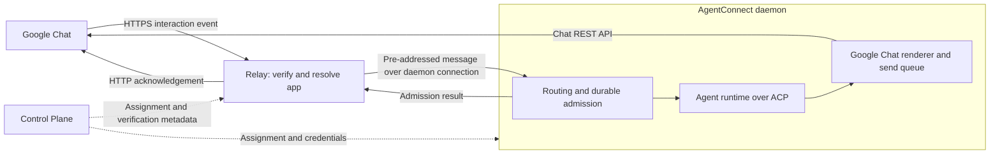

# Google Chat Integration Design

Status: proposed. Provider documentation checked on September 23, 2026; no live
Google Chat integration has been tested for this design.

Related: [issue #2262](https://github.com/agentconnect-md/agentconnect/issues/2262),
[platform modules](integration-plugin-architecture.md),
[architecture](architecture.md), and [product conventions](../product-conventions.md).

## 1. Decision and scope

Add a native `googlechat` platform. One operator-owned Google Chat app serves one
AgentConnect agent across its DMs and Spaces. Google sends HTTPS interaction
callbacks to the existing relay, which verifies and forwards them to the owning
daemon. The daemon sends replies through the Google Chat REST API. This follows
the existing Slack HTTP ingress pattern.

Use HTTPS relay ingress for the first version. Google Cloud Pub/Sub is an
alternative for installations without a public relay, not a prerequisite or a
second transport to implement in the initial contribution.

Google Chat integration does not depend on deciding the external-adapter protocol
proposed in #2262. It uses the current first-party module contracts; external
adapters remain a separate discussion.

| Capability       | First version                                                                                              |
| ---------------- | ---------------------------------------------------------------------------------------------------------- |
| Installation     | Operator configures a Chat app's HTTPS endpoint and service account; Console assigns it to one agent.      |
| Conversations    | Ordinary text in a 1:1 DM; explicit app mentions in a named Space, with replies in the originating thread. |
| Output           | Text, supported Markdown, coalesced message edits, and final replies.                                      |
| Session behavior | Existing conversation gates, session modes, steering, queuing, and text control commands.                  |
| Approvals        | Existing Console approval queue for authorized agent editors; no Google Chat approval buttons.             |
| Context          | Messages delivered to this app and the daemon's retained session history.                                  |

Ambient Space history, unmentioned thread follow-ups, group DMs, attachments,
cards, dialogs, app-home surfaces, Google-native commands, shared bots, Google
identity linking, and synchronization of Google membership into Console session
permissions are outside the first version. Interactive elicitation requires a
separate collectable response surface; unsupported requests must fail explicitly,
never invent an answer or approval.

Google Chat exists for both personal and Workspace accounts. Developing and
configuring this Chat app follows Google's Workspace prerequisites; the initial
setup targets an organization's own app. Public Marketplace distribution and
installation by personal accounts are separate rollout work, not a second chat
transport. See Google's [account comparison](https://support.google.com/chat/answer/9291345?hl=en),
[configuration requirements](https://developers.google.com/workspace/chat/configure-chat-api),
and [testing visibility](https://developers.google.com/workspace/chat/test-interactive-features).

## 2. Transport and ownership

All event payloads, transcripts, output, and ACP traffic stay on the data plane.
The Control Plane stores installation metadata and encrypted credentials and
projects configuration to the assigned daemon. The relay forwards content without
persisting it. Existing authorized, bounded Console reads may proxy daemon content
without persisting it in the Control Plane.

Add a Google Chat `RelayPlatformIngressPlugin` using the existing route,
assignment, verification, arbitration, and relay-to-daemon contracts. Reply text
does not return through the Control Plane or require relay-side Chat credentials.
The daemon can remain behind NAT because it already opens its relay connection.
Google calls this a Chat app HTTP endpoint; its separate incoming-webhook feature
only posts into Chat and is insufficient for receiving user interactions. See
Google's [connection architecture](https://developers.google.com/workspace/chat/structure).

Keep relay assignments and daemon output bound to the current app, integration,
agent placement, and credential generation. Reassignment uses the existing routing
and duty-holder fences. Revocation removes the relay's verification/demux entry
and prevents stale callbacks or delayed sends from reaching a replacement app.
Credential replacement drains old output connections using existing egress leases.

### Verify the app before routing

Use one module-owned HTTPS route with Google's **Project Number** authentication
audience. A decoded token audience is only a candidate lookup key. Before any
discovery or forwarding, verify the signature using Google's published Chat
certificates, the Chat issuer, token validity, and the exact assigned project
number. Reject failed verification with 401 and keep certificate refresh bounded.
Do not use an unverified body field, header, or URL parameter as an authority.

Google also supports URL-audience OIDC tokens. Project-number verification makes
the intended app explicit on a shared relay endpoint. Google documents both modes
in [request verification](https://developers.google.com/workspace/chat/verify-requests-from-chat).
Bind the verified project number to the installed bot, then apply
[ingress tenant fencing](ingress-tenant-fence.md). The token proves the Google app
context; it does not grant the message sender AgentConnect editor privileges.

## 3. Installation, credentials, and readiness

### Credential scope and setup experience

Credentials belong to the Google Chat app, independently of its HTTP/Pub/Sub
transport or the number of relay and daemon instances. Google requires a separate
Cloud project for each Chat app. Under this design's one-bot/one-agent model,
distinct bot identities therefore need distinct app/project configurations.
An operator can preconfigure a dedicated app for an agent; this changes who
performs setup, not the Google identity or the need to create that app first.
See Google's [per-app project requirement](https://developers.google.com/workspace/chat/configure-chat-api).

The initial experience is guided setup, not one-click app creation. Slack offers
both manifest-prefilled creation links and `apps.manifest.create`, which our
[Slack install flow](slack-install-smoothing.md) uses. The Google configuration
documentation checked for this design does not establish an equivalent public
creation link or API. Do not promise automatic provisioning based on the existence
of Google Workspace add-on manifests: those still require Chat API configuration
and use a different app model. See [Slack manifests](https://docs.slack.dev/app-manifests/configuring-apps-with-app-manifests/)
and [Google add-on configuration](https://developers.google.com/workspace/marketplace/enable-configure-sdk).

The wizard should present these concrete steps:

1. Confirm a suitable Workspace account and permission to configure the app and
   use the selected service-account credential method.
2. Complete Google's Cloud project, API, and configuration prerequisites.
3. Copy the generated app information, HTTPS callback, and audience setting into
   Google Cloud Console; configure who can find and use the app.
4. Create the service account, provide its credential through the secret form,
   and validate it. Show an actionable setup error if organization policy prevents
   creating a key; do not imply that ordinary Google sign-in supplies an app key.
5. Add the configured app in Google Chat, then send a DM or Space mention to test
   the complete path.

Google documents organization-level [key-creation constraints](https://docs.cloud.google.com/iam/docs/best-practices-for-managing-service-account-keys#use_organization_policy_constraints_to_limit_which_projects_can_create_service_account_keys).
Account and credential readiness therefore belong at the start of setup.

Adding an already available app through Chat or Marketplace is a short user flow,
but it installs that existing identity; it does not create a separate bot for the
user. Organization-only testing does not require public Marketplace publication.
Publishing to users outside the Workspace organization has additional review and
distribution requirements. See [testing visibility](https://developers.google.com/workspace/chat/test-interactive-features),
[adding an app](https://support.google.com/chat/answer/7655820?hl=en), and
[Marketplace publication](https://developers.google.com/workspace/marketplace/how-to-publish).

### Configuration and validation

The Console wizard collects credentials and shows the derived installation
metadata through the existing integration and secret APIs:

| Value                           | Storage and meaning                                                                                           |
| ------------------------------- | ------------------------------------------------------------------------------------------------------------- |
| Google Cloud project ID         | Non-secret app identity in platform configuration; this is not a Workspace tenant ID.                         |
| Verified project number         | Canonical numeric app identity and expected token audience; resolve and verify against the declared project.  |
| HTTPS callback URL              | Generated from the configured relay origin and the Google Chat module route; copy into Google's app settings. |
| Service-account key JSON        | Write-only credential in the existing encrypted bot secret store.                                             |
| Verified Chat app user identity | Provider identity metadata for mention matching and bot attribution; obtain from Google, not a display name.  |

Keep the app and service account in one project for the first version. Configure
Chat API interaction events with an HTTPS endpoint and **Project Number** audience,
leaving the Workspace add-on option, native commands, and link previews disabled.
Enable DMs and joining Spaces. Follow Google's API and visibility requirements;
AgentConnect does not provision cloud resources. No Pub/Sub API, topic,
subscription, or Pub/Sub IAM grant is required for this path.

Request `chat.bot` for asynchronous Chat API calls. Do not request user
impersonation or domain-wide delegation. Validate the app project's canonical
identity and its relationship to the credential before creating the relay
assignment; user-entered project metadata alone must not claim another app.
The relay receives only public verification metadata, not the service-account
private key.

Accept only the supported service-account credential shape. Reject arbitrary
credential-provider configurations and endpoint overrides; use Google's fixed
auth and API endpoints. Secrets must not appear in API responses, browser state
after submission, telemetry, fixtures, or logs. Decrypted credentials travel only
through the existing authenticated spec projection to the assigned daemon.
Workload identity and ambient application-default credentials are future options.

Use the existing external app identity and uniqueness contract to prevent binding
the same app to multiple agents. Preserve the installation's transport scope
across key rotation; neither a private-key hash nor a callback attempt ID defines
a person's or session's identity. Changing the app project requires a new
installation. The app's Google `users/...` identity must be verified in the live
probe before mention matching is finalized; do not synthesize it from a project
ID or assume the service-account email is the bot user.

Validation checks credential structure, project identity, and a bounded Chat API
read with app authentication. It must not send a test message from the Control
Plane. A saved configuration is not proof of working ingress. Combine relay
assignment and daemon readiness, distinguish authentication and connectivity
failures, and provide an explicit DM/mention test to verify the complete round
trip. A Google credential passing validation does not prove the operator copied
the endpoint and audience settings correctly.

### Operating cost

The HTTPS design has no Pub/Sub charge and reuses existing relay hosting. Relay
traffic and capacity, Workspace licensing, daemon hosting, and model usage remain
separate costs. It does not require hosting the callback on Google Cloud; the
Google Cloud project still configures the Chat app and its credentials.

## 4. Ingress, routing, and durable acknowledgement

### Event coverage and normalization

Consume Chat interaction `Event` JSON from the verified HTTPS callback, not the
CloudEvent schema used by the separate Google Workspace Events API. Google's
[`EventType` reference](https://developers.google.com/workspace/chat/api/reference/rest/v1/EventType)
documents `MESSAGE` for DMs and app invocations in Spaces. The first version
requires a fresh app mention on each Space input, including thread replies. It
does not advertise access to all Space messages.

Normalize in the pure message package. The verified relay assignment supplies the
installed app and integration scope; payloads cannot choose an AgentConnect organization,
integration, agent, or session. Validate that nested message and thread resource
names belong to the event's Space before routing or replying.

| Normalized field     | Google input / rule                                                                                                            |
| -------------------- | ------------------------------------------------------------------------------------------------------------------------------ |
| `platform`           | `googlechat`                                                                                                                   |
| `msgId`              | Stable Google message resource name, scoped by the installed app for admission.                                                |
| `channel`            | Full `space.name`; never its mutable display name.                                                                             |
| `thread`             | Full message thread resource for named Spaces; use the existing conversation session semantics for 1:1 DMs.                    |
| `sender.id`          | Google user resource name within the installation's stable transport scope.                                                    |
| `text`               | Message text with the receiving app's mention removed using structured mention data. Preserve other mentions and user content. |
| `mentionedBots`      | Verified receiving app identity when explicitly mentioned.                                                                     |
| `isDm` / `isGroupDm` | Explicit Space type; unknown types fail closed. Group DMs are not admitted in this version.                                    |
| Provider timestamp   | Message creation time, with event time as a validated fallback.                                                                |

The [message resource](https://developers.google.com/workspace/chat/api/reference/rest/v1/spaces.messages)
provides message, thread, sender, and mention coordinates. `argumentText` strips
all Chat app mentions, so it must not silently erase references to other bots.
Callback attempts share the Google message identity for deduplication; do not
generate a new delivery ID each time the relay receives the event.

Ignore app-authored messages. `ADDED_TO_SPACE` updates observed membership and can
also carry the user's triggering message when an @mention adds the app. Pass that
embedded message through the same normalization, gates, and durable admission as
`MESSAGE`; use the same app-scoped message receipt regardless of event type.
Only an add event without a message stops after the membership update. A repeated
membership observation must not skip admission of its still-unaccepted message.
Google documents this combined event in its
[request mapping](https://developers.google.com/workspace/add-ons/chat/convert#request-mapping-by-use-case).

`REMOVED_FROM_SPACE` updates membership and disables delivery there without
starting a turn or attempting a farewell message. Reconcile stale or conflicting
membership hints with bounded provider reads. Unsupported event types do not
activate an agent.

Run the existing discovery, conversation gate, trigger, command, session routing,
and Decision checks. Off stays silent, including for commands. Restricted agents
remain disabled in new conversations until an editor enables them. Reuse the
normal DM On/Off policy. In Spaces, the UI must explain that an every-message
setting cannot subscribe to traffic Google does not deliver; retain the common
trigger policy without promising ambient capture. Admitted follow-ups use normal
steering or queuing; `!queue` and `!cancel` keep their shared meanings.

### ACK is an admission boundary

Google allows 30 seconds for a synchronous response and supports later replies
through the Chat API. Failed HTTP deliveries might be retried a few times within
a few minutes, but retries are not guaranteed. Return an empty successful
interaction response after admission and send all visible output asynchronously.
Do not hold the request open for an agent turn. See
[interaction handling and retries](https://developers.google.com/workspace/chat/receive-respond-interactions).

The current `RelayIngressHost.forward` result means the relay handled the message;
it explicitly does not prove daemon admission. Extend that host seam to expose a
strict admission disposition, using the existing `rd/msg` / `rd/ack` path. A Google
module must not convert the old `accepted` result into an HTTP success by default.

| Disposition           | HTTP behavior                                                                         |
| --------------------- | ------------------------------------------------------------------------------------- |
| Accepted              | 200 with an empty response only after durable inbox admission and its receipt commit. |
| Duplicate             | 200 when a durable receipt proves prior acceptance; do not run the message again.     |
| Intentionally ignored | 200 after a completed gate or unsupported-event decision; no work is promised.        |
| Retryable or unknown  | 503 for unavailable daemon/storage, queue pressure, or an admission timeout.          |
| Invalid request       | 401 for failed authentication; 400 for malformed payloads; never route either.        |

Use a bounded admission deadline inside the provider and relay request budgets.
An HTTP timeout after a daemon commit is an unknown outcome, not a reason to
erase that work: a retry must find the same receipt. The relay does not gain a
durable message queue. If the daemon is unavailable beyond Google's retry window,
delivery can be lost; report this limitation rather than promise offline recovery.

Reuse the daemon's existing relay-ingress strategy, `requireDurable`, `receiptId`,
`onAdmission`, and atomic inbox-with-receipt machinery. Preserve routing and
authorization while distinguishing transient draining/placement failures from
intentional gates. The current generic ACK mapping is insufficient for that
distinction. Enable Google Chat only when both assigned hosts support the strict
admission contract; mixed versions must not silently downgrade it. Changes to any
shared wire fields must update and validate both consumers together.

Scope receipts to the installed app and stable Google message identity.
Concurrent copies elect one admission in the store transaction; receipts outlive
turn completion, steering, and inbox removal. Check them before an in-memory dedup
fast path can settle a delivery. A failed durable write remains retryable.

Commands require a completed, replay-safe disposition too. Bind cancellation to
its original operation/turn so a repeated callback cannot cancel later work.
Lifecycle updates are idempotent observations: use event kind, Space, actor, and
event time when no message resource exists, and confirm conflicting membership
hints through provider reads. Do not collapse all add/remove events for a Space.
For a message-bearing add event, the membership update alone is not acceptance:
wait for the embedded message's admission disposition before acknowledging it.

Set a documented receipt retention bound exceeding Google's retry horizon; keep
at least 24 hours for the HTTP path. Replays beyond the configured bound, loss of
the durable store, or migration to an independent store are outside duplicate
suppression guarantees. This is not exactly-once agent execution: interrupted
runtime recovery keeps the existing replay semantics.

## 5. Reply placement, rendering, and retries

For a named Space, create replies with the incoming `thread.name` and
`messageReplyOption=REPLY_MESSAGE_OR_FAIL`. If that thread is unavailable, surface
delivery failure instead of falling back to a new thread. DMs use the DM Space
without assuming named-Space thread options apply.

Use `spaces.messages.create` and app-owned `spaces.messages.patch`. The
[create API](https://developers.google.com/workspace/chat/api/reference/rest/v1/spaces.messages/create)
supports a custom `client-` message ID and a retry `requestId`. Derive stable output
IDs from the durable delivery and segment identity. Persist each create intent,
including its exact body and ID, before sending; record the returned resource name.
After an ambiguous response, retry that operation or reconcile the existing ID,
never allocate a fresh message ID. Do not reuse an identical-request ID with a
different body.

Integrate this small output record with daemon-owned delivery persistence; an
in-memory stream converger alone cannot recover a timed-out create after restart.
Keep stream revisions ordered so a late patch cannot overwrite final content.
Patch only owned messages with `updateMask=text`; keep `allowMissing` false so a
deleted message is not accidentally recreated. See the
[patch API](https://developers.google.com/workspace/chat/api/reference/rest/v1/spaces.messages/patch).

Set `markupSyntax: "MARKUP_SYNTAX_MARKDOWN"` on creates and render only supported
formatting, with readable fallbacks. This mode is documented in Google's
[formatting guide](https://developers.google.com/workspace/chat/format-messages)
and [release notes](https://developers.google.com/workspace/chat/release-notes).
Apply shared workspace-link rewriting and split at readable paragraph/code-block
boundaries. Budget the complete encoded message below Google's 32,000-byte limit,
including metadata and UTF-8 expansion.

One per-Space send queue covers local creates, edits, progress, and final replies
across threads and connections. Space message writes share a one-per-second quota;
project message writes also have a shared limit. See Google's
[quota documentation](https://developers.google.com/workspace/chat/limits).
Coalesce streaming text with a two-second minimum edit interval, preserve fairness
between threads, and let final output replace pending intermediate edits while
respecting the same queue. Handle 429s and transient failures with bounded backoff,
jitter, and retry hints. Other apps or daemons can still consume the shared quota.

Feedback is best effort after admission. Post no startup message, as on other
chat platforms; do not promise native typing indicators or reactions. Membership loss,
revoked credentials, missing threads, and deleted reply messages terminate or
suspend the affected delivery with an actionable status. Keep generated output in
the daemon transcript, subject to normal access rules; private DM output is not
automatically available to a Console administrator.

Attachments are explicitly unsupported, including attachment-only inputs. Report
that limitation without claiming to read the file. In particular, Google's
[upload endpoint](https://developers.google.com/workspace/chat/api/reference/rest/v1/media/upload)
requires user authentication; adding uploads is not simply another `chat.bot`
operation.

## 6. Identity, privacy, and approvals

Google app authentication proves the connection's app identity, not that a sender
is an AgentConnect editor. Never link users or grant privileges by matching email
addresses or display names. Shared text commands retain their current caller
authorization. Keep Console continuation disabled until Google identity and
authorization support is designed.

Follow [session visibility](session-visibility.md): DMs are private to the verified
originator, with no organization-owner bypass. Without a Google account link, the
private owner tuple has no matching human Console identity, so these transcripts
remain inaccessible there. Space sessions follow AgentConnect's normal
organization visibility; Google Space membership does not become a Console ACL.
Explain both consequences during setup, especially for restricted Google Spaces.

Permission requests remain in the existing Console queue authorized for agent
editors. That approval authority is separate from private transcript readership.
No Google message, card, or mention grants approval authority, and the absence of
a Chat approval UI must never select a permissive fallback. Verify this behavior
for private DM turns as part of the acceptance checks.

## 7. Implementation boundaries

| Area                    | Required contribution                                                                                                     |
| ----------------------- | ------------------------------------------------------------------------------------------------------------------------- |
| Protocol and message    | Register the known platform, conservative manifest values, and pure Google event normalization.                           |
| Relay platform module   | HTTPS route, project-audience verification, demux, normalization, membership reports, and strict admission responses.     |
| Daemon platform module  | Config schema, Chat REST connection/read port, relay ingress strategy, renderer, turn output, and lifecycle registration. |
| Relay/daemon admission  | Expose durable acceptance through the existing forwarding contracts, including commands and transient refusals.           |
| Daemon output           | Persist stable create intent/results and serialize Google sends through the platform output surface.                      |
| Control Plane provider  | Credential validation/storage, app identity, uniqueness, secret rotation, daemon spec, and relay assignment projection.   |
| Console platform module | Chat picker, setup wizard, connection diagnostics, conversation semantics, and explicit scope limitations.                |

Start with observed membership discovery and no bot-sender routing or multi-agent
sharing. Add manifest fields only when an actual pre-dispatch consumer requires
one. Use the existing host contracts and registries; changes to core must extend
a demonstrated missing contract member, not add Google-specific switches.

The current database stores platform IDs as strings and already provides platform
configuration and encrypted bot secrets. This design requires no new Control Plane
database table or Google credential columns. Known-platform writers, capability
reporting, API schemas, and registry consistency checks still need explicit
registration. Use the established four-host platform architecture. No feature
flag, separate relay service, public adapter protocol, or broad refactor is
required.

## 8. Pub/Sub alternative and cost

Google Cloud Pub/Sub can deliver the same interaction events through an outbound
pull connection when an installation has no public relay. It is Google's managed
service: the operator creates a topic and subscription, not a self-hosted broker.
This alternative adds cloud IAM, billing, subscriber lifecycle, and lease
management. It is deferred from the first HTTP contribution. See the
[Pub/Sub Chat quickstart](https://developers.google.com/workspace/chat/quickstart/pub-sub).

A future pull module would share normalization, daemon routing, and Chat REST
output. It must ACK after durable admission, use a dedicated subscription with one
active owning consumer, and retain receipts for the configured Pub/Sub retention
and replay window. Consumers on the same subscription compete; two transports
must not be active for one app during a cutover. Pub/Sub supports asynchronous
responses and does not support dialogs.

As checked on September 23, 2026, standard publish and delivery throughput share a
10 GiB monthly free allowance per billing account, then cost $40 per TiB.
Internet egress and retained messages can incur additional charges. Small
text-only workloads should cost little, but the allowance is shared and does not
guarantee a zero bill. These Pub/Sub charges do not apply to the selected HTTPS
path. See [Pub/Sub pricing](https://cloud.google.com/pubsub/pricing).

## 9. Validation and unresolved provider details

Before implementing the full module, run a small live probe with an operator-owned
test app. Confirm canonical project/credential binding, authoritative app-user
identity, signed HTTPS callbacks, DM and Space mention payloads, thread coordinates,
and app-authenticated create/patch with Markdown and stable IDs. Record anonymized
fixtures. Specifically test whether an unmentioned reply arrives, but keep it
outside the supported contract unless a
follow-up design deliberately expands event coverage.

The implementation must then demonstrate:

- Rejection of invalid signatures, expired tokens, wrong audiences, and spoofed
  body app IDs before any conversation discovery or forwarding.
- One admitted message despite concurrent callbacks, reconnect, restart, and late
  redelivery after completion; a failed durable write remains retryable.
- A message-bearing add event admits its first prompt once, including redelivery
  after membership was recorded; a message-less add starts no turn.
- Correct dispositions for ignored messages and queue overflow; durable receipts
  for steering and a redelivered cancellation after the original turn ends.
- No cross-app, cross-Space, or cross-thread routing; no turn while a conversation
  is Off or a restricted conversation is not enabled.
- Correct original-thread replies, Unicode/code-block splitting, ordered final
  patches, and recovery from an ambiguous create without a duplicate post.
- Bounded HTTP admission time, no success on transient failure, and recovery when
  a response is lost after commit; no claim of guaranteed Google HTTP retries.
- Bounded send queues and backoff under throttling; key rotation, removal, relay
  revocation, and assignment handover without stale delivery.
- Honest saved/connected/tested states, private DM visibility, authorized Console
  approvals, and explicit attachment/elicitation limitations.

Use focused contract and recovery tests around these boundaries plus the live
round trip. Do not add broad mock tests that merely restate the mapping table.
App identity discovery, exact thread behavior, and Markdown persistence across
patches remain provider-validation gates, not claims of completed support.
