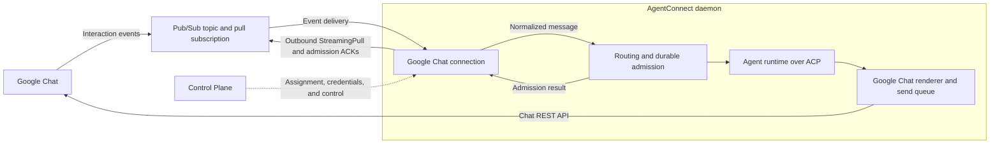

# Google Chat Integration Design

Status: proposed. Provider documentation checked on September 23, 2026; no live
Google Chat integration has been tested for this design.

Related: [issue #2262](https://github.com/agentconnect-md/agentconnect/issues/2262),
[platform modules](integration-plugin-architecture.md),
[architecture](architecture.md), and [product conventions](../product-conventions.md).

## 1. Decision and scope

Add a native `googlechat` platform. One operator-owned Google Chat app serves one
AgentConnect agent across its DMs and Spaces. The daemon receives interaction
events through a Google Cloud Pub/Sub pull subscription and sends replies through
the Google Chat REST API. This follows the same broad pattern as a Slack bot with
Socket Mode: an outbound event connection plus a separate API for replies.

Google Chat integration does not depend on deciding the external-adapter protocol
proposed in #2262. It uses the current first-party module contracts; external
adapters remain a separate discussion.

| Capability       | First version                                                                                               |
| ---------------- | ----------------------------------------------------------------------------------------------------------- |
| Installation     | Operator configures a Chat app, Pub/Sub subscription, and service account; Console assigns it to one agent. |
| Conversations    | Ordinary text in a 1:1 DM; explicit app mentions in a named Space, with replies in the originating thread.  |
| Output           | Text, supported Markdown, coalesced message edits, and final replies.                                       |
| Session behavior | Existing conversation gates, session modes, steering, queuing, and text control commands.                   |
| Approvals        | Existing Console approval queue for authorized agent editors; no Google Chat approval buttons.              |
| Context          | Messages delivered to this app and the daemon's retained session history.                                   |

Ambient Space history, unmentioned thread follow-ups, group DMs, attachments,
cards, dialogs, app-home surfaces, Google-native commands, shared bots, Google
identity linking, and synchronization of Google membership into Console session
permissions are outside the first version. Interactive elicitation requires a
separate collectable response surface; unsupported requests must fail explicitly,
never invent an answer or approval.

Google Chat exists for both personal and Workspace accounts. Developing and
configuring this Chat app follows Google's Workspace prerequisites; the initial
setup targets an organization's own app. Public Marketplace distribution and
installation by personal accounts are separate rollout work, not a second chat
transport. See Google's [account comparison](https://support.google.com/chat/answer/9291345?hl=en),
[configuration requirements](https://developers.google.com/workspace/chat/configure-chat-api),
and [testing visibility](https://developers.google.com/workspace/chat/test-interactive-features).

## 2. Transport and ownership

All event payloads, transcripts, output, and ACP traffic stay on the data plane.
The Control Plane stores installation metadata and encrypted credentials and
projects configuration to the assigned daemon. Existing authorized, bounded
Console reads may proxy daemon content without persisting it. This transport
needs no relay module, public callback URL, or new `rd/*` frame.

Use the supported Pub/Sub client library for StreamingPull, reconnection, flow
control, and acknowledgement lease extension; use app authentication for Chat
REST calls. The [Pub/Sub Chat quickstart](https://developers.google.com/workspace/chat/quickstart/pub-sub)
supports asynchronous replies and excludes dialogs. Its endpoint-specific
limitations govern this design; synchronous HTTP response examples do not apply.

Pub/Sub is Google's managed service: operators create cloud resources, not a
self-hosted message broker. It adds Google Cloud configuration and usage billing.
An HTTPS interaction endpoint is a viable alternative when a stable public
callback is already available; it would need a relay ingress module and request
verification. Prefer pull for this version so a daemon can operate behind NAT
without another public service. See Google's [connection architecture](https://developers.google.com/workspace/chat/structure).

Only the daemon currently assigned to serve the agent starts the subscriber.
Register its routing binding before enabling delivery. Assignment loss or removal
stops intake, releases unadmitted messages for redelivery, and fences output with
the existing connection generation and egress leases. Credential replacement
drains the old connection before releasing it.

Consumers on one pull subscription compete for messages. Sharing it with another
application instance would silently split traffic. Setup must require a dedicated
subscription and warn operators to stop an older consumer before moving an app
between independent AgentConnect installations. The local registry cannot enforce
ownership in another installation.

## 3. Installation, credentials, and readiness

The Console wizard guides the operator through Google's setup, then collects
these values through the existing integration and secret APIs:

| Value                           | Storage and meaning                                                                                          |
| ------------------------------- | ------------------------------------------------------------------------------------------------------------ |
| Google Cloud project ID         | Non-secret app identity in platform configuration; this is not a Workspace tenant ID.                        |
| Full subscription resource name | Non-secret platform configuration; validate its project and attached topic.                                  |
| Service-account key JSON        | Write-only credential in the existing encrypted bot secret store.                                            |
| Verified Chat app user identity | Provider identity metadata for mention matching and bot attribution; obtain from Google, not a display name. |

Keep the app, topic, subscription, and service account in one project for the first
version. Configure Chat API interaction events with a Pub/Sub endpoint, leaving
the Workspace add-on option, native commands, and link previews disabled. Enable
DMs and joining Spaces. Follow Google's prerequisite API, billing, and visibility
steps; AgentConnect does not provision cloud resources.

Grant Google's documented Chat publishing principal access to the dedicated topic.
Grant the service account subscription consumption and the metadata-read
permission needed to validate that subscription. Request `chat.bot` for Chat API
calls; do not request user impersonation or domain-wide delegation. Topic IAM is
the ingress trust boundary: any other publisher could inject events, so event
fields alone are not proof of Google origin.

Accept only the supported service-account credential shape. Reject arbitrary
credential-provider configurations and endpoint overrides; use Google's fixed
auth and API endpoints. Secrets must not appear in API responses, browser state
after submission, telemetry, fixtures, or logs. Decrypted credentials travel only
through the existing authenticated spec projection to the assigned daemon.
Workload identity and ambient application-default credentials are future options.

Use the existing external app identity and uniqueness contract to prevent binding
the same app to multiple agents. Preserve the installation's transport scope
across key rotation; neither a private-key hash nor a subscription delivery ID
defines a person's or session's identity. Changing the app project requires a new
installation. The app's Google `users/...` identity must be verified in the live
probe before mention matching is finalized; do not synthesize it from a project
ID or assume the service-account email is the bot user.

Validation checks credential structure, subscription metadata, and a bounded Chat
API read with app authentication. It must not consume messages or send a test
message from the Control Plane. A saved configuration is not proof of a working
subscriber. Report connection readiness from the daemon, distinguish permission,
subscription, and connectivity failures, and provide an explicit DM/mention test
to verify the complete round trip.

### Operating cost

The operator's Google Cloud billing account pays for Pub/Sub. As checked on
September 23, 2026, standard publishing and delivery share a 10 GiB monthly free
allowance per billing account; additional throughput costs $40 per TiB. Internet
egress to a daemon outside Google Cloud and retained messages can incur separate
charges. The free allowance is not dedicated to this integration. See
[Pub/Sub pricing](https://cloud.google.com/pubsub/pricing).

For small text-only workloads, messaging charges should be low; this is an
estimate, not a zero-cost guarantee. Setup should expose the billing requirement,
link pricing, and document retention defaults. Do not enable acknowledged-message
retention or snapshots by default. Workspace licensing, daemon hosting, and model
usage remain separate costs.

## 4. Ingress, routing, and durable acknowledgement

### Event coverage and normalization

Consume Chat interaction `Event` JSON from the Pub/Sub message data, not the
CloudEvent schema used by the separate Google Workspace Events API. Google's
[`EventType` reference](https://developers.google.com/workspace/chat/api/reference/rest/v1/EventType)
documents `MESSAGE` for DMs and app invocations in Spaces. The first version
requires a fresh app mention on each Space input, including thread replies. It
does not advertise access to all Space messages.

Normalize in the pure message package. The connection supplies the installed app
and integration scope; payloads cannot choose an AgentConnect organization,
integration, agent, or session. Validate that nested message and thread resource
names belong to the event's Space before routing or replying.

| Normalized field     | Google input / rule                                                                                                            |
| -------------------- | ------------------------------------------------------------------------------------------------------------------------------ |
| `platform`           | `googlechat`                                                                                                                   |
| `msgId`              | Stable Google message resource name, scoped by the installed app for admission.                                                |
| `channel`            | Full `space.name`; never its mutable display name.                                                                             |
| `thread`             | Full message thread resource for named Spaces; use the existing conversation session semantics for 1:1 DMs.                    |
| `sender.id`          | Google user resource name within the installation's stable transport scope.                                                    |
| `text`               | Message text with the receiving app's mention removed using structured mention data. Preserve other mentions and user content. |
| `mentionedBots`      | Verified receiving app identity when explicitly mentioned.                                                                     |
| `isDm` / `isGroupDm` | Explicit Space type; unknown types fail closed. Group DMs are not admitted in this version.                                    |
| Provider timestamp   | Message creation time, with event time as a validated fallback.                                                                |

The [message resource](https://developers.google.com/workspace/chat/api/reference/rest/v1/spaces.messages)
provides message, thread, sender, and mention coordinates. `argumentText` strips
all Chat app mentions, so it must not silently erase references to other bots.
Pub/Sub's message ID remains useful for transport diagnostics but does not replace
the Google message identity for deduplication.

Ignore app-authored messages. `ADDED_TO_SPACE` and `REMOVED_FROM_SPACE` update
observed conversation membership without starting an agent turn; removal disables
delivery there and does not attempt a farewell message. Reconcile membership hints
with bounded provider reads when stale or conflicting. Unsupported event types do
not activate an agent.

Run the existing discovery, conversation gate, trigger, command, session routing,
and Decision checks. Off stays silent, including for commands. Restricted agents
remain disabled in new conversations until an editor enables them. Reuse the
normal DM On/Off policy. In Spaces, the UI must explain that an every-message
setting cannot subscribe to traffic Google does not deliver; retain the common
trigger policy without promising ambient capture. Admitted follow-ups use normal
steering or queuing; `!queue` and `!cancel` keep their shared meanings.

### ACK is an admission boundary

The current direct-platform `onInbound` callback is fire-and-forget, and its
in-memory seen-message set is not durable deduplication. Google Chat needs a small
awaitable host admission seam through the same routing path. It must expose a
settled disposition rather than ACK immediately or wait for the agent's answer.

| Disposition                      | Subscriber action                                                                                                                   |
| -------------------------------- | ----------------------------------------------------------------------------------------------------------------------------------- |
| Accepted                         | ACK only after durable inbox admission and its receipt have committed.                                                              |
| Duplicate                        | ACK when the durable receipt proves prior admission or a terminal disposition.                                                      |
| Intentionally ignored            | ACK after the routing/lifecycle decision completes; retain a terminal receipt for valid events so retry cannot change the decision. |
| Retryable failure                | Do not ACK; release for redelivery with backoff. This includes unavailable storage, queue pressure, and assignment transitions.     |
| Malformed or unsupported payload | Drop with a bounded diagnostic and ACK; never repeatedly feed it to the agent.                                                      |

Reuse the daemon's existing `requireDurable`, `receiptId`, `onAdmission`, and
atomic inbox-with-receipt machinery. Thread this requirement through direct
ingress without bypassing authorization or changing existing platform defaults.
Check durable receipts before allowing the in-memory deduplication fast path to
settle a delivery, and ensure a failed attempt can retry. The receipt must survive
turn completion, steering, and inbox removal. Commands and membership events need
their own completed disposition; a callback returning `void` is not one.

Scope receipt keys to the installed app and stable message identity; include the
event kind for lifecycle events. When a lifecycle event has no message resource,
use its scoped Pub/Sub message ID; repeated add/remove events must not collapse
into a single lifetime event. Concurrent copies elect one admission in the store
transaction. Admission covers queued and steered messages as well as new
turns. An accepted control command must be tied to its original operation/turn so
redelivery of `!cancel` cannot cancel later work.

Bound outstanding pulls and admission time. Let the SDK extend leases only while
admission is pending, as described in [Pub/Sub lease management](https://docs.cloud.google.com/pubsub/docs/lease-management).
Receipts must outlive the configured message retention and permitted replay
window; setup and retention configuration must agree on that bound. Replays beyond
it, loss of the durable store, or migration to an independent store are not covered
by the duplicate-admission guarantee. This is not exactly-once agent execution:
recovery of an interrupted runtime retains the existing replay semantics.

## 5. Reply placement, rendering, and retries

For a named Space, create replies with the incoming `thread.name` and
`messageReplyOption=REPLY_MESSAGE_OR_FAIL`. If that thread is unavailable, surface
delivery failure instead of falling back to a new thread. DMs use the DM Space
without assuming named-Space thread options apply.

Use `spaces.messages.create` and app-owned `spaces.messages.patch`. The
[create API](https://developers.google.com/workspace/chat/api/reference/rest/v1/spaces.messages/create)
supports a custom `client-` message ID and a retry `requestId`. Derive stable output
IDs from the durable delivery and segment identity. Persist each create intent,
including its exact body and ID, before sending; record the returned resource name.
After an ambiguous response, retry that operation or reconcile the existing ID,
never allocate a fresh message ID. Do not reuse an identical-request ID with a
different body.

Integrate this small output record with daemon-owned delivery persistence; an
in-memory stream converger alone cannot recover a timed-out create after restart.
Keep stream revisions ordered so a late patch cannot overwrite final content.
Patch only owned messages with `updateMask=text`; keep `allowMissing` false so a
deleted message is not accidentally recreated. See the
[patch API](https://developers.google.com/workspace/chat/api/reference/rest/v1/spaces.messages/patch).

Set `markupSyntax: "MARKUP_SYNTAX_MARKDOWN"` on creates and render only supported
formatting, with readable fallbacks. This mode is documented in Google's
[formatting guide](https://developers.google.com/workspace/chat/format-messages)
and [release notes](https://developers.google.com/workspace/chat/release-notes).
Apply shared workspace-link rewriting and split at readable paragraph/code-block
boundaries. Budget the complete encoded message below Google's 32,000-byte limit,
including metadata and UTF-8 expansion.

One per-Space send queue covers local creates, edits, progress, and final replies
across threads and connections. Space message writes share a one-per-second quota;
project message writes also have a shared limit. See Google's
[quota documentation](https://developers.google.com/workspace/chat/limits).
Coalesce streaming text with a two-second minimum edit interval, preserve fairness
between threads, and let final output replace pending intermediate edits while
respecting the same queue. Handle 429s and transient failures with bounded backoff,
jitter, and retry hints. Other apps or daemons can still consume the shared quota.

Feedback is best effort after admission. Use the normal startup notice when
needed; do not promise native typing indicators or reactions. Membership loss,
revoked credentials, missing threads, and deleted reply messages terminate or
suspend the affected delivery with an actionable status. Keep generated output in
the daemon transcript, subject to normal access rules; private DM output is not
automatically available to a Console administrator.

Attachments are explicitly unsupported, including attachment-only inputs. Report
that limitation without claiming to read the file. In particular, Google's
[upload endpoint](https://developers.google.com/workspace/chat/api/reference/rest/v1/media/upload)
requires user authentication; adding uploads is not simply another `chat.bot`
operation.

## 6. Identity, privacy, and approvals

Google app authentication proves the connection's app identity, not that a sender
is an AgentConnect editor. Never link users or grant privileges by matching email
addresses or display names. Shared text commands retain their current caller
authorization. Keep Console continuation disabled until Google identity and
authorization support is designed.

Follow [session visibility](session-visibility.md): DMs are private to the verified
originator, with no organization-owner bypass. Without a Google account link, the
private owner tuple has no matching human Console identity, so these transcripts
remain inaccessible there. Space sessions follow AgentConnect's normal
organization visibility; Google Space membership does not become a Console ACL.
Explain both consequences during setup, especially for restricted Google Spaces.

Permission requests remain in the existing Console queue authorized for agent
editors. That approval authority is separate from private transcript readership.
No Google message, card, or mention grants approval authority, and the absence of
a Chat approval UI must never select a permissive fallback. Verify this behavior
for private DM turns as part of the acceptance checks.

## 7. Implementation boundaries

| Area                    | Required contribution                                                                                                   |
| ----------------------- | ----------------------------------------------------------------------------------------------------------------------- |
| Protocol and message    | Register the known platform, conservative manifest values, and pure Google event normalization.                         |
| Daemon platform module  | Config schema, Pub/Sub connection, read port, renderer, turn output, and connection lifecycle registration.             |
| Daemon admission        | Awaitable direct-ingress disposition backed by existing durable admission and receipts, including command dispositions. |
| Daemon output           | Persist stable create intent/results and serialize Google sends through the platform output surface.                    |
| Control Plane provider  | Credential validation/storage, app identity, uniqueness, secret rotation, and daemon spec projection.                   |
| Console platform module | Chat picker, setup wizard, connection diagnostics, conversation semantics, and explicit scope limitations.              |

Start with observed membership discovery and no bot-sender routing or multi-agent
sharing. Add manifest fields only when an actual pre-dispatch consumer requires
one. Use the existing host contracts and registries; changes to core must extend
a demonstrated missing contract member, not add Google-specific switches.

The current database stores platform IDs as strings and already provides platform
configuration and encrypted bot secrets. This design requires no new Control Plane
database table or Google credential columns. Known-platform writers, capability
reporting, API schemas, and registry consistency checks still need explicit
registration. No feature flag, relay implementation, new public adapter protocol,
or broad refactor is required.

## 8. Validation and unresolved provider details

Before implementing the full module, run a small live probe with an operator-owned
test app. Confirm DM and Space mention payloads, authoritative app-user identity,
thread coordinates, Pub/Sub redelivery, and app-authenticated create/patch with
Markdown and stable IDs. Record anonymized fixtures. Specifically test whether an
unmentioned reply arrives, but keep it outside the supported contract unless a
follow-up design deliberately expands event coverage.

The implementation must then demonstrate:

- One admitted message despite concurrent delivery, reconnect, restart, and late
  redelivery after completion; a failed durable write remains retryable.
- Receipt correctness for ignored messages, steering, queue overflow, and a
  redelivered cancellation after the original turn ends.
- No cross-app, cross-Space, or cross-thread routing; no turn while a conversation
  is Off or a restricted conversation is not enabled.
- Correct original-thread replies, Unicode/code-block splitting, ordered final
  patches, and recovery from an ambiguous create without a duplicate post.
- Bounded queues and backoff under throttling; clean subscriber shutdown, key
  rotation, removal, and assignment handover.
- Honest saved/connected/tested states, private DM visibility, authorized Console
  approvals, and explicit attachment/elicitation limitations.

Use focused contract and recovery tests around these boundaries plus the live
round trip. Do not add broad mock tests that merely restate the mapping table.
App identity discovery, exact thread behavior, and Markdown persistence across
patches remain provider-validation gates, not claims of completed support.
