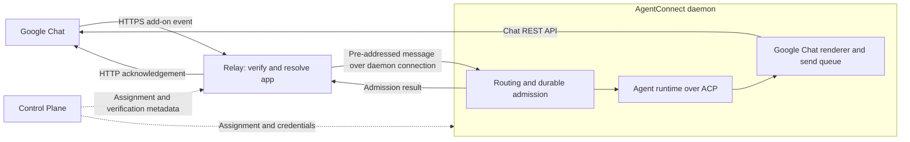

# Google Chat Integration Design

Status: **implemented** — the four platform modules, the Setup Server card, and the
chart route are merged, and §9 was verified end to end against a live Chat app on
September 27, 2026 (DM and Space mention, threaded replies, streamed edits, the
Markdown subset, and the console views). AgentConnect serves a Chat app only as a
Google Workspace add-on (§11), verified live against a converted app on September
28, 2026 (§11.7); the Chat API app form was removed before any release. Open
follow-ups: several agents sharing one app, and a Marketplace listing for more than
one Workspace customer.

The console offers Google Chat only where the deployment turns on the `google-chat`
feature flag (the chart's `features.googleChat`, off by default); an existing Google
Chat bot keeps its Bots tab, and the Control Plane, relay, and daemon serve it either
way.

Related: [issue #2262](https://github.com/agentconnect-md/agentconnect/issues/2262),
[platform modules](integration-plugin-architecture.md),
[architecture](architecture.md), and [product conventions](../product-conventions.md).

## 1. Decision and scope

Add a native `googlechat` platform. One operator-owned Google Chat app serves one
AgentConnect agent across its DMs and Spaces. The app is built as a Google
Workspace add-on (§11), so Google sends its HTTPS event callbacks to the existing
relay, which verifies and forwards them to the owning daemon. The daemon sends
replies through the Google Chat REST API. This follows the existing Slack HTTP
ingress pattern.

Use HTTPS relay ingress for the first version. Google Cloud Pub/Sub is an
alternative for installations without a public relay, not a prerequisite or a
second transport to implement in the initial contribution.

Google Chat integration does not depend on deciding the external-adapter protocol
proposed in #2262. It uses the current first-party module contracts; external
adapters remain a separate discussion.

| Capability       | First version                                                                                                |
| ---------------- | ------------------------------------------------------------------------------------------------------------ |
| Installation     | Deployment-owned app in Setup Server that each Workspace organization claims, or a per-agent app of its own. |
| Conversations    | Ordinary text in a 1:1 DM; explicit app mentions in a named Space, with replies in the originating thread.   |
| Output           | Text, supported Markdown, coalesced message edits, and final replies.                                        |
| Session behavior | Existing conversation gates, session modes, steering, queuing, and text control commands.                    |
| Elicitation      | Agent questions as an in-thread card of buttons or form inputs, settled in place (§5).                       |
| Approvals        | Existing Console approval queue; a chat card decides only where the agent allows it (§6).                    |
| Context          | Messages delivered to this app and the daemon's retained session history.                                    |

Ambient Space history, unmentioned thread follow-ups, group DMs, attachments,
cards other than the welcome and elicitation cards, dialogs, app-home surfaces,
Google-native commands, shared bots, Google identity linking, and synchronization
of Google membership into Console session permissions are outside the first
version. An elicitation the card cannot render (URL mode, an over-long option
list) fails explicitly and never invents an answer or approval. Serving many Workspace customers from one
published app, and the identity link that comes with it, are designed in §10.

Google Chat exists for both personal and Workspace accounts. Developing and
configuring this Chat app follows Google's Workspace prerequisites; the initial
setup targets an organization's own app. Public Marketplace distribution and
installation by personal accounts are separate rollout work, not a second chat
transport. See Google's [account comparison](https://support.google.com/chat/answer/9291345?hl=en),
[configuration requirements](https://developers.google.com/workspace/chat/configure-chat-api),
and [testing visibility](https://developers.google.com/workspace/chat/test-interactive-features).

## 2. Transport and ownership

```mermaid
flowchart LR
    G[Google Chat] -->|HTTPS add-on event| L[Relay: verify and resolve app]
    L -->|Pre-addressed message over daemon connection| R
    subgraph D[AgentConnect daemon]
        R[Routing and durable admission]
        R --> A[Agent runtime over ACP]
        A --> O[Google Chat renderer and send queue]
    end
    R -->|Admission result| L
    L -->|HTTP acknowledgement| G
    O -->|Chat REST API| G
    C[Control Plane] -.->|Assignment and verification metadata| L
    C -.->|Assignment and credentials| D
```

All event payloads, transcripts, output, and ACP traffic stay on the data plane.
The Control Plane stores installation metadata and encrypted credentials and
projects configuration to the assigned daemon. The relay forwards content without
persisting it. Existing authorized, bounded Console reads may proxy daemon content
without persisting it in the Control Plane.

Add a Google Chat `RelayPlatformIngressPlugin` using the existing route,
assignment, verification, arbitration, and relay-to-daemon contracts. Reply text
does not return through the Control Plane or require relay-side Chat credentials.
The daemon can remain behind NAT because it already opens its relay connection.
Google calls this a Chat app HTTP endpoint; its separate incoming-webhook feature
only posts into Chat and is insufficient for receiving user interactions. See
Google's [connection architecture](https://developers.google.com/workspace/chat/structure).

Keep relay assignments and daemon output bound to the current app, integration,
agent placement, and credential generation. Reassignment uses the existing routing
and duty-holder fences. Revocation removes the relay's verification/demux entry
and prevents stale callbacks or delayed sends from reaching a replacement app.
Credential replacement drains old output connections using existing egress leases.

### Verify the app before routing

Use one module-owned HTTPS route mounted at `GOOGLE_CHAT_EVENTS_PATH`
(`/googlechat/events`), a constant the protocol package owns so the Setup Server's
published endpoint URL and the relay's route cannot drift. The chart's relay
`HTTPRoute` lists every public relay path explicitly, so it carries this one too;
without it the gateway answers 404 before a callback reaches the relay. Google
posts each event with `Authorization: Bearer <Google ID token>`: RS256 with a
`kid` header, a Google issuer, the configured endpoint URL as its audience, the
add-on's service account as its verified email, and a one-hour lifetime (§11.2).
The project number in that email is only a candidate lookup key. Before any
discovery or forwarding, the relay verifies with `jose` (`importJWK` +
`jwtVerify`): the key whose `kid` matches in Google's OIDC JWKS, RS256 only, a
Google issuer, the relay's own events URL as the audience, a verified email naming
the bot's exact project number, and `exp`/`iat` with a minute of clock tolerance.
One process-wide key cache serves every Google Chat bot: it honors the response's
`max-age` (clamped between one minute and a day; one hour without one), keeps the
last good set when a refresh fails, refetches for an unknown `kid` at most once
every five minutes, and holds at most 16 keys. Any failure is a 401 and nothing is
routed. Do not use an unverified body field, header, or URL parameter as an
authority. Because the proof is a fetched key set, this is the first plugin whose
`verify` returns a promise; the relay seam awaits either form.

The audience is the endpoint URL, so the project number the service account names
is what makes the intended app explicit on a shared relay endpoint. See Google's
[request verification](https://developers.google.com/workspace/chat/verify-requests-from-chat).
Bind the verified project number to the installed bot, then apply
[ingress tenant fencing](ingress-tenant-fence.md). The token proves the Google app
context; it does not grant the message sender AgentConnect editor privileges.

## 3. Installation, credentials, and readiness

### Credential scope and setup experience

Credentials belong to the Google Chat app, independently of its HTTP/Pub/Sub
transport or the number of relay and daemon instances. Google requires a separate
Cloud project for each Chat app. Under this design's one-bot/one-agent model,
distinct bot identities therefore need distinct app/project configurations.
An operator can preconfigure a dedicated app for an agent; this changes who
performs setup, not the Google identity or the need to create that app first.
See Google's [per-app project requirement](https://developers.google.com/workspace/chat/configure-chat-api).

Two credential holders exist, mirroring Slack. The deployment-owned app is
configured once in the Setup Server, which keeps its project ID and project number
in the typed deployment document and its key as a write-only deployment secret;
the Control Plane receives them as `GOOGLE_CHAT_PLATFORM_PROJECT_ID`,
`GOOGLE_CHAT_PLATFORM_PROJECT_NUMBER`, and
`GOOGLE_CHAT_PLATFORM_SERVICE_ACCOUNT_KEY`. That app serves every Google
Workspace organization: each one connects itself from Google Chat by claiming
its customer (§10), and no route installs the app on an agent. An organization
that wants an app of its own configures a per-agent app from an agent's
integrations page in the Console through `POST /integrations` with a
`googlechat` credential block on the HTTP transport; a key whose resolved project
number is the deployment app's is refused with 409 `GOOGLE_CHAT_DEPLOYMENT_APP`.

The key check, the project-number resolution, and the `chat.bot` probe live in
the Control Plane's Google Chat module, which the Setup Server imports. The Setup
Server runs the validation below before it stores anything and shows the HTTP
endpoint URL to copy.

The token exchange authenticates only the key's `client_email` and private key;
the JSON's `project_id` is an editable field. The owning project is therefore
taken from the authenticated email: only a user-managed service account created
in the Chat app's project is accepted, whose email has the exact form
`name@project-id.iam.gserviceaccount.com`. Default compute, App Engine, and any
other account forms are refused. The JSON's `project_id` and the entered project
must both equal that owning project.

A `chat.bot` token cannot read its project, so validation mints a second token
for the same service account with the `cloud-platform.read-only` scope and reads
the owning project from Cloud Resource Manager (`GET /v1/projects/{projectId}`).
The number it returns is the app identity; an entered number is optional and
must match it. The service account therefore needs the Browser role
(`resourcemanager.projects.get`) on its project, and that project needs the Cloud
Resource Manager API enabled.

The deployment app has no single-organization mode. One app for one agent of
one organization would be a first-come slot on a deployment serving several
organizations, and an organization that wants its own app has the per-agent
path; the Slack deployment app serves every workspace the same way. Claiming
signs the person in with Google, so the deployment needs Google sign-in
configured (§10.5).

The initial experience is guided setup, not one-click app creation. Slack offers
both manifest-prefilled creation links and `apps.manifest.create`, which our
[Slack install flow](slack-install-smoothing.md) uses. The Google configuration
documentation checked for this design does not establish an equivalent public
creation link or API. Do not promise automatic provisioning based on the existence
of Google Workspace add-on deployment manifests: a Chat app built as an add-on is
still configured on the Chat API configuration page. See [Slack manifests](https://docs.slack.dev/app-manifests/configuring-apps-with-app-manifests/)
and [Google add-on configuration](https://developers.google.com/workspace/marketplace/enable-configure-sdk).

The wizard should present these concrete steps:

1. Confirm a suitable Workspace account and permission to configure the app and
   use the selected service-account credential method.
2. Complete Google's Cloud project, API, and configuration prerequisites.
3. Build the app as a Google Workspace add-on with the HTTP endpoint URL
   connection and one URL for all triggers, copy the generated endpoint into
   Google Cloud Console, and configure who can find and use the app.
4. Create the service account in the Chat app's own project, grant it the Browser
   role on that project, and enable the Cloud Resource Manager API; then provide
   its credential through the secret form and validate it. Show an actionable
   setup error if organization policy prevents creating a key; do not imply that
   ordinary Google sign-in supplies an app key.
5. Add the configured app in Google Chat, then send a DM or Space mention to test
   the complete path.

Google documents organization-level [key-creation constraints](https://docs.cloud.google.com/iam/docs/best-practices-for-managing-service-account-keys#use_organization_policy_constraints_to_limit_which_projects_can_create_service_account_keys).
Account and credential readiness therefore belong at the start of setup.

The console module (`packages/web/src/components/console/platforms/googlechat/`)
builds these steps as its one pane, for an organization's own app; the
deployment app is claimed from Google Chat, not from the console. Without a
public relay the pane says so and offers nothing, because Google Chat has no
other transport. The pane lists the prerequisites (steps 1 and 2 and the
service account of step 4), links to the
Chat API configuration page, and shows the values to enter: the HTTP endpoint
URL with a copy button (the relay origin plus `GOOGLE_CHAT_EVENTS_PATH`), the
add-on app type, the HTTP endpoint connection with one URL for all triggers, 1:1
messages and joining spaces, and visibility. The form takes the project ID (filled
from a pasted key), an optional project number, and the
key in a masked field that is cleared after every submission. Each
`GOOGLE_CHAT_*` refusal maps to one sentence that names its fix; the two
project-read refusals name the Browser role and the Cloud Resource Manager API.
An installation then reaches a test step that keeps three states apart: saved
(Google accepted the key), connected (the relay, the agent's daemon, and the
credential are ready), and added (a conversation row exists). That row comes
from the daemon's Space list or from traffic, so it proves membership and not a
delivered message; the step therefore ends with the instruction to send a DM or
a Space mention rather than a tested state, since a DM session is private to
its sender and the console cannot observe that test. The step states both §6
consequences. Settings → Bots shows the app's project ID and
number (the bot DTO's public `platformConfig` and `externalAppId`), the endpoint
to check, the key's state, and the scope limits, and replaces a
per-agent app's key through `PUT /bots/:id/googlechat/key` under the create
path's validation; the deployment app's key stays with the Setup Server.

Adding an already available app through Chat or Marketplace is a short user flow,
but it installs that existing identity; it does not create a separate bot for the
user. Organization-only testing does not require public Marketplace publication.
Publishing to users outside the Workspace organization has additional review and
distribution requirements. See [testing visibility](https://developers.google.com/workspace/chat/test-interactive-features),
[adding an app](https://support.google.com/chat/answer/7655820?hl=en), and
[Marketplace publication](https://developers.google.com/workspace/marketplace/how-to-publish).

### Configuration and validation

The Console wizard, or the Setup Server for the deployment-owned app, collects
credentials and shows the derived installation metadata:

| Value                    | Storage and meaning                                                                                                                                                   |
| ------------------------ | --------------------------------------------------------------------------------------------------------------------------------------------------------------------- |
| Google Cloud project ID  | Non-secret app identity in platform configuration; this is not a Workspace tenant ID.                                                                                 |
| Verified project number  | Canonical app identity, named by the add-on service account that signs requests; resolved through Cloud Resource Manager with the key; must match any entered number. |
| HTTP endpoint URL        | Generated from the configured relay origin and the Google Chat module route; copy into the add-on's connection settings; every token's audience.                      |
| Service-account key JSON | Write-only credential in the encrypted bot secret store; the deployment app's secret is copied onto each claimed customer row.                                        |
| Chat app user identity   | The app's `users/…` name from traffic (a verified add or mention, or the first reply); Google has no app-authenticated read.                                          |

Keep the app and service account in one project for the first version. Build the
app as a Google Workspace add-on with the HTTP endpoint URL connection and one URL
for all triggers (§11). Leave native commands and link previews disabled.
Enable DMs and joining Spaces. Follow Google's API and visibility requirements;
AgentConnect does not provision cloud resources. No Pub/Sub API, topic,
subscription, or Pub/Sub IAM grant is required for this path.

Request `chat.bot` for asynchronous Chat API calls. Do not request user
impersonation or domain-wide delegation. Validate the app project's canonical
identity and its relationship to the credential before creating the relay
assignment; user-entered project metadata alone must not claim another app.
The relay receives only public verification metadata, not the service-account
private key.

Accept only the supported service-account credential shape. Reject arbitrary
credential-provider configurations and endpoint overrides; use Google's fixed
auth and API endpoints. Secrets must not appear in API responses, browser state
after submission, telemetry, fixtures, or logs. Decrypted credentials travel only
through the existing authenticated spec projection to the assigned daemon.
Workload identity and ambient application-default credentials are future options.

Use the existing external app identity and uniqueness contract to prevent binding
the same app to multiple agents: the bot row's `(platform, externalAppId,
externalTenantId)` unique key, with the verified project number as
`externalAppId` and the tenantless sentinel `-` as `externalTenantId`, because a
null tenant does not participate in that constraint; the project ID rides the
row's public `platformConfig` metadata. Preserve the installation's
transport scope across key rotation; neither a private-key hash nor a callback
attempt ID defines a person's or session's identity. Changing the app project
requires a new installation.

The app's Google `users/…` identity is in neither its key nor its assignment at
install, and Google offers no app-authenticated read of it. The
`spaces/{space}/members/app` alias of
[`spaces.members.get`](https://developers.google.com/workspace/chat/api/reference/rest/v1/spaces.members/get)
is documented for user authentication; under app authentication Google refuses
it for every Space type with `403 PERMISSION_DENIED`: "Service account
authentication doesn't support access to membership information for apps. To get
membership information for an app, authenticate as a user."
[`spaces.members.list`](https://developers.google.com/workspace/chat/api/reference/rest/v1/spaces.members/list)
under app authentication excludes Chat app memberships, the app's own included,
and the identity is not the project number. All three were verified live on
September 27, 2026; do not reintroduce a Control Plane or daemon read of it.

The identity is therefore learned from traffic. The relay reads it from Google's
own data: a Space message whose annotations mention or add exactly one app names
this one, because Google delivers Space messages only to the apps they mention or
add. An add carries no message and teaches nothing.
The ingest keeps what it learned and reports it through `reportBotUserId`, which
updates that relay's own routing table for mention matching and echo
suppression; nothing forwards it to the Control Plane, so each relay learns it
again after a restart or reassignment. Until then the relay forwards text with
the mention unstripped, and routing does not wait: every Space delivery is
stamped as a mention and DMs route directly. The daemon adopts the identity from
the `sender.name` of its first create response. The assignment projects
`ingress.appUserName` from the bot's `botUserId` and always wins over a learned
identity, but nothing stores that column for a Google Chat bot today. Do not
synthesize the identity from a project ID or assume the service-account email is
the bot user.

Validation checks credential structure, resolves the project number with the
key, and makes a bounded Chat API read with app authentication: one page of the
named Spaces the app is in. When every listed Space belongs to one Workspace
customer, a single-tenant row is stamped with that customer as its own fence from
the start (§10.3). It must not send a test message from the Control Plane or the
Setup Server. A saved configuration
is not proof of working ingress. Combine relay assignment and daemon readiness,
distinguish authentication and connectivity failures, and provide an explicit
DM/mention test to verify the complete round trip. Two resolution failures have
their own answers: a disabled Cloud Resource Manager API asks the operator to
enable it in the key's project, and a denied project read asks for the Browser
role on the service account. A Google credential passing validation does not
prove the operator copied the endpoint URL correctly.

### Operating cost

The HTTPS design has no Pub/Sub charge and reuses existing relay hosting. Relay
traffic and capacity, Workspace licensing, daemon hosting, and model usage remain
separate costs. It does not require hosting the callback on Google Cloud; the
Google Cloud project still configures the Chat app and its credentials.

## 4. Ingress, routing, and durable acknowledgement

### Event coverage and normalization

Consume the Workspace add-on `EventObject` from the verified HTTPS callback
(§11.3), not the CloudEvent schema used by the separate Google Workspace Events
API. Its `messagePayload` carries DMs and app invocations in Spaces. The first
version requires a fresh app mention on each Space input, including thread
replies. It does not advertise access to all Space messages.

Normalize in the pure message package. The verified relay assignment supplies the
installed app and integration scope; payloads cannot choose an AgentConnect organization,
integration, agent, or session. Validate that nested message and thread resource
names belong to the event's Space before routing or replying.

| Normalized field     | Google input / rule                                                                                                                                                                                                         |
| -------------------- | --------------------------------------------------------------------------------------------------------------------------------------------------------------------------------------------------------------------------- |
| `platform`           | `googlechat`                                                                                                                                                                                                                |
| `msgId`              | Stable Google message resource name, scoped by the installed app for admission.                                                                                                                                             |
| `channel`            | Full `space.name`; never its mutable display name.                                                                                                                                                                          |
| `thread`             | Full message thread resource for named Spaces; use the existing conversation session semantics for 1:1 DMs.                                                                                                                 |
| `sender.id`          | Google user resource name within the installation's stable transport scope.                                                                                                                                                 |
| `text`               | Message text with the receiving app's mention removed using structured mention data. Preserve other mentions and user content.                                                                                              |
| `mentionedBots`      | Verified receiving app identity when explicitly mentioned.                                                                                                                                                                  |
| `trigger`            | `mention` for every Space delivery, since Google delivers one only to the apps it mentions or adds; `dm` for a DM. The relay reads the stamp as an explicit address (`trustedRouteVia`) before the app's identity is known. |
| `isDm` / `isGroupDm` | Explicit Space type; unknown types fail closed. Group DMs are not admitted in this version.                                                                                                                                 |
| Provider timestamp   | Message creation time, with event time as a validated fallback.                                                                                                                                                             |

The [message resource](https://developers.google.com/workspace/chat/api/reference/rest/v1/spaces.messages)
provides message, thread, sender, and mention coordinates. `argumentText` strips
all Chat app mentions, so it must not silently erase references to other bots.
Callback attempts share the Google message identity for deduplication; do not
generate a new delivery ID each time the relay receives the event.

Ignore app-authored messages. An `addedToSpacePayload` updates observed
membership and starts no turn. When an @mention adds the app, Google sends that
message as its own `messagePayload` request, which takes the ordinary normalization,
gates, and durable admission. Google documents the split in its
[request mapping](https://developers.google.com/workspace/add-ons/chat/convert#request-mapping-by-use-case).

A `removedFromSpacePayload` updates membership and disables delivery there without
starting a turn or attempting a farewell message. Reconcile stale or conflicting
membership hints with bounded provider reads. Command and widget-update payloads do
not activate an agent. The relay ingest keeps the Spaces it has observed the app in
and reports that snapshot through `reportChannels` on every add and remove: the
Space name, its display name when present, and `im` for a DM. The Control Plane
applies whole-bot snapshots only to platforms whose manifest declares authoritative
membership enumeration, and Google Chat declares observed enumeration, so it does
not persist this snapshot yet; accepting observed snapshots, or enumerating
membership through `spaces.list`, is a follow-up.

A `buttonClickedPayload` is the one interaction the relay handles. The
normalizer classifies it as an `interaction` — the action the button's
`agentconnect.action` parameter names (§11.5), its parameters, the card's input
widgets (`commonEventObject.formInputs`), the card message, the clicking user, the
Space, and the thread — under the same Space and sender checks a message gets,
and it starts no turn. An elicitation card's click is forwarded to the
daemon (§5, Elicitation cards) and answered with an empty body; any other
click is answered the same way. Every message, membership, and interaction result
also carries the event's tenant key (§10.4) and the payload's
`configCompleteRedirectUri`.

Run the existing discovery, conversation gate, trigger, command, session routing,
and Decision checks. Off stays silent, including for commands. Restricted agents
remain disabled in new conversations until an editor enables them. Reuse the
normal DM On/Off policy. In Spaces, the console does not offer the every-message
trigger, because Google does not deliver unmentioned traffic, and the mention
option carries this platform's own sentence, since the shared one promises
replies in joined threads that Google never delivers; retain the common trigger
policy without promising ambient capture. Admitted follow-ups use normal
steering or queuing; `!queue` and `!cancel` keep their shared meanings.

### ACK is an admission boundary

Google allows 30 seconds for a synchronous response and supports later replies
through the Chat API. Failed HTTP deliveries might be retried a few times within a
few minutes, but retries are not guaranteed. Return an empty successful response
after admission and send all visible output asynchronously. Do not hold the request
open for an agent turn. See
[interaction handling and retries](https://developers.google.com/workspace/chat/receive-respond-interactions).

`RelayIngressHost.forward` answers `accepted` when the relay handled the
message; it does not prove daemon admission, and the daemon's `rd/ack` keeps
that shape: `accepted`/`reason` refuse only entry-path failures (no agent,
unauthorized, a failed durable write) and report every deliberate gate as
accepted. A daemon advertising `im-admission-v1` (`RD_IM_ADMISSION_V1`) also
fills `routeAdmission` and `recoverable` — the fields the routed path in
[shared-bot relay](shared-bot-relay.md) §7.2 already carried — beside that
unchanged pair on every `im` ack that goes through a platform strategy with an
admission member (`requireDurable`, `receiptId`, or `onAdmitted`): `admitted`
for a durable admission, a duplicate its receipt settles included; `rejected`
with `recoverable: true` for a transient refusal (`durability`, `draining`,
`capacity`, `not_ready`, `not_host`, `stale`); `rejected` with
`recoverable: false` for a deliberate gate (`off`, `muted`, `no_agent`,
`unauthorized`, an agent-authored copy, a delivery the platform strategy
settled itself). A gate named in the `rd/route/ack` vocabulary rides in
`reason`; one without a name there (paused, loop protection) reads as
`rejected`. The shared best-effort path, which a platform without such a
strategy takes, acks on dispatch before durability and carries no verdict; the
host reads that as `rejected`/`unsupported`, so a platform that answers from
admission supplies a relay-ingress strategy with at least `receiptId` (Google
Chat will). The host exposes the verdict as
`RelayIngressHost.forwardStrict(botId, message, sidecar?)`: the same
arbitration as `forward`, returning a `RelayAdmission` — the `disposition` and
`reason` of `rd/route/ack` — through the mapping the route forwarder uses
(`admissionFrom`). Over a fan-out one admission settles the delivery, else one
retry does, else the first rejection. The Google module calls `forwardStrict`
and never converts the old `accepted` result into an HTTP success.

| Disposition           | Relay verdict                                                                                                | HTTP behavior                                                                                                                      |
| --------------------- | ------------------------------------------------------------------------------------------------------------ | ---------------------------------------------------------------------------------------------------------------------------------- |
| Accepted              | `admitted`                                                                                                   | 200 with an empty response only after durable inbox admission and its receipt commit.                                              |
| Duplicate             | `admitted` against an existing receipt                                                                       | 200 when a durable receipt proves prior acceptance; do not run the message again.                                                  |
| Intentionally ignored | `rejected` with a gate reason (`off`, `muted`, `stopped`), or an unsupported event the module never forwards | 200 after that completed decision; no work is promised.                                                                            |
| Retryable or unknown  | `retry` (`durability`, `draining`, `capacity`, `not_ready`, `offline`) or an admission timeout               | 503 so Google may redeliver.                                                                                                       |
| Invalid request       | never forwarded                                                                                              | 401 when no assigned bot owns the token or it fails verification; 400 when the body is not an add-on `EventObject` (§11.3).        |
| Malformed event       | never forwarded                                                                                              | 200 with a log line after verification: the normalizer's `invalid` is permanent, and a 4xx would make Google redeliver it forever. |
| Unclaimed tenant      | never forwarded: the deployment app's anchor answers it (§10.4)                                              | 200 with the welcome card or the authorization prompt (§11.4); nothing is admitted, marked, or reported.                           |

The relay's inbound seam returns `HandledDelivery`; its optional `admission`
member carries the `RelayAdmission` unchanged from the plugin's `handle` to the
platform's own route in `installRoutes`, which answers 503 for `retry` and 200
otherwise, sending `syncResponse` as the 200 body when the plugin set one and
`{}` when it did not. The Slack route reads only `syncResponse` and keeps
answering 200 for every handled delivery and 401 when no assigned bot owns it.

Use a bounded admission deadline inside the provider and relay request budgets:
the route settles the whole handling within 20 seconds, comfortably inside
Google's 30-second window, and answers 503 on expiry while the handling runs on,
so a late admission still marks its identity. An HTTP timeout after a daemon
commit is an unknown outcome, not a reason to erase that work: a retry must find
the same receipt. The relay does not gain a durable message queue. If the daemon
is unavailable beyond Google's retry window, delivery can be lost; report this
limitation rather than promise offline recovery.

Reuse the daemon's existing relay-ingress strategy, `requireDurable`, `receiptId`,
`onAdmission`, and atomic inbox-with-receipt machinery. That strategy is now the
optional `relayIngress` member of the daemon platform contract
(`DaemonPlatformModule`), looked up through the daemon's platform module
registry, with Linear as its first implementer; Google Chat implements the same
member and adds one registry line, rather than adding a `googlechat` entry to
core. Preserve routing and
authorization; the `im` ack above distinguishes transient draining/placement
failures from intentional gates. Any admission member on the strategy
(`requireDurable`, `receiptId`, `onAdmitted`) makes the ack wait for the durable
admission and makes that admission required, so a failed write is the
`durability` refusal and `admitted` is never reported ahead of the row and its
receipt. `forwardStrict` gates each target on
`daemon.supports(RD_IM_ADMISSION_V1)`, as the relay gates routed forwards on
decision routing: a daemon that does not advertise it is answered
`rejected`/`unsupported` and never sent to, so the old ack semantics are never
read as admission. Changes to any shared wire fields must update and validate
both consumers together.

Scope receipts to the installed app and stable Google message identity.
Concurrent copies elect one admission in the store transaction; receipts outlive
turn completion, steering, and inbox removal. Check them before an in-memory dedup
fast path can settle a delivery: the relay host's `dedupSeen` marks an identity
on first sight and answers a repeat with 200 before any admission result exists,
which suits Slack's bounded-loss path and not this one. The Google module uses
the host's split pair instead: `dedupPeek(msgId)` before forwarding answers a
settled repeat with 200 and forwards nothing; after `forwardStrict`,
`dedupMark(msgId)` marks an `admitted` or `rejected` disposition and never a
`retry`, so a retry of a `retry` or timed-out attempt is forwarded again; an
`ignored` or `unsupported` event is marked settled too. The forwarded message's
identity is the normalizer's `googlechat:<space>:<message name>`, so every
callback attempt shares one; the relay's key prefixes it with the receiving
bot's id, because the host's table is shared by every bot and a Space message
that mentions two installed apps is delivered once per app, each signed for its
own project. A failed durable write remains retryable.

Commands require a completed, replay-safe disposition too. Bind cancellation to
its original operation/turn so a repeated callback cannot cancel later work. On
the daemon, `!queue` acks only after its queued message's durable admission,
under the strategy's `receiptId` when one exists, so a redelivery is a
duplicate rather than a second queued turn; every other command is minted a
born-completed receipt under that same `receiptId` before it runs, so a
redelivered `!cancel` finds it and cancels nothing, and its ack is `admitted`
when a durable effect completed (a mute, a cleared context, an interrupted turn)
and `rejected`/`recoverable: false` when it only replied or refused. A platform
without a `receiptId` keeps the bounded replay window of the relay dedup and the
daemon's ack cache.
Lifecycle updates are idempotent observations: use event kind, Space, actor, and
event time when no message resource exists, and confirm conflicting membership
hints through provider reads. Do not collapse all add/remove events for a Space.

Set a documented receipt retention bound exceeding Google's retry horizon; keep
at least 24 hours for the HTTP path. Replays beyond the configured bound, loss of
the durable store, or migration to an independent store are outside duplicate
suppression guarantees. This is not exactly-once agent execution: interrupted
runtime recovery keeps the existing replay semantics.

## 5. Reply placement, rendering, and retries

For a named Space, create replies with the incoming `thread.name` and
`messageReplyOption=REPLY_MESSAGE_OR_FAIL`. If that thread is unavailable, surface
delivery failure instead of falling back to a new thread. DMs use the DM Space
without assuming named-Space thread options apply.

Use `spaces.messages.create` and app-owned `spaces.messages.patch`. The
[create API](https://developers.google.com/workspace/chat/api/reference/rest/v1/spaces.messages/create)
supports a custom `client-` message ID and a retry `requestId`. A custom ID must
start with `client-`, use only lowercase letters, digits, and hyphens, stay within
63 characters, and be unique in its Space. The daemon derives it as `client-`
plus 48 hex characters of a SHA-256 over the durable delivery id, the text block,
and the segment index, and sends the same value as `requestId`; the live probe
confirmed that a repeated `requestId` returns the original message even with a
different body. The intent is therefore reconstructible from the durable inbox
row every turn already owns, and the returned resource name is recorded as the
transcript row's `ts` — the daemon's existing record of the messages it posted —
so no parallel outbox exists. After a timeout or an ambiguous answer the daemon
reads `GET {space}/messages/client-<id>` back: an existing message is adopted (a
`409 ALREADY_EXISTS` answer adopts the same way), and only a `404` allows one
resend of the identical request. It never allocates a fresh message ID and never
sends an identical-request ID with a different body.

One `GoogleChatStream` per text block keeps revisions ordered: it holds the newest
snapshot, writes at most one edit every two seconds, and lets the block's final
text replace whatever edit was still pending before it is written. What a segment
shows is only what Google echoed back: a replayed client id echoes the original
message, so an echo that differs from the current text, or a response with no
text at all, is patched in the same pass before the transcript row is written.
Patch only
owned messages with `updateMask=text`; the body must carry `markupSyntax` beside
`text`, because a patch without it reverts the message to Chat syntax and shows
literal `**bold**`, while naming `markupSyntax` in the mask is refused as an
unsupported path. Keep `allowMissing` off so a deleted message answers `404` and
is never recreated; that answer, a missing thread on create, and a rejected
credential each end the block with its category in the daemon log while the
reply stays in the transcript. See the
[patch API](https://developers.google.com/workspace/chat/api/reference/rest/v1/spaces.messages/patch).

Set `markupSyntax: "MARKUP_SYNTAX_MARKDOWN"` on creates and patches and render
only supported formatting — bold, italic, strikethrough, inline code, fenced
blocks, links, bulleted and numbered lists — with readable fallbacks: a heading
becomes a bold line, an image its link, a pipe table a monospace block, a rule a
blank line, a task box a glyph, and a blockquote keeps its `>` prefix. This mode
is documented in Google's
[formatting guide](https://developers.google.com/workspace/chat/format-messages)
and [release notes](https://developers.google.com/workspace/chat/release-notes).
Apply shared workspace-link rewriting and split at paragraph breaks outside a
fence, else at line breaks with the fence closed and reopened across the cut,
else inside an overlong line at a code-point boundary. The text budget is
30,000 UTF-8 bytes per message, below Google's 32,000-byte limit with headroom
for the envelope; the segments beyond the first take the next segment index.

One per-Space send queue covers creates, edits, chrome, and final replies across
threads: the daemon instantiates the shared `PlatformSendQueue` once per Space,
keyed by Space name, with a one-second minimum spacing instead of its 350 ms
default. Under it, every create and patch takes one token of the app's write
budget on that daemon before it runs (§10.8); a saturated budget delays a write
and never abandons it. Space message writes share a one-per-second quota with
every app acting in that Space; project message writes are limited to 3,000 per
minute. See Google's [quota documentation](https://developers.google.com/workspace/chat/limits).
A `429` is retried after its `Retry-After`; a `5xx` or a lost answer on an
idempotent request retries with bounded, jittered backoff, three attempts in
all; a create takes the read-back path above instead. Other apps or daemons can
still consume the shared quota.

Connecting only warms the token and reads no identity, since Google refuses the
app's own membership read under app authentication (§3); the `sender.name` of the
app's first create response supplies its `users/…` identity. At connect,
`spaces.list` reports the named Spaces the app is in as observed conversations,
and a Space's first delivery reports it too, so membership never depends on the
list alone. A DM surfaces from its first delivery and is named after the one
person in it: the DM space carries no display name, and app authentication may
list a space's human memberships (`spaces.members.list`, which excludes only
Chat apps), so the read port answers the DM's name from that single membership
and leaves the row on its id when the read fails or finds more than one person. Output mode adds no chrome: every mode but `none` streams the same
way, because Google Chat has no status bar, typing indicator, or reaction to
spend a richer mode on.

Feedback is best effort after admission. Google Chat gives an app no reaction
without user authentication and no typing indicator, so a turn acknowledges itself
with one placeholder that becomes the answer ([product
conventions](../product-conventions.md), "A trigger is acknowledged before it is
answered"). When a turn started by a real inbound message has shown nothing two
seconds after it starts, the daemon posts `⏳ Working on it…` into the DM or the
Space thread under the client id of the answer's first message
(`googleChatClientId(delivery, 0, 0)`). The first visible text creates that same
id, Google answers with the placeholder, and the stream patches it in the pass
that already converges a stale echo; a failure notice takes it the same way,
through the stream, or through the handle's `replace` for a turn that failed
before it had output. Neither the placeholder nor the no-reply notice below is
recorded in the transcript.

A placeholder no text took is resolved once, when the turn's dispatch ends: an
app-authenticated `spaces.messages.delete` of the app's own message when the turn
ended silently on purpose (the `AC_NO_RESPONSE` marker, or output mode `none`),
was cancelled, or failed without a notice; a patch to `Finished without a reply.`
when it completed with no text; nothing when its durable row runs the message
again (a shutdown drain, a duty handoff, a settings-change cut). A rerun posts its
placeholder at once instead of after two seconds, so its create adopts whatever
the earlier run left under that id — the placeholder, or a partial answer, as it
stands — and resolves it by the same rules; because the id is derived rather than
recorded, a crash needs nothing more. A turn that answers or ends within two
seconds never posts one, and an interrupted turn never posts one late. The
create, patches, and delete take the per-Space queue and the write budget like
every other write. The daemon seam is the Layer-2 `acknowledge` member
([integration-plugin-architecture.md](integration-plugin-architecture.md) §7.3).
Deleting under app authentication has not yet been verified against a live Chat
app.

Membership loss, revoked credentials, missing threads, and deleted reply messages
terminate or suspend the affected delivery with an actionable status. Keep
generated output in the daemon transcript, subject to normal access rules;
private DM output is not automatically available to a Console administrator.

Attachments are explicitly unsupported, including attachment-only inputs. Report
that limitation without claiming to read the file. In particular, Google's
[upload endpoint](https://developers.google.com/workspace/chat/api/reference/rest/v1/media/upload)
requires user authentication; adding uploads is not simply another `chat.bot`
operation.

### Elicitation cards

An agent's question (ACP `elicitation/create`) is a `cardsV2` message posted on
the turn's own egress, in the turn's thread, through the elicitation-card facet
of [integration-plugin-architecture.md](integration-plugin-architecture.md) §7.3
(`platforms/googlechat/elicit-card.ts`). A lone single-select or boolean is a row
of buttons, one per option plus `Dismiss`; anything else is a form of named input
widgets — a text input for a typed or numeric answer, a dropdown for one option,
checkboxes for several — with one `Confirm` and a `Dismiss`. Every button names
the action `agentconnect.elicit` in its `agentconnect.action` parameter, with the
request id and a token, and the relay's events URL as its `function` (§11.5); an
option carries its position, never its value, as on every other surface. Without
that URL no card is built, like any ask no control can answer. A URL-mode consent
card is declined, since a link button reports nothing back.

The relay forwards the click's `buttonClickedPayload` to the bot's integration as
a `platform_action` whose payload carries the action, its parameters, the card's
`commonEventObject.formInputs`, and the card message's name, and it answers Google
with an empty body. The daemon re-checks the agent and integration, then hands the
click to the permission coordinator: a `Confirm` goes through `submitElicitEditor`,
anything else through `handleElicitCardTap`, so every answer is re-derived against
the card's own params. The settled card is rewritten with `messages.patch`
(`updateMask=cardsV2`): the question with the decision under it and no controls.
Anyone who can see the card may answer it, as on every other surface.

## 6. Identity, privacy, and approvals

Google app authentication proves the connection's app identity, not that a sender
is an AgentConnect editor. Never link users or grant privileges by matching email
addresses or display names. Shared text commands retain their current caller
authorization. Keep Console continuation disabled until Google identity and
authorization support is designed.

Follow [session visibility](session-visibility.md): DMs are private to the verified
originator, with no organization-owner bypass. A viewer who signed in to the
console with Google, or linked it on their profile, opens their own DM transcripts
(§10.6); without that link the private owner tuple matches no human Console
identity, so the transcripts stay inaccessible there. Space sessions follow AgentConnect's normal
organization visibility; Google Space membership does not become a Console ACL.
Explain both consequences during setup, especially for restricted Google Spaces.

Permission requests remain in the existing Console queue authorized for agent
editors. That approval authority is separate from private transcript readership.
An approval posted as an elicitation card (§5) follows the core rule every chat
surface shares: a click answers it only when the agent allows runtime changes in
chat, and otherwise settles the card as editor-only and leaves the decision to
the Console. No Google message or mention grants approval authority, and an ask
the card cannot render must never select a permissive fallback. Verify this
behavior for private DM turns as part of the acceptance checks.

## 7. Implementation boundaries

| Area                    | Required contribution                                                                                                                                                                                                                                                                                                                             |
| ----------------------- | ------------------------------------------------------------------------------------------------------------------------------------------------------------------------------------------------------------------------------------------------------------------------------------------------------------------------------------------------- |
| Protocol and message    | The platform id and its `KNOWN_PLATFORMS` entry, conservative manifest values, the daemon config payload schema, the `GOOGLE_CHAT_EVENTS_PATH` constant the Setup Server and the relay share, and pure Google event normalization.                                                                                                                |
| Relay platform module   | The `googlechat` plugin: the route at the protocol path, RS256 verification against Google's published keys through one shared cache (§2, §11.2), demux on the unverified project number, the app-identity bridge, observed-membership snapshots, `forwardStrict` with the split dedup pair, and the 20-second admission deadline.                |
| Daemon platform module  | Done in `packages/daemon/src/platforms/googlechat/`: the config schema registration, the app-authenticated Chat REST connection and read port, the `relayIngress` member on the shared relay-ingress host port, the Markdown renderer and byte-budget splitter, the streaming turn output, command chrome, and the connection-registry lifecycle. |
| Relay/daemon admission  | Extend the `im` ack with the routed path's `routeAdmission` / `recoverable`, map it through the host seam, and carry the disposition on `HandledDelivery`; cover commands and transient refusals.                                                                                                                                                 |
| Daemon output           | Done: client ids derive from the durable delivery identity, results land on transcript rows keyed by the message resource name, an ambiguous create reconciles by `GET` on its client id, and every write goes through one per-Space `PlatformSendQueue`.                                                                                         |
| Control Plane provider  | Credential validation shared with the Setup Server, storage, app identity, uniqueness, the deployment app's claim and anchor, secret rotation, daemon spec, and relay assignment projection.                                                                                                                                                      |
| Console platform module | Mark, wizard (guided own-app steps; mapped refusals; saved, connected, tested), Settings identity and key replacement, mention-only Space triggers, renderer.                                                                                                                                                                                     |

Start with observed membership discovery and no bot-sender routing or multi-agent
sharing. Add manifest fields only when an actual pre-dispatch consumer requires
one. Use the existing host contracts and registries; changes to core must extend
a demonstrated missing contract member, not add Google-specific switches.

The current database stores platform IDs as strings and already provides platform
configuration and encrypted bot secrets. This design requires no new Control Plane
database table or Google credential columns. Known-platform writers, capability
reporting, API schemas, and registry consistency checks register `googlechat`
explicitly. `KNOWN_PLATFORMS` joined with the Control Plane provider rather than
the protocol step, because the Control Plane's session filter and its MCP tool
must accept every listed id. Use the established four-host platform architecture.
No feature flag, separate relay service, public adapter protocol, or broad
refactor is required.

## 8. Pub/Sub alternative and cost

Google Cloud Pub/Sub can deliver the same add-on events through an outbound
pull connection when an installation has no public relay. It is Google's managed
service: the operator creates a topic and subscription, not a self-hosted broker.
This alternative adds cloud IAM, billing, subscriber lifecycle, and lease
management. It is deferred from the first HTTP contribution. See the
[Pub/Sub Chat quickstart](https://developers.google.com/workspace/chat/quickstart/pub-sub).

A future pull module would share normalization, daemon routing, and Chat REST
output. It must ACK after durable admission, use a dedicated subscription with one
active owning consumer, and retain receipts for the configured Pub/Sub retention
and replay window. Consumers on the same subscription compete; two transports
must not be active for one app during a cutover. Pub/Sub supports asynchronous
responses and does not support dialogs.

As checked on September 27, 2026, standard publish and delivery throughput share a
10 GiB monthly free allowance per billing account, then cost $40 per TiB.
Internet egress and retained messages can incur additional charges. Small
text-only workloads should cost little, but the allowance is shared and does not
guarantee a zero bill. These Pub/Sub charges do not apply to the selected HTTPS
path. See [Pub/Sub pricing](https://cloud.google.com/pubsub/pricing).

## 9. Validation and unresolved provider details

Before implementing the full module, run a small live probe with an operator-owned
test app. Confirm canonical project/credential binding, authoritative app-user
identity, signed HTTPS callbacks, DM and Space mention payloads, thread coordinates,
and app-authenticated create/patch with Markdown and stable IDs. Record anonymized
fixtures. The project/credential binding is verified: a read-only token for the
Chat app's service account reads the project's number from Cloud Resource Manager,
while the `chat.bot` token is refused that read for insufficient scopes.
Specifically test whether an unmentioned reply arrives, but keep it outside the
supported contract unless a follow-up design deliberately expands event coverage.

The implementation must then demonstrate:

- Rejection of invalid signatures, expired tokens, wrong audiences, and spoofed
  body app IDs before any conversation discovery or forwarding.
- One admitted message despite concurrent callbacks, reconnect, restart, and late
  redelivery after completion; a failed durable write remains retryable.
- An add starts no turn, and the @mention that added the app is admitted once as
  its own message.
- Correct dispositions for ignored messages and queue overflow; durable receipts
  for steering and a redelivered cancellation after the original turn ends.
- No cross-app, cross-Space, or cross-thread routing; no turn while a conversation
  is Off or a restricted conversation is not enabled.
- Correct original-thread replies, Unicode/code-block splitting, ordered final
  patches, and recovery from an ambiguous create without a duplicate post.
- Bounded HTTP admission time, no success on transient failure, and recovery when
  a response is lost after commit; no claim of guaranteed Google HTTP retries.
- Bounded send queues and backoff under throttling; key rotation, removal, relay
  revocation, and assignment handover without stale delivery.
- Honest saved/connected/tested states, private DM visibility, authorized Console
  approvals, explicit attachment limitations, and an elicitation card answered
  and settled in place.

Use focused contract and recovery tests around these boundaries plus the live
round trip. Do not add broad mock tests that merely restate the mapping table.
App identity discovery, exact thread behavior, and Markdown persistence across
patches remain provider-validation gates, not claims of completed support.

## 10. Marketplace distribution and multi-tenant installs

Status: **steps A and B implemented, step C pending**. Step A: the message
package's tenant keys and `interaction` event, the relay's per-customer demux
and fence, the welcome card, and the claim prompt (§10.4, §10.7);
the customer rows and their relay assignment (§10.3), the claim route and page
(§10.5), and the Google account id on the user row (§10.6). Step B: the customer
fence of both install paths, the tenant a single-tenant row records from its
traffic and reports as `rc/bot-tenant`
(§10.3), filtered discovery and the fenced writes on the daemon, the per-app
write budget (§10.8), re-stamping customer rows on key rotation (§10.3), and
releasing a freed customer (§10.5). Since then the deployment app always
serves every organization and its anchor rides the relay's deployment snapshot
instead of a bot row (§3, §10.4). Every provider fact below was verified on
September 27, 2026, either in Google's reference documentation or against a
live Chat app; the items left in §10.9 still need a live check.

### 10.1 Goal and shape

One published Chat app serves many Google Workspace customers, each mapped to one
organization, so an organization no longer has to create a Google Cloud project
to use Google Chat. That app is the deployment app of §3; the bring-your-own-app
path of §3 stays as it is, one per-agent app for one organization.

Google offers exactly one way for another organization to install a Chat app: a
[Google Workspace Marketplace](https://developers.google.com/workspace/chat/apps-publish)
listing. There is no install link outside the Marketplace, a private listing is
installable only inside the developer's own Workspace organization, and before a
listing exists the Chat API configuration makes the app visible only to people
and groups of that organization
([testing](https://developers.google.com/workspace/chat/test-interactive-features)).
The design therefore targets Marketplace distribution even while the listing is
pending: the code paths below are exercised inside the operator's own
organization first, the listing is an operations step, and a second Workspace
organization proves the cross-customer path once the listing is approved.

### 10.2 Provider facts this design rests on

| Fact                                                                                                                                                                                                                                                                                                                                                                             | Source                                                                                                                                                              |
| -------------------------------------------------------------------------------------------------------------------------------------------------------------------------------------------------------------------------------------------------------------------------------------------------------------------------------------------------------------------------------- | ------------------------------------------------------------------------------------------------------------------------------------------------------------------- |
| Every event's `user.domainId` is the "unique identifier of the user's Google Workspace domain". A named Space carries `space.customer` (`customers/{customer}`); a DM does not.                                                                                                                                                                                                  | [User](https://developers.google.com/workspace/chat/api/reference/rest/v1/User), [Space](https://developers.google.com/workspace/chat/api/reference/rest/v1/spaces) |
| A Chat user id is the Google account's OIDC `sub`: "the `sub` value can be converted to Chat's user format by prepending `users/`". Google recommends guarding a configuration page with Google Sign-In and validating the identity token before trusting the asserted user.                                                                                                     | [Connect a Chat app with web services](https://developers.google.com/workspace/chat/connect-web-services-tools)                                                     |
| An add-on's `{ "basic_authorization_prompt": { "authorization_url": …, "resource": … } }` shows the user a private prompt; the payload carries `configCompleteRedirectUri`, which the configuration page must redirect to on completion, after which Chat removes the prompt and sends the original event again. The prompt carries no message.                                  | [Third-party service guide](https://developers.google.com/workspace/add-ons/guides/connect-third-party-service); observed live (§11.7)                              |
| `spaces.list` under app authentication lists every Space the app is in, across all customers, and filters only by `spaceType`; DMs appear only after their first message.                                                                                                                                                                                                        | [spaces.list](https://developers.google.com/workspace/chat/api/reference/rest/v1/spaces/list)                                                                       |
| Quotas are per Cloud project: 3,000 message writes and 3,000 reads per minute, 60 space writes per minute, 1 write per second per space.                                                                                                                                                                                                                                         | [Limits](https://developers.google.com/workspace/chat/limits)                                                                                                       |
| A membership's `affiliation` says whether the member is `INTERNAL` to the Workspace organization that owns the space, `EXTERNAL` (a consumer account or another organization), or `MANAGED_EXTERNAL` (a guest the owning organization provisioned); a named Space may admit external users (`externalUserAllowed`). App authentication reads a human membership with that field. | [Membership](https://developers.google.com/workspace/chat/api/reference/rest/v1/spaces.members), observed live                                                      |
| An administrator can install the app for a domain, an organizational unit, or a group; the resulting DM spaces carry `adminInstalled: true` and users cannot uninstall them.                                                                                                                                                                                                     | [Admin install](https://workspaceupdates.googleblog.com/2023/03/admins-install-chat-apps-for-use-in-direct-messages.html)                                           |
| A listing is public or private, and the choice is final. A public listing is reviewed by Google (OAuth verification, listing accuracy, functionality, assets) and may be **unlisted**: absent from browse and search, reachable by direct URL.                                                                                                                                   | [Publish](https://developers.google.com/workspace/chat/apps-publish), [Marketplace SDK](https://developers.google.com/workspace/marketplace/enable-configure-sdk)   |

### 10.3 Data model: one row per customer, as Slack does per team

The published app is the deployment-owned app, whose bot rows follow the Slack
platform app. It has no row of its own: the relay derives its **anchor** from
the Control Plane's deployment snapshot (§10.4). Every claimed customer gets a
**customer row**: the same `externalAppId`, and as
`externalTenantId` the customer's primary tenant key, `customers/{customer}`
when the claim proved it and `domains/{domainId}` otherwise, one row per
`(app, customer)`, each owned by one organization. Its public `platformConfig`
keeps the project ID beside the bare `customerId` and `domainIds`, its credential
is a copy of the deployment key, and it is marked prebuilt, so the key follows the Setup Server rather than a
console paste. Its relay assignment carries `tenantIds`, every tenant key the
row knows, beside the unchanged `apiAppId`; a single-tenant row carries the keys
it has recorded as `ownTenantIds` (below), which core neither indexes nor fences
on. A row is therefore a customer row (tenant-keyed) or a single row (an
organization's own app, tenantless). A tenantless row of the deployment project, an
organization's own install made before the project became the deployment app,
would shadow the anchor in the relay's app-only index and take other Workspaces'
direct messages, so the provider keeps it off the relay (`relayAssignable`) and
off the daemon; its organization claims its customer instead.

The row identifies its customer twice over, because a DM event names only the
sender's `user.domainId` and a Space event names the Space's `space.customer`.
A customer may own several domains and `domainId` is per domain, so the row
keeps one customer id and a set of domains: `domainIds` is the comma-joined
list of bare ids, since the bag holds strings, and the assignment's `tenantIds`
carries one `domains/…` key per domain.

A claim proves one of two things (§10.5). A DM claim proves a domain alone: the
claimant's. It never names a customer, so it only ever matches the row that
already lists that domain, or writes a `domains/…` row of its own; it never
joins another row, however many rows the organization holds, because a DM from
an unrelated Workspace customer would otherwise land on this organization's
customer row. A Space claim proves a pair, the Space's customer and, because the
claimant's own membership is `INTERNAL`, the claimant's domain, and the pair
reconciles the rows it touches: the row listing the domain and the row keyed by
the customer.

- Either row held by another organization refuses the claim, naming no
  organization.
- Both are the same row: nothing to attach.
- Only the customer's row: the domain is appended to it.
- Only the domain's row, with no customer yet: it is upgraded, gaining the
  customer id and re-keyed from `domains/…` to `customers/…`; no customer row
  exists, so the new key is free.
- Both, as two rows of this organization: they are consolidated. The domain
  row's domains are appended to the customer row, which is re-synced, and the
  domain row is removed through the same teardown the console uses to remove an
  integration and then its bot, so exactly one row keys the customer. A direct
  message whose earlier turns ran on the retired row starts a fresh session on
  the surviving one.
- The domain's row already bound to a different customer is a contradiction —
  a domain moved between Workspace customers — and is refused as
  `GOOGLE_CHAT_CLAIM_CONFLICT` and logged, never overwritten.

Every re-key and merge runs under the row's lock. A known customer id is
therefore never replaced, as a consequence of these rules rather than a check
that would hide a mismatch. A customer id reaches a domain-only row through a
Space claim alone, whose INTERNAL membership is the proof (§10.5): a Space event
naming a customer no row knows resolves to the anchor, never to a domain row. A
sender's domain never binds a Space's customer on its own: a Space may admit
external members, so the pair would tie a foreign organization's Space to the
sender's row. One customer maps to one organization, exactly as one Slack team
does; a second organization cannot claim a customer or a domain another one
holds.

Customer rows copy the deployment key when a claim writes them. The key moves
only across a restart, so a boot pass of the provider
(`GoogleChatCredentialReconciler`) compares each customer row of the app with the
configured key, logging neither, and re-stamps and re-syncs every row that
differs.

A bring-your-own app keeps its single row. Such a single-tenant row records its
own tenant beside the tenantless key rather than being keyed by it: the customer the install probe
proves (§3) or the `customers/…` key of its first Space event, and the
`domains/…` key of every DM it serves. The relay's Google Chat plugin, not core,
fences it (§10.4): a Space of another customer is refused with a 200 that Google
never retries and one log line a minute, while a DM passes and its domain is
recorded, because Google shows an unlisted app only to its own organization's
people, so a DM's domain is that organization's; an app meant for other
organizations is the deployment app instead. A key the relay learns is reported
as `rc/bot-tenant` (`{ botId, tenantId }`, at least once, acknowledged, deduplicated by the Control
Plane, and sent only to a Control Plane advertising `bot-tenant-v1`); the
Control Plane records it through the row's identity merge, refusing a second
customer, and re-syncs the row so its assignment and daemon config carry the
keys and the fence survives restarts and re-assigns. The row commits before the
push, so a report is acknowledged only once the push succeeded, and a report of
a key the row already holds re-syncs it all the same: the relay's redelivery
after a failed push is what carries the fence to the daemon. Until the report
lands the relay applies the same fence in memory. The daemon reads the same keys (§10.8).
That is the safety line §1 lists as outside the first version.

### 10.4 Relay: demux by app, fence by customer, claim the unknown

The relay keeps demuxing on the project number the verified token's service account
names (§2), which selects the platform app rather than a single bot. The plugin
supplies the event's tenant key as the second demux hint — a Space event's
`space.customer`, a DM event's `user.domainId` as `domains/…`, never a Space
sender's domain, since that sender may be an external member (`googleChatTenantKey`
in the message package, the same derivation the normalizer stamps on every result) —
and the assignment supplies the keys a row is known by: a customer row's `ingress`
bag carries `tenantIds`, a single-tenant row's carries neither, and the anchor
carries `claimUrl`. Core does the rest exactly as
[ingress tenant fencing](ingress-tenant-fence.md) does for a distributed Slack app,
generalized to a row known by several keys: a row with `tenantIds` enters only the
composite `(app, tenant)` index, one entry per key, is never learned app-only, and
passes the fence only for a delivery naming one of its keys; the anchor sits in the
app-only index beside it. A claimed tenant therefore resolves to its row and routes
as today; any other tenant of the app resolves to the anchor. A malformed `tenantIds` or a
`claimUrl` that is not an https URL refuses the assignment rather than reading as
absent, because absent would make the row serve every tenant of its app.

The anchor is not a bot row. The Control Plane sends every relay its deployment
snapshot on authentication (`RcDeploymentConfig`), and while the deployment app
is configured and the console URL is https the snapshot carries
`googleChatAnchor`: the project number and the claim page
(`<PUBLIC_WEB_URL>/googlechat/claim`). The plugin turns it into a
deployment-owned assignment (`deploymentAssignments`) under an id no Control
Plane row can carry, with no secret and no members. Core indexes it app-only like
any row, replaces or removes it on every registration, since bot assignments are
replayed then too, and hands its ingest a host that forwards nothing and reports
nothing to the Control Plane.

The anchor serves no tenant: whatever core routed to it is unclaimed, and the
plugin answers it in the HTTP body — `HandledDelivery.syncResponse`,
which the Google route sends on its 200 — within Google's window and without a
daemon: the welcome card of §10.7 on an add, the authorization prompt (§11.4)
pointing at the claim page of §10.5 on a message, and an empty body for anything
else, including a button click and an event that names no Workspace tenant
(§10.8). Nothing is forwarded, reported as
membership, read from the dedup table, or marked in it. A bounded per-tenant
memo (a few hundred entries, least recently seen first out) keeps the relay's
own log line to one per tenant per minute, since a domain-wide administrator
install can turn a chatty domain into one prompt per message; the answer is
always the prompt. The prompt is private to its sender, so such an install
produces no session and no stored data, only one private prompt per person who
writes to the app before the claim. A single-tenant row, with neither
`tenantIds` nor `claimUrl`, stays in the app-only index and core routes every
tenant of its app to it; the plugin then applies the row's own fence
(§10.3) from the `ownTenantIds` its assignment carries and what its traffic has
taught it since.

### 10.5 Claiming a customer

The claim page is the console's `/googlechat/claim?state=…`, reached through the
authorization prompt or the welcome card's link (§10.7), and it posts to
`POST /orgs/:orgId/integrations/googlechat/claim` (`{ state }`, owner or
collaborator):

1. The relay's `state` is base64url JSON, deliberately unsigned: the app's
   project number, the space, the asking `users/{id}` on a prompt, whether the
   event came from a DM or a Space, the tenant key it saw, the payload's
   `configCompleteRedirectUri` when it carried one, and when it was minted. The
   welcome card's link names no user and carries no completion URL: the whole
   conversation sees the card, so its claimant is whoever signs in. The route re-derives every fact it acts on from Google and
   from the signed-in identity, so a forged state claims only what its bearer
   could claim anyway. A state for any app other than the deployment's one is
   refused (404), as is a present completion URL outside `https://chat.google.com/`.
2. The page signs the person in with Google through the console, which is
   Logto with its Google connector. The route compares the caller's Google
   account id (§10.6), never the console token's `sub`, which is the issuer's
   own user id, with the asking user id a prompt's state names, Google's
   recommendation for a configuration page, so a forwarded prompt claims
   nothing (403 `GOOGLE_CHAT_CLAIM_IDENTITY`). A link that names nobody takes
   the caller's account as the claimant, and step 3 proves that account is in
   the conversation. A caller without a Google identity is told to sign in with
   Google or link it on their profile first.
3. It binds only the claimant's own Workspace customer, reading Google with the
   app's key. A claim that started in a DM lists the DM's members: exactly one
   human, the claimant, whose `domainId` is the claimant's organization. A
   claim that started in a Space reads the claimant's membership in that Space
   and requires `affiliation: INTERNAL`, then reads the Space for its
   `customer`; an `EXTERNAL` or `MANAGED_EXTERNAL` claimant is refused
   (`GOOGLE_CHAT_CLAIM_EXTERNAL`) and told to connect the app from their own
   Workspace, because `space.customer` names the Space's organization, which
   may not be theirs. Google's identity check alone does not establish that
   relationship. A claimant with no Workspace domain is refused.
4. The page shows the Google Chat account, the app, and the conversation from
   the state, then the organizations the person can edit. With none, it links
   to creating one the ordinary way and refreshes the list afterwards.
5. The route resolves the proof against the app's customer rows by the rules
   of §10.3. A DM claim matches only the row that already lists its domain. A
   Space claim's pair touches the row listing its domain and the row keyed by
   its customer: it appends the domain to the customer's row, upgrades a
   domain-only row to the customer and re-keys it, or consolidates the two rows
   into the customer's, retiring the domain row. A consolidation first takes
   the agent-move lease of the domain row's installs, and only then merges,
   re-syncs, removes, and deletes; if the lease is busy it answers 409
   (`GOOGLE_CHAT_CLAIM_UNAVAILABLE`) having written nothing, and a later claim
   that finds a `domains/…` row beside a customer row already listing its
   domain retires that leftover the same way. A row another organization
   holds answers 409 (`GOOGLE_CHAT_CLAIM_TAKEN`) naming no organization, and a
   domain bound to a different customer answers 409
   (`GOOGLE_CHAT_CLAIM_CONFLICT`). A row this organization holds answers 200,
   re-syncs the relay assignment when it changed, and goes back on the preset
   agent if its integration was removed. With no row, the route writes the
   customer row (`customers/…` for a Space claim, `domains/…` for a DM claim),
   installs the app on the organization's preset agent, syncs the assignment,
   and answers 201. Either way it answers the completion URL when the state
   carried one, which the page follows.
6. Chat removes the prompt and sends the original event again; it now routes
   like any other delivery. Without a completion URL the page closes itself
   when the browser allows it, as for a tab Chat opened; otherwise it ends on a
   link back to the conversation (`https://chat.google.com/room/{id}` for a Space,
   `https://chat.google.com/dm/{id}` for a DM) and asks the person to send
   their message again.

Removing the last integration of a customer row deletes the row and its
credential: the provider declares such a row released, and the integration
removal runs the same bot deletion the console uses, so another organization
can claim that customer later, and a later claim by the same organization
starts over with a new row (201); the bot DTO's `releasedWhenFreed` lets the
console's delete confirmation say so. A row that loses its installs another way, an
agent deleted with its integrations, is freed rather than released, and that
organization's next claim puts it back on the preset agent. The install-time
welcome message (§10.7) points people at the claim before they write anything,
but the claim also works from a person's first message, which is what an
administrator-installed DM produces.

### 10.6 Identity: nothing extra to bind

Because a Chat user id is the Google account's `sub`, a console user who signed
in with Google already carries the identity that appears as `users/{sub}` in
every event. The console's own token comes from Logto, whose `sub` is Logto's
user id and never matches; the Google account id is the provider user id on
the user's Google social identity (`identities.google.userId`). The Control
Plane records it on the user row (`googleAccountId`, unique and nullable) from
the same Management API read the GitHub session-access path uses: once per
subject at sign-in when the Management API client is configured, and again,
uncached, when a claim finds it missing or different, so a Google account
linked after sign-in still claims. A stale holder of the same id releases it,
and an unlinked identity clears it. No response carries it. The same equality
is what the claim route checks.

The private owner tuple of [session visibility](session-visibility.md) then
matches a human console identity, so a DM's originator opens their own
transcript without any matching by email or display name. A DM records its
owner as `googlechat:<project number>:users/{id}`, the app's project being the
durable tenant scope the daemon reports. The Google Chat session-access plugin
(`http/googlechat-session-access.ts`) adds that tuple to the identity set of a
viewer with a verified sign-in, once for each Google Chat app the organization
holds, revoked or not. It reads the Google account id through the sync the
sign-in and claim paths use, served under the identity lease the Slack and
Feishu identities share rather than fresh, so the recorded id also follows an
unlink; an identity provider failure adds nothing. The policy predicates are unchanged, no Google API is
called, and no scope is resolved. Space sessions keep their organization
visibility; Google membership still does not become a console ACL.

### 10.7 Cards and the welcome message

The relay posts one card: the welcome message an unclaimed tenant sees on an
add, answered as a created message (§11.4), one paragraph and a single `Connect`
button that opens the claim page (`googleChatWelcomeCard` in the relay's Google
Chat module), mirroring what published Chat apps do. The button is an `openLink`,
not an action: Chat refused a configuration prompt as the answer to a card click
("Requesting user authentication isn't allowed as a response to the event type",
observed live on September 28, 2026, before the app became an add-on), so a click
could not reach the private prompt. Any message from an unclaimed tenant still
gets the authorization prompt of §10.4. Replies stay text; the only other card is
the elicitation card of §5, which builds on the `interaction` path.

### 10.8 Daemon, quotas, privacy

- **Discovery**: a daemon serving a claimed customer never lists the whole app.
  Its integration config carries the row's `tenantIds`; `spaces.list` is bounded
  and filtered locally on each Space's `customer`, a row without a `customers/…`
  key lists nothing, and DMs surface from traffic as today (§5). A single-tenant
  row (`ownTenantIds`) lists everything until its customer is known, then that
  customer's Spaces alone. Nothing from another customer is reported as an
  observed conversation.
- **Fence**: every write, whether a create, a patch, chrome, or a tool-driven
  send through the connection, first resolves the target Space's tenant,
  `spaces.get` for a named Space's `customer` and the one human member's
  `domainId` for a DM, cached per Space, and refuses a Space outside the row's
  keys with the `tenant_refused` category, which the turn output records in the
  daemon log while the reply stays in the transcript, never a silent drop. A
  single-tenant row refuses another customer's Space and writes into any DM
  (§10.3); a row without keys keeps today's behaviour. Two rows of one app on
  one daemon never share a connection: the connection key includes the row's
  tenant keys.
- **Quota**: every organization on the published app shares one project's
  3,000 writes per minute. The per-Space queue stays; under it, one token
  bucket per app on each daemon, keyed by the project number so a rotation's
  overlapping connections share it, admits creates and patches. Its refill
  defaults to 3,000 a minute divided by `googleChat.poolSize` in the daemon's
  config (default 4, so 750 a minute per daemon) and its capacity to that
  refill; `googleChat.writesPerMinute` and `googleChat.writeBurst` override
  either. A saturated bucket delays a write, outside the Space queue's task
  timeout, and never drops it, so one busy organization degrades into backoff
  rather than into `429` for everyone.
- **Privacy**: an unclaimed tenant's events are never persisted, and the only
  tenant data the Control Plane stores is the claimed customer and domain ids.
  Other customers' email addresses and display names never enter it.
- **Personal accounts**: an event without a Workspace domain is refused; the
  first version supports Workspace customers only.

### 10.9 Distribution and rollout

The hosted app lives in its own Cloud project, because the listing type is
final: it is published public and unlisted first, then listed. A self-hosted
deployment keeps bring-your-own-app or a private listing of its own app. Listing
assets (privacy policy, terms, icon, screenshots, the OAuth consent screen) are
prepared in parallel with the code, since review takes days and cannot start
without them.

Order of work:

- **A** (done): the welcome card, button clicks, and the claim prompt on the
  relay; the claim page and route with the customer rows they write; and the
  Google account id on the user row.
- **B** (done): the customer fence for both install paths, the tenant a
  single-tenant row records and reports, re-stamping customer rows on key
  rotation, releasing a freed customer, filtered discovery, and the per-app
  write budget. An app-authenticated `spaces.members.get` was verified live to
  return `affiliation`, `member.domainId`, and `role` for a human member in
  Spaces and DMs, and `spaces.get` to return `customer` for a named Space and
  nothing for a DM, which is what the fences and the claim read.
- **B2** (done): the deployment app always multi-tenant, its anchor on the relay
  snapshot, the key re-stamp on a boot pass, and the 409 for a per-agent install
  of its project.
- **C**: the listing, the unlisted publication, and the cross-customer round
  trip from a second Workspace organization.

Verified live on September 28, 2026: Google honours the claim prompt the relay
answers synchronously (§11.7), and a claim from a direct message and then from a
Space round-trips, which also proves a sign-in's Google account id equals the
Chat user id. Still to verify live: whether a domain-wide administrator install
delivers one add (`addedToSpacePayload`) per user.

## 11. Workspace add-on form

Status: **implemented**; the live checks are in §11.7.

### 11.1 Why only this form

AgentConnect serves a Google Chat app only as a Google Workspace add-on over its
HTTP endpoint, `GOOGLE_CHAT_EVENTS_PATH` on the relay. Google Cloud creates new
Chat apps as add-ons by default and recommends that form, and an existing app
converts one way ("Convert to add-on"). The only capability an add-on lacks is the
app home page (`APP_HOME`), which AgentConnect does not use. With one form the
relay trusts one token issuer, answers in one envelope, and the daemon renders
cards one way. Support for Chat apps that are not add-ons was removed before any
release, so there is no migration or fallback: such an app's requests carry
another issuer's token and are refused with a 401. Add-ons also offer Apps Script,
Pub/Sub, and Dialogflow connections; only the HTTP endpoint is used, and one common
URL serves every trigger. See Google's
[conversion guide](https://developers.google.com/workspace/add-ons/chat/convert),
[alternate runtimes](https://developers.google.com/workspace/add-ons/guides/alternate-runtimes),
and [configuration](https://developers.google.com/workspace/add-ons/chat/configure).

### 11.2 Request authentication

| Part         | Add-on request                                                                                           |
| ------------ | -------------------------------------------------------------------------------------------------------- |
| Token        | A Google ID token: issuer `https://accounts.google.com` or `accounts.google.com`, RS256, `kid`           |
| Keys         | Google's OIDC JWKS, `https://www.googleapis.com/oauth2/v3/certs`                                         |
| Audience     | The HTTP endpoint URL as configured; a per-trigger URL would be its own audience                         |
| App identity | `email` = `service-<PROJECT_NUMBER>@gcp-sa-gsuiteaddons.iam.gserviceaccount.com`, `email_verified: true` |

A token whose unverified issuer is not Google's is refused before any key lookup.
Verification then requires RS256, a Google issuer, the relay's own public events
URL as the audience, `email_verified: true`, the add-on service account whose
project number is the candidate row's, and `exp`/`iat` within a minute of
tolerance. That number is the app's identity: unverified it is the demux hint
`appId`, verified it must equal the row's `apiAppId`, and the multi-tenant demux of
§10.4 then picks the customer row, the anchor, or a single-tenant row. The JWKS is
cached once per relay process: `max-age` clamped between a minute and a day, the
last good set kept on a failed refresh, an unknown `kid` refetched at most once
every five minutes, and at most 16 keys. Any failure is the same 401. The operator
configures one common URL; a per-trigger override would carry another audience and
be refused.

The relay learns its public events URL from the Control Plane, which already owns
the relay pool's public origin as `PUBLIC_RELAY_URL`: the deployment snapshot
(`RcDeploymentConfig`) carries it as `publicRelayUrl`, http-normalized as the
console and the Setup Server publish it, core hands it to plugins through
`RelayIngressHost.publicRelayUrl()`, and the plugin appends the events path
(`googleChatEventsUrl`). The ingest reads it per request, so every registration's
snapshot applies. Until a snapshot names it, every request is refused. The audience
is compared literally, so the URL in Google's configuration must be exactly the one
the console shows. Because a snapshot now reaches relays whose Control Plane stores
no deployment document, a revision-0 snapshot no longer replaces the relay's
startup GitHub webhook secret.

### 11.3 Request body

A request is an `EventObject`: `commonEventObject` (`parameters`, `formInputs`,
`hostApp`, …), `authorizationEventObject`, and `chat` with `user`, `eventTime`, an
optional `space`, and exactly one payload. The normalizer in the message package
(`normalizeGoogleChatEvent`) takes it directly and dispatches on the payload
present, as Google's samples do:

| Payload                                               | Result                                                                                        |
| ----------------------------------------------------- | --------------------------------------------------------------------------------------------- |
| `chat.messagePayload`                                 | A message: a DM, or an app mention in a Space                                                 |
| `chat.addedToSpacePayload`                            | Membership `added`; it carries no message, and the adding @mention arrives as its own request |
| `chat.removedFromSpacePayload`                        | Membership `removed`                                                                          |
| `chat.buttonClickedPayload`                           | An `interaction` (§11.5)                                                                      |
| `chat.appCommandPayload`, `chat.widgetUpdatedPayload` | Unsupported: nothing starts                                                                   |

The event's Space is the payload's `space`, else `chat.space`; the message is the
payload's `message`, its thread in `message.thread`; the sender or clicker is
`chat.user`; `chat.eventTime` is the fallback timestamp; the payload's
`configCompleteRedirectUri` is the claim's completion URL; and `isDialogEvent` on a
message or a click is an unsupported dialog. `authorizationEventObject` holds the
user's OAuth token and ID tokens: nothing reads, copies, or logs it. A body without
exactly one payload, or whose `chat.space` names another Space than the payload's,
is malformed (a 200 and a log line, §4). Classification, tenant keys
(`googleChatTenantKey`), the app identity learned from annotations, the dedup
identity, and `interaction` are those of §4 and §10. The @mention that adds the app
arrives as two requests, the add and then the message, so an unclaimed tenant gets
both the welcome card and the prompt.

### 11.4 Synchronous answers

`googleChatWelcomeCard` and `googleChatClaimPrompt` in the relay's Google Chat
module each build the add-on envelope directly:

| Answer        | Body                                                                                           |
| ------------- | ---------------------------------------------------------------------------------------------- |
| Welcome card  | `{ hostAppDataAction: { chatDataAction: { createMessageAction: { message: { cardsV2 } } } } }` |
| Claim prompt  | `{ basic_authorization_prompt: { authorization_url, resource: "AgentConnect" } }`              |
| Anything else | `{}`                                                                                           |

Google defines `resource` as the display name of the protected resource or service
shown on the prompt. The claim connects the person's Workspace to AgentConnect, so
it is the product name, `AgentConnect` (`GOOGLE_CHAT_PROMPT_RESOURCE`), never an
organization's name. Chat accepts only this basic authorization card from an
add-on; custom authorization cards are not supported there. See Google's
[third-party service guide](https://developers.google.com/workspace/add-ons/guides/connect-third-party-service).

### 11.5 Card actions

An add-on card button's `onClick.action.function` is the full HTTP URL Google posts
the click to: the relay's events URL, the same URL requests arrive at, so the
click's token audience is the one the relay already checks. The action name
travels as a parameter:

- Every button carries its action in the `agentconnect.action` parameter
  (`GOOGLE_CHAT_ACTION_PARAMETER`), beside the request id and token; the
  elicitation card's is `agentconnect.elicit`.
- The normalizer reads the action from `commonEventObject.parameters`; a click
  without it is malformed. The daemon's click parser stays keyed on the action
  name.
- The daemon learns the URL from `IntegrationGoogleChatConfig.eventsUrl`, which the
  Control Plane projects from `PUBLIC_RELAY_URL` with the same `googleChatEventsUrl`;
  it is part of the connection key. Without it no card is built and the ask takes
  the decline path §1 requires of a card whose answer could never arrive.
- The relay answers the click with an empty body, and the daemon settles the card
  with `messages.patch` as before.

### 11.6 Outbound and configuration

Outbound is the daemon's app-authenticated `spaces.messages.create` and `patch`
with the key of §3. Google's own add-on quickstart replies asynchronously through
the Chat API with a service-account key, and this was verified to keep working for
a converted app (§11.7). On the Chat API configuration page the operator builds the
app as a Google Workspace add-on (the default for a new app; an existing one is
converted first), chooses the HTTP endpoint URL connection with one URL for all
triggers, and enters the events URL the Setup Server or the console shows; where a
conversion asks for a Card Interaction URL it is the same URL. No authentication
audience is set. The project number stays the app's identity and an optional
credential field, validated against the key's project; it is on the project
dashboard and in the add-on's service account email.

### 11.7 Live checks

Verified on September 28, 2026 against a multi-tenant deployment app and a
per-agent app, both converted to add-ons:

- A DM and a Space mention arrive with the add-on's ID token, verify, and route to
  the claimed customer row; while the Workspace is unclaimed, the anchor answers
  them (§10.4).
- The converted per-agent app keeps routing to its single-tenant row, which
  answers its DMs.
- App-authenticated create and patch keep working: the agent's replies post, and a
  settled elicitation card is rewritten in place.
- Adding the app to a Space of an unclaimed Workspace renders the welcome card from
  `createMessageAction`, and its `openLink` button opens the claim page.
- A DM from an unclaimed Workspace renders the authorization prompt, which Chat
  shows as `<app name> requires configuration` with a **Configure** button that
  opens `authorization_url`. The redirect it carries is
  `https://chat.google.com/api/bot_config_complete?token=…`, which the claim route
  accepts (§10.5), and completing the claim sends the original message again, which
  the new customer row answers.
- An elicitation card posted after the conversion delivers its action back, and the
  empty body answering the click shows the person no error.

Not yet verified:

- An @mention that adds the app sending the two requests §11.3 expects.
- Whether `chat.space` ever disagrees with the payload's Space.
