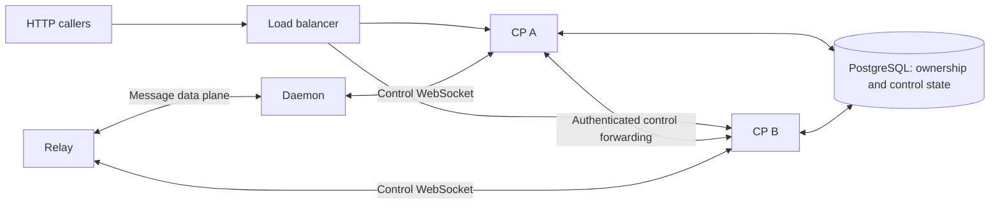

# High Availability and Control Plane Replication

> Status: Living application contract; the active-active CP design below is proposed, not implemented
>
> Related:
> [architecture.md](architecture.md),
> [daemon-cp-ws-protocol.md](daemon-cp-ws-protocol.md),
> [shared-bot-relay.md](shared-bot-relay.md), and
> [control-plane-implementation.md](control-plane-implementation.md)

This document owns the application contract for one or two peer Control Plane
replicas and CP upgrades without interrupting business traffic. Control
WebSockets may reconnect; accepted turns, established platform connections, and
Webchat output must survive a planned CP rollout. Infrastructure recovery and
capacity planning remain deployment concerns.

## Architecture Invariants

### The Control Plane is not on the message hot path

An established daemon remains the unit that receives messages, runs the agent,
and sends replies. Control Plane unavailability may delay configuration and
observability, but live platform message bodies and ACP update streams must stay
on the daemon/relay data plane. Authorized, bounded BFF reads may proxy
daemon-local content through the Control Plane without persistence.

### Daemons fail independently

Each daemon owns its local runtime processes, workspaces, transcripts, and
channel connections. A daemon failure must not directly terminate work owned by
another daemon.

### Relays are transit-only

A relay may route shared integration traffic, hooks, or webchat traffic, but it
must not become durable storage for message bodies. Routing state must be
reconstructible from authoritative control data.

### Control state is fenced and convergent

Reconnects and retries are normal. Control operations must be idempotent where
practical, and ownership-changing operations must use epochs or equivalent
fences so that stale processes cannot regain authority.

### Secrets never enter telemetry

Credentials may cross authenticated, encrypted control channels only where the
protocol explicitly requires them. Logs, metrics, traces, errors, and
operator-facing diagnostics must not contain secret values.

## Failure Domains and Required Behavior

| Failure domain                        | Required externally visible behavior                                                                                            |
| ------------------------------------- | ------------------------------------------------------------------------------------------------------------------------------- |
| Control Plane process or network path | Existing work continues within its authority lifetime; duty holders self-fence if confirmed renewal stops; reconnect reconciles |
| Daemon process or host                | Impact is limited to work owned by that daemon; loss is detectable and represented explicitly                                   |
| Relay process or route                | Other independent routes continue; accepted work is not silently reported as delivered                                          |
| Database or control-state store       | The system fails closed for authority changes and avoids reconnect amplification                                                |
| Identity or secrets provider          | Existing in-memory sessions degrade predictably; new operations return typed failures without leaking credentials               |
| External channel or Git provider      | Retries are bounded and idempotent where supported; permanent failure remains observable                                        |
| Slow or disconnected consumer         | Buffers are bounded, backpressure is enforced, and overflow has an explicit outcome                                             |

## Reliability Requirements

### Detection and observability

- Liveness must distinguish a clean shutdown, a transient disconnect, and an
  unreachable component.
- Operators need metrics for connection state, authentication rejection,
  routing failure, queue pressure, dropped work, and reconciliation lag.
- Alerts should describe the affected plane and scope without including tenant
  content or credentials.

### Reconnection and convergence

- Clients use exponential backoff with jitter and a finite upper bound.
- Authentication failures are classified separately from transient transport
  failures.
- Reconnection performs an authoritative snapshot reconciliation rather than
  relying on missed incremental events.
- Duplicate frames, retries, and stale connections cannot create two owners for
  the same fenced resource.

### Backpressure and delivery

- Every network writer has a bounded high-water mark and a defined overflow
  policy.
- An acknowledgement means the receiver has accepted responsibility according
  to the relevant protocol; work rejected during drain or overload must receive
  a typed negative result.
- Durable delivery mechanisms use stable idempotency keys. Best-effort paths
  make potential loss visible rather than presenting it as success.

### Graceful shutdown

- A component becomes unready before it drains active connections.
- New work is rejected or redirected during drain.
- In-flight work is given a bounded completion window.
- Clean shutdown is represented differently from an unexpected loss so that
  reconnect and alert policy can respond appropriately.

### Multi-instance control services

Running multiple instances must not depend on an in-process connection registry
or event bus for correctness. Cross-instance control delivery, revocation,
online-state reads, and live-event publication require shared coordination and
fencing. This applies to the overlap in a one-replica rolling update as well as
steady-state replication. The proposed implementation is specified below.

### Credential rotation

Rotation must support an overlap window or another reversible transition.
Operators must be able to validate new credentials before retiring old ones,
and a failed rotation must have a documented recovery path that does not
require exposing secret material.

## Active-Active Control Plane

### Scope and current baseline

Both replicas serve HTTP, accept daemon and relay control connections, and run
background workers. There is no global leader or standby. One replica uses the
same code path. A rollout may temporarily add one replica; two is the intended
steady-state scale, not a protocol limit. A single replica cannot provide
continuous control service after an unexpected process loss.

The rollout guarantee assumes healthy shared PostgreSQL, reachable identity and
secret dependencies, sufficient replacement capacity, and compatible adjacent
versions. CP replication does not change daemon or relay restart semantics,
platform delivery guarantees, or database failover.

PostgreSQL is the only shared coordination layer in this design, including its
durable metadata delivery log. Do not add a second broker. Each CP needs a
dedicated direct or session-pooled connection for `LISTEN`; transaction pooling
does not preserve the listener ([pooling compatibility](https://www.pgbouncer.org/features.html)).

The current implementation already has surge-first rolling updates, readiness,
`preStop`, `1012` control-socket closure, reconnect snapshots, and an acknowledged
session-metadata outbox. It still has process-local daemon/relay registries,
control broadcasts, SSE fan-out, and some mutation gates. Those mechanisms do
not yet satisfy this section; increasing `replicas` alone is insufficient.

### Connection ownership and forwarding

Keep one CP control connection per daemon or relay. Its socket remains local to
the accepting CP, behind the existing channel ports. Add a PostgreSQL connection
directory keyed by `(peer kind, peer id)`, recording the owner process
incarnation, internal endpoint, connection generation, phase, lease expiry, and
the capabilities required by routing. Daemons retain `sessionEpoch`; relay
connections need equivalent generation fencing.

- Registration atomically claims a new generation and publishes READY only
  after its snapshot is established. Every ownership renewal, cleanup, and
  connection-derived database mutation is fenced by that owner and generation
  in the same transaction as the mutation. An old close cannot clear a new
  connection's liveness, approval state, or authority.
- A CP that cannot renew ownership stops issuing authoritative controls before
  its lease expires. Lease comparisons use database time; local expiry uses a
  conservative monotonic deadline. A displaced owner closes the old socket;
  the receiving peer rejects stale-generation controls, including delayed relay
  projections.
- HTTP and orchestration callers resolve the directory. Local owners dispatch
  directly; remote owners receive one authenticated internal RPC carrying the
  peer generation, caller scope, request ID, and deadline. The owner validates
  them and stamps the wire fence. Forwarding never recursively forwards; an
  ownership change returns to the origin for a bounded re-resolution.
- Internal endpoints come from authenticated CP registration, never request
  input. Both Helm and Compose use HTTPS with a dedicated, rotatable CP peer
  bearer credential supplied through secret configuration, separate from daemon/relay
  credentials and never accepted for public API authentication. This also
  applies to one-replica deployments because rolling updates overlap. Bounded
  transcript/tool/file reads may pass transiently through the forwarding CP;
  their bodies never enter the directory, a delivery table, or notifications.
- Online checks, deletion guards, capability reads, and routing decisions use
  the shared view. A local registry miss or planned CP handoff is not daemon
  failure and must not remove a healthy data-plane route or reassign its duty.

Connection ownership only identifies the control transport. Existing placement,
duty terms, launch IDs, and resource revisions remain their respective authority
fences; a CP handoff does not advance those resource generations by itself.

### Control changes and live events

Commit configuration changes and a durable metadata-only delivery obligation in
the same database transaction. Each obligation identifies the resource, its
revision, and removal state. Every CP independently delivers relevant changes
to its local peers; one worker consuming a global queue cannot satisfy a
broadcast. Track outstanding delivery explicitly rather than advancing a bare
sequence cursor past transactions that have not committed yet.

Use PostgreSQL `LISTEN/NOTIFY` to wake these workers, with periodic scans as the
recovery path. Notifications contain only identifiers and revisions. A fresh CP
and every reconnecting peer receive an authoritative snapshot, followed by
changes committed during snapshot construction. This subscription boundary
must leave no gap. A process returning after delivery-history retention expires
rebuilds from a snapshot instead of resuming an old cursor.

Delivery is at least once. Peers acknowledge applied revisions and reject stale
updates, including removal tombstones. Authority-changing controls that lack
this contract must acquire it before replication is enabled; transient hints
may remain best-effort. Coalescing configuration updates is allowed only when
the latest snapshot fully replaces them. Revocations remain outstanding until
the intended peers acknowledge or their relevant authorization expires; loss
of a CP ownership lease alone does not expire a cached data-plane grant.
Expose pending propagation rather than claiming it has completed. Retain
tombstones and delivery state through that boundary, then compact them.

SSE uses cross-CP metadata invalidations, with the existing per-user visibility
checks at each subscriber. Opening or re-establishing a stream, or recovering a
lost notification subscription, triggers an authoritative refresh. Transient
live events may coalesce; persisted state and daemon content are re-read. No
transcript or ACP stream is replicated through this mechanism.

### Concurrent writers and background work

All replicas may scan for work. Short check-and-write operations use transaction
locks or CAS; long operations use renewable per-resource leases and durable
operation state. External side effects additionally need idempotency keys or
provider reconciliation when the outcome is unknown. A lease alone is not an
exactly-once guarantee, and external RPCs do not belong inside long database
transactions.

Reuse existing durable claims, including duty allocation, OAuth refresh, and
review publication. Replace the remaining correctness-sensitive local gates,
including MCP provider binding mutations and agent move coordination. In-memory
locks may remain optimizations. Inventory every background loop and
authorization/configuration cache: its writes must be independently safe and
its invalidations must reach other replicas. Database CAS does not by itself
make a post-commit local-only push safe.

Include plaintext secret caches in that audit. Organization deletion must deny
subsequent access on every replica and invalidate its cached entries. Destroying
a Vault key alone does not clear process memory; preserve the separate
[at-rest shredding boundary](per-org-secret-encryption.md#4-secretcipher-contract)
and do not claim that already-delivered plaintext has been erased.

### Planned rollout and reconnect budget

1. Apply only migrations that both versions can read and write. Start the new
   CP, establish its directory and change subscriptions, then report ready when
   HTTP, control forwarding, and snapshot recovery work. Keep the existing
   `maxUnavailable: 0`, `maxSurge: 1`, and endpoint propagation allowance.
2. Mark the retiring CP draining, remove it from public traffic, and stop
   claiming new background work. Keep its internal forwarding and sockets
   available while admitted requests and database operations finish within a
   bounded drain window. Finish or release worker claims safely.
3. Close remaining control sockets with `1012` and end SSE streams explicitly.
   This is a CP transport handoff, never `daemon/drain`: do not stop runtimes,
   clear relay routes, or interrupt accepted turns. Ownership cleanup is
   generation-conditional. Clients reconnect through the shared endpoint,
   reconcile, and immediately renew held duties.
4. Verify handoff completion and convergence before continuing the rollout.
   The grace period must cover endpoint propagation, request drain, connection
   handoff, and cleanup; an exceeded budget is a failed rollout, not proof of
   graceful completion.

Use **10 seconds as the initial acceptance budget for transport handoff**, from
socket closure through READY and confirmed duty renewal, measured at supported
fleet load. This is a proposed validation target, not a current guarantee. Every
held duty must renew before its actual remaining self-fence deadline, with at
least one heartbeat interval of margin. The current 120-second duty lease gives
a 90-second self-fence horizon from the last confirmed renewal, not 90 seconds
from disconnect. Do not lengthen that horizon to hide a slow rollout.

During handoff, reconnect-safe control reads and authentication checks wait and
retry within the caller's total deadline, including relay Webchat verification.
An uncached valid token must not become an immediate 503 solely because the
relay's CP link is reconnecting. Authentication rejection remains distinct from
transport failure. Mutations retain a stable operation ID and consult durable
outcome state before retry; an ambiguous non-idempotent operation is not blindly
resent. Bound all waiting queues and return typed outcomes on deadline or
overload, without acknowledging unaccepted work.

The daemon's existing session-metadata outbox remains the reporting mechanism.
Reconnection must converge unchanged configuration without restarting agents or
platform connections. Pool duties retain their existing self-fence on a real
prolonged outage; independent daemons retain their local-autonomy behavior.

Schema changes use expand/migrate/contract across releases. Wire changes must
cover the supported daemon/relay versions and both overlapping CP versions;
new required behavior is capability-gated. These compatibility checks apply to
one-replica upgrades too. Runtime credential rotation is a separate operation
with its own overlap contract.

### Daemon status during handoff

Control connection status is distinct from daemon execution health. The current
API already has a bounded `connecting` grace, but the Console mapper collapses
it into `offline`. The HA implementation must preserve that distinction through
the API and UI, using the shared liveness view:

| Observation                                                                   | Console behavior                                                                                                        |
| ----------------------------------------------------------------------------- | ----------------------------------------------------------------------------------------------------------------------- |
| READY connection owned by any CP                                              | Show Online, regardless of which replica serves the read.                                                               |
| Control connection is recovering within the liveness grace                    | Show Reconnecting in amber; retain last-observed work state with its freshness, without claiming it is newly confirmed. |
| Liveness grace expires without recovery, or an authoritative stop is observed | Show Unreachable for the lost control link, or Offline for a confirmed stop, in red.                                    |
| The Console cannot refresh CP state                                           | Mark the view stale or unavailable; do not convert every daemon to Offline.                                             |

The reconnect grace uses the last confirmed heartbeat and the configured
missed-heartbeat window (currently `HEARTBEAT_SEC × MISSED_BEATS`, 45 seconds
by default). Polling, reconnect attempts, and switching CP replicas must not
restart that window. Actual workload failures, including duty self-fence,
remain visible during grace. Presentation does not authorize deletion,
reassignment, or new work; those operations continue to enforce their shared
liveness and resource fences.

The 10-second handoff target and the liveness grace answer different questions.
A recovery taking longer than 10 seconds can preserve business continuity and
still fail the rollout budget; it is not by itself evidence of daemon failure.
Record handoff duration, business continuity, and state convergence separately.
After recovery, refresh authoritative state rather than merely clearing a UI
timer. Changing colors or extending grace does not satisfy the HA contract.

### Delivery and acceptance

Implement in three bounded steps, keeping steady-state replication disabled
until all three pass:

1. Shared connection ownership, fencing, forwarding, and cluster-wide liveness.
   Gate replica counts above one in the chart until all three steps pass.
2. Recoverable broadcasts, cross-CP SSE, mutation gates, and background/cache
   audit. Preserve existing durable implementations instead of replacing them.
3. Request drain, bounded reconnect waiting, truthful daemon status,
   mixed-version rollout checks, and the end-to-end continuity drill. Size the
   chart's termination grace and drain settings against the measured rollout
   budget.

Use two **independent CP processes** sharing PostgreSQL, not two application
objects that accidentally share module-global locks. The release gate covers:

- Connect a daemon to A and a relay to B; direct HTTP to either. Reads, controls,
  revocations, deletion guards, and SSE have the same result on both replicas.
- Race reconnect and ownership transfer with old frames, callbacks, and cleanup.
  Stale generations cannot mutate current state or resurrect deleted bindings.
- Lose notifications and restart a delivery worker between commit and ACK.
  Independent consumers, snapshots, tombstones, and retries converge without
  missing a recipient or duplicating a non-idempotent effect.
- Roll one and then two replicas through old/new versions under ongoing direct
  IM, relay ingress, Webchat streaming/new verification, and long-running turns.
  CP upgrade causes no lost accepted messages, restarted runtimes, interrupted
  turns, missing Webchat output, or duty self-fence; handoff meets its budget.
- Verify Reconnecting during a healthy handoff, accurate stale state when CP
  reads fail, and visible failure after grace expires. A recovery beyond the
  handoff budget must fail rollout acceptance even if work continues; neither
  retries nor replica changes may keep a dead daemon indefinitely Reconnecting.
- Separately kill an owner process or partition it from PostgreSQL. Verify
  bounded recovery and stale-owner rejection without weakening the existing
  prolonged-outage self-fence. This is distinct from the planned-rollout promise.

## Validation

Application implementation changes that affect availability should include the
smallest useful evidence for the changed invariant:

- deterministic unit tests for fencing, retry classification, and bounded
  queues;
- integration tests for reconnect reconciliation and cross-instance control
  delivery when those paths change;
- failure-injection tests that assert typed outcomes rather than silent loss;
- compatibility checks for mixed-version clients when wire behavior changes.

Infrastructure-specific drills, thresholds, replica placement, provider
failover, backup restoration, and incident-response steps are outside
application-level validation.

## Review Checklist

Before merging an availability-affecting change, verify:

1. Does it preserve the daemon-local message and ACP data boundary?
2. Is the failure domain no broader than necessary?
3. Are retries bounded, idempotent, and classified?
4. Can stale or duplicate actors regain authority?
5. Can overload or drain produce a false-success acknowledgement?
6. Are all secret-bearing values excluded from logs and diagnostics?
7. Is the behavior observable without coupling it to environment-specific details?
