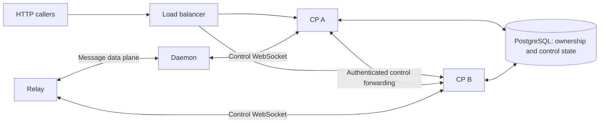

# High Availability and Control Plane Replication

> Status: Living application contract; the active-active CP design below is proposed, not implemented
>
> Related:
> [architecture.md](architecture.md),
> [daemon-cp-ws-protocol.md](daemon-cp-ws-protocol.md),
> [k8s-daemon-pool.md](k8s-daemon-pool.md),
> [shared-bot-relay.md](shared-bot-relay.md), and
> [control-plane-implementation.md](control-plane-implementation.md)

This document records availability requirements and proposes a Control Plane
design targeting one or two peer replicas. Its target is a CP-only rolling
upgrade without interrupting business traffic: control WebSockets may reconnect
while accepted turns, platform connections, and Webchat continue. This is not a
guarantee of today's implementation. Infrastructure recovery and capacity
planning remain deployment concerns.

## Architecture Invariants

### Live message transport stays on the data plane

Live platform message bodies and ACP update streams stay on the daemon/relay
data plane. Some admission steps and turn operations require CP control RPCs;
their bounded recovery is part of the proposed rollout contract below. Today
those dependencies can fail during a control disconnect. Authorized, bounded
BFF reads and workspace writes may proxy daemon-local content through the CP
without persistence.

### Daemons fail independently

Each daemon owns its local runtime processes, workspaces, transcripts, and
channel connections. A daemon failure must not directly terminate work owned by
another daemon.

### Relays are transit-only

A relay may route shared integration traffic, hooks, or webchat traffic, but it
must not become durable storage for message bodies. Routing state must be
reconstructible from authoritative control data.

### Control state is fenced and convergent

Reconnects and retries are normal. Control operations must be idempotent where
practical, and ownership-changing operations must use epochs or equivalent
fences so that stale processes cannot regain authority.

### Secrets never enter telemetry

Credentials may cross authenticated, encrypted control channels only where the
protocol explicitly requires them. Logs, metrics, traces, errors, and
operator-facing diagnostics must not contain secret values.

## Authority Lifetimes

Existing work may continue only while its own authority remains valid. This
does not mean that every authority has a CP-controlled expiry:

- All member-set daemons, including self-hosted daemon groups, self-fence duties
  at `T_fence` after the last confirmed renewal. Reassignment waits until
  `T_reassign > T_fence`; see [the duty lease contract](k8s-daemon-pool.md#5-the-duty-ledger-and-lease-service-d6-d7).
- Secret leases, where used, have their own TTL. Cached relay grants without a
  TTL do not expire merely because the CP connection or ownership lease ends.
- Standalone daemons outside a member set have no duty self-fence. Their local
  execution may continue, but CP-dependent operations can still fail.

## Failure Domains and Required Behavior

| Failure domain                   | Required externally visible behavior                                                                              |
| -------------------------------- | ----------------------------------------------------------------------------------------------------------------- |
| One CP lost, another healthy     | The proposed design reconnects to the healthy peer before existing authority or relay liveness expires            |
| All CPs unavailable              | Existing work is limited by the authority lifetimes above; no new CP authority is granted                         |
| Daemon process or host           | Impact is limited to work owned by that daemon; loss is detectable and represented explicitly                     |
| Relay process or route           | Other independent routes continue; accepted work is not silently reported as delivered                            |
| Database or control-state store  | The system fails closed for authority changes and avoids reconnect amplification                                  |
| Identity or secrets provider     | Existing in-memory sessions degrade predictably; new operations return typed failures without leaking credentials |
| External channel or Git provider | Retries are bounded and idempotent where supported; permanent failure remains observable                          |
| Slow or disconnected consumer    | Buffers are bounded, backpressure is enforced, and overflow has an explicit outcome                               |

## Reliability Requirements

### Detection and observability

- Liveness must distinguish a clean shutdown, a transient disconnect, and an
  unreachable component.
- Operators need metrics for connection state, authentication rejection,
  routing failure, queue pressure, dropped work, and reconciliation lag.
- Alerts should describe the affected plane and scope without including tenant
  content or credentials.

### Reconnection and convergence

- Clients use exponential backoff with jitter and a finite upper bound.
- Authentication failures are classified separately from transient transport
  failures.
- Reconnection performs an authoritative snapshot reconciliation rather than
  relying on missed incremental events.
- Duplicate frames, retries, and stale connections cannot create two owners for
  the same fenced resource.

### Backpressure and delivery

- Every network writer has a bounded high-water mark and a defined overflow
  policy.
- An acknowledgement means the receiver has accepted responsibility according
  to the relevant protocol; work rejected during drain or overload must receive
  a typed negative result.
- Durable delivery mechanisms use stable idempotency keys. Best-effort paths
  make potential loss visible rather than presenting it as success.

### Graceful shutdown

- A component becomes unready before it drains active connections.
- New work is rejected or redirected during drain.
- In-flight work is given a bounded completion window.
- Clean shutdown is represented differently from an unexpected loss so that
  reconnect and alert policy can respond appropriately.

### Multi-instance control services

Running multiple instances must not depend on an in-process connection registry
or event bus for correctness. Cross-instance control delivery, revocation,
online-state reads, and live-event publication require shared coordination and
fencing. Today's one-replica rolling overlap does not meet this target either;
the proposed implementation below covers both overlap and steady replication.

### Credential rotation

Rotation must support an overlap window or another reversible transition.
Operators must be able to validate new credentials before retiring old ones,
and a failed rotation must have a documented recovery path that does not
require exposing secret material.

## Active-Active Control Plane

### Scope and current baseline

Both replicas serve HTTP, accept daemon and relay control connections, and run
background workers. There is no global leader or standby. One replica uses the
same code path. A rollout may temporarily add one replica; two is the intended
steady-state scale, not a protocol limit. A single replica cannot provide
continuous control service after an unexpected process loss.

The target applies to CP-only rollouts with healthy shared PostgreSQL, reachable
identity and secret dependencies, sufficient replacement capacity, a shared
endpoint, and compatible overlapping versions. Hold relay and daemon versions
fixed during this drill. The chart defaults those components to a shared image
tag, so an ordinary all-component chart upgrade is outside this promise and
needs separate continuity validation. CP replication does not change their crash
semantics, platform delivery guarantees, or database failover.

The Helm chart can overlap old and new CPs. The supplied Compose service is one
container on a fixed host port and cannot; its stop/start upgrade is outside
this promise until it gains an overlapping rollout topology. One steady-state
replica still needs peer support when its deployment overlaps versions.

PostgreSQL is the only shared coordination layer in this design, including its
durable metadata delivery log. Do not add a second broker. Each CP needs a
dedicated direct or session-pooled connection for `LISTEN`; transaction pooling
does not preserve the listener ([pooling compatibility](https://www.pgbouncer.org/features.html)).

The current Helm deployment already has surge-first rolling updates, readiness,
`preStop`, `1012` control-socket closure, reconnect snapshots, and an acknowledged
session-metadata outbox. It still has process-local daemon/relay registries,
control broadcasts, SSE fan-out, and some mutation gates. Those mechanisms do
not yet satisfy this section; increasing `replicas` alone is insufficient.
Relay reconnect replay is also incomplete: MCP and hook replay is additive,
while memory bindings are cleared before asynchronous replay. Neither is the
atomic replacement snapshot required below. Relay readiness follows its CP
link, and relay verification and lookup requests still fail immediately on a
drop. Daemon turn-path requests wait up to 10 seconds for a replacement link,
only within 30 seconds of a READY link dropping; idempotent reads are re-sent
once over the new link, and `memory/store` still lacks operation IDs.

### Connection ownership and forwarding

Keep one CP control connection per daemon or relay. Its socket remains local to
the accepting CP, behind the existing channel ports. Add a PostgreSQL connection
directory keyed by `(peer kind, peer id)`, recording the owner process
incarnation, internal endpoint, connection epoch, phase, and lease expiry. CP
registration also records its version and supported internal operations. For
daemons the connection epoch is exactly `sessionEpoch`, claimed in the auth
transaction that increments it, before any connection-derived writes. It is
not the daemon's existing `generation` field, which identifies a pod template.
Relays gain a CP-issued epoch; their current client-local generation is not a
cross-CP fence. Peer registration uses REGISTERING and READY. Persist a daemon's
shutdown-draining declaration by `(daemon id, boot id)` before admitting it for
placement. The daemon supplies it at registration and on subsequent heartbeats;
every CP consults the shared record. It stays true across same-boot reconnects;
only an accepted new boot clears the prior boot's declaration under the
registration fence. Today this departure is the heartbeat `duties.draining` bit,
held only in the owning CP's memory and lost on re-registration.

Keep `daemon/drain` separate: it is a scoped rebalance operation, not shutdown.
Its production caller is the currently unarmed Watchdog path. Record its scope,
operation ID and deadline; settle it on `drain/done`, definitive error or timeout
without clearing a shutdown declaration or bypassing reassignment fences.
CP retirement is a separate RETIRING state on the owner incarnation, never a
peer departure.

- Publish READY only after registration and snapshot convergence. Auth follow-up,
  heartbeat, runtime-snapshot sequence resets/updates, approval replay/cleanup,
  and lifecycle writes require the owner incarnation and connection epoch.
  Use a conditional write or lock the ownership row through the mutation;
  an unlocked read followed by a write in the same transaction is insufficient.
  An old close cannot clear a successor's state. A claim notifies the displaced
  incarnation; polling and renewal predicates cover lost notifications.
- HTTP and orchestration callers resolve the directory. Local owners dispatch
  directly; remote owners receive one authenticated internal RPC carrying the
  target owner incarnation, connection epoch, caller scope, request ID, and
  deadline. The owner rejects a stale incarnation, validates resource scope, and stamps
  the wire fence. Forwarding never recursively forwards; an
  ownership change returns to the origin for a bounded re-resolution.
- Internal endpoints come from authenticated CP registration, never request
  input. Use a dedicated, rotatable peer credential, separate from daemon/relay
  and public API authentication. It establishes installation trust, not an
  independent proof of user identity: ingress authenticates/authorizes the user,
  and the owner rechecks current resource scope. CPs share a privileged trust
  boundary. HTTPS uses deployment-issued certificates with a configured CA and
  verified server name. This is the proposed peer transport requirement, not
  a claim that existing internal HTTP links already provide it.
- Bounded transcript/tool/file reads and authorized `workspace/write` content
  may pass transiently through the forwarding CP. Bodies never enter the
  directory, delivery records, or notifications. Preserve write preconditions
  such as `ifMatchMtime` and the mutation retry rules below.
- Online checks, deletion guards, capability reads, and routing decisions use
  the shared view. A local registry miss or planned CP handoff is not daemon
  failure and must not remove a healthy data-plane route or reassign its duty.

Unexpired READY or DRAINING connections serve controls. A shutdown-draining
boot takes no new placement; a rebalance drain excludes its recorded scope.
REGISTERING waits within a deadline. A RETIRING CP serves or
forwards every inventoried admission and turn RPC from attached peers until
handoff; it stops only background vacancy allocation and new worker claims.
CP retirement does not change a peer's own READY/DRAINING state.
Expired/missing ownership without a proven stop is unknown: reads re-resolve,
mutations fail closed, and existing data routes retain their own authority.
Deletion requires a fenced retirement decision, never just directory absence.
Compute HTTP-bot notice authority from relays with fresh shared presence and
eligible ingress, not every retained roster entry. Re-resolve CP-relayed daemon
requests such as `executor/prepare` across owner changes.

Connection epochs identify transports, not daemon boots. Placement, duty terms,
launch IDs, and resource revisions retain their own fences. In particular,
restart completion must use a reported daemon boot identity, not a higher
`sessionEpoch`; the current lifecycle settlement needs that correction.

### Owner failure and database loss

Use an initial 15-second ownership lease, renewed every 5 seconds, with database
time for all CP-shared lease decisions, including duty and OAuth claims. Local
deadlines are conservative monotonic deadlines derived from confirmed renewal.
After renewal failure, remove public readiness and stop new authority changes.
No later than 10 seconds after the last confirmed renewal, stop all
authoritative controls. An authenticated probe identifies a healthy target only
if it is publicly ready, not RETIRING, accepting control upgrades, and confirms
a renewal within one interval using database time. Probe peer addresses and the
shared public endpoint, and use fresh discovery of all active CP incarnations
and their readiness so a surge or replacement can be found without a database
read. Cached membership, desired replica count, or an empty/unreachable endpoint
cannot prove that no healthy target exists. Step 1 must define that discovery
source and its bounded refresh.
The result determines what happens to existing sockets:

- With a healthy target, release control sockets once with `1012` within that
  10-second deadline, earlier if a peer's remaining duty margin requires it.
- When fresh discovery establishes the active set and every member reports
  that it cannot renew, stop authoritative controls but keep established relay
  links in an acknowledged non-authoritative transport mode. This includes a
  verified single-CP set. Keep
  transport keepalive running and answer CP-dependent RPCs with retryable
  unavailable; do not publish grants, renew authority, or claim shared READY.
  Preserve already-converged relay ingress within its cached-grant and daemon
  authority lifetimes. Daemon control links may still be released once to seek
  renewal elsewhere. Probe with bounded backoff and release relay links when a
  healthy target becomes available.
- An unreachable peer, one not yet accepting upgrades, or membership that cannot
  be freshly enumerated is unknown, not evidence that every CP cannot renew.
  Release control links within the deadline so they can seek a reachable CP;
  relay data-plane readiness follows the locally observable rules below.

An expired or displaced owner never regains authority merely by keeping a
socket. Reject new control handshakes while renewal is unavailable. Recovery
must re-authenticate and reconcile before restoring authority; each connection
epoch is detached at most once. With global DB loss, retries remain bounded and
existing duty self-fences still apply. Uncached verification and new grants
remain unavailable; preserving relay ingress is not a claim of full CP service.

Keep stable relay identity and routing metadata separate from connection lease
expiry. `RELAY_STALE_SEC` bounds control-presence freshness and eligibility for
roles such as notice authority, evaluated on reads using database time; it no
longer deletes routes. Stale presence becomes unknown, not a roster removal: neither
the sweeper nor roster reads may withdraw an existing route solely because its
CP could not persist a heartbeat. A held link may update observed `lastSeenAt`
when the database is writable, conditional on its connection epoch; that does
not renew authority. Use database time for sweeping, reconcile after recovery,
and require fenced retirement before removing the stable identity. Today's
delete-on-stale sweeper does not meet this rule, including after a long DB outage.

Give silent-owner detection an initial **10-second maximum**, including watchdog
tick delay. The current 15-second self-ping / 45-second rx-idle defaults cannot
meet it. For CP control links, propose a 2-second ping/tick and 8-second rx-idle
threshold, measured under the supported load. This does not change data-plane
socket timers. Include a frozen process or packet loss without FIN in the drill.

Endpoint withdrawal runs concurrently with detection; planned retirement waits
for it before release. Budget at most 5 seconds from a failed renewal/readiness
probe through load-balancer propagation, inside the 10-second detection/release
window. Step 3 must configure and measure that path; today's 10-second probe
with the default failure threshold cannot meet it. On a fault, the release
deadline wins if withdrawal is late. A redial into a still-listed CP gets a
retryable refusal or a timeout: both use capped jitter without increasing
backoff inside the handoff deadline. Only those handoff redials use an initial
1-second per-attempt cap, bounded by the remaining handoff deadline. Preserve the
normal 10-second timeout for initial connects and recovery outside that window.
The 2-second dial/auth allocation below is a planning slice: after spending it,
continue positive-duration attempts with capped jitter inside the remaining
total budget, recording the overrun against that budget. Never reset the total
deadline or create zero-timeout retries. Ordinary backoff resumes after it expires.

Measure `D` from injected fault onset through detection, endpoint withdrawal and
release, and `H` from release through the complete handoff below. Require
`D <= 10 seconds`, `H <= 10 seconds`, and `D + H <= 20 seconds`. It must also fit
below the remaining Console grace and each actual remaining duty deadline minus
one heartbeat; admission latency must fit its own budget below.

Relay `rc/heartbeat` is send-only today. Use confirmed WS ping/pong on the
authenticated control connection as the proposed contact anchor, expose its
monotonic timestamp to readiness, and retain the proposed 2-second ping cadence.
A pong proves transport contact, never authority renewal. Let `P` bound the age
of the last confirmation at fault onset, including cadence, round-trip delay
and scheduler jitter. Readiness grace `G` runs from that confirmation, not the
fault or a reconnect attempt. Let `Q` bound relay probe and endpoint propagation
after `/readyz` fails. Require `P + D + H < G` and
`G + Q < RELAY_STALE_SEC - HEARTBEAT_SEC`; neither retries nor changing replicas
refreshes the anchor without a confirmed contact. An initial profile to validate is
`P <= 5s`, `G = 30s`, `Q <= 5s`: 25s of recovery fits with 5s slack, and Service
removal takes at most 35s from the last contact, below 45 - 5 = 40s of remaining
control-presence freshness. Thus the initial profile requires `HEARTBEAT_SEC < 10s`;
the code default of 15s does not qualify just because Console grace is 45s.
The sweeper interval is not extra presence lifetime. Step 3 must configure and
measure both CP and relay probes; today's relay probes alone add roughly 20–30s.

A CP may retain a relay link past its release deadline only if the relay
acknowledges non-authoritative mode before that deadline; otherwise close it and apply the
same grace. In that mode fresh ping/pong confirmations refresh contact grace,
but require still-authorized projections and observable daemon data health.
Recovery handoff uses the last such fresh confirmation, not a pre-outage renewal.
An unready relay can become ready after those conditions hold again, or after a
normal authenticated registration and complete projection. Attempts alone never
restore readiness. Initial startup and expired/revoked authority fail closed.

Assess data health per route: loss of one daemon disables its affected routes,
not every relay serving other healthy routes. Whole-Service readiness fails on a
shared prerequisite failure or no usable ingress capacity for that Service.
Cached grants or a bare open data socket are insufficient evidence. Step 3 must
define route-health freshness and empty/standby capacity semantics. When control
contact is lost, `/readyz` fails at `G` and Service removal completes by `G + Q`.

### Control changes and live events

Any committed change to an input of a pushed projection records a durable,
metadata-only obligation in the same transaction. This includes duty-holder
changes, relay registration/retirement, boot reconcilers, and OAuth rotation,
not only configuration edits. State projections use this journal; forwarding
serves request/reply operations and imperative commands, avoiding two competing
delivery paths for a configuration PATCH.

Use independent per-CP pending progress, resolving local recipients at delivery
time, plus applied-revision acknowledgements at peers. A peer moving to another
CP is reconciled there; a complete snapshot satisfies its older obligations.
Track unfinished rows explicitly, never a bare sequence watermark that skips
uncommitted transactions. Compaction waits for every live incarnation to finish
or reset from a complete snapshot; retired incarnations cannot resume old
progress. This is per-CP journal progress, not one durable row per event per peer.

Use PostgreSQL `LISTEN/NOTIFY` to wake these workers, with periodic scans as the
recovery path. Notifications contain only identifiers and revisions. A fresh CP
and every reconnecting peer register as recipients before snapshot construction,
then consume changes committed while it was built. Snapshot begin/end frames
identify the projection kind and snapshot. Build membership from one consistent
database read view and stage the set. At its complete end, merge queued updates
and retained removal tombstones by per-resource revision, then atomically
publish and prune. Never use a snapshot-wide sequence maximum: allocation order
is not commit order. Step 2 must define revision scope for aggregate projections.

Retry a failing item within a bound, then include it as withheld at resource
revision `R`. Keep an existing, still-authorized copy whose applied revision is
at least `R`; disable an older copy or leave an absent item unavailable. Report
the item pending and retain its retry obligation. A full item at the same
revision replaces the withheld marker; neither can override a newer revision,
revocation or expiry. Complete the snapshot so unrelated removals still prune:
failure to produce one item is not itself a revocation. Failure to enumerate
membership or an incomplete stream retains the prior valid projection within its authority
limits; it must not masquerade as a complete snapshot. After delivery-history
retention expires, rebuild from a snapshot instead of resuming old progress.

Delivery is at least once. Peers acknowledge applied revisions and reject stale
updates, including removal tombstones. Authority-changing controls that lack
this contract must acquire it before replication is enabled; transient hints
may remain best-effort. Coalescing configuration updates is allowed only when
the latest snapshot fully replaces them. Revocations remain outstanding until
the intended peers acknowledge or their relevant authorization expires; loss
of a CP ownership lease alone does not expire a cached data-plane grant.
Terminal conditions are applied ACK, the grant's own expiry, or verified peer
retirement that also fences its data-plane authority. Deleting a directory row
is not that proof. Unexpiring offline grants can keep revocation pending; no
bounded revocation SLA is claimed until the grant-lifetime decision is settled.
Expose pending propagation rather than claiming it has completed. Retain
tombstones and delivery state through that boundary, then compact them.

SSE uses per-user visibility checks and batched, rate-bounded metadata
invalidations. Persisted changes use journal wakeups; high-rate transient
`session-activity` uses best-effort peer forwarding, not database writes or
`NOTIFY` per activity frame. Missing activity cannot be reconstructed from
PostgreSQL. A resync signal and jittered browser reconnect refresh persisted
state and resume live observation without pretending to replay lost activity.
Authorization-cache invalidation uses the durable path; a lost subscription
flushes affected authorization caches before serving another cached verdict.
No transcript or ACP stream is replicated through this mechanism.

### Concurrent writers and background work

All replicas may scan for work. Short check-and-write operations use transaction
locks or CAS; long operations use renewable per-resource leases and durable
operation state. External side effects additionally need idempotency keys or
provider reconciliation when the outcome is unknown. A lease alone is not an
exactly-once guarantee, and external RPCs do not belong inside long database
transactions.

Reuse existing durable claims, including duty allocation, OAuth refresh, and
review publication. Replace the remaining correctness-sensitive local gates,
including MCP provider binding mutations, agent moves, HTTP-bot conversation
mutation chains, and approval cleanup/replay ordering. In-memory locks may
remain optimizations. Inventory every background loop and
authorization/configuration cache: its writes must be independently safe and
its invalidations must reach other replicas. Database CAS does not by itself
make a post-commit local-only push safe.

Duty recovery grace must reflect an install-wide recovery gap, not restart a
120-second vacancy pause on every new CP process. Skip the full recovery wait
only when shared incarnation history proves uninterrupted authority; otherwise
retain `T_reassign`. Audit shared rate budgets (MCP and GitHub credential minting)
and Logto identity-cache invalidation rather than multiplying them per process.

Keep the existing [at-rest shredding boundary](per-org-secret-encryption.md#4-secretcipher-contract):
Vault key deletion does not clear a warm plaintext cache, which currently has
bounded capacity but no per-org eviction API or time-based expiry guarantee.
Cross-CP authorization invalidation must not claim to erase that plaintext.
Per-org plaintext eviction is a separate step-2 decision, not a new guarantee
introduced by this document.

### Planned rollout and reconnect budget

1. Apply only migrations that both versions can read and write. Start the new
   CP, establish its directory and change subscriptions, then report ready when
   HTTP, control forwarding, and snapshot recovery work. Keep the existing
   `maxUnavailable: 0`, `maxSurge: 1`, and `minReadySeconds` propagation allowance
   (currently 15 seconds).
2. Mark the CP incarnation RETIRING, remove it from public traffic, and stop
   claiming new background work. Keep its internal forwarding and sockets
   available while admitted requests and database operations finish within a
   bounded drain window. Continue heartbeats, confirmed duty renewal, releases,
   verification/lookup RPCs, message-triggered `duty/claim` rendezvous, and metadata
   outbox ACKs; suppress only background vacancy allocation and new worker claims.
   Every inventoried admission and turn RPC remains served or forwarded until
   the attached peer's socket closes.
   Refuse new control upgrades with a retryable unavailable response. Finish or
   release existing worker claims safely.
3. Close remaining control sockets with `1012` and end SSE streams explicitly.
   This is a CP transport handoff, never `daemon/drain`: do not stop runtimes,
   clear relay routes, or interrupt accepted turns. Ownership cleanup is
   conditional on the owner incarnation and connection epoch. Clients reconnect
   through the shared endpoint, reconcile, and immediately renew held duties.
4. A deployment-side rollout gate must verify handoff before retiring another
   CP, and halt on timeout. A plain Deployment availability check does not
   enforce this; the serial retirement mechanism is a required step-3 design
   item. Do not claim the guarantee for today's unmodified rollout controller.

Keep HTTP/internal listeners alive during admission drain; close control/SSE
sockets before awaiting Fastify `http.close()`. Derive `preStop`, admission
drain, the process failsafe, and `terminationGracePeriodSeconds` from one total
budget. Today's 10-second process failsafe, 2-second socket terminate, and
30-second pod grace are not automatically sufficient for the new phases.

Use **10 seconds as the initial worst-case budget for the last peer of a
retiring CP**, including any connection-close batching. The drill measures from
the first control close to every daemon's reconciled READY and confirmed held
duty renewal, and every relay's READY with complete projections. Use one test
observer's monotonic clock; report per-peer durations as well. Publish the
tested peer count and configuration/snapshot load with the result; no unmeasured
fleet size is covered. This is a proposed target, not a current guarantee.

The initial allocation is 1 second for jitter/redial admission, 2 for dial/auth,
5 for snapshot build and unchanged-state convergence, and 2 for renewal and
completion observation. Step 3 adds a `1012`-aware fast reconnect, bounded
registration concurrency, and convergence that does not wait for an unchanged
agent's active turn to finish. Failures within the handoff window use the capped
retry policy above; ordinary bounded backoff resumes after that window.
The full budget must fit below the relay readiness/presence bounds above and every
held duty's actual remaining `T_fence`, with a heartbeat interval of margin.
Use the configured [duty lease bounds](k8s-daemon-pool.md#5-the-duty-ledger-and-lease-service-d6-d7),
not an assumed 90 seconds from disconnect; never extend a fence to hide delay.

Inventory **every daemon-to-CP and relay-to-CP request on an admission or turn
path**. During handoff each waits and retries within one total deadline, capped
by its enclosing admission/operation deadline and authority expiry. This includes
`duty/claim`, `hook/start`, `channel/agents`, `knowledge/search`,
`codehost/review-lease-renew`, daemon `gitcred/request`,
`provider-credentials/request`, `linearcred/request`, CP-homed memory reads and
writes, and CP-relayed `executor/prepare`; also relay Webchat/agent-chat
verification, `rd/hello`, and `rc/thread-lookup`. Reuse the relay's bounded
`waitReady` pattern and add its equivalent on the daemon. An uncached valid
token or already-acknowledged platform follow-up cannot fail solely because the
link is reconnecting. Authorization rejection stays distinct from transport
failure, and waiting does not bypass revocation.

A transient `duty/claim` failure must not become a definitive `not_holder` with
no holder and drop an already-acknowledged callback. Keep admission pending and
deduplicate retransmits while it recovers. Control recovery, claim/application,
and the final ACK must fit the **remaining** `rd/msg` retransmit budget (currently
5 seconds × 5 attempts by default); retries do not restart that budget. The
retiring CP serves or forwards rendezvous claims even while background vacancy
allocation is stopped. An exhausted budget fails the continuity drill; it is not
permission to extend duty or authorization expiry.

Step 3 must carry the original admission deadline on `rd/msg` with defined clock
accounting, preserving it through retransmission and holder redirects. Today
that field is absent. A late claim cannot start a new dispatch after the deadline;
return a typed retryable admission expiry, never `not_holder`. Specify outcomes
for Webchat, hooks and platform callbacks, including ambiguous ACK loss, without
stopping work already admitted before expiry or renewing the sender's budget.

Mutations need a stable operation ID and durable outcome lookup before resend,
specifically CP-side deduplication for non-idempotent `memory/store` appends and
the corresponding transaction operations. Forwarded workspace writes retain
their original preconditions. Without this capability, an ambiguous write is
not retried and that peer/version cannot pass the continuity gate. Queues and
deadlines are bounded; overload has a typed outcome, never a false acceptance.

The acknowledged `event/session-sync` outbox remains the session-metadata
mechanism. `cron/report` completion and `usage/report` are currently best-effort:
reconnect restates cron fire stamps, not completion, and usage has no guaranteed
reconnect replay. Step 3 must preserve terminal cron outcomes across handoff
through acknowledged, deduplicated reporting; usage gaps remain observable
telemetry gaps rather than a claim that all reports are durable.
Reconnection must converge unchanged configuration without restarting agents or
platform connections. All member-set duties retain self-fence on a prolonged
outage; standalone daemons retain their local-autonomy behavior.

### Compatibility and first activation

Expand/migrate/contract applies to coordination itself. Record staged activation
levels durably in PostgreSQL, advanced by an authorized operator with a CAS and
capability preflight. First ship a bridge release with directory writes, fenced
close handling, peer RPC and shared-mode read support behind the first level.
Its initial rollout still has the old implementation's limitations; do not
advertise HA while a pre-bridge CP may exist. Activation participants are all
serving CP incarnations; each must support and acknowledge the level. Serialize
registration against activation on the level row, and re-check READY peers in
the activation transaction. Every bridge-or-later CP must refuse authority and
READY unless it implements every active level, including during outage recovery.

Preflight connected peers; offline peers do not veto activation. Refuse later
registration only for missing safety capabilities such as fencing, snapshot
framing and tombstones. After authentication, deliver any pending authorized
bootstrap upgrade before issuing a typed, retryable upgrade-required refusal;
never map incompatibility to `AUTH_FAILED`/4401 or a token re-mint instruction.
This registration-only upgrade path grants no placement or ordinary control
authority before safety preflight passes. Missing continuity-only capabilities
such as mutation retry/deduplication use per-feature upgrade-required responses: preserve safe
control/lifecycle access, exclude that peer from the continuity guarantee, and
never retry its ambiguous writes. Step 3 must classify the capability inventory.
Missing rows during bootstrap mean unknown legacy ownership, never proof that
deletion or reassignment is safe.

Subsequent releases and rollbacks must support every active level and retained
schema. The bridge is a rollback target only while it implements all active
levels. A pre-bridge downgrade requires a separately planned maintenance
transition. The supported rollout procedure checks compatibility before starting
a CP and detects incompatible incarnations; this is an operator/deployment gate,
not a claim that legacy code reads or enforces it. Bypassing that procedure is
outside the promise. Never silently fall back to local reads during an HA rollout.

Compatibility also includes minted artifacts and process configuration:
deploy verifiers for the next token format/key before minting it, retaining
only previous formats that satisfy the same authorization constraints. A
security-incompatible token cutover is outside the uninterrupted-rollout
contract.

A deployment-document save records a pending apply; it does not make every CP
unready or mean the saved values are effective. Classify changes before apply:

- Overlap-capable changes may roll while old and new values satisfy the same
  authorization constraints; fenced projection inputs still follow the epoch
  rule below.
- Security-tightening changes, including revoked providers, compromised secrets
  and audience restrictions, use shared revocation and fail closed for affected
  scopes. Do not retain an unsafe old value for continuity or claim completion
  while revocation is pending. This overrides pending-apply and ready-replacement
  rules: lagging and RETIRING consumers deny affected operations as soon as they
  observe the tightening, until they can apply it. A consumer unable to receive
  or enforce that denial requires coordinated withdrawal/stop and restart,
  outside the CP-only continuity promise; keep propagation pending until all
  affected consumers acknowledge or their old authority is fenced out.
- Incompatible changes or component restarts outside CP require a separately
  planned transition; they are outside this uninterrupted CP-only promise.

Advertise each process's applied revision. A lagging CP retires only after a
ready replacement is available, through RETIRING, stopped obsolete publications,
forwarding of applicable control RPCs, and `1012` handoff. Merely changing HTTP
readiness leaves stale socket pushes alive. Today's process-once application and
Setup `restartRequired` response do not implement this rollout. Step 3 must
inventory CP consumers (OIDC audience, provider credentials and code-host
settings) and relay consumers. Today's relay applies its GitHub webhook secret
once, but replaces `publicRelayUrl` and deployment-owned assignments on every
handshake. Assume no field supports live updates until its consumer atomically
applies/acknowledges higher revisions and rejects lower ones; otherwise plan a
separate restart, subject to the security-tightening precedence above.

Equal `configRevision` must render the same digest across overlapping CPs. A
durable active render epoch selects an immutable input bundle: renderer semantics
and every configuration input to a fenced projection, regardless of source.
This includes deployment-document GitLab/Gitea hosts, startup-environment
`PUBLIC_CP_URL` and `S3_PUBLIC_BASE_URL` inputs to `iconUrl`, and the origin used
for relay `publicRelayUrl`. Environment changes follow the same activation and
revision advancement as document changes. Retain the bundle for overlap and
supported rollback; process-local configuration must not override it. Keep the active bundle until
every serving CP supports and acknowledges the next one. Then activate it and
advance affected agent revisions under the same fence; discard
in-flight publications from the previous epoch. Preserve digest normalization
for additive fields. Rollback must support the active render epoch; reverting
semantics requires another coordinated epoch and higher revisions. Merely
incrementing the shared counter does not reconcile two different renderers.

### Daemon status during handoff

Control connection status is distinct from daemon execution health. The current
API already has a bounded `connecting` grace, but the Console mapper collapses
it into `offline`. The HA implementation must preserve that distinction through
the API and UI, using the shared liveness view:

| Observation                                                                   | Console behavior                                                                                                        |
| ----------------------------------------------------------------------------- | ----------------------------------------------------------------------------------------------------------------------- |
| READY connection owned by any CP                                              | Show Online, regardless of which replica serves the read.                                                               |
| READY connection whose CP incarnation is RETIRING                             | Show Online until the control socket closes; CP retirement is not daemon departure.                                     |
| Daemon's current boot declares shutdown draining                              | Show its drain state on every CP and exclude that boot from new placement; control reconnect does not clear it.         |
| Control connection is recovering within the liveness grace                    | Show Reconnecting in amber; retain last-observed work state with its freshness, without claiming it is newly confirmed. |
| Liveness grace expires without recovery, or an authoritative stop is observed | Show Unreachable for the lost control link, or Offline for a confirmed stop, in red.                                    |
| The Console cannot refresh CP state                                           | Mark the view stale or unavailable; do not convert every daemon to Offline.                                             |

The reconnect grace uses the last confirmed heartbeat and the configured
missed-heartbeat window (currently `HEARTBEAT_SEC × MISSED_BEATS`, 45 seconds
by default). Polling, reconnect attempts, and switching CP replicas must not
restart that window. Actual workload failures, including duty self-fence,
remain visible during grace. Presentation does not authorize deletion,
reassignment, or new work; those operations continue to enforce their shared
liveness and resource fences.

The 10-second handoff target and the liveness grace answer different questions.
A recovery taking longer than 10 seconds can preserve business continuity and
still fail the rollout budget; it is not by itself evidence of daemon failure.
Record handoff duration, business continuity, and state convergence separately.
After recovery, refresh authoritative state rather than merely clearing a UI
timer. Changing colors or extending grace does not satisfy the HA contract.

### Delivery and acceptance

Implement in three bounded steps, keeping steady-state replication disabled
until all three pass:

1. Shared connection ownership, fencing, forwarding, and cluster-wide liveness.
   Gate replica counts above one in the chart until all three steps pass; that
   protective guard can ship before the shared directory.
2. Recoverable broadcasts, cross-CP SSE, mutation gates, and background/cache
   audit. Preserve existing durable implementations instead of replacing them.
3. Request drain, bounded reconnect waiting, truthful daemon status,
   mixed-version rollout checks, and the end-to-end continuity drill. Size the
   chart's termination grace and drain settings against the measured rollout
   budget.

The following details remain implementation decisions, required before enabling
replication rather than guarantees already supplied by the current code:

- Step 1: directory schema, isolation predicates for every connection-derived
  write, peer certificate provisioning, daemon boot identity negotiation,
  boot-scoped shutdown declarations and scoped rebalance recovery, fresh CP
  discovery, stable relay roster identity, migration lock
  budgets below the renewal interval, and retirement of unknown peers with
  credential fencing and cached-grant settlement.
  Directory absence or credential revocation alone is not proof that cached
  data-plane authority has ended. Distinguish administrative deletion from
  completed grant revocation; retain required tombstones while settlement is pending.
  Define automatic fenced retirement for gone or scaled-down relays, including
  the required evidence and bounded roster/redial cleanup after grant settlement.
- Step 2: inventory every authority control and hint with revision source,
  tombstone, ACK and old-peer behavior, including aggregate `rc/routes`,
  collaboration routes, relay roster, MCP/hook removal and daemon revocation.
  Specify per-resource revisions for aggregate projections, snapshot membership
  and withheld-item handling, pending-progress storage/compaction, invalidation
  batching limits, shared rate budgets, and the policy for unexpiring offline grants. Decide
  separately whether to add per-org plaintext cache eviction.
- Step 3: select and implement the deployment-side serial retirement gate,
  its halt/rollback behavior, activation-level and peer-capability checks,
  render-epoch activation covering all configuration inputs, CP/relay field
  classification, relay contact/route-health freshness and probe propagation,
  the complete admission/turn RPC inventory and propagated deadlines, supported
  fleet load, and measured timing knobs.
  PDB/spreading protect the chosen two-replica disruption profile; they do not
  replace the CP-only handoff gate or cover a simultaneous relay/daemon rollout.

Use two **independent CP processes** sharing PostgreSQL, not two application
objects that accidentally share module-global locks.

"Accepted" means the existing ingress has acknowledged the work: include
platform callbacks already answered successfully even if a CP-dependent lookup
is pending, daemon-admitted direct/cron work, and acknowledged Webchat/agent-chat
submissions. Do not change their crash-delivery semantics. Use tagged inputs and
daemon/platform observations to establish completion and missing/duplicate
effects; a green connection icon is not evidence of continuity.

The release gate covers:

- Connect a daemon to A and a relay to B; direct HTTP to either. Reads, controls,
  revocations, deletion guards, and SSE have the same result on both replicas.
- Race reconnect and ownership transfer with old frames, callbacks, and cleanup.
  Stale owner incarnations or connection epochs cannot mutate current state or
  resurrect deleted bindings. Reconnect a shutdown-draining boot before its first
  heartbeat: no CP may grant it work; a new boot clears only its predecessor's
  declaration. A rebalance completion must not clear shutdown intent.
- Lose notifications and restart a delivery worker between commit and ACK.
  Independent consumers, snapshots, tombstones, and retries converge without
  missing a recipient or duplicating a non-idempotent effect.
- Delete an MCP provider and hook during relay reconnect; neither remains
  callable after the complete snapshot. Interrupt a snapshot and verify that
  it cannot clear valid memory bindings or publish a partial replacement. Race
  commit order and keep one item undecryptable: unrelated removals still prune,
  an unchanged authorized copy stays active while a missing/older copy remains
  unavailable, and queued updates cannot revive deleted items. A recovered full
  item at the same revision clears its pending marker.
- Roll one and then two replicas through old/new versions under ongoing direct
  IM, relay ingress, Webchat streaming/new verification, and long-running turns.
  CP upgrade causes no lost accepted messages, restarted runtimes, interrupted
  turns, missing Webchat output, or duty self-fence; handoff meets its budget.
- Include a turn fetching credentials, pushing to git, writing CP-homed memory,
  and editing a workspace; a cron spanning handoff; new-agent placement; and
  admitted HTTP/forwarded requests, SSE subscribers and claimed worker jobs.
  Trigger an agent with no current duty holder during handoff: its rendezvous
  admission completes inside the remaining relay retry budget without a drop.
- Exercise new-CP token mint versus old-CP verification, a deployment-document
  save or startup-environment change affecting a fenced spec input followed by a
  controlled rollout without losing all CP readiness or producing equal-revision
  digest conflicts, staged activation, render-epoch change in both directions,
  and rollback to a release
  supporting all active levels. Verify that the supported rollout procedure
  refuses an incompatible rollback before starting it. A safety-incompatible
  daemon can still receive its authorized bootstrap upgrade without a 4401 loop;
  security tightening fences affected scopes even on non-reloadable consumers.
- Verify Reconnecting during a healthy handoff, accurate stale state when CP
  reads fail, and visible failure after grace expires. A recovery beyond the
  handoff budget must fail rollout acceptance even if work continues; neither
  retries nor replica changes may keep a dead daemon indefinitely Reconnecting.
- Separately kill an owner, freeze it without FIN, or partition it from PostgreSQL.
  Force one redial onto a still-listed frozen CP and verify numeric detection,
  dial/auth, endpoint withdrawal, and handoff deadlines while another CP is healthy.
  Start a healthy replacement after the owner's DB partition so cached membership
  cannot find it. Age the last relay confirmation by `P`, then exercise the full
  `D + H` budget without a readiness flap. Partition a relay from healthy CPs and
  verify Service removal within `G + Q` of its last confirmed contact; a
  cached grant must not keep an unroutable relay in the Service. With global DB
  loss and with one CP, verify relay ingress on cached, still-authorized assignments,
  unavailable uncached control
  operations, bounded retries, no stale-owner writes, and the existing duty
  self-fence. Recover after an outage longer than 45 seconds and preserve stable
  relay identities/routes through reconciliation, including asymmetric peer
  reachability, entry/exit from non-authoritative mode, and route-health recovery.
  Losing one daemon must not withdraw relays still serving unrelated routes.
  Recovery cannot restore authority without reconciliation. These
  fault drills are distinct from the planned-rollout promise.

## Validation

Application implementation changes that affect availability should include the
smallest useful evidence for the changed invariant:

- deterministic unit tests for fencing, retry classification, and bounded
  queues;
- integration tests for reconnect reconciliation and cross-instance control
  delivery when those paths change;
- failure-injection tests that assert typed outcomes rather than silent loss;
- compatibility checks for mixed-version clients when wire behavior changes.

The CP handoff and fault drills above are application acceptance, with the
deployment supplying the tested topology/load. Provider failover, backup
restoration, and environment-specific incident procedures remain outside it.

## Review Checklist

Before merging an availability-affecting change, verify:

1. Does it preserve the daemon-local message and ACP data boundary?
2. Is the failure domain no broader than necessary?
3. Are retries bounded, idempotent, and classified?
4. Can stale or duplicate actors regain authority?
5. Can overload or drain produce a false-success acknowledgement?
6. Are all secret-bearing values excluded from logs and diagnostics?
7. Is the behavior observable without coupling it to environment-specific details?
8. Do cross-CP reads, fencing, snapshot replacement and delivery survive owner loss?
9. Do activation, mixed-version rollout and rollback preserve control and resource authority?
10. Do measured handoff and business-continuity results pass independently of UI color?
