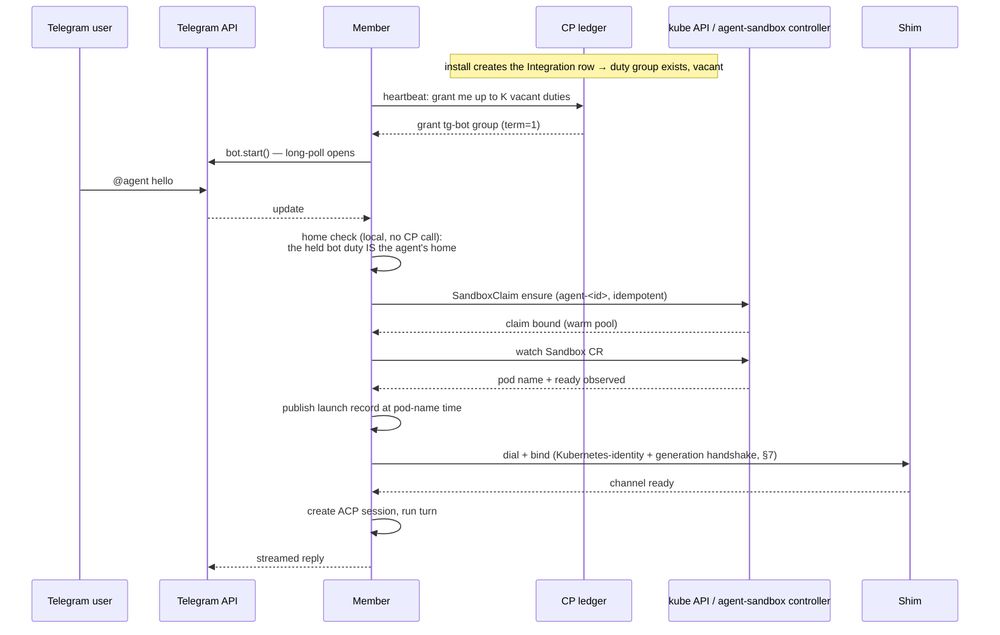

# The K8s Daemon Pool: Multi-Org Daemons and the Duty Ledger

**Status:** The ownership mechanism is implemented (control plane, daemon,
relay, protocol) and enforcement is unconditional: an install-wide (frame-scope)
member is duty-governed, an org-scoped daemon is not, and there is no switch
between them. The remaining build order is the tracking issue
"K8s daemon pool — implementation plan and tracking". This document states the
design and marks what is not yet built; file references are given so every
claim can be checked against the code.

## 1. Problem

The model this replaces provisioned **one daemon Deployment plus one
ReadWriteOncePod PVC per org**: an operator reconciled an `AgentConnectOrg` CR
into a roughly fifteen-object envelope per org — namespace, service accounts,
RBAC, NetworkPolicies, quota, warm pools, the state PVC, the `replicas: 1,
strategy: Recreate` Deployment, and the shim Service — and per-tier warm pools
added more. The CR, the operator that reconciled it, and the control plane's
envelope provisioner were deleted outright rather than migrated (#964): the only
envelopes that ever ran belonged to disposable test organizations, so a
migration path would have been machinery written for an empty set. The costs
below are why the model went.

Four costs grow with org count:

1. **Idle burn.** An org with zero traffic still runs a full daemon pod 24×7.
   Agents already sleep (idle sweep + sandbox suspension, `sweepIdle` in
   `packages/daemon/src/daemon.ts`), but the daemon itself cannot.
2. **Object sprawl.** Kubernetes object count, PVC count, and watch/reconcile
   load scale linearly with orgs, most idle at any moment. The per-org **warm
   pool** is the sharpest case: a warm pool scoped to one org can only ever
   pre-warm for that org, so at scale each org either burns idle warm pods or
   sets `warmReplicas: 0` and gets no warm benefit at all.
3. **Upgrade blast radius.** A daemon image bump is a `Recreate` rollout of
   _every_ org's singleton pod — every org's platform connections drop, every
   org's in-flight turns die, simultaneously.
4. **The daemon can never stop.** It holds the org's platform ingress (Slack
   Socket Mode, Telegram long-poll, Discord gateway). Stopping it means going
   deaf; this is why daemon scale-to-zero was never viable (R1).

The fix is not to make per-org daemons cheaper. It is to remove the per-org
daemon as a unit of deployment: a fixed-size pool of multi-tenant daemon
**members**, where **agents sleep and daemons do not**, and where everything
that must be held by exactly one member is a claimable **duty** in one ledger.

## 2. Core principles

**P1 — Ownership follows ingress.** An agent runs where its ingress duty is
held. The duty holder **dials** the agent's sandbox (daemon → shim). Ingress
and execution are therefore co-located _by construction_: there is no
cross-member forwarding path for platform messages, and none is needed. This
single principle deletes the entire family of forward-hop, presence-sync, and
MOVED-redirect mechanisms rejected in R4.

**P2 — One ownership mechanism.** Every exactly-one responsibility — a
Telegram polling loop, a Slack socket, an agent's home — is a claimable
**duty** in a single ledger. Members _volunteer_ (claim); nothing ever
assigns. The control plane hosts the ledger and arbitrates claims
transactionally, but never chooses holders. This preserves the house rule that
already rejected CP placement authority (R3): facts flow down, claims flow up,
arbitration sits in the middle.

**P3 — Plane split.** Facts and the duty ledger live in the **control plane**
(the CP and its own Postgres, where `Bot`/`Integration` rows already live).
Message content and session state live in the **data plane** (shared tables
carrying an `org` column, with the org injected at the store-handle layer —
[cloud-data-plane-postgres.md](cloud-data-plane-postgres.md)). The CP never
connects to the data plane; members bridge the two. This is the pool-scale
restatement of the existing invariant that the CP stores only control-plane
metadata, never message bodies.

**P4 — Fencing by a monotonic token at the edges, by ownership at the store.** Every claim
carries a CP-minted monotonic **term**, and the ledger arbitrates every claim on
`(holder, term)`. At the sandbox the fencing token is the **binding generation**
rather than the term (§7) — a different monotonic counter over the same ordering,
so the edge is fenced without the term reaching the shim. The database arm is spelled differently — a data-plane write
carries no term (§11). A stale ex-holder is stopped there by the duty gate before
it reaches the statement, by row ownership wherever it holds a claim, and by a
race-safe statement wherever two members may both legitimately write. So it is
still fenced everywhere it could do harm — at the sandbox, at the database, at
the ledger — with the term generalizing the existing `sessionEpoch`/`launchId`
discipline to pool membership.

### Decision summary

| #   | Decision                | One line                                                                                                                                                                                                      |
| --- | ----------------------- | ------------------------------------------------------------------------------------------------------------------------------------------------------------------------------------------------------------- |
| D1  | Pool shape              | Fixed-size plain Deployment of multi-tenant members; manual scaling; members never sleep                                                                                                                      |
| D2  | Sleep                   | Agents sleep (existing sandbox suspension); wake = existing `SandboxClaim` flow; no new machinery                                                                                                             |
| D3  | Connection direction    | The duty holder dials the sandbox; the shim is a hardened listener; one NetworkPolicy ingress-rule amendment                                                                                                  |
| D4  | Member anatomy          | Singleton machinery + per-agent rooms + thin refcounted org contexts; the session stays the atomic unit                                                                                                       |
| D5  | Duty group              | The claim unit is the connected component of the agent↔daemon-held-bot graph — every agent is a node, so an edgeless one is its own singleton — claimed atomically under one term                             |
| D6  | Lease service           | CP-hosted `duty_group` ledger over the fleet WS, with a derived membership projection; vacancy grant = the claim call                                                                                         |
| D7  | Lease timing            | Batched renewals; T_fence self-fence < T_reassign; startup recovery grace                                                                                                                                     |
| D8  | Cross-member paths      | `rd/agentmsg` stays A2A-only; the rendezvous adds a `not_holder` NAK on the inbound `rd/msg` path; no redirects, no presence streams; the ledger is the directory                                             |
| D9  | Org context on the wire | Install-wide connection with per-frame `orgId`; reconnect state is a combined multi-org snapshot / revision-fenced stream — no per-org subscription, room, or socket                                          |
| D10 | Crons                   | A time-based trigger against a group that is already proactively claimable (D5), so a schedule always has a home; the holder fires it locally with today's daemon machinery                                   |
| D11 | State                   | Separate data-plane PG, shared tables with an `org` column (org injected by the store handle, never by call sites); one daemon-owned store surface over SQLite and PG drivers — synchronous, not async (#958) |
| D12 | Upgrades                | maxSurge 100%, maxUnavailable = 0; drain = draining bit + acknowledged per-group duty release + sleep-as-migration                                                                                            |
| D13 | Failure model           | Explicit matrix; two accepted loss windows                                                                                                                                                                    |
| D14 | Capacity                | Member self-gating at claim time; CP alarms on vacant-duty age; no scheduler                                                                                                                                  |
| D15 | One binary              | Composition-root profiles differ by capability knobs, never a mode flag                                                                                                                                       |
| D16 | Isolation               | The shared pool is the default; an oversized or noisy workload moves to a dedicated daemon                                                                                                                    |
| D17 | Kubernetes footprint    | No per-org Kubernetes objects for pooled orgs: one shared sandbox namespace, tier-shared warm pools, label-scoped policies — so the operator, the org CR, and the CP's cluster credentials all retire         |
| D18 | Migration               | There was none: the envelope model was deleted outright, since the only envelopes that ever ran belonged to disposable test organizations                                                                     |

## 3. Pool anatomy (D1, D4)

The pool is a plain Kubernetes **Deployment** — explicitly not a StatefulSet
(R11) — of N identical daemon members, manually scaled. Occupancy alarms fire
when the ledger shows aged vacant duties or members near their duty budget; a
human adds or removes members. Members never sleep; they are the always-on
substrate that lets everything else sleep.

Each member is composed of three layers:

- **Singleton machinery** — relay and CP links, heartbeat, the claim/renew
  loop, and the sandbox dialer: today's `Daemon.start()` connective tissue
  minus the assumption of one org.
- **Rooms** — one per _agent_, not per org (R14): the agent host, its sandbox
  connection, ACP sessions, turn queues, and streaming state. The room is
  where the existing session machinery lives unchanged. A session remains the
  atomic unit: single home, serial turns, fenced by the existing
  `sessionEpoch`/`seq`/`launchId` discipline.
- **Org contexts** — thin, refcounted: a config snapshot and an org-scoped
  store handle. Created when the first room or duty for that org appears;
  dropped when the last user releases it. The org is deliberately reduced to
  shared context, because ingress and execution granularity is per-agent or
  per-bot, never per-org.

**Identity is per Pod, not per org.** Each Deployment Pod authenticates with
an audience-scoped, Pod-bound Kubernetes ServiceAccount token; TokenReview
establishes the subject and Pod UID, and each Pod gets its own org-less daemon
row and a stable `daemonId` for that Pod lifetime
(`packages/control-plane/src/cluster/daemon-identity.ts`). The daemon↔CP
WebSocket is install-wide with `orgId` carried per frame (`organizationMode:
'frame'`); there is no org room, org-specific connection, or per-org
subscription (D9).

**Both halves of the reviewed subject are load-bearing.** The ServiceAccount
name plus namespace establish install authority — an identity presented from any
other namespace is refused, so "may serve every org" never follows from a pod
merely holding the ServiceAccount name — and the attested
`authentication.kubernetes.io/pod-uid` establishes which member; a token without
that Pod binding is refused outright. The pair is the member row's unique key,
so a container restart inside the same Pod keeps the record while a
**replacement Pod gets a new `daemonId`** and the predecessor's row lingers:
org-less, never reachable again, and nameable by no organization's `DELETE
/daemons/:id`, which is why retiring it is `PoolMemberReaper`'s job (§4). The
relay hop asks the same question from the other end — `rd/hello` carries the
projected token, the relay delegates it on `rc/verify(daemon-token)`, and the
control plane requires the member row bound to the reviewed Pod UID.

**API keys are not retired; they are simply not what a member can use.** A
daemon key is bound to one organization and one daemon, which is exactly what an
install-wide member is not, so a member authenticates with the projected token
and nothing else. A daemon with no Kubernetes identity — every daemon outside a
cluster — keeps the key path unchanged, and a token beats a key whenever both
are presented.

**The pool and sandboxes occupy two explicit namespaces.** The daemon Pod's
ServiceAccount namespace identifies the member pool only; `AC_K8S_SANDBOX_NAMESPACE`
names the shared namespace where the runtime plane reads and writes SandboxClaims
and Sandboxes. Each member also receives its Pod UID through the Downward API as
`AC_K8S_MEMBER_ID`; the runtime probe hashes it into
`agent-ac-runtime-probe-<member-hash>`, so simultaneous member startup never races
on one probe claim. Probe claims carry a dedicated label and a 15-minute expiry;
the orphan reconciler (§4) collects an expired one, so a missed teardown cannot
retain a Sandbox and volume forever.

**One member per runtime image actually probes.** The probe describes the image the
pool's SandboxTemplate pins, not the member asking, so members elect through the
shared store: a claim keyed on the image reference, and the winner publishes its
whole answer (the image's runtime table plus the credentialed model results) for
the others to adopt. A pool therefore spends ONE probe sandbox rather than one per
replica, and the member-hashed claim name above is what keeps a genuine election
tie — or a fallback probe — from colliding. The image is the key because it is what
the answer is about: a template bump is a different row, so no member is ever served
a previous image's runtimes, and members mid-rollout simply ask separate questions.
The claim's stale window and a waiting member's patience are ONE number, derived from
a whole sweep's ceiling (a probe pod's cold boot, the image's table, and one
credentialed session per runtime it can ship): a follower that gave up earlier would
claim a sandbox of its own and spend exactly the pods the election saves, so it waits
precisely until the claim it is waiting on becomes retakeable. A holder that dies
therefore costs one slow startup rather than a pool that advertises nothing. A
published answer is adopted only while it is fresh (one hour): an image reference is
not always an immutable identity — a template pinned to a moving tag keeps one key
across rebuilds — and the answer also depends on the deployment's credentials, so a
newly configured provider pair must be able to take effect. Nothing re-probes on a
timer; freshness only decides whether a member STARTING now inherits the answer.

**The control plane carries one bit, not a namespace.** `DAEMON_POOL_ENABLED=true`
says "this deployment runs a daemon pool": the control plane loads its in-cluster
config from its own pod's ServiceAccount (fail-loud outside a pod) and accepts pool
member identities — TokenReview of the projected token, ServiceAccount name plus
namespace — from **its own namespace**, read off the credential that proves it.
Unset means no cluster module and API-key daemon auth only. Naming the namespace
separately was a false degree of freedom: a member is a pod this install places
beside itself, so the key invited an answer that was either the only correct one or a
misconfiguration that failed late, as "identity refused" at registration rather than
at boot. Two earlier spellings — a separate execution-enabled flag, then a namespace
key — were deleted outright rather than aliased, on the same reasoning.

**Org-threading is the end state; instantiation is scaffolding.** The wire
carries the org, the data plane carries the org, and the process interior
converges on the same axis: subsystems take the org as an explicit parameter,
with per-org instantiation of today's single-org classes as the zero-rewrite
transition for whatever is not yet threaded. Locally the parameter is a
constant, so the one-binary story (D15) is unchanged.

## 4. Agents sleep, daemons do not (D2)

**What "asleep" means, precisely.** Sleep is _suspension_, not deletion:
`sweepIdle` → `suspendIfIdle` sets the sandbox operating mode to `Suspended`
(`packages/daemon/src/k8s/driver.ts`), and **the `SandboxClaim`, the
`Sandbox`, and the workspace volume all survive**. Claim deletion is a
separate path that destroys the volume with it. So a sleeping agent has
released its compute — no running container, no connection, no in-memory room
on any member — while keeping its durable identity and workspace in the
cluster. Anything that would "recreate" a sandbox must go through
suspend/resume, never delete-and-claim-again, or it silently deletes the
agent's work.

**Sleep is the holder's decision, and the holder is the only member that
knows the launch.** A member's launch record (`K8sDriver.launches`) is scoped
to the duties it holds: gaining an agent re-derives the launch from the cluster
(claim → bound Sandbox → mode, recording only a Running pod), losing it — a
revoke, a self-fence, a drain release — forgets the launch, its shim channel,
its tunnel proxy and any loss watch without touching the claim. The idle sweep
suspends only agents this member holds, and floors idleness at the time it
took the launch when the shared store records no activity. So a Running pod
has exactly one member that owns its idleness, an ex-holder can never suspend
a successor's pod, and a rollout leaves no pod without a candidate to suspend it.

**An open console page can hold a pod against the sweep, for as long as it is
looking.** The sweep's clock is MESSAGE activity, which is the right rule for a
conversation and the wrong one for a page: a session whose worktree holds
uncommitted edits, or whose pull request is armed to merge when ready, has live
state in that pod that a suspend throws away — the edits go with the volume's
process, and the in-pod merge watcher
([webchat-side-panels.md](webchat-side-panels.md) §M6) dies with it. So the
session page renews a LEASE (`POST /sessions/:id/sandbox-keep-alive` →
`sandbox/keepalive` → `k8s/sandbox-hold.ts`) while its document is visible, and
`sweepIdleSandboxes` skips a POD whose lease is live. The lease is keyed by
sandbox SUBJECT, so a page watching an isolated session's worktree holds that
session's own pod and neither the agent's nor a sibling session's (§11); an armed
merge watcher is a process in the agent's pod and holds that one, whatever
worktree the page is looking at.

Three properties make that safe to hand a browser:

- **The daemon decides, never the caller.** The page asks; the daemon reads the
  worktree's own dirtiness and its own merge-when-ready registry
  (`cp/sandbox-keepalive.ts`). A caller that could assert "dirty" could pin a
  pod indefinitely, and this answer authorizes cost.
- **A lease, not a switch.** There is nothing to release: renewals stop when the
  page closes, the tab goes to the background, or the machine sleeps, and the
  hold lapses within one TTL (180 s, several times the 60 s renewal cadence, so
  one dropped poll never suspends a pod out from under a page still watching).
  Document visibility is the same fence the dock's polling uses — a page that
  stops refreshing is a page that stops holding. A clean tree with nothing armed
  RELEASES rather than lapses, so committing makes the pod suspendable on the
  sweep's own schedule.
- **A suspended pod is held, never woken.** Keep-alive reads nothing from a pod
  that is down and answers `asleep`. Resurrecting a sandbox from a keep-alive
  poll would invert the rule the sweep exists to serve. The pod judged for the
  tree is THIS page's — the one that owns the worktree it is watching — because
  "any pod of the agent is up" would let a bound agent pod carry the poll into a
  status read that the routed runner then serves by waking a suspended session
  pod. And it is HELD across that read rather than only checked before it: the
  idle gate reads its holds synchronously, so the hold excludes the sweep instead
  of racing it. The two facts are judged **independently**, one pod each, so a
  page whose session pod went to sleep still holds the agent's pod for a watcher
  armed in it — otherwise a visible page would silently disarm its own box.

Nothing about this is persisted anywhere — not in the CP, which only relays the
frame, and not on the pod's volume. A daemon restart forgets every lease, and
the page's next renewal re-takes the one it still wants.

A sleeping agent still belongs to a duty group (§6), and if that group
contains a daemon-held bot the group stays claimed while the agent sleeps —
that held duty is precisely what lets the wake message arrive. A singleton
group with no daemon-held bot carries no connection to keep alive, so it may
sit vacant until a trigger arrives — but the group itself exists either way.

Wake is the existing spawn flow: whichever member needs the agent creates the
`SandboxClaim` idempotently (`SandboxApi.ensureClaim`, deterministic name
`agent-<agentId>`); the out-of-band agent-sandbox controller materializes the
pod, adopting from the runtime tier's shared warm pool when one is available;
`bindChannel` patches the operating mode to Running and publishes the launch
record at pod-name time — and the holder then dials the shim and binds at its
term (§7). Cold, warm, and resume paths are already distinguished and metered
(`LaunchTimer.observedPath`). **No new wake machinery exists here.**

**One pod per session, beside the agent's
([git-workspace-model.md](git-workspace-model.md) §11).** An isolated session on a
pool member is the confined tier, so its host launches into a pod of its own: the
claim is `agent-<agentId>-<16 hex of the session leaf>`, its pod labelled
`agentconnect.md/agent` AND `agentconnect.md/session` (the leaf,
`session-<24 hex>`), and the same labels ride the claim's own metadata so a
successor member can list an agent's session claims without knowing its
sessions. The session's clones and HOME live on that pod's volume under
`<mount>/sessions/<leaf>/`; the agent pod keeps the primary checkout, the
secondary roots and managed memory, and a session runtime binds and holds it as
its companion for the runtime's life, so a running runtime still implies a
reachable agent pod. Every workspace path is routed to the pod that owns it,
read off the **path** rather than off the live-launch registry, so a suspended
session pod stays addressable; a read that names one RESUMES it, only beside a
bound agent pod and only onto the claim whose uid the router just observed. The
resume creates nothing: the observation and the wake are two round trips, and the
uid is re-judged against the object after that gap, so a retirement landing in
between refuses instead of claiming a fresh empty volume for a session that no
longer has one — a read can lose a race with a retirement, never win one.
Sleep is per pod — a quiet session pod suspends on its own session's activity
while its siblings and the agent pod stay — and the claim goes with the
session's row: retention deletes it (volume and all) once the clone has passed
the dirty and unique-commit rules, a replaced workspace retires every session
pod of the agent **when its conversion runs on the volume** — not when the edit
is activated, which precedes the acknowledgement and has no rollback that
reaches a pod's volume — sparing the leaf then being prepared, whose own
directory is emptied so it clones afresh, and agent removal deletes them all. Shared-isolation sessions
are unchanged: one pod per agent, in the primary checkout. Admission still
counts agents (`maxAgents`); session pods are bounded by session admission and
the idle sweep.

### Orphan reconciliation

Teardown is best-effort and a member can die mid-way — a rollout, an OOM, a
node loss — leaving a `SandboxClaim`, a `Sandbox`, or a probe claim that no
process still intends to remove. Rather than one durable obligation per
failure mode, a single **orphan reconciler**
(`packages/daemon/src/k8s/orphan-reconciler.ts`) sweeps the sandbox namespace.

**It is a CronJob, not a timer.** The deployment runs
`agentconnect-daemon reconcile --once` on a schedule (every 10 minutes) with
`concurrencyPolicy: Forbid`: one shot per run, and the cluster — not the daemon
— owns the cadence, the mutual exclusion a lease used to provide, and the
failure reporting a non-zero exit already gives an operator. The Job uses the
daemon image, the pool members' ServiceAccount, and the same namespace and
warm-pool environment they read; the members themselves run no sweep and hold
no scheduler state for one. The job connects to the control plane as an
**observer** (`register.observer`): the same projected identity a member
presents, admitted on the same TokenReview path, but enrolled in no member set
— so the duty ledger can never grant work to a process whose only job is to
sweep — and marked so the pool-member reaper retires its row promptly.

**What it collects.** It lists the claims and Sandboxes that carry the
install's agent label (`agentconnect.md/agent` on the pod metadata), asks the
control plane in **one batched read per run** which of those agent ids still
exist (`agent/exists` → `agent/exists/ok`, install-wide, advertised as the
`agent-exists-v1` server feature), and deletes only what is provably orphaned:

- a claim whose agent the control plane no longer knows, on an object at least
  the grace period old (default 10 minutes);
- a probe claim past the window the probe stamped on it;
- a Sandbox no claim binds, whose agent the control plane no longer knows,
  under the same grace;
- a session pod (`agentconnect.md/session` beside the agent label,
  [git-workspace-model.md](git-workspace-model.md) §11) whose agent lives but
  whose session row is gone from the shared store, under the same grace — the
  job asks the store once per run, and a session nobody can answer for (no
  store mounted, a read that failed) reads as live.

**Safety rules.** An object of a live agent is never touched, a claimless
Sandbox included — deleting a claim deletes the workspace volume and is
irreversible, so a stray of a live agent is reported, not collected. An id the
control plane cannot be asked about and an object without a readable age skip;
a run whose control-plane read fails collects nothing and exits non-zero. The
grace is the OBJECT'S OWN AGE, which is the clock that matters — no in-flight
creation can still be racing the control plane's write — and the only one a
one-shot job has, since it keeps no memory of an earlier run. Every delete
carries the UID and resourceVersion from the LIST snapshot, so a same-name
replacement created after the list is never the object deleted. Each run logs
one summary line (candidates, orphaned, deleted, skipped-live, skipped-grace,
failed).

**The admission fence.** A session row's absence is a snapshot, and a session
can come back between that read and the delete — its admission REUSES the
leaked claim rather than creating one, so neither the object's age nor a
same-name replacement check would notice. So admission and collection share the
claim's own version. `ensureSandbox` stamps every claim it takes with
`agentconnect.md/last-admitted-at` (on the claim's metadata, never in its spec
or its pod's, so warm-pool adoption is untouched), and `ensureClaim` WRITES that
stamp even on the path that only reuses an existing claim. Two things follow: the
grace runs from the later of creation and last admission, so a re-admitted claim
is young again and no candidate at all; and the stamp's write moves the claim's
resourceVersion, so an admission that landed after the sweep listed the object
makes its preconditioned delete fail — reported as "replaced since it was
listed", with the pod and its volume left alone and the next run re-deciding.
A second uncoordinated row read would only have narrowed that window.

**Dry run by default.** The reconciler ships reporting only; deletion is
enabled per deployment with `AC_K8S_ORPHAN_DELETE=true` after an observation
window in which the summary lines show it collecting exactly what an operator
would (`AC_K8S_ORPHAN_GRACE_MS` tunes the grace). It replaced the dedicated
probe-claim GC, and agent removal's sandbox teardown is best-effort because of
it: `discardAgent` deletes the claim once and logs a failure, and the
reconciler collects the leftovers.

**The store half: one rule table.** Row retention across the daemon store used
to be scattered — a private constant and a `DELETE … WHERE … < x` wherever each
table's writer happened to live, so "how long do we keep X" had as many answers
as there were writers, and a table nobody remembered simply grew. All of it is
now declarative data in `packages/daemon/src/store/retention.ts`: one rule per
table (`{ table, key, clock, where?, agentColumn?, ownerColumn?, horizonMs,
foreignHorizonMs? }`), one sweep loop, one summary line. A rule's `clock` ages
the WORK, not the attempt — the stamp a new obligation writes (`purgedAt`,
`queuedAt`, `completedAt`, a cache's `observedAt`), never a lease a retry
refreshes, because a receipt no control plane will ever accept is re-claimed on
every drain and ageing it on `claimedAt` would make exactly the rows retention
exists for immortal. The sweep composes both the SELECT and a re-fenced DELETE
from the rule, and the clock rides the DELETE, so a rule whose clock moves on new
work never collects an obligation renewed in between.

Two proofs collect a row:

- **horizon** — the row has been owed for the rule's window. This is plain
  retention, it is what the routines the table replaced already did, and it is
  always on. Windows differ per rule because they always did: 7 days for a
  per-member outbox, 30 for a session-purge receipt (the only record that a
  transcript was deleted) and for the model-catalog cache, 1 day for terminal
  memory captures and settled activation records. `AC_STORE_RETENTION_SCALE`
  moves all of them together.
- **agent gone** — the control plane no longer knows the row's agent, so no
  member can ever drain it. This needs the batched `agent/exists` answer the
  cluster half already asked for, so only `reconcile --once` can apply it, and
  it ships dry-run behind `AC_STORE_ORPHAN_DELETE=true`.

`ownerColumn` carries the third case: a row written by a process that is not the
sweeper. An `ownerId` dies with the process that minted it, so the catalog rules
reclaim a departed member's cache on the shorter `foreignHorizonMs` while a live
member keeps its own on the long one — which is what the hand-written catalog GC
used to express with two cutoff arguments.

**Two callers, one table.** The daemon runs the rules age-only against its own
store, so a local single-daemon install keeps exactly the retention it had —
retention was never about ownership there. That pass is synchronous and has its
OWN hourly timer, not the idle sweep's: idle reclamation is a knob an install may
switch off, and every table would then grow without bound. It also runs once at
startup BEFORE the model-catalog cache is hydrated, so a catalog past its window
is gone before anything reads it rather than being advertised for another month.
The pool's `reconcile --once` CronJob runs the same rules with the control-plane
read as well, which is the half only a shared store needs, and owns no rows
itself, so every rule falls back to its conservative window.

**What it replaced.** `pruneSessionPurges` and its 30-day constant;
`gcRuntimeCatalog` and its two cutoffs; the terminal-row purge inside
`expireMemoryCaptures` (and the `terminalRetentionMs` option and maintenance
deadline behind it); the settled-record delete inside `expireActivations` and
`ACTIVATION_RETENTION_MS`; and the hook outbox's "keep a permanently
unreportable row forever" rule, now bounded by a horizon. Adding retention to a
table is a rule, not a function.

**What deliberately stayed, and why.** A routine is not retention when it is a
state transition, a lease recovery, or a real-time cap:
`expireMemoryCaptures`'s remaining half redacts a live capture and emits a
metric; `pruneRuntimeModelCaps` is the set-difference of one successful
discovery; `recoverMemoryCaptures` / `recoverPermissionRequests` are ownership
takeovers; the session TTL close and retention GC delete worktrees and emit CP
receipts; `loop_guard`'s cleanup rides the charge statement and its cutoff is
the caller's window parameter, not a horizon; and the per-agent caps on
permission-request history, acknowledged hook receipts, and memory `.history`
entries bound a UI surface on every write, with no age and no owner. The
in-process set that keeps a peer's rejected hook report out of THIS daemon's
drain also stays: it is live-loop protection, not retention — the rule bounds
how long the row survives, that set bounds how often it is retried meanwhile.

**The control-plane counterpart.** Retiring a pool member also leaves rows the
delete no longer cascades away. `WebchatMcpDelegation` is keyed on the agent
since the placement-resolver change, so a retirement leaves live-looking
delegations for agents nothing serves. `PoolMemberReaper` revokes them at the
end of each sweep (`revokeUnplaced`), with the predicate spelled as exactly
`PlacementResolver.servingDaemons(agent) === []`: neither placement column
names a target and no unexpired duty lease holds the agent. No dry run there —
the rows are already inert, since the live authority check answers
`placement_mismatch` on every use, so the write only records what is true and
lets the existing expiry reaper count them correctly.

## 5. The duty ledger and lease service (D6, D7)

**The CP is the ledger.** Members claim, renew, and release duties over the
existing fleet WebSocket; the CP transacts against its own Postgres, alongside
the `Bot` and `Integration` rows it already owns.

**The ledger is a `duty_group` table, not columns on existing rows.** Per-row
leases cannot express the claim unit of §6: they are exactly the independent
claims that would give one agent two homes, a botless agent has no
`Integration` row to carry a lease at all, and two already-held groups merging
have no row on which to record the single surviving holder. The shape
(`packages/control-plane/prisma/schema.prisma`, repo in
`persistence/repositories/duty-group.repo.ts`):

- `duty_group` — `(orgId, holder, term, expiresAt)`, one row per connected
  component, the only thing ever claimed.
- `duty_group_member` — the derived `(agentId|botId → group)` projection,
  recomputed from the org's `Agent` and `Integration` rows whenever an agent or
  an edge changes; its composite primary key makes "one home per agent / per
  bot" a database invariant.

**`term` is the fencing token**: monotonic per group, bumped on _every_ grant
and never on renewal. **Vacancy is temporal**, not referential: a group is
grantable when `expiresAt` has lapsed (or it was never claimed / explicitly
released); a dead member simply stops renewing, and `holder` deliberately
carries no foreign key — a row-level `SetNull` would vacate without a term
bump while fencing always reads `(holder, term)` together.

**Vacancy discovery and claiming collapse into one call.** A member's
heartbeat asks "grant me up to K vacant duties", capacity-gated by the member
itself (D14). `claimVacant` is one CAS statement (`FOR UPDATE SKIP LOCKED`):
racing claimants take disjoint vacancies, first valid claim wins, and the
grant's row locks hold until the returned `(term, members)` snapshot is
assembled so a concurrent recompute can never pair an old term with rewritten
membership.

**Composition changes are re-grants, not evictions.** The recompute
(`orchestrator/dutyGroup.ts` + `dutyRecompute.ts`) is plan-then-apply in one
transaction under a per-org advisory lock plus row locks. The pure planner
assigns group identity deterministically — existing groups are consumed in
(held, larger, lower-id) order and take the component holding most of their
former members — which makes "the holder of the larger group keeps the merged
group, ties broken by the lower groupId" a corollary, lets splits follow the
largest fragment without eviction, and names every superseded holder in the
plan. The sweep walks orgs on a keyset rotation; a coalescing `kick(orgId)`
runs the same recompute promptly from the mutation seams (agent create/delete,
integration create/delete, cron upsert/remove, placement moves), with the
rotation as the backstop.

**The lease protocol rides the existing heartbeat.** Not a new connection,
timer, or tick (`orchestrator/dutyLease.ts`):

- **Renewal is the heartbeat** — one batched, term-preserving expiry refresh
  per frame. A lapsed-but-unclaimed lease still renews, so a CP outage shorter
  than the reassign window is a non-event.
- **The digest diff is the reconnect crossing point**: confirm the terms or
  supersede, never both. A held group missing from the member's digest
  (restart, lost EVT) or present at a stale term is re-issued as a
  `duty/grant` entry — an entry _replaces_ its group daemon-side, so both
  cases converge through one path. A digest entry the ledger no longer grants
  is revoked (`superseded` | `gone`), classified after the vacancy claim so
  the grant and revoke sets are disjoint by construction.
- **Grant emission is chunked** (entries per frame plus a member-ref budget).
  A component larger than `DUTY_GRANT_MEMBERS_MAX` is not deliverable on this
  wire at all: it is never claimed (a size gate inside the vacancy predicate),
  an unserved oversized lease vacates rather than renewing forever, and a held
  one that grows past the cap is superseded — the honest signal that the group
  belongs on a dedicated daemon (D16).
- **One per-daemon lane serializes every ledger touch**, reserved
  synchronously at dispatch so lane order is the daemon's frame order:
  overlapping beats cannot double-spend headroom, and a `duty/release` queued
  behind a running exchange guarantees every grant that exchange emitted
  reaches the daemon before the release ack.

**Timing (D7).** Three constants govern liveness:

- **T_fence** — a holder that cannot renew for T_fence **self-fences**: it
  tears down the affected duties, including their platform connections. Sized
  to cover a routine CP deploy. Implemented daemon-side: the client tracks a
  per-group deadline and calls `Daemon.fenceDuties`, without which a partitioned
  ex-holder could still serve a group a successor has claimed.
- **T_reassign > T_fence** — the CP treats a duty as vacant only after
  T_reassign without renewal, guaranteeing the old holder has self-fenced
  before a successor can claim.
- **Recovery grace** — a freshly booted CP suppresses vacancy grants for one
  full T_reassign, so a CP restart cannot misread quiet members as dead;
  renewals are unaffected. (Implemented.)

**The duty term and `sessionEpoch` are independent fencing domains.**
`sessionEpoch` is minted per daemon at auth and fences control frames from a
stale connection generation; the term fences actions by a member that is no
longer the holder. Every reconnect bumps `sessionEpoch` — so a term derived
from it would churn every duty in the install on each CP deploy, which is R7
through a side door. The acceptance property: restart the CP, watch every
`sessionEpoch` bump, and no duty term moves and no platform connection drops.

**Two consciously accepted trades:** (1) a sustained CP outage longer than
T_fence tears down daemon-held ingress pool-wide — members cannot distinguish
"CP down" from "I am partitioned and a successor is being appointed", and the
loss is bounded by the platforms' own buffering; (2) duty failover after
member death is ~T_reassign, not the ~30s a data-plane-anchored lease would
give — the price of R6's mechanism deletion. Failover latency is a tunable;
mechanism count is forever.

## 6. The duty group: what is actually claimed (D5)

| Group shape                                           | Members                         | Why                                                                                                            |
| ----------------------------------------------------- | ------------------------------- | -------------------------------------------------------------------------------------------------------------- |
| Agent with agent-bound bots (Telegram, Discord)       | `{agent, bot…}`                 | Ingress and execution co-located by construction                                                               |
| Shared daemon-held bot (Slack Socket Mode, Feishu WS) | `{bot, …every agent it serves}` | One socket per bot token — its agents cluster at the socket's owner                                            |
| Agent with an enabled cron                            | `{agent}`                       | A cron needs a home like any other trigger; the singleton below already is one, so the schedule always has one |
| Relay-ingress-only / webchat / A2A agent              | `{agent}`                       | A singleton, derived by the recompute — every agent is ownable, so it is proactively claimable                 |

**Every agent is a node.** The component set is seeded from the org's `agent`
rows and then merged by edges; an edge only forces **co-location**, it is not
what makes an agent ownable. Edges come from active `Integration` rows whose
bot has `transport: 'socket'`; relay-ingress (`http`) integrations create no
edge because the relay, not the daemon, owns that socket. Crons need no input
of their own — a cron's agent is an agent. An oversized group is the mechanical
signal for a dedicated daemon (D16).

Deriving the singleton rather than minting it on first contact is what keeps
the ledger self-consistent: an edgeless agent used to appear in **no** computed
component, so the recompute's final "delete every group no component claimed"
pass reaped the singleton the activation rendezvous had just minted, and the
next trigger minted it again — a grant/revoke loop that interrupted the agent's
in-flight turn on every sweep. The cost is one `duty_group` row per agent per
org, most of them permanently vacant in a deployment whose agents live on
org-scoped daemons; vacancy is cheap by construction (§5) and the eligibility
gate filters those rows out inside `claimVacant` — a machine-placed agent has
exactly one eligible holder and it is never a pool member — so they consume no
grant budget.

**Placement says who MAY hold a group; capability says who CAN serve it, and
both gate every claim.** A daemon resolves an integration's config through its
own platform-module registry and fails closed on an id it has no module for: it
skips the integration and opens no connection. So a member running an older
image that claims an agent whose integrations name a newly added platform takes
that surface dark with no error anywhere, until the group moves again — a
window every new platform's rollout opens. The claim paths therefore also
require the group's active-integration platform set to be a **subset of the
member's advertised `capabilities.platforms`** (the register handshake's list,
the same one the install-time gate reads), stated once as SQL and carried by
`claimVacant` and the rendezvous alike. It is fail-closed on both sides: a
member whose capabilities carry no platform list advertises nothing, and a group
no live member can serve stays vacant rather than being served by a member that
would silently drop it. An agent with no active integration requires nothing, so
webchat, cron and A2A singletons never meet the gate. Passing an agent over is
otherwise invisible — the claim simply matches fewer rows — so a member that
left claim budget unspent logs one line per passed-over agent naming the
platform ids it lacks. Deliberately NOT folded into the placement fence: a
capability read that failed closed at fence time would tear down live service,
where the same read at claim time only delays a placement.

**The gate rides each grant statement, at that statement's own scope.** A duty
group is a connected component, so it can hold several agents joined through a
shared socket bot: what a member must serve to take one is the whole group's
requirement, never the requirement of whichever agent a trigger happened to
name. So the vacancy claim and the rendezvous's take of an existing group both
carry the **group-wise** predicate, and only the one place that mints a fresh
singleton — the rendezvous's fallback for an agent no sweep has grouped yet —
carries the **agent-wise** one, because there the group is that agent. Gating
the rendezvous at its entry instead, on the triggered agent alone, would let an
old image that serves that agent take a group containing a peer it cannot, which
is the dead surface this gate exists to prevent; it would also answer before
reading the group, and a refusal that names no incumbent costs the relay the
one-hop re-route the rendezvous below is built on. An idempotent re-claim by
the member already holding the lease takes nothing and is not gated, for the
same reason the placement fence is not.

### The activation rendezvous

A trigger for an _unheld_ group has nowhere to go — the ledger names no holder
for a group nobody has claimed. The resolution keeps members volunteering and
adds no component: the relay routes the trigger to **any connected member**,
and that member claims the group on receipt. The claim normally lands on a
group the recompute already derived; minting one is the fallback for the window
between an agent's creation and its first sweep.

- The daemon's `rd/msg` handler checks its duty registry (one gate covers all
  four message sources). On a miss it sends `duty/claim`; a win returns a
  grant installed exactly like a `duty/grant` EVT and the message re-enters
  normal dispatch; a loss answers the relay with a typed **`not_holder` NAK
  carrying `holderDaemonId`** — the incumbent it lost to, as the CP named it.
- A claim is refused locally, without asking the CP, while draining or at zero
  headroom — a full or draining member must not volunteer.
- The relay re-sends the **same `msgId`** to the named holder **once**: the
  holder's own dedup protects against double delivery, and a second refusal
  terminates rather than chasing a stale ledger.
- A refusal the relay cannot resolve — no holder named, the holder not
  connected here, the redirect target refusing in turn — is a **counted
  drop**, deliberately not a claimed retry: HTTP ingress has already
  acknowledged and deduplicated the provider callback by then, so nothing
  upstream will present the message again. Bounding that window is the
  ledger's job (vacancy plus the recompute), not the router's.
- The NAK verdict is not cached in the daemon's ack-dedup map, so a later
  grant never replays a stale refusal.
- **A platform interaction takes the same road as a message.** A status-modal
  button or a card action carries the member the routing projection last
  recorded, which after a rollout or a rebalance is either gone or no longer the
  holder — and nothing retries, because HTTP ingress acknowledged the provider
  callback long before the ack came back. So the relay forwards interactions
  through the rendezvous too, and the ack it answers the platform with is the
  true holder's, `response` body included, which is what a Slack modal and a
  Feishu toast need. A refusal it cannot place is a counted drop like any other.
  Webhook hook dispatch deliberately stays off this path: it has its own
  connection-retry loop and reports a rejection upstream as a delivery status.

When the ledger still names a holder that has died but not yet gone vacant,
a re-route lands on a dead connection and fails the same way — a counted drop,
part of accepted window 2 (§13), bounded by T_reassign plus the recompute. No
internal retry exists behind that drop; if the window ever needs to be
narrower than the platforms' own buffering makes it, the close is a
relay-owned durable retry, which is deliberately future work rather than an
implied property. Crons never reach this rendezvous: a cron-bearing group is
proactively claimable, so it always has a holder by the time a fire is due.

**A cross-daemon peer wake (`rd/agentmsg`) does not take the rendezvous; it
waits it out.** Its sender is a daemon, not a provider callback, so it can be
told "not yet". The peer directory carries a pool agent nobody may be addressed
at yet — a grant its member has not confirmed in a digest, a lapsed lease a live
member is about to claim — as a **pending** entry (policy intact, no daemon), the
relay answers the retryable **`not_ready`** for it (as does a target daemon
handed an agent it does not run), no hop caches that verdict against the
`deliveryId`, and the source daemon re-sends the same `deliveryId` with backoff
for a few lease horizons before recording it as terminal. Exactly-once holds
because the id never changes: an attempt that landed is replayed from the
target's dedup on every later attempt.

## 7. Ownership and dial-in binding (D3)

Historically the shim dialed out to its org's daemon (`AC_SHIM_ENDPOINT` — the
address was knowable because the topology was per-org). In the pool, the
daemon that should own an agent is whoever holds the duty, unknowable from
inside the sandbox. So **the direction flips: the duty holder dials the
sandbox** (`packages/daemon/src/shim/dialer.ts` dials; `shim/server.ts`
listens in the sandbox). See [cluster-spawn-and-shim.md](cluster-spawn-and-shim.md)
for the spawn machinery this re-choreographs.

The shim is a hardened listener: accept exactly one active connection (a second
dial is refused `4403 unavailable` while one is live, plus one queued slot); on
accept, present its audience-restricted projected ServiceAccount token (the same
`/var/run/ac-identity/token`, audience `ac-daemon-callback`); let the daemon
TokenReview it.

**The edge fencing token is the binding generation, not the duty term, and
supersession is a daemon-side act.** `ShimBindingRegistry.bind()` enforces the
three rules over the generation — the durable, install-shared counter of #1017: a
higher generation supersedes (`superseded_generation` refuses the older one), a
lower one is refused, and an equal generation is accepted only from the same pod
(`generation_claimed_by_another_pod` otherwise), which is what makes an ordinary
transport break recoverable without a generation advance.
`ShimBindingRegistry.authorize()` is the per-operation check on an
already-issued credential — its exact generation, its expiry, its capability —
and binds nothing. The shim
itself inspects no term and never arbitrates between two would-be holders; the
dialer does, dropping its own older dial as `superseded by a newer launch` when a
newer launch record arrives. The duty term stays where it is arbitrated, at the
ledger and at the store.

**Accepted trade-off.** One case is observably different from a term-carrying
handshake: a half-dead ex-holder whose socket is still established when the
ledger has already moved the duty. The new holder's dial is refused `unavailable`
until that socket dies by keepalive or timeout, so takeover is bounded by the
transport timeout rather than immediate.

Be precise about what protects the sandbox during that interval, because it is
**not** the generation: the successor is refused by the listener before its hello
is ever read, so its higher generation never reaches `bind()`, and the requests
still arriving on the old socket carry that socket's own credential at its own
matching generation and pass `authorize()` exactly as they always did. The
generation fences the ex-holder's _rebinding_ once the socket closes. What stops
the ex-holder from doing harm while it lingers is the duty gate on the daemon
side and row ownership at the store (§11) — the same two fences that carry every
data-plane write. That is why the window is acceptable rather than merely short,
and it mirrors the posture just below, where an unreachable sandbox is treated as
a placement problem rather than a protocol one. Plumbing the term into the hello
would close the window; it is deliberately not built, because that delay has not
been observed in practice and the rollouts that looked like it root-caused
elsewhere.

**Authentication is direct Kubernetes identity in both directions.**
TokenReview proves the pod's identity to the daemon; the pre-disclosure
boundary toward the shim is the sandbox-namespace NetworkPolicy (one ingress
rule: pool namespace → shim port) plus member pod identity, with audience
separation preventing a token for one hop from authenticating at another.
**There is no CP-signed shim grant, public key, JWKS document, or key set** —
an earlier revision specified one and it was removed outright: the Kubernetes
identity the pods already carry answers the same question without a CP-owned
key-distribution mechanism.

The binding invariants of the spawn design survive re-choreographed: mutual
authentication; the connection binds to (sandbox UID, pod UID, org, agent,
generation), checked by the dialer against its own launch record; per-operation
capability grants unchanged; the replay fence remains the generation; no
long-lived credential in the sandbox. The single-predicate enforcement style is
retained unchanged, split across the two entry points it always had:
`ShimBindingRegistry.bind()` carries the generation rule and the pod-identity
rule together, and `authorize()` carries the per-operation one.

**Unreachable sandbox:** after N failed dials with backoff, the holder
releases the agent's duty so another member can claim it and dial from its own
network position. Reachability failure is treated as a placement problem, and
the ledger is the placement mechanism.

## 8. The wake path, end to end

A new Telegram message for a sleeping agent — no CP call on the first-message
path, because the held bot duty _is_ the agent's home:

Nothing here is new mechanism: the polling connection is today's
`TelegramConnection`, the sandbox flow is today's
`K8sDriver.ensureSandbox`/`bindChannel` with the dial direction flipped, and
the session machinery is untouched.

## 9. Crons are a time-based trigger, not an input (D10)

An enabled `CronDef` is a standing reason for its agent's duty group to be
held — exactly as a bot connection is. It needs no input of its own: every
agent already seeds a component (§6), so a cron-bearing group is **proactively
claimable** like any other, appearing in the vacancy pool even while its agent
sleeps. The holder loads the schedule with the ordinary daemon-side
machinery (`croner` in `packages/daemon/src/scheduler/scheduler.ts`, its
roster filter following group holdership) and fires it locally; at fire time
the holder is already the agent's home, so the wake is §8 with no routing step
at all. `CronDef.lastRunAt` keeps its advisory, daemon-authoritative
semantics; the dream scheduler is scoped identically.

**The handover window is compensated, not ignored.** A schedule is armed only
while its holder holds the duty, and a freshly constructed `croner` job knows
nothing of a moment that has already passed — so a fire landing between the old
holder unregistering and the new one arming used to run nowhere, silently, on
every rollout. On GAINING an agent, a member now replays the one occurrence its
stamp says ran nowhere: the newest missed moment only (never a backlog), inside
a grace window of one interval capped at an hour, and taken by a CAS on the
stamp row so two members racing the same handoff fire it once. `cron_runs` is
what that stamp was declared for; `dream_runs` is its dream twin.

A stamp is only evidence about the definition it was written under, so both rows
carry a `definition` fingerprint (expression + timezone + enabled) alongside the
timestamp. Schedules are edited in place: "daily, last fired 03:00" then
"switched to hourly at 12:30" would otherwise owe a 12:00 fire the hourly
definition never covered, and a disable/re-enable would owe every moment inside
the disabled window. A catch-up is eligible only when the stored fingerprint
equals the active one, and the reconcile that arms the schedules retires a stamp
whose definition has moved — re-stamping NOW, so the new definition starts clean.
A schedule that is GONE has its row dropped instead: ids are re-mintable, so a
recreated one must start from no evidence rather than inherit the deleted
schedule's last run. A row written before the fingerprint existed carries NULL
and is simply ineligible until its next real fire.

Only the holder writes those rows. They are shared by the whole pool, so a
member that arms nothing for an agent reconciles nothing for it either — a stale
non-holder re-stamping under its own view of the definitions would erase the very
gap the holder is there to compensate. The check is at the write, not only at its
caller.

**The lease is what fixes the offline-cron hole, not a new trigger path.** A
cron whose owning daemon is offline simply does not fire today, and nothing
notices; under the ledger, a dead holder's group goes vacant at T_reassign, a
survivor claims it, loads the schedule, and the next fire happens. An earlier
revision concluded the CP should fire crons and nudge holders; that bought a
CP-side scheduler loop and the retirement of a working daemon subsystem to
deliver what the vacancy sweep already delivers, and was deleted.

## 10. Cross-member paths (D8) and org context on the wire (D9)

The pool has **one delivery topology and one narrow cross-member path**. P1
co-location means a platform message is born at the member that runs the turn
— there is no member-to-member platform-message path because there is nothing
to forward. The single cross-member path is `rd/agentmsg`, serving A2A only;
it is not extended into a platform-message bus (R5). The rendezvous adds a
`not_holder` NAK on the inbound `rd/msg` path (and the same reason on
`rd/agentmsg` for A2A first triggers). There are no MOVED redirects, no dial
hints, no presence streams: **the ledger is the sole directory**.

Org context travels on the frame, not on a subscription. The install-wide
connection carries `orgId` on every org-scoped request, event, control frame
and correlated reply; auth, register, heartbeat, fleet facts, rosters, duty
lease frames and daemon lifecycle frames legitimately omit it — and must, on
that connection. Both peers enforce it with the shared classification in
`packages/protocol/src/frame-scope.ts`: an org-scoped frame without an org, an
install-wide frame with one, an org that does not own the targeted resource,
or a reply that does not carry its request's org is refused with
`SCOPE_DENIED` and never applied (the contract in detail:
[`org-scoped-data-layer.md`](org-scoped-data-layer.md) §4.1). Reconnect state is a
combined multi-org snapshot plus two revision-fenced streams on the same member
connection — deliberately **not** `subscribe(org)`, an org room, or an
org-specific socket. `register/ok` is the snapshot: one install-wide frame (no
envelope org) whose roster is the union pinned-to-me ∪ duty-held across every
served org, each entry naming its own org and each agent spec carrying its
current `Agent.configRevision`, with ownership-aware drop sets for what moved or
was deleted while the member was away; the daemon applies it through the
existing `stale|conflict|idempotent|apply` compare. The streams reuse the
production watermarks rather than inventing new ones: the register-time
visibility replay converges `SessionMeta.visibilityRev` per org over org-scoped
`session/visibility/snapshot` frames on the same connection, and the first
heartbeat's duty exchange re-issues missing or stale-term grants stamped with
each agent's current revision, so the member refetches only frozen bundles.
`packages/control-plane/test/protocol/multi-org-reconnect.test.ts` pins the
end-to-end property: two orgs mutated while a member is away converge through
one reconnect with no org-specific frame shape.

**Platform credentials are duty-scoped; agent secrets stay pointer-based.** An
agent's secrets are materialized at spawn through the shim, but a duty holder
must open a Telegram long-poll before any sandbox exists, so the bot token
cannot ride that path. Credential delivery follows holdership: a member
receives a platform credential only for duty groups it currently holds,
stamped with the term it holds them at, and drops the material with the
group's context on supersession or release. Exposure narrows from "every bot
in the org, forever" to "the bots in the groups I hold, while I hold them".

## 11. The state layer (D11)

The data plane is a Postgres owned by the execution layer, fully separate from
the CP database — the CP never stores message content and never connects to it
(P3). The design is [cloud-data-plane-postgres.md](cloud-data-plane-postgres.md);
the properties that matter to the pool:

- **Shared tables with an `org` column**, org-prefixed uniqueness and indexes,
  migrations once per cluster. The decisive property is **reversibility**:
  org-predicated SQL is forward-compatible with a later per-org split (the
  predicate becomes redundantly true), while the reverse migration does not
  exist. The SQLite driver gains the identical column so both drivers run the
  same SQL.
- **The org predicate is injected in exactly one layer** — the store handle
  captures the org once; call sites never pass or see one. Row-tenancy's
  classic leak (one forgotten `WHERE`) is confined to the repository layer,
  covered by a contract suite that runs against both drivers, with row-level
  security available as belt-and-braces.
- **Writes are fenced by ownership, not by a duty term.** P4's term fences the
  connection at the shim and the claim at the ledger; the shared store fences by
  _who owns the row_ (below). No data-plane write carries a duty term, and none
  needs one: a member that lost the duty is stopped by the gate before it reaches
  the statement, and the statements two members can still reach concurrently are
  written to be race-safe.
- Streaming transcript writes are batched/coalesced; the per-token pattern
  that is cheap against local SQLite would be pathological against networked
  PG.

Shipped: all of it, by a cheaper route than the plan named. #958 put the
**complete durable `LocalStore` surface** on Postgres behind a synchronous facade
over a worker thread, deferring the async-store refactor D11 anticipated; that
refactor has since landed, so `LocalStore` is Promise-returning and the pool store
is an awaited main-thread `pg.Pool`. A `--k8s` daemon never opens SQLite. The
transcript fence landed last (#1075): the pool store's `transcript` /
`transcript_recipient` rows carry `orgId`, and the data plane's separate
transcript pair — declared but never read or written — is deleted, so exactly one
store carries the fence. A CP-addressed READ takes its partition from the frame's
`orgId`, not from the member's own agent registry: a member serves the transcripts of
every session in its store, including agents it does not hold and therefore cannot
attribute locally. The cross-driver contract suite is real rather than
aspirational (#1080): the store suites re-run against a real `postgres:16` on their
own CI job — which immediately found the activation rendezvous joining its keys with
NUL, a byte Postgres `TEXT` rejects outright, so paired activation could not settle on
the pool at all — beside a text check that fails on SQLite-only SQL the pool's rewrite
layer does not translate, for the statements no suite reaches.

### Shared state is per member, not per install

One shared store turns any table that _was_ per process under SQLite into an
install-wide one, silently: the code still reads and writes it as if it were the
only writer. The member-replacement audit worked that class out of the store; what
it converged on is four rules, and they are the shape any new table has to take.

- **A claimable row names its owner.** Outbox and receipt rows carry an
  `ownerId` and a claim lease: the hook-completion outbox (#1044), session purge
  receipts (#1065) and the session-metadata outbox (#1068) each offer a member
  its own rows, unowned rows, and a lapsed peer's rows for agents it currently
  serves, take a CAS claim before every emit, and fence the ACK to the claim
  holder — so a peer can never destroy a completion it merely happened to read.
  A row the reader cannot scope is **parked** for the member that can, never
  failure-counted (#1068). Per-member caches are keyed the same way
  (`runtime_catalog_meta` / `runtime_model_catalog`, #1058).
- **Background work is duty-gated.** `servesAgent(agentId)` — the predicate that
  already scoped `transportAgents()` — now also gates the sandbox idle sweep
  (#1045), orchestration deadlines (#1042), the session TTL and retention sweeps
  (#1065), the loop-guard trip's inbox purge (#1069) and cron/dream arming. A
  sweep on a non-holder is not merely wasted work: it suspends a pod, closes a
  session or deletes a queued row another member is serving.
- **Boot recovers only what this incarnation owned.** `ownerId` is a process
  incarnation, so a starting member owns nothing and rewrites nothing a peer is
  working on; a genuinely stranded row is reclaimed on `agentsGained` — the CP
  saying "you serve this agent now" — not on process start (#1046). The same
  hook replays the shared inbox backlog (#1049), re-derives the sandbox launch
  (#1045), compensates a swallowed schedule (#1053) and re-arms parked snapshots
  (#1068). A duty handoff is not a removal, so it keeps the agent's unrun inbox
  instead of purging it (#1064) — except for a **hook** row, which is fenced to
  the daemon the CP accepted as its dispatch target and is therefore reported,
  not handed over. A member's id is its Pod's, so even its own restart is a
  foreign dispatch; a replay that finds someone else's id reports the handover
  instead of spending a turn that could never expose a review.
- **Two members that can reach one row use a CAS or a relative write.** Never a
  read-modify-write: the loop guard's counters and its trip latch are single
  statements with `RETURNING` (#1069), session usage accumulates through a
  compare-and-set (#1063), the memory-capture gate's revision test moved into the
  upsert's `ON CONFLICT … WHERE` (#1054), and the deadline fire is a CAS so two
  holders during a handoff wake the main once (#1042). The Postgres facade
  rewrites `BEGIN IMMEDIATE` to a plain `BEGIN`, so the writer lock a SQLite
  caller assumes does not exist here.

One further correction belongs to the same class rather than to concurrency: a
key that was runtime-local under SQLite becomes an install-wide collision domain
on the pool. `session_gates` was keyed by the ACP session id alone, which every
runtime mints from 1, so it is now keyed `(agentId, acpSessionId)` (#1054); the
CP routing map, one install-wide row rewritten from each member's memory, is
simply not persisted on a shared store (#1063).

**Managed agent memory is not store content and not member state either.** A
member's state root is an `emptyDir`, so anything the daemon wrote there for an
agent — `memory/`, `channels/`, dream staging — was lost with the next rollout
and invisible to the member that claimed the agent next (#1078). A pool agent's
managed memory therefore lives on its **sandbox volume**, at
`<workspace mount>/.agentconnect/memory`, beside the checkout on the same PVC:
it follows the agent across members exactly as the workspace does, is read and
written through the shim's file channel by whichever member holds the duty, and
is reachable only while the sandbox is bound — the console wakes the sandbox
before it reads (§8, #1077), and a post-turn distillation that arrives after
the pod was suspended waits in the shared-store capture outbox until the next
bind. Local daemons keep the tree under the agent dir; the two are one code path
over a file-system port ([memory-evolution.md](memory-evolution.md) §3.2.1).

## 12. Capacity (D14) and upgrades (D12)

Each member enforces its own duty budget **at claim time** — the "grant me up
to K" call is capacity-gated by the caller from `limits.maxAgents` minus
duty-covered agents, and the rendezvous refuses to claim at zero headroom. The
CP never load-balances, never schedules, never picks; it only refuses invalid
claims and **alarms on vacant-duty age**. A human scales the Deployment. No
scheduler exists anywhere — deliberate continuity with the current system,
where the session-placement scheduler was built but never armed.

**The alarm's eligibility is the claim's eligibility, or it fires on work no
pool size can take.** The vacancy gauges read `duty_group` through the very
predicates the claim statements carry, and a vacancy whose remediation is not
"scale the Deployment" is split into a series of its own rather than folded into
the demand count: an oversized group is undeliverable on this wire at any size
(D16), and a group needing a platform **no live member of the set advertises**
(§6) is cleared by rolling the image forward, not by adding replicas of the same
one. Both would otherwise pin the capacity alarm high indefinitely. A set with
no live member at all proves neither — that is the member-count gauge's signal —
so its vacancies stay ordinary demand.

Per-org resource quota is deliberately not implemented here: a shared sandbox
namespace keeps one namespace-wide `ResourceQuota`/`LimitRange` as the cluster
safety valve, per-member duty budgets bound each member, and finer-grained
enforcement belongs to whatever owns limits. A runaway workload's escape hatch
is a dedicated daemon (D16).

The pool Deployment rolls by **surging the whole pool, then draining the old
members slowly** — `maxSurge: 100%`, `maxUnavailable: 0`, a long
`terminationGracePeriodSeconds`. Kubernetes brings up a full second set, waits
for each replacement to report ready, then SIGTERMs the old members. Four
application-side properties make that a rollout with no capacity dip and at
most one move per agent (#1016):

- **Only the newest live generation claims.** `maxSurge: 100%` alone is not a
  full-pool barrier: the Deployment controller scales the old ReplicaSet down
  as soon as one replacement is Available for `minReadySeconds`, so one old
  member drains while its old peers still claim what it released. So the
  barrier lives in the ledger: a member reports its rollout generation (the
  pod-template hash, `AC_POD_TEMPLATE_HASH`) on register, and a claimant is
  offered vacant groups or a rendezvous home only if no live member of its
  set carries a different, newer generation — newest = the generation whose
  earliest live member arrived last (`newerGenerationLive`, one SQL predicate
  next to the `draining` gate). Older generations keep serving and renewing;
  null-generation members (local daemons, older pods) are never held back.
- **A draining member claims nothing.** On SIGTERM the member latches its
  claim gate (no `claimVacant` headroom, no activation-rendezvous claim, no
  grant admitted) and reports `draining: true` on its digest — sent at once,
  not at the next tick. The CP keeps that bit **sticky for the registration**
  (`DutyLeaseService.draining`): `claimVacant`, `claimAgentHome`, and the
  missing-regrant re-issue all skip a draining member until it registers
  afresh, so a vacated group can only land on a member that is staying —
  even if the scale-down is not simultaneous. Renewal continues meanwhile.
- **Ready means servable, not merely up.** A member under `--k8s` publishes one
  predicate (`packages/daemon/src/readiness.ts`, `readinessState`) on the two
  sinks a pod probe can read — HTTP `/readyz` on `AC_READINESS_PORT` and a file
  at `AC_READINESS_FILE` (default `/var/run/agentconnect/ready`) — true only once
  the CP registration is acknowledged **and** the install-wide sandbox runtime
  probe has returned, and false again the instant the SIGTERM latch closes, so
  the endpoints controller stops routing while the pod keeps running for the
  drain. That makes the rollout barrier the fact rather than a timed
  `minReadySeconds` (#1043). The gate is the FIRST thing `start()` does — a
  marker file on a mounted path outlives the container that wrote it, so it is
  cleared before startup blocks on the CP registry, and readiness reads
  `starting` until `start()` returns.
- **Drain is real, slow-safe, and acknowledged.** Per member
  (`Daemon.stop()` → `releaseDutiesForShutdown`): in-flight turns are never
  cut to speed the rollout up; each held group is withdrawn locally (the same
  teardown a revoke runs), its hosts are stopped and its platform connections
  converged **before** it is handed back with a `duty/release` that is
  **awaited and retried until acknowledged**, one group at a time, the moment
  that group is idle — idle groups immediately, a busy group when its last
  turn settles — all before the CP socket closes. A group whose teardown
  cannot be confirmed by the deadline is deliberately **not** released: it is
  left to lapse at T_reassign (the pre-#1016 takeover path), because an ack
  must mean "no longer served here" — a rejected host stop counts as
  unconfirmed. A grant that lands after the latch (an exchange that began
  before the SIGTERM) is never installed and never acknowledged early: it
  is recorded, and released acknowledged only once the loop is done with
  every held group — by then nothing is served here — and after one global
  wait for the platform convergence every duty change so far requested (a
  group revoked just before the SIGTERM never entered the loop; this is
  what closes its socket), unless it covers an agent of a group left to
  lapse (or one whose host stop is still recorded as pending or failed;
  host teardown is observable per agent), in which case it lapses too. The cost is deliberate: a group granted in that race
  window stays with the retiring member until its drain completes, a small
  delay bounded by the drain budget, chosen over per-case teardown proofs.
  A rebalance drain simply ignores late grants, as before. The whole drain is bounded by
  `limits.poolShutdownDrainMs` (5 min by default; the turn wait stops short of
  it by a release reserve so the last acks still land inside it), and ends
  with one log line: groups and agents released, acks, groups left to lapse.
  An off-cluster member classes the wait per agent: only set-placed work rides
  this budget; daemon-placed work is cut at `limits.shutdownDrainMs`, and with
  no set-placed work in flight the whole drain keeps that short window
  (plus the release reserve) — daemon-detailed-design.md "Draining".
  Deployment side: `terminationGracePeriodSeconds` ≥ that budget plus margin.

Sleeping agents still move by not moving: they wake wherever their duty is
next claimed. Successors claim on their next beat and re-dial sandboxes, binding
at a fresh generation; the shim's highest-generation-wins rule (§7) makes the
cutover atomic per sandbox. Releasing only after the group's own turns are done
is load-bearing — a successor binding at a higher generation while the
predecessor still owns admitted work is the split this ordering prevents. A CP-commanded rebalance drain
(`runDrain`) keeps its own shape: it stops turn hosts, then `releaseAllDuties`,
and reopens — it never sets the sticky bit. Double moves are visible on the CP:
a group granted at a new term twice inside `doubleMoveWindowMs` logs a warning.
There are no reconnect storms in either direction: successors pace their own
dials, and sandboxes never dial anyone.

## 13. Failure model (D13)

| Failure                                 | Behavior                                                                                                                                                                                                                                                                                                                                                                                                                             | Bound                                                                                                                                |
| --------------------------------------- | ------------------------------------------------------------------------------------------------------------------------------------------------------------------------------------------------------------------------------------------------------------------------------------------------------------------------------------------------------------------------------------------------------------------------------------ | ------------------------------------------------------------------------------------------------------------------------------------ |
| **Member death**                        | Its duties stop renewing; successors claim after T_reassign and dial. Sleeping agents untouched. In-memory pending turns die. For relay-ingress agents the relay re-routes the bot within seconds, but that member waits out T_reassign before it can claim the dead member's agent homes — no connection-death fast path (R7).                                                                                                      | Platform retry/buffering bounds message loss (accepted window 1); takeover gap ≈ T_reassign + platform reconnect (accepted window 2) |
| **Member ↔ CP partition**               | The member self-fences its duties at T_fence, including tearing down platform connections.                                                                                                                                                                                                                                                                                                                                           | Accepted false-positive teardown when the CP is up but unreachable from this member                                                  |
| **Member ↔ data-plane PG partition**    | The member cannot serve state: fail turns after a bounded retry window, release duties, stop accepting work.                                                                                                                                                                                                                                                                                                                         | Data-plane PG availability is pool availability                                                                                      |
| **Member ↔ sandbox path break**         | Dial-retry with backoff; after N failures, release the agent's duty so another member claims and dials from its own network position.                                                                                                                                                                                                                                                                                                | N × backoff before relocation                                                                                                        |
| **Shim side**                           | On connection drop the shim just listens — it never dials. While a half-dead old holder's socket is still established the successor's dial is refused, and that interval is covered by the duty gate and row ownership (§11), not by the generation: the successor never reaches `bind()`, and the old socket's requests still match their own binding. The generation fences the ex-holder's rebinding once the socket closes (§7). | Fencing is absolute, not probabilistic                                                                                               |
| **Member credential rejected (`4401`)** | The member exits non-zero rather than holding a container that can never register — its credential is the projected identity, re-read at every boot, so a restart is the retry and the supervisor's backoff paces it. An API-key daemon still stays up: only a human can mint that credential again.                                                                                                                                 | Restart backoff paces the retry; a genuinely rejected identity crash-loops visibly instead of sitting unready forever                |
| **CP outage**                           | Existing holders keep serving until T_fence. No new claims, no wakes of new duties, no failovers until the CP returns — "CP down = activation pauses, established sessions continue."                                                                                                                                                                                                                                                | Outage > T_fence tears down daemon-held ingress pool-wide (accepted trade, §5)                                                       |

## 14. Local/pool parity (D15) and rollout

There is **one binary**. Profiles differ by capability knobs, never a mode
flag:

| Knob              | Local/self-hosted             | Pool member                                |
| ----------------- | ----------------------------- | ------------------------------------------ |
| Spawn driver      | `local` (child processes)     | `k8s` (SandboxClaim + shim dial-in)        |
| Store driver      | SQLite                        | data-plane PG                              |
| Org contexts      | exactly one, permanent        | refcounted, on demand                      |
| Org on the wire   | connection-scoped (API key)   | frame-scoped (`organizationMode: 'frame'`) |
| Ingress transport | per-integration, as today     | per-integration, duty-gated                |
| Duty ledger       | not consulted (single member) | CP lease service                           |

The local symmetry argument for dial-in: the local daemon already initiates
its runtimes — it spawns child processes and owns their stdio. Dial-in makes
pool and local symmetric: in both, the daemon reaches out to establish the
execution channel.

**Enforcement is not configurable.** Both the exchange and _enforcement_ (the
`transportAgents()` filter, schedule scoping, refusal of unheld triggers) follow
one predicate: `organizationScope() === 'frame'`. An install-wide member is
duty-governed and needs no configuration to be; an org-scoped daemon owns its
agents outright and is untouched. A pool member's state root is an `emptyDir`,
so its config.json is regenerated from defaults on every Pod start — which is
now simply irrelevant, since the file carries no part of the decision.

There was a `features.dutyEnforcement` soak flag, with an
`AGENTCONNECT_DUTY_ENFORCEMENT` override, and it is gone. It let a grant or
revoke move only bookkeeping so convergence could be watched before it gated a
connection, and it made sense only while placement pinned each agent to exactly
one member: "serve everything I was placed with" was then a well-defined
fallback. Once placement became a target, a `pool` agent is placed on no member,
so off meant those agents were served by nobody — a lever that breaks the
system rather than a safety valve.

**There is no grant policy any more.** The soak ran on an incumbent-only one —
a vacancy went only to the member the group's agents were already placed on —
and it could not survive its own premise: after a rollout the incumbent names a
Pod that no longer exists, so a vacated group was claimable in principle and
claimed by nobody in practice. What replaced it is not a wider policy but a
different question. Placement is a **target**: `daemon` names one machine
through `Agent.daemonId`, `set` names a **member set** through `Agent.setId` —
and the pool is one such set, the org-less row every frame-mode Pod is enrolled
in on auth (#1003; [daemon-groups.md](daemon-groups.md) §2). A member may claim a
group iff it may hold **every** agent in it — that machine for a `daemon`
placement, any member of the named set for a `set` one, which the ledger asks as
one join to `member_set_member`. One predicate, applied identically by the
heartbeat claim, the activation rendezvous, and the sweep's placement fence,
which now vacates a lease whose holder is no longer eligible rather than one that
lost its last incumbency. `{ kind: 'pool' }` survives as API sugar the route
resolves to the org-less set at the edge; nothing stores it.

Two consequences worth stating. A group mixing a `set` agent with a
machine-placed one is claimable by **neither** — serving it as a unit would mean
one side running what the other already runs — so the gate is FORALL, not
EXISTS. And an agent placed on a machine has exactly one eligible holder, which
an install-wide member never is: dropping the incumbent gate cannot reach the
agents a local daemon is already serving. A single-org daemon sends
byte-identical heartbeats to before and never observes any of this.

### Authority follows the holder, never a column

Once placement stopped naming a member, `Agent.daemonId` became NULL for every
pool agent — and every control-plane site still spelling authorization as
`agent.daemonId === conn.daemonId` silently answered "no". Not degraded across a
rollout: **permanently** false, for the whole class. The corrected seam is one
resolver, `PlacementResolver` (`domain/placement.ts` plus the duty ledger):
authority is **placement ∪ the duty leases this member currently holds**, asked
as `mayAct` / `servingDaemon` / `dispatchDaemon` / `routableDaemon` depending on
whether the caller is authorizing, addressing, or seeding ingress affinity. No
caller branches on the placement kind; the kind stays inside the resolver.

That converted the organization-knowledge reads (#1004), hook dispatch and PR
review (#1047) with the completion accepted from the member that now serves the
agent rather than the one it was dispatched to (#1061), multi-agent webchat and
the delegated webchat MCP entitlement (#1057, whose delegation row is keyed on the
agent so retiring a member no longer cascades it away), and the dozen write
routes, daemon reports and the visibility replay in #1055 — the last of which also
made the replay fire on duty admission and page the currently-private gates, so a
session marked private converges onto whichever member takes it next. A machine
placement is unchanged throughout, because there the placement _is_ the serving
daemon.

Two shapes of the same mistake are worth naming because they read as opposites: a
`null` column that fails **closed** refuses work that is legitimately placed, and
a `null` column read as "unplaced, therefore fine" fails **open** — which is how
the organization-environment gate skipped its precondition for pool agents until
#1063 pointed it at the resolver.

### Daemon groups: the pool is one member set

The k8s pool is the **degenerate case of a more general concept**: a _daemon
group_ — a named set of members within which an agent's duty may be claimed.
The first half has landed (#1003): the member set is no longer implicit, it is a
`member_set` row, and the pool is the org-less one — one per install, every
frame-mode Pod enrolled in it by `upsertOnAuth`. What remains is the org-scoped
half, so that self-hosted installs can form groups out of ordinary local daemons.
For local daemons this is the
cross-machine generalization of the singleton pid lock — two local daemons
configured with the same bot token fight over the platform API (R13); a group
makes multi-machine failover safe for the first time.

Its prerequisites — the shared data plane, the daemon self-fence, placement as a
target rather than a member id — have all landed for the pool, and the pool has
run enforced end to end. The design is now its own document,
[daemon-groups.md](daemon-groups.md); the one genuinely new piece is the tenancy
axis (org-scoped connections claiming only "this org's agents, in a group
containing the claimant"), and that document exists to state it precisely. The
two constraints this section used to carry — membership stays a predicate, the
tenancy gate widens and never disappears — are now that document's §3 and §4.

## 15. Rejected alternatives

**R1 — Daemon scale-to-zero / sleepy per-org daemons.** Optimizes the wrong
unit: a sleeping daemon loses platform ingress, so it needs a wake trigger,
which means someone else must hold ingress — this design with extra steps.

**R2 — Full relay-ingress-ization** (move every platform to relay-held
webhooks/gateways). Would concentrate all always-on duty in the relay — a
component deliberately kept content-stateless and thin — and still leaves the
agent-home problem unsolved, so the ledger would be needed anyway. Survives as
a future option that would shrink the ledger's scope, not conflict with it.

**R3 — CP placement/assignment authority.** The ledger arbitrates
member-initiated claims transactionally but never selects or pushes holders.
An arbiter can be simple and boring; a scheduler grows policy forever.

**R4 — Connection-defined ownership** (the shim dials a pool Service; MOVED
redirects, dial hints, presence streams steer it). Structurally requires
cross-member platform-message forwarding (R5) and carries recurring costs — a
forward hop on every first turn, presence sync as a standing subsystem,
reconnect storms on member death. Dial-in deletes the class.

**R5 — Extending `rd/agentmsg` into a platform-message bus.** Its documented
narrowness (per-hop dedup, small correlator timeout, retransmit scope-down) is
acceptable at A2A frequency; platform messages would demand real ordering and
retransmit semantics on the hottest path in the product.

**R6 — A member-written lease table in the data-plane PG** (CP directory
broadcast, scan SQL, holder-report stream). The integration rows already live
in the CP database; putting the ledger there deletes all four mechanisms.
Recorded honestly: the data-plane anchor gave ~30s failover; the trade was
latency for mechanism count.

**R7 — Connection-anchored duty liveness** (a duty dies when the WS drops).
Every routine CP deploy would flap every platform connection in the pool.
Liveness is "renewed within T_fence", never "socket is up".

**R8 — The inbox as the v1 delivery bus.** Deferred, not refuted: P1 means
ingress already lands at the home, so a delivery bus is speculative plumbing
today.

**R9 — A member-to-member forwarding fabric.** A second delivery path creates
merge, dedup, and ordering semantics between two buses.

**R10 — Prisma as the daemon store interface.** Static provider selection
breaks one-SQL-two-drivers, and its codegen/engine weight has no place in an
edge binary self-hosters install via npm. Prisma remains correct for the CP.

**R11 — StatefulSet pools.** No surge: replacement in place reduces capacity
exactly when duties need somewhere to go. Stable identity is the ledger's
job, not the pod name's.

**R12 — Schema-per-org / database-per-org.** Multiplies catalog objects by
org count, needs a per-schema migration runner, and is the irreversible order
(schema-shaped SQL has no org column to fall back on). Banked as a future
split with the org column as its pre-paid exit.

**R13 — Platform-native duty arbitration** (let two members fight over the
platform API). Telegram 409 offset-stealing loses messages; Discord duplicate
gateway sessions double-deliver; Slack Socket Mode load-balances events across
sockets, producing split-brain per event. Every platform's semantics are
different and all are wrong.

**R14 — A per-org room model** (a room per org containing its agents).
Nothing in the system is org-granular at runtime — duties are per-bot or
per-agent, sessions per-agent, sandboxes per-agent. An org room would recreate
a mini per-org daemon inside each member: the shape this design dissolves.

**R15 — Member-created per-org envelopes** (keep per-org namespaces but have
members create them lazily). Buys the operator's deletion by granting every
member cluster-wide namespace/RBAC/quota creation rights — the privilege moves
somewhere worse than the small, credential-free controller it replaced.
Removing the per-org objects entirely (D17) retires the same reconciler while
shrinking every actor's permissions.

## 16. Glossary

| Term                       | Meaning                                                                                                                                                                                                  |
| -------------------------- | -------------------------------------------------------------------------------------------------------------------------------------------------------------------------------------------------------- |
| **Pool**                   | The shared daemon fleet: a fixed-size Deployment of multi-tenant members                                                                                                                                 |
| **Member**                 | One pool process; fungible; holds duties it has claimed                                                                                                                                                  |
| **Room**                   | Per-agent runtime state inside a member: sandbox connection, ACP sessions, turn queues, streaming state                                                                                                  |
| **Org context**            | Thin refcounted per-org context: config snapshot, org-scoped store handle                                                                                                                                |
| **Duty**                   | An exactly-one responsibility recorded as a claimable ledger row: a daemon-held bot connection or an agent home                                                                                          |
| **Duty group**             | The claim unit: a connected component of the agent↔daemon-held-bot graph (enabled crons are edges)                                                                                                       |
| **Ledger**                 | The CP-hosted `duty_group` table; the single source of who-holds-what                                                                                                                                    |
| **Term**                   | CP-minted monotonic fencing token per grant; carried on the ledger's claims, never on the shim handshake (§7 fences that with the binding generation) and never on a data-plane write; highest term wins |
| **T_fence**                | Renewal-failure window after which a holder self-fences, anchored on a CP-confirmed renewal (#976)                                                                                                       |
| **Member set**             | The set of daemons within which an agent's duty may be claimed; the pool is the org-less one, one per install                                                                                            |
| **T_reassign** (> T_fence) | Silence window after which the CP treats a duty as vacant and grantable                                                                                                                                  |
| **Recovery grace**         | The CP's startup wait of one full T_reassign before granting vacancies, making CP restarts non-events                                                                                                    |
| **Vacancy grant**          | The single claim call, carried on the heartbeat: "grant me up to K vacant duties"                                                                                                                        |
| **Rendezvous**             | Activation of an unheld group: any member receives the trigger, claims on receipt, and a loser NAKs with the winner                                                                                      |
| **Sleep-as-migration**     | Drain strategy: a sleeping agent moves by not moving — it wakes wherever its duty is next claimed                                                                                                        |
| **Dial-in binding**        | The duty holder dials the sandbox's shim listener, TokenReviews its projected SA token, and binds at its generation                                                                                      |

## 17. Implementation map

| Piece                                                                  | Where                                                                                                                                                                                      |
| ---------------------------------------------------------------------- | ------------------------------------------------------------------------------------------------------------------------------------------------------------------------------------------ |
| Frames + member cap                                                    | `packages/protocol/src/frames/duty.ts`, `relay-daemon.ts` (`RD_ACK_NOT_HOLDER`)                                                                                                            |
| Schema + repo (CAS claim, renew, release, reconcile, agent-home claim) | `packages/control-plane/prisma/schema.prisma`, `src/persistence/repositories/duty-group.repo.ts`                                                                                           |
| Pure group math + reconcile planner                                    | `packages/control-plane/src/orchestrator/dutyGroup.ts`                                                                                                                                     |
| Lease exchange (digest diff, chunking, lanes, grace)                   | `packages/control-plane/src/orchestrator/dutyLease.ts`                                                                                                                                     |
| Recompute sweep + mutation kicks + placement fence                     | `packages/control-plane/src/orchestrator/dutyRecompute.ts`                                                                                                                                 |
| WS handlers                                                            | `packages/control-plane/src/ws/handlers/{heartbeat,duty-release,duty-claim,duty-fetch}.ts`                                                                                                 |
| Member sets + placement/eligibility resolver                           | `packages/control-plane/src/domain/placement.ts`, `src/persistence/repositories/member-set.repo.ts`                                                                                        |
| Frame-org fence on the daemon WS surface                               | `packages/control-plane/src/ws/handlers/frame-org.ts` (`frameOrgId`), the `*Unscoped` lint fence over `src/ws/**`                                                                          |
| Daemon registry + gate + rendezvous claim                              | `packages/daemon/src/cp/duty-registry.ts`, `src/daemon.ts` (`transportAgents`, `claimDutyForTrigger`)                                                                                      |
| Relay re-route                                                         | `packages/relay/src/relay-ingress-manager.ts` (`sendWithRendezvous`), `relay-browser-connection.ts`                                                                                        |
| Shim dial-in                                                           | `packages/daemon/src/shim/{dialer,server}.ts`                                                                                                                                              |
| Pod-bound member identity                                              | `packages/control-plane/src/cluster/daemon-identity.ts`                                                                                                                                    |
| Member readiness (probe sinks)                                         | `packages/daemon/src/readiness.ts`, `src/daemon.ts` (`readinessState`)                                                                                                                     |
| Rollout generation barrier                                             | `packages/protocol/src/frames/register.ts` (`generation`), `control-plane/src/persistence/repositories/duty-group.repo.ts` (`newerGenerationLive`)                                         |
| Shared-store ownership (owner ids, outbox claims, holder gates)        | `packages/daemon/src/store/local-store.ts`, `src/store/postgres-async-database.ts`, `src/daemon.ts` (`servesAgent`, `settleDutyChange`)                                                    |
| Orphan reconciler + store retention rules + `reconcile --once` job     | `packages/daemon/src/k8s/orphan-reconciler.ts`, `packages/daemon/src/store/retention.ts`, `packages/daemon/src/cli/reconcile.ts`, `packages/control-plane/src/ws/handlers/agent-exists.ts` |
