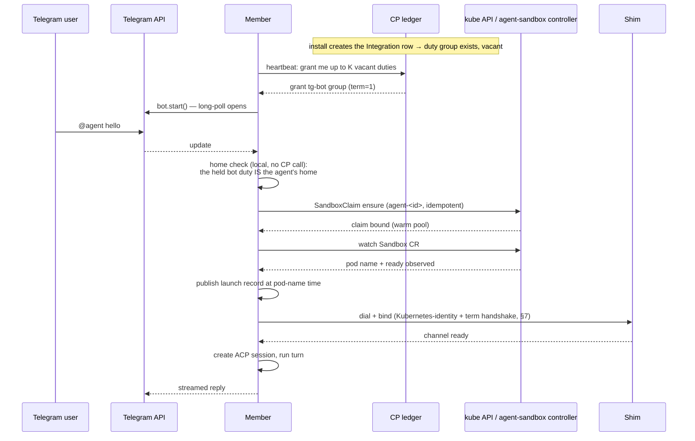

# The K8s Daemon Pool: Multi-Org Daemons and the Duty Ledger

**Status:** The ownership mechanism is implemented (control plane, daemon,
relay, protocol) with enforcement opt-in behind `features.dutyEnforcement`,
off by default. The remaining build order is the tracking issue
"K8s daemon pool — implementation plan and tracking". This document states the
design and marks what is not yet built; file references are given so every
claim can be checked against the code.

## 1. Problem

The current cluster deployment provisions **one daemon Deployment plus one
ReadWriteOncePod PVC per org**. The operator reconciles an `AgentConnectOrg`
CR into a roughly fifteen-object envelope per org — per-tier warm pools add
more (`packages/operator/src/reconcile/envelope.ts`): namespace, service
accounts, RBAC, NetworkPolicies, quota, warm pools, the state PVC, the
`replicas: 1, strategy: Recreate` Deployment, and the shim Service.

Four costs grow with org count:

1. **Idle burn.** An org with zero traffic still runs a full daemon pod 24×7.
   Agents already sleep (idle sweep + sandbox suspension, `sweepIdle` in
   `packages/daemon/src/daemon.ts`), but the daemon itself cannot.
2. **Object sprawl.** Kubernetes object count, PVC count, and watch/reconcile
   load scale linearly with orgs, most idle at any moment. The per-org **warm
   pool** is the sharpest case: a warm pool scoped to one org can only ever
   pre-warm for that org, so at scale each org either burns idle warm pods or
   sets `warmReplicas: 0` and gets no warm benefit at all.
3. **Upgrade blast radius.** A daemon image bump is a `Recreate` rollout of
   _every_ org's singleton pod — every org's platform connections drop, every
   org's in-flight turns die, simultaneously.
4. **The daemon can never stop.** It holds the org's platform ingress (Slack
   Socket Mode, Telegram long-poll, Discord gateway). Stopping it means going
   deaf; this is why daemon scale-to-zero was never viable (R1).

The fix is not to make per-org daemons cheaper. It is to remove the per-org
daemon as a unit of deployment: a fixed-size pool of multi-tenant daemon
**members**, where **agents sleep and daemons do not**, and where everything
that must be held by exactly one member is a claimable **duty** in one ledger.

## 2. Core principles

**P1 — Ownership follows ingress.** An agent runs where its ingress duty is
held. The duty holder **dials** the agent's sandbox (daemon → shim). Ingress
and execution are therefore co-located _by construction_: there is no
cross-member forwarding path for platform messages, and none is needed. This
single principle deletes the entire family of forward-hop, presence-sync, and
MOVED-redirect mechanisms rejected in R4.

**P2 — One ownership mechanism.** Every exactly-one responsibility — a
Telegram polling loop, a Slack socket, an agent's home — is a claimable
**duty** in a single ledger. Members _volunteer_ (claim); nothing ever
assigns. The control plane hosts the ledger and arbitrates claims
transactionally, but never chooses holders. This preserves the house rule that
already rejected CP placement authority (R3): facts flow down, claims flow up,
arbitration sits in the middle.

**P3 — Plane split.** Facts and the duty ledger live in the **control plane**
(the CP and its own Postgres, where `Bot`/`Integration` rows already live).
Message content and session state live in the **data plane** (shared tables
carrying an `org` column, with the org injected at the store-handle layer —
[cloud-data-plane-postgres.md](cloud-data-plane-postgres.md)). The CP never
connects to the data plane; members bridge the two. This is the pool-scale
restatement of the existing invariant that the CP stores only control-plane
metadata, never message bodies.

**P4 — Fencing by term.** Every claim carries a CP-minted monotonic **term**.
Data-plane writes are conditional on the writer's term; the shim accepts the
highest-term dialer and drops older connections. A stale ex-holder is fenced
everywhere it could do harm — at the sandbox, at the database, at the ledger.
This generalizes the existing `sessionEpoch`/`launchId` fencing discipline to
pool membership.

### Decision summary

| #   | Decision                | One line                                                                                                                                                                                              |
| --- | ----------------------- | ----------------------------------------------------------------------------------------------------------------------------------------------------------------------------------------------------- |
| D1  | Pool shape              | Fixed-size plain Deployment of multi-tenant members; manual scaling; members never sleep                                                                                                              |
| D2  | Sleep                   | Agents sleep (existing sandbox suspension); wake = existing `SandboxClaim` flow; no new machinery                                                                                                     |
| D3  | Connection direction    | The duty holder dials the sandbox; the shim is a hardened listener; one NetworkPolicy ingress-rule amendment                                                                                          |
| D4  | Member anatomy          | Singleton machinery + per-agent rooms + thin refcounted org contexts; the session stays the atomic unit                                                                                               |
| D5  | Duty group              | The claim unit is the connected component of the agent↔daemon-held-bot graph, claimed atomically under one term                                                                                       |
| D6  | Lease service           | CP-hosted `duty_group` ledger over the fleet WS, with a derived membership projection; vacancy grant = the claim call                                                                                 |
| D7  | Lease timing            | Batched renewals; T_fence self-fence < T_reassign; startup recovery grace                                                                                                                             |
| D8  | Cross-member paths      | `rd/agentmsg` stays A2A-only; the rendezvous adds a `not_holder` NAK on the inbound `rd/msg` path; no redirects, no presence streams; the ledger is the directory                                     |
| D9  | Org context on the wire | Install-wide connection with per-frame `orgId`; reconnect state is a combined multi-org snapshot / revision-fenced stream — no per-org subscription, room, or socket                                  |
| D10 | Crons                   | A time-based ingress edge: an enabled cron joins the duty-group computation, making the group proactively claimable; the holder fires the schedule locally with today's daemon machinery              |
| D11 | State                   | Separate data-plane PG, shared tables with an `org` column (org injected by the store handle, never by call sites); daemon-owned async store interfaces, SQLite + PG drivers                          |
| D12 | Upgrades                | maxSurge ≥ 1, maxUnavailable = 0; drain = duty release + sleep-as-migration                                                                                                                           |
| D13 | Failure model           | Explicit matrix; two accepted loss windows                                                                                                                                                            |
| D14 | Capacity                | Member self-gating at claim time; CP alarms on vacant-duty age; no scheduler                                                                                                                          |
| D15 | One binary              | Composition-root profiles differ by capability knobs, never a mode flag                                                                                                                               |
| D16 | Isolation               | The shared pool is the default; an oversized or noisy workload moves to a dedicated daemon                                                                                                            |
| D17 | Kubernetes footprint    | No per-org Kubernetes objects for pooled orgs: one shared sandbox namespace, tier-shared warm pools, label-scoped policies — so the operator, the org CR, and the CP's cluster credentials all retire |
| D18 | Migration               | Orgs move one at a time with rehearsed rollback (tracking issue, M5)                                                                                                                                  |

## 3. Pool anatomy (D1, D4)

The pool is a plain Kubernetes **Deployment** — explicitly not a StatefulSet
(R11) — of N identical daemon members, manually scaled. Occupancy alarms fire
when the ledger shows aged vacant duties or members near their duty budget; a
human adds or removes members. Members never sleep; they are the always-on
substrate that lets everything else sleep.

Each member is composed of three layers:

- **Singleton machinery** — relay and CP links, heartbeat, the claim/renew
  loop, and the sandbox dialer: today's `Daemon.start()` connective tissue
  minus the assumption of one org.
- **Rooms** — one per _agent_, not per org (R14): the agent host, its sandbox
  connection, ACP sessions, turn queues, and streaming state. The room is
  where the existing session machinery lives unchanged. A session remains the
  atomic unit: single home, serial turns, fenced by the existing
  `sessionEpoch`/`seq`/`launchId` discipline.
- **Org contexts** — thin, refcounted: a config snapshot and an org-scoped
  store handle. Created when the first room or duty for that org appears;
  dropped when the last user releases it. The org is deliberately reduced to
  shared context, because ingress and execution granularity is per-agent or
  per-bot, never per-org.

**Identity is per Pod, not per org.** Each Deployment Pod authenticates with
an audience-scoped, Pod-bound Kubernetes ServiceAccount token; TokenReview
establishes the subject and Pod UID, and each Pod gets its own org-less daemon
row and a stable `daemonId` for that Pod lifetime
(`packages/control-plane/src/cluster/daemon-identity.ts`). The daemon↔CP
WebSocket is install-wide with `orgId` carried per frame (`organizationMode:
'frame'`); there is no org room, org-specific connection, or per-org
subscription (D9).

**Org-threading is the end state; instantiation is scaffolding.** The wire
carries the org, the data plane carries the org, and the process interior
converges on the same axis: subsystems take the org as an explicit parameter,
with per-org instantiation of today's single-org classes as the zero-rewrite
transition for whatever is not yet threaded. Locally the parameter is a
constant, so the one-binary story (D15) is unchanged.

## 4. Agents sleep, daemons do not (D2)

**What "asleep" means, precisely.** Sleep is _suspension_, not deletion:
`sweepIdle` → `suspendIfIdle` sets the sandbox operating mode to `Suspended`
(`packages/daemon/src/k8s/driver.ts`), and **the `SandboxClaim`, the
`Sandbox`, and the workspace volume all survive**. Claim deletion is a
separate path that destroys the volume with it. So a sleeping agent has
released its compute — no running container, no connection, no in-memory room
on any member — while keeping its durable identity and workspace in the
cluster. Anything that would "recreate" a sandbox must go through
suspend/resume, never delete-and-claim-again, or it silently deletes the
agent's work.

A sleeping agent still belongs to a duty group (§6), and if that group
contains a daemon-held bot the group stays claimed while the agent sleeps —
that held duty is precisely what lets the wake message arrive. A singleton
group with no daemon-held bot has no reason to be held at all, and is claimed
on the first trigger.

Wake is the existing spawn flow: whichever member needs the agent creates the
`SandboxClaim` idempotently (`SandboxApi.ensureClaim`, deterministic name
`agent-<agentId>`); the out-of-band agent-sandbox controller materializes the
pod, adopting from the runtime tier's shared warm pool when one is available;
`bindChannel` patches the operating mode to Running and publishes the launch
record at pod-name time — and the holder then dials the shim and binds at its
term (§7). Cold, warm, and resume paths are already distinguished and metered
(`LaunchTimer.observedPath`). **No new wake machinery exists here.**

## 5. The duty ledger and lease service (D6, D7)

**The CP is the ledger.** Members claim, renew, and release duties over the
existing fleet WebSocket; the CP transacts against its own Postgres, alongside
the `Bot` and `Integration` rows it already owns.

**The ledger is a `duty_group` table, not columns on existing rows.** Per-row
leases cannot express the claim unit of §6: they are exactly the independent
claims that would give one agent two homes, a botless cron agent has no
`Integration` row to carry a lease at all, and two already-held groups merging
have no row on which to record the single surviving holder. The shape
(`packages/control-plane/prisma/schema.prisma`, repo in
`persistence/repositories/duty-group.repo.ts`):

- `duty_group` — `(orgId, holder, term, expiresAt)`, one row per connected
  component, the only thing ever claimed.
- `duty_group_member` — the derived `(agentId|botId → group)` projection,
  recomputed from `Integration`/`CronDef` rows whenever an edge changes; its
  composite primary key makes "one home per agent / per bot" a database
  invariant.

**`term` is the fencing token**: monotonic per group, bumped on _every_ grant
and never on renewal. **Vacancy is temporal**, not referential: a group is
grantable when `expiresAt` has lapsed (or it was never claimed / explicitly
released); a dead member simply stops renewing, and `holder` deliberately
carries no foreign key — a row-level `SetNull` would vacate without a term
bump while fencing always reads `(holder, term)` together.

**Vacancy discovery and claiming collapse into one call.** A member's
heartbeat asks "grant me up to K vacant duties", capacity-gated by the member
itself (D14). `claimVacant` is one CAS statement (`FOR UPDATE SKIP LOCKED`):
racing claimants take disjoint vacancies, first valid claim wins, and the
grant's row locks hold until the returned `(term, members)` snapshot is
assembled so a concurrent recompute can never pair an old term with rewritten
membership.

**Composition changes are re-grants, not evictions.** The recompute
(`orchestrator/dutyGroup.ts` + `dutyRecompute.ts`) is plan-then-apply in one
transaction under a per-org advisory lock plus row locks. The pure planner
assigns group identity deterministically — existing groups are consumed in
(held, larger, lower-id) order and take the component holding most of their
former members — which makes "the holder of the larger group keeps the merged
group, ties broken by the lower groupId" a corollary, lets splits follow the
largest fragment without eviction, and names every superseded holder in the
plan. The sweep walks orgs on a keyset rotation; a coalescing `kick(orgId)`
runs the same recompute promptly from the mutation seams (integration
create/delete, cron upsert/remove, placement moves), with the rotation as the
backstop.

**The lease protocol rides the existing heartbeat.** Not a new connection,
timer, or tick (`orchestrator/dutyLease.ts`):

- **Renewal is the heartbeat** — one batched, term-preserving expiry refresh
  per frame. A lapsed-but-unclaimed lease still renews, so a CP outage shorter
  than the reassign window is a non-event.
- **The digest diff is the reconnect crossing point**: confirm the terms or
  supersede, never both. A held group missing from the member's digest
  (restart, lost EVT) or present at a stale term is re-issued as a
  `duty/grant` entry — an entry _replaces_ its group daemon-side, so both
  cases converge through one path. A digest entry the ledger no longer grants
  is revoked (`superseded` | `gone`), classified after the vacancy claim so
  the grant and revoke sets are disjoint by construction.
- **Grant emission is chunked** (entries per frame plus a member-ref budget).
  A component larger than `DUTY_GRANT_MEMBERS_MAX` is not deliverable on this
  wire at all: it is never claimed (a size gate inside the vacancy predicate),
  an unserved oversized lease vacates rather than renewing forever, and a held
  one that grows past the cap is superseded — the honest signal that the group
  belongs on a dedicated daemon (D16).
- **One per-daemon lane serializes every ledger touch**, reserved
  synchronously at dispatch so lane order is the daemon's frame order:
  overlapping beats cannot double-spend headroom, and a `duty/release` queued
  behind a running exchange guarantees every grant that exchange emitted
  reaches the daemon before the release ack.

**Timing (D7).** Three constants govern liveness:

- **T_fence** — a holder that cannot renew for T_fence **self-fences**: it
  tears down the affected duties, including their platform connections. Sized
  to cover a routine CP deploy. **Not yet implemented daemon-side** — on
  losing the CP link the client today only stops heartbeats while the registry
  retains its grants; landing this self-fence is a precondition for turning
  enforcement on (tracking issue), because without it a partitioned ex-holder
  could still serve a group a successor has claimed.
- **T_reassign > T_fence** — the CP treats a duty as vacant only after
  T_reassign without renewal, guaranteeing the old holder has self-fenced
  before a successor can claim.
- **Recovery grace** — a freshly booted CP suppresses vacancy grants for one
  full T_reassign, so a CP restart cannot misread quiet members as dead;
  renewals are unaffected. (Implemented.)

**The duty term and `sessionEpoch` are independent fencing domains.**
`sessionEpoch` is minted per daemon at auth and fences control frames from a
stale connection generation; the term fences actions by a member that is no
longer the holder. Every reconnect bumps `sessionEpoch` — so a term derived
from it would churn every duty in the install on each CP deploy, which is R7
through a side door. The acceptance property: restart the CP, watch every
`sessionEpoch` bump, and no duty term moves and no platform connection drops.

**Two consciously accepted trades:** (1) a sustained CP outage longer than
T_fence tears down daemon-held ingress pool-wide — members cannot distinguish
"CP down" from "I am partitioned and a successor is being appointed", and the
loss is bounded by the platforms' own buffering; (2) duty failover after
member death is ~T_reassign, not the ~30s a data-plane-anchored lease would
give — the price of R6's mechanism deletion. Failover latency is a tunable;
mechanism count is forever.

## 6. The duty group: what is actually claimed (D5)

| Group shape                                           | Members                         | Why                                                                                                            |
| ----------------------------------------------------- | ------------------------------- | -------------------------------------------------------------------------------------------------------------- |
| Agent with agent-bound bots (Telegram, Discord)       | `{agent, bot…}`                 | Ingress and execution co-located by construction                                                               |
| Shared daemon-held bot (Slack Socket Mode, Feishu WS) | `{bot, …every agent it serves}` | One socket per bot token — its agents cluster at the socket's owner                                            |
| Agent with an enabled cron                            | `{agent, cron edges…}`          | A cron is a time-based ingress edge (§9): the group is proactively claimable so the schedule always has a home |
| Relay-ingress-only / webchat / A2A agent              | `{agent}`                       | A singleton, created on the first trigger's claim ("claiming creates the lease")                               |

Edges come from active `Integration` rows whose bot has `transport: 'socket'`
plus enabled `CronDef` rows; relay-ingress (`http`) integrations create no
edge because the relay, not the daemon, owns that socket. An oversized group
is the mechanical signal for a dedicated daemon (D16).

### The activation rendezvous

A trigger for an _unheld_ group has nowhere to go — the ledger names no holder
for a group nobody has claimed. The resolution keeps members volunteering and
adds no component: the relay routes the trigger to **any connected member**,
and that member claims the group on receipt.

- The daemon's `rd/msg` handler checks its duty registry (one gate covers all
  four message sources). On a miss it sends `duty/claim`; a win returns a
  grant installed exactly like a `duty/grant` EVT and the message re-enters
  normal dispatch; a loss answers the relay with a typed **`not_holder` NAK
  carrying `holderDaemonId`** — the incumbent it lost to, as the CP named it.
- A claim is refused locally, without asking the CP, while draining or at zero
  headroom — a full or draining member must not volunteer.
- The relay re-sends the **same `msgId`** to the named holder **once**: the
  holder's own dedup protects against double delivery, and a second refusal
  terminates rather than chasing a stale ledger.
- A refusal the relay cannot resolve — no holder named, the holder not
  connected here, the redirect target refusing in turn — is a **counted
  drop**, deliberately not a claimed retry: HTTP ingress has already
  acknowledged and deduplicated the provider callback by then, so nothing
  upstream will present the message again. Bounding that window is the
  ledger's job (vacancy plus the recompute), not the router's.
- The NAK verdict is not cached in the daemon's ack-dedup map, so a later
  grant never replays a stale refusal.

When the ledger still names a holder that has died but not yet gone vacant,
a re-route lands on a dead connection and fails the same way — a counted drop,
part of accepted window 2 (§13), bounded by T_reassign plus the recompute. No
internal retry exists behind that drop; if the window ever needs to be
narrower than the platforms' own buffering makes it, the close is a
relay-owned durable retry, which is deliberately future work rather than an
implied property. Crons never reach this rendezvous: a cron-bearing group is
proactively claimable, so it always has a holder by the time a fire is due.

## 7. Ownership and dial-in binding (D3)

Historically the shim dialed out to its org's daemon (`AC_SHIM_ENDPOINT` — the
address was knowable because the topology was per-org). In the pool, the
daemon that should own an agent is whoever holds the duty, unknowable from
inside the sandbox. So **the direction flips: the duty holder dials the
sandbox** (`packages/daemon/src/shim/dialer.ts` dials; `shim/server.ts`
listens in the sandbox). See [cluster-spawn-and-shim.md](cluster-spawn-and-shim.md)
for the spawn machinery this re-choreographs.

The shim is a hardened listener: accept exactly one active connection; on
accept, present its audience-restricted projected ServiceAccount token (the
same `/var/run/ac-identity/token`, audience `ac-daemon-callback` as before);
let the daemon TokenReview it; enforce highest-term-wins — a dial carrying a
higher term supersedes and closes the current connection, a lower term is
refused, and the same term is accepted only from the same holder, which is
what makes an ordinary transport break recoverable without a term advance.

**Authentication is direct Kubernetes identity in both directions.**
TokenReview proves the pod's identity to the daemon; the pre-disclosure
boundary toward the shim is the sandbox-namespace NetworkPolicy (one ingress
rule: pool namespace → shim port) plus member pod identity, with audience
separation preventing a token for one hop from authenticating at another.
**There is no CP-signed shim grant, public key, JWKS document, or key set** —
an earlier revision specified one and it was removed outright: the Kubernetes
identity the pods already carry answers the same question without a CP-owned
key-distribution mechanism.

The binding invariants of the spawn design survive re-choreographed: mutual
authentication; the connection binds to (sandbox UID, pod UID, org, agent,
generation), checked by the dialer against its own launch record; per-operation
capability grants unchanged; the replay fence gains the term alongside the
generation; no long-lived credential in the sandbox. The single-predicate
enforcement style of `ShimBindingRegistry.authorize()` is retained, extended
with the term check.

**Unreachable sandbox:** after N failed dials with backoff, the holder
releases the agent's duty so another member can claim it and dial from its own
network position. Reachability failure is treated as a placement problem, and
the ledger is the placement mechanism.

## 8. The wake path, end to end

A new Telegram message for a sleeping agent — no CP call on the first-message
path, because the held bot duty _is_ the agent's home:

Nothing here is new mechanism: the polling connection is today's
`TelegramConnection`, the sandbox flow is today's
`K8sDriver.ensureSandbox`/`bindChannel` with the dial direction flipped, and
the session machinery is untouched.

## 9. Crons are a time-based ingress edge (D10)

An enabled `CronDef` is a standing reason for its agent's duty group to be
held — exactly as a bot connection is — so the group computation takes
`CronDef` rows as input alongside `Integration` rows, and a cron-bearing group
is **proactively claimable**: it appears in the vacancy pool even while its
agent sleeps. The holder loads the schedule with the ordinary daemon-side
machinery (`croner` in `packages/daemon/src/scheduler/scheduler.ts`, its
roster filter following group holdership) and fires it locally; at fire time
the holder is already the agent's home, so the wake is §8 with no routing step
at all. `CronDef.lastRunAt` keeps its advisory, daemon-authoritative
semantics; the dream scheduler is scoped identically.

**The lease is what fixes the offline-cron hole, not a new trigger path.** A
cron whose owning daemon is offline simply does not fire today, and nothing
notices; under the ledger, a dead holder's group goes vacant at T_reassign, a
survivor claims it, loads the schedule, and the next fire happens. An earlier
revision concluded the CP should fire crons and nudge holders; that bought a
CP-side scheduler loop and the retirement of a working daemon subsystem to
deliver what the vacancy sweep already delivers, and was deleted.

## 10. Cross-member paths (D8) and org context on the wire (D9)

The pool has **one delivery topology and one narrow cross-member path**. P1
co-location means a platform message is born at the member that runs the turn
— there is no member-to-member platform-message path because there is nothing
to forward. The single cross-member path is `rd/agentmsg`, serving A2A only;
it is not extended into a platform-message bus (R5). The rendezvous adds a
`not_holder` NAK on the inbound `rd/msg` path (and the same reason on
`rd/agentmsg` for A2A first triggers). There are no MOVED redirects, no dial
hints, no presence streams: **the ledger is the sole directory**.

Org context travels on the frame, not on a subscription. The install-wide
connection carries `orgId` on every org-scoped frame; auth, register,
heartbeat, fleet facts, rosters, and daemon lifecycle frames legitimately omit
it. Reconnect state is a combined multi-org snapshot or revision-fenced stream
on the same member connection — deliberately **not** `subscribe(org)`, an org
room, or an org-specific socket — reusing the watermark machinery that already
exists in production (`Agent.configRevision` with the daemon-side
`stale|conflict|idempotent|apply` compare, and `SessionMeta.visibilityRev` +
replay-on-register).

**Platform credentials are duty-scoped; agent secrets stay pointer-based.** An
agent's secrets are materialized at spawn through the shim, but a duty holder
must open a Telegram long-poll before any sandbox exists, so the bot token
cannot ride that path. Credential delivery follows holdership: a member
receives a platform credential only for duty groups it currently holds,
stamped with the term it holds them at, and drops the material with the
group's context on supersession or release. Exposure narrows from "every bot
in the org, forever" to "the bots in the groups I hold, while I hold them".

## 11. The state layer (D11)

The data plane is a Postgres owned by the execution layer, fully separate from
the CP database — the CP never stores message content and never connects to it
(P3). The design is [cloud-data-plane-postgres.md](cloud-data-plane-postgres.md);
the properties that matter to the pool:

- **Shared tables with an `org` column**, org-prefixed uniqueness and indexes,
  migrations once per cluster. The decisive property is **reversibility**:
  org-predicated SQL is forward-compatible with a later per-org split (the
  predicate becomes redundantly true), while the reverse migration does not
  exist. The SQLite driver gains the identical column so both drivers run the
  same SQL.
- **The org predicate is injected in exactly one layer** — the store handle
  captures the org once; call sites never pass or see one. Row-tenancy's
  classic leak (one forgotten `WHERE`) is confined to the repository layer,
  covered by a contract suite that runs against both drivers, with row-level
  security available as belt-and-braces.
- **Term-fenced writes (P4)**: every data-plane write carries the writer's
  term; a write below the recorded high-water term for that duty is refused —
  the database-side half of the fencing the shim does on the connection side.
- Streaming transcript writes are batched/coalesced; the per-token pattern
  that is cheap against local SQLite would be pathological against networked
  PG.

Shipped so far: the transcript dual-write
(`packages/daemon/src/store/postgres-transcript-store.ts`). The remaining
store inventory (sessions, cursors, durable inbox, loop guards, outboxes, cron
runs) is the async-store workstream in the tracking issue — and until it
lands, duties are pinned to the member that already holds each agent's state
(§14).

## 12. Capacity (D14) and upgrades (D12)

Each member enforces its own duty budget **at claim time** — the "grant me up
to K" call is capacity-gated by the caller from `limits.maxAgents` minus
duty-covered agents, and the rendezvous refuses to claim at zero headroom. The
CP never load-balances, never schedules, never picks; it only refuses invalid
claims and **alarms on vacant-duty age**. A human scales the Deployment. No
scheduler exists anywhere — deliberate continuity with the current system,
where the session-placement scheduler was built but never armed.

Per-org resource quota is deliberately not implemented here: a shared sandbox
namespace keeps one namespace-wide `ResourceQuota`/`LimitRange` as the cluster
safety valve, per-member duty budgets bound each member, and finer-grained
enforcement belongs to whatever owns limits. A runaway workload's escape hatch
is a dedicated daemon (D16).

The pool Deployment rolls with **maxSurge ≥ 1, maxUnavailable = 0**:
successors exist before predecessors drain. Drain, per member: stop claiming →
**sleep-as-migration** (sleeping agents cost zero — they wake wherever their
duty is next claimed; idle-awake agents are force-slept through the existing
suspension path) → a bounded grace window for agents mid-turn, ending with
in-flight turns drained or cancelled and runtime authority stopped → only then
the graceful `duty/release` (successors claim on their next beat and re-dial
sandboxes at a fresh term; the shim's highest-term-wins handshake makes the
cutover atomic per sandbox). The order is load-bearing: releasing before the
grace would let a successor bind at a higher term while the predecessor still
owns admitted work — which is why the shipped drain (`runDrain` in
`packages/daemon/src/daemon.ts`) stops turn hosts before `releaseAllDuties`.
There are no reconnect storms in either direction: successors pace their own
dials, and sandboxes never dial anyone.

## 13. Failure model (D13)

| Failure                              | Behavior                                                                                                                                                                                                                                                                                                                        | Bound                                                                                                                                |
| ------------------------------------ | ------------------------------------------------------------------------------------------------------------------------------------------------------------------------------------------------------------------------------------------------------------------------------------------------------------------------------- | ------------------------------------------------------------------------------------------------------------------------------------ |
| **Member death**                     | Its duties stop renewing; successors claim after T_reassign and dial. Sleeping agents untouched. In-memory pending turns die. For relay-ingress agents the relay re-routes the bot within seconds, but that member waits out T_reassign before it can claim the dead member's agent homes — no connection-death fast path (R7). | Platform retry/buffering bounds message loss (accepted window 1); takeover gap ≈ T_reassign + platform reconnect (accepted window 2) |
| **Member ↔ CP partition**            | The member self-fences its duties at T_fence, including tearing down platform connections. _(The daemon-side self-fence is not yet implemented — see §5 and the tracking issue; enforcement stays off until it lands.)_                                                                                                         | Accepted false-positive teardown when the CP is up but unreachable from this member                                                  |
| **Member ↔ data-plane PG partition** | The member cannot serve state: fail turns after a bounded retry window, release duties, stop accepting work.                                                                                                                                                                                                                    | Data-plane PG availability is pool availability                                                                                      |
| **Member ↔ sandbox path break**      | Dial-retry with backoff; after N failures, release the agent's duty so another member claims and dials from its own network position.                                                                                                                                                                                           | N × backoff before relocation                                                                                                        |
| **Shim side**                        | On connection drop the shim just listens — it never dials. A half-dead old holder is fenced by term at the shim and at every data-plane write.                                                                                                                                                                                  | Fencing is absolute, not probabilistic                                                                                               |
| **CP outage**                        | Existing holders keep serving until T_fence. No new claims, no wakes of new duties, no failovers until the CP returns — "CP down = activation pauses, established sessions continue."                                                                                                                                           | Outage > T_fence tears down daemon-held ingress pool-wide (accepted trade, §5)                                                       |

## 14. Local/pool parity (D15) and rollout

There is **one binary**. Profiles differ by capability knobs, never a mode
flag:

| Knob              | Local/self-hosted             | Pool member                                |
| ----------------- | ----------------------------- | ------------------------------------------ |
| Spawn driver      | `local` (child processes)     | `k8s` (SandboxClaim + shim dial-in)        |
| Store driver      | SQLite                        | data-plane PG                              |
| Org contexts      | exactly one, permanent        | refcounted, on demand                      |
| Org on the wire   | connection-scoped (API key)   | frame-scoped (`organizationMode: 'frame'`) |
| Ingress transport | per-integration, as today     | per-integration, duty-gated                |
| Duty ledger       | not consulted (single member) | CP lease service                           |

The local symmetry argument for dial-in: the local daemon already initiates
its runtimes — it spawns child processes and owns their stdio. Dial-in makes
pool and local symmetric: in both, the daemon reaches out to establish the
execution channel.

**Rollout.** The exchange runs unconditionally on frame-mode daemons — the
ledger needs the digest to converge — but _enforcement_ (the
`transportAgents()` filter, schedule scoping, refusal of unheld triggers) is
behind `features.dutyEnforcement`, default off: a grant or revoke only moves
bookkeeping until the flag flips, so convergence is observable in production
before it gates a single connection. During the soak the grant policy is
**incumbent-only** — a vacancy is granted only to the member the group's
agents are already placed on, and the recompute vacates a lease whose holder
no longer hosts any of the group's agents (partial occupancy keeps it, so a
split group never flaps). Duties pin where agent state already lives; the
policy widens to any-member once the shared data plane makes state portable.
A single-org daemon sends byte-identical heartbeats to before and never
observes any of this.

### Future direction: daemon groups

The k8s pool is the **degenerate case of a more general concept**: a _daemon
group_ — a named set of members within which an agent's duty may be claimed.
Today the member set is implicit (every frame-mode Pod of the install); the
generalization makes it explicit and parameterizable, so that self-hosted
installs can form groups too: point `Agent.daemonId` (or a successor placement
field) at a group instead of a machine, and the same ledger, lease exchange,
rendezvous, and drain semantics distribute the agent within it. For local
daemons this is the cross-machine generalization of the singleton pid lock —
today two local daemons configured with the same bot token fight over the
platform API (R13); a group makes multi-machine failover safe for the first
time.

Deliberately **not built yet** — it layers a second untested generalization on
a mechanism that has not run enforced end to end, and its hard prerequisites
are exactly the pool's own: the shared data plane (a duty moving to another
machine needs the agent's state to be reachable there — for local groups that
means a shared Postgres and re-cloneable workspaces) and the daemon-side
self-fence. Sequencing: prove the N=1 group (this pool) end to end first, then
generalize.

Two constraints on intervening work, so the door stays open:

- **Membership must stay a predicate, not a hardcoded connection kind.** The
  claim gate ("who may claim this agent's duty") is one SQL predicate today;
  nothing new should assume frame-mode is the only shape of membership.
- **The tenancy gate widens, never disappears.** Org-scoped connections
  currently have their `duties` dropped (a deliberate tenancy fence). A local
  group re-opens that door only as "this org's agents, in a group containing
  the claimant" — org-scoped connection plus org-and-group-scoped claims is
  still leak-free; install-wide claims remain frame-mode-only.

## 15. Rejected alternatives

**R1 — Daemon scale-to-zero / sleepy per-org daemons.** Optimizes the wrong
unit: a sleeping daemon loses platform ingress, so it needs a wake trigger,
which means someone else must hold ingress — this design with extra steps.

**R2 — Full relay-ingress-ization** (move every platform to relay-held
webhooks/gateways). Would concentrate all always-on duty in the relay — a
component deliberately kept content-stateless and thin — and still leaves the
agent-home problem unsolved, so the ledger would be needed anyway. Survives as
a future option that would shrink the ledger's scope, not conflict with it.

**R3 — CP placement/assignment authority.** The ledger arbitrates
member-initiated claims transactionally but never selects or pushes holders.
An arbiter can be simple and boring; a scheduler grows policy forever.

**R4 — Connection-defined ownership** (the shim dials a pool Service; MOVED
redirects, dial hints, presence streams steer it). Structurally requires
cross-member platform-message forwarding (R5) and carries recurring costs — a
forward hop on every first turn, presence sync as a standing subsystem,
reconnect storms on member death. Dial-in deletes the class.

**R5 — Extending `rd/agentmsg` into a platform-message bus.** Its documented
narrowness (per-hop dedup, small correlator timeout, retransmit scope-down) is
acceptable at A2A frequency; platform messages would demand real ordering and
retransmit semantics on the hottest path in the product.

**R6 — A member-written lease table in the data-plane PG** (CP directory
broadcast, scan SQL, holder-report stream). The integration rows already live
in the CP database; putting the ledger there deletes all four mechanisms.
Recorded honestly: the data-plane anchor gave ~30s failover; the trade was
latency for mechanism count.

**R7 — Connection-anchored duty liveness** (a duty dies when the WS drops).
Every routine CP deploy would flap every platform connection in the pool.
Liveness is "renewed within T_fence", never "socket is up".

**R8 — The inbox as the v1 delivery bus.** Deferred, not refuted: P1 means
ingress already lands at the home, so a delivery bus is speculative plumbing
today.

**R9 — A member-to-member forwarding fabric.** A second delivery path creates
merge, dedup, and ordering semantics between two buses.

**R10 — Prisma as the daemon store interface.** Static provider selection
breaks one-SQL-two-drivers, and its codegen/engine weight has no place in an
edge binary self-hosters install via npm. Prisma remains correct for the CP.

**R11 — StatefulSet pools.** No surge: replacement in place reduces capacity
exactly when duties need somewhere to go. Stable identity is the ledger's
job, not the pod name's.

**R12 — Schema-per-org / database-per-org.** Multiplies catalog objects by
org count, needs a per-schema migration runner, and is the irreversible order
(schema-shaped SQL has no org column to fall back on). Banked as a future
split with the org column as its pre-paid exit.

**R13 — Platform-native duty arbitration** (let two members fight over the
platform API). Telegram 409 offset-stealing loses messages; Discord duplicate
gateway sessions double-deliver; Slack Socket Mode load-balances events across
sockets, producing split-brain per event. Every platform's semantics are
different and all are wrong.

**R14 — A per-org room model** (a room per org containing its agents).
Nothing in the system is org-granular at runtime — duties are per-bot or
per-agent, sessions per-agent, sandboxes per-agent. An org room would recreate
a mini per-org daemon inside each member: the shape this design dissolves.

**R15 — Member-created per-org envelopes** (keep per-org namespaces but have
members create them lazily). Buys the operator's deletion by granting every
member cluster-wide namespace/RBAC/quota creation rights — the privilege moves
somewhere worse than the small, credential-free controller it replaced.
Removing the per-org objects entirely (D17) retires the same reconciler while
shrinking every actor's permissions.

## 16. Glossary

| Term                       | Meaning                                                                                                             |
| -------------------------- | ------------------------------------------------------------------------------------------------------------------- |
| **Pool**                   | The shared daemon fleet: a fixed-size Deployment of multi-tenant members                                            |
| **Member**                 | One pool process; fungible; holds duties it has claimed                                                             |
| **Room**                   | Per-agent runtime state inside a member: sandbox connection, ACP sessions, turn queues, streaming state             |
| **Org context**            | Thin refcounted per-org context: config snapshot, org-scoped store handle                                           |
| **Duty**                   | An exactly-one responsibility recorded as a claimable ledger row: a daemon-held bot connection or an agent home     |
| **Duty group**             | The claim unit: a connected component of the agent↔daemon-held-bot graph (enabled crons are edges)                  |
| **Ledger**                 | The CP-hosted `duty_group` table; the single source of who-holds-what                                               |
| **Term**                   | CP-minted monotonic fencing token per grant; carried on data-plane writes and the shim handshake; highest term wins |
| **T_fence**                | Renewal-failure window after which a holder self-fences (not yet implemented daemon-side)                           |
| **T_reassign** (> T_fence) | Silence window after which the CP treats a duty as vacant and grantable                                             |
| **Recovery grace**         | The CP's startup wait of one full T_reassign before granting vacancies, making CP restarts non-events               |
| **Vacancy grant**          | The single claim call, carried on the heartbeat: "grant me up to K vacant duties"                                   |
| **Rendezvous**             | Activation of an unheld group: any member receives the trigger, claims on receipt, and a loser NAKs with the winner |
| **Sleep-as-migration**     | Drain strategy: a sleeping agent moves by not moving — it wakes wherever its duty is next claimed                   |
| **Dial-in binding**        | The duty holder dials the sandbox's shim listener, TokenReviews its projected SA token, and binds at its term       |

## 17. Implementation map

| Piece                                                                  | Where                                                                                                 |
| ---------------------------------------------------------------------- | ----------------------------------------------------------------------------------------------------- |
| Frames + member cap                                                    | `packages/protocol/src/frames/duty.ts`, `relay-daemon.ts` (`RD_ACK_NOT_HOLDER`)                       |
| Schema + repo (CAS claim, renew, release, reconcile, agent-home claim) | `packages/control-plane/prisma/schema.prisma`, `src/persistence/repositories/duty-group.repo.ts`      |
| Pure group math + reconcile planner                                    | `packages/control-plane/src/orchestrator/dutyGroup.ts`                                                |
| Lease exchange (digest diff, chunking, lanes, grace)                   | `packages/control-plane/src/orchestrator/dutyLease.ts`                                                |
| Recompute sweep + mutation kicks + placement fence                     | `packages/control-plane/src/orchestrator/dutyRecompute.ts`                                            |
| WS handlers                                                            | `packages/control-plane/src/ws/handlers/{heartbeat,duty-release,duty-claim}.ts`                       |
| Daemon registry + gate + rendezvous claim                              | `packages/daemon/src/cp/duty-registry.ts`, `src/daemon.ts` (`transportAgents`, `claimDutyForTrigger`) |
| Relay re-route                                                         | `packages/relay/src/relay-ingress-manager.ts` (`sendWithRendezvous`), `relay-browser-connection.ts`   |
| Shim dial-in                                                           | `packages/daemon/src/shim/{dialer,server}.ts`                                                         |
| Pod-bound member identity                                              | `packages/control-plane/src/cluster/daemon-identity.ts`                                               |
