# Feedback Loop Breaker — Loop Protection for Platform Messages and Agent Collaboration

**Status:** Baseline implemented

> This document is AgentConnect's loop-safety specification. It defines layered
> protection for platform-message feedback loops, durable-replay amplification,
> recursive agent-to-agent calls, and the future orchestration causal graph.
>
> Agent delivery, authorization, correlation, and the orchestration state machine
> remain governed by
> [`agent-collaboration-implementation.md`](agent-collaboration-implementation.md).
> This document defines only when an interaction chain must stop, how it remains
> stopped, and who may resume it.

---

## 1. Why the Loop Breaker Is a Separate Mechanism

AgentConnect combines several capabilities that can amplify feedback loops:

- Platforms may feed bot output, message edits, assistant metadata, and similar
  events back into the event stream.
- The daemon uses a durable inbox for acknowledged but incomplete messages, so
  they replay after a restart.
- Multiple agents can wake one another through `messageAgent`, including
  cross-daemon delivery through the relay.
- Output from third-party bots may trigger platform rules or orchestration again.
- A daemon continues established sessions while the CP is unavailable, so it
  cannot depend on the CP for real-time containment.

Therefore, an event handled only by "filter it once" or "restart the daemon" may
become:

```
Third-party platform bot / agent A
  → wakes agent B
  → B produces output or calls A
  → a new message enters the durable inbox
  → the daemon restarts and replays it
  → the loop continues
```

The loop breaker described here is **not an ordinary rate limiter**. A rate
limiter only reduces velocity. Once an incident is confirmed, the breaker
remains durably OPEN, cancels related execution, and clears the replay backlog
until a trusted user explicitly resumes it.

### 1.1 Terminology

In this document, a **feedback loop** is a causal feedback cycle between messages
and agents. It differs from the "agent loop / cron loop" used for recurring work
in [`agents-collaboration-design.md`](agents-collaboration-design.md). A recurring
job is not itself an incident, but any agent-call chain it starts remains subject
to the agent-call guard in this document and to the future interaction budget.

### 1.2 Goals

1. Contain incidents quickly and locally on the daemon while keeping the CP off
   the messaging hot path.
2. Preserve the semantics of breakers, mutes, and terminated backlogs across
   daemon restarts.
3. Prevent agents, platform message bodies, and replay from forging or resetting
   hop count, identity, or breaker state.
4. Give all agents in one conversation a shared incident scope instead of
   allowing each to continue producing output independently.
5. Establish stable boundaries for a future agent causal graph, fanout budget,
   and orchestration cancellation.

### 1.3 Non-Goals

- The breaker does not replace platform-event shape validation, deduplication,
  queue backpressure, or call policy.
- Models do not choose thresholds, provide trusted hop/origin values, or reset
  the breaker themselves.
- The current version does not guarantee atomic conversation counters shared
  across every daemon.
- The system does not infer agent identity, correlation, hop count, or graph
  edges from natural-language message bodies.

---

## 2. Layered Model

A single counter cannot safely handle every loop. The current and target
architectures use four layers:

| Layer                                   | Protected surface                                                               | Current mechanism                                             | Failure action                                                               |
| --------------------------------------- | ------------------------------------------------------------------------------- | ------------------------------------------------------------- | ---------------------------------------------------------------------------- |
| **L0 Ingress integrity**                | Slack structural wrappers, edit/delete, assistant metadata, bot echoes          | Shape allowlist, managed-bot identity, delivery dedup         | Deterministic drop without consuming turn budget                             |
| **L1 Platform conversation circuit**    | Inbound Slack/Telegram/Discord traffic without trusted causal metadata          | Daemon-local durable fixed-window breaker                     | OPEN scope, purge inbox, cancel active/queued work, alert once               |
| **L2 Trusted agent-call guard**         | Same-daemon and cross-daemon `messageAgent` call chains                         | Self-call rejection + daemon/relay-managed `hopCount` cap     | Typed `hop_limit` / `self` NAK without waking the target                     |
| **L3 Interaction/orchestration budget** | Multilevel fanout, cross-session/cross-daemon causal graphs, periodic new roots | **Future design**: trusted `originId`, edge kind, root budget | Terminate interaction/orchestration while retaining a bounded report channel |

Key principles:

- L0 is deterministic protocol validation. It must not rely on L1 to block a
  known-bad event shape only on its ninth occurrence.
- L1 handles cases where the complete causal chain is unknown, but the
  conversation is visibly out of control.
- L2 handles the `messageAgent` path, where the causal chain is trusted and hops
  can be counted exactly.
- L3 addresses fanout, cost, wall-clock duration, and graph cycles that a hop cap
  cannot express.

The same apparent effect may travel through different trust paths. For example:

- A third-party bot's platform message has no trusted agent-call metadata and may
  enter as an automatic platform turn only after an explicit `@mention`.
- When an AgentConnect agent wakes a peer through `messageAgent`, it must use the
  trusted hop guard. A plausible-looking `hopCount` in a Slack message body is
  never parsed or trusted.

`messageAgent` is the only formal agent-to-agent data plane that carries trusted
causal metadata. A Slack message from an AgentConnect-managed bot is conversation
history, not an activation path. It is deterministically dropped before
command/model admission even if the body contains an explicit `@mention`.
Third-party bots may still trigger an agent through an explicit `@mention`, but
their messages are treated as L1 `automatic`/untrusted turns.

---

## 3. L0: Ingress Integrity

### 3.1 Slack Event Shape

Slack's generic `message` listener carries both real messages and structural
events. Direct Slack and shared-relay ingress accept events only when the
top-level event has a real author (`user` or `bot_id`), is not hidden, has no
nested `message` wrapper, and has a subtype on the explicit allowlist.

Allowed chat subtypes:

- No subtype.
- `file_share`.
- `me_message`.
- `thread_broadcast`.
- Legacy `reply_broadcast`.
- Bot-authored `bot_message`.

`message_changed`, `message_deleted`, and `message_replied` wrappers,
`assistant_app_thread`, and echoes from the currently receiving bot do not
become turns. Slack is known to emit `message_replied` events without a subtype,
so a subtype blocklist alone is insufficient. The implementation must also
check `hidden`, the top-level author, and nested-message shape.

Slack ingress preserves top-level bot-authored events for classification. The
routing layer compares the sender app ID (`app_id` /
`bot_profile.app_id`) against managed Slack app identities in the CP
collaboration snapshot, with resolved bot user/bot IDs on the same daemon as a
fallback. An event matching any AgentConnect-managed bot identity is
deterministically dropped before command/model admission, regardless of whether
it mentions an agent, is inside an established thread, or arrives in a channel
configured for automatic handling.

A third-party Slack bot that does not match a managed identity is admitted only
through an explicit `@mention`; it cannot use the DM, thread, keyword, or auto
paths. An admitted third-party bot turn is still an L1 `automatic` admission.
Permitting platform interaction does not make body-supplied hop/origin metadata
trusted and does not bypass deduplication.

### 3.2 Relationship Between Deduplication and the Breaker

Deduplication answers "is this a redelivery of the same delivery?" The breaker
answers "even if every delivery is distinct, is this conversation out of
control?" Both are required:

- Repeated `msgId`/`deliveryId` → deduplicate without incrementing the counter.
- A and B create a new message/root every time → deduplication cannot help; use
  the breaker or hop budget.

---

## 4. L1: Platform Conversation Circuit (Current Implementation)

Implementation entry points:

- [`packages/daemon/src/daemon.ts`](../../packages/daemon/src/daemon.ts):
  scope, admission, trip, cancellation, and resume.
- [`packages/daemon/src/store/local-store.ts`](../../packages/daemon/src/store/local-store.ts):
  durable counter and latch.
- [`packages/daemon/src/slack/connection.ts`](../../packages/daemon/src/slack/connection.ts):
  direct Slack ingress.
- [`packages/relay/src/platforms/slack/http-ingest.ts`](../../packages/relay/src/platforms/slack/http-ingest.ts):
  HTTP Slack ingress — the relay's per-bot inbound handler.

### 4.1 Messages Counted

The current `usesLoopGuard(msg)` protects only:

```text
msg.source == "user" AND msg.platform != "webchat"
```

Here, `source:"user"` means the platform-ingress classification, not a verified
human. Counted messages are further classified as:

- **trusted human**:
  `source=user && !sender.isBot && sender.id != "unknown"`.
- **automatic/untrusted**: any other protected platform message.

Paths currently excluded from the L1 counter:

- `messageAgent` (`source:"agent"`) — handled by L2.
- cron/hook — operator automation.
- webchat — has synchronous ACK/backpressure, but no conversation breaker yet.

This does not mean those paths are permanently safe. Each cron invocation can
create a fresh agent-call root, and an automated client can abuse webchat. They
need an L3 interaction budget, not reclassification as platform user turns.

### 4.2 Scope Rules

The breaker scope excludes `agentId`, so multiple agents matching the same
conversation on one daemon share one incident scope.

| Event shape                                            | Scope key                                 | Rationale                                                                           |
| ------------------------------------------------------ | ----------------------------------------- | ----------------------------------------------------------------------------------- |
| DM on any platform                                     | `<platform>:<channel>:dm`                 | A malformed wrapper may lose the thread; the whole DM chat is the recovery boundary |
| Top-level Slack channel message (`thread == event ts`) | `slack:<channel>:top-level`               | Prevent A/B from creating a new root every turn to evade a per-thread counter       |
| Non-DM thread/reply                                    | `<platform>:<channel>:<canonical-thread>` | Isolate normal conversations                                                        |

The top-level Slack scope covers the channel, but thread replies still use their
canonical thread scopes. Therefore, opening one top-level incident does not
block established, independent threads in the same channel.

The current counter/latch resides in the owning daemon's SQLite database:

- Agents on the same daemon share counters.
- In a cross-daemon conversation, each owner counts the admissions it receives.
- `messageAgent` has an end-to-end hop cap, but L1 is not yet a globally atomic
  counter.

For example, if agents on K daemons take turns creating platform messages, the
system may produce roughly K times as many events before one owner sees the ninth
automatic turn. A unified cross-daemon budget is covered by §8.

### 4.3 Fixed-Window Counter

Current constants:

```text
window                         = 60 seconds
max automatic turns/window    = 8
max total turns/window        = 60
```

The conditions use strict greater-than:

- Automatic turns 1–8 are admitted; turn 9 OPENS the breaker with
  `reason=automatic_turn_burst`.
- Total turns 1–60 are admitted; turn 61 OPENS the breaker with
  `reason=turn_rate_burst`.

The total and automatic counters each have a fixed-window start. A trusted human
clears the automatic streak and refreshes the automatic window, but **does not**
clear the total-rate backstop. This lets a real user interrupt an ordinary bot
streak while retaining final protection against a platform incorrectly labeling
echoes as human.

This is a safety breaker, not a fair scheduler. Thresholds are currently daemon
constants and cannot be overridden by an agent.

### 4.4 Poison Fast Path

A malformed or legacy-normalized Slack structural wrapper can have this shape:

```text
platform=slack, source=user, sender=unknown/non-bot,
text="", attachments=[]
```

This shape has no valid user-turn semantics:

- DM: immediately OPEN with `malformed_platform_event`, without waiting for the
  counter.
- Non-DM: drop immediately, avoiding a permanent latch for every wrapper that
  lost its thread coordinates.

### 4.5 State Machine

```mermaid
stateDiagram-v2
    [*] --> Closed: First admission
    Closed --> Closed: Count within budget
    Closed --> Open: automatic > 8
    Closed --> Open: total > 60
    Closed --> Open: malformed DM poison
    Closed --> [*]: Expire non-latched row
    Open --> Open: Reject new admission / purge replay
    Open --> Recovering: Trusted and authorized !resume
    Recovering --> Open: Old turn has not fully stopped
    Recovering --> [*]: Reset succeeds; admit only future messages
```



OPEN is a latched state with **no cooldown**. Automatic expiry would let a
persisting poison/replay source reignite the loop after one minute, so only an
explicit resume removes the latch.

### 4.6 Admission Order

`!resume` must be recognized before the open-circuit check, or the breaker would
drop the only recovery message. The current order is:

```
platform event
  → L0 shape filter / own-bot filter / dedup
  → parse control command (!stop / !resume / ...)
  → resolve concrete integration + conversation admission
  → if not a command: check OPEN
  → poison fast path
  → serial-gate capacity / branch preflight
  → record counter
  → claim/enqueue
  → persist durable inbox
  → dispatchOne / ACP prompt
```

Counting occurs at the actual admission seam. Queue-full fast-fails before
counting. Messages gated earlier because the agent is paused, draining, or
otherwise unavailable are neither counted nor recorded as accepted.

### 4.7 Atomic Semantics of OPEN

The first OPEN performs a group of terminal side effects:

1. Persist durable `loop_guard.trippedAt/reason`.
2. Purge every durable inbox row in the scope, across agents and sessions.
3. Remove the scope's serial queues.
4. Interrupt active cold/Pending turns in the scope.
5. Set `outputSuppressed`, preventing subsequent ACP updates, renderer actions,
   or GitHub finals from being published.
6. Release permission/elicitation waiters. Shared interrupt plumbing guarantees
   exactly one terminal `done` for any webchat request targeted for cancellation,
   although webchat does not currently participate in the L1 counter.
7. Use safety drain to prevent the old host backstop from killing a new turn
   created after reset.
8. Emit a warning only on the first OPEN, so the warning itself does not become
   another spam source.

After a scope is OPEN, each new message performs only an O(1) latch check; it
does not scan the entire inbox. Startup replay performs one purge when it finds
an open scope.

### 4.8 Resume and Authorization

`!resume` means:

- Delete the durable breaker row and, where applicable, remove the thread mute.
- **Do not** revive purged turns, queues, or causal graphs.
- Reject reset while an old turn is still in cancellation/backstop; the user
  must retry later.
- Do not remove an agent-wide `pause`.

The actor resuming the scope must satisfy all three conditions:

1. Be a trusted human.
2. Resolve to a concrete integration.
3. Be in a conversation admitted by that integration.

The ninth message in a top-level Slack incident is rejected before admission,
so the warning thread may have no session owner. An ownerless `!resume` therefore
uses a dedicated recovery-resolution path: only when the corresponding top-level
latch is already OPEN, select a target from current agents' Slack integrations
that admit the conversation, preferring an explicit mention and then stable
ordering. The same concrete-integration authorization check still runs.

Relay-managed `rd/msg(im)` likewise parses commands before dispatch and uses the
target resolved by the relay for the final conversation-admission check. A bot
or unknown sender cannot resume the scope.

---

## 5. Persistence and Restart/Replay

### 5.1 The `loop_guard` Table

Daemon-local SQLite stores:

| Field                                        | Meaning                                                                 |
| -------------------------------------------- | ----------------------------------------------------------------------- |
| `scopeKey`                                   | Conversation-scope primary key                                          |
| `windowStartedAt`, `totalCount`              | Total fixed window                                                      |
| `automaticWindowStartedAt`, `automaticCount` | Consecutive-automatic fixed window                                      |
| `trippedAt`                                  | Non-null means durable OPEN                                             |
| `reason`                                     | `automatic_turn_burst` / `turn_rate_burst` / `malformed_platform_event` |

Counter rows that are not OPEN and whose two windows have both expired are
pruned. An OPEN incident is never pruned automatically.

### 5.2 Inbox Accounting Marker

Every durable inbox row has `loopGuardCounted`:

- New-version admission: the counter was already incremented, so the row stores
  `1`.
- Startup replay of a row with marker `1`: this is a previously charged
  admission, so do not increment it again.
- Legacy marker `0`: on the first executable replay, perform
  `recordLoopGuardTurn + marker 0→1` **in one SQLite transaction**.
- If that legacy row itself triggers OPEN, the scope purge makes it terminal;
  marker recovery is unnecessary.

This closes two opposing crash bugs:

- Counting again on every restart could falsely trip a normal backlog.
- An old row that moves after an ownership change could remain uncounted forever
  and let a poison backlog bypass the threshold.

The counter write and inbox append for a new live admission are not currently in
one SQLite transaction, but both are synchronous SQLite operations within one
event-loop tick, with no concurrent interleaving. If the process crashes between
them, the counter may conservatively overcount by one, but it cannot leave an
uncounted durable row.

There is a more important current gap: after `persistInbox()` catches an append
failure, it logs and continues dispatching. The relay/platform caller may still
receive accepted/ACK. No durable row then exists, so a restart loses the turn.
Consequently, at-least-once currently applies only to admissions **successfully
written to the inbox**; it is not an unconditional guarantee.

Target invariants:

1. Externally ACK/admit only after persistence succeeds.
2. If persistence fails, do not execute; return a typed
   `persistence_unavailable`/retryable NAK.
3. Either roll back breaker counting with failed persistence in the same
   transaction or explicitly record a conservative overcount. Never ACK a turn
   that cannot be replayed.

### 5.3 Replay Semantics for Each Stop Condition

| Event                                 | Durable inbox                               | Behavior after restart                                          |
| ------------------------------------- | ------------------------------------------- | --------------------------------------------------------------- |
| Normal daemon shutdown / hard restart | Keep successfully persisted incomplete rows | Conditional at-least-once replay; marker=1 is not counted again |
| Loop breaker OPEN                     | Purge rows in scope                         | Do not replay; latch remains OPEN                               |
| Agent `pause`                         | Purge rows for that agent                   | Paused startup keeps purging; unpause does not revive old work  |
| Target turn of `!stop` / `!cancel`    | Terminal removal                            | Do not replay                                                   |
| Queue-full / admission rejection      | Never written                               | Do not replay                                                   |

Successfully persisted normal incomplete work intentionally has at-least-once
semantics after restart. Work already declared terminal by breaker/pause/stop
continuing after restart is a **bug**. Until the write-before-ACK invariant is
implemented, an inbox append failure remains an explicit durability gap.

### 5.4 Shutdown Fence

Shutdown cannot wait only for `pending` work that already created an ACP session.
Cold initialization, host-start retry/backoff, and non-host I/O might continue
after the store closes. The current shutdown sequence:

- Gate the entire daemon first.
- Abort pre-Pending initialization.
- Cancel host-start backoff and fence its generation.
- Cancel/force-stop the host after the deadline.
- Wait for all active dispatch leases to settle.
- Only then close platform connections, MCP, and SQLite.

Legitimate cold inbox rows aborted by shutdown remain for the next replay. If
host stop fails, the daemon fails closed and does not reopen admission while an
old child process may still be alive.

---

## 6. Boundaries Between Pause, Stop, and Breaker

| Control        | Scope                                             | Persistence               | Resume method                                                              | Old backlog                     |
| -------------- | ------------------------------------------------- | ------------------------- | -------------------------------------------------------------------------- | ------------------------------- |
| Agent `pause`  | Agent-wide, every session/source                  | Agent configuration       | Operator unpause; safety gate stays closed until old turns fully exit      | Purge agent inbox               |
| `!stop`        | One logical session/thread                        | `session_mutes` tombstone | Explicit @mention; `!resume` may also unmute on the relevant recovery path | Remove target + queue           |
| Loop breaker   | Conversation scope; may span agents on one daemon | `loop_guard`              | Trusted, authorized human `!resume`                                        | Purge scope inbox               |
| Shutdown drain | Daemon-wide lifecycle                             | The inbox itself persists | Replay in the new process                                                  | Keep legitimate incomplete rows |

`pause` is not breaker state and cannot be removed by a message inside a
conversation. `!stop` is a user's request for one session to stand down; the
breaker is the system's determination that a conversation is experiencing an
incident. The implementation may share interrupt/safety-drain plumbing, but the
product semantics must remain distinct.

---

## 7. L2: Trusted Agent-Call Guard (Current Implementation)

### 7.1 Why L1's Counter Is Not Reused

`messageAgent` carries caller and call metadata generated by the daemon/relay.
Applying a vague "messages per minute" rule would harm legitimate fanout while
still failing to constrain recursion precisely. Therefore:

- `source:"agent"` does not enter L1.
- Self-calls are always rejected.
- The daemon/relay manages hops; model inputs contain no trusted hop value.
- Same-daemon and cross-daemon paths both check the cap before admission.
- Exceeding the cap returns typed `hop_limit` without dispatching the target.

The current L1 latch and L2 call chain are not yet unified into one incident.
Opening a conversation does not automatically block a new `source:"agent"`
delivery; agent calls rely on the self/hop guard. Unifying them under one causal
root is an L3 goal and must not be described as a current capability.

The current `MAX_AGENT_CALL_HOPS = 20`.

### 7.2 Trusted Turn Context

The daemon-private `CallMeta` currently includes the following loop-safety
fields. This is not the complete interface; daemon-internal delivery fields such
as `deliverHeadless?: boolean` are unrelated to loop protection. The code is
authoritative.

```ts
{
  callFrom: string
  correlationId?: string
  hopCount: number
  deliveryId: string
}
```

It is bound to the specific active `QueueEntry`/turn, not to a session-static
MCP token:

- Install it before the prompt and clear it in `finally`.
- Restore it with a queue row and durable replay.
- A stale token from an idle session cannot call agent tools.
- A nested `messageAgent` automatically inherits and increments the active turn
  context.

Across daemons, the source daemon sends the source depth. The relay applies `+1` and
NAKs above 8; the target daemon checks the forwarded value again. The local and
relay paths currently encode the first-call depth one step differently, but
neither path lets the agent reset it, and both stop before the cap is exceeded.
When `originId` is introduced, define both as an edge count and provide a
mixed-version migration.

### 7.3 IDs Must Keep Distinct Responsibilities

| ID                              | Current meaning                                                                | Can it be a loop trust root?                                              |
| ------------------------------- | ------------------------------------------------------------------------------ | ------------------------------------------------------------------------- |
| `deliveryId`                    | Stable idempotency key for one delivery                                        | No; each hop/delivery may differ                                          |
| `correlationId`                 | Which subtask a worker reply belongs to; only replies inherit it automatically | No; it is an association key, and tools currently allow explicit override |
| `orchestrationId`               | Owner/state of one controlled fanout job                                       | Not alone; nested calls may cross orchestration boundaries                |
| `hopCount`                      | Current trusted agent-call depth                                               | Yes; the current L2 safety counter                                        |
| Future `interactionId/originId` | Daemon-minted root for the whole causal graph                                  | Yes; L3 budget key; **not currently implemented**                         |

Correlation should be inherited only when replying to the original caller. A
worker forwarding work to a third agent creates a new subtask edge and must not
incorrectly carry the parent's correlation. Hop count, however, must be inherited
by every nested call.

---

## 8. L3: Interaction Graph / Orchestration Budget (Future)

A hop cap limits only the longest path. It cannot constrain:

- Fanout to 100 peers at one level.
- Many shallow branches with high total cost.
- A fresh chain beginning at hop=0 on every cron tick.
- Alternating amplification between a platform conversation and `messageAgent`
  scopes.
- Partial counters held independently across daemons.

### 8.1 Trusted Interaction Root

The next phase should have the daemon mint an `interactionId/originId` for every
root turn and propagate it end to end through:

- `QueueEntry` / durable inbox.
- Active turn context.
- The `rd/agentmsg` relay frame.
- The orchestration record/outbox.
- Platform-outbound causal mapping.

It must never come from tool input or a platform message body and must not reset
during compaction or replay.

#### Cross-Platform Message Boundary

Propagating origin only in `QueueEntry`/relay frames is insufficient. A mixed
chain, `platform → messageAgent → platform output → platform event`, crosses a
platform outbound/re-ingress boundary. If re-ingress always mints a new origin,
an agent can reset the graph budget indefinitely at that boundary.

The target design needs durable outbound-causality mapping:

```text
(platform, workspace/account, channel, outboundMessageId)
  → { interactionId, sourceAgentId, logicalDeliveryId, expiresAt }
```

Rules:

1. After a successful send returns a platform message ID, the daemon durably
   binds it to the interaction. If the platform supports a stable client ID or
   hidden metadata, write a pending marker first, send, then fill in the actual
   ID.
2. On re-ingress of an own echo/reply, recover the origin by platform message ID,
   reply/thread parent, or a trusted hidden marker before L0/L1/L3.
3. Echo redelivery reuses the same logical delivery/dedup key and does not cause
   a second agent wake.
4. A mapping has a TTL, but expiry must not promote a known bot event to trusted
   human. It can only degrade into a new untrusted automatic L1 admission.
5. If ingress occurs at the relay or another daemon while the mapping resides on
   the source daemon, use a verifiable opaque causal marker or a metadata-only
   data-plane lookup; never parse origin from the message body.
6. Third-party bot messages and platforms without marker support have no trusted
   continuity. Treat them as new automatic platform roots and contain them with
   L1.

A platform API send and local SQLite cannot commit in one transaction, so the
design must also define pending markers, send retries, orphan-marker cleanup,
and the degraded path for "platform sent, but mapping was not persisted." This
path must fail safely: losing graph continuity and tightening L1 as an automatic
admission is preferable to trusting model-controlled text.

At minimum, each interaction should track:

```text
maxDepth
maxTotalEdges / maxAgentWakes
maxUniqueAgents
maxFanoutPerNode
maxWallClock
maxTokens / maxCost (after provider telemetry is available)
```

### 8.2 Graph Cycles Cannot Be Detected Only by Repeated Agents

A valid orchestration report may be `main → worker → main`, which is itself
A→B→A. A simple visited set would falsely classify a valid report as a cycle.
The daemon needs a trusted, minted edge kind:

- `delegate`: derive new work; constrained by the active delegation path,
  repeated edges, and fanout.
- `reply/report`: return to the original caller/correlation owner; idempotent,
  charged against the total budget, but retains a small return-path allowance.
- `retry`: controlled retry of the same delivery/subtask; must not mint a new
  origin to bypass the budget.

The model cannot directly supply a trusted edge kind. It can be derived from
`target == inbound.callFrom`, valid correlation, and orchestration state, and
must ultimately be validated by the daemon.

### 8.3 Breaker and Orchestration State Machine

When a future interaction budget OPENS:

1. Undelivered outbox items/subtasks enter a cancelled/failed terminal state.
2. Revoke the deadline so cron cannot restart the same interaction.
3. If an already delivered worker cannot truly be recalled, audit a late report
   without waking the main agent again.
4. Preserve a bounded, idempotent failure-report channel; otherwise a worker
   cannot report failure after exhausting the budget.
5. `!resume` creates a **new interaction** and never revives a cancelled graph.

### 8.4 Distributed Budget Authority

A global budget cannot live only in one daemon's SQLite database because
cross-daemon fanout splits the count. It also cannot synchronously ask the CP
about every message, because that would violate "the CP stays off the messaging
hot path." Candidate designs:

1. **Atomic relay/data-plane ledger**: fits cross-daemon agent calls, but local
   calls must still converge into it.
2. **Durable orchestration owner**: fits controlled fanout but does not cover
   free-form peer calls.
3. **Verifiable capability + spend ledger**: carrying only a
   `remainingBudget` token is insufficient because concurrent fanout can
   double-spend; an atomic spend authority is still required.
4. **Metadata-only incident propagation**: after a daemon OPENS, propagate
   scope/origin, reason, and epoch through the control plane without message
   bodies. This supports rapid coordinated stop, but does not replace an atomic
   admission budget.

Recommended phases:

- P1: trusted origin + per-daemon total/fanout budget.
- P2: orchestration owner unifies controlled fanout.
- P3: relay/data-plane aggregates cross-daemon free-form agent calls.
- The CP stores and presents incident metadata and policy only; it never makes
  synchronous message-body decisions.

---

## 9. Observability and Operational Interfaces

The current implementation relies mainly on structured logs and the SQLite latch.
Future metrics should include:

```text
loop_guard_open_total{platform,scope_kind,reason}
loop_guard_rejected_total{platform,scope_kind}
loop_guard_reset_total{platform,scope_kind}
agent_call_rejected_total{reason=self|hop_limit|not_allowed}
interaction_budget_open_total{reason}
```

Do not put channel, user, or `agentId` directly into metric labels; doing so
creates high cardinality and leaks private information. Put specific scopes and
agents in incident logs or audit records.

The console/CLI should eventually provide:

- List current OPEN incidents (scope kind, reason, `trippedAt`, and counts).
- Operator-initiated manual trip/reset.
- Show the number of purged/cancelled items without copying message bodies to
  the CP.
- Reset audit. `resetLoopGuard` currently deletes the row and leaves only a log;
  a future version may add append-only incident records.
- Per-organization/integration threshold policies whose defaults are configured
  by an operator and cannot be overridden by an agent.

---

## 10. Test Matrix

Key regressions are covered by:

- [`loop-guard.test.ts`](../../packages/daemon/test/loop-guard.test.ts):
  counter, latch, reset, and pruning.
- [`durable-inbox.test.ts`](../../packages/daemon/test/durable-inbox.test.ts):
  restart, legacy marker, pause purge, and trip/replay.
- [`daemon-interrupt-safety.test.ts`](../../packages/daemon/test/daemon-interrupt-safety.test.ts):
  cancellation/backstop, shutdown, cross-agent scope, and fresh top-level Slack
  roots.
- [`daemon-commands.test.ts`](../../packages/daemon/test/daemon-commands.test.ts):
  trusted `!resume` and ownerless warning threads.
- [`connection.test.ts`](../../packages/daemon/test/connection.test.ts):
  Slack wrapper/subtype ingress.
- [`daemon-message-agent.test.ts`](../../packages/daemon/test/daemon-message-agent.test.ts)
  and
  [`agent-msg-router.test.ts`](../../packages/relay/src/agent-msg-router.test.ts):
  local/remote hop, self-call, and relay increment.

L3 should add at least:

1. Same-daemon and cross-daemon A↔B delegation loops.
2. N-way fanout that exhausts the total-edge budget at shallow depth.
3. A valid main→worker→main report that graph-cycle detection does not
   mistakenly kill.
4. One-time failure reporting remains possible after budget exhaustion.
5. A retry neither mints a new origin nor double-spends.
6. Repeated cron triggers neither reuse an old origin nor create unlimited new
   origins without a global cap.
7. A mixed platform event → `messageAgent` → platform reply chain retains one
   interaction.
8. Origin, budget, and OPEN state do not reset after restart/replay/move.
9. Forged `correlationId`, body-supplied `hopCount`, or `originId` cannot change
   safety decisions.
10. Mixed-version daemon/relay hop and origin migration fails closed.

---

## 11. Key Design Decisions

1. **Reject known-bad event shapes directly; use the breaker only for unknown
   feedback loops.**
2. **The conversation breaker is durable, latched, and has no cooldown.**
3. **Normal replay does not count twice; terminal incidents do not replay.**
4. **Resume requires a trusted human command authorized for a concrete
   integration.**
5. **`messageAgent` uses trusted hops, not a platform-rate heuristic.**
6. **Correlation is a business association, not a security root.**
7. **There is currently no `originId`; graph/fanout budget is an explicit next
   phase.**
8. **Valid reply/report and delegation edges must remain distinct, or graph-cycle
   detection will harm legitimate orchestration.**
9. **A cross-daemon global budget belongs in the data plane or a durable owner;
   the CP must remain outside the message-body hot path.**
10. **`!resume` admits only future interactions and never revives purged work.**
