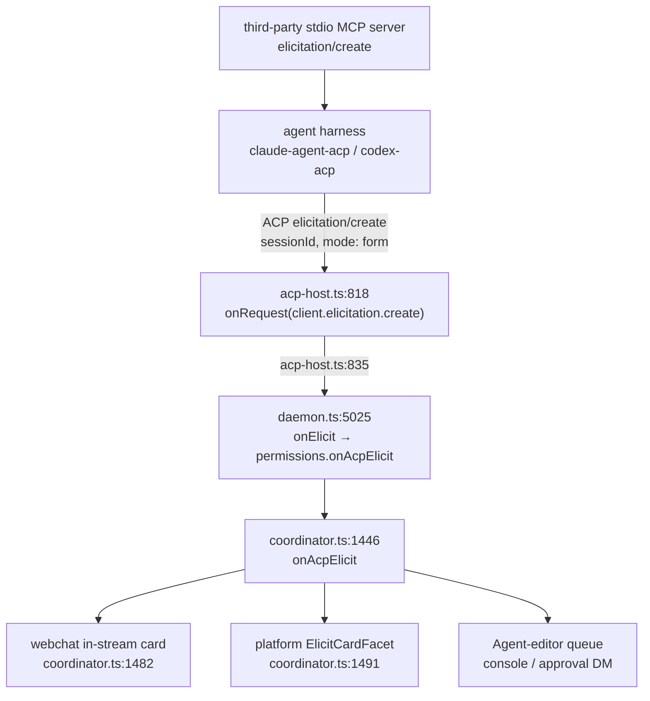

# MCP-Side Elicitation

**Status:** Audit + design record. **No Gap A code has shipped.** This document closes the first
checkbox of issue [#1965](https://github.com/agentconnect-md/agentconnect/issues/1965) (the audit),
corrects two claims in that issue, records a live check against the two harnesses this repo pins,
and retires Gap B as a non-goal for the elicitation use case. Every `file:line` citation below was
re-derived by opening the file at commit `2b1163b2`; nothing is carried over from the issue text.

Prior art: [#1794](https://github.com/agentconnect-md/agentconnect/issues/1794) closed elicitation
on the **ACP** wire, where the daemon is the client and every chat surface renders the ask. The
reduction (`elicitForm`, `ElicitSurface`) and the four per-platform `ElicitCardFacet` implementers
live there. This document is the **MCP** wire, where our protocol role is reversed: the
`agentconnect` bridge is a server.

## 1. Two wires, two roles

| Wire                         | Our role   | Who renders an ask                        | Owning document                                            |
| ---------------------------- | ---------- | ----------------------------------------- | ---------------------------------------------------------- |
| ACP (daemon ↔ agent harness) | client     | our chat surfaces + webchat               | #1794, [`slack-approval-dm.md`](slack-approval-dm.md) §6.4 |
| MCP (harness ↔ our bridge)   | **server** | the agent's own host (Claude Code, Codex) | this document                                              |

The bridge is `packages/daemon/src/mcp/bridge.ts` — a stdio MCP server that relays `tools/list` and
`tools/call` to the daemon over a Unix-domain control socket
(`packages/daemon/src/mcp/control-server.ts`), where `executeTool` (`packages/daemon/src/mcp/ops.ts:334`)
does the real work. Two entries reach it: the daemon's hidden `mcp-bridge` subcommand where the
runtime shares the filesystem, and the runtime image's own bundle
(`packages/daemon/src/shim/mcp-bridge.ts`, built by `build:shim`) where it does not.

## 2. Two corrections to issue #1965

### 2.1 A server cannot declare `capabilities.elicitation`

The issue's second checkbox asks us to "declare `capabilities.elicitation` on the bridge server."
**That is not something a server can do.** Elicitation is a _client_ capability. In
`@modelcontextprotocol/server` 2.0.0 (already a dependency; no bump needed):

- `ClientCapabilitiesSchema` carries `elicitation: ElicitationCapabilitySchema.optional()` —
  `dist/src-CX2iR2pK.mjs:794`.
- `ServerCapabilitiesSchema` carries `experimental`, `logging`, `completions`, `prompts`,
  `resources`, `tools`, `tasks`, `extensions` — and **no `elicitation` member** —
  `dist/src-CX2iR2pK.mjs:814-826`.

So `bridge.ts:105`'s `{ capabilities: { tools: {} } }` is already correct and must not change. What
an implementation does instead is **read the client's declaration** and gate the ask on it.

### 2.2 The lenient capability rule, and why it is load-bearing

The server SDK stores the client's declaration **verbatim** — `dist/mcp-DXXb3Vv3.mjs:1015`,
`this._clientCapabilities = request.params.capabilities` — and applies leniency only at gate time.
The rule is `isImpliedCapabilityMember` (`dist/src-CX2iR2pK.mjs:462-473`), documented in the block
immediately above it: _"a bare `elicitation: {}` declaration (no mode sub-capability at all) is read
as form support — the pre-mode (2025) meaning of a bare declaration … Declaring any mode explicitly
(for example `elicitation: { url: {} }`) removes the implication."_

Restated as the test an implementation must use:

```
form = e != null && (e.form !== undefined || e.url === undefined)
url  = e?.url !== undefined
```

**This is load-bearing, not pedantry.** On the Claude path the embedded `claude-code` MCP client
declares a **bare `{}`**, observed verbatim on the wire:

```
"capabilities":{"roots":{"listChanged":true},"elicitation":{}}
```

(`1965-livecheck/claude-acp/server.A.log` seq 3; `clientInfo` is `claude-code` 2.1.257 inside
`@agentclientprotocol/claude-agent-acp` 0.76.0.) A naive `e.form != null` read would therefore
silently disable **every ask on the Claude runtime** while Codex kept working — a per-runtime defect
no unit test over our own JSON would catch, because the input that breaks it is written by the
harness.

Note the asymmetry, since both rules meet in this seam: our own **ACP** client declaration is read
by codex-acp with a _strict_ test — `clientCapabilities?.elicitation?.form != null`
(codex-acp 1.11.0-agentconnect.1 bundle, `dist/index.js:25898-25902`, applied in
`shouldUseAcpElicitation` at `:26298-26307`) — which our `elicitation: { form: {}, url: {} }`
(`packages/daemon/src/acp/acp-host.ts:878`) satisfies explicitly. Lenient on the MCP-server side,
strict on the ACP-agent side.

## 3. Mechanism: a return value, never an inverted IPC

`@modelcontextprotocol/server` 2.0.0 exports `inputRequired`, `inputResponse`, `acceptedContent`,
`isInputRequiredResult`, `InputRequiredResult`, `InputResponseView` and
`MissingRequiredClientCapabilityError` (`dist/index.d.mts:738`). A tool **handler returns** "I need
input"; the SDK issues `elicitation/create` and **re-invokes the handler** with the answer. The
serving knobs are `inputRequired: { maxRounds?, roundTimeoutMs?, legacyShim? }` on the server
options (`dist/createMcpHandler-CLhGwQTn.d.mts:2807-2832`), defaults `8`, `600_000`, `true`
(`dist/mcp-DXXb3Vv3.mjs:485`, `DEFAULT_LEGACY_SHIM_ROUND_TIMEOUT_MS = 6e5`, applied at `:492`).

**Do not add a daemon → bridge request direction.** `packages/daemon/src/mcp/ipc.ts` has one
undiscriminated id space minted only by the bridge (`bridge.ts:16`, `:52-58`); the bridge silently
**drops** an inbound frame whose id is not pending (`bridge.ts:38-39`); and the daemon answers an
unknown token with `{ id, ok: false, error: 'unknown or expired session token' }` echoing the id
(`control-server.ts:110-111`), which the bridge's correlator would then match against its own live
call of that id and fail a real tool call with a bogus error. The SDK's return-value mechanism needs
none of this: the ask is issued by the bridge process, on the MCP connection it already owns.

## 4. The audit (issue #1965, checkbox 1)

### 4.1 The issue's three candidates

| Candidate                    | Verdict                                 | Evidence                                                                                                                                                                                                                                                                                                                                                                                                                                                                                                                                                                                                                                                                                                                                                                                                        |
| ---------------------------- | --------------------------------------- | --------------------------------------------------------------------------------------------------------------------------------------------------------------------------------------------------------------------------------------------------------------------------------------------------------------------------------------------------------------------------------------------------------------------------------------------------------------------------------------------------------------------------------------------------------------------------------------------------------------------------------------------------------------------------------------------------------------------------------------------------------------------------------------------------------------- |
| `shareFile` destination      | **REFUTED by construction**             | The tool takes no coordinates at all — `packages/daemon/src/mcp/ops/share-file.ts:13-15`: _"this tool takes NO coordinates at all … no new authorization question exists because the model cannot name a destination."_ The destination is read from the trusted turn at `:119`, `deps.shareTarget?.(ctx)`. It is also a stated user-facing convention — [`product-conventions.md`](../product-conventions.md)`:371-380`, _"every coordinate comes from the trusted active turn."_ There is nothing to ask, and asking would _introduce_ the authorization question the design removed.                                                                                                                                                                                                                         |
| search scope                 | **REFUTED**                             | `searchPublicMessages` has no platform, integration, or channel selector, and its own comment says why — `packages/daemon/src/mcp/ops/platform-actions.ts:104-107`: _"Not because the search is scoped to one conversation … but because none of those selectors would mean anything. The session decides the gateway and the credential, and the provider honours no channel narrowing at all."_ The handler (`:322-345`) resolves the gateway from `ctx.integrationId` and applies **no** channel filter (`:345`, which also records the reverted attempt). `searchMemory` is the same shape: args are `query`/`topK`/`maxBytes` only (`packages/daemon/src/mcp/ops/memory.ts:122-126`) and the scope comes from `recordSurface(ctx, deps)` at `:320`. Neither tool has a scope a model could be asked about. |
| `sendMessage` target channel | **REAL — deferred by product decision** | See §4.3.                                                                                                                                                                                                                                                                                                                                                                                                                                                                                                                                                                                                                                                                                                                                                                                                       |

### 4.2 The candidates the audit found that the issue missed

Two of these are _fail/suppress_ cases an ask would improve; one is the bridge's only **silent wrong
answer**, which an ask would fix.

| Site                                                                                      | What it does today                                                                                                                                                                                            | Shape of the ask                                                                                                                                                              |
| ----------------------------------------------------------------------------------------- | ------------------------------------------------------------------------------------------------------------------------------------------------------------------------------------------------------------- | ----------------------------------------------------------------------------------------------------------------------------------------------------------------------------- |
| `packages/daemon/src/mcp/ops/platform-reads.ts:117` (`listKnownUsers`, from `:110`)       | With >1 bot on the platform, returns `{ users: [] }` plus `MULTI_INTEGRATION_NOTE` — a _suppression_, because the local session store pools history by agent+platform and ids cannot be attributed to one bot | "Which bot?" — a bounded enum of the agent's own integrations on that platform, from the trusted snapshot                                                                     |
| `packages/daemon/src/mcp/ops/platform-reads.ts:142` (`listChannels`, from `:127`)         | The same suppression for the observed-history fallback (the live path returns `[]` on a platform whose bot API cannot enumerate chats — `:136-138`)                                                           | The same bounded enum                                                                                                                                                         |
| **`packages/daemon/src/mcp/ops/gateway.ts:52`** (`resolveGatewayForPlatform`, from `:42`) | With no `integrationId` and no match on the session's own integration, **silently picks `candidates[0]`**                                                                                                     | The same bounded enum — and this is the highest-value ask in the bridge, because it is the one place a tool returns a confident answer that may simply be about the wrong bot |

`MULTI_INTEGRATION_NOTE` (`gateway.ts:12-15`) already tells the model to "pass a specific
`integrationId`", which is exactly the information an elicitation would collect from a human instead
of hoping the model guesses. All three asks share one enum — `integrationsOnPlatform(ctx, platform)`
(`gateway.ts:29`) — drawn from the trusted session snapshot and therefore **bounded, small, and
never sourced from tool input**. That is what makes them the right first asks: a closed enum, a
read-only effect, and a tool body that is safe to replay (§7 rule 4).

### 4.3 `sendMessage` target channel: deferred, with reasons

`sendMessage` does not guess a target; it **fails**. With no `toAgent`, `toUser` or `channel` it
throws `` `toAgent`, `toUser`, or `channel` must select the target `` plus `SEND_MESSAGE_TARGET_HELP`
(`packages/daemon/src/mcp/ops/messaging.ts:448-452`), and the `channel` branch requires the id
(`:104`). So an ask is genuinely available here, and the issue was right that it is the highest-value
one in principle.

It is nevertheless **deferred**, for three reasons the next person should not have to re-litigate:

1. **The enum is unbounded.** Unlike §4.2's integration list, the candidate set is every channel the
   bot can see. `listChannels` enumerates it on some platforms and returns `[]` on others
   (Telegram — `platform-reads.ts:136-138`), so the ask degrades to a free-text box on exactly the
   platforms where a mistyped id is least recoverable.
2. **The effect is visible and irreversible.** Every visible `sendMessage` lands at a channel
   **root** ([`product-conventions.md`](../product-conventions.md)`:336-340`) — in front of a whole
   channel. A wrong answer is not a wasted read; it is a post.
3. **It needs a product amendment first.** `product-conventions.md:336` states what `sendMessage` is
   for as a user-facing invariant. Adding "and it may ask you which channel" changes that contract,
   and belongs in that document before it belongs in code.

The §4.2 asks have none of these properties, which is why they are the recommended first
implementation and this one is not.

## 5. The live check

### 5.1 The forwarding chain

A third-party MCP server's elicitation reaches our own daemon. Both harnesses this repo pins forward
it onto the ACP wire, where the code #1794 landed picks it up.



The gate is exactly the capability `acp-host.ts:878` already declares —
`elicitation: { form: {}, url: {} }`. The frame carries a `sessionId`, **no** `toolCallId` and no
`_meta.codex_approval_kind`, so `isMcpToolApprovalElicitation`
(`packages/daemon/src/daemon/tool-classification.ts:78-80`) is `false` and the `onElicit` branch is
taken: a third-party server's _question_ is cleanly distinguishable from Codex's own _MCP-tool
approval_, which takes the editor queue instead (`coordinator.ts:1462-1469`).

One correction to the code's own commentary while we are here: `coordinator.ts:1440-1445`'s doc
comment says the ask is rendered "as a Slack card." The body no longer does that — it dispatches
through `this.host.elicitCardFacet(p.plan.platform)` (`:1491`), webchat (`:1482-1486`), or the editor
queue, and declines only where the surface has no facet. The comment is stale, not the code.

### 5.2 What was run

Instrument: a throwaway stdio MCP **server** on `@modelcontextprotocol/server` 2.0.0 with one tool,
`ask_a_question`, whose handler returns
`inputRequired({ requestState, inputRequests: { colour: inputRequired.elicit(...) } })` — a titled
single-select enum, Red/Green/Blue — and on re-entry reports the answer.
`inputRequired: { roundTimeoutMs: 20000, maxRounds: 2, legacyShim: true }`, so nothing sat on the
600 s default. Artifacts, including a verbatim tap of every JSON-RPC frame in both directions, are in
the session scratchpad under `1965-livecheck/`.

| Run  | Harness                                         | Variant                                                              | Result                                                                                                                                                                                                                                                                                          |
| ---- | ----------------------------------------------- | -------------------------------------------------------------------- | ----------------------------------------------------------------------------------------------------------------------------------------------------------------------------------------------------------------------------------------------------------------------------------------------- |
| A    | claude-agent-acp 0.76.0                         | ACP client declares `elicitation: { form, url }`                     | **Forwarded and answered.** MCP `elicitation/create` out (`claude-acp/server.A.log` seq 14) → ACP frame in (`claude-acp/client.A.log:39`; `VERDICT elicitationReachedAcpClient: true` at `:54`) → accept `{colour:"green"}` → tool returned `ROUND-TRIP OK: a human answered "green".` (seq 19) |
| B    | claude-agent-acp 0.76.0                         | same, the human **declines**                                         | **Forwarded and declined cleanly.** `{"action":"decline"}` re-entered the handler as `{kind:'elicit',action:'decline'}`; the tool returned an `isError` result — a decline needs no exception (`claude-acp/server.B.log` seq 15-19)                                                             |
| 4    | codex-acp 1.11.0-agentconnect.1 / @openai/codex | `CODEX_CONFIG={"features":{"default_mode_request_user_input":true}}` | **Full round trip.** ACP `elicitation/create` with `isCodexOwnApproval:false`, `_meta:null` (`acp-wire.run4.log` seq 16-17) → accept → tool completed → the model echoed `ROUND-TRIP OK` (seq 21-34)                                                                                            |
| 5    | same                                            | `CODEX_CONFIG={}` — feature flag **off**                             | **Still forwarded; full round trip.** See §5.3.3                                                                                                                                                                                                                                                |
| 6    | same                                            | ACP client declares **no** `elicitation` capability                  | **Not forwarded (0 frames).** Codex auto-cancelled; the tool saw `action=cancel` and its tool call went `status:"failed"` (`run6.stdout.txt` seq 17). Graceful degradation, no hang                                                                                                             |
| 1, 7 | same                                            | fixture emits a **root-level `title`** in `requestedSchema`          | **Not forwarded (0 frames).** See §5.3.1                                                                                                                                                                                                                                                        |

Both harness versions are the ones this repo pins: `CLAUDE_ACP_VERSION=0.76.0` and
`CODEX_ACP_VERSION=1.11.0-agentconnect.1`, `docker/runtime-sandbox.Dockerfile:7-8`.

### 5.3 Boundary conditions an implementation must respect

**5.3.1 A root-level `title` in `requestedSchema` kills the codex forward.** Codex core re-parses
`requestedSchema` with a deny-unknown-fields type. Observed: zero forward frames and
`` unknown field `title`, expected one of `$schema`, `type`, `properties`, `required` ``
(`codex-appserver-logs-run7/app-server.log`), with the tool left holding `action=cancel`. An emitted
`requestedSchema` must therefore carry **no root keys beyond `$schema` / `type` / `properties` /
`required`**. Property-level `title` / `description` / `oneOf` are fine and are exactly what the card
renders from. The claude path is more tolerant — the same root `title` survived into its ACP frame
(`claude-acp/client.A.log:39`) — which is precisely why a form that works on one harness proves
nothing about the other.

**5.3.2 Codex's agent-full-access profile cancels a plain question.** In `handleElicitation`
(codex-acp 1.11.0-agentconnect.1 bundle, `dist/index.js:26151-26158`), when
`fullAccessHttpServers?.(params)` returns a set, the ask is accepted **only** if it is a tool
approval (`context.isToolApproval`) with session persistence for a known server; everything else
returns `{ action: 'cancel' }` **without ever reaching ACP**. A third-party server's question is not
a tool approval, so under that profile it is cancelled. **Read from source only — not observed
live** (§5.4).

**5.3.3 Codex's `request_user_input` feature flag is not the gate for an MCP server's ask.**
`packages/daemon/src/runtimes/codex-config.ts:85-87` says the feature is "the only path from a Codex
turn to our ACP form elicitation," and `acp-host.ts:724-725` therefore enables it whenever the host
services session elicitations. That holds for **Codex's own** ask. It does **not** hold for a
third-party MCP server's: run 5 forwarded and completed a full round trip with `CODEX_CONFIG={}`.
The two paths are independent; do not reason about one from the other.

**5.3.4 The negotiated MCP protocol version was `2025-11-25` on both paths**, the era where the SDK's
legacy shim (real server→client requests plus handler re-entry) does the work rather than the client
fulfilling an `input_required` return. One handler serves both eras, but the round-timeout and
max-rounds knobs are the shim's.

### 5.4 What was NOT observed

The check is narrower than "it works". Stated plainly, with the next experiment for each:

| Gap                                               | What is actually known                                                                                                                                                                                                                                 | Next experiment                                                                                                                                                |
| ------------------------------------------------- | ------------------------------------------------------------------------------------------------------------------------------------------------------------------------------------------------------------------------------------------------------ | -------------------------------------------------------------------------------------------------------------------------------------------------------------- |
| **No full daemon-to-chat round trip**             | The **ACP frame** was observed arriving at a test ACP client that declares the same capability the daemon declares. The daemon half was read from source (`acp-host.ts:818` → `daemon.ts:5025` → `coordinator.ts:1446`), not executed.                 | Run a real daemon with a Slack (or webchat) turn, register the fixture as a session MCP server, and capture the card plus the answer's return path end to end. |
| **§5.3.2 full-access auto-cancel is source-only** | The branch and its condition were read in the shipped bundle. No run exercised a permission-profile / full-access session.                                                                                                                             | Launch codex-acp under a permission profile with an HTTP MCP server configured, issue a non-approval form ask, and confirm 0 ACP frames + `action=cancel`.     |
| **URL mode unprobed**                             | Every run used `mode: "form"`. The daemon declares `url: {}` (`acp-host.ts:878`), the coordinator has a distinct consent path for it (`coordinator.ts:1481-1491`), and codex gates it on `clientSupportsUrlElicitation` (`dist/index.js:26303-26304`). | Have the fixture issue a URL-mode elicitation; check both harnesses forward it and that the URL never enters model context or a card body.                     |
| **Timeout/abandonment against a real harness**    | The fixture has a 20 s watchdog and a `--hang` self-test, but no run left a harness ask unanswered to its own deadline.                                                                                                                                | Answer nothing; observe what each harness does at its own timeout and what the tool receives.                                                                  |
| **In-sandbox (image shim) bridge unprobed**       | All runs used a local stdio server. The in-sandbox bridge ships on the _image's_ cadence, not the daemon's (§7 rule 3).                                                                                                                                | Repeat run 4 inside a runtime-sandbox pod against the image's own `mcp-bridge.js`.                                                                             |

### 5.5 Harness coverage

**The separate harness-coverage sweep commissioned for this document returned no report** — its
output directory is empty. This table therefore carries only what the live check itself verified.
Every other row is `UNVERIFIED` and must be treated as unknown, **not** as inferred from a sibling
harness: the two harnesses we did probe already disagree about a root-level `title` (§5.3.1), so
per-harness verification is the only thing that counts here.

| Harness                                                                                                                                      | Version                                                                                       | MCP ask → ACP `elicitation/create`                                                                                                                                                | Evidence                                                                                                                                                                                                                                                        |
| -------------------------------------------------------------------------------------------------------------------------------------------- | --------------------------------------------------------------------------------------------- | --------------------------------------------------------------------------------------------------------------------------------------------------------------------------------- | --------------------------------------------------------------------------------------------------------------------------------------------------------------------------------------------------------------------------------------------------------------- |
| `@agentclientprotocol/claude-agent-acp`                                                                                                      | 0.76.0 (pinned, `docker/runtime-sandbox.Dockerfile:7`)                                        | **VERIFIED — forwards.** Accept and decline both round-trip; tolerates a root-level `title`                                                                                       | runs A, B (`1965-livecheck/claude-acp/`). Mechanism also read in the 0.75.1 bundle on disk: `dist/acp-agent.js:5348-5352` `handleMcpElicitation` — _"forwarding them to the client over ACP"_ — attached at `:5988` only when the ACP client advertised support |
| `@agentconnect.md/codex-acp` (+ `@openai/codex`)                                                                                             | 1.11.0-agentconnect.1 (pinned, `docker/runtime-sandbox.Dockerfile:8`)                         | **VERIFIED — forwards.** Rejects a root-level `title` before ACP; auto-cancels when the ACP client declares no `elicitation`; unaffected by the `request_user_input` feature flag | runs 1, 4, 5, 6, 7 (`1965-livecheck/acp-wire.run*.log`)                                                                                                                                                                                                         |
| DeepSeek harness (`dsh-acp`)                                                                                                                 | `@openma/deepseek-harness-acp@^0.4`; image pin 0.4.31 (`docker/runtime-sandbox.Dockerfile:9`) | **UNVERIFIED**                                                                                                                                                                    | not probed                                                                                                                                                                                                                                                      |
| `antigravity-acp`, `opencode`, `kilocode`                                                                                                    | present in the local runtime store; no repo pin read for this document                        | **UNVERIFIED**                                                                                                                                                                    | not probed                                                                                                                                                                                                                                                      |
| Curated registry entries (`hermes-agent`, `open-interpreter`, `kiro-cli`, `qoder-cli`, `qoder-cli-cn`) and the public ACP registry generally | see `packages/daemon/src/runtimes/curated.ts`                                                 | **UNVERIFIED**                                                                                                                                                                    | not probed                                                                                                                                                                                                                                                      |

A harness that does not forward is not a correctness problem for us, because both non-forwarding
outcomes we observed are graceful: `action: cancel` or `action: decline`, re-entered into the handler,
with the tool free to return a usable result. Preserving that is §7 rule 6.

## 6. Gap B, corrected

Issue #1965's Gap B says that when the agent connects to a third-party MCP server and that server
elicits, "it never reaches Slack", and that putting it there "would mean AgentConnect sitting in the
middle as an MCP **client**, which we do not have at all today."

**The premise is false, and §5 is that exact case.** An ordinary third-party stdio MCP server's
elicitation arrived on our ACP seam, gated on the capability we already declare, and routes to the
chat card through the code #1794 landed. The harness is already the MCP client; we are already the
ACP client that renders its forwarded asks.

Therefore:

- **AgentConnect does not need to become an MCP client or proxy for the elicitation use case.** None
  of Gap B's cost — a per-session client, a routing scheme for its tool results and asks, and a fresh
  argument about the "CP is never on the message hot path" invariant — is owed.
- **What remains is per-harness coverage**, which is §5.5, plus the unprobed conditions in §5.4.
- **Any non-elicitation reason to want an MCP client is a separate question.** This check says
  nothing about it.

The related proxy shape is already rejected on its own grounds in
[`centralized-tool-management.md`](centralized-tool-management.md) §5.1 / §10 — rewriting the legacy
SSE `endpoint` event "means parsing MCP and conflicts with the transparent-proxy rule". The
elicitation non-goal is recorded beside it, pointing here.

## 7. Rules an implementation must respect

These are properties of the surrounding code, not style preferences. Each has already cost someone an
investigation.

1. **Do not spread `SessionContext` per call.** `packages/daemon/src/mcp/ops/memory.ts:175` keys a
   provenance ledger with `new WeakMap<SessionContext, Set<string>>`, and
   `McpControlServer.writtenMemoryTopics(token)` reads it back through the **original** object from
   the sessions map (`control-server.ts:46-48`, populated at `:36`). A `{ ...ctx, elicit }` built per
   call silently orphans that ledger.
2. **`OpsDeps` is declared in `packages/daemon/src/mcp/ops.ts:163`**, not in `ops/context.ts`. A new
   per-call deps member belongs beside `canRun` (`:178`) and `evaluationTool` (`:190`). A change that
   edits only `ops/context.ts` does not typecheck.
3. **A guard against an old bridge must be structural.** The in-sandbox bridge is the runtime
   **image's** own bundle (`packages/daemon/src/shim/mcp-bridge.ts`, built by `build:shim`), so it
   ships on the image's cadence, not the daemon's — **image skew is the normal case**. An old bridge
   receiving an ask marker inside a tool result would `JSON.stringify` it straight to the model
   (`bridge.ts:124-125`). The guard therefore belongs in `executeTool` (`ops.ts:334`) or
   `McpControlServer.handle` (`control-server.ts:106`), where one place decides — never in a line each
   op remembers.
4. **Re-entry replays the whole tool.** The SDK re-invokes the same handler, so `executeTool` runs
   from the top every round: the turn gate (`ops.ts:340`), the evaluation-tool dispatch (`:346-349`),
   the memory access/approval gate (`:352-372`) and the tool body — including any I/O the tool already
   did before it decided to ask. **Rule: a tool may only ask before it does observable work, or must
   be safe to replay.** The §4.2 asks satisfy this trivially (they ask before any gateway call); a tool
   that has already posted a message does not.
5. **The turn gate races a human-paced ask.** `ops.ts:340` fails closed with
   `this agent turn has been stopped`, so a user can answer and _still_ get that error if the turn was
   cancelled meanwhile. That is arguably the right outcome, but it must be a chosen one: pin
   `roundTimeoutMs` explicitly rather than inheriting the SDK's 600 s default
   (`dist/mcp-DXXb3Vv3.mjs:485`), and assert the chosen behaviour in a test.
6. **A decline, a cancel and a timeout must each leave the tool with a usable outcome.** Both observed
   non-answers (`decline`, run B; `cancel`, run 6) re-entered the handler as an `InputResponseView` the
   tool read and turned into an ordinary `isError` result — no exception, no hang. An MCP host that
   cannot or will not render an ask must get today's behaviour, which for the §4.2 sites means the
   existing suppression note or the existing first pick, not a failure.
7. **Test placement.** `packages/daemon/test/mcp-bridge-e2e.test.ts` is in `WINDOWS_EXCLUDED`
   (`packages/daemon/vitest.config.ts:30`) and proves nothing there;
   `packages/daemon/test/mcp-control-server.test.ts` is **not** excluded and does run on Windows, so a
   new case in it must be platform-neutral or carry `it.skipIf(process.platform === 'win32')`.
8. **The #1794 lesson still applies:** our tests assert the JSON we build, never the rules the platform
   applies to it. §5.3.1 is that lesson repeating on a new wire. A Gap A implementation needs a live
   check against both pinned harnesses before it is believed.

## 8. Open questions

- **Who renders a bridge-issued ask?** The agent's own host (Claude Code, Codex TUI) — **not** our
  chat cards. None of #1794's facets are involved on this half, which makes the §4.2 asks worth less
  to a headless or webhook turn than they first look. Whether an unattended turn should ask at all, or
  keep today's suppression note, is unresolved.
- **Should a §4.2 bot disambiguation be remembered for the rest of the turn?** The MCP round trip has
  no natural place to cache it, and `executeTool` deliberately re-evaluates its gates per call (rule
  4). A per-turn memo would be new state with its own invalidation story.
- **Does `sendMessage` (§4.3) want an ask at all**, or a different mechanism — a narrowing read the
  model drives, rather than a question aimed at a human?
