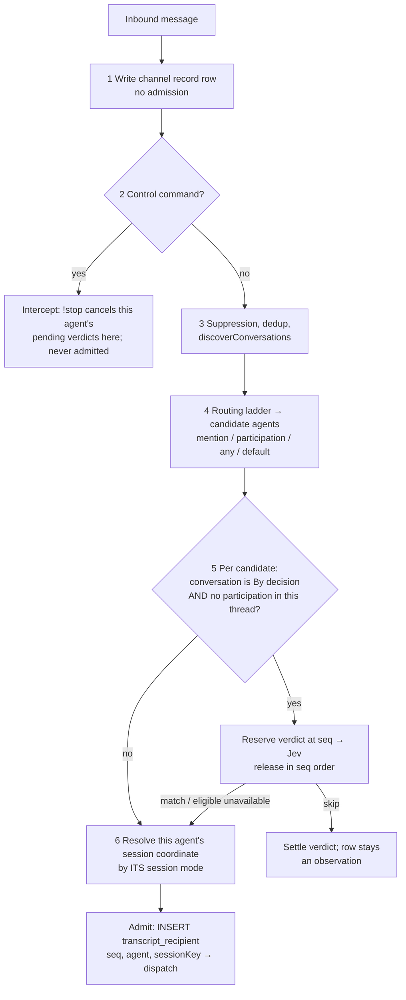

# Message Intake

> Status: Proposed. Supersedes the storage and ordering sections of
> [decisions.md](decisions.md) (§4 observation window, §7.2, §7.4 evaluation host, §8) and the
> per-agent transcript rows of [channel-session-mode.md](channel-session-mode.md) (§6.2, §10, §12.2);
> each superseded section now points here. Routing semantics that those documents define and this
> one does not mention are unchanged.
> Scope: every chat-platform message a daemon receives, whether it owns the platform connection or
> the relay forwards it. Webhooks, code-host events, cron, webchat, and agent-to-agent calls are
> outside it.
> Primary implementation areas: `packages/daemon` (store, ingress ladder, decision gate),
> `packages/control-plane` (bot-assign projection), `packages/relay`, `packages/protocol`.

## 1. Summary

Today a daemon decides what to do with a message and only then remembers it: the transcript row is
written by the session the message joined, under that session's coordinate, and a message that
joined no session is kept only while a session happens to be live nearby. Two consequences follow.
A Decision that wants to judge a message against what was said before it has nothing to read, so
[decisions.md](decisions.md) §8.1 proposed a second store for the same messages. And a conversation
whose agents append to one long session has to write the same message once per agent, because the
row's coordinate _is_ the session.

This design inverts the order. **Record first, judge second, admit last.**

1. Every inbound message is written to the conversation's **channel record** — the existing
   `transcript` table, re-keyed so one message is one row — before anything looks at it. The row
   names no session.
2. The routing ladder picks candidate agents. Where a conversation is **By decision**, a Decision
   judges the message against the channel record and may drop it.
3. Each agent that takes the message in writes an **admission**: a row that binds the message to
   that agent's session. A message nobody admitted stays in the channel record as an
   **observation**, available to later judgments, and is reclaimed by count.

One table serves the Decision's state, the session's history, and the console's transcript view.
Whether a message is "in a session" is a fact about admissions, not about where the row lives.

## 2. What exists today

The facts this design builds on, from `packages/daemon/src/store/local-store.ts` and
`packages/daemon/src/daemon.ts`:

- **`transcript` is keyed by the session coordinate.** Rows carry `(orgId, channel, thread, ts)`
  where `channel` is `transcriptChannelKey(channel, transportScope)` and `thread` is
  `transcriptCoords(msg).thread = msg.sessionThread ?? msg.thread ?? msg.msgId`. The dedup index
  `transcript_text_ts` is on that full key, so an `append` conversation stores the same message once
  per agent, each under its `append:<epochMs>` coordinate (channel-session-mode.md §6.2).
- **There is no session id on a transcript row.** A session and its rows meet through
  `sessionKey(platform, channel, thread, agentId, transportScope)` — the row's `(channel, thread)`
  plus an agent id _is_ the session's primary key. Who may see a row is `AGENT_DELIVERY_SCOPE_SQL`:
  `sender`, the first-recorded `recipient`, or a `(orgId, channel, thread, ts, agentId)` row in
  `transcript_recipient`.
- **Rows are written only near a live session.** `recordObservedInbound()` returns without writing
  unless a session at that coordinate was touched within the idle window, has a turn in flight, or is
  initializing. A message in a conversation with no session is not recorded.
- **Nothing reclaims transcript rows.** `deleteSession` — the daemon's only `DELETE FROM sessions` —
  deliberately leaves them behind (channel-session-mode.md §3.2).
- **`thread` is already the physical thread in the default mode.** Slack normalizes
  `thread: message.thread_ts ?? message.ts`, so a root message's coordinate is its own id and a
  reply's is its root's; Telegram and Discord canonicalize to the same shape. Only `append:*` rows
  carry a coordinate that is not a platform thread.
- **Thread participation already has its own record.** `thread_participation (channel, thread, agentId, transportScope, sessionKey)` answers "which agents are active in this
  physical thread" independently of the sessions table (channel-session-mode.md §6.4).
- **The store upgrades in place.** `SCHEMA_MIGRATIONS` runs ordered steps under `user_version`
  (emulated on the shared PostgreSQL store with `_local_store_schema_version` and an advisory lock),
  and a daemon refuses a store newer than it understands. The #1041 step rebuilt
  `transcript_recipient` and its indexes in place; `THREAD_PARTICIPATION_BACKFILL` seeded a new table
  from `sessions`.

## 3. The model

Terms are in [`CONTEXT.md`](../../CONTEXT.md); this section fixes their relationships.

**A channel record is per conversation, not per session.** Its unit is one platform message in one
conversation on one physical bot: `(orgId, transcriptChannelKey(channel, transportScope), ts)`. The
row keeps the message's physical `thread` exactly as the platform normalizes it, so a Decision can
tell sub-conversations apart and so participation lookups have something to join on. It never keeps
a session coordinate.

**Admission is per agent and names the session.** One message may be admitted by several agents —
peer fan-out, a Choice answer that selects two agents, two agents appending in one channel — and each
admission is its own row naming that agent's session. A row with no admission is an observation. The
same row is both an observation to an agent that skipped it and history to an agent that admitted it;
nothing is copied.

**The session coordinate moves off the row and into the admission.** Everything session-side that
read `(channel, thread)` — the context refresh, the replay cursor, the console page — reads "rows
admitted into this session" instead. The coordinate itself is unchanged: `createNew` still keys a
session by the thread, `append` still keys it by the per-agent reservation of
channel-session-mode.md §3.3. What changes is that the transcript no longer has to be laid out along
it.

**Stage 1 keeps a coordinate disjunct, deliberately.** Until §5.2's admitted-history / background
split exists, the only thing that feeds a `createNew` session the §8.5 cross-agent catch-up is the
physical-thread partition — a peer's replies carry the _peer's_ admission, and "not admitted at all"
is not the set they fall in. So the Stage 1 session scope is `thread = <coordinate> OR admitted into
<sessionKey>`: exact for `append` (its coordinate is no thread) and unchanged-from-today for
`createNew`. The disjunct is removed with the Stage 3 background block, which is what replaces it.

**The two coordinates of channel-session-mode.md §3.1 stay split, and gain a third reader.** The
delivery coordinate (`msg.thread`) says where an answer posts; the session coordinate says which
session an admission joins; the channel record's `thread` says which physical thread the message was
in, which is what participation is keyed on. In the default mode the first and third are the same
value; in `append` they still are, while the second differs.

**Ordering is the record's insertion order.** `transcript.seq` is monotonic within a channel because
every writer appends. It is the position a Decision candidate waits at, the cut a frozen Jev state
is taken at, and the axis "the newest 100" is measured on. No second sequence exists.

## 4. Storage

All changes are to the daemon store, in both dialects, through `SCHEMA_MIGRATIONS` (§10).

### 4.1 `transcript`

| Change               | Detail                                                                                                                                                                                                                                                                                   |
| -------------------- | ---------------------------------------------------------------------------------------------------------------------------------------------------------------------------------------------------------------------------------------------------------------------------------------- |
| `thread`             | The physical thread as the platform normalizes it (root = its own id). Never an `append:*` coordinate. Nullable: `NULL` means the thread was not recorded (only rows migrated from `append` coordinates, §10), and §9 reports it as unknown rather than as a root.                       |
| `transcript_text_ts` | Unique on `(orgId, channel, ts) WHERE kind = 'text'`. One conversational message is one row per conversation. Internal rows (`tool`, `reasoning`, `app`) have no platform `ts` and are not deduplicated, as today.                                                                       |
| `recipient`          | Retired from the visibility predicate. It stays as provenance of the first delivery; admissions are the authority.                                                                                                                                                                       |
| Indexes              | `transcript_thread_seq`, `transcript_thread_event_time`, `transcript_thread_revision` lose `thread` from their leading columns and become `(orgId, channel, …)`; the physical thread is a filter, not a partition. `transcript_app_card` and `transcript_agent_tool_call` are unchanged. |

Nothing is added to the row. Whether it was admitted, by whom, into what, is the next table's job.

### 4.2 `transcript_recipient` becomes the admission record

```sql
CREATE TABLE transcript_recipient (
  seq        INTEGER NOT NULL,   -- the transcript row admitted
  agentId    TEXT    NOT NULL,
  sessionKey TEXT    NOT NULL,   -- sessions.key the message joined
  PRIMARY KEY (seq, agentId)
);
CREATE INDEX transcript_recipient_session ON transcript_recipient (sessionKey, seq);
```

- **Keyed by `seq`, not `(channel, ts)`.** Internal rows have no `ts` and still belong to exactly one
  session; keying the admission on the row id covers them with the same shape as conversational rows.
- **`sessionKey` is the local session key**, computable at admission from
  `(platform, channel, coordinate, agentId, transportScope)` with no write. The outward `sessionId`
  is minted lazily for the console and is not needed here; `deleteSession` is keyed by `key`, which is
  what retention joins on (§8).
- **One admission per agent per row.** `INSERT OR IGNORE` — two concurrent admitters both succeed,
  which is the property a single multi-valued column could not give.
- **Visibility.** `AGENT_DELIVERY_SCOPE_SQL` becomes: `sender = agent` or an admission row for
  `(seq, agent)` exists. The `kind = 'text'` guard it needed against ts-sharing internal rows is no
  longer needed, since the join is on `seq`.

An agent's own output — its posts, tool calls, reasoning — is written with `sender = agent` and one
admission row for the session that produced it, so "the rows of session S" is a single index range on
`transcript_recipient_session` whichever kind they are.

### 4.3 Decision records

The `decision_conversation`, `decision_observation`, and `decision_lane` tables of decisions.md
§8.1 are not created. Their jobs are covered as follows:

| decisions.md §8.1       | Here                                                                                                                                                   |
| ----------------------- | ------------------------------------------------------------------------------------------------------------------------------------------------------ |
| `decision_observation`  | The `transcript` row itself.                                                                                                                           |
| `decision_conversation` | Nothing. The next ingestion sequence is `seq`; observation start and gap markers are derived (§9).                                                     |
| `decision_lane`         | `decision_release (orgId, channel, subject, releasedSeq)` — one durable cursor per conversation and **subject**, advanced only in `seq` order (§5.1).  |
| `decision_delivery`     | `decision_verdict (seq, subject, frozenInput, answer, disposition, deadline, ownerFence, …)` — the frozen input, the typed answer, and how it settled. |

The **subject** is what one evaluation is for. A Stage 1 gate's subject is the target agent: one
verdict per `(seq, agentId)`, settled as `skip`, `match`, or `unavailable`. A Stage 2 router's
subject is the bot's routing scope for that conversation: **one** verdict per `seq`, taken before any
target is known, whose settlement is the frozen, deduplicated target set — each entry an
`(agentId, daemonId)` with its own forwarding/admission disposition — or `skip`. That is the
pre-target selection receipt decisions.md §7.4 requires, kept separate from the per-target
admissions that follow it; a retry reads the frozen set and never re-evaluates. The two subjects
never coexist for one conversation (decisions.md §3.1: one effective consumer).

`decision_verdict` keeps every field decisions.md §8.3 freezes (Decision id, provider, model,
question, condition, binding, session mode, owner fence) minus anything already on the transcript
row it points at. Its detailed-body retention (newest 20 per conversation and target, 24 hours,
minimal metadata for 7 days) is unchanged from §8.1.

## 5. Case A — daemon-owned ingress

The daemon holds the platform connection (Slack Socket Mode, Telegram, Discord, Feishu). This
replaces the order of `onInboundOutcome` and `fanOutToThreadPeers`; the ladder rungs themselves are
those of [send-message-routing-rework.md](send-message-routing-rework.md).



**Step 1 — record.** `recordObservedInbound()` loses its recency gate and its per-agent loop.
Every message in every conversation the daemon has a row for is written once, including
conversations whose trigger is `off`: a Decision enabled later, or an agent activated later, must
not start blind. The write carries `thread` (physical), `ts`, `sender`, text, quote, attachment
mention, `eventTimeUs`, and `postId` exactly as today; it carries no recipient and no coordinate.
`INSERT OR IGNORE` on `(orgId, channel, ts)` makes a redelivery a no-op, and the closing edit of a
streamed reply still refreshes its row through the `authoritative` path.

**Step 2 — commands.** `parseCommand` runs on the recorded message. A command is never judged and,
with one exception, never admitted; it acts on the target's session as today. The exception is
`!queue <text>`, which is a delivery: `runQueue` dispatches the stripped payload through the ordinary
admission gate, so the admission attaches to the recorded row — the row keeps the command as typed,
which is also what the channel shows, and prompt assembly strips the `!queue` prefix from an admitted
row whose text parses as that command. Stripping is a pure function of the text, so a replay builds
the same prompt. `!stop` additionally cancels every pending
`decision_verdict` for that agent in that conversation, so a stop never waits on Jev (decisions.md
§8.3). The row stays in the record: a Decision may well want to know someone said stop.

**Step 3 — suppression.** Per-connection dedup, agent-echo suppression, Telegram thread
canonicalization, `discoverConversations`, and the drain gate run where they do now. A message the
ladder later drops has already been recorded; that is the point.

**Step 4 — candidates.** `routeRules` and the peer fan-out produce the same target set they produce
today. The thread-owner and participant lookups read `thread_participation`, keyed on the row's
physical `thread`.

**Step 5 — judge.** For each candidate whose conversation is **By decision**, one of two things:

- **The agent already participates in this physical thread** (`thread_participation` has a row for
  `(channel, thread, agentId, scope)`) → **no evaluation.** The user is mid-conversation with this
  agent; asking Jev whether to keep talking would cost a call per reply and produce a silence nobody
  can explain. The message proceeds to step 6.
- **Otherwise** → reserve a `decision_verdict` at this row's `seq` for this agent, evaluate against
  the state of §9, and settle. `skip` ends here: the row remains an observation and the release
  cursor advances. `match`, and `unavailable` where the consumer's failure policy continues, proceed
  to step 6.

Top-level messages have no thread the agent could participate in, so they are always judged. In an
`append` conversation the same rule holds: a top-level message is judged, a reply inside a thread the
agent has answered in is not, and both then join the current append coordinate. **The rule is
identical in both session modes**, which is what lets By decision mean one thing on the console. This
supersedes decisions.md §1 and §3.2's "every eligible message is evaluated, including replies in
established threads"; explicit `@`-mentions are still judged, since a mention is not participation.

A candidate that is not By decision skips this step entirely.

**Step 6 — resolve and admit.** For each surviving target, resolve the session coordinate **by that
agent's own session mode** for this conversation — `createNew` yields the thread, `append` performs
the resolve-or-reserve of channel-session-mode.md §3.3 — exactly where `sessionCoordinateFor()` is
called today, on the target's own copy of the message. The session mode remains a per-agent,
per-conversation setting (`IntegrationChannel.sessionMode`), so this cannot happen before step 4
names the agent (channel-session-mode.md §3.1). Then write the admission row and dispatch. The
inbox lane, the serial gate, the observer, and `SessionManager.handle` read the carried coordinate as
they do now; `SessionManager`'s own transcript append becomes an idempotent upgrade of the row step 1
wrote plus this admission.

### 5.1 Ordering

A verdict is reserved at the row's `seq` before provider I/O. A conversation's candidates for one
subject are released strictly in `seq` order: the oldest unreleased candidate is the only one that can
drain, `skip`/cancel advances `decision_release.releasedSeq` at once, `match`/`unavailable` advance
it after inbox admission is acknowledged or terminally rejected. This is decisions.md §8.3 with the
lane's own sequence replaced by the record's; the recovery table there applies unchanged. Candidates
of different subjects in one conversation, and of different conversations, are independent. A
router's frozen target set is released as one unit: its slot advances once every target is admitted
or terminally rejected, not when their turns finish (decisions.md §7.4).

### 5.2 What the admission gives the agent

The prompt for an admitted message is built from the channel record: rows admitted into this
session are its history; rows in this conversation since the session's last delivered `seq` that are
_not_ admitted are **background** (decisions.md §4 "Supplying an activated agent"), included once and
marked as such; the `decision_verdict`, if any, is the **evidence** block of §8.4. Because there is
one record, the "subtract stable message IDs already delivered" step of §8.4 is a `NOT EXISTS` on
`transcript_recipient` rather than a reconciliation between two stores.

## 6. Case B — relay-forwarded shared bot

A shared bot's Slack HTTP callbacks (and Feishu's) terminate at the relay, which arbitrates and
forwards `rd/msg` to the owning daemon ([shared-bot-relay.md](shared-bot-relay.md) §10). The relay
persists nothing and calls no model.

**Without By decision** nothing changes: `arbitrate()` picks the target from `rc/bot-assign` routes,
thread affinity, and participants, and forwards to that daemon, which runs Case A from step 1 on the
pre-addressed message.

**With By decision**, the routing decision is a model call, and a model call must happen on a daemon.
The relay therefore forwards every eligible message in such a conversation to one **evaluation host**,
which runs the judgment and then distributes the result.

**Who the host is.** The Control Plane computes it and projects it; the relay reads it. For each By
decision conversation on a bot, `rc/bot-assign` carries `evaluationDaemonId`, chosen as:

1. the daemon where the bot's `defaultAgentId` (already on the assignment) is placed, if the bot has
   a default agent and that daemon is live; otherwise
2. among the daemons hosting this conversation's candidate agents, the one with the earliest
   `Daemon.createdAt`.

Both inputs are CP metadata the placement compile already reads. The host changes only when the CP
recomputes — default agent change, placement move, host offline — under the ownership fences the
compile already emits, so every relay instance names the same host and an old host's late verdict
cannot dispatch (decisions.md §7.4, whose "bot default agent's placed daemon" rule this keeps as the
first preference and completes with a fallback).

**What the host does.**

1. Records the message in its channel record (Case A step 1). The host is the one daemon whose
   record of this conversation is complete; other members see only what is forwarded to them, and
   their records of it are their own sessions' history.
2. Runs Case A steps 2–4 with the candidate set the relay resolved (explicit mention, affinity,
   `auto` routes, participants) as the **target constraint** of decisions.md §3.2.
3. Partitions the constraint. A constrained recipient that already **participates** in the message's
   physical thread is an unconditional member of the frozen set — Case A step 5's rule, applied per
   recipient, not to the set. Every other constrained recipient is decision-eligible. The relay marks
   each constrained target it forwards as participant or not, from the participant set it already
   holds (`rc/participant-assign`), because a host on its own SQLite store cannot see another
   daemon's `thread_participation`.
4. Evaluates **once**, with the router as subject (§4.3), if and only if there is no constraint (a new
   unaddressed conversation) or at least one decision-eligible recipient. The single answer is
   matched against the bot's routing rules and decides only the decision-eligible portion: with a
   constraint, it keeps or drops the eligible recipients; without one, it selects the rules' agents
   deduplicated by id. The frozen set is the participants plus whatever the answer kept; it is `skip`
   only when there are no participants and the answer kept nobody. A thread whose every constrained
   recipient participates settles its set with no model call. No candidate is evaluated on its own,
   so one message costs at most one model call, whatever the size of the target set.
5. For each target in the frozen set on **this** daemon, resolves and admits (step 6) and records the
   disposition on the selection.
6. For each target on **another** daemon, forwards the message with the selection's evidence over the
   existing cross-daemon relay path (`rd/agentmsg`-style pre-addressed forwarding, the same transport
   the collaboration router uses). The target daemon runs step 6 for its own agent, does not
   evaluate, and acknowledges; the host records the disposition. One target's refusal does not
   reclassify the others or invoke Otherwise; a retry reuses the frozen set (decisions.md §7.4).

Observation-only forwarding to non-host members (decisions.md §7.2) is not needed: the host's record
is the window, and a member that later becomes host on a shared PostgreSQL store inherits it. On
separate SQLite stores a new host begins with `context.partial = true`, as §9 marks.

## 7. Unchanged paths

These reach the same code and keep today's behavior; they are listed so nobody looks for a change.

- **Agent-authored messages.** A verified AgentConnect author is recorded in the channel record like
  any sender and routed through the collaboration ladder with hop and loop fences; it is never a
  Decision candidate. Unverified bot echoes are recorded and not routed.
- **Control commands** are step 2 above.
- **Direct conversations (DMs).** Recorded and reclaimed like any conversation; still offer neither
  By decision nor a session mode.
- **Webhooks, code-host events, cron, webchat, `sendMessage`.** Not chat ingress; untouched.

## 8. Retention

Two rules, in this order.

1. **An admission lives as long as its session, and so do the session's own rows.**
   `deleteSession(key)` deletes `transcript_recipient WHERE sessionKey = key` and every non-`text`
   row that admission set covers (`tool`, `reasoning`, `app`, `plan`, `elicit`, and any kind added
   later) — they were produced by this session and belong to no other — in the same transaction that removes the session row and clears the append
   reservation. Conversational rows are left in place as observations. Nothing else deletes an
   admission.
2. **An unadmitted row lives while it is among the newest 100 conversational rows of its
   conversation, or while a verdict may still admit it.** After every insert, and periodically while
   idle, delete every row in `(orgId, channel)` — of any kind — that has no admission, whose `seq` is
   below the 100th-newest `text` row's, and that no `decision_verdict` in a non-terminal state
   (`reserved`, `evaluating`, or settled but not yet released) references. The cutoff is counted over
   `text` rows because those are what §9 reads; a tool-heavy turn's internal rows carry an admission
   while their session lives and do not count toward the floor, and any that rule 1 did not remove
   are reclaimed here once they fall under it. The cap counts rows, not
   messages-per-agent, because there is one row per message.

So a conversation with a long-lived `append` session keeps that session's rows for as long as the
session exists, plus a floor of the newest 100 rows of everything else. When the session is
reclaimed by ordinary retention GC, its rows become plain observations and fall to the floor on the
next sweep. This is the growth profile the daemon has today — rows accumulate only where agents are
actually working — with a bounded observation layer under it, and it resolves channel-session-mode.md
§12.2. Verdict bodies follow their own, shorter retention (§4.3).

## 9. The state a Decision sees

Built from the channel record at the reserved `seq`:

- `currentMessage`: the row at `seq`.
- `history`: `text` rows of the same `(orgId, channel)` with `seq < current`, newest 100, oldest-first,
  then trimmed from the oldest end to the evaluator's input budget (8,000 tokens and 32 KiB as in
  decisions.md §8.2). Each carries sender, text, quote, `thread`, and event time. Rows written by
  agents are included as visible replies (decisions.md §3.3); `tool`/`reasoning`/`app` rows are
  excluded.
- `conversation`, `addressing`: unchanged from decisions.md §4.
- `context.partial`: true when the oldest included row is not the oldest the conversation has
  (retention trimmed), when the budget trimmed, or when this daemon's record of the conversation
  began after the conversation did — detected as the first row of the conversation being younger
  than the daemon's participation in it, or when any included row has `thread = NULL` (a row
  migrated from an `append` coordinate, §10), reported as `legacy_thread_unknown` with that row's
  `threadId` emitted as `null`. `omittedMessages` counts rows the budget dropped.

The 100 here is a read window and coincides with the retention floor of §8 only so that the window
is always fully resident; the two limits are separate constants.

## 10. Migration and compatibility

One `SCHEMA_MIGRATIONS` step, run in a transaction before the `CREATE` block:

1. Rebuild `transcript` so `thread` is nullable — SQLite cannot drop a `NOT NULL` in place, so it is
   the copy-rename rebuild the #1041 step used for `transcript_recipient`; the PostgreSQL dialect may
   use `ALTER COLUMN thread DROP NOT NULL`. Rebuild `transcript_recipient` with `seq` and
   `sessionKey`.
2. **Backfill admissions.** Every existing `text` row was written only while a session was live, so
   each is an admission. For each row, the agent set is `recipient` ∪ the old `transcript_recipient`
   rows ∪ `sender` where it is an agent id. The `sessionKey` comes from joining `sessions` on
   `(channel, thread, agentId, transportScope)` — `platform` lives only there. A row whose session is
   already gone gets no admission and is, correctly, an observation. Internal rows join `sessions` by
   `sender` and `(channel, thread)`.
3. **Merge `append` duplicates.** Rows sharing `(orgId, channel, ts)` collapse onto the smallest
   `seq`; their admissions are rewritten to point at it; the others are deleted.
4. **Null `append:*` threads.** Their physical thread was never stored, and inventing one would
   present every old message to a future evaluation as its own root. Set `thread = NULL`; §9 reports
   such rows as thread-unknown and marks the context partial while any is in the window, which a
   busy conversation outgrows within 100 messages. Participation for their real threads is already in
   `thread_participation`.
5. Drop and recreate the transcript indexes with the new leading columns; the `CREATE` block emits
   them.

**Downgrade** is refused by the existing `user_version` check.

**Mixed versions on a shared PostgreSQL pool are NOT a soft window for this step, and the pool must
roll by stop/start rather than by a slow drain.** The version check runs only at open, so a v23
member keeps serving after a v24 member migrates the shared store — but it does not merely write
old-shaped rows. v23's `transcript_recipient` is `(orgId, channel, thread, ts, agentId)` and those
columns no longer exist, so from the instant the migration commits:

- every v23 inbound turn fails before the prompt is built — `ingestInboundTranscript` always sets
  `recipient`, which makes `appendTranscriptLocked` batch an insert into the dropped columns, and
  `SessionManager.handle` awaits it un-caught;
- every v23 agent-scoped transcript read fails too — its `AGENT_DELIVERY_SCOPE_SQL` joins
  `tr.orgId/channel/thread/ts`.

That is an outage on the old side lasting the whole drain, not a bounded loss of a few rows, so the
[k8s-daemon-pool.md](k8s-daemon-pool.md) surge-and-drain roll is the wrong shape here: this version
is rolled by taking the old members down first and bringing the new ones up after, and a Cloud
install schedules it as a brief maintenance stop. (The alternative — keeping a
`transcript_recipient_legacy` shim alive with the old columns through the window — is deliberately
not taken: it would have to accept writes the new predicate cannot see, so it buys availability for
turns whose rows are invisible to the agent anyway.) Within a single self-hosted daemon, which owns
its SQLite store alone, none of this applies.

## 11. What this supersedes

| Document                | Section                                      | Conclusion replaced                                                                                                                                                                     |
| ----------------------- | -------------------------------------------- | --------------------------------------------------------------------------------------------------------------------------------------------------------------------------------------- |
| decisions.md            | §4 Observation window                        | Separate store with separate retention → the channel record (§3, §8 here). "Off stops observation" → every conversation is recorded.                                                    |
| decisions.md            | §1, §3.2                                     | "Every eligible message is evaluated, including replies in established threads" → replies in a thread the agent participates in are admitted without evaluation (§5 step 5).            |
| decisions.md            | §7.2                                         | Observation-only destinations → not needed; the evaluation host's record is the window (§6).                                                                                            |
| decisions.md            | §7.4                                         | Evaluation host = default agent's daemon → same, with a `createdAt`-earliest fallback, projected by the CP (§6). The pre-target selection receipt is the router-subject verdict (§4.3). |
| decisions.md            | §8.1                                         | `decision_conversation`, `decision_observation`, `decision_lane`, `decision_delivery` → `transcript`, `decision_release`, `decision_verdict` (§4.3).                                    |
| decisions.md            | §8.3                                         | Lane ingestion sequence → `transcript.seq` (§5.1). Lifecycle and recovery unchanged.                                                                                                    |
| decisions.md            | §8.4                                         | Dedup by stable message id across two stores → `NOT EXISTS` on admissions (§5.2).                                                                                                       |
| channel-session-mode.md | §6.2                                         | One transcript row per agent under the append coordinate → one row, one admission per agent (§4).                                                                                       |
| channel-session-mode.md | §6.3 "The observer uses the same coordinate" | Observer writes under the session coordinate → observer writes the channel record; the coordinate is on the admission.                                                                  |
| channel-session-mode.md | §10, §12.2                                   | Unbounded growth of transcript rows → retention (§8).                                                                                                                                   |

Everything else in both documents — the coordinate model, `!new`, the reservation, the participation
record, the Decision resource, conditions, the Jev adapter, the console — stands.

## 12. Testing

- **Store, both dialects.** One row per `(orgId, channel, ts)` however many agents admit it;
  `deleteSession` removes the session's internal rows and leaves its conversational rows; two
  concurrent admissions of one row both persist; `deleteSession` removes exactly that key's
  admissions; the sweep deletes only unadmitted rows below the 100th-newest and never a row with an
  admission; a session's rows are one index range on `(sessionKey, seq)`.
- **Migration.** A v23 SQLite fixture with createNew rows, append duplicates, recipient rows, and
  GC'd sessions upgrades to: unchanged createNew rows with admissions, merged append rows with one
  admission per former copy, `thread = NULL` on former `append:*` rows, and no admission for rows
  whose session is gone. Same fixture through the PostgreSQL dialect.
- **Case A.** A message in an `off` conversation is recorded and not routed; a `!stop` is recorded,
  never admitted, and cancels that agent's pending verdicts; a `!queue hello` row is admitted as
  recorded and prompts as `hello`; two agents with different session modes
  in one conversation each get one admission at their own coordinate from one row; a reply in a
  thread the agent participates in reaches admission with no verdict row; a top-level message and a
  mention each produce a verdict; a `skip` leaves the row with no admission and advances the cursor; a
  faster `match` for a later `seq` waits for an earlier candidate's release.
- **Retention.** A row whose verdict is `evaluating`, or settled behind an unreleased earlier
  candidate, survives 100 newer rows and is admitted afterwards with its row intact; 200 tool rows
  from one turn do not push a 50-row conversation's observations under the floor.
- **Case B partition.** A thread reply constrained to participant A and newly mentioned B produces
  one evaluation; a `skip` still admits A and drops only B; a reply constrained to participants only
  produces no model call; a new unaddressed message with no constraint always evaluates.
- **Case B.** CP projects `evaluationDaemonId` as the default agent's daemon, then as the
  earliest-created candidate daemon when the default is absent, and re-projects on a placement
  move; the relay forwards a By decision conversation's messages to that host and nowhere else; a new
  unaddressed message whose Choice answer selects three agents on two daemons produces exactly one
  provider call and one selection receipt with three dispositions; the host forwards the selection
  with the message to a target on another daemon, which admits without evaluating; a crash after
  settlement and before the second forward resumes from the frozen set.
- **Prompt.** An agent admitted at C after skips at A and B receives A and B once as background;
  a retry of C builds the identical prompt.

## 13. Open questions

1. **Console view of observations.** The channel record now holds messages no session owns. Whether
   the console should show them (a conversation view rather than a session view) is a product
   question this document does not answer; nothing here prevents it.
2. **The read-window constant.** 100 matches the retention floor so the window is always resident.
   If Jev's budget routinely trims well below it, a smaller window saves nothing; if conversations
   are bursty, a time bound (decisions.md's 24 hours) may matter more than a count. Measure before
   changing either.
