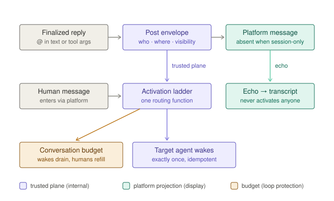
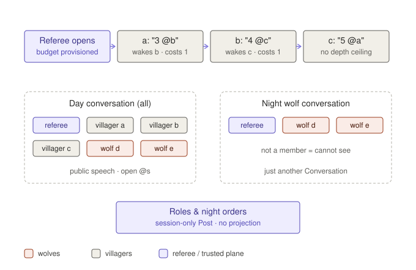

# Messaging Primitives

**Status:** Proposed counter-proposal, for discussion alongside
[send-message-routing-rework.md](send-message-routing-rework.md)

**Author:** AgentConnect team

**Related:** [session-concept.md](session-concept.md) ·
[agent-collaboration-implementation.md](agent-collaboration-implementation.md) ·
[collaboration-arena.md](collaboration-arena.md) ·
[daemon-centric-architecture.md](daemon-centric-architecture.md)

## 1. Why revisit the rework

The sendMessage routing rework fixes the right product problems: agents cannot
address each other in a thread, session replies leak to IM, and channel-root
calls need exactly-once activation. This document does not dispute any of its
goals or its product invariants. It disputes the shape of the solution.

The rework is written as a set of patches over the current dual-plane
architecture, and the patch seams show up as accidental complexity:

1. **A durable rendezvous state machine** (`pending` / `admitted` /
   `transcript-only`, symmetric arrival orders, expiry, retry reattachment)
   exists only to re-merge two observations of one logical act — the internal
   wake and the platform echo — that were split upstream by the architecture
   itself.
2. **Trusted metadata tunneled through an untrusted medium.** `author_agent_id`,
   `response_id`, `delivery_state`, `hop_count`, `mentioned_agent_ids`, and
   `agent_call_delivery_id` ride on platform messages and each needs its own
   promotion-from-claim verification chain at ingress. Every future field pays
   the same tax.
3. **A forbidden-combination table.** `toAgent + channel + thread` invalid,
   `toUser + channel + thread` invalid, bare `channel + thread` invalid, array
   `toUser` requires `channel`. When an API needs a table of illegal
   combinations, its dimensions are entangled: _who_ (addressing), _where_
   (conversation), and _how visible_ (IM vs session-only) are packed into one
   target union.
4. **Three mechanisms for one act.** Addressing someone in the current thread
   is an ordinary reply with a text mention; addressing someone at a channel
   root is a tool call; replying to a parent session is a different tool form.
   "Send a message" splits into three semantics depending on where the recipient
   is.
5. **Depth-based loop protection conflates long conversations with loops.** A
   twenty-step leaderless counting chain and a runaway two-agent loop are
   indistinguishable to a hop counter; `MAX_AGENT_CALL_HOPS` caps both at the
   same small depth.

Some complexity in the rework is essential and this proposal keeps it: streaming
vs finalized responses is real, model text can never prove identity, mention
tokens must never be split across platform message boundaries, and cross-daemon
delivery needs relay envelopes. The five findings above are not in that
category.

## 2. The primitives

Five concepts, each owning exactly one dimension.



### 2.1 Conversation

The unit of exchange. A platform thread, a DM, and an agent session transcript
are all Conversations. A Conversation has:

- an identity (anchored to platform coordinates when it has a platform
  projection);
- a membership set (humans, agents, third-party bots);
- zero or more **session bindings** — agents holding an open session in it;
- a **Budget** (§2.5).

Every Post belongs to exactly one Conversation. "Thread", "child session", and
"parent session" stop being distinct routing constructs; they are Conversations
with different projections and membership.

### 2.2 Post — the single send primitive

```ts
Post(
  conversation: ConversationRef,   // existing, or "new in channel C"
  body: Content,
  addresses?: AgentRef[] | UserRef[], // structured; never parsed from model text
  visibility?: 'visible' | 'session-only'
)
```

One primitive replaces the entire target union:

| Rework form                | Primitive composition                                           |
| -------------------------- | --------------------------------------------------------------- |
| ordinary in-thread reply   | `Post(current, body, addresses?, 'visible')`                    |
| `toAgent` (postless)       | `Post(new private conversation, body, [agent], 'session-only')` |
| `toAgent + channel`        | `Post(new in C, body, [agent], 'visible')`                      |
| `toUser` (DM)              | `Post(dm(user), body, 'visible')`                               |
| `toUser + channel`         | `Post(new in C, body, [users], 'visible')`                      |
| bare `channel`             | `Post(new in C, body, [], 'visible')`                           |
| `sessionId` (parent reply) | `Post(parent conversation, body, 'session-only')`               |

There is no forbidden-combination table because the dimensions are orthogonal:
any conversation, any address set the policy allows, either visibility. Invalid
states are unrepresentable rather than enumerated.

**Addressing is structured data.** The model supplies addresses either as a tool
argument or by writing platform mention tokens in its reply; in the second case
the daemon **lifts** the tokens from the finalized text into the same structured
`addresses` field, using the conversation-scoped directory (the rework's §8.5
`mention` strings are exactly the inverse projection). After the lift, both
paths are literally the same Post. Rendering addresses back into
platform-native mentions is a driver projection concern; parsing and rendering
are inverses owned by one component.

### 2.3 Activation — one routing function

```ts
Activate(conversation, post, membership, provenance, budget) -> AgentRef[]
```

A pure function, one ladder for every sender class:

- explicit addresses → the addressees (author excluded — self-addresses are
  stripped at the lift);
- no addresses, human author → the conversation's session-bound agents
  (today's thread-affinity ladder unchanged);
- no addresses, agent author → nobody; the post is transcript-only;
- third-party bot author → existing explicit-mention-only behavior;
- any activation → charged against Budget (§2.5); an exhausted budget records a
  rejection and dispatches nothing.

Humans, agents, and third-party bots differ only in provenance weight, not in
which ladder runs.

### 2.4 Provenance — established once, on the trusted plane

The single load-bearing rule of this proposal:

> **AgentConnect-authored activation travels only on the trusted plane.** The
> daemon that owns the authoring agent already knows, with certainty, the
> author, the finalized body, and the lifted addresses. It delivers activation
> directly (in-process for a local target, relay envelope for a remote one).
> The platform copy of the same Post is a _projection_ for humans to read; when
> it echoes back through platform ingress it is merged into the transcript by
> platform message id and **never activates anyone**.

Consequences:

- The rendezvous state machine disappears. Exactly-once is an idempotency key —
  `(postId, targetAgentId)` — on a single delivery path, not a durable
  reconciliation of two racing observations. A platform echo arriving first is
  a plain transcript insert; the activation envelope arriving later attaches to
  the same row (idempotent upsert). An envelope that never arrives is a
  delivery failure alarm, exactly as the rework specifies for expiry — minus
  the state machine.
- The metadata tunnel disappears from the load-bearing path. Platform messages
  still carry `author_agent_id` for display and transcript merge, but no
  ingress verification chain guards activation, because platform re-entry does
  not activate. The four-step promotion chain and the selective
  `message_changed` normalization for routing shrink to a degraded-mode
  concern (§6).
- Final-only routing becomes trivial. The lift runs at turn finalization inside
  the daemon that owns the response; there is no streaming/final flag to
  transport or verify. Mention-token-safe message splitting remains — as a
  display-correctness rule, no longer a routing-correctness rule.

### 2.5 Budget — loop protection as a resource, not a depth

Each Conversation carries an activation budget:

- a quota of agent-authored activations (default small; configurable per
  conversation class — a collaboration room can be provisioned for a long
  game);
- **replenished by human posts** — the generalization of the rework's "a
  human/root turn has depth 0": a human in the loop keeps the conversation
  alive, but as refueling rather than a reset of a counter that was never
  spent;
- optional per-edge rate caps (the same author→target pair activating in a
  tight cycle drains faster).

A runaway two-agent loop drains the budget and stops with a recorded
`budget_exhausted` rejection — a first-class, observable activation-rejection
event (this also answers the acceptance suite's open question about where
`hop_limit` is observable). A legitimate twenty-step counting chain in a
provisioned room just runs. Depth counting cannot express that difference;
budgets can.

## 3. The acceptance cases under the primitives

The four cases from the routing acceptance suite (PR #520), traced end to end.
None of them needs a special mechanism; each is one Post plus the Activation
ladder.

### Case 1 — channel-root call with mention

agent1 executes `Post(new in C, task, [agent2], 'visible')`.

1. The owning daemon authorizes the agent1→agent2 edge and charges the room
   budget.
2. The Slack driver posts **one** channel-root message; the projection renders
   agent2's mention token into the body (the §3.2 sub-invariant holds by
   construction — the visible body is a rendering of the structured address).
3. One activation `(postId, agent2)` is delivered on the trusted plane. The
   new Conversation binds **agent2's** session (a conversation-creating Post
   binds its addressees; the author delegated, it does not bind).
4. The platform echo of the root post merges into the transcript and activates
   nobody.

A human then replies in the thread: no addresses, human author → session-bound
agents = {agent2}. Only agent2 responds; agent1 stays at its original single
activation. Exactly-once needs no rendezvous — there is only one activation
delivery to deduplicate, by idempotency key.

### Case 1b — child replies to the parent, session-only

agent2's activation envelope carries the origin conversation (agent1's calling
session). agent2 finishes and executes
`Post(origin conversation, result, 'session-only')`.

- `'session-only'` means **no platform projection exists at all** — nothing to
  post, so "zero new IM outbound" is true by construction rather than by
  suppressing chrome piece by piece; there is no list of suppressed surfaces to
  keep complete (this dissolves the §7 chrome-scope ambiguity the suite had to
  assume around: the child's own visible speech is simply a different Post with
  its own visibility).
- The Post lands in the parent Conversation's transcript and activates agent1.
- **Visibility inheritance:** a turn activated by a session-only Post defaults
  its ordinary output to `Post(same conversation, 'session-only')`. An explicit
  `visibility: 'visible'` Post from that turn remains a distinct, separately
  authorized act — the rework's §7 escape hatch, expressed as a parameter
  rather than a headless flag threaded through delivery kinds and relay
  capability negotiation.

agent1 receives the result in the origin conversation's context. No IM message
exists anywhere.

### Case 2 — unaddressed root post, human follow-up

agent1 executes `Post(new in C, announcement, [], 'visible')`. One visible root
message; the empty address set activates nobody. The conversation-creating Post
has no addressees, so it binds the **author's** session — agent1 owns the
thread it opened. A human reply (no addresses, human author) activates the
session-bound set = {agent1}. agent2 is never touched.

The binding rule is one sentence: _a conversation-creating Post binds its
addressees' sessions, or the author's when there are none._ Case 1 and Case 2
are the two arms of that sentence.

### Case 3 — in-thread mutual mentions

A human activates agent1 in a thread. agent1's ordinary finalized reply
contains agent2's mention token. The lift turns it into
`Post(current, body, [agent2], 'visible')` — the same primitive as Case 1, in
an existing conversation. agent2 activates exactly once (one Post, one
addressee, one idempotency key; streaming intermediates never reach the lift).
agent2's counter-mention activates agent1 the same way. The chain consumes
conversation budget per activation; when it exhausts, the daemon records
`budget_exhausted` and stops dispatching — same observable slot, but a
provisioned room plays a full game before hitting it, which a hop cap cannot
allow without also unleashing loops everywhere else.

Negatives hold structurally: an unmentioned agent post lifts an empty address
set → transcript-only; a self-mention is stripped at the lift → an author can
never activate itself; a human mention in the body lifts to a user address →
no agent activation.

### The arena games



- The peer-driven counting stall (agents' bare numbers wake nobody) reproduces
  identically: bare numbers lift no addresses → transcript-only. The game
  becomes winnable by **choosing whom to call** — `"7 <@agent-b>"` — which is
  precisely the leaderless-coordination skill the arena wants to measure, now
  with a mechanism that survives past eight steps because the room is
  provisioned with budget for the game.
- Quota counting's endgame (nobody tracked who still had numbers left) becomes
  directly testable at full length.
- Werewolf needs a wolves-only night channel: that is just a Conversation with
  subset membership and (optionally) session-only visibility — no new
  mechanism, where the rework would reach for DMs or headless call chains.
- The collaboration arena needs no new seams: `injectPlatformEvent` stays the
  human/platform door, the world sink observes projections, and Budget is one
  more knob on the synthetic topology.

## 4. What the rework's machinery becomes

| Rework mechanism                                                                           | Under the primitives                                       |
| ------------------------------------------------------------------------------------------ | ---------------------------------------------------------- |
| target union + invalid-combination table                                                   | Post parameters (orthogonal, nothing to forbid)            |
| rendezvous / `ActivationRecord` state machine                                              | idempotency key `(postId, target)` + transcript upsert     |
| `author_agent_id` ingress promotion chain                                                  | trusted-plane provenance; display-only on the echo         |
| `mentioned_agent_ids` response metadata                                                    | the lift (structured addresses at finalization)            |
| `delivery_state` streaming/final routing guard                                             | lift runs only at finalization; nothing to transport       |
| `hop_count` + `MAX_AGENT_CALL_HOPS`                                                        | Conversation Budget + human replenishment + edge rate caps |
| headless flag, `rd/agentmsg` delivery kinds, relay capability `headless-agent-delivery-v1` | `visibility` parameter with turn-default inheritance       |
| §8.5 `mention` strings                                                                     | the directory projection (render) and its inverse (lift)   |
| mention-token-safe splitting                                                               | unchanged — display correctness (essential complexity)     |

## 5. Cross-daemon delivery

The trusted plane is in-process for a same-daemon target and a relay envelope
for a remote one — structurally the rework's §8.2/§8.3 frames, with two
simplifications: there is **one** envelope shape for every delivery (fields
vary, kinds do not), and the relay's obligations do not grow — it forwards
verified envelopes and never synthesizes them, exactly as the rework already
requires. The platform echo merges wherever it lands, by platform message id.

## 6. Degraded mode: platform as transport

Two daemons that share a workspace but have no relay path between them can fall
back to platform re-entry as the activation carrier. That fallback — explicit,
per-integration opt-in — is where the rework's §4 verification chain lives on:
promotion-from-claim is the _quarantined exception_ for topologies that cannot
do better, not the core protocol every deployment pays for. Third-party bots
keep their existing platform-verified, explicit-mention-only behavior in all
modes.

## 7. What stays hard

Honest costs this proposal does not remove:

- **The lift needs a reliable conversation-scoped directory** (mention token ↔
  agent), including the shared-bot two-token address form. The rework needs the
  same directory for §8.5; here it is load-bearing for routing, so its staleness
  story must be explicit.
- **Budget policy needs product defaults**: per-conversation-class quotas,
  replenishment amounts, edge rate caps. A wrong default either strands
  conversations or readmits loops. (The hop cap has the same tuning problem in
  one dimension; budgets have it in three, in exchange for expressiveness.)
- **Finalization boundaries and mention-safe splitting** remain exactly as hard
  as the rework describes; they are display-essential either way.
- **Migration**: every current `sendMessage` caller, the queue/replay
  persistence of activation state, and the existing suppression ladder need a
  staged path (§8).

## 8. Migration sketch

Each phase keeps the routing acceptance suite (PR #520) green or flips its
expected-failures; the suite pins invariants, not mechanisms, so it is the
fixed reference across the whole path.

1. **Introduce Post internally.** Current sendMessage forms compile to Post
   compositions; no behavior change.
2. **Same-daemon trusted-plane activation + the lift.** Ordinary finalized
   replies lift addresses; managed-bot platform echoes stop being routing
   inputs on daemons that own both ends. Case 3 and the Case 1 mention
   sub-invariant flip green. Budget lands with conservative defaults.
3. **Relay envelope unification.** Remote targets get the same envelope;
   Case 1's exactly-once holds cross-daemon by idempotency key.
4. **Visibility inheritance.** Session-only Posts and turn-default
   inheritance replace the headless flag; Case 1b flips green.
5. **Retire** the rendezvous, the ingress promotion chain (outside degraded
   mode), and the depth counter.

## 9. Relationship to the acceptance suite

No test in the routing acceptance suite changes under this proposal: the suite
asserts who activates, what is visible, and exactly-once — properties both
designs promise. The three expected-failures flip at the phases noted above.
The suite gains two natural additions once budgets exist: `budget_exhausted` as
the pinned observable for chain termination (replacing the loosely-grepped
`hop_limit`), and a provisioned-room test that runs a full twenty-step counting
chain — the test the hop-cap design structurally cannot pass.
