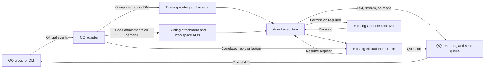
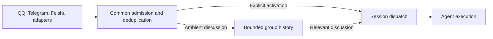

# QQ Integration Design

> Related: [platform modules](integration-plugin-architecture.md),
> [inbound attachments](inbound-file-attachments.md),
> [agent-authored attachments](agent-authored-attachments.md),
> [issue #2178](https://github.com/agentconnect-md/agentconnect/issues/2178).

## 1. Goal and scope

Add a native `qq` integration using the official QQ Bot API. One bot serves one
agent across multiple conversations. Members of the same group share a task
session; different groups and individual DMs remain separate.

The first contribution focuses on QQ adaptation through existing contracts.
Shared group-history and chat-approval behavior require upstream-owned designs;
QQ adopts those contracts once agreed and available.

| Capability            | Initial scope and boundary                                                                                                                          |
| --------------------- | --------------------------------------------------------------------------------------------------------------------------------------------------- |
| Groups and DMs        | Explicit bot mentions in groups; ordinary messages in DMs. Shared group context contains addressed tasks, not ambient discussion.                   |
| Replies and Markdown  | Native quoted replies and supported Markdown, with readable formatting fallbacks.                                                                   |
| Streaming             | Native DM streaming. Groups receive limited progress and final replies; QQ does not provide group streaming.                                        |
| Attachments           | Receive images/files and send images. Non-image sending is conditional on the small common extension in section 4.                                  |
| Interactive questions | Correlated text replies through `ElicitCardFacet`; buttons when permitted. Only fully collectable question shapes are supported.                    |
| Tool approvals        | Existing Console approval; QQ-side approval awaits a common interface.                                                                              |
| Feedback and results  | DM typing hints or brief group acknowledgement; retained results remain available in the Console if delivery fails. No native read-receipt promise. |

QQ channels/guilds, dedicated audio/video support, multi-agent bot sharing,
Webhook ingress, and new result-retrieval commands are outside this scope.
The contribution covers implementation, tests, documentation, and review fixes,
without a commitment to indefinite maintenance.

## 2. Architecture

The daemon obtains an access token with AppID/AppSecret, opens an outbound QQ
WebSocket, and owns REST calls, attachment transfers, and agent execution. No
public callback endpoint or separate file-hosting service is required. The
Control Plane handles installation, credentials, and configuration, staying off
the live message path.

Follow the existing per-host platform modules: daemon transport and output,
Control Plane provider, Console setup, and shared platform declarations.
Normalization remains pure in the message package. Registration may span
packages; QQ-specific policies must not become core branches. This transport
requires no relay module.

The console offers QQ only where the deployment turns on the `qq` feature flag
(the chart's `features.qq`, on by default); the Control Plane and daemon serve
it either way.

## 3. Behavior and invariants

### Conversations and activation

Scope user identity to AppID plus OpenID; `user_openid` and `member_openid`
normalize into the same identity when their values match. Distinguish group and DM addresses. Use a stable
logical session key per group, independent of the sender or quoted message;
retain each sender's identity. Secret rotation must not change session identity.
Never merge people by nickname.

When an event supplies `author.username`, cache it under that app-scoped
identity so later group and DM messages share the confirmed name. A nameless
event never replaces a cached name. Derive the avatar URL from AppID plus OpenID
inside the QQ module; do not call an external profile service.

After admission checks, match pending answers before treating a message as a
prompt. QQ group tasks require an explicit mention: the whole-group session key
must not make ambient messages activate through thread affinity or execute
commands. Existing platforms retain their thread behavior; admitted QQ
follow-ups reuse normal steering and queuing.

Keep session identity, passive-reply IDs, and native quote indices separate.
Deduplicate received tasks across reconnects. Normalize only required fields;
credentials and sensitive scene extensions must not enter transcripts or logs.

### Replies and delivery

DM streaming sends ordered chunks with a stable delivered prefix. End the
current segment before a question and start a new segment after resumption;
finalization or cancellation closes the stream when possible. Group output uses
complete content boundaries, not token-sized posts or repeated deletion.

Preserve the [product conventions](../product-conventions.md) for message
splitting, workspace links, and user-facing output. Record generated replies
independently of delivery. Budget progress, questions, attachments, and results
against QQ's reply windows and rate limits. Use proactive delivery after expiry
only when allowed; otherwise retain the result for Console access. Unknown send
outcomes must not cause blind retries under new identities.

Feedback describes actual acceptance, steering, or queuing, never a native read
receipt. It is best effort and must not delay execution.

### Attachments

Map attachments from admitted messages and available quoted content to the
existing attachment model. Reuse image/text reads and workspace storage for
other files. Preserve metadata, apply the lower project/platform size limit,
and report expired downloads or unsupported content explicitly.

Send workspace images through `shareFile`: the QQ adapter prepares an upload,
uploads and confirms its parts, merges them, then sends `file_info` as rich
media. Respect expiry and group/DM scope; PNG and JPEG are the baseline formats.
A Markdown path must not implicitly upload a file. Reuse the partial-send
contract: a delivered file with a failed caption must not be sent again.

### Interactive questions

Reuse `ElicitCardFacet`, core schema validation, and request settlement. Text
replies must identify the original request; buttons are optional because QQ
button access is separate from Markdown access. Interaction events use the same
WebSocket and receive timely acknowledgement.

Collect complete answers for supported choice, text, numeric, and multi-field
requests. Decline unsupported shapes explicitly, without dropping fields. Match
the bot, conversation, and pending request; ordinary chat, duplicates, and stale
answers must not settle unrelated or completed requests. Without editing, post a
short outcome and invalidate old controls server-side. Interaction acknowledgement
is not tool approval. No generic answer command or shared multi-user form system
is introduced.

## 4. Shared capabilities and ownership

These needs inform upstream review without prescribing interfaces or assuming
maintainer commitments. Agree ownership and contracts separately, then update
this design to consume them.

### Group discussion context

**Need:** people discuss a plan, then say “@bot, carry out that plan,” without
manually summarizing it. Existing observation depends on a recently active
session, while thread affinity may activate ordinary messages. Receiving all QQ
messages alone fixes neither issue.

**Suggested direction:** upstream separates observation from activation, with
bounded history for enabled groups and relevant replay on waking. Admission,
authorship, retention, deduplication, and coverage gaps should have consistent
semantics across providers, within each provider's receive/history capabilities.

QQ supplies full-group events and verified message identities. Observation must
not consume a later mention trigger if both events describe one message. Missing
pre-installation or outage history remains a visible gap. This common capability
is outside the base contribution; initially advertise shared addressed-task
context, not complete group discussion awareness.

### In-chat tool approvals

**Need:** authorized users decide tool requests where the task originated.
Ordinary questions have a platform interface, but tool approvals still contain
Slack-specific connection, presentation, and resolver-identity logic.

**Suggested direction:** upstream defines common presentation, decision
submission, and actor identity. Core retains allowed decisions, authorization,
audit, expiry/cancellation, and single settlement across Console/chat races,
for both native permissions and tool approvals carried through elicitation.

QQ displays the request and returns a button or explicit textual decision to
core validation. An authorized agent editor must enable chat approval and
identify approvers; group membership, group administration, or starting a task
does not grant approval authority. Failure and stale controls never imply
approval. The base contribution uses the Console.

### Non-image file sharing

**Need:** send generated PDFs, spreadsheets, or archives to the current chat.
QQ supports files; the common upload port carries bytes, but `shareFile`'s
workspace reader, validation, and recording assume images.

**Suggested direction:** a bounded common extension accepts files according to
platform capability, preserves workspace/size/destination constraints, and
records file metadata. QQ owns uploading and sending. Include this in the first
contribution if upstream accepts the limited change; otherwise defer it without
blocking image exchange or inbound files. Richer question workflows and result
retrieval likewise require separate agreement.

## 5. Validation

Use sanitized event fixtures and a mock service for deterministic behavior,
then a real official bot for provider/client behavior:

- Shared group tasks, isolated groups/DMs, and no ambient task or command execution.
- Correct question correlation, validation, expiry, and duplicate handling, with
  and without button access.
- DM streaming, quotes, Markdown, image exchange, inbound files, size limits,
  and expired links on mobile and desktop.
- Reconnects, duplicate events, reply expiry, rate limits, and ambiguous sends
  without lost saved results or blind duplicate delivery.
- Downloadable non-image output and partial-send handling if that extension is included.

Quote identifiers, button access, stream limits, and reply windows require live
validation; QQ's DM documentation gives inconsistent reply durations. Full-group
events can be probed independently without building a QQ-only history system.
Common-history and approval acceptance adds pre-mention context, visible gaps,
unauthorized approvers, and competing decisions. These are separate from base
adapter acceptance; this design does not claim live QQ validation.

## 6. References

- Existing code: [elicitation](../../packages/daemon/src/platforms/elicit-card.ts), [permissions](../../packages/daemon/src/permissions/coordinator.ts), [file sharing](../../packages/daemon/src/mcp/ops/share-file.ts).
- QQ transport and delivery: [WebSocket](https://bot.q.qq.com/wiki/develop/api-v2/dev-prepare/event-emit/websocket.html), [message rules](https://bot.q.qq.com/wiki/develop/api-v2/server-inter/message/overview.html), [DM streaming](https://bot.q.qq.com/wiki/develop/api-v2/autogen/api/v2_users_user_openid_stream_messages.post.html), [group sending](https://bot.q.qq.com/wiki/develop/api-v2/autogen/api/v2_groups_group_openid_messages.post.html), [DM sending and typing](https://bot.q.qq.com/wiki/develop/api-v2/autogen/api/v2_users_user_openid_messages.post.html).
- QQ content and interaction: [Markdown](https://bot.q.qq.com/wiki/develop/api-v2/server-inter/message/type/markdown.html), [buttons](https://bot.q.qq.com/wiki/develop/api-v2/server-inter/message/trans/msg-btn.html), [interaction events](https://bot.q.qq.com/wiki/develop/api-v2/autogen/event/interaction_create.html), [rich media](https://bot.q.qq.com/wiki/develop/api-v2/server-inter/message/rich-media.html).
- QQ group events: [mentions and attachments](https://bot.q.qq.com/wiki/develop/api-v2/autogen/event/group_at_message_create.html), [full-group messages](https://bot.q.qq.com/wiki/develop/api-v2/autogen/event/group_message_create.html).
