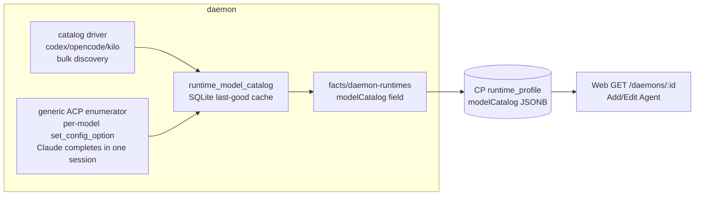
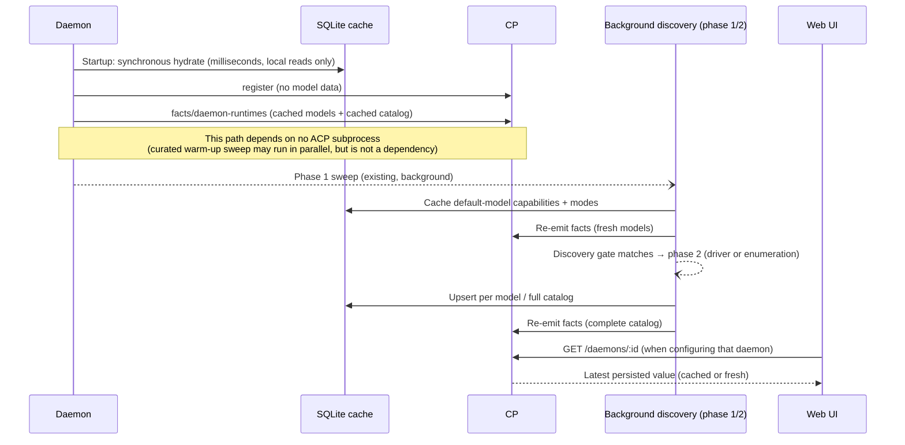

# Runtime Model Catalog: Native Bulk Discovery, Per-Model ACP Fallback, and Local Caching

> **Status:** Implemented.
>
> **Scope:** How the console (Add/Edit Agent and every surface that needs to
> "select a model → see what that model supports") obtains a complete
> "model × configuration capability" matrix for each runtime **before creating
> a real session** — effort levels, Fast Mode, and permission modes — and how
> the daemon discovers, caches, and reports the data.

## 1. Current State and Problems

Today, the daemon starts a throwaway ACP session for every installed runtime and
reads only the model selector:

- `probeRuntime` performs spawn → `initialize` → `session/new` →
  `modelOptions()`, producing a flat `models: string[]`, `currentModel`, and
  version information (`runtime-prober.ts:326-394`). The same
  `session/new.configOptions` already includes thought-level choices, the fast
  toggle, and permission modes for the **current model**. AcpHost parses and
  caches them through the parser at `acp-host.ts:314-369` and the
  `effortOptions()` / `fastModeOption()` / `permissionModeOptions()` accessors at
  `acp-host.ts:757-787`. The probe consumes only `modelOptions()` and discards
  everything else.
- Probe results exist only in in-memory maps (`runtimeModels`,
  `runtimeAcpVersions`, `runtimeProbedVersions`, and `runtimeMcpCaps`;
  `daemon.ts:1065-1079`) and are **not persisted**. After a daemon restart, the
  first `facts/daemon-runtimes` frame carries `models: []`. Because the frame has
  REPLACE semantics, it clears the model list the CP learned previously. The
  console model picker then falls back to "Default" only until the background
  sweep completes (30-second timeout per item, concurrency 3) and sends another
  frame.
- Because per-model capabilities are entirely absent, the web's effort levels,
  Fast Mode availability, and permission modes come from **static tables**:
  `effortField()` hard-codes levels by runtime name, `supportsModes()` means
  "anything except opencode," and `permissionModeOptions()` hard-codes two sets
  of IDs (`packages/web/src/lib/data.ts:322-409`). These tables ignore the
  selected model and drift from what the runtime actually advertises — for
  example, a model may not support `xhigh`, or only one model may provide fast
  mode.

ACP has no pre-session "all models × all configuration" method. `configOptions`
is session-scoped, and `thought_level` / `model_config` describe only the
**currently selected** model. Methods available before session creation
(`initialize` / `authenticate`) do not carry a model catalog. This must
therefore be a daemon-side discovery and caching problem, not one protocol call.

## 2. Requirements (Decided)

1. **Runtimes that can return everything in one operation form a distinct class
   and use native catalog APIs.** When a lower layer exposes a stable catalog
   API, a dedicated driver collects every model and its capabilities in one
   discovery task without switching models. The first runtimes are Claude,
   Codex, OpenCode, and Kilo. This class will **continue expanding**: whenever a
   runtime's native interface becomes known, add a driver. The long-term goal is
   one-pass discovery for as many runtimes as possible.
2. **Runtimes without drivers fall back to per-model discovery.** The generic
   ACP enumerator reads the model selector in one disposable session, calls
   `session/set_config_option` for each model, and collects that model's
   capabilities from the full `configOptions` in each response. This is the
   capability floor for every runtime, not second-class behavior. A driver is
   merely a fast path.
3. **Add a daemon-local model cache table.** Persist last-good data, report it
   immediately after restart, and refresh it in the background.
4. **`configOptions` probing is an independent asynchronous task and never
   blocks reporting runtimes or models.** Registration, READY, and initial facts
   never wait for it. If the UI reads before discovery finishes, it sees
   last-good data from the cache table.

## 3. Overall Design

In one sentence: **layer discovery (native driver → ACP enumeration), normalize
storage (daemon SQLite cache tables), report through the existing path
(`facts/daemon-runtimes` with additive fields), and let the UI always read the
latest value persisted by the CP.**



Key point: **the matrix rides the existing push pipeline**. It follows the facts
frames, is persisted by the CP, and is read back through an ordinary console read —
no side channel, no bespoke fetch protocol. "Use the cache table when the UI
requests before discovery completes" is not a runtime branch; the structure
guarantees it.

Which read carries it is a separate question, answered by size: a matrix is per
`(daemon, runtime)` and does not repeat across daemons, so a fleet-wide read pays
for every daemon's matrix while its readers — the Add/Edit Agent pickers, the
session runtime controls — each look at exactly one daemon. It therefore rides
`GET /daemons/:id`, which the console fetches for the daemon it is configuring,
and neither `GET /daemons` (polled for liveness) nor `GET /daemons/capabilities`
(the fleet's runtime inventory) carries it. The daemon synchronously hydrates the cache at startup,
so its first facts frame includes the last-good matrix. It sends another
replacement frame after discovery completes. At every moment, the CP contains
the newest value known by that daemon, and the UI renders whatever it reads.

Rejected alternatives:

- **On-demand correlated reads from CP→daemon**, modeled after the transcript
  live pull in §7.6: this adds a protocol round trip, fails when the daemon is
  offline, and requires another CP cache. The matrix is small (see the size
  analysis in §5), and a push pipeline already exists, so a new channel is
  unjustified.
- **A static "model → capabilities" table in CP/Web**: the runtime itself is the
  only reliable source of its model catalog. A static table requires a release
  for every new model, precisely what this design removes. Existing static
  tables remain only as fallback; see §7.

### 3.1 Layer One: Native Catalog Drivers (Bulk Discovery)

Add a small, closed driver interface in
`packages/daemon/src/runtimes/model-catalog.ts`:

```ts
interface ModelCatalogDriver {
  /** Whether this driver owns catalog discovery for the exact runtime ID.
   * No fuzzy guessing.
   */
  supports(runtimeId: string): boolean
  /** Return the complete catalog in one discovery task.
   * The driver handles pagination/multiple calls internally.
   */
  discover(rt: RuntimeDef, opts: DiscoverOptions): Promise<RuntimeCatalog>
}
```

Initial drivers use the same lower-layer data each adapter uses to construct
`configOptions`, ensuring that native and ACP paths have one source:

| Runtime  | Interface                                                                                                                                                                                    | Returned in one task                                                                                                                                                                            |
| -------- | -------------------------------------------------------------------------------------------------------------------------------------------------------------------------------------------- | ----------------------------------------------------------------------------------------------------------------------------------------------------------------------------------------------- |
| codex    | Spawn `codex app-server`; JSON-RPC `initialize` + `model/list`                                                                                                                               | All models × `supportedReasoningEfforts` (including descriptions) × `defaultReasoningEffort` × `additionalSpeedTiers` (fast)                                                                    |
| opencode | Derive `serve --port <random> --hostname 127.0.0.1` from RuntimeDef → `GET /config/providers` (verified against OpenCode 1.18.3 source)                                                      | Providers × all models × `variants` (keys are effort levels); catalog ID is `provider.id/model.id`, **exactly matching** ACP model-select values because neither side includes a variant suffix |
| kilo     | Same as OpenCode (fork retains the serve surface, source-verified in KiloCode 7.4.11; distribution is `npx -y @kilocode/cli acp`, so derive serve from RuntimeDef rather than a bare binary) | Same as above, from Kilo's backend. If the Kilo provider has auth state, the catalog GET may return 401; treat 401 as a hard failure and immediately fall back to enumeration                   |

**Claude's "bulk discovery" is single-session enumeration, without an SDK
dependency (evidence-based decision).** The real adapter
`@agentclientprotocol/claude-agent-acp@0.59.0` discards every capability field
from SDK `ModelInfo`, including `supportedEffortLevels` and `supportsFastMode`,
on the ACP surface. A pure ACP client cannot learn capabilities for unselected
models. A direct dependency on `@anthropic-ai/claude-agent-sdk` was rejected:
the adapter-pinned 0.3.x moved the CLI into an approximately 247 MB
platform-specific package, while downgrading to 0.2.83 (approximately 61 MB)
creates adapter version skew and potentially a different catalog. Fortunately,
Claude has only a few models. The generic enumerator calls
`set_config_option` for each model in **one** session; each in-process response
rebuilds complete `configOptions`, so one discovery task still obtains
everything. The long-term solution is an upstream PR to `claude-agent-acp`
attaching capability fields under `_meta` on model-select options. ACP types
provide `_meta` extension points, so the schema permits this. Once it lands,
Claude automatically becomes zero-round-trip bulk discovery and the probe
session reads the complete data directly.

Constraints:

- A driver is a **pure discovery process**: it sends no prompt, connects no MCP,
  and exits immediately after collecting the catalog.
- **Driver children reuse probe security controls**: an allowlist equivalent to
  `curatedProbeEnvironment` for PATH, certificates, provider keys, and proxies;
  isolated HOME; and the same diagnostic redaction. Drivers that listen
  (OpenCode/Kilo `serve`) bind only a random loopback port. The timeout matches
  probe (30 seconds), and the driver layer kills the entire process tree on
  timeout/exit.
- A serve driver's launch command **must be derived from RuntimeDef** by
  replacing the trailing `acp` argument with serve arguments. This supports
  both `npx` distributions such as Kilo and archived binaries such as
  `./opencode`; a bare PATH binary is only the final fallback. Defensively
  remove `OPENCODE_SERVER_PASSWORD` / `KILO_SERVER_PASSWORD` from child
  environments, because password-protected serve returns 401 for every catalog
  request.
- Runtime-specific branches exist only in the driver registry. Every other part
  of the daemon, protocol, CP, and web consumes data shapes and never branches
  on runtime names. This matches the current design: daemon configuration
  application has no `=== 'claude'` branches, and Claude specialization is
  contained in `AcpHost.isClaudeRuntime()`.
- **A driver failure automatically falls back to layer two**, generic
  enumeration. Drivers are fast paths; ACP is the capability floor.
- **The driver class is open for expansion.** A runtime qualifies when it has a
  stable, read-only, side-effect-free complete-catalog interface. Supporting it
  moves it from enumeration fallback into the bulk-discovery class. The driver
  registry itself records that progress.
- Permission modes do not use drivers. They are runtime-level and
  model-independent, and always come from the probe session's
  `session/new.configOptions` (§3.3 phase 1), shared by both layers.

### 3.2 Layer Two: Generic Per-Model ACP Enumeration (Fallback)

Runtimes without a driver use this algorithm:

```text
spawn (isolated HOME) → initialize → session/new
  → read every value from the category=model selector (skip literal "default")
  → for each model, call session/set_config_option
      → verify that the response's model selector currentValue actually changed
        to the target model
      → yes: extract thought_level / model_config for that model from the full
        configOptions response
      → no: the runtime advertised a selector but did not implement its write path
        (known to occur in the ecosystem); abandon enumeration and retain only
        phase-1 data
  → before exit, restore the initial model currentValue (best effort)
  → kill the process
```

Engineering safeguards for real behavioral differences among third-party ACP
agents:

- **An isolated HOME is mandatory, not preferred.** Some agents persist
  `set_config_option` values as user defaults. Enumeration must never touch the
  real HOME. Reuse curated probe's isolated launch
  (`composeRuntimeLaunch` with `isolateHome: true`), which applies even without
  an OS sandbox. If a runtime cannot pass authentication in isolation because
  credentials live in the real HOME, **skip enumeration for that runtime** and
  accept phase-1-only data, with static UI fallback. Missing matrix data is
  preferable to rewriting user configuration.
- **Restore the initial selection before killing the process.** When the overall
  budget is exhausted, first use a small grace window to best-effort restore the
  initial `currentValue`, then kill. This is merely hygiene under an isolated
  HOME, but provides a second defense if isolation was configured incorrectly.
- **Enumeration reuses all probe launch/security machinery**:
  `preparedLaunch`, environment allowlist, credential redaction, and automatic
  cancellation/rejection of permission and elicitation requests from
  `runtime-prober.ts`.
- Switch models **serially within one runtime** because one session is a state
  machine. Default discovery concurrency is one. It is outside every critical
  path, so slower is safer.
- **Never send `session/prompt`**, producing no charge and no prompt side effect.
- **Hard budget limits**: per-model set timeout (recommended 10 seconds), total
  per-runtime budget (recommended 120 seconds), and maximum models
  (recommended 64). Log and truncate above the cap. Incompleteness is preferable
  to runaway enumeration, and runtimes aggregating public catalogs from many
  providers can expose dozens of models outside our control.
- Some runtimes encode model × effort as composite IDs such as `"m[variant]"`.
  The enumerator does **not** interpret composite-ID semantics; every value is
  an independent model and consumes the cap. Such runtimes are high-priority
  driver candidates. Add a driver rather than guessing ID formats.
- **Incrementally upsert each model into the cache as soon as it is obtained**;
  do not wait for the entire pass. One model failure marks only that model
  unknown and does not discard other results.
- **Enumerated entries do not carry `defaultEffort`.** After model switching, an
  effort selector's `currentValue` may be residual session state: supported
  levels remain across models, as observed in claude-agent-acp 0.59.0, and do
  not represent that model's default. `defaultEffort` comes only from phase 1's
  fresh-session initial value or a native driver such as Codex's
  `defaultReasoningEffort`.

### 3.3 Trigger Timing: Two Phases, One Gate

Keep the current probe sweep exactly as the phase-1 mechanism: background after
registration, five-minute TTL, and curated-admission gating. Matrix discovery is
phase 2, controlled by a discovery gate rather than rerun on every TTL:

- **Phase 1 (existing sweep, minimally extended)**: the probe session already
  has full `configOptions`. In addition to `modelOptions()`, read
  `effortOptions()`, `fastModeOption()`, and `permissionModeOptions()` for the
  **default model**, plus `currentModel`. These are in-memory reads with no
  extra round trip or process, so sweep duration is unchanged.
  `RuntimeProbeResult` gains fields accordingly. While folding sweep results,
  write **one row** for the default model to `runtime_model_catalog` (skip it
  when `currentModel` is the literal `"default"` and cannot resolve to a
  concrete ID; see §5), and upsert `runtime_catalog_meta` with fingerprint,
  defaultModel, and permissionModes, **without setting complete**.
- **Phase 2 (new): discovery gate.** After a sweep successfully probes a
  runtime, schedule one catalog discovery through either a driver or enumerator
  when any condition holds:
  1. Cached fingerprint differs from the current fingerprint, indicating an
     adapter upgrade or launch-definition change.
  2. `runtime_catalog_meta.complete = 0`, meaning a full discovery never
     succeeded, including first install or a previously failed/cancelled
     discovery. Retry with per-runtime exponential backoff capped at a
     recommended one hour, so a broken enumerator is not hit every five-minute
     sweep.
  3. The current probe's `models[]` set differs from cached catalog IDs.
     **Server-side catalog updates** for runtimes such as Codex/OpenCode may add
     models without a release or fingerprint change, so set difference is
     required.
  4. For a driver-backed runtime, catalog age exceeds `CATALOG_TTL` (recommended
     24 hours). Driver discovery is cheap and also catches server-side changes
     to levels for an existing model, which a set comparison cannot detect.

  **Phase 1's metadata write does not satisfy the gate** because it writes a
  fingerprint but leaves `complete` false. Otherwise, phase 1 would close the
  gate on first install and the catalog would forever contain only the default
  model.

- **Single flight per runtime**: one runtime has at most one in-flight discovery
  task. This is not per fingerprint: if a fingerprint changes while discovery
  runs, cancel the old task before starting another, preventing two enumerators
  from interleaving incremental writes to the same primary-key space and
  deleting each other's rows during prune-on-success. Before every incremental
  write, verify that the task is still the current generation; discard writes
  and late results from old generations.
- After phase 2 completes, upsert the cache, set `complete=1` and prune missing
  models only on success, rebuild the in-memory catalog, and resend one
  `facts/daemon-runtimes` frame. **Emit on completion, not on incremental
  batches**, to reduce interleaving with sweep frames; see §5 `seq`.
- Discover only **admitted** runtimes. Curated candidates do not enter phase 2
  before admission succeeds.
- During daemon drain/shutdown, cancel discoveries and kill their process trees
  from the current `Daemon.stop()` cleanup sequence next to
  `runtimeProbeTimer`.

### 3.3a Ownership and Fingerprint Definition

- **Ownership**: put the driver registry, enumerator, and scheduler (discovery
  gate, single flight, generation, and backoff) together in the new
  `packages/daemon/src/runtimes/model-catalog.ts`; the daemon owns one instance.
  Follow probe's injection convention for tests: `DaemonOptions` may inject a
  driver registry / enumerator factory, analogous to existing `probeRuntimes` /
  `hostFactory` seams.
- **Call site**: in the result-folding loop of `probeRuntimesAndEmit`, after the
  admission record, evaluate the discovery gate only for `ok: true` admitted
  runtimes.
- **Fingerprint** =
  `runtimeId + '\n' + (probedVersion ?? 'unknown') + '\n' + sha256(command + args + sorted environment variable names)`.
  Include only environment variable **names**, never values, because values may
  be credentials and must not enter SQLite. If the agent reports no
  `probedVersion`, use `'unknown'`; the launch definition then drives the
  fingerprint, while discovery-gate conditions 3 and 4 cover server-side drift.

## 4. Daemon-Local Cache Tables

Add tables to existing LocalStore SQLite at
`~/.agentconnect/state/local.sqlite`, following the additive
`CREATE TABLE IF NOT EXISTS` convention used by `channel_intro` for schema,
accessors, and tests:

```sql
-- Runtime-level metadata: fingerprint, source, and model-independent capabilities
CREATE TABLE IF NOT EXISTS runtime_catalog_meta (
  ownerId         TEXT NOT NULL DEFAULT '',   -- Owning member; '' is the single-daemon store
  runtimeId       TEXT NOT NULL,
  fingerprint     TEXT NOT NULL,
  source          TEXT NOT NULL,              -- 'native' (driver) | 'acp' (enumeration/phase 1)
  defaultModel    TEXT,                       -- Resolved concrete model ID, or NULL
  permissionModes TEXT,                       -- JSON [{value, name?, description?}]
  complete        INTEGER NOT NULL DEFAULT 0, -- 1 only after full discovery succeeds
  observedAt      INTEGER NOT NULL,
  PRIMARY KEY (ownerId, runtimeId)
);

-- Model-level capabilities, one row per model
CREATE TABLE IF NOT EXISTS runtime_model_catalog (
  ownerId     TEXT NOT NULL DEFAULT '',
  runtimeId   TEXT NOT NULL,
  modelId     TEXT NOT NULL,
  fingerprint TEXT NOT NULL,
  capsJson    TEXT NOT NULL,               -- {name?, efforts?, defaultEffort?, fastMode?}
  observedAt  INTEGER NOT NULL,
  PRIMARY KEY (ownerId, runtimeId, modelId)
);
```

**`ownerId` leads both keys because this cache describes an image, not an
install.** A pool member's store is one Postgres schema shared by every member,
and a rolling update runs two image generations at once with two different
fingerprints. Unkeyed, each member reads the other's row as "the fingerprint
changed", re-runs discovery, resets `complete`, and prunes the other
generation's model rows — probe sessions ping-ponging for the length of the
rollout, a console model list that flaps, and a member that boots (§4 rule 1)
advertising models its own image cannot run. Every read and write is scoped to
the store's own member, so the single-daemon SQLite store — which owns the one
`''` partition forever — behaves exactly as before.

Lifecycle rules:

1. **Hydration is synchronous and runs at startup.** After constructing
   LocalStore, the daemon reads both tables into memory. Keep **two independent
   structures**: existing maps such as `runtimeModels` represent
   **advertisement** (available models), are prefilled from cache, and receive a
   `source: 'cached'` provenance marker. A new `runtimeCatalogs` map represents
   the **capability matrix** and remains independent of fail-to-empty (rule 5).
   The first facts frame therefore includes last-good models and matrix, fixing
   the current bug where an initial empty `models[]` clears CP knowledge after
   restart.

   **Scope note:** this fix covers registry/user runtimes. Curated-runtime
   admission is in memory and returns to pending after restart. Before admission
   succeeds, a curated runtime is absent from the frame and REPLACE still
   prunes it. The restart-clearing window therefore remains for curated
   runtimes. Persisting admission is outside this design and should be separate
   work if needed.

2. **`capsJson` stores normalized capabilities but RAW advertised values only.**
   Never persist `_meta`, credentials, environment variables, or arbitrary
   unrecognized fields. Daemon-synthesized levels such as Claude `max` /
   `ultracode` **do not enter the cache**; add them at report time (§5). AcpHost
   therefore needs a small extension exposing raw session config options or
   non-augmented accessors. Current `effortOptions()` returns augmented values
   and keeps the raw array private.
3. **Failure does not clear the cache.** A failed discovery/refresh logs an
   error and preserves last-good rows. Only a complete successful discovery
   sets `complete=1` and deletes model rows absent from the current pass
   (prune-on-success).
4. **Stale rows with a mismatched fingerprint continue serving**, with staleness
   visible through `observedAt` and the mismatch, until a new discovery replaces
   them. The UI must not fall back to knowing nothing the instant an adapter is
   upgraded.
5. **Advertisement refresh failures preserve a cache-hydrated last-good list.**
   A successful probe replaces `models[]` authoritatively, including a successful
   empty selector. A known authentication rejection also clears the list and
   carries `authRequired`, because the runtime cannot serve it until the operator
   signs in. Any other failure of the first background refresh keeps non-empty
   cache-hydrated `models[]` with `modelsSource: 'cached'`. Package-launch probes
   use a fresh private HOME and can time out while warming dependencies even when
   established agent homes remain healthy; erasing the cache in that state makes
   the picker appear after restart and then disappear. Cached provenance keeps
   activation/move validation permissive until a later successful probe replaces
   it. A cold daemon with no cached list still reports `models: []` on failure.
   **Capability** (`modelCatalog`) remains independent and is never cleared by a
   probe failure.
6. **`--k8s` stops at phase 1.** The probe runs in the sandbox pod that ships the
   runtime (see [daemon-detailed-design.md](daemon-detailed-design.md) §2.6), so
   its `models[]` and its phase-1 config-option seed are live and reported
   `probed`. Phase 2 is not scheduled: enumeration switches the model per
   `set_config_option` inside an isolated HOME on the probing host, and a cluster
   daemon has neither that HOME nor the runtime's filesystem. A native driver
   would be worse — it would run this machine's executable to describe another's.
7. **Garbage collection**: during hydration, ignore runtime IDs absent from the
   current catalog resolved from registry/user/curated sources. Do not advertise
   or report them, but retain the rows because resolution may have failed
   temporarily. At startup, delete catalogs unseen for 30 days to prevent
   unbounded growth. On a shared store, another member's go at a shorter window
   (7 days): an `ownerId` dies with the process that minted it, so a rollout
   leaves caches nobody can read again. The window stays conservative because a
   live member that has not re-probed inside it pays one re-discovery for the
   reclaim.

   **Staleness is a property of one whole `(ownerId, runtimeId)` catalog — its
   meta row and its model rows together — never of a single row.** A phase-1
   refresh (rule 1 of §3.3) re-stamps the meta row and the seed model only, so
   the models a full discovery found keep their older `observedAt`. A row-by-row
   sweep would delete exactly those while leaving `complete` and `modelsHash`
   standing, and the discovery gate — same fingerprint, complete, matching model
   hash — would never reopen: the matrix stays permanently short of those models.
   A catalog is therefore kept whole or dropped whole.

## 5. Protocol and CP Persistence

Add optional fields to `FactsRuntimeProfile`, following existing additive
compatibility conventions: optional fields with documented absence semantics,
old daemons parse without them, and old CPs strip unknown fields through zod.

```ts
const EffortOption = z.object({
  value: z.string(), // thought_level wire value
  name: z.string().optional(), // Display name from select option / driver
  description: z.string().optional() // Tooltip text; Codex driver supplies one per level
})

const RuntimeModelCapability = z.object({
  id: z.string(), // model selector value
  name: z.string().optional(), // Send only when display name differs from value
  description: z.string().optional(), // The runtime's own model blurb; the picker's tooltip
  efforts: z.array(EffortOption).optional(), // Levels for this model, including daemon augmentation
  // [] = no effort selector for this model; absent = not discovered
  defaultEffort: z.string().optional(),
  fastMode: z.boolean().optional() // Whether selecting this model shows a fast toggle; absent = unknown
})

/** One shape shared by wire, CP JSONB, and DTO to prevent field-name drift. */
const RuntimeModelCatalog = z.object({
  models: z.array(RuntimeModelCapability).max(128),
  defaultModel: z.string().optional(), // Resolved concrete default model ID
  permissionModes: z
    .array(
      z.object({
        value: z.string(),
        name: z.string().optional(),
        description: z.string().optional()
      })
    )
    .optional(),
  defaultPermissionMode: z.string().optional(), // mode selector currentValue in a fresh probe session
  source: z.enum(['native', 'acp']),
  observedAt: z.string().datetime()
})

// Added to FactsRuntimeProfile:
modelCatalog: RuntimeModelCatalog.optional() // absent = this daemon has no matrix yet
modelsSource: z.enum(['cached', 'probed']).optional() // models[] provenance; absent on old daemon means probed

// Added to DaemonRuntimes snapshot frame:
seq: z.number().int().optional() // Monotonic per connection; CP ignores older snapshots
```

Semantics and rules:

- `models: string[]` **does not change and remains the authoritative advertised
  list**. Join `modelCatalog.models` by ID. An advertised ID without a catalog
  entry has unknown capabilities and uses UI fallback (§7). Catalog entries may
  briefly outlive `models[]` after a server removes a model. The UI renders the
  picker from `models[]` only and ignores extra entries.
- **`modelsSource` exists for capability gates.** Daemon
  `activationCapabilityError` and the CP's agent-move model gate
  (`agents.ts:1201-1212`) currently treat an empty list as permissive. After
  cache hydration, a list with **`cached` provenance must also remain
  permissive**; strict validation runs only for `probed`, measured in the
  current process. Otherwise a regression occurs: the adapter adds a model
  while the daemon is down → restart hydrates an old list → move/activate of the
  new model is rejected during the startup window. This is the same stranded
  risk as the 07-17 workspace-convert incident.
- **Store raw efforts, report augmented efforts.** Cache the runtime's actual
  advertised levels and apply daemon-synthesized levels through a shared helper
  at reporting. Extract `augmentClaudeEfforts(efforts)` from
  `effortOptionsFrom`, and share it between live-session and catalog-reporting
  paths with three rules: (1) never augment empty/absent efforts, so a model
  without an effort selector does not magically gain max/ultracode; (2) the
  catalog path detects Claude using the same launch-command predicate as
  `AcpHost.isClaudeRuntime()`, extracted into an independent function rather
  than guessed from runtime ID, avoiding the `claude` vs `claude-acp` alias
  trap; (3) a driver-produced Claude catalog uses the same augmentation, where
  `supportsEffort:false` yields `[]` and remains unaugmented.
- **`defaultModel` must be a resolved concrete ID.** Probe `currentModel` may be
  the literal `"default"` even though that value is filtered from `models[]`,
  not from currentModel. If `currentModel === 'default'` cannot resolve to a
  concrete lower-layer ID, **omit `defaultModel`** and do not write a phase-1
  catalog row. A driver with an explicit default field takes precedence.
- Size: one catalog entry is approximately 100–300 bytes including labels and
  descriptions. Claude/Codex have from a few to roughly a dozen models, while
  even an extreme hundred-model runtime is about 30 KB and is capped by
  `max(128)`. This does not materially enlarge the existing frame and does not
  justify a new channel.
- **`seq` prevents snapshot reordering.** The CP does not await inbound frames,
  and `replaceAll` is last-commit-wins; sweep and catalog frames can commit out
  of order, a race already acknowledged in repository comments. The daemon
  maintains a monotonic `seq` per connection, and the CP stores it with the
  profile and drops a smaller sequence. Old daemons without `seq` retain current
  latest-wins behavior.
- CP persistence: add
  `modelCatalog Json? @db.JsonB` to `runtime_profile` (suggested migration name:
  `runtime_profile_model_catalog`) and store the `RuntimeModelCatalog` object
  unchanged. Also add `modelsSource String?` and `snapshotSeq Int?`, daemon-wide
  either on `Daemon` or denormalized per profile at implementation discretion.
  Follow the absence semantics of `mcpCapabilities`: **missing in a frame resets
  to null**. Because failure frames still carry the catalog (§4 rule 5), there
  is no normal flicker; null occurs only when the daemon has no data at all. The
  deprecated single-profile `facts/runtime-profile` frame shares `upsertOne`; an
  old daemon sending it resets `modelCatalog` to null, which is acceptable
  because that daemon owns the row.
- DTO: add nullable `modelCatalog` to `RuntimeProfileDto` using the same
  `RuntimeModelCatalog` shape, and expose `observedAt`, which is persisted today
  but not returned. Web `daemonFromDto` retains `modelCatalog` in
  `runtimeModels` entries. There is no new route and no OpenAPI
  tags/operationId work.

## 6. Non-Blocking Invariants (Hard Requirements)



No implementation may violate these invariants:

1. Register, READY, and the first facts frame **never await an ACP subprocess or
   discovery task**. This is already true; hydration is a synchronous local
   read and does not change it.
2. Phase-2 discovery is **not a success condition** for curated admission,
   runtime reporting, or agent activation. If it hangs, slows, or is cancelled,
   the catalog is simply absent and the UI falls back.
3. Existing `facts/daemon-runtimes` triggers remain unchanged: after register at
   READY, after sweep including cached resend during a TTL reconnect, and after
   MCP server definition changes. Add exactly one trigger: after catalog
   discovery completes. The frame remains idempotent REPLACE, with §5 `seq`
   protecting against reordering.

## 7. Web Consumption Semantics

Data is layered, never blocking or showing a spinner while waiting for
discovery:

1. If the selected model has an entry in `modelCatalog.models`, use it for
   effort levels, Fast Mode visibility, and default effort. Changing the
   **model** changes the vocabulary and clears unsupported old selections,
   analogous to the Edit modal's current runtime-change reset.
2. If the model has no entry because discovery is incomplete or the daemon is
   old, **fall back to existing static tables** (`effortField`,
   `supportsModes`, and `permissionModeOptions`). These tables change from
   "single source of truth" to "final fallback," ensuring the UI is never worse
   than today. Dynamic data automatically upgrades it on the next 15-second SWR
   poll.
3. **Catalog arrival does not mutate an in-progress edit.** If SWR delivers a
   catalog while a user edits, replace only the **option list**. Do not clear or
   rewrite the selected value. If it is absent from the new list, keep it
   visible with an "(unavailable)" suffix, matching existing stale-model-ID
   behavior in the Edit modal, and let the user change it. This prevents a
   diff-based PATCH from writing null into a field the user did not touch.
4. **Layered display names**: an effort value label uses `EffortOption.name`
   from the runtime/driver, then the existing static label table such as
   "Extra High," then capitalized value. Use `description` as a tooltip when
   present. Control titles such as "Reasoning" vs "Effort" remain static by
   runtime and do not enter the wire.
   4a. **The model picker labels a model by its advertised id and hovers its prose.**
   The id is what the agent stores and the runtime answers to, so it stays the
   label; `RuntimeModelCapability.description` (else `name`) becomes the option's
   tooltip, which is how an id like `opus[1m]` or `claude-fable-5-1[1m]` gets
   read as "Opus 5 with 1M context ·…" without the console re-wording anything.
   Phase 1 already knows both for EVERY advertised model — one probe response
   carries the whole select — so the tooltip does not wait on enumeration, which
   a `--k8s` member never runs.
5. When present, `permissionModes` replaces the static permission table using
   the same label fallback, with runtime `description` as an option tooltip.
   When `defaultModel` is present, the model picker's "Default" option may show
   a hint such as "Default (opus)."
6. Do not add a blocking "detecting" state. An optional lightweight hint next
   to an effort control can derive from absent `modelCatalog` without a new
   protocol field.

Create/Edit Agent still saves only **defaults**. During real session creation,
the current `applySessionConfig` ordering
(model → mode → thought_level → model_config) and tolerant skip semantics remain
unchanged. At worst, a stale cache causes one set to be rejected by the runtime,
which falls back to its default as it does today; **session creation never
fails**.

## 8. Compatibility and Migration

Every old/new component combination is lossless:

| Combination                              | Behavior                                                                                                                                                                                                  |
| ---------------------------------------- | --------------------------------------------------------------------------------------------------------------------------------------------------------------------------------------------------------- |
| New daemon + old CP                      | zod strips/ignores new fields; old behavior remains                                                                                                                                                       |
| Old daemon + new CP                      | catalog/modelsSource/seq are always absent; UI uses static fallback exactly as today; capability gates use probed semantics, also matching today                                                          |
| First startup of new daemon (cold cache) | First frame has empty models and no catalog; phase 1/2 fill them in subsequent frames                                                                                                                     |
| Restart of new daemon (warm cache)       | First frame includes last-good models (`modelsSource: 'cached'`) + catalog; a non-auth refresh failure keeps that fallback until a successful probe replaces it; see the §4 rule-1 scope note for curated |

Delivery order, with each step independently releasable:

1. Protocol: add fields additively, rebuild protocol, and consume on both ends.
   **Update §7.3a of `daemon-cp-ws-protocol.md` at the same time** with field
   shapes, the fourth emission trigger, and the frame-index row 24a note.
2. Daemon: cache tables + hydration + `modelsSource` provenance and permissive
   capability-gate behavior; minimally extend phase 1 by adding fields to
   RuntimeProbeResult, caching/reporting default model capabilities and modes,
   and exposing raw AcpHost options.
3. Daemon: phase-2 enumerator + discovery gate + single-flight/generation, then
   drivers one by one: Codex → OpenCode/Kilo. Claude uses the enumerator until
   the upstream `_meta` PR lands (§3.1), with further runtimes added
   continuously.
4. CP: migration `runtime_profile_model_catalog`, ingestion with the sequence
   gate, and DTO.
5. Web: layered data; static tables become fallback.
6. After observing one release cycle, consider slimming the static fallback
   tables if data quality supports it. There is no urgency to remove them.

`docs/product-conventions.md` needs no change because this does not affect
message presentation or delivery conventions.

## 9. Test Focus

Test structural conclusions only, not display copy. Suite ownership: daemon
behavior belongs in `packages/daemon/test` using Vitest and fake host/driver
seams; protocol shape in `packages/protocol`; CP ingestion/migration in
control-plane `test:int` against real Postgres; pure zod checks in `test:unit`;
and web fallback snapshots in `packages/web`. Phase 2 testability depends on the
§3.3a injection seam for driver registry / enumerator factory, following
existing `probeRuntimes` / `hostFactory` seams.

- **Non-blocking**: register and first facts complete even when a fake probe host
  never resolves.
- **Hydration**: prewrite cache tables, restart daemon, and verify first facts
  include nonempty last-good models + catalog with
  `modelsSource: 'cached'`; curated runtime is absent before admission.
- **Capability-gate provenance**: a `cached` list does not reject model
  activation/move; a `probed` list remains strict.
- **Last-good refresh fallback**: a non-auth failure of the first probe keeps
  cache-hydrated `models[]` with `modelsSource: 'cached'`, while a cold-cache or
  auth-required failure reports `models: []`; the catalog remains in every
  failure frame. The next successful probe replaces advertisement immediately
  without rerunning phase 2.
- **Discovery gate**: after phase 1 writes metadata the gate remains open
  (`complete=0`); after full success, another same-fingerprint sweep does not
  trigger it; changed `probedVersion`, model-set difference, and driver age past
  `CATALOG_TTL` do trigger it; retries from `complete=0` apply backoff.
- **Single flight/generation**: on fingerprint change, cancel the old task and
  reject incremental writes from its old generation. Interleaving never mixes
  rows from two versions in the cache.
- **Enumeration correctness**: if `currentValue` fails to change after set,
  abandon enumeration for that runtime without contaminating the cache. One
  model failure does not affect others. Budget exhaustion restores the initial
  selection before killing the process. A runtime whose HOME cannot be isolated
  skips enumeration.
- **Protocol compatibility**: a new CP parses old frames without new fields and
  persists null; an old CP strips new-frame fields without failure; the CP
  ignores a snapshot with a smaller `seq`.
- **Web fallback**: when the catalog is absent, every control behaves exactly as
  it does today, verified against static-table snapshots. Catalog arrival does
  not clear a selected value in an in-progress edit.
