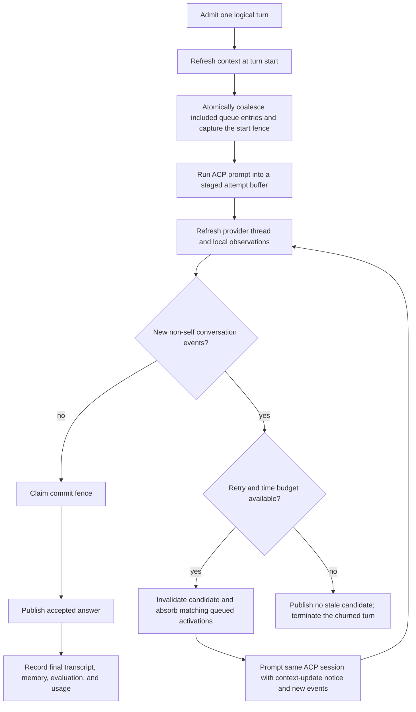

# Turn-Final Context Refresh and Answer Regeneration

> Status: Implemented.
> Scope: daemon-owned interactive IM turns (Slack, Discord, Lark / Feishu, and Telegram)
> Primary implementation area: `packages/daemon`
> Rollout: core staging, local observation, Slack final snapshots, and observed-only
> fallback are available behind `features.turnFinalContextRefresh` (default `true`;
> set to `false` to opt out and keep pre-refresh delivery behavior)

## 1. Summary

An agent can spend minutes producing an answer while the conversation thread keeps
moving. Today those later messages are available on the agent's next activation, but
the daemon can still publish an answer based on the thread as it looked when the turn
started.

This design turns answer delivery into a daemon-owned workflow:

1. Refresh thread context before the first prompt, preserving the existing catch-up
   behavior.
2. Stage the candidate answer inside the daemon instead of publishing answer text as
   ACP chunks arrive.
3. Refresh the thread again after `session/prompt` finishes and immediately before the
   candidate answer is committed to the IM platform.
4. If new conversational messages from anyone other than the current agent appeared,
   discard the candidate answer, add those messages to the same ACP session, tell the
   agent that its context changed, and ask it for a replacement answer.
5. Publish only a candidate that passes the final context check.

The correctness boundary belongs in the daemon, not in a model-side workflow. The
daemon alone owns platform reads, normalized author identity, the local transcript,
the per-session admission queue, and the public send boundary. The implementation
should nevertheless be structured explicitly as a reusable `TurnOutputWorkflow`
rather than adding another conditional around `host.prompt()`.

## 2. Current Behavior Audit

The turn-start catch-up mechanism still exists and is covered by daemon tests.

### 2.1 What is already working

`SessionManager.handle()` currently does the following before returning the prompt
blocks to `Daemon.dispatchOne()`:

- Records the triggering message in the daemon-local thread transcript.
- Uses the session's `lastDeliveredTs` as a per-agent read cursor.
- Replays conversational transcript rows after that cursor, excluding the current
  agent's own messages and excluding tool/reasoning rows.
- Bounds one replay batch to the newest 50 conversational entries.
- For every Slack mid-thread activation, calls `fetchThreadHistory()` with a fixed
  wall-clock cutoff. The daemon reads `conversations.replies`, imports the stable
  snapshot, filters AgentConnect chrome, relabels trusted AgentConnect authors, and
  then assembles the prompt in event-time order.
- Treats a delayed Slack Socket Mode event as an attention signal rather than as the
  authoritative newest message. If the Slack snapshot already contains later
  messages, it supplies one chronological unread batch with the newest instruction
  last.
- Records otherwise-unrouted inbound messages when a session in the thread is recent
  or currently in flight, so another participant's message can be replayed later.
- Serializes activations for one logical
  `(platform, channel, thread, agent, transportScope)` session. Messages routed to the
  same busy agent wait in the daemon's per-session FIFO.

The relevant regression coverage is in `packages/daemon/test/session-manager.test.ts`,
including cold Slack backfill, warm Slack snapshots, cutoff fencing, own-message
filtering, and cross-agent catch-up.

### 2.2 Gaps in the current mechanism

The existing mechanism is a **turn-start** mechanism, not a pre-publication check.

- `lastDeliveredTs` advances while prompt assembly starts; it does not say that the
  finished answer was based on the latest thread state at publication time.
- Only Slack currently has a platform-history fetch seam. Discord and Feishu use
  live daemon observations; Telegram also relies on received updates and quoted reply
  context.
- A message routed to the same busy agent may exist only in `serialQueue` until its
  own `SessionManager.handle()` starts. A transcript-only final check would miss it.
- Answer text is not currently staged. Slack, Telegram, and Discord may flush body
  text after an approximately two-second stream idle; Feishu updates its answer card
  while the model is running; webchat forwards ACP chunks directly. Once text has
  been posted, "discard the result" is no longer possible without visible edits or
  retractions.

Therefore the new behavior requires both context reconciliation and a change to the
answer publication boundary.

## 3. Goals and Non-Goals

### Goals

- Preserve and generalize turn-start context catch-up.
- Detect non-self conversational messages observed after the candidate generation
  began and before its commit point.
- Regenerate in the same logical and ACP session so the agent retains tool state and
  earlier reasoning.
- Publish only the latest accepted candidate answer.
- Keep the mechanism provider-neutral above a narrow platform snapshot adapter.
- Coalesce a same-agent queued clarification into regeneration instead of answering it
  once during regeneration and again as a second queued turn.
- Retain daemon autonomy: no Control Plane call is needed on the message hot path.
- Bound retries, cost, memory, and provider history reads.

### Non-goals

- This is not a transaction over agent tool side effects. A first attempt may already
  have edited files, called an API, or deployed something before a late thread message
  arrives. The daemon can discard its answer, but cannot generically roll back those
  effects. The regeneration notice must tell the agent not to repeat completed work
  blindly.
- This does not provide an atomic transaction with Slack, Discord, Feishu, or
  Telegram. A remote user can always post in the small interval after the final read
  and before the platform accepts the answer. Section 7 defines the daemon's precise
  linearization point and guarantees.
- V1 does not reconcile message edits, deletes, reactions, or transient platform
  chrome. The context revision is advanced by newly observed conversational messages.
- Headless hooks, cron turns without an IM destination, GitHub final comments, and
  webchat are outside the initial rollout. A single-agent webchat conversation has no
  independent shared IM thread to refresh. Multi-agent webchat conversations do, and
  implement the adoption specified in
  [webchat-multi-agents.md](webchat-multi-agents.md) section 5.4 — the same
  coordinator, budgets, and regeneration loop, with the commit fence on the canonical
  conversation post instead of staged platform delivery (the browser stream stays
  live).
- The design does not merge ACP sessions between agents. Each agent still has its own
  ACP session and catches up through normalized thread text.

## 4. Definitions and Invariants

### 4.1 Terms

- **Conversation event:** normalized message text, attachments, and quote context that
  belong to a logical thread and may be shown to an agent.
- **Self event:** an event proven to have been authored by the agent whose turn is
  running. Self is evaluated relative to `refresh(agentId)`, not assigned globally at
  ingestion. Provider-authenticated AgentConnect author metadata is preferred over
  display names or text heuristics.
- **Chrome:** status bars, typing indicators, plans, progress, tool output, approval
  cards, and other daemon UI that is not conversation context.
- **Context revision:** a daemon-local, monotonically increasing observation fence for
  one logical thread. It advances when a new conversation event is durably inserted.
- **Provider checkpoint:** an opaque platform-specific cursor used for incremental
  thread reads, such as a Slack timestamp or Discord snowflake.
- **Candidate answer:** answer text and answer-rendering actions produced by one
  `host.prompt()` attempt but not yet committed to the IM platform.
- **Generation:** one candidate-producing prompt within a single admitted logical
  turn. A context change creates another generation, not another user-visible turn.
- **Commit point:** the point at which the workflow claims the locally stable context
  revision and enqueues the accepted answer's first irreversible platform write.

### 4.2 Required invariants

1. Candidate answer body text is not sent or recorded as delivered before the final
   context check accepts that generation.
2. Self events and trusted daemon chrome never invalidate a candidate.
3. Messages from humans, third-party bots, and other AgentConnect agents do invalidate
   a candidate when they belong to the same logical thread.
4. Peer-agent conversation events are persisted before routing or activation filtering;
   only the authoring agent treats such an event as self.
5. Every invalidating event is supplied to the replacement prompt exactly once, in
   platform event order, subject to the existing bounded replay policy.
6. A queued activation absorbed by the current workflow is terminalized as coalesced
   and does not run again.
7. Only the accepted candidate becomes visible answer text and post-turn memory output.
8. Token and cost accounting includes all generations because discarded generations
   still consumed provider resources.
9. Cancellation, pause, loop protection, or shutdown fences every generation and the
   eventual commit just as they fence an ordinary turn today.

## 5. Daemon-Owned Turn Output Workflow

The workflow is a deterministic daemon state machine. It must work for every ACP
runtime; Claude's optional dynamic-workflow mode may be useful to the model internally
but is not a delivery or consistency primitive.



The decision order in the diagram is conceptual. The implementation checks the retry
budget only on the `yes` branch before starting another generation.

### 5.1 Start refresh

`ThreadContextCoordinator.refresh()` replaces Slack-specific catch-up code as the
common entry point. It:

1. Reads a bounded incremental snapshot from the platform when the adapter supports
   it.
2. Imports new conversation events idempotently into the local transcript.
3. Includes live events that the daemon already observed, including a same-agent
   activation waiting in `serialQueue`.
4. Filters trusted daemon chrome, then filters only events whose trusted
   `authorAgentId` equals the current `agentId`; peer-agent output remains context.
5. Returns ordered prompt events, a context revision, a provider checkpoint, and a
   completeness label.

`SessionManager` remains responsible for converting those events into ACP content
blocks, enforcing the replay cap, applying the per-agent delivery cursor, attachments,
quoted-source handling, standing context, and memory recall.

The returned queue IDs are read-only candidates until the workflow claims its first
generation. After every cold-start and pre-prompt ready gate has passed, the workflow
uses the start-fence protocol in section 7.2 to terminalize only queued entries actually
included in these blocks, capture `baseRevision`, and start the first prompt atomically.
This prevents an included clarification from later running as a duplicate turn without
losing it when initialization or a ready gate fails.

This preserves the existing Slack behavior while making the source abstraction usable
by the final refresh.

### 5.2 Candidate generation

`dispatchOne()` delegates the prompt-and-deliver portion to a
`TurnOutputWorkflow`. For each generation the workflow creates an `AttemptBuffer` and
runs:

```ts
await host.prompt(sessionId, promptBlocks)
```

Masked ACP updates still feed usage, title handling, approval/elicitation handling,
and the private activity recorder. Answer-bearing `agent_message_chunk` updates feed
the attempt buffer, not the platform converger's send path.

Non-answer chrome remains live:

- Slack status, Discord/Telegram typing, and a Feishu "Thinking" card may be shown.
- Permission or elicitation UI must remain interactive.
- Tool/plan/reasoning messages may remain visible according to output mode, but they
  must be tagged as trusted chrome and excluded from context refresh.

Answer text commits per **segment**, not per turn. A boundary the live renderer
flushes buffered text on — `tool_call`, `tool_call_update`, `agent_thought_chunk`,
`plan` — commits the staged text ahead of it: the staged chunks replay in order
through the platform converger (which still applies its own mode semantics), the
text appends to the turn's canonical reply, and the stage clears. Interleaved
"say → work → say more" therefore reaches the channel as it happens, as separate
messages, instead of collapsing into one body at turn end. Turn-end housekeeping
updates (usage, session titles) are deliberately not boundaries, so the closing
segment — the text after the model's last tool or thinking step — stays staged
until the final context fence.

Discard semantics narrow accordingly: a segment committed at a boundary is
already said, exactly like any other message in the thread that precedes a
late-arriving event; only the closing segment is regenerable. Token-by-token
streaming of the closing segment is still withheld until commit — that remains
required for its discard semantics.

### 5.3 Final refresh and regeneration

After `host.prompt()` resolves, the workflow performs another refresh using the
generation's revision and provider checkpoint. If no invalidating event exists, it
enters the commit protocol in section 7.

If new events exist, the workflow drops the `AttemptBuffer` — which by then holds
only the closing segment (§5.2) — and sends one replacement prompt to the same ACP
session. The daemon-generated prefix should be stable and provider-neutral:

```text
(AgentConnect context update: the conversation changed while you were working.
Your previous candidate answer was not delivered. Re-evaluate the task using the new
thread messages below and produce a replacement final answer. Preserve useful work
already completed, do not repeat side effects blindly, and do not mention this retry
unless it matters to the user.)

(new thread messages, oldest to newest)
[sender-id] message text
```

When earlier segments of the answer were already committed at a boundary, the
heading instead says that everything before the model's last tool or thinking step
was delivered and stands, and asks for a replacement of the undelivered closing
part alone (`contextUpdateText`'s `deliveredPrefix` variant) — otherwise the model
reasonably re-says the whole answer.

The replacement prompt contains only events after the previous generation fence; the
ACP session already contains the original prompt and prior candidate. The workflow then
repeats candidate generation and final refresh.

Memory recall should run for the original activation as it does today. Regeneration
does not need another external semantic-memory query: the new thread events and the
existing ACP session are the relevant delta, and repeated recall would add latency and
non-deterministic context.

### 5.4 Same-agent queued messages

An inbound message routed to the same agent while it is busy currently waits as a new
turn. If the final refresh incorporates that message, leaving it queued would produce
two answers.

There are two explicit coalescing points:

- **Initial coalescing:** a queued entry included in the first prompt is absorbed by the
  start-fence protocol in section 7.2. There is no retry decision yet, but all
  pre-prompt gates must already have passed.
- **Regeneration coalescing:** a final refresh first identifies matching queued entries
  without mutating the queue. Only after the workflow has found invalidating events
  **and** decided under the thread mutex that the retry budget permits another
  generation does it absorb them.

At either point, absorption applies only to entries whose stable platform event IDs are
actually included in the corresponding prompt:

- Remove those entries from `serialQueue`.
- Mark their durable inbox rows terminal with a `coalesced_into_turn` outcome.
- Resolve their dispatch promises with the current ACP session ID.
- Emit metadata-only evaluation/metrics for the coalescing decision.
- Preserve queue order for unrelated commands or later messages not included in the
  refresh window.

A message addressed to another agent is not in this agent's queue. It remains a normal
activation for that other agent while also serving as thread context that can
invalidate this agent's candidate.

## 6. Proposed Interfaces and State

The names below are illustrative; the separation of responsibilities is normative.

```ts
interface ThreadContextSource {
  snapshot(input: {
    platform: 'slack' | 'discord' | 'feishu' | 'telegram'
    channel: string
    thread: string
    providerThreadRef?: string
    after?: string
    limit: number
  }): Promise<{
    events: NormalizedThreadEvent[]
    checkpoint?: string
    completeness: 'authoritative' | 'observed-only'
  }>
}

interface ThreadContextCoordinator {
  observeInbound(event: NormalizedThreadEvent): void
  refresh(input: {
    agentId: string
    channel: string
    thread: string
    transportScope?: string
    afterRevision: number
    providerCheckpoint?: string
  }): Promise<ContextRefresh>
}

interface ContextRefresh {
  events: NormalizedThreadEvent[]
  revision: number
  providerCheckpoint?: string
  completeness: 'authoritative' | 'observed-only'
  queuedEntryIds: string[]
}
```

`NormalizedThreadEvent` needs stable provider identity, trusted `authorAgentId` when
known, text, attachments/quote metadata, event time, logical thread coordinates, and a
trusted chrome flag. It must not persist a global `self` flag or infer agent authorship
from a mutable display name: self is determined later by comparing `authorAgentId` with
the agent passed to `refresh()`.

The local store should expose a thread-scoped revision query rather than use `ts` as
the universal finalization fence. Slack timestamps, Discord snowflakes, Feishu opaque
message IDs, Telegram numeric IDs, and daemon-generated monotonic IDs do not share one
ordering domain. Existing `transcript.revision` can seed the implementation, with a
query such as "conversation rows in this thread whose revision is greater than N".
Presentation order remains platform event time plus a deterministic local tie-breaker.

The session's existing `lastDeliveredTs` remains the model-delivery cursor during the
first migration. A later cleanup may replace it with a provider-neutral per-agent
context revision, but changing cursor semantics is not required to implement the
workflow safely.

`Pending` gains generation-local state instead of reusing one converger for the entire
turn:

```ts
interface TurnOutputState {
  generation: number
  baseRevision: number
  providerCheckpoint?: string
  attempt: AttemptBuffer
  totalUsage: AccumulatedUsage
  startedAt: number
}
```

Every new generation receives a fresh converger/answer buffer so discarded text,
footer ownership, idle timers, and Feishu cumulative card text cannot leak into the
accepted generation.

## 7. Refresh and Commit Protocol

### 7.1 Local observation before routing

To make Telegram, peer-agent output, and queued same-agent messages visible, normalized
inbound conversation events for a live thread must be durably observed before model
dispatch, not only when `SessionManager.handle()` eventually runs. Command parsing and
trusted chrome classification happen first, but activation filtering does not precede
observation. In particular, a provider delivery echo authored by an AgentConnect agent
may be suppressed from waking another agent while its conversational event is still
persisted (or deduplicated against the send-boundary row) with trusted `authorAgentId`.
`refresh(agentId)` then excludes it only for that same authoring agent; every peer agent
can still receive it as context.

The existing transcript primary key keeps the later `SessionManager.handle()` append
idempotent. Recipient delivery metadata can still be added when the agent is known.

### 7.2 Start-fence linearization

Platform I/O and initial prompt assembly happen without holding a mutex, and matching
queue IDs remain read-only at that stage. After workspace/session initialization,
runtime-setting restoration, and every existing pre-prompt ready gate has succeeded,
the workflow enters the physical-thread mutex and:

1. Imports/rechecks locally observed events that arrived during initialization and
   appends the bounded eligible delta to the first prompt blocks.
2. Selects same-agent queue entries whose stable event IDs are actually present in
   those blocks.
3. Terminalizes those entries as `coalesced_into_turn`, resolves their dispatch
   promises with the current ACP session ID, and records recipient delivery metadata.
4. Captures the resulting context revision/provider checkpoint as the first
   generation's fence.
5. Synchronously initiates `host.prompt(sessionId, blocks)` before releasing the mutex;
   the returned promise may be awaited outside it.

If initialization or a ready gate fails before this claim, no queued entry is mutated.
Cancellation after the ACP request starts follows the existing in-flight cancellation
path; the coalesced entries belong to that started prompt and must not run again.
Messages observed after the start fence are intentionally outside the first prompt and
are handled by the final-refresh protocol below.

### 7.3 Commit linearization

The coordinator maintains a short daemon-local mutex per physical thread
`(platform, channel, thread, transportScope)`. Provider I/O happens outside the mutex;
then the workflow enters the mutex and:

1. Imports the fetched provider events.
2. Rechecks local thread revisions, catching gateway/long-poll events that arrived
   while the provider request was in flight.
3. If there is no invalidating event, claims the current revision as the commit fence
   and enqueues the accepted answer's first platform action before releasing the mutex.
4. If invalidating events exist, decides the retry-count and elapsed-time budget under
   the same mutex, before mutating `serialQueue`.
5. When the budget permits regeneration, absorbs matching same-agent queue entries,
   advances the generation fence, and returns the delta to the workflow.
6. When the budget is exhausted, leaves every matching queue entry untouched and
   returns the terminal `context_churn` outcome.

An inbound event observed before this local commit point invalidates the candidate. An
event observed after it belongs to the next turn.

This closes daemon-local races, but not the provider-side race in which a remote message
is accepted after the final platform snapshot and its gateway event arrives after the
daemon has committed. No listed IM platform offers an atomic "append only if thread is
unchanged" operation. The guarantee is therefore:

> The daemon never commits a candidate while it knows, or can read in the final bounded
> snapshot, that the logical thread changed since that generation began.

### 7.4 Snapshot failure policy

Platform history reads are best-effort availability enhancements, not a reason to lose
all replies. A capable adapter retries a failed final snapshot twice with bounded
backoff. If it still fails, the workflow checks daemon-observed events and may commit
with `completeness: observed-only`, while emitting a metric and structured warning.
This is the same achievable guarantee as Telegram.

An adapter must not interpret a failed or truncated read as an authoritative empty
snapshot. Pagination truncation is reported explicitly. When the unread window exceeds
the configured cap, the candidate is invalidated and the replacement prompt receives
the newest bounded suffix with an elision notice, matching today's replay behavior.

## 8. Platform Strategy

| Platform      | Logical thread                                                                                                           | Final refresh source                                                                                                                            | Completeness and required work                                                                                                                                                                                                                                               |
| ------------- | ------------------------------------------------------------------------------------------------------------------------ | ----------------------------------------------------------------------------------------------------------------------------------------------- | ---------------------------------------------------------------------------------------------------------------------------------------------------------------------------------------------------------------------------------------------------------------------------- |
| Slack         | `thread_ts` (including the active assistant DM thread)                                                                   | Incremental `conversations.replies` plus local observations                                                                                     | Generalize `fetchThreadHistory`, retain trusted AgentConnect metadata/chrome filtering, and reuse `oldest`/`latest` fencing. Treat the snapshot as authoritative only when the install's rate tier and complete pagination permit it; otherwise degrade to observed-only.    |
| Discord       | Parent channel ID + Discord thread channel ID; a top-level mention sets `thread` to the thread created from that message | Fetch thread-channel messages after the provider checkpoint plus Gateway observations                                                           | Add an incremental history method to `DiscordConnection`. Discord's Get Channel Messages endpoint supports `after`; it requires `VIEW_CHANNEL` and `READ_MESSAGE_HISTORY`. Missing permission degrades to observed-only and must be reported.                                |
| Lark / Feishu | Group topic/thread rooted by the message; P2P uses the chat as its logical thread                                        | Fetch topic history when a provider `thread_id` is available, otherwise bounded chat history filtered to the logical root, plus WS observations | Preserve a provider thread reference separately from the daemon's stable logical key. Feishu's history API supports `container_id_type=thread`; add the required read scope and pagination. Missing scope degrades to observed-only during rollout.                          |
| Telegram      | Forum topic ID, DM chat, or the daemon's reply-chain logical thread                                                      | Daemon-observed Bot API updates only                                                                                                            | The Bot API delivers updates but does not provide an arbitrary bot chat-history read used by this daemon. Observe every eligible inbound event before routing. Privacy mode means the bot may not observe every group message, so the guarantee is explicitly observed-only. |

References: [Slack `conversations.replies`](https://docs.slack.dev/reference/methods/conversations.replies/),
[Discord Get Channel Messages](https://docs.discord.com/developers/resources/message#get-channel-messages),
[Feishu topic history](https://open.feishu.cn/document/im-v1/message/thread-introduction), and
[Telegram bot update visibility](https://core.telegram.org/bots/faq#what-messages-will-my-bot-get).

Slack cannot be assumed to support two history reads per turn at every installation.
For commercially distributed apps installed outside the Slack Marketplace on or after
May 29, 2025, Slack documents a `conversations.replies` limit of one request per minute
and a maximum/default page size of 15; Marketplace and internal customer-built apps
retain Tier 3 limits. The coordinator must detect `ratelimited`, honor `Retry-After`,
avoid spending the turn blocked on a one-minute retry, and mark that refresh
`observed-only`. Rollout metrics must separate this rate-tier degradation from ordinary
transport failures.

For all platforms, a message from the current agent is excluded only when authorship is
trusted. Other AgentConnect agents' conversational output is included. Platform echoes
that cannot be attributed safely should be retained rather than risk hiding a human
message.

## 9. Rendering, Transcript, Memory, and Usage

### 9.1 Rendering changes

The existing convergers remain responsible for platform limits, markdown conversion,
footer placement, no-response handling, and final action construction. Their lifecycle
changes from "stream and flush" to two phases:

1. **Stage:** consume ACP updates into a generation-local buffer; emit only allowed
   chrome.
2. **Commit:** convert the accepted complete buffer into final platform actions and
   apply them through the existing serialized send chain.

The `minimal`, `low`, `medium`, and `high` modes continue to control chrome detail and
final formatting. They no longer change whether answer body text is published before
the final context check. `none` still records the accepted answer without sending it.

For Feishu, the initial card may show Thinking, but candidate text must not enter the
card until commit. Regeneration reuses the same card and changes only its status text;
the accepted answer closes it once. For Slack attribution, the footer is created only
for the accepted candidate and remains attached to its final reply section.

### 9.2 Transcript and evaluation

- Inbound events are written at observation time.
- Discarded candidate body is not written as a delivered conversational transcript
  row.
- Tool/reasoning audit events may be retained with `generation` and `discarded`
  metadata; session history should hide discarded attempt detail by default while an
  operator diagnostics view may expose it.
- `turn.started` is emitted once for the admitted logical turn.
- Add metadata-only `turn.context_changed` and `turn.regeneration_started` events.
- `turn.completed.output` contains only the committed candidate.
- If the workflow exhausts its budget, emit `turn.cancelled` with
  `context_churn`; never report a discarded candidate as completed.

### 9.3 Memory and usage

Post-turn memory capture runs once, after commit, with the combined user/context input
and accepted output. Discarded answer text must not become durable memory merely because
it was generated.

All generation usage is real usage. The workflow accumulates prompt response usage and
late `usage_update` data using the runtime-specific fold semantics already present in
the daemon. The status bar and CP usage report show the total cost of the logical turn,
not only its final generation. The latest context-window snapshot remains latest-wins.

## 10. Retry Budget and Context Churn

Regeneration can be expensive and an active channel can otherwise starve forever.
Initial defaults:

- Maximum three replacement generations after the original candidate.
- Maximum two minutes spent in regeneration, excluding time waiting for an explicit
  human approval that the agent requested.
- Existing 50-event context replay cap per refresh.
- Existing platform page-size and daemon rate-limit controls remain in force.

When either budget is exhausted:

1. Discard the current candidate.
2. Do not absorb any matching same-agent activation; the mutex decision happens before
   queue mutation, so no terminalized entry ever needs to be reconstructed.
3. Clear transient activity safely.
4. If a same-agent activation is queued, release the current turn as
   `turn.cancelled/context_churn` and let that untouched entry begin a fresh ordinary
   turn.
5. If churn came only from messages routed to another agent, there is no queued entry
   that can continue the original work. End the current turn terminally and post at
   most one daemon-authored notice, according to output mode: "The conversation kept
   changing while I was answering, so I stopped this reply. Mention me again when the
   thread settles." The notice is trusted chrome, not agent output.
6. Do not create a synthetic continuation: it could self-feed forever in a busy shared
   thread and would bypass the normal activation policy.

The retry count, elapsed budget, and message limits should be constants in V1, then
become daemon limits only if production evidence shows a need for configuration.

## 11. Failure and Interruption Semantics

- If a replacement prompt fails, the earlier candidate remains discarded. Surface the
  normal turn failure; never fall back to a stale answer.
- `!cancel`, `!stop`, pause, loop protection, drain, and shutdown suppress all staged
  and queued answer actions. They also cancel an in-flight refresh when possible.
- A provider snapshot timeout follows section 7.4; an ACP prompt timeout follows the
  existing turn failure path.
- A platform commit failure follows existing best-effort send behavior and transcript
  rules. The workflow must not regenerate merely because delivery failed; context
  freshness and transport delivery are separate concerns.
- A crash before commit leaves no public answer. Durable inbox replay starts the turn
  again. A crash after the platform accepted a write retains today's delivery
  ambiguity; solving exactly-once provider sends is separate work.
- Approval and elicitation cards are not candidates. A context change while waiting for
  a human answer is reconciled after the agent eventually finishes.

## 12. Observability

Add counters and histograms without message bodies:

- `turn_context_refresh_total{platform,phase,completeness,result}`
- `turn_context_events_total{platform,source}`
- `turn_regeneration_total{platform,outcome}`
- `turn_regeneration_generations`
- `turn_candidate_discarded_total{reason}`
- `turn_context_snapshot_duration_ms{platform,phase}`
- `turn_queue_coalesced_total{platform}`
- `turn_context_churn_exhausted_total{platform}`

Structured logs include agent ID, logical session key hash, generation, revision range,
event count, adapter completeness, and elapsed time. They must not include message text,
attachment bytes, memory contents, or platform tokens.

## 13. Rollout Plan

1. **Extract context reconciliation without changing output.** Introduce
   `ThreadContextCoordinator`, preserve existing Slack behavior, and route turn-start
   catch-up through it. Add immediate inbound observation for live threads.
2. **Add answer staging behind a daemon feature flag.** Keep existing chrome behavior,
   but buffer answer body. Validate rendering and transcript invariants on each
   platform.
3. **Enable final refresh for Slack.** It already has the strongest history reader and
   test fixtures, making it the reference implementation.
4. **Add Discord and Feishu history adapters.** Detect missing permissions/scopes and
   measure observed-only fallback.
5. **Enable observed-only Telegram.** Validate reply-chain, topic, DM, privacy-mode,
   and queued-activation behavior.
6. **Remove the flag after metrics show bounded regeneration and acceptable latency.**
   Update `docs/designs/daemon-detailed-design.md` sections 8.4, 8.5, and 9.1 when the
   implementation becomes authoritative.

No protocol or Control Plane frame is required for the core workflow. A protocol change
is needed only if regeneration diagnostics or configuration must be surfaced in the
Web UI.

## 14. Test Plan

### Unit tests

- Context revision advances only for new conversation events in the same physical
  thread.
- Self output and trusted chrome do not invalidate; human, third-party bot, and peer
  agent messages do.
- Provider imports are idempotent and ordered independently of local insertion order.
- A failed/truncated provider read never masquerades as an authoritative empty result.
- The context-update prompt contains each delta once and preserves attachment/quote
  references.
- Retry and elapsed budgets terminate deterministically.

### Session and daemon tests

- Keep every existing turn-start catch-up regression test passing.
- No platform answer post occurs before the first prompt resolves and final refresh
  accepts it.
- A message arriving during the first prompt causes two `host.prompt()` calls but only
  the second candidate is posted and recorded.
- A message arriving during the provider refresh is caught by the local revision
  recheck.
- A same-agent entry queued during cold/session initialization and included in the
  first prompt is atomically terminalized at the start fence, reaches the model exactly
  once, and cannot dispatch after the accepted answer.
- A ready-gate failure before the start fence leaves every candidate queue entry
  untouched and runnable.
- A same-agent queued clarification is absorbed and not dispatched again.
- A message addressed to another agent invalidates the candidate without stealing the
  other agent's activation.
- Repeated context churn exhausts the budget without publishing any discarded answer.
- Budget exhaustion leaves every matching same-agent queue entry pending and
  unterminalized so the serial gate can run it normally.
- Peer-only churn with no current-agent queue entry terminates explicitly, posts no
  promise of automatic continuation, and creates no synthetic activation.
- Replacement failure, cancellation, pause, drain, and shutdown cannot release a staged
  candidate.
- `none`, `minimal`, `low`, `medium`, and `high` preserve their final formatting and
  chrome semantics.
- Slack attribution appears only on the accepted final reply; Feishu closes one card;
  Telegram and Discord respect their message-size limits.
- Memory capture and evaluation contain only the accepted answer while usage includes
  every generation.

### Platform adapter tests

- Slack incremental `oldest`/`latest` pagination and trusted metadata filtering.
- Discord `after` pagination, permission failure, self/webhook attribution, and thread
  channel ordering.
- Feishu topic pagination, chat fallback filtering, scope failure, root/thread mapping,
  and bot authorship.
- Telegram immediate observation across forum topics, DMs, reply-chain logical threads,
  delayed updates, and privacy-mode limitations.

## 15. Acceptance Criteria

The feature is complete when all of the following are true:

1. The existing turn-start catch-up suite remains green.
2. For every supported IM platform, an eligible non-self message observed before the
   local commit point prevents publication of the current candidate.
3. The same ACP session receives a bounded context-update prompt and produces the only
   answer body that becomes visible.
4. Same-agent clarifications merged into regeneration do not run twice.
5. No output mode can leak candidate answer text before acceptance.
6. Failure and retry exhaustion never fall back to a stale candidate.
7. Platform capability gaps are explicit in metrics and documentation rather than
   silently described as authoritative freshness.
