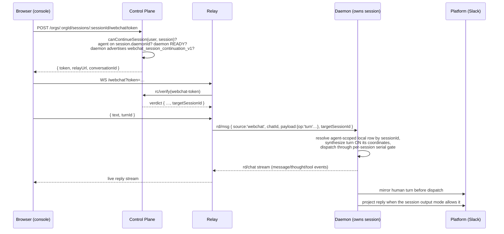

# Webchat Continuation of Other Integrations' Sessions

**Status:** Implemented (v1)
**Owner:** console/web + control plane + relay + daemon
**Related:** issue #180 (webchat could continue other integration's session),
[webchat-multi-agents.md](webchat-multi-agents.md),
[merged-conversation-view.md](merged-conversation-view.md),
[session-concept.md](session-concept.md),
[session-visibility.md](session-visibility.md),
[shared-bot-relay.md](shared-bot-relay.md),
[product-conventions.md](../product-conventions.md)

> This document designs **cross-surface session continuation**: the console's
> webchat composer sending a human turn into an existing agent session that was
> created by another integration (a Slack thread, a Telegram chat, a Discord
> thread, a Feishu conversation). Today those sessions render read-only in the
> console — the composer exists only for `playground`/`webchat` sessions, and
> [merged-conversation-view.md](merged-conversation-view.md) §9 explicitly
> records "the console is an observer of IM platforms, not a poster" as the
> shipped state and defers a console→platform composer as "a separate product
> question". Issue #180 is that product question. This design answers it.

---

## 1. Summary

A session is an agent-scoped four-tuple `platform:channel:thread:agentId`
([session-concept.md](session-concept.md) §1.1). The webchat pipeline is built
on the assumption that **the conversation is the session**: the browser only
ever names a `conversationId`, the token binds it, the wire frame carries
`sessionKey == chatId` (`packages/protocol/src/frames/relay-daemon.ts:186-193`),
and the daemon _derives_ the local session key from the conversation id
(`packages/daemon/src/daemon.ts:6791` —
`webchat:<cid>:webchat:<cid>:<agentId>`). Nothing in the chain can express
"deliver this browser turn into the session at `slack:C123:1712.34:agentA`".

This design adds a **session-targeted webchat conversation** — a webchat
conversation whose durable target is an existing session instead of a fresh
webchat-owned channel:

- The CP mints a webchat token whose conversation row **adopts** a target
  session, after checking the caller may continue it and the owning agent is
  still placed on the daemon that owns the session's content.
- The relay forwards turns unchanged; the verified verdict carries the
  server-selected target session id so the daemon never trusts a
  browser-supplied session id.
- The daemon resolves that id in the named agent's local session store and
  dispatches the turn **onto the target session's own local coordinates**
  — the same synthesis the `replyToSession` local branch already performs for
  agent-initiated cross-session delivery (`daemon.ts:8514-8573`) — while
  attaching the webchat stream sink so the browser sees the live reply.
- The human turn is **mirrored to the originating platform thread before ACP
  dispatch** (§5.2); the reply follows that session's existing output mode.
  Platform participants therefore never miss input that changed the agent's
  context, while `none`/muted output keeps its established meaning. The session
  remains the single source of truth; both surfaces are projections
  ([product-conventions.md](../product-conventions.md), "the session is the
  complete truth; IM is one projection").

Architecture invariants are preserved: the CP stays off the message hot path
(it only mints and verifies tokens and stores the adoption tuple), the relay
persists no content, message bodies remain daemon-local, and rolling
deployments fail closed behind daemon and relay capability gates.

## 2. Goals and non-goals

### 2.1 Goals

1. From the console session detail page, a user who may continue an
   integration-origin session gets a live composer; sending a turn resumes the
   **same logical and ACP session** — full context, same worktree, same memory.
2. The reply streams into the console with the full webchat surface (message,
   thought, tool-call lanes). Its platform projection follows the origin
   session's normal output rules; the human input is always mirrored first.
3. Later platform-side messages continue the same session seamlessly — the
   webchat exchange is ordinary session history, not a fork.
4. Authorization is CP-checked at mint time and re-checked at token
   verification through a distinct `session.continue` action, then
   daemon-enforced by construction (the browser can never name an arbitrary
   session; only the signed verdict carries the target).
5. Mixed-version deployments fail closed: an old daemon or relay simply makes
   the CP refuse to mint, and the console keeps today's read-only view.

### 2.2 Non-goals (v1)

- **No multi-agent adoption.** A session-targeted conversation has exactly one
  participant: the session's owner agent. Continuing one agent's session of a
  multi-agent Slack thread is in scope; a merged multi-agent continuation
  composer is not (it composes with
  [merged-conversation-view.md](merged-conversation-view.md) later). Ordinary
  platform-side activation of agents already participating in that thread is
  not adoption and follows §5.2.
- **No continuation of `hook`/`dream`/`a2a` sessions.** v1 targets chat-origin
  sessions (`originKindOf(platform) === 'chat'`,
  `packages/protocol/src/frames/route.ts:43-60`). Headless-origin sessions have
  no human conversation surface to mirror to and different ownership semantics.
- **No continuation after an agent move.** Same rule as webchat resume today
  ([product-conventions.md](../product-conventions.md)): content ownership is
  daemon-local and does not migrate.
- **No new CP↔daemon frames.** The CP WS `session/*` family stays read-only;
  the content path rides the existing relay webchat plane.
- **No platform-side identity impersonation.** The mirrored human turn is
  posted by the bot, clearly attributed (§5.2); we do not attempt per-user
  platform identities.

## 3. Why this is impossible today

Each blocker, with its exact site:

1. **Addressing.** The browser passes only `orgId + agentId + conversationId`
   (`packages/web/src/lib/api.ts:133,180`); token claims are
   `{userId, user, agentId, orgId, conversationId}`
   (`packages/control-plane/src/http/routes/webchat-token.ts:116-122`); the
   relay frame carries `sessionKey == chatId`
   (`packages/protocol/src/frames/relay-daemon.ts:190`); the daemon derives
   `webchat:<cid>:webchat:<cid>:<agentId>` (`daemon.ts:6791`). No field in the
   chain can carry a foreign session coordinate.
2. **Authorization.** `webchat_conversation` proves `(conversationId, userId,
agentId, orgId)` ownership of webchat-born conversations only
   (`packages/control-plane/prisma/schema.prisma:1058-1091`). The session read
   policy (`session-visibility`) is view-only; nothing authorizes a _human
   writing into_ a platform session.
3. **Source-binding immutability.** A session row is bound first-wins to its
   external source; `bindSessionSource` returns `'mismatch'` for a turn whose
   attributed source differs (`daemon.ts:15932-15988`). A turn synthesized on
   `platform:'webchat'` coordinates can never enter a Slack-bound row.
4. **Output routing.** A turn dispatched into a platform session resolves its
   reply transport from the session's own platform + transportScope
   (`integrationIdForSessionTransport`, used at `daemon.ts:8527`), while the
   webchat stream sink is attached only when the pending turn is webchat-shaped
   (`daemon.ts:12558-12574`). Neither path knows how to do both.
5. **Console UI.** `isLive = isPg || isWebchat` gates the composer
   (`packages/web/src/components/console/views/SessionDetailView.tsx:2195-2203`);
   integration sessions render read-only with a `threadUrl` deep link, and
   `channelId` is only populated for webchat/hook/named-channel rows
   (`packages/web/src/lib/api.ts:1816`).

And the seam that makes the daemon side tractable: the `replyToSession` local
branch (`daemon.ts:8514-8573`) already implements "inject a synthesized
message into an arbitrary existing session on its own coordinates, resolving
the reply transport from that session's platform". Continuation reuses that
shape with a human sender and an attached webchat sink.

## 4. Design overview



The design principle: **continuation is a new ingress for an existing session,
not a new kind of session.** The session keeps its key, its source binding,
its output rules, and its platform identity. Webchat becomes a second door
into the room rather than a second room.

## 5. Product decisions

### 5.1 Who may continue a session

Mint-time and verify-time check, CP-enforced (`canContinueSession`):

- Add `AuthorizationAction.SessionContinue` rather than reusing
  `SessionView`. Continuation is an organization write: `viewer` is refused
  UNIFORMLY — including for a private session the viewer owns (unlike
  `session.visibility.change`, this makes the org's bot speak) — so the mint,
  detail-DTO, and verify gates can never disagree; `collaborator`/`owner` may
  continue a shared session only when the ordinary session-view policy also
  admits them. This is an explicit AgentConnect operator grant to post through
  the organization's bot — it does not pretend the caller has a platform
  identity or is a member of the origin channel.
- Private sessions additionally remain owner-only: the caller's resolved
  identity set must match `ownerIdentity`; organization role never widens a
  private audience. The mint stamps the proven owner identity into the token,
  and verify fences it against the live row.
- Additionally the caller must be able to `canView` the owning **agent** (same
  gate the webchat mint applies today, `webchat-token.ts:100`).

`rc/verify` resolves the signed `userId` to its current organization role and
identity set and runs the same predicate again. A role, membership, visibility,
or agent-access change between mint and dial therefore invalidates the token.
Once the relay accepts a socket, its authorization lifetime follows the
existing webchat connection model; this design does not add mid-socket
revocation.

Rationale: viewing a transcript is not authority to make the bot speak in an
external system. The distinct write action keeps read-only organization members
read-only while preserving the motivating ops case for collaborators and
owners. Provider membership can tighten this action later without changing the
route; it is not required or inferred in v1.

The grant covers sending a human turn. A targeted conversation does **not**
offer runtime-setting operations in v1. `set_model`, `set_effort`,
`set_permission_mode`, and `set_fast` are rejected even when
`allowRuntimeChangesInChat` is true. `cancel` is accepted only for a `turnId`
owned by that same targeted conversation's live webchat stream; it is not a
session-global stop capability.

### 5.2 Where the turn and the reply are delivered

**Mirror human input to the platform before dispatch; project the reply under
the existing output rules.**

- The **human turn** is posted to the origin thread by the bot under the console
  user's identity. On Slack that is the user's own display name and avatar as the
  per-message `username` / `icon_url` (the same `chat:write.customize` path agent
  replies use), with the body left as typed; the avatar is the profile picture the
  Control Plane already knows and travels inside the verified token, never as
  browser input. Where the platform cannot render a per-message identity the
  body is attributed instead: `[<user> via console] <text>` — every other
  platform, and a Slack send whose identity is dropped for a missing scope, where
  the Slack send boundary swaps in the attributed body atomically (on the very
  post that proves the scope missing, not only once latched) and reports which
  body landed so the routing re-stamp re-supplies it. This uses the same
  integration client the session's replies use.
- The mirror is an ordinary authenticated platform message, and delivery must
  be PROVEN: only a returned provider message id counts — an undefined result
  (a provider that swallows send failures) takes the same refusal path as an
  exception. It then takes the SAME two-step shape an ordinary agent reply
  takes: an attributed body post, then a finalizing `chat.update` stamping the
  trusted routing claim (author = the target agent, root depth, unaddressed
  final). The `message_changed` finalization is the one event every Slack
  ingress admits before its own-bot echo suppression, so same-app/shared-bot
  participants and agents placed on OTHER daemons alike route it through the
  ordinary verified ladder: thread peers activate exactly-once via the durable
  activation rendezvous under their own connection-fenced rules, while the
  target author is excluded and receives the console turn through the targeted
  dispatch. Peers therefore charge one agent-hop transition from root, exactly
  as they would for a bot-authored post they observed on the platform. A
  failed finalization degrades to unrouted peers — never a hidden or
  mis-routed input — matching turn-output's contract; platforms without a
  metadata claim degrade to transcript-only peers, matching ordinary agent
  replies there. The targeted webchat conversation itself still has one
  participant and streams only the target agent; v1 does not create a second
  routing policy for mirrored posts.
- The **agent reply** is delivered exactly as if the turn had arrived from the
  platform: the session's output mode and splitting rules apply unchanged
  ([product-conventions.md](../product-conventions.md)). The webchat stream is
  an _additional_ sink, not a replacement. In `none` mode the reply remains in
  the session and webchat stream but is not posted to the platform.

Rationale: a silent console side-channel into a shared thread would make the
platform transcript lie — later Slack messages would show the agent "knowing"
things nobody in the channel said. Mirroring keeps both projections honest and
is what lets §2.1 goal 3 (seamless platform-side continuation) hold for the
humans as well as for the agent. The suppress-platform-post alternative is
recorded as rejected for shared conversations; it may return later as an
explicit per-turn option for DM-origin sessions where the console user _is_
the platform-side human.

This is not a cross-system transaction. The daemon uses the smallest ordering
that prevents a hidden console input:

1. Resolve the target, run every synchronous admission check, and reserve one
   slot under the target session's serial key without starting ACP dispatch.
2. Post the attributed human turn and await the platform acknowledgement. The
   stable id `webchat-cont:<chatId>:<turnId>` is reused as the provider
   idempotency key where the provider supports one.
3. On post failure, release the reservation and refuse the browser turn with
   `reason: 'integration_delivery_failed'`. On success, commit the reserved
   dispatch and return the ordinary accepted ack.

A process crash between steps 2 and 3 can leave an attributed platform input
without an agent reply, but never lets the agent consume input hidden from the
platform. Retrying the same `turnId` is idempotent at daemon admission and at
providers that expose idempotency; providers without it may show a duplicate
attributed input after retry. This is the same projection-failure boundary as
ordinary platform output and is explicitly not claimed to be atomic. A
disconnected integration fails at step 1 as `integration_offline`.

### 5.3 Placement gate

Same invariant as webchat resume: continuation requires the owner agent to be
currently placed on `session_meta.daemonId` (the immutable content owner,
`schema.prisma:946`) and that daemon READY and feature-capable. Checked at
mint time and re-checked at `rc/verify` time (the verify path already
re-resolves live placement, `registry/webchatVerification.ts:37`).

## 6. Changes by package

### 6.1 `@agentconnect.md/protocol`

- New capability constant in `src/consts.ts`:
  `WEBCHAT_SESSION_CONTINUATION_FEATURE = 'webchat_session_continuation_v1'`,
  advertised in the daemon hello capabilities like
  `WEBCHAT_MULTI_AGENT_FEATURE` (`consts.ts:92`).
- `RcRegister` (`frames/relay-cp.ts`) gains
  `features: z.array(z.string()).default([])` and relays advertise the same
  feature when they preserve the session target end to end. The default keeps
  old relays register-compatible. The CP stores the advertised set on the relay
  row and live relay channel; an absent list means no continuation support.
- `RdMsgWebchat` (`frames/relay-daemon.ts:186`) gains one optional field:

  ```ts
  targetSessionId?: string // CP session_meta.id == ACP session id
  ```

  Absent ⇒ today's behavior (conversation-derived webchat session). The relay
  copies it verbatim from the verified verdict; it never originates in the
  browser. It is deliberately the only cross-system coordinate on the wire —
  every platform/channel/thread/scope value comes from the daemon's own
  session row (§6.4), so there is no CP snapshot to drift out of sync.

- `RcVerifyResult` for `webchat-token` gains the same optional
  `targetSessionId` (populated by the CP from the conversation row at verify
  time).
- The webchat status frame (`frames/webchat.ts:100-128`) already carries
  `sessionId` back to the browser; unchanged.

### 6.2 `@agentconnect.md/control-plane`

- **Schema:** `WebchatConversation` gains a nullable
  `targetSessionId String? @db.Text` → `SessionMeta.id` (`Cascade`). A non-null
  target IS the discriminator: null ⇒ ordinary webchat conversation, non-null ⇒
  session-targeted, immutable after creation. Add
  `@@unique([userId, targetSessionId])` rather than a plain target index, so
  concurrent mints for one user/session converge on one browser conversation
  (Postgres still permits all standard rows because the target is null). A
  targeted row has no roster growth (mid-conversation join returns 409), and
  its `currentSessionId` fence points at the adopted session immediately.

  Lifecycle is two cases, no tombstone state: retention purge preserves the
  target `SessionMeta` row and stamps `contentPurgedAt`, so the FK stays
  populated but every continuation gate rejects the row; actual metadata
  deletion cascades the targeted conversation row away entirely — a targeted
  conversation without its target has no purpose, so it never degrades into an
  ordinary webchat conversation. Existing rows need no backfill (null target =
  ordinary).

- **Mint:** new route in `http/routes/webchat-token.ts`:

  ```
  POST /orgs/:orgId/sessions/:sessionId/webchat/token
  ```

  Flow: load the session (`getOrgViewableSession` semantics), run
  `canContinueSession` (§5.1), require `contentPurgedAt === null`, require
  `session.platform` chat-origin (§2.2), require the owner agent placed on
  `session.daemonId`, daemon READY and
  advertising `webchat_session_continuation_v1`; require every live relay in
  the public pool to advertise the same feature; then upsert the caller's
  session-targeted conversation row on the `(userId, targetSessionId)` unique
  key and mint the standard token (claims unchanged — the target is resolved
  server-side at verify time, never claimed by the browser). Response shape is
  the existing `WebchatTokenDto`. OpenAPI `tags`/`summary`/`description`/
  `operationId` per the repo convention.

- **Verify:** `registry/webchatVerification.ts` first requires the conversation
  row to exist. The legacy empty-roster fallback remains only for an existing
  row with a null target. For a targeted row, require a target session with
  `contentPurgedAt === null` and a fresh `canContinueSession` verdict for the
  signed user, then re-check placement (`agent.daemonId === session.daemonId`,
  READY, feature-capable — otherwise `{ok:false}`). A retention purge fails on
  `contentPurgedAt`; a metadata deletion cascaded the conversation row away, so
  the row-exists check fails — either way every outstanding token fails instead
  of silently creating a fresh webchat session. A valid verdict carries only
  `targetSessionId`; it never claims to know any daemon-local coordinate.
- **Current-session fence:** set `targetSessionId` and `currentSessionId` to the
  adopted session atomically when the targeted conversation is created.
  Continuation milestones are ordinary origin-session milestones and carry no
  webchat conversation id, so `upsertMilestone` needs no new join or special
  case.
- **Remote MCP:** the delegated-admin machinery keys its current-session fence
  on the conversation row; a session-targeted conversation **does not offer
  remote MCP** in v1 (`remoteMcp` never minted for it) — one less authority
  surface to reason about.

### 6.3 `@agentconnect.md/relay`

- `relay-cp-client.ts`: include
  `features: [webchat_session_continuation_v1]` in `rc/register`. The CP's
  public-pool contract is that every relay which can pass readiness behind
  `PUBLIC_RELAY_URL` is represented by a live relay row; mint is refused if
  the live set is empty or any member lacks the feature. During rollout the
  feature therefore remains off until the last old relay leaves readiness.
- `relay-browser-server.ts`: cache `targetSessionId` from the verdict on the
  connection deps next to `chatId` (`:101-111`).
- `relay-browser-connection.ts` `sendToParticipant` (`:322-353`): stamp
  `targetSessionId` onto every `rd/msg` for this conversation. Dedup key stays
  `(sessionKey == chatId, msgId)` — the conversation id remains the browser
  stream identity; only the daemon-side dispatch target changes.
- Routing already follows the verdict's `daemonId`; the CP guarantees it is
  the session's content owner (§5.3). No `context` fan-out (roster size is 1).

### 6.4 `@agentconnect.md/daemon`

The core change, concentrated in `dispatchWebchatTurn` (`daemon.ts:6628`) plus
the op handlers keyed off `chatId` (`daemon.ts:9986-10057`):

- **Advertise** `webchat_session_continuation_v1` in hello capabilities.
- **Target resolution.** When `RdMsgWebchat.targetSessionId` is present,
  resolve with `getSessionByAcpIdForAgent(agentId, targetSessionId)`; ACP ids
  are runtime-owned and are not assumed globally unique across agents. Use the
  returned row's existing `key`, platform/channel/thread, and
  credential-derived `transportScope` for every local lookup and dispatch —
  the daemon's own row is the only source of local coordinates. Missing row
  or a non-chat-origin row ⇒ reject (`reason: 'not_found'`) — the verdict may
  be stale after retention GC or metadata replacement.
- **Turn synthesis on origin coordinates** (the `replyToSession` shape,
  `daemon.ts:8545-8568`, with a human sender):

  ```ts
  {
    msgId: `webchat-cont:${chatId}:${turnId}`,   // per-turn: origin thread identity comes from
    traceId: turnId,                              // the local row, not from a stable msgId
    source: 'user',
    platform: local.platform, channel: local.channel,
    thread: local.thread, transportScope: local.transportScope,
    transcriptTs: monotonicTs(),
    sender: { id: user, isBot: false },
    text, mentionedBots: [botUserId], isDm: <from session row's conversationKind>,
    trigger: 'dm' | 'mention'                      // per conversationKind, so the agent is addressed
  }
  ```

  Because the message rides the local row's own platform/channel/transportScope
  and `source:'user'`, `conversationExternalSource` (`daemon.ts:15881`)
  attributes it to the **same** external scope the row is bound to, and
  `bindSessionSource` (`daemon.ts:15932`) returns `'unchanged'` — the
  immutability guard holds without a special case. This must be pinned by
  tests; if the integration is offline the incomplete attribution fails closed
  (`'unavailable'`), which surfaces as the §5.2 `integration_offline` refusal.

- **Session continuation is then automatic:** `SessionManager.handle` builds
  the same key, finds the row (`session-manager.ts:447-449,514`), and resumes
  the ACP session via the existing `loadSession`/recreate ladder
  (`session-manager.ts:890-1016`).
- **Dual sinks.** Dispatch with the resolved
  `integrationIdForSessionTransport(...)` (platform delivery, unchanged rules)
  **and** the webchat turn stream (`createWebchatTurnStream`) attached, so
  `Pending.webchat` streams to the browser while turn output posts to the
  platform. The `webchatRefresh` predicate (`daemon.ts:12574`) and the
  admission-time transcript append (`daemon.ts:6744-6774`, which writes into
  the webchat-keyed transcript) are conditioned on "conversation-owned webchat"
  — a continuation turn's transcript rows land on the origin session's
  coordinates via the normal SessionManager path instead.
- **Mirror the human turn** to the origin thread through the integration
  client after reserving admission and before starting dispatch (§5.2),
  rendered per-platform. A failed post releases the reservation and NAKs the
  turn; the stable continuation message id drives provider idempotency where
  available.
- **Keying of the aux ops.** The serial/queue preflight key
  (`daemon.ts:6718`) resolves to the **target session key** when the frame
  carries `targetSessionId`. Stream replay stays keyed by `(turnId, agentId)`
  (`daemon.ts:6798`). `cancel` reaches the target key only after the stream map
  proves the requested turn belongs to this targeted conversation;
  `set_model`/`set_effort`/`set_permission_mode`/`set_fast` are refused for a
  targeted conversation in v1.
- **Store:** no schema change. The continuation turn is ordinary session
  history on existing coordinates.

### 6.5 `@agentconnect.md/web`

- `lib/api.ts`: new binding `mintWebchatSessionToken(orgId, sessionId)`;
  `webchatWsUrl` accepts the session-target mint as an alternative source.
  Session DTO mapping: expose enough addressing for integration rows (the
  session `id` suffices — no need to widen `channelId`).
- The session detail DTO exposes a server-computed `canContinue` and a bounded
  `continuationUnavailableReason`. It is produced by the same
  `canContinueSession` predicate and state checks used by mint, covering caller
  authorization, private ownership, `contentPurgedAt`, chat-origin support,
  placement, capability, and known integration availability. As with
  `canChangeVisibility`, the console never re-derives authorization from roles
  or identities.
- `SessionDetailView.tsx`: introduce `isContinuable = session.canContinue ===
true`; structural client checks are display-only and cannot widen the server
  verdict. `isLive` grows to include `isContinuable`; the composer, typing
  indicator, and stream lanes bind through the existing `PlaygroundProvider`
  with the minted session-target conversation. The bounded reason selects
  product-language disabled copy such as "this session can't continue because
  the agent moved", "this session can't continue here yet", or "the
  <platform> connection is offline"; UI copy does not expose Control Plane,
  Relay, or daemon component names.
- `PlaygroundProvider.tsx`: `connect` accepts the session-target mint;
  everything downstream (streams keyed by `turnId`, `ready` frame carrying the
  conversation id) is unchanged.
- The read-only `threadUrl` deep link stays — "continue here" and "open in
  Slack" are complementary.
- Runtime pills follow the existing `allowRuntimeChangesInChat` gating
  for ordinary webchat only. A continuation hides them in v1; this ingress may
  add human input but does not gain session-global runtime administration.

### 6.6 Documentation

- [product-conventions.md](../product-conventions.md): extend the webchat
  resume section with the continuation gate and the §5.2 mirroring rule (the
  user-facing invariant: _continuing a platform session from the console
  posts the attributed human input before dispatch; the agent reply keeps the
  session's existing output mode; agents already participating in the origin
  thread receive the mirror under its ordinary routing rules_).
- [merged-conversation-view.md](merged-conversation-view.md) §9: replace
  "composer: none — separate product question" with a pointer here; the merged
  Slack view's composer becomes this feature's multi-agent follow-up.
- [session-concept.md](session-concept.md) §2.1: note that a `human` turn may
  enter a platform session via the console ingress, carrying the same source
  metadata shape.

## 7. Rollout and compatibility

Fail-closed gating at three points, all before any content moves:

1. **CP mint** refuses unless the owning daemon's live capabilities include
   `webchat_session_continuation_v1` and every live relay behind the public
   pool advertises it (same daemon pattern as the multi-agent gate,
   `webchat-token.ts:193-206`). `rc/register.features` is persisted with each
   relay heartbeat; an empty pool or one old live member keeps the feature off.
2. **CP verify** re-checks `canContinueSession`, `contentPurgedAt`, capability,
   and placement, so an authorization change, retention purge, downgrade, or
   agent move between mint and dial invalidates the token. It also requires the
   durable conversation row and, for a targeted row, its usable target;
   purge or deletion never degrades into standard webchat.
3. **Daemon** treats `targetSessionId` on a frame as mandatory-understood: a
   daemon that advertises the feature handles it; one that doesn't never
   receives it (the CP wouldn't have minted). A relay advertises the feature
   only when it preserves `targetSessionId`; the all-live-relays mint gate
   prevents a stale relay from silently creating a fresh webchat session
   during rolling deployment.

The Prisma migration adds the nullable cascade FK, relay feature list, and
compound unique constraint. Existing conversations need no backfill (a null
target means an ordinary conversation). The console feature-detects per
session and keeps the read-only view otherwise.

## 8. Testing

- **CP unit (`test:unit`):** `canContinueSession` matrix (private/org
  visibility × owner/collaborator/viewer/outsider), placement + daemon/relay
  capability refusals, chat-origin-only rule, mint/verify round-trip emitting
  `targetSessionId`; a role/access change between mint and verify, `contentPurgedAt`, a
  deleted target, and a missing conversation row each invalidate an outstanding
  token instead of returning a standard verdict.
- **CP integration (`test:int`):** conversation adoption row lifecycle,
  concurrent mints converging on the `(userId, targetSessionId)` unique row,
  creation atomically installing `currentSessionId`, retention stamping leaving
  a targeted row unusable with its FK intact, metadata deletion cascading the
  targeted conversation row away, and mid-conversation join returning 409.
- **Daemon:** continuation turn into an existing Slack-keyed session resumes
  the same logical + ACP session (no new row); `bindSessionSource` returns
  `'unchanged'` for the synthesized turn; agent-scoped ACP-id lookup uses the
  local row's real key and rejects an unknown or non-chat-origin id; admission
  reservation is released on offline/failed human-mirror delivery and ACP
  dispatch has not started; a successful mirror commits one target-keyed turn;
  agent output mode `none` still streams to webchat without a platform reply;
  cancel is limited to the conversation's own turn and runtime-set ops are
  refused; a platform message arriving mid-continuation queues behind the
  reservation/turn; the posting agent's provider echo does not duplicate its
  targeted dispatch, while other existing thread participants follow ordinary
  activation rules.
- **Relay:** `targetSessionId` passthrough verbatim from verdict to `rd/msg`; no
  context fan-out for a session-targeted conversation; mixed live relay
  capabilities keep mint disabled until the pool is homogeneous.
- **Web:** server-computed `canContinue` gating (unauthorized caller, purged
  content, feature flag off, agent moved, integration offline, hook/dream
  platforms), product-language disabled reasons, composer send path minting the
  session-target token, no runtime pills for targeted conversations.

## 9. Open questions

1. **Mirror rendering** — Slack now renders the human turn under the author's
   own identity (§5.2); the attributed fallback (`[<user> via console]`) remains
   the rendering everywhere else and still needs per-platform review (Telegram
   plain text, Discord, Feishu).
2. **DM-origin sessions** — when the console user is provably the same human
   as the platform DM peer, is the mirror redundant? v1 keeps it (simple,
   honest); a per-turn "don't post to platform" option is future work.
