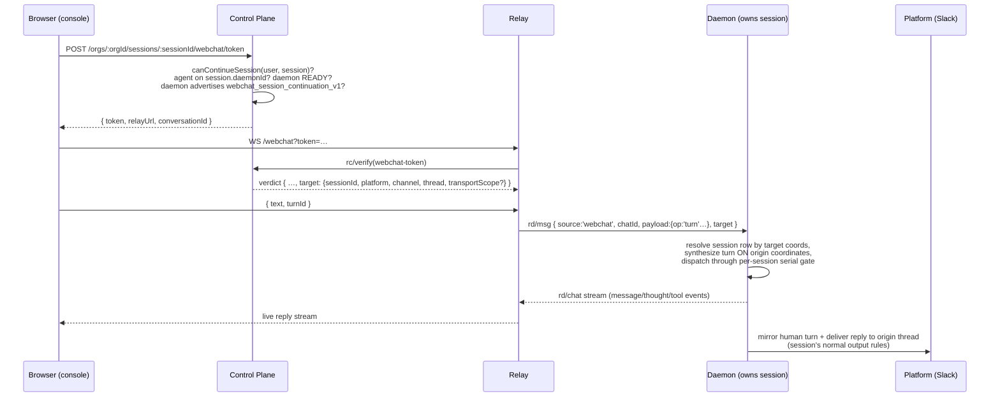

# Webchat Continuation of Other Integrations' Sessions

**Status:** Proposed design
**Owner:** console/web + control plane + relay + daemon
**Related:** issue #180 (webchat could continue other integration's session),
[webchat-multi-agents.md](webchat-multi-agents.md),
[merged-conversation-view.md](merged-conversation-view.md),
[session-concept.md](session-concept.md),
[session-visibility.md](session-visibility.md),
[shared-bot-relay.md](shared-bot-relay.md),
[product-conventions.md](../product-conventions.md)

> This document designs **cross-surface session continuation**: the console's
> webchat composer sending a human turn into an existing agent session that was
> created by another integration (a Slack thread, a Telegram chat, a Discord
> thread, a Feishu conversation). Today those sessions render read-only in the
> console — the composer exists only for `playground`/`webchat` sessions, and
> [merged-conversation-view.md](merged-conversation-view.md) §9 explicitly
> records "the console is an observer of IM platforms, not a poster" as the
> shipped state and defers a console→platform composer as "a separate product
> question". Issue #180 is that product question. This design answers it.

---

## 1. Summary

A session is an agent-scoped four-tuple `platform:channel:thread:agentId`
([session-concept.md](session-concept.md) §1.1). The webchat pipeline is built
on the assumption that **the conversation is the session**: the browser only
ever names a `conversationId`, the token binds it, the wire frame carries
`sessionKey == chatId` (`packages/protocol/src/frames/relay-daemon.ts:186-193`),
and the daemon _derives_ the local session key from the conversation id
(`packages/daemon/src/daemon.ts:6791` —
`webchat:<cid>:webchat:<cid>:<agentId>`). Nothing in the chain can express
"deliver this browser turn into the session at `slack:C123:1712.34:agentA`".

This design adds a **session-targeted webchat conversation** — a webchat
conversation whose durable target is an existing session's coordinates instead
of a fresh webchat-owned channel:

- The CP mints a webchat token whose conversation row **adopts** a target
  session, after checking the caller may continue it and the owning agent is
  still placed on the daemon that owns the session's content.
- The relay forwards turns unchanged; the verified verdict carries the target
  coordinates so the daemon never trusts a browser-supplied session id.
- The daemon dispatches the turn **onto the target session's own coordinates**
  — the same synthesis the `replyToSession` local branch already performs for
  agent-initiated cross-session delivery (`daemon.ts:8514-8573`) — while
  attaching the webchat stream sink so the browser sees the live reply.
- The turn and its reply are **mirrored to the originating platform thread**
  (§5.2), so platform participants watching the Slack thread see the same
  conversation the console user is having. The session remains the single
  source of truth; both surfaces are projections
  ([product-conventions.md](../product-conventions.md), "the session is the
  complete truth; IM is one projection").

Architecture invariants are preserved: the CP stays off the message hot path
(it only mints and verifies tokens and stores the adoption tuple), the relay
persists no content, message bodies remain daemon-local, and rolling
deployments fail closed behind a daemon capability feature flag.

## 2. Goals and non-goals

### 2.1 Goals

1. From the console session detail page, a user who may continue an
   integration-origin session gets a live composer; sending a turn resumes the
   **same logical and ACP session** — full context, same worktree, same memory.
2. The reply streams into the console with the full webchat surface (message,
   thought, tool-call lanes) and is simultaneously delivered to the origin
   platform thread under the session's normal output rules.
3. Later platform-side messages continue the same session seamlessly — the
   webchat exchange is ordinary session history, not a fork.
4. Authorization is CP-checked at mint time and daemon-enforced by construction
   (the browser can never name an arbitrary session; only the signed verdict
   carries the target).
5. Mixed-version deployments fail closed: an old daemon or relay simply makes
   the CP refuse to mint, and the console keeps today's read-only view.

### 2.2 Non-goals (v1)

- **No multi-agent adoption.** A session-targeted conversation has exactly one
  participant: the session's owner agent. Continuing one agent's session of a
  multi-agent Slack thread is in scope; a merged multi-agent continuation
  composer is not (it composes with
  [merged-conversation-view.md](merged-conversation-view.md) later).
- **No continuation of `hook`/`dream`/`a2a` sessions.** v1 targets chat-origin
  sessions (`originKindOf(platform) === 'chat'`,
  `packages/protocol/src/frames/route.ts:43-60`). Headless-origin sessions have
  no human conversation surface to mirror to and different ownership semantics.
- **No continuation after an agent move.** Same rule as webchat resume today
  ([product-conventions.md](../product-conventions.md)): content ownership is
  daemon-local and does not migrate.
- **No new CP↔daemon frames.** The CP WS `session/*` family stays read-only;
  the content path rides the existing relay webchat plane.
- **No platform-side identity impersonation.** The mirrored human turn is
  posted by the bot, clearly attributed (§5.2); we do not attempt per-user
  platform identities.

## 3. Why this is impossible today

Each blocker, with its exact site:

1. **Addressing.** The browser passes only `orgId + agentId + conversationId`
   (`packages/web/src/lib/api.ts:133,180`); token claims are
   `{userId, user, agentId, orgId, conversationId}`
   (`packages/control-plane/src/http/routes/webchat-token.ts:116-122`); the
   relay frame carries `sessionKey == chatId`
   (`packages/protocol/src/frames/relay-daemon.ts:190`); the daemon derives
   `webchat:<cid>:webchat:<cid>:<agentId>` (`daemon.ts:6791`). No field in the
   chain can carry a foreign session coordinate.
2. **Authorization.** `webchat_conversation` proves `(conversationId, userId,
agentId, orgId)` ownership of webchat-born conversations only
   (`packages/control-plane/prisma/schema.prisma:1058-1091`). The session read
   policy (`session-visibility`) is view-only; nothing authorizes a _human
   writing into_ a platform session.
3. **Source-binding immutability.** A session row is bound first-wins to its
   external source; `bindSessionSource` returns `'mismatch'` for a turn whose
   attributed source differs (`daemon.ts:15932-15988`). A turn synthesized on
   `platform:'webchat'` coordinates can never enter a Slack-bound row.
4. **Output routing.** A turn dispatched into a platform session resolves its
   reply transport from the session's own platform + transportScope
   (`integrationIdForSessionTransport`, used at `daemon.ts:8527`), while the
   webchat stream sink is attached only when the pending turn is webchat-shaped
   (`daemon.ts:12558-12574`). Neither path knows how to do both.
5. **Console UI.** `isLive = isPg || isWebchat` gates the composer
   (`packages/web/src/components/console/views/SessionDetailView.tsx:2195-2203`);
   integration sessions render read-only with a `threadUrl` deep link, and
   `channelId` is only populated for webchat/hook/named-channel rows
   (`packages/web/src/lib/api.ts:1816`).

And the seam that makes the daemon side tractable: the `replyToSession` local
branch (`daemon.ts:8514-8573`) already implements "inject a synthesized
message into an arbitrary existing session on its own coordinates, resolving
the reply transport from that session's platform". Continuation reuses that
shape with a human sender and an attached webchat sink.

## 4. Design overview



The design principle: **continuation is a new ingress for an existing session,
not a new kind of session.** The session keeps its key, its source binding,
its output rules, and its platform identity. Webchat becomes a second door
into the room rather than a second room.

## 5. Product decisions

### 5.1 Who may continue a session

Mint-time check, CP-enforced (`canContinueSession`):

- The caller must pass the existing session **view** policy
  (`session-visibility.md`) — private sessions (platform DMs, sessions with
  `ownerIdentity`) only for their owner; org-visible sessions for org members
  the visibility rules admit.
- Additionally the caller must be able to `canView` the owning **agent** (same
  gate the webchat mint applies today, `webchat-token.ts:100`).

Rationale: for org-visible channel sessions this is not an escalation — any
member of the Slack channel can already talk to the agent in that thread, and
the mirrored delivery (§5.2) keeps the platform audience fully informed. For
private sessions the owner-only rule matches webchat conversations' existing
ownership semantics. A stricter owner-only-everywhere variant was considered
and rejected: it would make the feature useless for the ops use case (continue
a teammate-triggered channel session from the console), which is the
motivating scenario.

### 5.2 Where the turn and the reply are delivered

**Mirror to the platform (dual delivery), always.**

- The **human turn** is posted to the origin thread by the bot, attributed:
  `[<user> via console] <text>` (exact rendering per-platform via the existing
  turn-output renderers). This uses the same integration client the session's
  replies use.
- The **agent reply** is delivered exactly as if the turn had arrived from the
  platform: the session's output mode and splitting rules apply unchanged
  ([product-conventions.md](../product-conventions.md)). The webchat stream is
  an _additional_ sink, not a replacement.

Rationale: a silent console side-channel into a shared thread would make the
platform transcript lie — later Slack messages would show the agent "knowing"
things nobody in the channel said. Mirroring keeps both projections honest and
is what lets §2.1 goal 3 (seamless platform-side continuation) hold for the
humans as well as for the agent. The suppress-platform-post alternative is
recorded as rejected for shared conversations; it may return later as an
explicit per-turn option for DM-origin sessions where the console user _is_
the platform-side human.

Failure mode: if the integration is disconnected at dispatch time, the turn is
refused at admission (`reason: 'integration_offline'`) rather than accepted
into a session that cannot mirror — fail closed, no divergent transcript.

### 5.3 Placement gate

Same invariant as webchat resume: continuation requires the owner agent to be
currently placed on `session_meta.daemonId` (the immutable content owner,
`schema.prisma:946`) and that daemon READY and feature-capable. Checked at
mint time and re-checked at `rc/verify` time (the verify path already
re-resolves live placement, `registry/webchatVerification.ts:37`).

## 6. Changes by package

### 6.1 `@agentconnect.md/protocol`

- New capability constant in `src/consts.ts`:
  `WEBCHAT_SESSION_CONTINUATION_FEATURE = 'webchat_session_continuation_v1'`,
  advertised in the daemon hello capabilities like
  `WEBCHAT_MULTI_AGENT_FEATURE` (`consts.ts:92`).
- `RdMsgWebchat` (`frames/relay-daemon.ts:186`) gains an optional
  `target` object:

  ```ts
  target?: {
    sessionId: string        // CP session_meta.id == ACP session id
    platform: string         // origin coordinates, verbatim from session_meta
    channel: string
    thread?: string
    transportScope?: string
  }
  ```

  Absent ⇒ today's behavior (conversation-derived webchat session). The relay
  copies it verbatim from the verified verdict; it never originates in the
  browser.

- `RcVerifyResult` for `webchat-token` gains the same optional `target`
  (populated by the CP from the conversation row at verify time).
- The webchat status frame (`frames/webchat.ts:100-128`) already carries
  `sessionId` back to the browser; unchanged.

### 6.2 `@agentconnect.md/control-plane`

- **Schema:** `WebchatConversation` gains a nullable
  `targetSessionId String? @db.Text` → `SessionMeta.id` (SetNull), plus an
  index. A conversation with `targetSessionId` set is a **session-targeted
  conversation**: it has no roster growth (mid-conversation join returns 409),
  and its `currentSessionId` fence points at the adopted session from the
  first milestone.
- **Mint:** new route in `http/routes/webchat-token.ts`:

  ```
  POST /orgs/:orgId/sessions/:sessionId/webchat/token
  ```

  Flow: load the session (`getOrgViewableSession` semantics), run
  `canContinueSession` (§5.1), require `session.platform` chat-origin (§2.2),
  require the owner agent placed on `session.daemonId`, daemon READY and
  advertising `webchat_session_continuation_v1`; then find-or-create the
  caller's session-targeted conversation row for `(userId, targetSessionId)`
  and mint the standard token (claims unchanged — the target is resolved
  server-side at verify time, never claimed by the browser). Response shape is
  the existing `WebchatTokenDto`. OpenAPI `tags`/`summary`/`description`/
  `operationId` per the repo convention.

- **Verify:** `registry/webchatVerification.ts` — when the conversation row
  has `targetSessionId`, load the session row, re-check placement
  (`agent.daemonId === session.daemonId`, READY, feature-capable — otherwise
  `{ok:false}`), and emit `target` on the verdict with the session's
  `platform/channel/thread/tenant-scoped transport` columns.
- **Milestone upsert:** `session.repo.ts:693` `upsertMilestone` already
  maintains `currentSessionId` under the conversation-row lock; a
  session-targeted conversation sets it to the adopted session id (the
  continuation turn reports milestones on the _origin_ session, so the
  existing upsert path needs the conversation⇄session join taught to it).
- **Remote MCP:** the delegated-admin machinery keys its current-session fence
  on the conversation row; a session-targeted conversation **does not offer
  remote MCP** in v1 (`remoteMcp` never minted for it) — one less authority
  surface to reason about.

### 6.3 `@agentconnect.md/relay`

- `relay-browser-server.ts`: cache `target` from the verdict on the connection
  deps next to `chatId` (`:101-111`).
- `relay-browser-connection.ts` `sendToParticipant` (`:322-353`): stamp
  `target` onto every `rd/msg` for this conversation. Dedup key stays
  `(sessionKey == chatId, msgId)` — the conversation id remains the browser
  stream identity; only the daemon-side dispatch target changes.
- Routing already follows the verdict's `daemonId`; the CP guarantees it is
  the session's content owner (§5.3). No `context` fan-out (roster size is 1).

### 6.4 `@agentconnect.md/daemon`

The core change, concentrated in `dispatchWebchatTurn` (`daemon.ts:6628`) plus
the op handlers keyed off `chatId` (`daemon.ts:9986-10057`):

- **Advertise** `webchat_session_continuation_v1` in hello capabilities.
- **Target resolution.** When `RdMsgWebchat.target` is present: resolve the
  local session row by `sessionKey(target.platform, target.channel,
target.thread, agentId, target.transportScope)`
  (`store/local-store.ts:279`), cross-checked against
  `getSessionByAcpId(target.sessionId)`. Missing row or acp-id mismatch ⇒
  reject (`reason: 'not_found'`) — the verdict may be stale after a purge.
- **Turn synthesis on origin coordinates** (the `replyToSession` shape,
  `daemon.ts:8545-8568`, with a human sender):

  ```ts
  {
    msgId: `webchat-cont:${chatId}:${turnId}`,   // per-turn: origin thread identity comes from
    traceId: turnId,                              // target coords, not from a stable msgId
    source: 'user',
    platform: target.platform, channel: target.channel,
    thread: target.thread, transportScope: target.transportScope,
    transcriptTs: monotonicTs(),
    sender: { id: user, isBot: false },
    text, mentionedBots: [botUserId], isDm: <from session row's conversationKind>,
    trigger: 'dm' | 'mention'                      // per conversationKind, so the agent is addressed
  }
  ```

  Because the message rides the origin's own platform/channel/transportScope
  and `source:'user'`, `conversationExternalSource` (`daemon.ts:15881`)
  attributes it to the **same** external scope the row is bound to, and
  `bindSessionSource` (`daemon.ts:15932`) returns `'unchanged'` — the
  immutability guard holds without a special case. This must be pinned by
  tests; if the integration is offline the incomplete attribution fails closed
  (`'unavailable'`), which surfaces as the §5.2 `integration_offline` refusal.

- **Session continuation is then automatic:** `SessionManager.handle` builds
  the same key, finds the row (`session-manager.ts:447-449,514`), and resumes
  the ACP session via the existing `loadSession`/recreate ladder
  (`session-manager.ts:890-1016`).
- **Dual sinks.** Dispatch with the resolved
  `integrationIdForSessionTransport(...)` (platform delivery, unchanged rules)
  **and** the webchat turn stream (`createWebchatTurnStream`) attached, so
  `Pending.webchat` streams to the browser while turn output posts to the
  platform. The `webchatRefresh` predicate (`daemon.ts:12574`) and the
  admission-time transcript append (`daemon.ts:6744-6774`, which writes into
  the webchat-keyed transcript) are conditioned on "conversation-owned webchat"
  — a continuation turn's transcript rows land on the origin session's
  coordinates via the normal SessionManager path instead.
- **Mirror the human turn** to the origin thread through the integration
  client before dispatch (§5.2), rendered per-platform.
- **Keying of the aux ops.** The serial/queue preflight key
  (`daemon.ts:6718`), `set_model`/`set_effort`/`set_permission_mode`/
  `set_fast` (`key()` at `daemon.ts:10034-10049`), and `cancel` resolve to the
  **target session key** when the frame carries `target`; the webchat stream
  replay map stays keyed by `(turnId, agentId)` (`daemon.ts:6798`) and needs
  no change. Runtime-set ops stay gated by `allowRuntimeChangesInChat`.
- **Store:** no schema change. The continuation turn is ordinary session
  history on existing coordinates.

### 6.5 `@agentconnect.md/web`

- `lib/api.ts`: new binding `mintWebchatSessionToken(orgId, sessionId)`;
  `webchatWsUrl` accepts the session-target mint as an alternative source.
  Session DTO mapping: expose enough addressing for integration rows (the
  session `id` suffices — no need to widen `channelId`).
- `SessionDetailView.tsx`: introduce `isContinuable` — platform is
  chat-origin, not webchat/playground, and a **continuation gate** passes:
  agent still on `session.daemonId` (reuse `lib/session-resume.ts`
  `sessionResumeState` with the single-member shape) and the daemon advertises
  the feature (surfaced on the session detail DTO or the agent DTO). `isLive`
  grows to include `isContinuable`; the composer, typing indicator, and stream
  lanes bind through the existing `PlaygroundProvider` with the minted
  session-target conversation. Disabled-state placeholders mirror the existing
  resume wording ("this session can't continue because the agent moved…",
  plus "…because its daemon doesn't support continuation yet" and
  "…because the <platform> integration is offline").
- `PlaygroundProvider.tsx`: `connect` accepts the session-target mint;
  everything downstream (streams keyed by `turnId`, `ready` frame carrying the
  conversation id) is unchanged.
- The read-only `threadUrl` deep link stays — "continue here" and "open in
  Slack" are complementary.
- Runtime pills follow the existing `allowRuntimeChangesInChat` gating
  unchanged; a continuation shows them only when the agent allows it, exactly
  like an adopted webchat session.

### 6.6 Documentation

- [product-conventions.md](../product-conventions.md): extend the webchat
  resume section with the continuation gate and the §5.2 mirroring rule (the
  user-facing invariant: _continuing a platform session from the console
  always posts both sides to the platform thread_).
- [merged-conversation-view.md](merged-conversation-view.md) §9: replace
  "composer: none — separate product question" with a pointer here; the merged
  Slack view's composer becomes this feature's multi-agent follow-up.
- [session-concept.md](session-concept.md) §2.1: note that a `human` turn may
  enter a platform session via the console ingress, carrying the same source
  metadata shape.

## 7. Rollout and compatibility

Fail-closed gating at three points, all before any content moves:

1. **CP mint** refuses unless the owning daemon's live capabilities include
   `webchat_session_continuation_v1` (same pattern as the multi-agent gate,
   `webchat-token.ts:193-206`).
2. **CP verify** re-checks the same capability + placement, so a daemon
   downgrade or agent move between mint and dial invalidates the token.
3. **Daemon** treats `target` on a frame as mandatory-understood: a daemon
   that advertises the feature handles it; one that doesn't never receives it
   (the CP wouldn't have minted). A stale relay that drops the unknown
   `target` field would silently create a fresh webchat session — to prevent
   that, the relay echoes the feature in its CP hello and the CP mint also
   requires a capable relay pool.

No data migration: the new Prisma column is nullable and absent rows behave
exactly as today. The console feature-detects per session and keeps the
read-only view otherwise.

## 8. Testing

- **CP unit (`test:unit`):** `canContinueSession` matrix (private/org
  visibility × owner/member/outsider), placement + capability refusals,
  chat-origin-only rule, mint/verify round-trip emitting `target`.
- **CP integration (`test:int`):** conversation adoption row lifecycle,
  milestone upsert maintaining `currentSessionId` for a session-targeted
  conversation, mid-conversation join returning 409.
- **Daemon:** continuation turn into an existing Slack-keyed session resumes
  the same logical + ACP session (no new row); `bindSessionSource` returns
  `'unchanged'` for the synthesized turn and `'unavailable'`→refusal when the
  integration is offline; dual delivery (webchat stream events + platform post
  through the session transport); serial-gate and cancel keyed on the target
  session; a platform message arriving mid-continuation queues behind it.
- **Relay:** `target` passthrough verbatim from verdict to `rd/msg`; no
  context fan-out for a session-targeted conversation.
- **Web:** `isContinuable` gating (feature flag off, agent moved, integration
  offline, hook/dream platforms), composer send path minting the
  session-target token.

## 9. Open questions

1. **Mirror rendering** — the exact per-platform rendering of the attributed
   human turn (`[<user> via console]`) belongs to each platform module's
   renderer; needs per-platform review (Slack blocks vs Telegram plain text).
2. **DM-origin sessions** — when the console user is provably the same human
   as the platform DM peer, is the mirror redundant? v1 keeps it (simple,
   honest); a per-turn "don't post to platform" option is future work.
3. **Multi-agent threads** — continuing one participant's session of a
   multi-bot Slack thread mirrors only into that thread; the other bots see
   the mirrored posts as ordinary thread messages. Whether they should
   _activate_ on them follows the existing thread-arbitration rules; needs a
   test to pin the non-activation of the mirrored human turn's `[via console]`
   form if it @mentions nobody.
