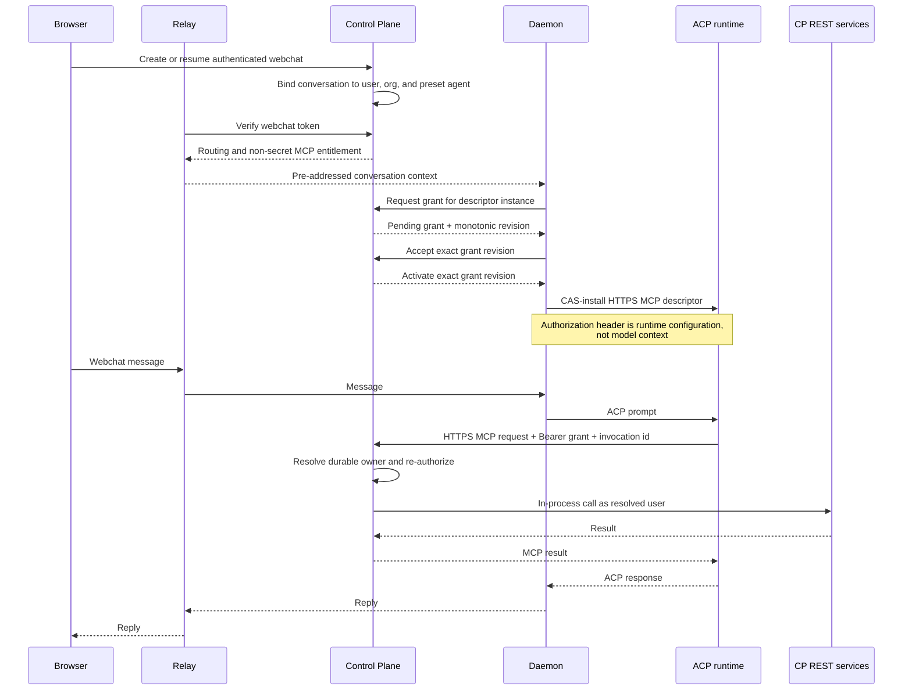

# Preset Webchat AgentConnect MCP

Status: proposed replacement design. This document is authoritative for the next
implementation of the feature; the existing daemon-local broker implementation is
superseded and must not be treated as the target architecture.

## 1. Summary

An authenticated user chatting with the built-in `agentconnect` preset may use the
curated AgentConnect administrative MCP catalog from that private webchat
conversation.

The runtime connects directly to the Control Plane's HTTPS MCP endpoint. The Control
Plane issues a short-lived opaque delegation credential bound to the durable webchat
conversation and injects it as an MCP transport credential through the daemon. The
credential is runtime configuration: it is never model context, a tool argument, a
user API key, or an organization-wide credential.

This design deliberately has no daemon-side administrative MCP broker, private Unix
socket, dedicated isolation cell, `bwrap`, process-ancestry authentication, or
Linux-only prerequisite. The daemon and the ACP runtimes it launches are one local
trust domain for this feature.

The Control Plane remains off the ordinary message hot path. Browser messages still
flow relay-to-daemon and agent execution remains daemon-local. Only an explicit
AgentConnect administrative tool call goes from the runtime to the Control Plane,
where the administrative APIs and their authorization already live.

## 2. Goals and non-goals

### 2.1 Goals

- Give only an entitled, private, user-owned webchat conversation on the built-in
  preset access to `agentconnect-admin`.
- Derive the acting user from the durable `WebchatConversation` owner binding, never
  from model-supplied arguments.
- Re-run membership, RBAC, resource visibility, catalog, and confirmation checks at
  execution time.
- Use a short-lived, revocable, least-privilege credential that is useful only at the
  AgentConnect MCP endpoint.
- Keep credentials out of model input, tool arguments, transcripts, telemetry, and
  ordinary logs.
- Make retries idempotent so an ambiguous write does not execute twice.
- Work on every platform on which the daemon and selected ACP runtime can configure
  an HTTPS MCP server with private transport headers.
- Preserve ordinary webchat and daemon-local tools if the Control Plane or delegated
  MCP is unavailable.

### 2.2 Non-goals

- Isolating mutually hostile processes running as the same OS user.
- Defending against root, a compromised daemon, a compromised ACP runtime, process
  memory inspection, or unrestricted same-UID debugging.
- Treating a system prompt as a credential store.
- Giving arbitrary agents, IM sessions, automations, hooks, cron sessions, or
  agent-to-agent sessions access to the administrative catalog.
- Moving browser message bodies, attachment bytes, or ACP `session/update` streams
  through the Control Plane.
- Replacing the existing curated MCP catalog or its REST authorization.

### 2.3 Local trust boundary

Without an OS identity boundary, a native process cannot prove to another native
process that it belongs to a particular conversation. A secret available to a
runtime is a bearer credential and may be copied by a sufficiently privileged local
peer. This design therefore makes the trust boundary explicit:

- the daemon, its local state, and the ACP runtimes it launches are trusted together;
- remote callers and model-produced tool arguments are untrusted;
- credentials are protected against accidental disclosure and remote theft, not
  against a hostile same-UID local process; and
- operators requiring hostile-workload isolation must provide it outside this
  feature, for example with separate OS users, containers, or VM boundaries.

The product and operational documentation must not describe the delegated MCP
credential as kernel-bound, non-exportable, or safe against a compromised local
runtime.

## 3. Security invariants

1. The CP derives `userId`, `orgId`, `agentId`, and `conversationId` from a stored
   grant and its durable `WebchatConversation`. Values supplied by the daemon,
   runtime, model, or MCP arguments never select the acting principal.
2. The grant is accepted only by the AgentConnect MCP endpoint and exposes only the
   delegated preset catalog. It is not valid for ordinary REST authentication.
3. Every access grant is bound to one immutable logical-authority tuple:
   `(conversationId, userId, orgId, agentId, authorityGeneration)`. Multiple
   short-lived access grants may belong to the same authority generation.
4. A grant has a short absolute expiry, can be revoked immediately, and is invalid
   after its logical authority generation changes.
5. The raw grant credential appears only transiently in the CP issuance reply,
   daemon memory, and runtime-private MCP transport configuration. It never crosses
   the relay and never appears in model context, tool schemas or arguments,
   transcript bodies, audit details, metrics, logs, or durable local state.
6. Every MCP request re-checks current membership, role, resource visibility, preset
   entitlement, agent placement where relevant, catalog scope, and confirmation
   policy.
7. Delegated calls cannot mutate their own host preset agent. `updateAgent` and
   `deleteAgent` fail before REST dispatch when their target is the grant's
   `agentId`.
8. One `(conversationId, invocationId)` is bound to one canonical request hash for
   the full conversation lifetime. Credential renewal and authority-generation
   rotation do not change this key. A transport retry may retrieve the same result
   but cannot execute different bytes or repeat a completed write.
9. The feature never falls back to a daemon API key, organization principal, user
   API key, system-prompt secret, or unscoped MCP credential.
10. Disabling or failing delegated MCP removes only `agentconnect-admin`; ordinary
    webchat and daemon-local MCP tools continue.

## 4. Architecture



The relay carries only a non-secret entitlement reference from webchat verification.
The raw grant travels over scoped request/reply frames on the authenticated
daemon↔CP control WebSocket. It is control metadata, not a chat body or ACP stream,
and the daemon requests it without forwarding browser message content.

## 5. Delegation grant

### 5.1 Stored record

The CP stores only a hash of a 256-bit random opaque credential:

```ts
interface WebchatMcpGrant {
  id: string
  tokenHash: string
  conversationId: string
  userId: string
  orgId: string
  agentId: string
  authorityGeneration: number
  descriptorInstanceId: string
  grantRevision: number
  state: 'pending' | 'active' | 'revoked' | 'expired'
  catalog: 'agentconnect-admin'
  issuedAt: Date
  expiresAt: Date
  revokedAt: Date | null
}
```

The raw value uses a recognizable prefix, for example `acmcp_`, followed by
cryptographically random material. It contains no embedded identity or authorization
claims. An opaque record is preferred over a self-contained JWT because authorization
is online, revocation must be immediate, and no identity data needs to leave the CP.

Token hashes use the same keyed, constant-time verification discipline as other
high-entropy API credentials. Database compromise alone must not yield a usable grant.

### 5.2 Issuance

The CP may issue a grant only when all of the following hold:

- `WEBCHAT_PRESET_MCP_ENABLED=true`;
- the request is for the built-in `agentconnect` preset;
- the authenticated user owns the durable webchat conversation;
- the conversation maps immutably to the same user, organization, and agent;
- the target session is private and reports the required session-visibility
  capability;
- the user may currently view and use the agent; and
- the selected runtime advertises support for private HTTPS MCP transport headers.

The raw credential is returned exactly once, in the issuance reply that begins its
delivery to the runtime. Because the CP retains only its hash, it never attempts to
reconstruct or re-deliver an existing credential.

Whenever a daemon restart, ACP session rebuild, or scheduled credential renewal
requires raw material, the daemon requests a fresh access grant under the current
logical authority generation. Access-grant renewal does not rotate that generation.

Each durable webchat `conversationId` maps to one ACP session and therefore exactly
one `agentconnect-admin` descriptor. That descriptor has one daemon-generated,
stable `descriptorInstanceId`, persisted as non-secret session metadata so it
survives a daemon restart. Concurrent browser tabs resume the same conversation,
ACP session, descriptor instance, and active grant; they do not create competing
runtime descriptors.

The CP allocates a strictly increasing `grantRevision` for that descriptor's entire
lifetime. It never resets when `authorityGeneration` changes. The daemon persists
the last staged and installed `(authorityGeneration, grantRevision)` fences as
non-secret session metadata and compares them lexicographically: an older authority
generation always loses, and revisions order deliveries within the same generation.
The CAS fence is global to the one runtime session target, so every delivery that
could mutate its descriptor is totally ordered. Delivery uses a two-phase protocol:

1. The daemon sends `webchat/mcp-grant/issue` with the conversation and descriptor
   instance. CP authenticates the daemon from the WebSocket, verifies current
   placement and entitlement, creates one `pending` grant, and replies with
   `webchat/mcp-grant/issued { grantId, authorityGeneration, descriptorInstanceId,
grantRevision, token, expiresAt }`. Creating a newer pending revision atomically
   revokes any older pending revision for that descriptor instance.
2. The daemon retains the raw token only in memory and CAS-stages the reply only
   when its full `(authorityGeneration, grantRevision)` fence is newer than both
   persisted staged and installed fences. A delayed older-generation or
   lower-revision reply is discarded and NACKed; it can never overwrite the
   descriptor.
3. The daemon sends `webchat/mcp-grant/accept` carrying the exact grant id,
   authority generation, descriptor instance, and revision. In one transaction,
   the CP verifies that this is still the newest pending revision for that instance,
   marks it `active`, and revokes the instance's prior active grant.
4. CP replies with `webchat/mcp-grant/activate` carrying the same exact tuple. Only
   that reply permits the daemon to CAS-install the descriptor into the runtime,
   again against the persisted full fence. A retry of any frame is idempotent; a
   mismatched, older-generation, or superseded tuple fails closed.

`pending` credentials are rejected by the MCP endpoint. The sole descriptor instance
has at most one active and one pending grant, so only one usable grant exists for the
conversation. Creating a newer pending revision revokes the older pending row;
activating it revokes the prior active row. Lost delivery leaves an unusable pending
row that expires after two minutes and leaves the prior active grant unchanged.
Logical conversation close, ownership change, incompatible placement change, or
security revocation increments the authority generation and atomically revokes all
access grants from the previous generation.

### 5.3 Lifetime

The initial access-grant lifetime is 30 minutes. It has no refresh token. Descriptor
replacement requests a newly issued access grant while preserving the logical
authority generation. A runtime that cannot replace a descriptor receives a bounded
authorization-expired tool error after expiry; reconnecting or rebuilding the ACP
session obtains a fresh grant.

Before implementation ships, runtime probes must establish whether each curated
runtime can update the descriptor safely. A longer lifetime is not an acceptable
substitute for a missing rotation mechanism without a separate design review.

The grant is revoked on:

- logical conversation close or expiry;
- logical authority-generation rotation;
- user sign-out when the product revokes the conversation;
- membership removal;
- agent detach, deletion, or incompatible placement change;
- operator disablement or explicit administrative revocation; and
- detection of credential misuse.

Live authorization still fails even if a revocation event is delayed.

## 6. Runtime delivery

The daemon adds a remote MCP server only to the entitled ACP session:

```json
{
  "name": "agentconnect-admin",
  "url": "https://control.example.com/api/v1/mcp",
  "headers": {
    "Authorization": "Bearer acmcp_REDACTED"
  }
}
```

Requirements:

- The descriptor is structured ACP/runtime configuration, not prompt text.
- The runtime must keep transport headers out of model input and tool arguments.
- The runtime MCP client must implement the invocation-id contract in section 8.
- The daemon must redact `headers` from diagnostics, errors, traces, and session
  dumps.
- `session/new` and `session/load` attach the descriptor only to the exact eligible
  webchat session.
- Agent-scoped shared ACP hosts are permitted only when the runtime guarantees that
  MCP descriptors and credentials are session-scoped. If it has agent-wide MCP
  configuration, that runtime is ineligible until it supports session scoping.
- The daemon must apply the exact revision-fenced activation protocol in section
  5.2 when an access grant renews or the logical authority generation rotates.
- The raw token is never persisted in `agent.json`, the transcript store, memory, or
  workspace files.

The daemon does not interpret MCP requests, mint per-request assertions, proxy MCP
bodies, or execute administrative tools.

## 7. MCP authentication and authorization

`POST /api/v1/mcp` accepts the delegated Bearer scheme in addition to its ordinary
external authentication schemes. Authentication order must avoid treating a
delegated token as a personal API key.

After constant-time token verification, the CP:

1. loads the grant and durable conversation;
2. verifies expiry, revocation, authority generation, owner tuple, preset, and
   feature gate;
3. resolves the acting principal exclusively from stored records;
4. validates the MCP tool against the delegated catalog;
5. applies current membership, RBAC, and resource-visibility rules;
6. hard-denies host-agent mutation;
7. looks up or creates the conversation-level idempotency row;
8. either claims an operation that needs no confirmation or records
   `awaiting_confirmation`; and
9. only after the appropriate state transition, calls the existing REST/service
   surface in process through `InternalInvocationAuth`.

Nested REST calls receive an already resolved internal principal. The raw grant is
not replayed as REST Bearer authentication and cannot authenticate an external REST
request.

Hidden resources preserve the normal no-existence-oracle behavior.

## 8. Invocation idempotency

The runtime MCP client, not the model or daemon, creates a UUIDv4 `invocationId`
when it begins one logical `tools/call`. It sends that value in the
`Idempotency-Key` HTTP header. The header is transport metadata and is not exposed
as a tool argument.

The client must retain the invocation id, canonical request bytes, and terminal
state until it receives a terminal MCP response or the retry window expires.
Automatic HTTP retries, credential replacement, reconnect, and `session/load` reuse
the same id and exact request. The MCP JSON-RPC request id is unrelated and must not
be used as the idempotency key.

If credential replacement requires a runtime process restart, the runtime adapter
must persist only the non-secret outstanding invocation records in its session
state and restore them before retrying. A runtime that cannot satisfy and probe this
contract is ineligible for `webchat_remote_mcp_v1`. This guarantee covers transport
retry of an already-created invocation; it cannot deduplicate a model independently
deciding later to create a new logical tool call.

The CP canonicalizes the exact tool name and arguments and stores:

```ts
interface WebchatMcpInvocation {
  conversationId: string
  invocationId: string
  createdAuthorityGeneration: number
  sourceGrantId: string
  requestHash: string
  status: 'claimed' | 'awaiting_confirmation' | 'executing' | 'completed' | 'failed' | 'ambiguous' | 'stale'
  boundedResponse: Uint8Array | null
  createdAt: Date
  expiresAt: Date
}
```

The unique key is `(conversationId, invocationId)`, not an access-grant id or
authority generation:

- the first request creates the row; a no-confirmation operation claims execution,
  while a confirmation-gated operation stops at `awaiting_confirmation`;
- every request first looks up this key across all authority generations;
- the same hash observes in-progress state or receives the cached final response;
- a different hash is rejected;
- a completed, failed, or ambiguous invocation from an older authority generation
  returns its recorded outcome and can never dispatch again;
- a nonterminal invocation from an older authority generation atomically becomes
  `stale` and can never dispatch, including an old pending confirmation;
- an ambiguous write is never executed automatically a second time; and
- records and cached responses have bounded size and are retained through the full
  conversation retry and confirmation window, plus a 24-hour safety margin.

This ledger replaces the former mint/claim assertion exchange. The runtime already
calls the final authentication and execution endpoint directly, so a second
per-request credential adds no security boundary.

## 9. Tool catalog and confirmation

The delegated catalog reuses the existing curated AgentConnect MCP catalog. Existing
exclusions for credential, membership, organization, access-control, bot, and hook
writes remain.

Authorization is evaluated per request. A grant never snapshots a role into lasting
authority.

High-impact writes use one execution path. They require a user confirmation bound
to:

```text
conversationId + createdAuthorityGeneration + invocationId + requestHash + userId + sourceGrantId + expiresAt
```

The initial MCP request performs live authorization, creates the unique invocation
row as `awaiting_confirmation`, and returns a pending result. It never dispatches
the operation. MCP retries only observe that row; they cannot approve, claim, or
execute it.

The model cannot satisfy confirmation by returning `yes`. The authenticated browser
presents the exact operation to the conversation owner. Approval is the sole
execution claimant:

1. It locks the invocation row and the conversation authority fence in a serializable
   transaction.
2. It verifies the row is still `awaiting_confirmation`, the request hash and bound
   fields are unchanged, the source grant is active and unexpired, and its authority
   generation is still current.
3. It re-runs current owner binding, membership, role, resource visibility, preset
   entitlement, placement, catalog scope, host-agent denial, and feature-gate checks.
4. It CAS-transitions the row to `executing`. Revocation and generation rotation
   serialize on the same authority fence, so only one ordering can win.
5. The elected approval worker dispatches exactly once. Success or ordinary failure
   records a terminal response; a crash or uncertain outcome after `executing`
   becomes `ambiguous`, never retryable execution.

Concurrent approvals and MCP retries only observe `executing` or its terminal
result. Denial, confirmation expiry, failed live authorization, revoked grant, or
generation mismatch transitions the row to a terminal non-executing state. Approval
never revives a stale invocation.

The first implementation may keep the existing catalog's stricter exclusions while
browser confirmation is completed. It must not silently weaken confirmation to make
remote MCP easier to ship.

## 10. Session lifecycle

### 10.1 New conversation

1. Browser authenticates and requests a webchat token.
2. CP creates `WebchatConversation` and its private owner binding.
3. CP creates authority generation 1 and returns a non-secret entitlement to relay.
4. Relay forwards routing and entitlement metadata.
5. Daemon starts or reuses the normal agent ACP host.
6. Daemon completes the revision-fenced grant activation protocol and creates the
   ACP session with the session-scoped remote MCP descriptor.
7. Only then may the first model prompt run.

If descriptor attachment fails, the prompt may continue without
`agentconnect-admin`, but the user-facing session must surface that administration
tools are unavailable.

### 10.2 Resume

Resume succeeds only for the same authenticated owner, organization, agent, and
conversation. The CP keeps the current logical authority generation, while the
daemon completes a fresh revision-fenced grant activation because stored hashes
cannot be re-delivered when the daemon no longer retains the active credential.
An ordinary browser reconnect does not itself rotate the credential: all tabs share
the conversation's one ACP session and descriptor. The daemon must activate and
attach a fresh descriptor before `session/load` or the next prompt only after
restart, descriptor loss, or scheduled renewal requires new raw material.

### 10.3 Close and revoke

Logical close revokes the current grant. Browser socket loss alone is not necessarily
a logical close because an in-flight turn may survive a transient reconnect.

Operator disablement stops issuance and revokes active grants in a bounded background
operation. An emergency endpoint must support exact grant, conversation, user, agent,
organization, and global feature revocation without requiring daemon isolation.

## 11. Failure behavior

| Failure                                                  | Behavior                                                                          |
| -------------------------------------------------------- | --------------------------------------------------------------------------------- |
| Non-preset or non-webchat session                        | No `agentconnect-admin` descriptor.                                               |
| Runtime lacks private, session-scoped remote MCP headers | Runtime is ineligible; ordinary chat continues.                                   |
| Grant missing, forged, expired, revoked, or stale        | MCP returns authorization expired/invalid; no fallback identity.                  |
| CP unavailable                                           | Admin tool returns a retryable error; ordinary chat and local tools continue.     |
| User removed or visibility changed                       | Next request fails under live authorization.                                      |
| Agent moved or authority generation changed              | Old grants fail; reconnect or session update installs the new descriptor.         |
| Duplicate invocation                                     | Same request returns status/cached result; different request is rejected.         |
| Ambiguous write                                          | Report ambiguous; do not retry execution automatically.                           |
| Feature disabled                                         | Stop issuance, revoke active grants, and omit/remove descriptors.                 |
| Credential appears in a log or transcript                | Treat as a security incident and revoke the access grant or authority generation. |

Errors shown to the user describe the action needed, for example:

> AgentConnect administration is unavailable for this conversation. Reconnect and
> retry.

They do not mention CP, bearer tokens, ACP, or internal component names.

## 12. Privacy and data handling

The CP receives only explicit administrative MCP requests and their bounded results.
Browser messages, attachment bytes, ordinary model output, and ACP update streams
remain outside the CP.

The raw grant must be redacted at source. Deny-list filtering after logging is
insufficient. In particular:

- reverse proxies and HTTP access logs omit `Authorization`;
- daemon and runtime diagnostics omit MCP headers;
- relay logs omit entitlement-bearing verification fields;
- OpenTelemetry attributes use grant outcome/reason, never raw identifiers or tokens;
- errors do not serialize request headers or descriptors;
- database rows contain only token hashes; and
- model context, tool arguments, transcripts, memory, and audit details never contain
  the credential.

The remote model provider must receive tool definitions and tool results as required
for MCP use, but never the MCP transport header.

## 13. Capability and rollout

Rename the wire capability from the implementation-specific
`delegated_mcp_assertion_v1` to `webchat_remote_mcp_v1`. The new capability attests
that the daemon can attach a private, session-scoped HTTPS MCP descriptor to the
selected runtime. It does not attest to an OS sandbox or hostile-process isolation.

The CP feature gate remains default-off. Enablement requires:

1. deployed CP support for grants, authentication, revocation, idempotency, and
   redaction;
2. relay support for non-secret entitlement delivery and protocol support for
   confidential CP↔daemon grant delivery;
3. daemon support for exact-session, revision-fenced descriptor activation and
   removal;
4. a passing runtime probe proving remote HTTPS MCP headers are session-scoped and
   absent from model context and diagnostics, and that `Idempotency-Key` is created
   and preserved across every supported automatic retry and descriptor-renewal
   path;
5. private session visibility enforcement; and
6. a tested revoke path.

Roll out by runtime and daemon canary. Do not infer support merely from operating
system, executable presence, or generic MCP support.

During migration, CP must not issue both the old broker assertion flow and the new
remote grant for one conversation. Existing feature code may remain behind its old
capability while the replacement is implemented, but production enablement selects
exactly one protocol generation.

## 14. Observability

Use closed, low-cardinality labels:

| Metric                                              | Labels              |
| --------------------------------------------------- | ------------------- |
| `agentconnect.webchat_mcp.grant.transitions`        | `event=issued       | rotated   | revoked                      | expired                                   | failed`, bounded `reason`    |
| `agentconnect.webchat_mcp.request.duration`         | `stage=authenticate | authorize | execute`, `outcome=succeeded | failed                                    | ambiguous`                   |
| `agentconnect.webchat_mcp.invocation.transitions`   | `event=claimed      | replayed  | completed                    | failed                                    | ambiguous`, bounded `reason` |
| `agentconnect.webchat_mcp.confirmation.transitions` | `event=requested    | approved  | denied                       | expired                                   | failed`                      |
| `agentconnect.webchat_mcp.descriptor.transitions`   | `event=attached     | rotated   | removed                      | failed`, `runtime` from a bounded catalog |

Metrics and logs exclude user, organization, agent, conversation, grant, invocation,
token, Authorization header, request body, tool arguments, response body, and
transcript values unless an existing privacy-reviewed audit record explicitly
requires a non-secret identifier.

## 15. Implementation consequences

The replacement removes:

- `SessionMcpBroker` delegated-admin responsibilities;
- delegated cell socket and local bridge-token protocols;
- `DelegatedWebchatHostManager` isolation-only host ownership;
- delegated MCP `bwrap` and peer-auth capability probes;
- daemon↔CP assertion mint frames and claim authentication;
- private broker/runtime-home mount roots; and
- isolation-specific metrics and denial reasons.

The implementation adds:

- opaque grant persistence and revocation;
- non-secret entitlement delivery in webchat verification/routing;
- confidential two-phase CP↔daemon grant delivery;
- exact-session, revision-fenced remote MCP descriptor lifecycle;
- delegated Bearer authentication at `/api/v1/mcp`;
- conversation-scoped invocation idempotency across authority generations;
- runtime capability probes for private headers and session scoping; and
- credential redaction tests across CP, relay, daemon, and runtime adapters.

Protocol and implementation work must follow this document in separate changes. The
existing broker code is not silently repurposed as the new design.
