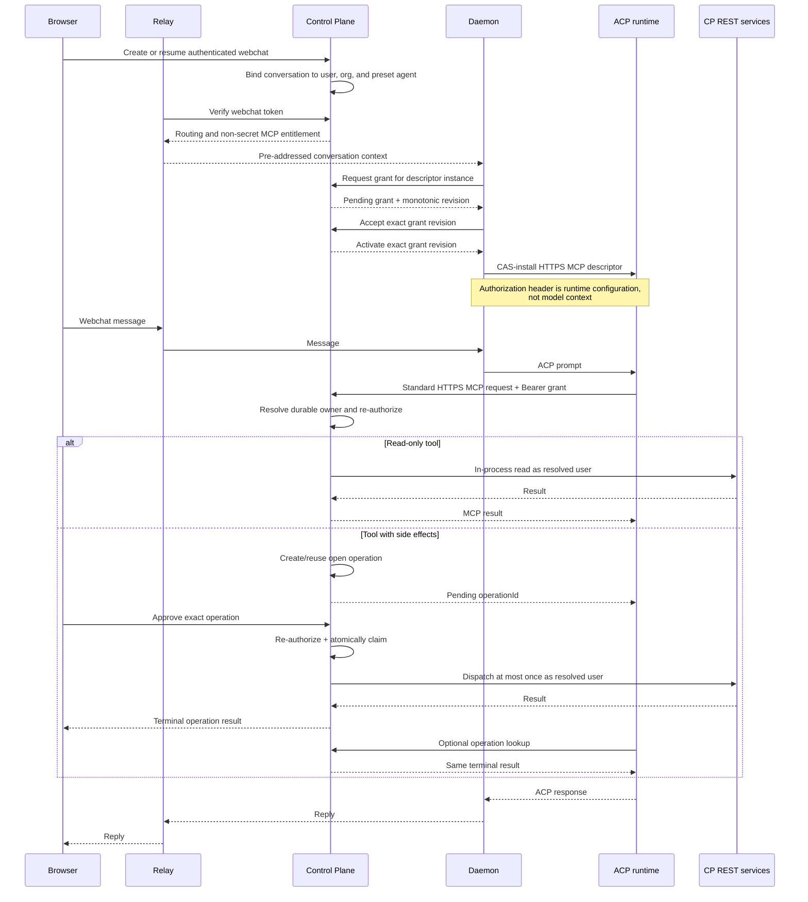

# Preset Webchat AgentConnect MCP

Status: proposed replacement design. This document is authoritative for the next
implementation of the feature; the existing daemon-local broker implementation is
superseded and must not be treated as the target architecture.

## 1. Summary

An authenticated user chatting with the built-in `agentconnect` preset may use the
curated AgentConnect administrative MCP catalog from that private webchat
conversation.

The runtime connects directly to the Control Plane's HTTPS MCP endpoint. The Control
Plane issues a short-lived opaque delegation credential bound to the durable webchat
conversation and injects it as an MCP transport credential through the daemon. The
credential is runtime configuration: it is never model context, a tool argument, a
user API key, or an organization-wide credential.

This design deliberately has no daemon-side administrative MCP broker, private Unix
socket, dedicated isolation cell, `bwrap`, process-ancestry authentication, or
Linux-only prerequisite. The daemon and the ACP runtimes it launches are one local
trust domain for this feature.

The Control Plane remains off the ordinary message hot path. Browser messages still
flow relay-to-daemon and agent execution remains daemon-local. Only an explicit
AgentConnect administrative tool call goes from the runtime to the Control Plane,
where the administrative APIs and their authorization already live.

## 2. Goals and non-goals

### 2.1 Goals

- Give only an entitled, private, user-owned webchat conversation on the built-in
  preset access to `agentconnect-admin`.
- Derive the acting user from the durable `WebchatConversation` owner binding, never
  from model-supplied arguments.
- Re-run membership, RBAC, resource visibility, catalog, and confirmation checks at
  execution time.
- Use a short-lived, revocable, least-privilege credential that is useful only at the
  AgentConnect MCP endpoint.
- Keep credentials out of model input, tool arguments, transcripts, telemetry, and
  ordinary logs.
- Dispatch each approved write at most once at the CP operation boundary,
  independently of runtime retry behavior, and surface an uncertain outcome as an
  explicit ambiguous terminal state instead of retrying.
- Work on every platform on which the daemon and selected ACP runtime support the
  standard ACP HTTPS MCP descriptor and headers.
- Preserve ordinary webchat and daemon-local tools if the Control Plane or delegated
  MCP is unavailable.

### 2.2 Non-goals

- Isolating mutually hostile processes running as the same OS user.
- Defending against root, a compromised daemon, a compromised ACP runtime, process
  memory inspection, or unrestricted same-UID debugging.
- Treating a system prompt as a credential store.
- Giving arbitrary agents, IM sessions, automations, hooks, cron sessions, or
  agent-to-agent sessions access to the administrative catalog.
- Moving browser message bodies, attachment bytes, or ACP `session/update` streams
  through the Control Plane.
- Replacing the existing curated MCP catalog or its REST authorization.

### 2.3 Local trust boundary

Without an OS identity boundary, a native process cannot prove to another native
process that it belongs to a particular conversation. A secret available to a
runtime is a bearer credential and may be copied by a sufficiently privileged local
peer. This design therefore makes the trust boundary explicit:

- the daemon, its local state, and the ACP runtimes it launches are trusted together;
- remote callers and model-produced tool arguments are untrusted;
- credentials are protected against accidental disclosure and remote theft, not
  against a hostile same-UID local process; and
- operators requiring hostile-workload isolation must provide it outside this
  feature, for example with separate OS users, containers, or VM boundaries.

The product and operational documentation must not describe the delegated MCP
credential as kernel-bound, non-exportable, or safe against a compromised local
runtime.

## 3. Security invariants

1. The CP derives `userId`, `orgId`, `agentId`, and `conversationId` from a stored
   grant and its durable `WebchatConversation`. Values supplied by the daemon,
   runtime, model, or MCP arguments never select the acting principal.
2. The grant is accepted only by the AgentConnect MCP endpoint and exposes only the
   delegated preset catalog. It is not valid for ordinary REST authentication.
3. Every access grant is bound to one immutable logical-authority tuple:
   `(conversationId, userId, orgId, agentId, authorityGeneration)`. Multiple
   short-lived access grants may belong to the same authority generation.
4. A grant has a short absolute expiry, can be revoked immediately, and is invalid
   after its logical authority generation changes.
5. The raw grant credential appears only transiently in the CP issuance reply,
   daemon memory, and runtime-private MCP transport configuration. It never crosses
   the relay and never appears in model context, tool schemas or arguments,
   transcript bodies, audit details, metrics, logs, or durable local state.
6. Every MCP request re-checks current membership, role, resource visibility, preset
   entitlement, agent placement where relevant, catalog scope, and confirmation
   policy.
7. Delegated calls cannot mutate their own host preset agent. `updateAgent` and
   `deleteAgent` fail before REST dispatch when their target is the grant's
   `agentId`.
8. A delegated MCP request never directly executes a write. The CP first creates or
   reuses an open operation bound to the conversation, authority generation, acting
   user, canonical intent hash, and confirmation policy. Only browser approval may
   atomically claim that operation for one execution.
9. Every side-effecting MCP request has a transport receipt scoped to its access
   grant and standard JSON-RPC request id and bound to the exact request hash.
   While retained, the receipt resolves to one operation, including after that
   operation becomes terminal.
10. The feature never falls back to a daemon API key, organization principal, user
    API key, system-prompt secret, or unscoped MCP credential.
11. Disabling or failing delegated MCP removes only `agentconnect-admin`; ordinary
    webchat and daemon-local MCP tools continue.

## 4. Architecture



The relay carries only a non-secret entitlement reference from webchat verification.
The raw grant travels over scoped request/reply frames on the authenticated
daemon↔CP control WebSocket. It is control metadata, not a chat body or ACP stream,
and the daemon requests it without forwarding browser message content.

## 5. Delegation grant

### 5.1 Stored record

The CP stores only a hash of a 256-bit random opaque credential:

```ts
interface WebchatMcpGrant {
  id: string
  tokenHash: string
  conversationId: string
  userId: string
  orgId: string
  agentId: string
  authorityGeneration: number
  descriptorInstanceId: string
  grantRevision: number
  state: 'pending' | 'active' | 'revoked' | 'expired'
  catalog: 'agentconnect-admin'
  issuedAt: Date
  expiresAt: Date
  revokedAt: Date | null
}
```

The raw value uses a recognizable prefix, for example `acmcp_`, followed by
cryptographically random material. It contains no embedded identity or authorization
claims. An opaque record is preferred over a self-contained JWT because authorization
is online, revocation must be immediate, and no identity data needs to leave the CP.

Token hashes use the same keyed, constant-time verification discipline as other
high-entropy API credentials. Database compromise alone must not yield a usable grant.

### 5.2 Issuance

The CP may issue a grant only when all of the following hold:

- the request is for the built-in `agentconnect` preset;
- the authenticated user owns the durable webchat conversation;
- the conversation maps immutably to the same user, organization, and agent;
- the target session is private and reports the required session-visibility
  capability;
- the user may currently view and use the agent; and
- the selected agent is still the organization's built-in `agentconnect` preset.

The raw credential is returned exactly once, in the issuance reply that begins its
delivery to the runtime. Because the CP retains only its hash, it never attempts to
reconstruct or re-deliver an existing credential.

Whenever a daemon restart, ACP session rebuild, or scheduled credential renewal
requires raw material, the daemon requests a fresh access grant under the current
logical authority generation. Access-grant renewal does not rotate that generation.
The daemon never reinstalls previously delivered raw material into a rebuilt ACP
session: every descriptor installation or reinstallation uses a freshly issued
grant, so one grant identifies at most one installation into one runtime process.

Each durable webchat `conversationId` maps to one ACP session and therefore exactly
one `agentconnect-admin` descriptor. That descriptor has one daemon-generated,
stable `descriptorInstanceId`, persisted as non-secret session metadata so it
survives a daemon restart. Concurrent browser tabs resume the same conversation,
ACP session, descriptor instance, and active grant; they do not create competing
runtime descriptors.

The CP allocates a strictly increasing `grantRevision` for that descriptor's entire
lifetime. It never resets when `authorityGeneration` changes. The daemon persists
the last staged and installed `(authorityGeneration, grantRevision)` fences as
non-secret session metadata and compares them lexicographically: an older authority
generation always loses, and revisions order deliveries within the same generation.
The CAS fence is global to the one runtime session target, so every delivery that
could mutate its descriptor is totally ordered. Delivery uses a two-phase protocol:

1. The daemon sends `webchat/mcp-grant/issue` with the conversation and descriptor
   instance. CP authenticates the daemon from the WebSocket, verifies current
   placement and entitlement, creates one `pending` grant, and replies with
   `webchat/mcp-grant/issued { grantId, authorityGeneration, descriptorInstanceId,
grantRevision, token, expiresAt }`. Creating a newer pending revision atomically
   revokes any older pending revision for that descriptor instance.
2. The daemon retains the raw token only in memory and CAS-stages the reply only
   when its full `(authorityGeneration, grantRevision)` fence is newer than both
   persisted staged and installed fences. A delayed older-generation or
   lower-revision reply is discarded and NACKed; it can never overwrite the
   descriptor.
3. The daemon sends `webchat/mcp-grant/accept` carrying the exact grant id,
   authority generation, descriptor instance, and revision. In one transaction,
   the CP verifies that this is still the newest pending revision for that instance,
   marks it `active`, and revokes the instance's prior active grant.
4. CP replies with `webchat/mcp-grant/activate` carrying the same exact tuple. Only
   that reply permits the daemon to CAS-install the descriptor into the runtime,
   again against the persisted full fence. A retry of any frame is idempotent; a
   mismatched, older-generation, or superseded tuple fails closed.

`pending` credentials are rejected by the MCP endpoint. The sole descriptor instance
has at most one active and one pending grant, so only one usable grant exists for the
conversation. Creating a newer pending revision revokes the older pending row;
activating it revokes the prior active row. Lost delivery leaves an unusable pending
row that expires after two minutes and leaves the prior active grant unchanged.
Logical conversation close, ownership change, incompatible placement change, or
security revocation increments the authority generation and atomically revokes all
access grants from the previous generation.

### 5.3 Lifetime

The initial access-grant lifetime is 30 minutes. It has no refresh token. Descriptor
replacement requests a newly issued access grant while preserving the logical
authority generation. A runtime that cannot replace a descriptor receives a bounded
authorization-expired tool error after expiry; reconnecting or rebuilding the ACP
session obtains a fresh grant.

Before implementation ships, integration tests must establish whether each curated
runtime can install and replace the standard descriptor safely. No AgentConnect-
specific ACP capability or runtime-generated request header is required.

The grant is revoked on:

- logical conversation close or expiry;
- logical authority-generation rotation;
- user sign-out when the product revokes the conversation;
- membership removal;
- agent detach, deletion, or incompatible placement change;
- operator disablement or explicit administrative revocation; and
- detection of credential misuse.

Live authorization still fails even if a revocation event is delayed.

## 6. Runtime delivery

The daemon adds a remote MCP server only to the entitled ACP session:

```json
{
  "name": "agentconnect-admin",
  "url": "https://control.example.com/v1/mcp",
  "headers": {
    "Authorization": "Bearer acmcp_REDACTED"
  }
}
```

Requirements:

- The descriptor is structured ACP/runtime configuration, not prompt text.
- `url` is the CP's **canonical public MCP resource URL** — the same one the endpoint
  advertises as RFC 9728 `resource` (a dedicated MCP origin where one is deployed,
  else `<public base>/v1/mcp`). The adapter dials it directly, with no discovery step
  and no fallback, so an internal-only mount path is a silent total failure of the
  administration surface.
- The runtime must handle transport headers as standard MCP configuration rather
  than model input or tool arguments. AgentConnect does not add a private ACP
  extension to attest this behavior.
- The daemon must redact `headers` from diagnostics, errors, traces, and session
  dumps.
- `session/new` and `session/load` attach the descriptor only to the exact entitled
  webchat session.
- Runtimes are expected to keep MCP descriptors and credentials session-scoped. A
  runtime that applies them agent-wide is incompatible and must be fixed, but the
  daemon does not claim it can prove that property from identity, version, or probes.
- The daemon must apply the exact revision-fenced activation protocol in section
  5.2 when an access grant renews or the logical authority generation rotates.
- The raw token is never persisted in `agent.json`, the transcript store, memory, or
  workspace files.

The daemon does not interpret MCP requests, mint per-request assertions, proxy MCP
bodies, or execute administrative tools.

## 7. MCP authentication and authorization

`POST /api/v1/mcp` accepts the delegated Bearer scheme in addition to its ordinary
external authentication schemes. Authentication order must avoid treating a
delegated token as a personal API key.

After constant-time token verification, the CP:

1. loads the grant and durable conversation;
2. verifies expiry, revocation, authority generation, owner tuple, preset, and
   feature gate;
3. resolves the acting principal exclusively from stored records;
4. validates the MCP tool against the delegated catalog;
5. takes the read-only/side-effect classification from server-owned catalog
   metadata, never from tool arguments;
6. applies current membership, RBAC, and resource-visibility rules;
7. hard-denies host-agent mutation;
8. executes an authorized read immediately, or creates/reuses an open CP-owned
   operation for every tool with side effects;
9. returns the operation without executing it; and
10. only after authenticated browser approval atomically claims that operation,
    re-authorizes it, and calls the existing REST/service surface in process through
    `InternalInvocationAuth`.

Steps 4-10 govern `tools/list` and `tools/call`. The mandatory MCP transport
handshake — `initialize`, `notifications/initialized`, and `ping` — is admitted after
steps 1-3 and answered inside the MCP handler: it carries no tool, no organization
binding, and no nested REST call. Admitting it is load-bearing, not a relaxation: a
client cannot issue any tool request before initializing, so denying the handshake
denies the whole server, and the session loses `agentconnect-admin` entirely. Every
other JSON-RPC method stays denied.

The private-current-session predicate (§5.2) is re-checked at request time for
`tools/call` only. The descriptor is installed during `session/new`, and the daemon
registers the resulting session with the CP only after that call returns — so the
adapter's `initialize` and immediate `tools/list` always precede the
current-session pointer and would deterministically lose that race (adapters do
not retry a failed connect; the session would show no administration tools until
the next descriptor rotation). Both are safe without the predicate: the handshake
reaches no tool and `tools/list` serves the static curated catalog with no
org-scoped data. `tools/call` — the step that actually wields the delegated
authority — is issued mid-turn, after registration, and is denied whenever the
conversation's current session is not private.

Nested REST calls receive an already resolved internal principal. The raw grant is
not replayed as REST Bearer authentication and cannot authenticate an external REST
request.

Hidden resources preserve the normal no-existence-oracle behavior.

## 8. CP-owned operation idempotency

AgentConnect does not require `Idempotency-Key`, a private ACP capability, or any
other runtime-specific retry contract. Read-only tools are ordinary idempotent MCP
requests. A tool with side effects never executes in its initiating MCP request.

A standard JSON-RPC id is unique only among one client's outstanding requests. It
is not a durable logical-operation identity: runtimes reset id counters across
restarts, reconnects, and `session/load`, and may legally reuse an id once its
earlier request completes. The CP therefore never keys a receipt on a bare
conversation-lifetime JSON-RPC id. Every transport receipt is scoped to the access
grant that authenticated the request. Because section 5.2 requires every descriptor
installation into a rebuilt ACP session to use a freshly issued grant, a restarted
runtime that restarts its id sequence lands in a new receipt scope and cannot
collide with receipts from a previous process.

The CP canonicalizes the standard MCP JSON-RPC request id, tool name, and validated
arguments. In one transaction, the first delivery creates a durable transport
receipt keyed by `(grantId, jsonRpcRequestId)`, bound to the exact request hash,
and selects or creates its operation. String and numeric JSON-RPC ids have distinct
canonical encodings; null, fractional/unsafe numeric, oversized string, and absent
ids are rejected for side-effecting delegated calls. Receipt resolution is:

- the same key with the same request hash replays the bound operation in every
  operation state. Standard HTTP retry resends the same JSON-RPC body, so a retry
  observes the same operation even if the original pending response was lost and
  the operation has since become terminal;
- the same key with a different request hash while the bound operation is
  nonterminal fails closed, so a mutated in-flight duplicate can never reach a
  second confirmation; and
- the same key with a different request hash after the bound operation is terminal
  is legitimate JSON-RPC id reuse within one grant: the receipt is superseded and a
  new operation is created. A later retry of the superseded request no longer
  matches any receipt and is rejected; its terminal operation stays observable by
  `operationId`.

The JSON-RPC id is only a transport-replay coordinate; it never authorizes or
claims execution. A later deliberate tool call receives a new JSON-RPC id and may
create a new operation even when its arguments are identical. Receipts are retained
while their grant can authenticate plus a bounded window that covers in-flight
retries; they are not conversation-lifetime tombstones. Correctness never depends
on receipt retention: no operation executes without browser approval, and a unique
partial index on `(conversationId, intentHash)` for `awaiting_confirmation` rows
coalesces concurrent duplicate open intents — including a higher-level retry that
minted a fresh id or arrived under a renewed grant — into one browser confirmation.
A retry that straddles grant rotation either resends the old credential and fails
authentication without side effects, or arrives as a new request under the new
grant and at worst asks the owner to confirm again. Once an operation is terminal,
a genuinely new JSON-RPC request may create a new operation.

The pending MCP result includes a random, non-secret `operationId`. Tool schemas may
accept that id only as a status/replay selector: supplying it can observe the bound
operation but cannot approve or execute it. The browser receives the operation over
its authenticated control surface and is the only approval principal.

The CP stores:

```ts
interface WebchatMcpOperation {
  conversationId: string
  operationId: string
  createdAuthorityGeneration: number
  sourceGrantId: string
  toolName: string
  canonicalArguments: JsonValue
  intentHash: string
  status: 'awaiting_confirmation' | 'executing' | 'completed' | 'failed' | 'ambiguous' | 'stale'
  executionAttemptId: string | null
  claimedAt: Date | null
  recoveryDeadline: Date | null
  boundedResponse: Uint8Array | null
  createdAt: Date
  confirmationExpiresAt: Date
  completedAt: Date | null
}

interface WebchatMcpTransportReceipt {
  grantId: string
  conversationId: string
  jsonRpcRequestId: string
  requestHash: string
  operationId: string
  createdAt: Date
  supersededAt: Date | null
}
```

`canonicalArguments` is the bounded, schema-validated representation used both for
the confirmation display and eventual dispatch. The CP recomputes `intentHash`
from `toolName + canonicalArguments` before approval and execution; a mismatch is a
terminal integrity failure. Catalog limits reject an operation whose canonical
payload is too large. The payload may contain ordinary administrative input but
never credentials because credential-bearing tools are excluded from this catalog.

The execution rules are:

- the initiating request always stops at `awaiting_confirmation`;
- a duplicate transport receipt returns the same `operationId` in every operation
  state;
- a concurrent duplicate open intent with a different JSON-RPC id shares the same
  pending operation;
- an explicit lookup by `operationId` returns pending, executing, or the bounded
  terminal result and rejects any mismatched conversation or intent;
- a completed, failed, or ambiguous operation can never dispatch again;
- a nonterminal operation from an older authority generation atomically becomes
  `stale` and can never dispatch, including an old pending confirmation;
- an approval CAS writes a fresh `executionAttemptId`, `claimedAt`, and bounded
  `recoveryDeadline` together with `status='executing'` before dispatch;
- no worker or recovery path may claim an `executing` operation again;
- after `recoveryDeadline`, a reaper may CAS only
  `(operationId, status='executing', executionAttemptId)` to `ambiguous`;
- a worker may record success or failure only with the same CAS tuple. Whichever
  terminal transition commits first wins, so a late completion cannot overwrite
  `ambiguous`, and the reaper cannot overwrite an already recorded result;
- because the `executing` claim commits before dispatch, the contract is
  fail-closed at-most-once dispatch per operation: process loss between the claim
  and dispatch produces zero external effects, and process loss after the business
  mutation but before the terminal record produces exactly one. Both surface as
  `ambiguous`, are reported to the owner for manual verification, and are never
  automatically dispatched a second time; and
- operation identity and terminal status are retained for the conversation
  lifetime; bounded response bytes may be evicted separately.

When a tool's entire side effect is a mutation inside the CP database, the
implementation must commit that mutation and the operation's terminal transition in
one transaction, which removes the ambiguous window for that tool. Tools whose
effects reach beyond one CP transaction keep the window above: for them this design
guarantees fail-closed at-most-once dispatch with explicit `ambiguous` outcomes,
not exactly-once effects, and no document may claim otherwise.

This ledger replaces the former mint/claim assertion exchange. The runtime already
calls the final authentication and execution endpoint directly, so a second
per-request credential adds no security boundary.

## 9. Tool catalog and confirmation

The delegated catalog reuses the existing curated AgentConnect MCP catalog. Existing
exclusions for credential, membership, organization, access-control, bot, and hook
writes remain.

Every catalog entry has a server-owned effect classification. Reads may execute in
the initiating request. Any entry classified as having side effects must enter the
operation path; adding a write-like tool without that classification fails catalog
validation and cannot ship as an immediately executable delegated tool.

Authorization is evaluated per request. A grant never snapshots a role into lasting
authority.

Every tool with side effects uses one execution path. It requires a user
confirmation bound to:

```text
conversationId + createdAuthorityGeneration + operationId + intentHash + userId + sourceGrantId + confirmationExpiresAt
```

The initial MCP request performs live authorization, creates or reuses the open
operation as `awaiting_confirmation`, and returns its `operationId`. It never
dispatches the operation. MCP retries and operation lookups can only observe that
row; they cannot approve, claim, or execute it.

The model cannot satisfy confirmation by returning `yes`. The authenticated browser
presents the exact operation to the conversation owner. Approval is the sole
execution claimant:

1. It locks the operation row and the conversation authority fence in a serializable
   transaction.
2. It verifies the row is still `awaiting_confirmation`, the intent hash and bound
   fields are unchanged, the source grant is active and unexpired, and its authority
   generation is still current.
3. It re-runs current owner binding, membership, role, resource visibility, preset
   entitlement, placement, catalog scope, host-agent denial, and feature-gate checks.
4. It CAS-transitions the row to `executing`. Revocation and generation rotation
   serialize on the same authority fence, so only one ordering can win.
5. That same CAS writes the unique execution attempt and recovery deadline. The
   elected approval worker dispatches the persisted canonical payload at most once,
   under the at-most-once and ambiguous-outcome contract in section 8.
6. Success or ordinary failure records a terminal response only when the operation
   is still `executing` under that exact attempt. A reaper applies the same attempt-
   fenced CAS to mark an overdue execution `ambiguous`; it never retries dispatch.

Concurrent approvals and MCP lookups only observe `executing` or its terminal
result. Denial, confirmation expiry, failed live authorization, revoked grant, or
generation mismatch transitions the row to a terminal non-executing state. Approval
never revives a stale operation.

The first implementation may keep the existing catalog's stricter exclusions while
browser confirmation is completed. It must not silently weaken confirmation to make
remote MCP easier to ship.

## 10. Session lifecycle

### 10.1 New conversation

1. Browser authenticates and requests a webchat token.
2. CP creates `WebchatConversation` and its private owner binding.
3. CP creates authority generation 1 and returns a non-secret entitlement to relay.
4. Relay forwards routing and entitlement metadata.
5. Daemon starts or reuses the normal agent ACP host.
6. Daemon completes the revision-fenced grant activation protocol and creates the
   ACP session with the session-scoped remote MCP descriptor.
7. Only then may the first model prompt run.

If descriptor attachment fails, the prompt may continue without
`agentconnect-admin`, but the user-facing session must surface that administration
tools are unavailable.

### 10.2 Resume

Resume succeeds for the conversation owner, and for any other non-viewer
member the `session.continue` policy admits to every session the conversation
currently stands on (org-visible sessions; private ones stay owner-only). The
delegated admin MCP is owner-only regardless: the authority resolver fences the
token's user against the conversation owner, so a non-owner's turns run without
the `agentconnect-admin` entitlement. The CP keeps the current logical authority
generation for the owner, while the
daemon completes a fresh revision-fenced grant activation because stored hashes
cannot be re-delivered when the daemon no longer retains the active credential.
An ordinary browser reconnect does not itself rotate the credential: all tabs share
the conversation's one ACP session and descriptor. The daemon must activate and
attach a fresh descriptor before `session/load` or the next prompt only after
restart, descriptor loss, or scheduled renewal requires new raw material.

### 10.3 Close and revoke

Logical close revokes the current grant. Browser socket loss alone is not necessarily
a logical close because an in-flight turn may survive a transient reconnect.

Operator disablement stops issuance and revokes active grants in a bounded background
operation. An emergency endpoint must support exact grant, conversation, user, agent,
organization, and global feature revocation without requiring daemon isolation.

## 11. Failure behavior

| Failure                                           | Behavior                                                                                             |
| ------------------------------------------------- | ---------------------------------------------------------------------------------------------------- |
| Non-preset or non-webchat session                 | No `agentconnect-admin` descriptor.                                                                  |
| Runtime ignores or rejects HTTPS MCP descriptors  | Daemon still attempts attachment; surface tools as unavailable and keep ordinary chat when possible. |
| Grant missing, forged, expired, revoked, or stale | MCP returns authorization expired/invalid; no fallback identity.                                     |
| CP unavailable                                    | Admin tool returns a retryable error; ordinary chat and local tools continue.                        |
| User removed or visibility changed                | Next request fails under live authorization.                                                         |
| Agent moved or authority generation changed       | Old grants fail; reconnect or session update installs the new descriptor.                            |
| Duplicate open write intent                       | Returns the same pending operation; execution still requires browser approval.                       |
| Retry after the operation became terminal         | The transport receipt replays that operation; it never creates another write.                        |
| JSON-RPC id reused by a restarted runtime         | The rebuilt session's fresh grant scopes new receipts; the write proceeds as a new confirmation.     |
| Ambiguous write                                   | Report ambiguous; do not retry execution automatically.                                              |
| Feature disabled                                  | Stop issuance, revoke active grants, and omit/remove descriptors.                                    |
| Credential appears in a log or transcript         | Treat as a security incident and revoke the access grant or authority generation.                    |

Errors shown to the user describe the action needed, for example:

> AgentConnect administration is unavailable for this conversation. Reconnect and
> retry.

They do not mention CP, bearer tokens, ACP, or internal component names.

## 12. Privacy and data handling

The CP receives only explicit administrative MCP requests and their bounded results.
Browser messages, attachment bytes, ordinary model output, and ACP update streams
remain outside the CP.

The raw grant must be redacted at source. Deny-list filtering after logging is
insufficient. In particular:

- reverse proxies and HTTP access logs omit `Authorization`;
- daemon and runtime diagnostics omit MCP headers;
- relay logs omit entitlement-bearing verification fields;
- OpenTelemetry attributes use grant outcome/reason, never raw identifiers or tokens;
- errors do not serialize request headers or descriptors;
- database rows contain only token hashes; and
- model context, tool arguments, transcripts, memory, and audit details never contain
  the credential.

The remote model provider must receive tool definitions and tool results as required
for MCP use, but never the MCP transport header.

## 13. Capability and rollout

Rename the wire capability from the implementation-specific
`delegated_mcp_assertion_v1` to `webchat_remote_mcp_v1`. The new capability attests
that the daemon has confidential grant delivery and can attempt to attach a
private, session-scoped HTTPS MCP descriptor through standard ACP session
configuration. It does not attest that a runtime will accept or correctly use the
descriptor, or to an OS sandbox or hostile-process isolation.

The daemon advertises the capability whenever its remote-grant delivery
implementation is active. Runtime identity, package or catalog provenance,
version, command line, environment, capability probes, and sandbox mode are not
admission inputs. The runtime is already arbitrary executable code within its
configured process boundary, so those checks cannot establish a further security
boundary. At turn time the daemon requires both the CP-issued non-secret
entitlement and the CP-replicated **builtin preset agent** marker, then attempts
descriptor attachment regardless of runtime or sandbox mode.

There is no CP-side rollout flag: the feature is on by default, and enablement
is gated entirely on the daemon advertising `webchat_remote_mcp_v1`. A deployment
that must not offer the feature disables remote-grant delivery in the daemon or
CP. Production enablement still requires:

1. deployed CP support for grants, authentication, revocation, CP-owned operations, and
   redaction;
2. relay support for non-secret entitlement delivery and protocol support for
   confidential CP↔daemon grant delivery;
3. daemon support for exact-session, revision-fenced descriptor activation and
   removal;
4. runtime integration coverage for standard HTTPS MCP descriptor installation and
   replacement — including JSON-RPC id reuse after a runtime restart and a
   higher-level retry that mints a fresh id — without any AgentConnect-specific
   ACP field or retry header;
5. private session visibility enforcement; and
6. a tested revoke path.

Roll out by daemon canary. Runtime integration coverage detects compatibility
regressions but never becomes a runtime allowlist or a prerequisite for attempting
attachment.

During migration, CP must not issue both the old broker assertion flow and the new
remote grant for one conversation. Existing feature code may remain behind its old
capability while the replacement is implemented, but production enablement selects
exactly one protocol generation.

## 14. Observability

Use closed, low-cardinality labels:

| Metric                                              | Labels              |
| --------------------------------------------------- | ------------------- |
| `agentconnect.webchat_mcp.grant.transitions`        | `event=issued       | rotated   | revoked                      | expired                                   | failed`, bounded `reason` |
| `agentconnect.webchat_mcp.request.duration`         | `stage=authenticate | authorize | execute`, `outcome=succeeded | failed                                    | ambiguous`                |
| `agentconnect.webchat_mcp.operation.transitions`    | `event=requested    | claimed   | replayed                     | completed                                 | failed`, bounded `reason` |
| `agentconnect.webchat_mcp.confirmation.transitions` | `event=requested    | approved  | denied                       | expired                                   | failed`                   |
| `agentconnect.webchat_mcp.descriptor.transitions`   | `event=attached     | rotated   | removed                      | failed`, `runtime` from a bounded catalog |

Metrics and logs exclude user, organization, agent, conversation, grant, operation,
token, Authorization header, request body, tool arguments, response body, and
transcript values unless an existing privacy-reviewed audit record explicitly
requires a non-secret identifier.

## 15. Implementation consequences

The replacement removes:

- `SessionMcpBroker` delegated-admin responsibilities;
- delegated cell socket and local bridge-token protocols;
- `DelegatedWebchatHostManager` isolation-only host ownership;
- delegated MCP `bwrap` and peer-auth capability probes;
- daemon↔CP assertion mint frames and claim authentication;
- private broker/runtime-home mount roots; and
- isolation-specific metrics and denial reasons.

The implementation adds:

- opaque grant persistence and revocation;
- non-secret entitlement delivery in webchat verification/routing;
- confidential two-phase CP↔daemon grant delivery;
- exact-session, revision-fenced remote MCP descriptor lifecycle;
- delegated Bearer authentication at `/api/v1/mcp`;
- conversation-scoped CP operation idempotency across authority generations;
- grant-scoped standard-JSON-RPC transport receipts for side-effecting calls;
- best-effort standard HTTPS MCP descriptor attachment; and
- credential redaction tests across CP, relay, daemon, and runtime adapters.

Protocol and implementation work must follow this document in separate changes. The
existing broker code is not silently repurposed as the new design.
