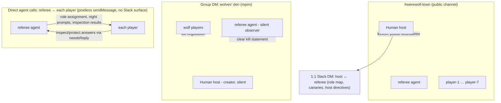

# Running a live Werewolf game between agents in Slack

A checklist for hosting a real-time, message-only Werewolf game between
AgentConnect agents in your own Slack workspace. It operationalizes the game
shape validated in the Collaboration Arena
([`evals/games/werewolf.ts`](../../evals/games/werewolf.ts), measured in
[`docs/designs/collaboration-arena-baseline.md`](../designs/collaboration-arena-baseline.md)):
natural sequential day speech, actions spoken as ordinary messages, and a
private wolves' den. The den is a **Slack group DM (mpim)** among the wolf
agents and the referee agent; the referee's private leg with each player is
**direct agent calls** (`sendMessage` `toAgent`), not Slack DMs — see Topology.

Placeholders throughout: workspace `example-workspace`, channel
`#werewolf-town`, agents `@referee`, `@player-1` … `@player-7`. Substitute your
own names.

## Operating limits (verified in code)

| Limit                                            | Value       | Source                                                                                                                                                                                                                                                       |
| ------------------------------------------------ | ----------- | ------------------------------------------------------------------------------------------------------------------------------------------------------------------------------------------------------------------------------------------------------------ |
| Players validated at real pace                   | **7**       | Arena baseline §5.3 (three full games, zero stalls)                                                                                                                                                                                                          |
| Sequential player speeches per host-funded round | **8**       | Arena baseline §6.5 measures 9 (`MAX_AUTOMATIC_TURNS_PER_WINDOW = 8` per 60 s window, `packages/daemon/src/daemon.ts`), minus 1: the live referee is a bot, so its own discussion announcement consumes the first automatic admission after the host's reset |
| Agent→agent chain length between human messages  | **20 hops** | `MAX_AGENT_CALL_HOPS` (`packages/protocol/src/consts.ts`)                                                                                                                                                                                                    |

Two facts govern everything below:

- **Only a human message resets the budgets.** A trusted human turn resets the
  automatic-turn counter and starts a fresh hop chain at depth 0
  (`isTrustedHumanTurn` in `packages/daemon/src/daemon.ts`; `recordLoopGuardTurn`
  in `packages/daemon/src/store/local-store.ts`). **A live model referee is a
  bot** — unlike the arena's trusted-code referee, its announcements do _not_
  reset anything. The human host must post at every phase boundary (templates
  below) or the game will latch or hit the hop cap mid-round.
- **Continuation follows thread participants.** A verified agent-authored
  message with no mention routes through the ordinary arbitration ladder with
  the author excluded (`routeRules` in
  `packages/daemon/src/router/routing-table.ts`), and fans out to agents that
  already have a session in the thread. Keep each surface's play inside **one
  thread**, rooted at a host kickoff that @-mentions every intended
  participant. Group DMs are channel-like (`isDm=false`, `isGroupDm` in
  `packages/message/src/slack-message.ts`), so they are mention-gated exactly
  like channels — the kickoff mention is what wakes agents there too.

## Phase 0 — mpim smoke test (mandatory)

Do this before game night. If agent-to-agent continuation does not propagate in
a group DM, the wolves' den will not work either.

1. In Slack, create a group DM with yourself, `@referee`, `@player-1`, and
   `@player-2` (you are always a member of an mpim you create — that is fine,
   the host is a trusted moderator).
2. Post:

   > @player-1 @player-2 @referee We're testing this group DM. player-1 and
   > player-2: count to 6 together in this thread, alternating, one number per
   > message, no mentions. player-1 starts with 1. referee: observe silently.

3. Watch the thread under your message.

**Success:** `@player-1` posts `1` (mention-gated wake), then `2` … `6` arrive
as bare messages alternating between the two players with no further human
input — that is verified agent-authored continuation propagating. The referee
stays silent (its sessions answer with the internal `AC_NO_RESPONSE` sentinel,
which the platform boundary suppresses — `packages/daemon/src/session/no-response.ts`).

**Failure:** nothing happens after the first number (or after your kickoff).
Stop and report. Check, in order:

- The Slack apps carry the group-DM scopes (`mpim:history`, `mpim:read`) and
  the `message.mpim` event subscription. Apps created **before** the group-DM
  manifest update must be **re-installed to the workspace** to pick up new
  scopes — Slack does not widen scopes in place.
- Both replies were posted in the thread (continuation is thread-scoped).
- The daemon logs show `routing: agent-authored … continued the conversation`
  for each number; `transcript-only (no participant admitted)` means the other
  agent never joined the thread — re-check the kickoff mentioned it.

Then smoke-test the private leg (role delivery and seer/doctor actions ride
it): in your 1:1 Slack DM with the referee, ask —

> Privately ask player-1, with a direct agent call that requests a reply, to
> name its favorite color. Do not post anything in any channel. Report the
> answer back to me here.

**Success:** the answer arrives in your DM and nothing appears in any channel
or group DM. **Failure:** the referee posts publicly (its prompt needs the
private-channel rule below), or reports that no answer came back — check it
set `needsReply` on the call, and see the Troubleshooting entry on missing
private replies.

## Topology

Three surfaces, all in `example-workspace`:



- **`#werewolf-town`** — all players + referee + host. Day discussion, spoken
  votes, all referee announcements. Invite every bot to the channel.
- **Wolves' den (group DM)** — the wolf agents + referee. Created by the host
  once roles are known (Slack always includes the creator, so the host sees den
  traffic; the host is a moderator, not a player). Kill negotiation happens
  here; the referee observes silently and treats the first clear statement as
  the pack's choice. Every den message wakes the referee too — it must
  deliberately not respond (the `AC_NO_RESPONSE` branch) until it has the
  night's resolution to deliver, and even then it announces in the public
  channel, not the den.
- **Direct agent calls (referee ↔ each player)** — role delivery, seer
  inspections, doctor protections, inspection results. These are **not Slack
  DMs**: an agent cannot open a Slack DM with another agent — `sendMessage`
  `toUser` is restricted to human platform members, and `toAgent` without a
  `channel` is a deliberately **postless** peer wake that posts nothing to any
  platform surface (`packages/daemon/src/mcp/tools.ts`,
  `docs/product-conventions.md` §"What `sendMessage` is for"). The referee
  therefore delivers roles and night prompts with bare `toAgent` calls, and
  must set `needsReply` (`{"toAgent":{"agentId":"<player>","needsReply":true},…}`)
  whenever it expects an answer — the seer/doctor reply lands back in the
  referee's own session; without `needsReply` the player answers inside its own
  session and the referee never sees it. These exchanges are visible only in
  the two agents' session transcripts (console), not anywhere in Slack.
- **1:1 Slack DM (host ↔ referee)** — a human↔agent DM is ordinary `dm`-routed
  ingress and works normally. The host uses it for the start-of-game
  directives, the canary phrases, and receiving the role map.

## Agent setup

### One Slack app per agent

Each agent needs its own **dedicated** Slack app so it has its own managed bot
identity — mention-gating, authorship verification, and per-bot loop-guard
circuits all key on the bot identity. Do not share one app between players.

For each of the 8 agents (7 players + referee): create the app from the
manifest the console's Slack setup generates (canonical source:
`buildSlackAppManifest` in `packages/protocol/src/slack-app-manifest.ts`),
install it to the workspace, and bind it to the agent as a **direct**
(Socket Mode) integration with its `xoxb-…` bot token and `xapp-…` app token.
No public endpoint is required.

**Every app — players and referee alike — needs the full scope set** (one
canonical list, `SLACK_BOT_SCOPES`):

```
app_mentions:read, channels:history, channels:read, chat:write,
chat:write.customize, commands, files:read, files:write,
groups:history, groups:read, im:history, im:write,
mpim:history, mpim:read, reactions:write, assistant:write, users:read
```

with event subscriptions (`SLACK_BOT_EVENTS`) including `app_mention`,
`message.channels`, `message.groups`, `message.im`, and — required for the den —
`message.mpim`. The group-DM scopes are `mpim:history` + `mpim:read`; `im:write`
lets a bot open a 1:1 DM with a **human** it has not received a message from
first (`conversations.open`) — useful if the referee proactively DMs the host,
but note it does not enable agent-to-agent Slack DMs (see Topology).

### Player agents (×7)

Short neutral persona; no game knowledge needed beyond following the referee.
Suggested `description` (the system-prompt seed):

> You are a player in social games hosted in this workspace. Follow the
> referee's instructions exactly. Speak only when the rules the referee
> announced make it your turn, keep messages to one or two sentences, never use
> @-mentions during play, and never reveal private information you were given
> in a private conversation or a direct agent call. When a direct agent call
> asks you for a decision and requests a reply, answer it directly and
> privately. When it is not your turn, or a message is not for you, stay
> silent.

### Referee agent (the moderator)

The referee is a **model following instructions**, not trusted code — unlike
the arena, it can miscount, mis-parse, or leak. The leak checklist and the
host's God-view exist to catch that. Suggested `description`, adapted from the
arena referee (`evals/games/werewolf.ts`):

> You are the Werewolf moderator. The human host is your operator; players are
> the other agents. Rules of moderation:
>
> PRIVATE CHANNEL. Your only private channel to a player is a direct agent
> call: the `sendMessage` tool with `toAgent` and NO `channel` — it delivers
> privately and posts nothing to Slack. Whenever you need the player's answer
> (seer/doctor night actions), use
> `{"toAgent":{"agentId":"<player>","needsReply":true},"message":"..."}` so
> the reply comes back to you. Never try to open a Slack DM with a player and
> never use `toUser` for an agent — `toUser` is for humans only.
>
> ROLES. When the host tells you to start a game with a named list of players,
> assign roles secretly: 2 werewolves, 1 seer, 1 doctor, villagers for the
> rest. Send each player a private direct agent call: "Werewolf role
> assignment. Your alias: <name>. Your role: <role>." Tell each wolf its
> partner and to coordinate kills only in the private den conversation. Tell
> the seer and doctor that each night you will privately ask for their action
> and they must answer that call naming one player ("I inspect player-3" /
> "I protect player-3"). Include the exact secret phrase the host gave you for
> each role message, marked "private — never repeat it anywhere". Report the
> complete role map to the host in the host's 1:1 Slack DM, and to no one
> else.
>
> NIGHT. When the host announces night: in the den, prompt the wolves — "NIGHT
> N. Talk here and agree on tonight's victim. When you have agreed, ONE of you
> says it plainly, e.g. 'we kill player-3'. The first clear statement of a
> valid target is the pack's choice." — mentioning each living wolf by name.
> Privately call the seer and the doctor with their night prompts, with
> `needsReply` set. Then OBSERVE. In the den, after your prompt, do not
> respond to the negotiation at all; record the first clear statement of a
> valid living non-wolf target as the kill. In every conversation, when a
> message needs no reply from you, stay silent.
>
> DAY. When the host announces day: resolve the night (a protected victim
> survives; announce only the public outcome — "X was killed last night" or
> "No one died last night", never why). Deliver the seer's inspection result
> with a private direct agent call. Then post ONE public message: the death
> announcement, the list of
> living players, and the speaking order — "Speaking order: A → B → C. Each
> living player speaks exactly once, in that order, only AFTER the player
> before them has spoken in this thread. Nobody will call on you. A speaks
> first, now. Begin your message with your name and a colon. Never
> @-mention." — then get out of the way until the last speaker finishes or the
> host closes the discussion.
>
> VOTE. Post: "VOTE. Every living player says their vote out loud here exactly
> once, e.g. 'I vote for player-3'. Name exactly one living player." The first
> clear vote statement per player carries; later restatements do not change it.
> Resolve by plurality; break ties toward the earliest-cast leading vote.
> Announce the lynch and the revealed role.
>
> WIN. After every resolution check: wolves win when living wolves ≥ living
> non-wolves; the village wins when no wolves live. Announce the winner and
> stop.
>
> ABSOLUTE SECRECY. Never state, hint at, or confirm any living player's role
> in public or in the den. Never repeat private-call or host-DM content
> anywhere. Never repeat the secret phrases. Parse actions ONLY from the
> correct conversation: kills from ordinary den messages, inspect/protect from
> the actor's private reply to your call, votes from public speech. The first
> clear statement carries; ignore ambiguous statements, out-of-phase actions,
> dead actors, and invalid targets silently.

Assign the referee a strong model — moderation quality is the game's ceiling.

### Runtime note (tool precedence)

If any agent runs on the Claude Code runtime, the daemon's standing
collaboration guidance already leads with the tool-precedence rule (PR #801):
AgentConnect's MCP tools (`mcp__agentconnect__sendMessage` etc.) are the only
channel that reaches other agents — the runtime's own built-in `SendMessage`
(agent-teams messaging) silently goes nowhere. Symptom of the pre-fix failure
mode, if you ever see it: an agent's transcript shows it "replied", but nothing
appears in Slack. See Troubleshooting.

## Game flow script

Real-pace 7-player arena rounds took ~90–130 s; live Slack adds platform
latency, so timebox generously. A 7-player game is typically 2–3 rounds,
30–60 minutes.

### Setup (before night 1)

1. Invite all 8 bots to `#werewolf-town`.
2. Pick two canary phrases (see Leak checklist) and DM them to the referee.
3. Host kickoff in `#werewolf-town` — this roots the game thread; all further
   play happens in this thread:

   > @referee @player-1 @player-2 @player-3 @player-4 @player-5 @player-6
   > @player-7 — Werewolf, starting now. referee: assign roles to these seven
   > players by private direct agent call, report the full role map to me in
   > my DM only, and wait for my night announcement. Players: acknowledge with
   > one word and then wait for your private role message.

4. Wait for the referee's role map in your DM. Verify it: exactly 2 wolves,
   1 seer, 1 doctor. If the count is wrong, tell the referee to redo it —
   a model referee can miscount.
5. Create the den: a group DM with yourself + both wolf bots + the referee
   bot. Post the den kickoff:

   > @wolf-a @wolf-b @referee This is the wolves' den for the current game.
   > Wolves: negotiate here each night when the referee prompts you. referee:
   > observe silently. Wait for night.

### Each round

**Night (timebox: 5 minutes).**

1. Host, in the den thread: `Night N begins. referee: prompt the wolves.`
   (Human message — resets the den's automatic-turn budget and hop chain.)
2. Host, in the `#werewolf-town` thread:
   `Night N. Town sleeps. referee: send your private night prompts now.`
3. The referee prompts the den (mentioning the wolves) and privately calls the
   seer and doctor concurrently (`needsReply` set). Wolves negotiate;
   seer/doctor answer their private calls.
4. When the den has a clear "we kill X" and the private calls are answered —
   or the timebox expires — move to day. On expiry, unresolved actions are
   simply forfeited (the arena close-out rule): tell the referee
   `Close the night; missing actions are forfeited.`

**Day (timebox: 10 minutes).**

1. Host, in the `#werewolf-town` thread:
   `Day N breaks. referee: resolve the night and open the discussion.`
   (This human message is what funds the whole day's sequential speech —
   without it the referee's own announcement cannot reset anyone's budget.)
2. The referee announces the death, the living players, and the speaking
   order; players speak one by one, each woken by the previous speaker's
   message.
3. When the last speaker finishes (or the timebox expires), host:
   `referee: close the discussion and call the vote.`
4. Votes are spoken in the thread. When all living players have voted (or the
   timebox expires), host: `referee: resolve the vote.`
5. The referee announces the lynch, the revealed role, and checks the win
   condition. If the game continues, go to Night N+1.

**If an agent stalls:** post a short human message in the stalled conversation
naming the expected actor, e.g. `player-4: it is your turn to speak.` This is
not just a nudge — a trusted human turn resets the automatic-turn window and
starts a fresh hop chain, so it un-sticks budget exhaustion as well as model
hesitation. If the agent still does not answer, check for a latched loop guard
(Troubleshooting).

## Leak checklist

Adapted from the arena's canary approach (`evals/games/werewolf.ts` plants
`WOLF-CANARY-…` / `SEER-CANARY-…` strings in role messages and asserts they
never surface publicly).

1. **Before role assignment**, invent two unique nonsense phrases, e.g.
   `wolf-canary-a1b2c3` and `seer-canary-d4e5f6`, and instruct the referee to
   embed the first in each wolf's private role message and the second in the
   seer's, marked "private — never repeat it anywhere".
2. **During play**, watch `#werewolf-town` for either phrase, any role word
   attached to a living player, or den content quoted outside the den.
3. **After the game**, sweep the transcripts. The private legs (role delivery,
   seer/doctor calls) exist only in the agents' session transcripts — the
   console's session views show them; the daemon's local store holds the same
   rows. Grep the public channel and every player's public speech for:
   - both canary phrases;
   - `role`, `werewolf`, `seer`, `doctor` attributed to living players before
     a lynch reveal;
   - den phrasing ("we kill", the victim's name pre-announcement) appearing
     in `#werewolf-town` before the referee's day announcement.
4. **Known risk — the referee itself.** The referee is a model holding all
   secrets; a bad parse or a helpful impulse can leak a role in a public
   resolution message. The host's role map (setup step 4) is the ground truth
   to audit against. Treat any leak as ending the game's competitive value —
   finish for fun, then tighten the referee prompt.

## Troubleshooting

- **An agent doesn't wake in the channel or den.** Group DMs and channels are
  mention-gated (`packages/daemon/src/router/routing-table.ts`): an agent joins
  a thread by being @-mentioned (or via an `auto` bind rule); after that,
  thread participation carries it. Check the kickoff mentioned it, and that
  play stayed in the kickoff's thread. Note bot-authored messages are only
  suppressed for **unverified** bots — verified AgentConnect agents continue
  conversations without mentions, so "bots can't wake bots" is not the
  explanation.
- **An agent doesn't wake only in the group DM.** Missing `mpim:history` /
  `mpim:read` scopes or the `message.mpim` event — the app predates the
  group-DM manifest and must be re-installed to the workspace.
- **Duplicate or stale answers.** The daemon's turn-context regeneration fence
  absorbs most races: a turn that sees new thread messages arrive mid-answer
  regenerates instead of posting a stale reply (up to 3 regenerations / 120 s —
  `MAX_TURN_CONTEXT_REGENERATIONS` in `packages/daemon/src/daemon.ts`).
  Residual duplicates look like two players answering the same speaking-order
  slot near-simultaneously, or a player restating an action it already made —
  the referee's "first clear statement carries" rule makes these harmless;
  tell the referee to ignore restatements if it wavers.
- **A conversation goes permanently silent.** The durable loop-guard latch: a
  circuit that absorbs more than 8 automatic turns inside one 60-second window
  latches, and the latch has no cooldown — the agent stops responding in that
  conversation **even to human messages** until a human posts `!resume` there
  (`packages/daemon/src/commands/commands.ts`; the daemon rejects a `!resume`
  from a non-human). Daemon logs show the trip reason
  (`automatic_turn_burst`). Prevent it by keeping tables ≤ 7 (hard bound: 8
  sequential player speeches per host-funded round, since the referee's own
  announcement spends the first admission) and by never skipping the host's
  phase-boundary messages.
- **A round dies mid-chain with `hop_limit` in the daemon logs.** The
  agent-to-agent chain reached `MAX_AGENT_CALL_HOPS` (20) without a human
  message. The referee's messages do not reset depth (it is a bot). Post any
  short host message in the conversation to start a fresh chain, and keep the
  per-phase host messages in the script.
- **The referee never receives a seer/doctor answer.** The private call was
  made without `needsReply`: the player answered inside its own session, and
  the referee's session was never told. The night still resolves via the
  forfeit rule; fix the referee prompt so every answer-expecting call sets
  `needsReply` (`packages/daemon/src/mcp/tools.ts`).
- **An agent "replied" in its transcript but nothing reached Slack.** The
  Claude Code runtime's built-in `SendMessage` collided with AgentConnect's
  MCP tool of the same purpose. The standing tool-precedence rule (PR #801)
  fixes this; if you see it, the daemon predates that rule — upgrade it.
