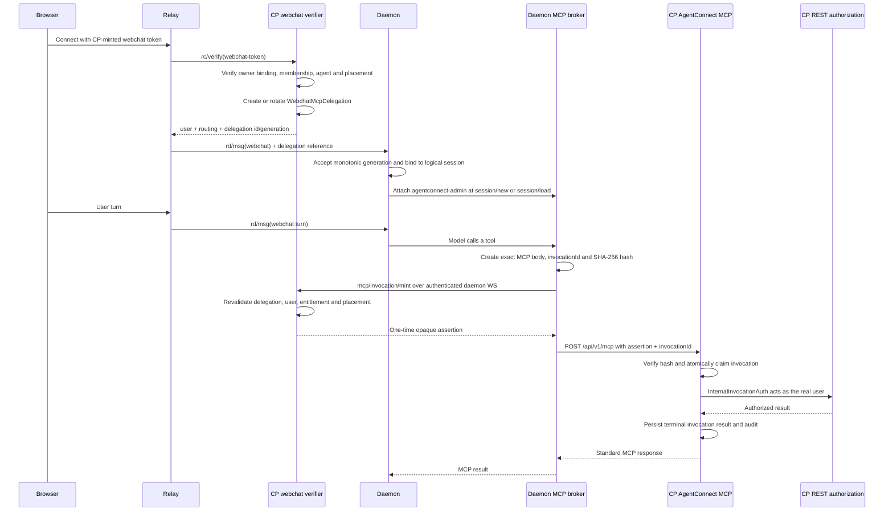
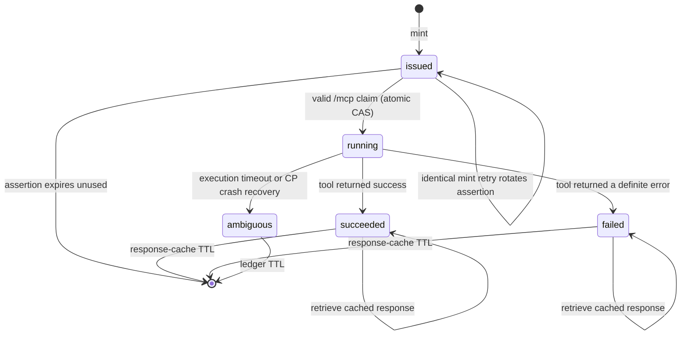

# Webchat-Scoped AgentConnect MCP for the Preset Agent

**Status:** Proposed

**Scope:** protocol + control-plane + relay + daemon

**Related designs:**

- [`docs/designs/preset-agents.md`](../../designs/preset-agents.md)
- [`docs/designs/agent-assistant.md`](../../designs/agent-assistant.md)
- [`docs/designs/session-visibility.md`](../../designs/session-visibility.md)
- [`docs/designs/daemon-centric-architecture.md`](../../designs/daemon-centric-architecture.md)

## 1. Summary

When an authenticated console user starts or resumes a webchat conversation with
the built-in `agentconnect` preset agent, AgentConnect temporarily attaches the
CP-hosted AgentConnect MCP read/write tool catalog to that ACP session.

The tools act as the webchat user, not as the agent, daemon, relay, or an
organization-wide system principal. Every operation reuses the existing MCP
catalog, REST authorization, resource-visibility predicates, destructive-operation
confirmation, rate limits, and audit trail.

The daemon never receives a reusable user credential. Its local MCP broker obtains
a one-time assertion for each MCP request, then calls the standard CP
`POST /api/v1/mcp` endpoint. The assertion is bound to one delegation, one
invocation id, and the exact MCP request bytes. The CP consumes it atomically before
executing the request.

This design deliberately separates:

- **Session admission:** which authenticated user owns the private webchat
  conversation.
- **MCP entitlement:** whether this session is a webchat session on the built-in
  preset agent.
- **Invocation authentication:** one short-lived, single-use assertion for one
  exact MCP request.
- **Operation authorization:** the initiating user's current membership, role, and
  resource visibility at execution time.

## 2. Requirements and invariants

### 2.1 Product requirements

1. Starting or resuming webchat with the built-in `agentconnect` preset makes the
   existing curated AgentConnect MCP read/write catalog available in that session.
2. The tools execute as the user who owns the webchat conversation.
3. Other sessions of the same agent do not receive this MCP:
   - Slack, Discord, Telegram, Feishu, hook, cron, dream, and agent-to-agent
     sessions are ineligible.
   - Webchat sessions on non-preset agents are ineligible.
4. The webchat session is private to its initiating user under
   `session-visibility.md`. An organization owner's read-only governance exception,
   if retained by that design, does not grant the ability to join, resume, or send
   messages into the conversation.
5. The enabled catalog is the existing curated read/write catalog. Existing
   exclusions for credential, membership, organization, access-control, bot, and
   hook writes remain in force.

### 2.2 Security invariants

1. The CP derives the acting `userId` from the durable
   `WebchatConversation` owner binding. The relay and daemon may never nominate an
   arbitrary user.
2. `conversationId`, `orgId`, `agentId`, and `userId` are immutable for the life of
   a webchat conversation. Resume must match all four.
3. A delegation handle is not a user credential. Possessing it is insufficient to
   call REST or MCP.
4. A one-time assertion:
   - is valid only at the AgentConnect MCP endpoint;
   - is bound to one invocation id and one exact request hash;
   - must make its one execution claim within 30 seconds;
   - is consumed atomically at most once for execution;
   - after a claim, can only observe that invocation or retrieve its cached result.
5. Neither a reusable user credential nor a one-time assertion appears in ACP
   session configuration, child-process environment, model context, transcript,
   telemetry, audit details, or logs.
6. The model-facing runtime receives only an opaque token for the daemon-local Unix
   socket. Stealing that token does not create authority outside the same ACP
   session.
7. Membership, role, preset entitlement, agent visibility, placement, and
   delegation validity are checked again when an assertion is minted. Membership,
   role, resource visibility, MCP scope, and invocation validity are checked again
   when the assertion is consumed.
8. A stale delegation generation cannot displace or use a newer generation.
9. A delegated invocation may not mutate its own host preset agent. In particular,
   `updateAgent` and `deleteAgent` fail before REST dispatch when their `agentId`
   equals the delegation's `agentId`.
10. Losing the CP disables only the CP-hosted AgentConnect MCP tools. Ordinary
    conversation delivery and daemon-local tools continue to work.

### 2.3 External prerequisite

[`session-visibility.md`](../../designs/session-visibility.md) is a separate,
currently unimplemented design and a hard launch prerequisite. This feature does not
absorb that design's protocol, persistence, authorization, memory-gating, or web
work. Delegated MCP emission remains disabled until new webchat sessions are
persisted as `private` with `ownerIdentity = user:<WebchatConversation.userId>` and
all session list/detail/message/tool-body reads enforce that visibility.

The durable `WebchatConversation` owner binding already exists and remains the
authorization source for this design. Session visibility prevents transcript
disclosure; it does not replace the owner binding or grant invocation authority.

## 3. Current state and gaps

The existing webchat path already establishes most of the owner binding:

1. `POST /orgs/:orgId/agents/:agentId/webchat/token` runs under human auth and
   verifies that the user may view the agent.
2. A fresh conversation writes
   `WebchatConversation { id, userId, orgId, agentId }`.
3. Resume succeeds only when the authenticated user owns the same conversation for
   the same organization and agent.
4. The relay asks the CP to verify the short-lived webchat token and receives the
   user, conversation, target agent, and current daemon placement.
5. The relay forwards webchat content directly to the daemon over `rd/*`; message
   content never crosses the CP.

The existing AgentConnect MCP is also already CP-hosted and exposes the curated
catalog through `POST /api/v1/mcp`. It authenticates personal API keys and OAuth
tokens, then calls the existing REST surface with the same credential through
`app.inject()`.

The missing pieces are:

- a session-scoped, non-credential delegation handle;
- propagation of that handle from webchat verification to the daemon;
- ad hoc MCP attachment at ACP `session/new` and `session/load`;
- per-request assertion minting over the authenticated daemon↔CP WebSocket;
- assertion authentication on the standard MCP endpoint;
- safe in-process propagation of the resolved user identity to nested REST
  requests without replaying the assertion.

## 4. Decisions

| Topic                       | Decision                                                                                                                                                       | Rejected alternatives                                                                                                                                                                        |
| --------------------------- | -------------------------------------------------------------------------------------------------------------------------------------------------------------- | -------------------------------------------------------------------------------------------------------------------------------------------------------------------------------------------- |
| Runtime credential          | The runtime receives only a daemon-local Unix-socket token.                                                                                                    | Passing a delegated Bearer key in HTTP MCP headers or a bridge environment: the preset agent is shell-capable and may inspect sibling process configuration or logs.                         |
| MCP transport               | A daemon-local MCP broker exposes `agentconnect-admin` to ACP and calls the standard CP MCP endpoint.                                                          | Reimplementing AgentConnect administration tools in the daemon duplicates catalog and authorization logic.                                                                                   |
| Invocation identity         | Two steps: mint a one-time assertion over daemon↔CP WS, then call standard `/api/v1/mcp`.                                                                      | A reusable delegated API key has a wider theft and replay window. A combined proprietary `delegated-mcp/invoke` frame would not exercise the standard MCP endpoint selected for this design. |
| Invocation identifiers      | A public UUID `invocationId` provides correlation/idempotency; a separate opaque assertion is the secret authenticator.                                        | Treating `invocationId` itself as a Bearer capability risks exposing authority through ordinary correlation logs and audit fields.                                                           |
| User source                 | Resolve from `WebchatConversation.userId`.                                                                                                                     | A user id reported by relay, daemon, model, or MCP arguments is forgeable.                                                                                                                   |
| Delegation lifetime         | Bound to the logical webchat session, not to one browser WebSocket. Default maximum lifetime is 12 hours; an ordinary reconnect reuses the current generation. | Revoking immediately on socket close can break a turn still completing after a transient browser disconnect.                                                                                 |
| Tool catalog                | Existing curated read/write catalog with live user RBAC and existing confirmation gates.                                                                       | Read-only does not meet the accepted product requirement. Exposing all REST operations defeats catalog curation.                                                                             |
| Host-agent writes           | Delegated calls hard-deny `updateAgent` and `deleteAgent` when the target is the delegation's host agent.                                                      | Ordinary user RBAC would let the session pause or reconfigure its own host; the preset's separate non-deletable/name guards do not establish this boundary.                                  |
| Nested REST auth            | An in-process `InternalInvocationAuth` seam propagates the already-verified principal to `app.inject()` subrequests.                                           | Reusing the consumed assertion on nested REST calls creates replay races. A trusted header by itself can be forged by an external caller.                                                    |
| Idempotency                 | Persist a short-lived invocation ledger and bounded final MCP response.                                                                                        | Blindly minting a new assertion after an ambiguous write can execute the operation twice.                                                                                                    |
| Local bridge implementation | Extend the existing daemon `McpControlServer` and `mcp-bridge` with a remote-forwarding session context.                                                       | A second Unix socket, bridge executable, and token registry would duplicate existing confinement and lifecycle machinery.                                                                    |

## 5. Architecture



The CP remains outside the message hot path. It is contacted only during the
existing webchat connection verification and during AgentConnect management-tool
calls, which are control-plane operations by definition.

## 6. Domain modules and interfaces

### 6.1 `WebchatMcpDelegationService` (control plane)

This module owns the interface between a verified webchat identity and later MCP
invocations.

```ts
interface WebchatMcpDelegationService {
  establish(input: {
    conversationId: string
    verifiedUserId: string
    orgId: string
    agentId: string
    daemonId: string
  }): Promise<DelegationReference | null>

  mintInvocation(input: {
    authenticatedDaemonId: string
    delegationId: string
    generation: number
    invocationId: string
    requestHash: string
    method: 'tools/list' | 'tools/call'
    toolName?: string
  }): Promise<MintedInvocationAssertion>
}
```

`establish()` returns `null` for a valid webchat conversation that is not entitled
to the admin MCP. It returns a reference only when:

- the durable conversation row matches the verified token claims;
- the current user remains a member of the organization;
- the user can currently view the agent;
- the target is the built-in preset, determined by its `preset_agent` relation,
  never by slug alone;
- the target's current placement is the daemon returned in the verification result.

`mintInvocation()` obtains the daemon identity from the authenticated WebSocket
connection, not from request payload. It rechecks all current facts. The interface
hides row locking, generation rotation, assertion hashing, and invocation-ledger
state from its callers.

### 6.2 `SessionMcpBroker` (daemon)

The daemon module owns model-facing MCP attachment and remote forwarding.

```ts
interface SessionMcpBroker {
  bindDelegation(input: {
    agentId: string
    conversationId: string
    delegationId: string
    generation: number
    expiresAt: string
  }): void

  serverForSession(input: { agentId: string; platform: string; conversationId: string }): McpServer | null
}
```

The module:

- accepts only monotonic generations for an `(agentId, conversationId)` pair;
- stores delegation references in memory, never in transcript or agent config;
- registers a daemon-local MCP token scoped to that logical session;
- exposes a model-facing server named `agentconnect-admin`;
- translates local `tools/list` and `tools/call` requests into standard MCP
  requests to the CP;
- creates its own UUID `invocationId` rather than trusting the runtime's JSON-RPC
  request id;
- hashes the exact byte buffer it will send to the CP and sends those unchanged
  bytes after minting;
- clears bindings on session expiry, agent detach/move, and daemon shutdown.

The broker is an adapter, not a second implementation of the MCP catalog. Tool
descriptors and results come from the CP AgentConnect MCP.

This is a logical module inside the existing MCP stack, not a parallel bridge
process. `McpControlServer` gains a remote-forwarding session-context variant, and
the existing `mcp-bridge` continues to expose the confined Unix-socket path to the
runtime.

### 6.3 `InvocationAssertionAuthenticator` (control plane)

This module is mounted only on the MCP route. Normal REST human authentication does
not recognize invocation assertions.

```ts
interface InvocationAssertionAuthenticator {
  claim(input: {
    bearer: string
    invocationId: string
    requestBytes: Uint8Array
  }): Promise<
    | { kind: 'execute'; context: InvocationContext }
    | { kind: 'completed'; responseBytes: Uint8Array }
    | { kind: 'in_progress'; retryAfterMs: number }
    | { kind: 'ambiguous' }
  >
}
```

`claim()` hashes the Bearer token and request bytes, then performs the state
transition and validation described in §9. It never returns the assertion hash or
raw token.

### 6.4 `InternalInvocationAuth` (control plane)

The existing MCP implementation reuses REST guards through `app.inject()`. An
invocation assertion must be consumed exactly once at the outer MCP request, so it
cannot be replayed as authentication on nested REST requests.

`InternalInvocationAuth` provides a narrow in-process seam:

```ts
interface InternalInvocationAuth {
  run<T>(context: InvocationContext, fn: () => Promise<T>): Promise<T>
  authorizeInjectedRequest(req: FastifyRequest): boolean
}
```

The implementation uses `AsyncLocalStorage` plus a one-time random subrequest nonce:

1. The outer MCP route calls `run(context, ...)` only after claiming the assertion.
2. Each MCP `ctx.get()` / `ctx.send()` allocates a nonce and records the expected
   HTTP method and path in the current async-local context.
3. The nested `app.inject()` request carries that nonce in an internal header.
4. A pre-handler atomically consumes a nonce only when the async-local context,
   method, and path all match, then populates:
   - `req.principal.userId`;
   - `req.apiKeyOrgId`;
   - `req.apiKeyScopes = ['mcp:read', 'mcp:write']`;
   - `req.delegatedInvocation = { invocationId, delegationId, agentId,
conversationId }`.
5. A network request has no async-local context. Copying the header is therefore
   useless and falls through to normal authentication.

The expected method/path fence prevents unrelated in-process work spawned under the
same async context from accidentally inheriting authority. Parallel internal reads,
such as `whoami`, receive independent nonces.

## 7. Persistence

### 7.1 Delegation

Add a monotonically increasing generation to the existing durable owner row and a
separate delegation record:

```prisma
model WebchatConversation {
  id                   String @id @db.Uuid
  // existing orgId, agentId, userId...
  delegationGeneration Int    @default(0)
}

model WebchatMcpDelegation {
  id             String    @id @default(uuid()) @db.Uuid
  conversationId String    @db.Uuid
  generation     Int
  userId         String
  orgId          String
  agentId        String    @db.Uuid
  daemonId       String    @db.Uuid
  createdAt      DateTime  @default(now()) @db.Timestamptz(6)
  expiresAt      DateTime  @db.Timestamptz(6)
  revokedAt      DateTime? @db.Timestamptz(6)
  revokedReason  String?

  @@unique([conversationId, generation])
  @@index([conversationId, revokedAt])
  @@index([expiresAt])
  @@map("webchat_mcp_delegation")
}
```

Establishment locks the `WebchatConversation` row. If its latest unrevoked delegation
matches the same immutable owner, organization, agent, and current daemon placement
and is not expired, establishment returns that existing reference. It creates a
higher generation and revokes the prior row only when the prior delegation expired,
was explicitly revoked, or the agent placement changed. Concurrent tabs and
ordinary reconnects therefore converge on the same active generation instead of
invalidating each other. The plaintext webchat token and assertions are never
stored.

The default delegation lifetime is 12 hours, capped by any earlier logical-session
expiry. Session close/expiry sends the conditional revocation frame in §8.5. Agent
move/detach is CP-observable and revokes the delegation directly. Deletion of the
owner membership blocks mint immediately through its live membership check even if
a best-effort lifecycle signal is delayed.

A compromised daemon can suppress its session-close revocation frame. The hard
security bound in that threat case is therefore the 12-hour delegation expiry plus
the live membership, role, agent-visibility, preset-entitlement, and placement
checks—not immediate close detection. This is an explicit residual trust in a daemon
that already owns the agent process and session content.

### 7.2 Invocation ledger

```prisma
enum McpInvocationStatus {
  issued
  running
  succeeded
  failed
  ambiguous
}

model McpInvocation {
  id               String              @id @db.Uuid // public invocationId
  delegationId     String              @db.Uuid
  assertionHash    String              @unique
  requestHash      String
  method           String
  toolName         String?
  status           McpInvocationStatus @default(issued)
  assertionExpires DateTime            @db.Timestamptz(6)
  startedAt        DateTime?           @db.Timestamptz(6)
  completedAt      DateTime?           @db.Timestamptz(6)
  responseStatus   Int?
  responseBytes    Bytes?
  createdAt        DateTime            @default(now()) @db.Timestamptz(6)

  @@index([delegationId, createdAt])
  @@index([status, assertionExpires])
  @@map("mcp_invocation")
}
```

The assertion is an opaque value with at least 192 bits of entropy. Only its peppered
hash is stored. It uses a distinct token prefix and hash domain from API keys, OAuth
tokens, and webchat tokens. Its 30-second deadline controls whether it can make the
initial `issued → running` execution claim. After a successful claim, the same
assertion may only poll `running` or retrieve the cached terminal response for the
remainder of the 15-minute response-cache window; it can never start another
execution.

Final MCP responses are cached for 15 minutes and capped at 256 KiB so an identical
retry can receive the original result without re-executing a write. The current
curated catalog returns bounded control-plane metadata and does not return
transcripts, message bodies, attachment bytes, or credentials. A future tool that
can return those data classes must define a different idempotency policy before
joining this catalog.

A reaper:

- deletes terminal invocations and their cached responses after 15 minutes;
- marks `running` rows older than the execution timeout as `ambiguous`;
- deletes expired, unused `issued` rows;
- deletes expired delegations only after their invocation rows are reapable.

## 8. Protocol changes

All additions are optional for rolling compatibility.

### 8.1 Relay↔CP verification result

Extend `RcVerifyResult` for an entitled webchat token:

```ts
delegation?: {
  id: string
  generation: number
  expiresAt: string
}
```

No assertion or reusable credential crosses the relay.

### 8.2 Relay↔daemon webchat delivery

Extend `RdMsgWebchat` with the same optional `delegation` reference. The relay copies
only the CP verdict; browser input cannot set or override it. Every webchat operation
on that browser connection carries the reference so daemon restart and relay
redelivery do not depend on an earlier setup message.

The daemon accepts the highest generation it has seen for a logical session. A lower
generation never overwrites a higher one. The CP remains authoritative at assertion
mint, so a forged or stale reference can at most make the descriptor appear; it
cannot authorize a tool call.

### 8.3 Daemon↔CP assertion mint

Add a daemon-originated request/reply pair on the existing authenticated control
WebSocket:

```ts
// D -> CP REQ
type McpInvocationMint = {
  delegationId: string
  generation: number
  invocationId: string
  requestHash: string // lowercase SHA-256 hex of exact subsequent HTTP body bytes
  method: 'tools/list' | 'tools/call'
  toolName?: string // required for tools/call; checked again from the HTTP body
}

// CP -> D REP
type McpInvocationMinted = {
  invocationId: string
  assertion: string
  expiresAt: string
}
```

The CP derives `authenticatedDaemonId` from the WebSocket connection. The frame does
not carry it as a trusted payload field.

A retry of mint with the same `(invocationId, delegationId, requestHash)` while the
row is still `issued` rotates the assertion hash and invalidates the prior plaintext
assertion. A retry with a different binding returns `INVOCATION_CONFLICT`. Once the
row is `running` or terminal, mint does not issue another assertion.

### 8.4 Standard MCP HTTP call

The daemon broker calls the existing MCP route:

```http
POST /api/v1/mcp
Authorization: Bearer <one-time-assertion>
X-AgentConnect-Invocation-Id: <uuid>
Content-Type: application/json

<the exact bytes whose SHA-256 hash was authorized>
```

The public `/v1/mcp` alias may accept the same credential, but a daemon should use
the CP base URL derived from its connected control-plane URL to avoid an unnecessary
public edge hop.

### 8.5 Daemon↔CP delegation revocation

Add a best-effort, generation-fenced request/reply on the authenticated control
WebSocket:

```ts
// D -> CP REQ
type WebchatMcpDelegationRevoke = {
  delegationId: string
  generation: number
  reason: 'session_closed' | 'session_expired' | 'agent_detached'
}

// CP -> D REP
type WebchatMcpDelegationRevoked = {
  delegationId: string
  generation: number
  revoked: boolean
}
```

The CP applies the revocation only when the authenticated daemon, delegation id, and
generation all match. A stale close from an older generation cannot revoke the
current one. Normal logical-session close and TTL expiry send this frame. Agent
move/detach is additionally revoked from the CP's own placement transaction and
does not rely on daemon cooperation. A daemon shutdown clears only the daemon's
in-memory binding; it does not close the logical session or revoke the CP delegation,
so an ordinary restart can restore the same reference from the next trusted
`rd/msg`.

## 9. Invocation state machine



### 9.1 Claim behavior

The MCP route hashes the Bearer token and raw request bytes, then loads the invocation
by assertion hash. It verifies:

- header `invocationId` equals the stored id;
- delegation is unexpired and unrevoked;
- request hash, method, and declared tool match;
- delegation generation is still current;
- the user remains a member;
- the user can still view the preset agent;
- the agent remains the built-in preset and is still placed on the authenticated
  minting daemon.

For an initial `issued → running` claim, the 30-second assertion execution deadline
must also be unexpired. The transition is a compare-and-set in the same transaction,
so only the winner executes. Once an invocation is `running` or terminal, presenting
the same assertion, invocation id, and request hash may only observe status or
retrieve the cached response; the execution deadline no longer authorizes any new
work.

### 9.2 Retries

- `issued`, expired before claim: the broker may repeat mint for the same invocation
  and hash to rotate the assertion.
- `running`, with the same assertion and request hash: return
  `409 invocation_in_progress` with a bounded retry interval; do not execute again.
- `succeeded` or `failed`, with the same assertion and request hash: return the
  cached MCP response byte-for-byte until its 15-minute TTL. This is result
  retrieval, not execution authority.
- Same invocation id with a different delegation or request hash: return
  `409 invocation_conflict`.
- `ambiguous`: return an MCP error stating that the operation may have taken effect.
  Never execute it automatically.

If the CP crashes after a REST mutation commits but before the terminal invocation
result commits, recovery marks the old `running` row `ambiguous`. This can produce a
conservative ambiguous result even when no mutation occurred, but it never silently
duplicates a write. The user or agent must inspect current state before proposing a
new invocation; destructive operations require fresh human confirmation.

## 10. Authorization and tool execution

### 10.1 Effective authority

For every tool call:

```text
effective authority =
  active webchat owner binding
  ∩ active preset-session delegation
  ∩ current organization membership and role
  ∩ current agent visibility
  ∩ curated MCP catalog
  ∩ existing per-resource visibility
  ∩ existing confirmation and rate-limit policy
```

The preset agent contributes no authority. A viewer remains unable to perform
member/editor/owner operations. Demotion or organization removal applies on the next
mint/claim without waiting for delegation expiry.

### 10.2 MCP authentication

Create a route-specific `mcpAuth` seam:

- personal API key and OAuth Bearer credentials retain existing behavior;
- an invocation assertion is recognized only on the AgentConnect MCP route;
- REST `humanAuth` does not accept invocation assertions;
- a claimed assertion produces `InvocationContext`, not a reusable `ApiKey`
  principal;
- OAuth discovery challenges remain for ordinary unauthenticated external MCP
  clients, while broker-specific assertion failures return a narrow non-OAuth error
  that the local broker maps to an MCP tool error.

### 10.3 Existing safeguards retained

- `tools/list` exposes the same curated read/write descriptors.
- Tool schemas and zod validation are unchanged.
- Destructive tools still require exact schema-level confirmation.
- Before REST dispatch, delegated `updateAgent` and `deleteAgent` calls compare
  their target `agentId` with `InvocationContext.delegation.agentId` and return 403
  on equality. This hard check is specific to delegated calls; external
  personal/OAuth MCP clients retain their existing authority.
- Existing route RBAC and resource visibility remain authoritative.
- MCP rate limits key delegated calls by `(userId, delegationId)`.
- Rejected assertion claims consume no tool-call rate budget and never reach REST.
- The audit event remains `mcp_tool_call`, with additional non-secret details:

```json
{
  "principalType": "webchat_assertion",
  "invocationId": "...",
  "delegationId": "...",
  "agentId": "...",
  "conversationId": "...",
  "tool": "updateAgent",
  "status": 200
}
```

`actorUserId` is the durable webchat owner. Delegated calls retain the existing
bounded `details.args` policy (`auditArgs`, including its 512-character cap); this
design does not introduce a second redaction policy. Raw assertions, assertion
hashes, request hashes, full MCP request bodies, and response bodies are not audit
details.

## 11. Session lifecycle

### 11.1 New session

Before dispatching the first webchat turn, the daemon reads the delegation reference
from the trusted `rd/msg` envelope and records it in `SessionMcpBroker`. When
`SessionManager` constructs MCP servers, it adds `agentconnect-admin` only when:

- `platform === 'webchat'`;
- the agent and conversation match an active broker binding;
- the binding has not expired.

The normal daemon-local AgentConnect bridge and agent-enabled MCP providers remain
unchanged. `agentconnect-admin` is an additional descriptor, not a replacement for
ordinary agent capabilities.

### 11.2 Resume and daemon restart

Every `rd/msg` carries the delegation reference. A graceful daemon shutdown does not
revoke the logical-session delegation. After either a graceful restart or a crash,
the next webchat operation restores the in-memory binding before `session/load`; the
MCP descriptor is reattached as part of the normal load path.

A production daemon upgrade restarts the ACP host, so conversations created before
feature rollout receive the descriptor on their next load. No attempt is made to
mutate the MCP server list of an already-running legacy ACP session. Such a session
must load under the upgraded daemon or start a new conversation before the tools
appear.

### 11.3 Reconnect and concurrent tabs

Ordinary re-verification returns the current active delegation when its owner,
organization, agent, placement, and expiry still match. Concurrent browser tabs
belonging to the same immutable conversation owner therefore share one
logical-session delegation and do not invalidate each other or create a second user
identity.

Expiry, explicit revocation, or placement change creates a higher generation and
revokes the prior generation transactionally. The daemon accepts only the greatest
generation and the CP refuses mint requests for stale generations.

### 11.4 Expiry

An assertion's initial execution claim expires after 30 seconds. A claimed
assertion remains only a read capability for its invocation status/cached result
until the 15-minute response-cache TTL. A delegation expires after at most 12 hours.
An assertion that expired before any claim may be reminted for the same unstarted
invocation; an expired delegation requires the user to reconnect webchat.

The broker surfaces a specific MCP error:

> Your AgentConnect session authorization expired. Reconnect this conversation and
> retry.

It never falls back to another user, a daemon key, or an organization-wide key.

## 12. Failure behavior

| Failure                                   | Behavior                                                                                                                                                                                                                                                                                                                               |
| ----------------------------------------- | -------------------------------------------------------------------------------------------------------------------------------------------------------------------------------------------------------------------------------------------------------------------------------------------------------------------------------------- |
| Non-preset or non-webchat session         | No `agentconnect-admin` descriptor.                                                                                                                                                                                                                                                                                                    |
| Missing/forged delegation reference       | Descriptor absent or tool mint denied; ordinary chat continues.                                                                                                                                                                                                                                                                        |
| CP unavailable during mint or `/mcp`      | AgentConnect admin tool returns a retryable error; ordinary chat/local tools continue.                                                                                                                                                                                                                                                 |
| User removed or role/visibility changed   | Next mint/claim fails with no existence oracle for hidden resources.                                                                                                                                                                                                                                                                   |
| Agent moved after delegation              | Mint fails; reconnect resolves current placement and rotates delegation.                                                                                                                                                                                                                                                               |
| Assertion expired before use              | Broker remints the same unstarted invocation.                                                                                                                                                                                                                                                                                          |
| Assertion replay                          | Cached result, `in_progress`, or `ambiguous`; never a second execution.                                                                                                                                                                                                                                                                |
| Request bytes differ from authorized hash | Reject before MCP parsing or audit of tool arguments.                                                                                                                                                                                                                                                                                  |
| CP crash during execution                 | Old `running` invocation becomes `ambiguous`; no automatic write replay.                                                                                                                                                                                                                                                               |
| Daemon restart                            | Delegation reference is restored from the next trusted `rd/msg`; real assertions were never persisted.                                                                                                                                                                                                                                 |
| Normal logical-session close/expiry       | Daemon sends the generation-fenced §8.5 revocation frame and clears its local binding.                                                                                                                                                                                                                                                 |
| Relay compromise                          | A delegation reference alone cannot mint: CP additionally requires the currently placed daemon's authenticated WS.                                                                                                                                                                                                                     |
| Daemon compromise                         | Until the 12-hour delegation ceiling, a compromised daemon may suppress close notification and request assertions only for delegations previously established by real preset-webchat users. Current user membership/RBAC/visibility, host-agent denial, curated catalog, exact-request assertions, rate limits, and audit still apply. |

## 13. Compatibility and rollout

Add a daemon capability such as `delegated_mcp_assertion_v1`. The CP returns a
delegation reference only when the target daemon advertises it. New relay and daemon
fields are optional, so older peers continue ordinary webchat without the admin MCP.

Recommended rollout order:

1. Add persistence, the delegation/assertion modules, route-specific `mcpAuth`, and
   `InternalInvocationAuth`, with feature emission disabled.
2. Add optional protocol fields and daemon↔CP mint frames.
3. Add relay propagation and daemon `SessionMcpBroker`.
4. Enable delegation establishment only for the built-in preset after
   `session-visibility.md` is implemented and webchat sessions are private by
   default.
5. Enable the feature for compatible daemons, monitor denial/ambiguous rates, then
   remove the rollout flag.

No user-facing setting is introduced. Entitlement is derived from session origin and
the built-in preset relation.

## 14. Testing

### 14.1 Protocol

- Old and new `RcVerifyResult` and `RdMsgWebchat` payloads round-trip.
- Browser input cannot populate delegation fields.
- Mint request/reply schemas reject missing or malformed ids, hashes, methods, and
  tool names.
- Delegation-revoke schemas require a generation and accept only the enumerated
  lifecycle reasons.
- Daemon identity is envelope/connection-derived, not a payload field.

### 14.2 Control-plane unit tests

- `establish()` truth table for webchat/non-webchat, preset/non-preset,
  membership, agent visibility, owner mismatch, placement, and expiry.
- Concurrent establish calls and ordinary reconnects serialize on
  `WebchatConversation` and reuse one current generation.
- Mint rejects wrong daemon, stale generation, expired/revoked delegation, removed
  member, hidden agent, reused invocation id with a different hash, and unknown tool.
- Assertion claim verifies token hash, invocation id, exact request bytes, TTL, and
  compare-and-set behavior.
- Identical mint retry rotates only an unclaimed assertion.
- Recovery converts overdue `running` rows to `ambiguous`.
- Reaper removes only rows whose response/idempotency window has elapsed.

### 14.3 Control-plane integration tests

- A delegated assertion calls the standard `/api/v1/mcp` endpoint and executes as
  the conversation owner.
- Reader/member/editor/owner behavior matches direct console REST behavior.
- Restricted resources invisible to the user remain 404 through MCP.
- User demotion, membership removal, agent visibility tightening, agent move, and
  delegation rotation take effect on the next call.
- Delegated `updateAgent` and `deleteAgent` calls targeting the host preset fail
  before REST dispatch, while the same permitted operations against another agent
  retain ordinary user RBAC.
- Invocation assertions are rejected on every ordinary REST route.
- A copied internal subrequest header without matching async-local context is
  rejected.
- Parallel nested requests receive independent one-time internal nonces.
- Destructive confirmation, read/write catalog curation, scopes, rate limits, and
  the existing bounded `details.args` audit policy remain intact.
- Duplicate `/mcp` submissions never execute a write twice and return the cached
  response where terminal.
- A claimed assertion can retrieve its cached terminal response after the
  30-second execution deadline but cannot begin new work.
- A simulated crash between REST completion and invocation completion yields
  `ambiguous`, never automatic re-execution.

### 14.4 Daemon tests

- Only preset-agent webchat sessions receive `agentconnect-admin`.
- Slack, hook, cron, dream, agent-to-agent, and ordinary-agent webchat sessions do
  not receive it.
- Broker-generated invocation ids ignore runtime JSON-RPC ids.
- The exact hashed request buffer is the exact HTTP body sent.
- Higher delegation generations replace lower ones; lower ones cannot overwrite.
- Concurrent tabs carrying the same current generation do not invalidate each
  other.
- `session/load` after daemon restart reattaches the descriptor.
- Logical-session close/expiry emits the generation-fenced revocation frame and
  clears the existing MCP control-server remote context.
- Expired assertion remint and expired-delegation reconnect errors are distinct.
- CP failure affects only the remote admin MCP.
- Neither assertion nor user credential appears in ACP server configuration,
  child-process env, transcript, telemetry, or logs.

### 14.5 End-to-end privacy and identity

With two members using the same preset agent:

- each user gets a distinct conversation, logical session, delegation, and
  invocation actor;
- user A cannot resume user B's conversation or mint against user B's delegation;
- user A's tool results obey user A's resource visibility even while user B has
  broader access;
- a role change between two calls changes the second call's authority;
- session list/detail/messages obey private-session visibility;
- an organization owner who can inspect a private session under the governance
  exception still cannot join or act through that session.

## 15. Observability

Add counters and latency histograms for:

- delegation established, rotated, expired, and denied by reason;
- assertion minted, claimed, expired, replayed, conflicted, and denied by reason;
- invocation succeeded, failed, in-progress retry, and ambiguous;
- mint WS latency, MCP HTTP latency, and nested REST latency.

Logs include only invocation id, delegation id, agent id, conversation id, and
machine-stable reason codes. They never include assertion material, request bodies,
response bodies, transcript content, or credential-bearing headers.

## 16. Non-goals

- Injecting AgentConnect MCP into arbitrary agents or non-webchat sessions.
- IM-to-console identity linking.
- Replacing the external OAuth/personal-key AgentConnect MCP flow.
- Generalizing one-time assertions to third-party MCP providers.
- Giving the preset agent an organization-wide or daemon-wide management identity.
- Dynamically changing MCP descriptors on an already-running legacy ACP session.
- Persisting assertions or reusable credentials on the daemon.
- Changing the curated AgentConnect MCP tool catalog beyond adding any separately
  approved onboarding-status tool.

## 17. Acceptance criteria

The design is complete when all of the following are demonstrably true:

1. A user opens webchat with the built-in preset and sees the existing curated
   AgentConnect read/write tools.
2. The same agent reached through any other origin does not expose those tools.
3. Every tool audit names the webchat owner, and authorization matches that user's
   current console authority.
4. The daemon and runtime never hold a reusable user credential.
5. Every standard `/mcp` call from the broker uses a 30-second, exact-request,
   single-use assertion.
6. Replays and ambiguous writes never execute a mutation twice.
7. Two users' private sessions, delegations, tool results, and audit identities do
   not cross.
8. CP outage disables only these management tools, not the conversation or local
   daemon capabilities.
9. A delegated session cannot update or delete its own host preset agent.
